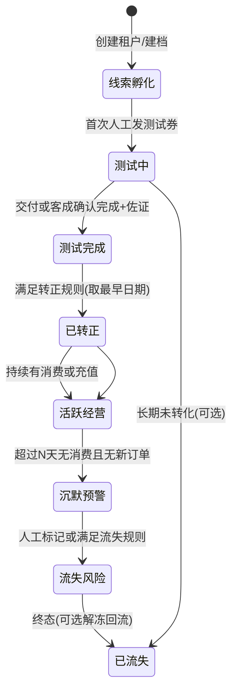
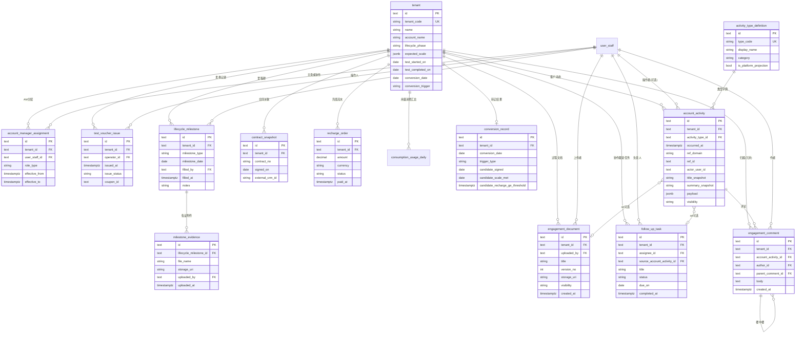

# B 端租户全生命周期服务与客户经理运营 — 产品设计

**文档类型**：产品设计（流程、状态、运营工作台）  
**适用场景**：闲时算力调度平台 — 对租用算力资源的 B 端租户进行客户经理制服务、测试与转正周期管理、充值与消费跟踪  
**版本**：v1.4  
**范围**：不含技术实现与业务代码，聚焦角色分工、生命周期口径、**以客户动态（Activity）统一承载的经营与协作信息**、实体关系与运营能力清单。

---

## 1. 背景与产品目标

### 1.1 背景

B 端租户从首次触达、发券测试、规模验证到签约与持续消费，涉及销售、客成/交付、财务与平台运营等多角色协作。若缺乏统一的「谁负责谁」「当前处于哪一阶段」「关键里程碑是否有佐证」等口径，容易出现跟进断层、状态争议、无法复盘转化效率等问题。

### 1.2 产品目标

1. **客户经理责任制**：为每个**租户**（计费隔离与 CRM 经营合一主体，见 §2）配置主责与协作客户经理，明确服务边界与交接规则。  
2. **算力规模可解释**：在租户维度沉淀「预期规模 / 当前观测规模」等字段，支持来自合同、商务承诺与平台用量数据的**分层展示**，避免单一数字与事实脱节。  
3. **测试与转正可审计**：测试起止、转正日期有**系统可自动采集**与**必须人工确认**的混合口径；人工节点强制**佐证材料**（如截图、合同扫描件），满足内控与复盘。  
4. **经营状态一盘棋**：对充值、消费、余额、欠费、优惠券与测试资源等建立**运营视图**，支撑日常跟进、预警与报表。  
5. **客户动态一盘棋**：客户经理/销售在权限范围内可查看其负责客户的**认证、充值、提现、退款、订单、开票、算力任务（Serverless/Job/云主机等）、裸金属订单**等平台事实，并与**人工纪要、过程文档、协作跟进任务、评论**在同一套**客户动态（Activity）**时间线中按类型展示、筛选与下钻，支撑交接、复盘与合规审计；**跟进责任发生变更时**，对「现任」与「前负责人」的数据可见范围按 §8.5.1 硬边界区分，防止离职/交接后仍窥视客户后续经营细节。

---

## 2. 名词与范围定义

| 名词 | 定义 |
|------|------|
| **租户（Tenant）** | 在平台注册并具备独立**计费、资源隔离与 CRM 经营档案**的 B 端主体（常见为公司主体）。逻辑模型上合并原「客户组合」经营字段为**单表 `tenant`**，客户经理归属、客户动态、里程碑、充值与转正等均通过 **`tenant_id`** 关联；**不再**使用 `commercial_account`、`tenant_binding`。若同一法人多租户或需按项目拆跟进，以**多租户**或后续「子账户 / 项目 / 商机」扩展维度承载（另行建模）。产品 UI 仍可使用「客户」「租户档案」等称呼，与「租户子用户」区分即可。 |
| **工作日** | 测试周期统计中的「日」默认指**工作日**（与国家法定工作日对齐，可配置节假日历）。用于 SLA 看板时与「自然日」区分展示。 |
| **测试券** | 平台发放的用于测试计费的优惠凭证（人工发放动作触发系统记录）。 |
| **转正** | 租户从「测试/孵化」进入「正式合作」经营态的里程碑；**转正日期**由下文规则取整。 |
| **客户动态（Activity，时间线条目）** | 客户经理/销售在**租户详情 / 客户档案**中看到的**时间轴最小单元**。每条动态有统一的**类型（activity_type）**与发生时间；平台侧动态由业务系统**投影**生成（权威数据仍在各业务域表），人工与协作类动态在 CRM/运营域落库。同一业务事件（如一次充值成功）对应**一条**主动态，状态变更可追加子类型或新版本动态（实现期约定）。 |
| **算力任务（Workload Task）** | 租户在算力平台中创建的**运行类任务**，包括但不限于 **Serverless、Job、云主机（云主机实例/长租虚机按产品定义）** 等；以调度/计费域的**任务或实例主键**为准，在客户动态中表现为 `activity_type` 为算力任务相关枚举，并可下钻至控制台任务详情（权限受控）。 |
| **协作跟进任务（Follow-up Task）** | 客户经理/客成为推进商机、测试、签约、回款等在**运营侧**创建的待办（非算力调度任务）；有负责人、截止日期与状态，可在时间线中产生「创建/完成」等动态或在列表独立管理（见第 8 节）。 |
| **过程文档（Engagement Document）** | 由内部角色上传的**经营过程材料**（方案、报价、对接清单、沟通留档等），不等同于租户在控制台自助下载的**发票 PDF**或合同系统原件；若需对齐，可在动态上**关联**合同/发票业务 ID。 |
| **评论（Comment）** | 挂载在**某条客户动态**下的讨论内容，用于追问、协同与 @ 提醒；**不**直接替代「人工纪要」正文（纪要应写在「人工沟通」类动态或关联富文本中）。 |

---

## 3. 角色与职责

| 角色 | 职责 |
|------|------|
| **客户经理（AM）** | 所负责**租户**的主责或协作跟进人；维护预期规模、推动测试与充值、更新需人工确认的里程碑与佐证；通过**客户动态**沉淀人工沟通、过程文档与**协作跟进任务**（见第 8 节）；日常查看负责客户的**认证与资金、订单与票据、算力与裸金属消费**等动态。 |
| **交付 / 客成（CS/实施）** | 配合技术接入与验收；填写**测试完成日期**及上传佐证。 |
| **销售 / 商务** | 签约信息、合同金额与条款摘要的录入或同步；可触发「签约日期」进入转正候选；查看负责客户的**客户动态**以掌握经营事实与内部协作记录（权限与 AM 同策略或可更宽，由组织配置）。 |
| **财务 / 运营** | 充值到账确认口径与异常调账协同；大额充值规则与风控策略对接。 |
| **产品 / 平台运营** | 定义生命周期状态机、报表口径、权限模型；配置阈值（如转正充值 ≥5000 元）。 |

---

## 4. 租户生命周期总览

建议将租户在经营上划分为四大阶段（可与内部 CRM 阶段映射）：

**说明**：「测试完成」与「已转正」可并存短暂窗口（例如已完成测试但尚未签约）；产品层可用**子状态**或**并行里程碑**表达，避免强行线性。

---

## 5. 测试周期（工作日）

### 5.1 测试开始日期

- **定义**：**第一次由运营/客成在系统中执行「人工发放测试券」并成功到账**的时间点（精确到秒或按日展示，内部保留审计）。  
- **规则**：若存在多次发券，仅以**最早一次**作为测试开始日期；后续发券记为「补发/加量」事件，不改变测试开始日期。  
- **工作日展示**：从测试开始日期起，可计算「已测试工作日数」用于内部看板（依赖节假日历配置）。

### 5.2 测试完成日期

- **定义**：由**交付或客成**在系统中**手动填写**的日期。  
- **必填**：**佐证材料**（至少一份文件，建议为截图、验收单、邮件摘录等），支持多附件与备注说明。  
- **校验建议**：测试完成日期 **不得早于** 测试开始日期；若业务允许「无券测试」等例外，走单独例外审批流并打标，不污染默认口径。

### 5.3 测试周期 KPI（可选）

- 测试周期长度（工作日）= 测试完成日期 − 测试开始日期（按工作日历折算）。  
- 超期未填写「测试完成」的租户清单（按 AM 分桶）。

---

## 6. 转正周期

### 6.1 转正日期的计算规则（取时间最前）

在满足下列**三类候选事件**的前提下，**转正日期 = 三者中实际发生时间最早者**：

| 候选事件 | 时间来源 | 说明 |
|----------|----------|------|
| **完成签约** | 合同「生效/签署」日期（系统同步或人工录入，需权限） | 以商务确认为准；可与 CRM 合同编号关联。 |
| **达到预期规模** | **人工填写**的「规模达标日期」 | 必须上传**佐证**（如调度截图、账单截图、用量导出）；填写行为需审计。 |
| **完成一笔充值 ≥ 5000 元** | 财务到账流水关联的**成功充值时间** | 金额口径为**实付到账**（剔除全额退款撤销的单据）；阈值可在后台配置为 5000 元。 |

**边界规则建议**：

- 若三类均未发生，则**未转正**，不生成转正日期。  
- 若同一日发生多件，转正日期仍为该日；系统可记录**全部候选事件时间线**供展示「由何事件触发转正」。  
- **达到预期规模**与「测试完成」无强制先后关系，由业务决定是否在流程上要求先完成测试再填规模达标。

### 6.2 预期规模（算力规模）与客户经理服务

- **预期规模**：建议在**租户**上维护结构化字段，例如：目标 GPU 型号、卡数或算力单位、期望启用日期、备注来源（合同条款 / 口头承诺 / 内部目标）。  
- **当前观测规模**：从平台用量、订单、资源占用等**系统自动汇总**（刷新频率与延迟在实现阶段约定），与预期对比展示**达成率**。  
- **客户经理工作台**：列表展示「未测试 / 测试中 / 待转正 / 已转正 / 沉默」等标签 + 最近一次充值与消费时间 + 余额与欠费摘要 + **最近一条客户动态时间**（见第 8 节），支持按 AM 筛选与导出。

---

## 7. 充值、消费与状态跟踪

### 7.1 建议跟踪维度

| 维度 | 用途 |
|------|------|
| 账户余额、可用额度、欠费状态 | 风控与续费提醒 |
| 充值流水（时间、金额、渠道、单据号） | 转正候选、对账 |
| 消费流水（产品形态、资源规格、时段、金额） | 规模验证、沉默识别 |
| 优惠券 / 测试券（发放、核销、剩余） | 测试成本与转化分析 |
| 里程碑时间线（发券、测试完成、签约、达标、转正） | 单客户复盘与管理层报表 |
| **客户动态（Activity）** | 认证/资金/订单/票据/算力与裸金属等行为与内部协作的**统一投影**（见第 8 节）；用于 AM/销售一屏跟进 |

### 7.2 预警示例（产品可配置）

- 测试中超过 T1 个工作日仍未有**有效消费**（定义：折后实付 > 0 或 GPU 分钟 > 阈值）。  
- 已转正但连续 T2 天**零消费**且余额低于阈值。  
- 单笔大额充值成功但未在 M 天内达到约定规模的**客成任务**（不自动改状态，仅生成任务）。

---

## 8. 客户动态（Activity）：统一时间线与类型界定

### 8.1 产品抽象：一切皆「客户动态」条目

在**租户**维度提供**唯一客户动态时间线**。时间轴上的**每一行**在交互与权限模型上统称为 **Activity（客户动态）**，通过 **`activity_type`（动态类型）** 区分语义与下钻行为：

- **平台经营类**：认证、充值、提现、退款、订单、开票、**算力任务**、**裸金属订单**等 —— 数据权威在各业务子系统（身份、资金、订单、调度/裸金属等），时间线侧为**只读投影**（可带标题/摘要快照便于扫读）。  
- **内部协作类**：人工沟通纪要、过程文档上架、协作跟进任务的生命周期事件 —— 在运营/CRM 域创建与编辑，同样投影为一条或多条客户动态（例如任务「创建」与「完成」可各一条，实现期二选一需统一口径）。

**收益**：客户经理与销售只需熟悉「一条时间线 + 类型筛选 + 下钻详情」，无需在多个后台模块间跳转才能拼出客户近况；同时保留各域主数据的**单一事实来源**。

### 8.2 客户经理 / 销售可见的平台动态类型（建议枚举）

下列类型应对齐到统一 `activity_type` 字典（展示名可中文），且**仅当**当前用户对该 **租户**（`tenant_id` 授权范围）有「负责/协作/只读」等授权时才展示；敏感子段（如完整银行卡号）遵循脱敏规则。

| 分组 | `activity_type`（示例码） | 含义与典型下钻 |
|------|---------------------------|----------------|
| 资质与认证 | `TENANT_CERTIFICATION`（可再分子状态：提交/通过/驳回/过期） | 租户认证/KYC/企业资质状态变更；下钻认证详情页。 |
| 资金 | `WALLET_RECHARGE` | 充值成功/到账确认；关联 `recharge_order`。 |
| 资金 | `WALLET_WITHDRAWAL` | 提现申请/审核/打款结果；关联提现单。 |
| 资金 | `WALLET_REFUND` | 退款发起/完成/关闭；关联退款单。 |
| 交易 | `BILLING_ORDER`（可按子类型区分预付费订单、资源订单等） | 租户订单创建、支付、完成、关闭；关联订单 ID。 |
| 票据 | `INVOICE_REQUEST` / `INVOICE_ISSUED` | 开票申请、开票完成、冲红等；关联发票或申请单。 |
| 算力消费 | `WORKLOAD_SERVERLESS` | Serverless 任务关键节点（创建、开始运行、结束、失败等，粒度由产品裁剪）。 |
| 算力消费 | `WORKLOAD_JOB` | 批处理/Job 类任务同上。 |
| 算力消费 | `WORKLOAD_CLOUD_HOST` | 云主机实例生命周期（创建、开机、释放等，以平台实例实体为准）。 |
| 算力消费 | `BARE_METAL_ORDER` | 裸金属订单状态变更（下单、交付、退订等）；与通用 `BILLING_ORDER` 并列或为其子类型，二选一需全站统一。 |

**说明**：

- **算力任务**三类（Serverless / Job / 云主机）共享「可调度工作负载」心智，但 **activity_type 分开**便于筛选与报表；若底层共用一个「任务父模型」，投影层仍建议拆分类型以利运营阅读。  
- **订单**与**裸金属订单**：若裸金属在订单系统中为独立单据，建议独立类型；若为订单 `product_line=bare_metal`，可用子类型字段表达，避免重复计数。  
- **认证 / 充值 / 提现 / 退款 / 订单 / 开票** 等事件由对应领域服务在状态变更时**写入或更新**客户动态投影（推荐异步最终一致），避免运营侧手抄。

### 8.3 内部协作类与平台类的边界界定

| 概念 | 界定 | 在时间线上的表现 |
|------|------|-------------------|
| **人工沟通纪要** | 电话/拜访/会议/即时沟通等**文字记录**，由人录入 | `activity_type = HUMAN_TOUCH`（示例），正文与渠道等可存扩展字段；**不是**评论的替代品。 |
| **过程文档** | 内部上传的文件实体（见名词表） | 推荐：**一条** `activity_type = ENGAGEMENT_DOCUMENT` 的动态 + `ref` 指向文档记录（版本、存储、可见性在文档实体上维护）；历史版本是否各生成一条动态由产品决定。 |
| **协作跟进任务** | 运营侧待办（见名词表），**不是** Serverless/Job/云主机 | `activity_type = FOLLOW_UP_TASK_CREATED` / `..._STATUS_CHANGED` / `..._DONE` 等，或合并为一条可折叠卡片；列表页可有独立「我的跟进任务」视图。 |
| **算力任务** | 租户在算力平台创建的运行任务 | 仅使用 **§8.2 算力消费** 类型；不得在命名上与「协作跟进任务」混用（UI 文案建议：「算力任务」vs「跟进任务」）。 |
| **评论** | 对**某一条客户动态**的讨论 | **必须**挂载 `account_activity_id`（见 §13）；用于协作追问；可 @ 同事、附附件；**楼中楼**仅用于评论线程，不用于承载正式纪要正文。 |

**与里程碑佐证（第 5、6 节）**：阶段结论仍以 `lifecycle_milestone` + 佐证为准；过程文档动态可与里程碑**互链**（动态上展示「关联里程碑」），避免双录时缺乏关联。

### 8.4 展示、检索与通知

- **客户详情页 / AM·销售工作台**：按时间倒序的**客户动态**流；顶部提供 **类型多选筛选**（如：仅资金类、仅算力任务、仅内部协作）。  
- **下钻**：平台类动态跳转租户控制台只读视图或内部运营详情（受角色与数据权限约束）；协作类在 CRM 侧抽屉内完成编辑。  
- **搜索**：对人工纪要正文、文档标题、评论全文做权限内检索；平台类依赖摘要字段或跳转后搜索。  
- **通知**：协作跟进任务指派/逾期、评论 @；算力任务失败、大额充值等可订阅（可选）。

### 8.5 权限与可见性（摘要）

#### 8.5.1 销售 / 客户经理：现任与前负责人（跟进变更后的数据边界）

同一**租户**上，一名内部员工可能经历「主责 / 协作 → 交接结束」或多段分配记录（`account_manager_assignment`，外键 **`tenant_id`**）。**数据可见性**在「租户历史」上按下述规则区分（在仍受敏感字段分级、角色策略约束的前提下）：

| 身份 | 判定 | 对该租户可见范围 |
|------|------|------------------|
| **现任主责或协作** | 存在一条对该 **`tenant_id` 当前有效**的分配：`effective_from ≤ 当前时刻`，且 `effective_to` 为空或 `当前时刻 ≤ effective_to` | 可查看该租户下的**全部历史信息**（含交接前已发生的客户动态、充值与消费流水、订单与票据、算力与裸金属相关事实、里程碑与内部协作类动态等），时间线**不按**本人上任日期截断。 |
| **前负责人（已不再跟进）** | 对该 **`tenant_id` 过去曾有**分配记录，且**当前时刻**不存在满足上表「现任主责或协作」判定条件的、**指向该员工**的有效分配 | **仅**可查看**跟进责任变更生效之前**已形成的历史信息：凡带业务时间戳的数据（如 `account_activity.occurred_at`、订单支付时间、任务结束时间、里程碑填写时间等），须满足 `业务时间 ≤ 该员工在该租户上对应角色分配行的责任结束时刻`（通常即 `effective_to`）。**跟进变更生效当日及之后的**新增客户动态、后续充值/消费/订单、更新后的经营概览与下钻详情等**不可见**（列表不展示、下钻与导出拦截，或统一提示「已交接，无权限查看后续数据」）。同一人多段不重叠的分配，按**各段** `effective_from…effective_to` 分别截断后再合并展示。 |

**责任结束时刻（产品口径）**：默认取该员工在该租户上**对应角色**分配行的 `effective_to`（精确到秒，与时区一致）；若一条交接拆成「旧行结束」与「新行开始」两条记录，**截断点**应与运营录入的**交接生效时刻**对齐（`旧.effective_to` = `新.effective_from` 为推荐约束）。同一人多段分配时，**前负责人**视图按**各段分别**过滤后再合并展示（仅展示各段窗口内数据，避免后段窗口泄漏）。

**与列表/工作台**：前负责人不应再出现在「我的客户」默认待办池中；若提供「历史客户」入口，仅加载上述截断前的快照式列表，且**禁止**刷新出交接后的增量。

**实现提示（非强制技术方案）**：列表与搜索在查询层统一带 `occurred_at`（或各域权威表业务时间）与「当前用户对该租户的最大可见截止时间」比较；各域只读下钻 API 与导出任务同样校验，避免通过深链绕过时间线 UI。

| 可见性级别 | 含义 |
|------------|------|
| 内部默认 | **现任**主责/协作：见 §8.5.1；**前负责人**：见 §8.5.1 截断规则。无分配记录的用户不可见该租户经营明细（管理员等特权角色另策）。平台类动态随租户数据权限与时间边界双因子过滤。 |
| 内部受限 | 含敏感条款的过程文档可缩小可见角色；对应动态条目对无权限用户显示为「受限」或隐藏摘要。 |
| 租户可见（可选二期） | 租户门户侧「通知/工单」若投影到同一时间轴，须与内部动态**分区或分 Tab**，并打标来源。 |

所有新建、编辑、删除（若允许软删）及可见性变更应写入**审计日志**。

---

## 9. 关键能力清单（模块级）

1. **租户档案**：AM 主责/协作、行业与标签、预期规模与备注（与计费主体同一 `tenant`）。  
2. **测试券发放台**：人工发券动作与审计；反查「首次发券时间」作为测试开始。  
3. **里程碑与佐证**：测试完成、规模达标等表单项 + 多附件 + 操作者与时间。  
4. **转正计算与展示**：三候选日期维护、系统自动取 min、展示触发原因与时间线。  
5. **经营概览**：充值、消费、余额、券、订单摘要；下钻至流水列表。  
6. **客户动态中心**：统一时间线展示 §8.2 全部类型 + 内部协作类；支持类型多选筛选、下钻各业务详情（权限内）。  
7. **协作跟进任务中心**：与算力任务文案区分；指派、状态、逾期与完成说明；任务事件写入客户动态。  
8. **看板与导出**：按 AM、阶段、行业筛选；测试周期与转正漏斗；可选统计各 `activity_type` 频次与跟进任务 SLA。  
9. **权限与审计**：敏感字段（签约金额、合同）分级；客户动态投影写入方、人工协作内容与评论的变更均写审计日志。  
10. **跟进交接与数据边界**：`account_manager_assignment` 生效区间驱动「现任全历史 / 前负责人截断」查询（§8.5.1）；交接操作写审计，导出与 API 与 UI 同策略。

---

## 10. 权限与合规（摘要）

- **客户经理 / 销售（现任）**：对当前负责的租户，可见**全量历史**经营与客户动态（§8.5.1）；里程碑等在角色策略内可编辑；不可擅自改财务到账事实。  
- **客户经理 / 销售（前负责人）**：仅可见交接生效时刻**之前**的历史数据，交接后的租户侧增量与内部协作更新均不可见（§8.5.1）；禁止通过导出或 API 获取交接后明细。  
- **交付/客成**：可填写测试完成及上传佐证；可协同填写规模达标（若流程如此分配）。  
- **商务/销售**：维护签约与合同关联信息（现任路径下；前负责人若仅查看历史，编辑类能力应按角色另行收敛）。  
- **财务**：充值流水状态为权威源之一；调账走独立流程并留痕。  
- **佐证文件**：访问控制、留存周期与脱敏要求按公司合规制度执行（产品需支持权限与下载审计）。  
- **客户动态与协作**：过程文档下载、评论可见范围调整、协作跟进任务重新指派、人工纪要删改等敏感操作单独审计（可与通用审计合并字段，但事件类型需可区分）。

---

## 11. 分期落地建议

| 阶段 | 范围 | 价值 |
|------|------|------|
| MVP | 租户档案 + AM 绑定（`tenant_id`）+ 首次发券记测试开始 + 测试完成（手填+附件）+ 充值流水展示 + 转正三条件手填/半自动（充值自动） | 跑通「跟进的单一事实来源」 |
| 二期 | 用量自动汇总、沉默预警、看板与导出、与 CRM/合同系统对接 | 规模化运营效率 |
| 二期并行建议 | **客户动态（Activity）统一时间线**：平台侧认证/资金/订单/票据/算力任务/裸金属等投影 + 人工纪要/过程文档/协作跟进任务 + 评论 | AM/销售一屏掌握客户事实与内部协作 |
| 三期 | 预测评分、自动化任务分派、客成 playbook | 增长与留存深化 |

---

## 12. 验收标准（产品侧）

1. 任一租户可从 **AM → 测试起止 → 转正候选与最终转正日期 → 关键充值/消费**完整追溯（经营与计费同一主键）。  
2. 测试开始日期仅由**首次成功人工发测试券**推导，有不可抵赖的审计记录。  
3. 测试完成、规模达标等人工节点**无佐证不可提交**（或提交为草稿不可进入统计）。  
4. 转正日期与「由哪一候选事件触发」在详情页可对用户解释一致。  
5. 工作日口径在涉及 SLA 的报表中与「自然日」区分展示，节假日历可配置。  
6. 任一租户在授权范围内可查看**客户动态**时间线，`activity_type` 至少覆盖 §8.2 所列平台类型（可按分期逐步点亮），且与内部协作类型在同一筛选器内可区分。  
7. **协作跟进任务**与**算力任务（Serverless/Job/云主机）**在 UI 与枚举上**不得混名**；评论仅挂载于客户动态条目，可追溯作者与时间。  
8. **跟进变更后**：现任销售/客户经理可查看该租户**全部历史**；前负责人仅可见**交接生效时刻之前**的数据，交接后的动态与经营明细不可访问（抽查下钻与导出校验）。

---

## 13. 业务实体与实体关系（逻辑模型）

本节识别**可持久化或可对接同步**的核心业务对象，给出建议英文逻辑名，关系用 Mermaid `erDiagram` 表达。实现时可按服务拆分表结构，但逻辑关系应保持一致。

### 13.1 实体清单

| 建议逻辑实体 | 中文含义 | 核心职责 |
|--------------|----------|----------|
| `tenant` | 租户 | **计费隔离 + CRM 经营合一**：法人/主体、对外编码、展示名、生命周期与规模/测试/转正等字段；与 [数据库逻辑模型](./database-schema-structure.md) §1 对齐。 |
| `account_manager_assignment` | 客户经理/销售分配 | 主责/协作、**生效区间**（`effective_from` / `effective_to`）、交接记录；外键 **`tenant_id`**；`effective_to` 为「前负责人」数据可见上界（§8.5.1），并参与报表归属切片。 |
| `user_staff` | 内部员工/系统用户 | AM、客成等操作者主数据（或对接 HR/SSO）。 |
| `test_voucher_issue` | 测试券发放记录 | 单次发放审计；**首次成功发放**推导测试开始。 |
| `promo_coupon` / `wallet_coupon` | 优惠券实例 | 若与发放记录分离，发放记录 FK 指向券实例。 |
| `lifecycle_milestone` | 生命周期里程碑 | 类型：测试完成、规模达标、签约等；含日期、填写人、佐证附件组。 |
| `milestone_evidence` | 里程碑佐证 | 文件元数据、存储 key、哈希、上传者与时间。 |
| `contract_snapshot` | 合同摘要/关联 | 签约日期、合同编号、可选金额摘要；可与外部 CRM 同步。 |
| `recharge_order` | 充值订单/流水 | 金额、状态、成功时间；用于 ≥5000 判定与经营报表。 |
| `consumption_usage_daily` | 用量/消费汇总（可选粒度） | 按日/按产品汇总，支撑规模达成对比与沉默识别。 |
| `conversion_record` | 转正记录 | 缓存转正日期、触发事件类型、三候选日期快照；以流水与里程碑为源二次计算亦可。 |
| `calendar_workday` | 工作日历 | 节假日配置，支撑测试工作日统计。 |
| `account_activity` | 客户动态（时间线条目） | **统一时间线投影**：`activity_type`、`occurred_at`、`ref_domain`+`ref_id`（指向认证/资金/订单/算力任务等权威记录）、摘要快照、可见性；平台类多为只读同步，内部协作类在 CRM 写入。 |
| `engagement_document` | 过程文档 | 内部上传文件实体；上架时产生 `activity_type=ENGAGEMENT_DOCUMENT` 的 `account_activity` 并 `ref` 指向本文档。 |
| `follow_up_task` | 协作跟进任务 | 运营侧待办（非算力任务）；负责人、截止日、状态；状态变更可投影为 `account_activity`（实现期约定一条或多条）。 |
| `engagement_comment` | 评论 | **仅**挂载 `account_activity_id`；楼中楼用 `parent_comment_id`；正文与 @、附件。 |
| `activity_type_definition` | 客户动态类型字典 | `activity_type` 枚举元数据（展示名、分组、排序、是否平台投影）。 |
| `tenant_certification_record` 等（示意） | 各业务域权威表 | **认证、提现、退款、订单、开票、算力任务、裸金属订单**等以各服务已有模型为准；向 `account_activity` **投影**而非在时间线侧重复造业务状态机。 |

### 13.2 核心实体关系图

### 13.3 关系说明（简要）

- **`tenant`**：合并计费主体与 CRM 经营字段的**单表**；子账户/项目/商机等扩展另策，**不再**使用 `commercial_account` / `tenant_binding`。  
- **测试开始**：可由 `test_voucher_issue` 聚合 `MIN(issued_at WHERE issue_status=success)` 写入或缓存到 **`tenant.test_started_on`**（更新策略：仅当更早成功发券时刷新）。  
- **测试完成 / 规模达标**：统一用 `lifecycle_milestone` + `milestone_evidence`，`milestone_type` 区分枚举值。  
- **转正**：`conversion_record` 可由定时任务或提交里程碑时重算：`conversion_date = min(signed_on, scale_met_date, first_recharge_ge_5000_paid_at)`，并写入 `trigger_type` 说明优先级平局时的规则（建议：仍取最早时间，触发类型可多选展示或按预设优先级展示主因）。  
- **客户动态 `account_activity`**：为时间线的**统一投影表**；`activity_type` 对齐 §8.2 与 `activity_type_definition`。`ref_domain` + `ref_id` 指向业务域权威实体（如 `recharge_order`、`workload_job`、`bare_metal_order`、认证流水 ID 等）；**禁止**在投影表内维护与权威表冲突的资金/订单状态。对**前负责人**的列表/检索须以 `occurred_at` 与对应 `account_manager_assignment.effective_to` 比较过滤（§8.5.1）。  
- **平台 → 动态**：认证、充值、提现、退款、订单、开票、算力任务（Serverless/Job/云主机）、裸金属订单等由各域在状态变更时投递**幂等**投影（建议带业务唯一键去重，如 `order_id + event_seq`）。  
- **人工沟通**：`activity_type = HUMAN_TOUCH` 时，`payload` 或扩展子表承载渠道、纪要正文、下一步；不必单独保留已废弃的 `engagement_activity` 表名（若历史代码已用，可迁移为上述类型）。  
- **`engagement_document` / `follow_up_task`**：实体仍独立存储版本与任务状态；时间线通过 `account_activity` 的 `ref` 或「任务状态变更事件」关联展示。  
- **`follow_up_task.source_account_activity_id`**：可选，表示由某条人工沟通类客户动态衍生出的跟进任务。  
- **`engagement_comment`**：**必须**含 `account_activity_id`；若需对里程碑讨论，先为里程碑生成一条客户动态（`ref` 指向 `lifecycle_milestone`）再挂载评论。  
- **UI 融合查询**：以 `account_activity.occurred_at` 为主排序键；里程碑、发券等若也要进时间线，或投影为 `account_activity`，或在查询层 UNION（实现二选一，避免双计数）。

---

## 14. 与业务口径对照表

| 业务口径 | 产品设计落点 |
|----------|----------------|
| 每个租户配置客户经理 | `tenant` + `account_manager_assignment`（`tenant_id`） |
| 了解算力规模 | `expected_scale` + `consumption_usage_daily`（及详情下钻） |
| 促成测试 | 测试券发放台 + 测试阶段标签 + 用量/消费提醒 |
| 按预定规模使用 | 预期 vs 实际对比、规模达标里程碑 + 佐证 |
| 充值和消费跟踪 | `recharge_order` + 消费流水/汇总 + 经营概览 |
| 测试开始（工作日） | `test_voucher_issue` 首次成功时间 |
| 测试完成 | `lifecycle_milestone`（测试完成）+ `milestone_evidence` |
| 转正日期取最早 | `contract_snapshot.signed_on`、`lifecycle_milestone`（规模达标）、`recharge_order`（≥5000 成功）→ `conversion_record` |
| 全生命周期服务 | 阶段状态机 + 时间线 + AM 工作台 + 审计 |
| AM/销售可见客户经营事实 | 第 8 节 §8.2；各域权威表 + 投影至 `account_activity`；现任 vs 前负责人时间边界 §8.5.1 |
| 算力任务 vs 协作任务 | 名词表 + 第 8 节 §8.3；算力任务用 `WORKLOAD_*` 动态类型；协作用 `follow_up_task` |
| 过程文档与评论 | 第 8 节 §8.3；`engagement_document` + 文档类 `account_activity`；`engagement_comment` 仅挂 `account_activity_id` |
| 客户动态可追溯 | `account_activity` + `activity_type_definition` + `engagement_comment` |

---

*本文档路径：`apps/docs/content/design/b2b-tenant-lifecycle-account-management.md`，与供应商侧生命周期文档并列，便于产品、运营与研发对齐口径。*
