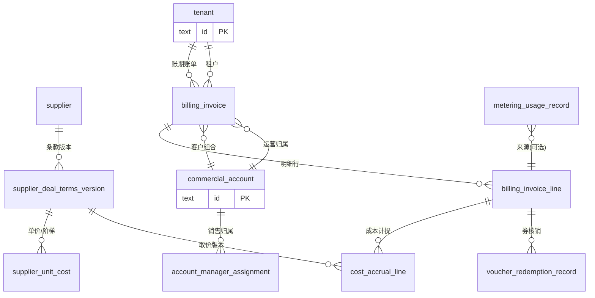

# 计费、成本与财务经营报表 — 产品设计

**文档类型**：产品设计（口径、对象模型、月结报表与权限）  
**适用场景**：闲时算力调度平台 — 供应商合作定价、租户多维消费计量、销售经营毛利与平台收入核算  
**版本**：v1.3  
**范围**：不含技术实现与账务引擎细节，聚焦**计费域与财务域的产品抽象**、**月结口径**、与租户运营/供应商资源文档的**衔接关系**。

**关联文档**：

- [B 端租户全生命周期与客户经理运营](./b2b-tenant-lifecycle-account-management.md)：**租户**（计费/资源）与 **客户组合**（运营基本单元）、客户经理与销售归属、充值与消费跟踪、客户动态投影。  
- [供应商算力资源接入与全生命周期管理](./supplier-compute-resource-lifecycle.md)：供应商、合同、机房与设备、节点、资源池与使用形态。

---

## 1. 背景与产品目标

### 1.1 背景

平台向 B 端租户按产品线与用量计费；算力资源来自多家供应商，且与供应商在**一段时间**内约定**合作模式**（分成、刊例价阶梯分成、卡时计价等）。同一供应商可有多个机房，每机房提供多种 GPU 卡型；每种卡型在当期合作模式下会派生**成本口径**（如卡时单价、或收入分成比例对应的成本计提方式）。

合作模式会随商务续约、调价、批次变更而**切换**，因此**成本价与历史消费的重算边界**必须在产品层定义清楚，否则销售毛利、平台收入与供应商对账无法对齐。

同时，运营会通过**算力券**等策略做补贴；预留资源包等预付费形态会跨月摊销。若缺乏统一的「租户级月账单 + **客户组合维**成本/收入归因 + 销售聚合」口径，财务与销售复盘、内控审计会持续争议。

### 1.2 产品目标

1. **合作模式版本化**：供应商 × 机房 × 卡型（或调度 SKU）维度，在生效时间轴上维护合作模式与参数，支持变更留痕与月结取价。  
2. **租户消费可拆分**：按月自动汇总租户级**总消费**、**卡时类消费**、**算力券核销额**，并按**产品线**拆解，满足经营分析与报表下钻。  
3. **收入与成本口径解耦**：区分「对租户标价/实收」「算力券营销负担」「对供应商成本计提（卡时 / 分成等）」，支撑毛利与平台收入两类指标。  
4. **销售经营闭环**：在客户经理 / 销售归属（**客户组合** `commercial_account_id` 维度）下，输出**每人每月带来的毛利**等经营报表；**费用与成本明细**须同时保留 **`tenant_id`**（与计量、出账一致）与 **`commercial_account_id`**（与运营、AM 分配一致），并与租户生命周期、客户动态中的资金与订单类事件可解释地勾稽。  
5. **可审计**：任一报表单元可下钻到租户月账单行、资源消费明细、取用的供应商价格版本与归属销售快照；**下钻与导出受销售数据可见边界约束**（与 [B2B 租户文档 §8.5.1](./b2b-tenant-lifecycle-account-management.md) 一致：前负责人不可见交接后的租户明细）。

---

## 2. 名词与口径定义

### 2.1 与租户运营文档对齐的名词

| 名词 | 定义（本模块中的使用方式） |
|------|---------------------------|
| **租户（Tenant）** | **计费与资源隔离**主体；月结与计量事实以 **`tenant_id`** 为锚（见 [数据库逻辑模型](./database-schema-structure.md) §1、§3）。 |
| **客户组合（Commercial Account）** | **运营基本单元**；销售 / 客户经理归属与 CRM 聚合以 **`commercial_account_id`** 为锚；默认与主租户 1:1，可 `tenant_binding` 多租户合一。 |
| **计费归属单元（Billing Anchor）** | 月结汇总行须同时携带 **`tenant_id` + `commercial_account_id`**：前者对齐账单引擎与资源用量，后者对齐 AM 与毛利报表；两键关系须与主数据或绑定表一致。 |
| **客户经理分配（AM 分配）** | `account_manager_assignment`：主责 / 协作、生效区间，外键 **`commercial_account_id`**；**月结销售报表**需使用「账期末日或月内按日切片」的归属策略（见 §6.3）。**下钻权限**与运营侧「现任 / 前负责人」时间边界一致（见 §8.1）。 |

### 2.2 财务与计费专用名词

| 名词 | 定义 |
|------|------|
| **合作模式（Supplier Deal Mode）** | 平台与某一供应商在合约周期内约定的结算方式大类：**纯分成**、**刊例价阶梯分成**、**卡时计价**等；可扩展枚举。 |
| **合作条款版本（Deal Terms Version）** | 某供应商合作在**一段时间**内生效的结构化参数集合；变更产生新版本，**不得覆盖历史**（仅追加生效区间）。 |
| **成本价 / 成本口径（Unit Cost）** | 在特定版本下，对某 **机房 × 卡型（或调度 SKU）× 产品线（可选）** 解释出的单位成本：如**卡时成本**（元/GPU·小时）、或**分成比例**（平台留存 / 供应商分成，具体方向在条款中约定）。 |
| **卡时（GPU-hour 等）** | 调度与计量域产出的可计费用量单位；**必须进入租户成本**（与运营文档中「有效消费」可区分定义）。 |
| **算力券消费（Voucher Consumption）** | 租户账单中由算力券抵扣或等价折让的金额；属**运营策略**，在**平台收入**与**销售毛利所用收入侧**按本文件 §5 规则剔除或单列。 |
| **租户收入（Tenant Revenue, 报表口径）** | 账期内租户**实际应付 / 已确认收入**中，用于经营报表的一组子项之和（见 §5.1）。 |
| **租户成本（Tenant Cost, 报表口径）** | 账期内与租户用量对应的**供应商成本计提**；卡时类资源按卡时成本累加；分成类按条款从收入侧或独立计量侧计提（见 §5.2）。 |
| **平台收入（Platform Revenue, 报表口径）** | 租户实际消费带来的收入，**减去算力券消费**（见 §7.2）；与财务会计「营业收入」可对账映射时，差异在映射表中单列说明。 |
| **销售毛利（Sales Gross Profit）** | 归集到某销售（或其负责 **`commercial_account_id`** 列表下各 **`tenant_id`** 消费行）在账期内的：**租户收入 − 租户成本**（见 §7.1）；聚合与导出须能按两维下钻。 |

### 2.3 产品线（Product Line）枚举（计费拆分）

月结与报表需统一拆分至下列产品线（展示名可配置，**编码**建议稳定）：

| 编码（示例） | 产品线 |
|--------------|--------|
| `SERVERLESS` | Serverless |
| `CLOUD_HOST` | Server（云主机） |
| `BARE_METAL` | 裸金属 |
| `JOB` | Job 任务 |
| `SHARED_VOLUME` | 共享存储卷 |
| `SHARED_STORAGE_ACCEL` | 共享存储加速 |
| `IMAGE_REGISTRY` | 镜像仓库 |
| `RESERVED_PACK` | 预留资源包（预付费；内含一种或多种上述权益，拆账规则见 §4.3） |

与 [客户动态](./b2b-tenant-lifecycle-account-management.md) 中 `WORKLOAD_*`、`BARE_METAL_ORDER` 等类型的关系：动态类型侧重**过程事件**；本条产品线侧重**计费与成本科目**，二者通过「计费事件 → 产品线」映射表对齐。

---

## 3. 角色与职责

| 角色 | 职责 |
|------|------|
| **商务 / 供应商管理** | 维护供应商合同、合作条款版本、生效区间；发起调价与模式切换流程；对「成本价解释」对外部供应商对账负责。 |
| **财务** | 定义会计科目与报表映射；审核月结封账；调账、冲正、跨期分摊规则审批。 |
| **销售 / 客户经理** | 维护**客户组合**维度的 AM 归属（`commercial_account_id`，交接记录准确）；查看本人及团队授权范围内的毛利与收入报表；不直接改计量事实。 |
| **产品 / 平台运营** | 配置算力券策略科目、预留包摊销策略、报表阈值与导出权限。 |
| **研发 / 计费工程** | 计量采集、账单引擎、取价服务、月结任务与幂等；不在本文展开。 |

---

## 4. 供应商合作与成本模型（对供应商文档的延伸）

### 4.1 与合作生命周期的关系

[供应商算力资源生命周期](./supplier-compute-resource-lifecycle.md) 已覆盖合同、接入批次、设备、节点、机房、资源池等。**计费域**在此基础上增加：

- **商务结算合同**（可与接入合同为同一张或主从合同）：约束 `supplier` 层面的结算义务。  
- **合作条款版本**：挂载在 `supplier`（或 `contract`）下，按 **effective_from / effective_to** 管理。  
- **条款粒度**：至少支持 **机房（IDC）× GPU SKU（卡型）**；若同一卡型在不同资源池有不同结算价，则粒度需扩展到 **资源池或调度池 ID**（与 `resource_pool_binding` 对齐）。

### 4.2 合作模式与成本解释规则（产品层）

以下为**建议**的三种模式在「租户成本」中的解释方式（实现期可配置开关与例外审批）：

| 合作模式 | 成本如何形成 | 说明 |
|----------|----------------|------|
| **卡时计价** | 用量 × **卡时成本单价**（来自条款版本） | 单价可因机房、卡型、产品线不同；**卡时必须计入成本**。 |
| **纯分成 / 刊例价阶梯分成** | 通常按**租户该卡型/池的折前收入或刊例价收入** × **供应商分成比例**计提成本；或按条款约定以「平台留存」为成本反算 | 用户叙述中「分成模式不计入成本」若指**不计入卡时线性成本**，则在本模式中**不以独立卡时单价行**展示，而以**分成计提**作为成本；若业务坚持分成模式在毛利中**成本记 0**，必须由财务显式配置为「仅收入侧展示」并限制适用范围（内控风险高）。**默认推荐**：分成模式仍应有**可审计的成本计提**，与供应商结算一致。 |

**刊例价阶梯分成**：条款中维护阶梯表（用量区间或收入区间 → 分成比例）；月结时按账期汇总用量或收入落档。

### 4.3 合作变更与历史消费

- **新增条款版本**不得修改已关闭账期已出具报表中的数字；若商务纠错需追溯，走**调账单**（见 §6.4）并在报表附注中标记。  
- **取价时点**：默认以**消费发生时间**（计量结束时间或账单确认时间，二选一全局配置）落入的条款版本为准。  
- **预留资源包**：预收款在财务域可能分期确认收入；经营报表可选「现金收付」或「权责发生」视图。产品层至少支持：**按包内权益的实际消耗**将金额分摊到各产品线，分摊规则版本化。

---

## 5. 租户侧：收入、券与成本口径

### 5.1 租户收入（用于销售毛利）

**定义（推荐默认）**：

\[
\text{租户收入}_{\text{毛利口径}} = \text{账期内租户折后实付消费确认额（含税与否与财务对齐）} - \text{算力券核销额（经营报表剔除项）}
\]

补充规则：

- **退款 / 冲红**：按原消费归属账期调整；若账期已封账，记入**调整账期**并在原租户行关联引用。  
- **预付费 / 预留包**：按 §4.3 将**本期分摊确认的消费额**计入租户收入（与财务「收入确认」策略对齐配置）。

> 若业务要求「销售毛利」中的收入**含券**（不剔除券），须在报表配置中增加**口径开关**，并在导出列名中强制区分 `租户收入_含券` / `租户收入_剔除券`。

### 5.2 租户成本（用于销售毛利）

**定义（推荐默认）**：

- **卡时类资源**：  
  \[
  \text{成本}_{\text{卡时}} = \sum (\text{计费卡时} \times \text{对应条款版本下的卡时成本单价})
  \]  
  **卡时必须计入成本**（与用户要求一致）。  
- **分成类条款**：按 §4.2 从约定基数计提**分成成本**；**不与算力券混算**（券影响租户实付，供应商结算基数以条款定义为准：常见为折前价或刊例价，需在条款字段显式选择）。  
- **算力券**：默认**不计入租户成本**（券为平台营销负担，不形成对供应商增量结算时）；若某类券由供应商共担，需在券模板打标并进入**供应商应付**子模块（二期）。

### 5.3 租户级月自动汇总字段（系统产出）

每个 **`tenant_id` × `commercial_account_id` × 自然月**（计费归属单元）至少输出：

| 汇总字段 | 说明 |
|----------|------|
| `total_consumption_amount` | 总消费金额（可按含税/未税维度成对字段） |
| `cardtime_consumption_amount` | 卡时相关消费金额（与计量域对齐的「卡时计费行」小计） |
| `voucher_consumption_amount` | 算力券核销金额 |
| 按产品线的 `amount_by_product_line` | 各产品线折后实付或确认收入 |
| 按产品线的 `cardtime_by_product_line` | 可选；用于分析 |
| `cost_total` | 租户成本合计（卡时 + 分成计提 + 其他条款类型扩展） |

---

## 6. 月结、封账与销售归属

### 6.1 月结任务

建议月结流水线：**计量冻结 → 取价与条款匹配 → 出账 → 成本计提 → 报表聚合 → 封账**。

- **计量冻结**：账期最后一日的 T+H 时刻完成（H 可配置）。  
- **幂等**：同一 `(tenant_id, commercial_account_id, billing_period, line_type, source_id)` 不可重复入账（`commercial_account_id` 在纯租户级技术表可与主租户解析一致，但**经营报表不得丢**）。  
- **状态**：`draft` → `confirmed` → `closed`；`closed` 后租户侧仅展示，内部改数仅能通过调账单。

### 6.2 账期（Billing Period）

默认 **自然月** `[YYYY-MM]`；支持财务**自定义账期**（如 4 周制）为二期能力，但报表 API 需统一 `period_id`。

### 6.3 销售归属策略（与 AM 分配衔接）

来自 [B2B 租户文档](./b2b-tenant-lifecycle-account-management.md) 的 `account_manager_assignment`：

- **按账期末日归属（默认）**：取 `period_end` 当日有效的**主责销售**（或主责 AM，若销售与 AM 分离则分别建字段）。  
- **按日切片归属（可选）**：账期内若发生交接，将租户收入与成本按**自然日**拆分给不同销售（适合高客单价、强激励场景）。  

**与运营权限对齐（重要）**：报表中的**数字**仍按账期与归属策略完整计算（含交接前后整段，供财务与管理层使用）；但当**登录者为前负责人**时，从毛利月报下钻至**租户级**消费明细、账单行、客户动态等，须遵守 [B2B 租户文档 §8.5.1](./b2b-tenant-lifecycle-account-management.md)：**仅展示该员工责任结束时刻之前**产生的明细；交接后的行级数据不可见。现任负责人不受该截断限制，可下钻全历史账期。

- **主指标**：选定归属策略下的「单人毛利」；  
- **辅助查询**：交接前后对比、未归属清单（无有效 assignment 的**客户组合**或其下租户）。  

### 6.4 调账与追溯

- **调账单**：关联原账单行、原因码、审批流；影响报表时打 `is_adjustment=true`。  
- **供应商条款纠错**：优先影响**未封账**账期；已封账走调账或「补充结算期」由财务策略决定。

---

## 7. 核心报表定义

### 7.1 每个销售带来的毛利

\[
\text{销售毛利} = \sum_{\text{归属该销售的客户组合下各租户}} (\text{租户收入} - \text{租户成本})
\]

- **聚合维度**：`sales_staff_id` × `billing_period`（可选再按 `product_line` 下钻）。  
- **租户收入 / 租户成本**：采用 §5 默认口径；导出时拆列展示券、卡时、分成计提。

### 7.2 平台收入

\[
\text{平台收入} = \sum_{\text{全量租户}} (\text{租户实际消费带来的收入} - \text{算力券消费})
\]

- **「实际消费带来的收入」**：与财务对齐时，建议使用**已确认对客计费金额**（折后实付或权责发生制下的本期确认额），在映射表中与「营业收入」字段对照。  
- **减去算力券消费**：与用户要求一致；若存在「供应商共担券」，应按净额或分项列示，避免双减。

### 7.3 报表与下钻能力（产品能力清单）

1. **销售毛利月报**：列表 + 导出；下钻 **客户组合 → 租户 → 产品线 → 账单行**；**前负责人**下钻时按 §6.3 与 [B2B §8.5.1](./b2b-tenant-lifecycle-account-management.md) 过滤交接后的明细与导出列。  
2. **平台收入月报**：总览 + 按产品线/区域（可选）拆分。  
3. **租户月账单（对运营/财务）**：收入侧、成本侧、券、欠费、调账痕迹同屏。  
4. **供应商成本对账预览（可选）**：按供应商/机房/卡型汇总平台侧计提成本 vs 合同，辅助商务对账（非会计凭证）。

---

## 8. 权限与合规（摘要）

### 8.1 销售 / 客户经理与租户明细可见性

与 [B2B 租户全生命周期 §8.5.1](./b2b-tenant-lifecycle-account-management.md) 对齐：

- **现任**：可查看负责**客户组合**（及绑定租户）的**全部历史**账单与消费下钻（在角色允许范围内）。  
- **前负责人**：仅可查看**跟进责任变更生效之前**的历史账单与明细；**交接之后**产生的账单行、计量明细、关联客户动态等**不可下钻、不可导出**（聚合行若含交接后账期，产品可选择：整行对该用户隐藏，或拆分为「仅可见区间」子汇总，避免从汇总反推后续数据）。

### 8.2 其他角色（摘要）

- **销售 / AM（汇总能力）**：除 §8.1 外，默认可见本人及下属团队的**聚合毛利**（数字是否含交接后区间由 §6.3 与产品策略决定，须与下钻权限区分展示）；**不可见**供应商合同底价字段（可配置脱敏为「成本指数」）。  
- **商务**：可见条款全文与版本；不可改已封账消费事实。  
- **财务**：全量可见；封账与调账审批权限。  
- **审计**：条款版本变更、月结状态迁移、调账单、报表导出均记审计日志。

---

## 9. 与其他设计文档的对照表

| 其他文档概念 | 本模块落点 |
|--------------|------------|
| `tenant`（`tenant_id`） | 计费锚点；与计量、账单行、成本计提一致 |
| `commercial_account`（`commercial_account_id`） | 运营锚点；与销售毛利归属、`account_manager_assignment` 一致 |
| `account_manager_assignment` | 销售毛利归属主数据（`commercial_account_id`）；`effective_to` 为前负责人明细可见上界（对齐 B2B §8.5.1） |
| `recharge_order`、客户动态资金类 | 与「预付费 / 余额」视图互补；月结以**消费账单**为主数据源 |
| `consumption_usage_daily`（可选） | 可支撑日粒度销售切片与沉默分析；月结以明细账单为准 |
| `supplier` / `contract` / `device` / 机房 / GPU SKU / `resource_pool_binding` | 成本取价路径：机房 × 卡型 ×（池）→ 条款版本 |
| 客户动态 `WORKLOAD_*`、`BARE_METAL_ORDER` | 经营过程可追溯；财务月结以计费引擎明细为权威 |

---

## 10. 逻辑实体清单与关系（建模参考）

以下为计费 / 财务域建议实体，可与现有微服务分库，但**逻辑键**应一致。

| 建议逻辑实体 | 含义 |
|--------------|------|
| `supplier_deal_terms_version` | 供应商合作条款版本（模式、参数 JSON、生效区间） |
| `supplier_unit_cost` | 条款版本下细粒度单价或分成档（机房 × SKU × 可选 product_line） |
| `metering_usage_record` | 计量明细（**`tenant_id` 必填**；入账/报表聚合须带 **`commercial_account_id`**） |
| `billing_invoice` | 租户账期账单头（**`tenant_id` + `commercial_account_id`**） |
| `billing_invoice_line` | 账单行（**双键** + 产品线、数量、单价、折后额、券抵扣额、source_ref） |
| `cost_accrual_line` | 成本计提行（关联账单行或计量行 + `supplier_deal_terms_version_id`；**双键**与行对齐） |
| `voucher_redemption_record` | 算力券核销记录（关联账单行） |
| `reserved_pack_purchase` / `reserved_pack_amortization_schedule` | 预留包购买与摊销（可选分期） |
| `billing_period_close_log` | 封账与重跑记录 |
| `finance_adjustment_order` | 调账单 |

---

## 11. 分期落地建议

| 阶段 | 范围 | 价值 |
|------|------|------|
| MVP | 自然月月结；卡时计价成本；租户账单头/行；券核销剔除；销售按期末归属；销售毛利 + 平台收入两张核心报表 | 跑通激励与经营复盘主口径 |
| 二期 | 分成与阶梯分成条款引擎；预留包摊销；按日销售切片；供应商对账预览 | 对齐真实商务合同 |
| 三期 | 多账期、多币种、与总账凭证对接；自动化税务与发票勾稽 | 财务闭环 |

---

## 12. 验收标准（产品侧）

1. 任一租户月账单可解释：**收入构成（含产品线拆分）**、**券**、**成本计提**、**取用的供应商条款版本号与时间**。  
2. 合作条款变更后，**新开账期**自动使用新版本；**历史封账账期**数值不变（除非关联调账单）。  
3. **销售毛利**与**平台收入**可按 §7 公式从明细重算一致（允许配置口径开关，但开关状态需审计留痕）。  
4. **卡时成本**在卡时计价或混合模式下始终可在租户维度汇总展示；算力券在平台收入公式中按约定剔除或单列，不得静默吞没。  
5. 无 `account_manager_assignment` 覆盖的**客户组合**（或其租户消费行缺 `commercial_account_id`）出现在**未归属报表**，不进入销售排名直至补齐或标记例外。  
6. **前负责人**从销售毛利报表下钻租户账单时，**不得**访问交接生效时刻之后的账单行与消费明细（与 B2B §8.5.1 一致，含导出拦截）。

---

*本文档路径：`apps/docs/content/design/billing-finance-costing-reports.md`，与租户生命周期、供应商资源生命周期设计并列，供产品、财务、商务与研发对齐计费与报表口径。*
