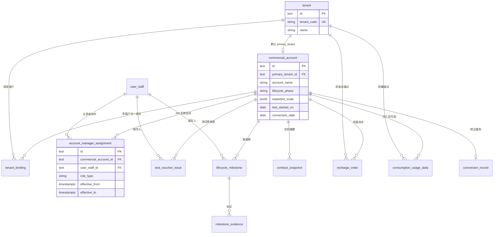
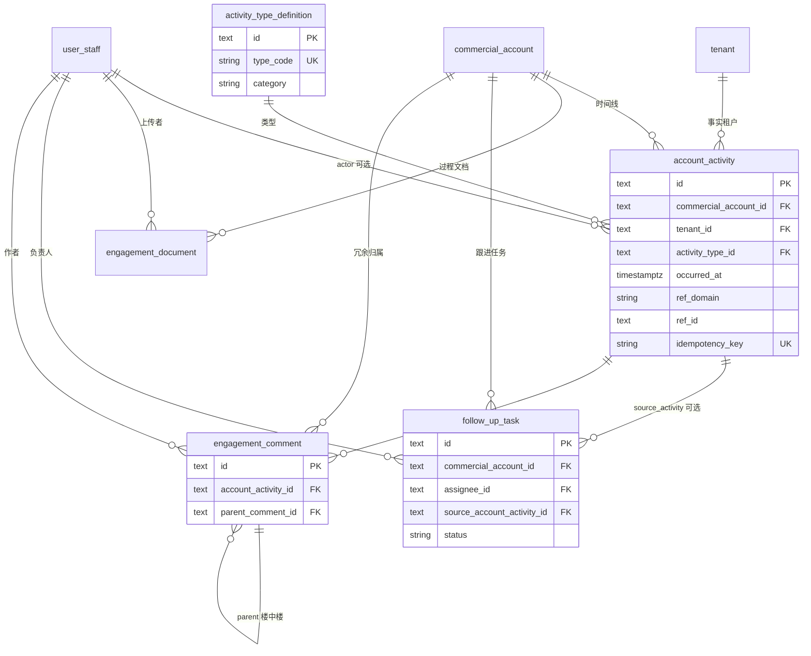
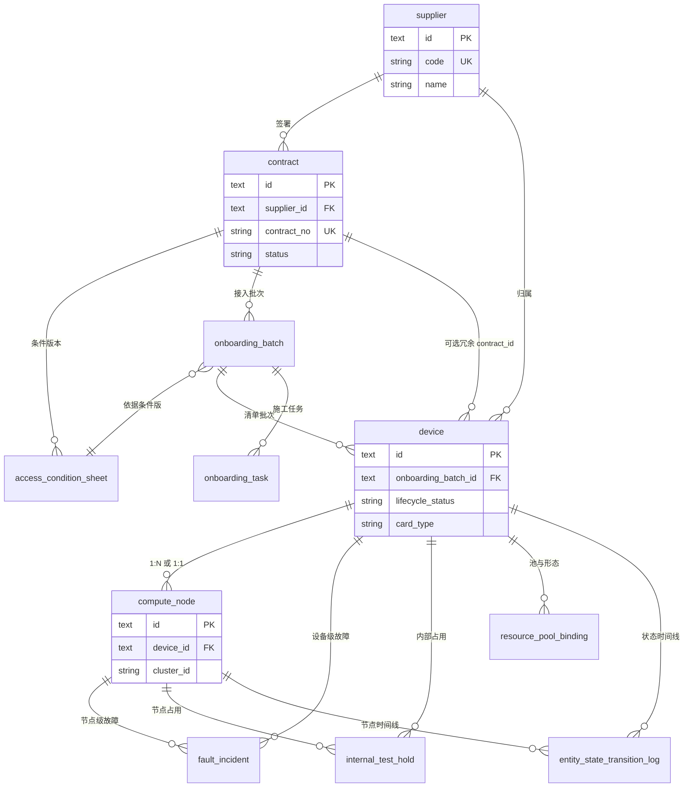
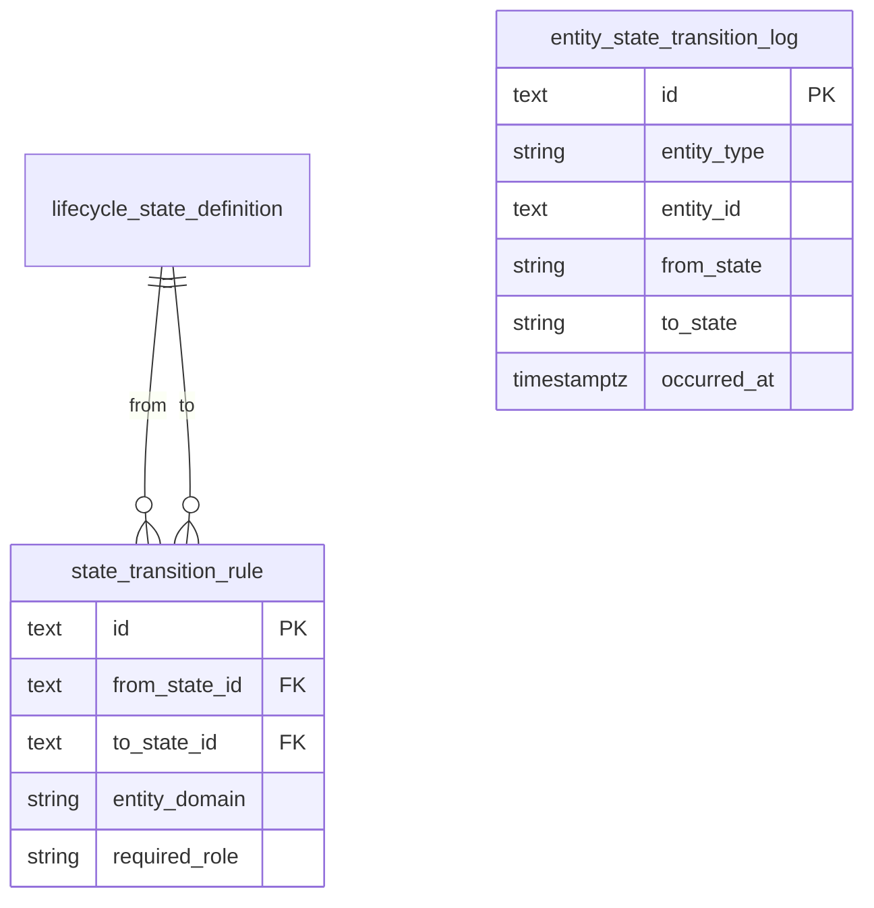
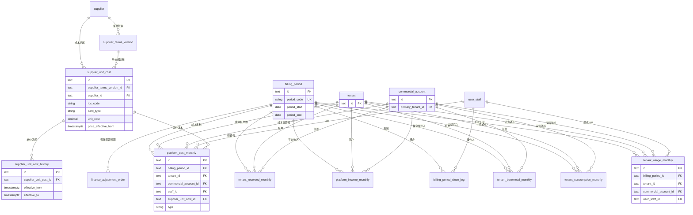
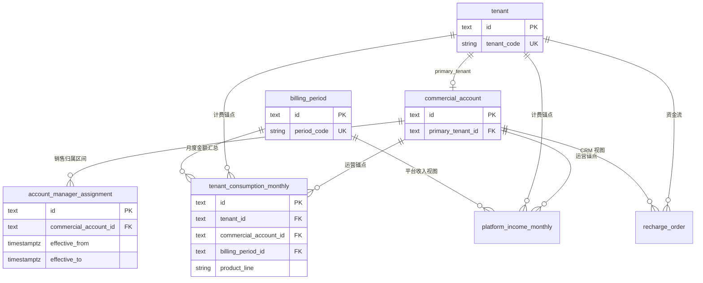
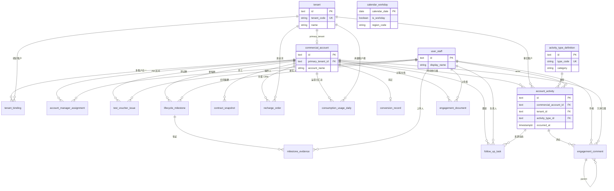
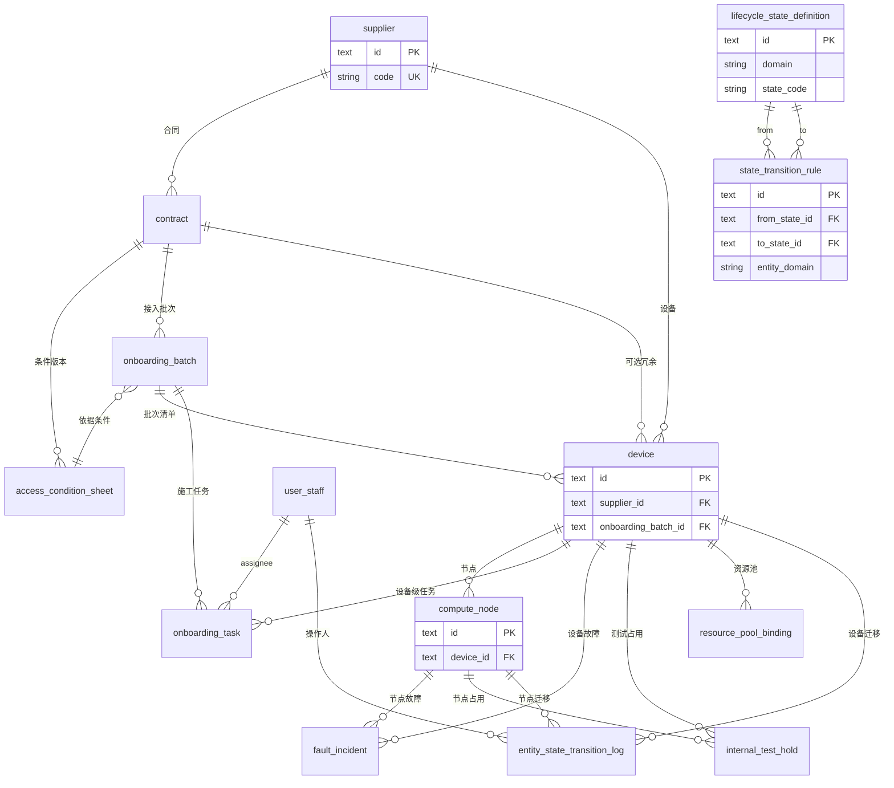
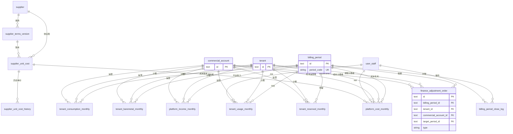

# 产品数据库表结构设计（逻辑模型）

**依据文档**：[B 端租户全生命周期与客户经理运营](./b2b-tenant-lifecycle-account-management.md)、[供应商算力资源接入与全生命周期管理](./supplier-compute-resource-lifecycle.md)、[计费、成本与财务经营报表](./billing-finance-costing-reports.md)。

**文档性质**：逻辑层表结构说明（字段类型以 PostgreSQL 风格为例），可与微服务分库分 schema；物理实现时可合并/拆表，但**外键语义与唯一约束**应与本文一致。

**通用约定**：

- 主键：`id text` PK；值由应用生成（如 ULID、nanoid、KSUID）或数据库 `gen_random_uuid()::text` 等，**全库主键与外键引用列均为 `text`**，与 `id` 同源。
- 时间：`timestamptz`；仅「日历日」业务字段用 `date`。
- 软删：需要审计保留的实体可增加 `deleted_at`；客户动态投影表建议以「追加版本」或不可变写入为主。
- 多租户隔离：**计费与资源隔离**以 `tenant_id` 为边界；**客户经理运营、CRM 时间线与销售归属**以 `commercial_account_id` 为锚（`commercial_account` 为运营基本单元，默认与主租户 1:1，可扩展多租户绑定）。**费用、成本、月结汇总、账单与调账**等经营类行数据须**同时**携带 `tenant_id`（与计量、出账、资源事实一致）与 `commercial_account_id`（与 AM 分配、毛利归属、运营下钻一致）；供应商侧以 `supplier_id` 为根。
- 审计：敏感操作除业务表外写入统一 `audit_log`（文末补充），或各域 `entity_state_transition_log` 等专用审计表。

**字段类型与命名（全文一致）**：

- **主键与外键**：一律 `text`，引用列与被引用主键列类型相同（含多态引用如 `ref_id`、`entity_id`）。
- **短文本 / 编码 / 状态枚举**：统一 `varchar`（物理层可统一为 `varchar(255)` 或与枚举长度对齐的定长；不在本文逐列写长度）。
- **长文本、富摘要、评论正文**：统一 `text`（与主键列名 `id` 的 `text` 类型同名异义，以列名区分）。
- **金额**：统一 `decimal(15,4)`（财务与消费口径一致）。
- **数量 / 用量 / 卡时 / 时长等非金额度量**：统一 `numeric`（标度与范围按域在物理层约束）。
- **费率 / 比例**（如分成比例）：`numeric`（可与金额列区分精度策略）。
- **布尔标志**：`boolean`；**小范围整型状态**（如支付/设备状态码）：`smallint`（不用 `TINYINT`）。
- **同一表内**：同类语义字段类型与命名风格保持一致；避免混用 `DATETIME` / `TIMESTAMP` 等方言别名，文档层只写 `timestamptz`。

---

## 1. B 端客户经营与 CRM 域

承载：**租户**（计费/资源主体）、**客户组合** `commercial_account`（运营基本单元）、客户经理分配、测试券、生命周期里程碑、转正、客户动态（Activity）投影、协作跟进、过程文档、评论、工作日历等。

### 1.1 表清单与字段说明

#### `tenant`（租户）

平台 **计费、资源隔离与身份** 主体；与控制台「法人/主体」对齐。CRM 经营字段在 **`commercial_account`**。

| 列名 | 类型 | 约束 | 说明 |
|------|------|------|------|
| `id` | text | PK | 租户主键 |
| `external_id` | text | UK | 租户外部系统主键 |
| `tenant_code` | varchar | UK | 对外稳定编码 |
| `name` | varchar |  | 企业法定名称 |
| `short_name` | varchar |  | 简称 |
| `cert_code` | varchar |  | 统一信用编码 |
| `status` | varchar |  | 租户状态（注册/冻结等，与身份域一致） |
| `type` | varchar | system / manual | 系统 / 手动录入 |
| `created_at` | timestamptz | NOT NULL | 创建时间 |
| `registered_at` | timestamptz | NOT NULL | 创建时间 |

#### `commercial_account`（客户组合 / 运营基本单元）

客户经理跟进、生命周期、客户动态与**销售归属**的最小单元；默认 **1:1 主租户**，可通过 `tenant_binding` 扩展多租户同属一组合。

| 列名 | 类型 | 约束 | 说明 |
|------|------|------|------|
| `id` | text | PK | |
| `primary_tenant_id` | text | FK→tenant，建议 UK（MVP 一租户一组合） | 主绑定租户 |
| `account_code` | varchar | NOT NULL UK | 项目编码 |
| `account_name` | varchar | NOT NULL | 展示名 |
| `type` | varchar | NOT NULL | 租户类型，B端/C端 |
| `lifecycle_phase` | varchar |  | 线索孵化/测试中/已转正等（与设计状态机对齐） |
| `expected_scale` | jsonb |  | 预期规模：目标 GPU 型号、卡数、来源备注等 |
| `observed_scale_summary` | jsonb |  | 可选：当前观测规模缓存（权威仍在计量域） |
| `test_started_on` | date |  | 测试开始（工作日展示用）；权威推导自首次成功发券 |
| `test_completed_on` | date |  | 测试完成日；与里程碑同步或冗余 |
| `conversion_date` | date |  | 转正日；可与 `conversion_record` 同步 |
| `conversion_trigger` | varchar |  | 主触发类型摘要（签约/规模/充值阈值等） |
| `created_at` / `updated_at` | timestamptz | | |

#### `tenant_binding`（多租户绑定到同一客户组合，可选）

| 列名 | 类型 | 约束 | 说明 |
|------|------|------|------|
| `id` | text | PK | |
| `commercial_account_id` | text | FK，NOT NULL | |
| `tenant_id` | text | FK，NOT NULL | |
| `binding_role` | varchar |  | 主从/项目线等说明 |
| `created_at` | timestamptz | | |
| 唯一约束 | | | `(commercial_account_id, tenant_id)` |

#### `user_staff`（内部员工）

可对接 HR/SSO；AM、客成、运维操作者引用此表。

| 列名 | 类型 | 约束 | 说明 |
|------|------|------|------|
| `id` | text | PK | |
| `employee_no` | varchar | UK 可选 | 工号 |
| `display_name` | varchar | NOT NULL | |
| `department` | varchar | NOT NULL | 所属部门 |
| `mobile` | varchar | NOT NULL | |
| `email` | varchar | UK 可选 | |
| `status` | varchar | | active / 离职等 |

#### `account_manager_assignment`（客户经理 / 销售分配）

**生效区间**驱动「现任全历史 / 前负责人按 `effective_to` 截断」（见 B2B 设计 §8.5.1）。

| 列名 | 类型 | 约束 | 说明 |
|------|------|------|------|
| `id` | text | PK | |
| `commercial_account_id` | text | FK→commercial_account，NOT NULL | 运营归属单元 |
| `user_staff_id` | text | FK，NOT NULL | |
| `role_type` | varchar | NOT NULL | 客户经理 / 交付 / 项目经理 / 售前 等 |
| `remark` | text | NOT NULL | 备注信息 |
| `effective_from` | timestamptz | NOT NULL | 责任开始（与交接时刻对齐） |
| `effective_to` | timestamptz | 可空 | 责任结束；空表示当前有效 |
| `created_at` | timestamptz | | |

索引建议：`(commercial_account_id, user_staff_id, effective_from)`；当前有效行可用部分索引 `WHERE effective_to IS NULL`。

#### `test_voucher_issue`（测试券发放记录）

测试开始日期 = **最早一条** `issue_status = success` 的 `issued_at`。

| 列名 | 类型 | 约束 | 说明 |
|------|------|------|------|
| `id` | text | PK | |
| `commercial_account_id` | text | FK→commercial_account，NOT NULL | |
| `operator_id` | text | FK→user_staff | 人工发放操作者 |
| `issued_at` | timestamptz | NOT NULL | 发放时间 |
| `issue_status` | varchar | NOT NULL | success / failed 等 |
| `coupon_id` | text | 可空 | 关联券实例，产品后台的coupon_id |
| `coupon_config` | jsonb | 可空 | 关联券实例的具体配置信息 |
| `remark` | text | | |

#### `lifecycle_milestone`（生命周期里程碑）

测试完成、规模达标、签约候选等统一用 `milestone_type` 区分。

| 列名 | 类型 | 约束 | 说明 |
|------|------|------|------|
| `id` | text | PK | |
| `commercial_account_id` | text | FK→commercial_account，NOT NULL | |
| `milestone_type` | varchar | NOT NULL | TEST_COMPLETE / SCALE_MET / … |
| `milestone_date` | date | NOT NULL | 业务日期 |
| `filled_by` | text | FK→user_staff | |
| `filled_at` | timestamptz | NOT NULL | |
| `remark` | text | | |

#### `milestone_evidence`（里程碑佐证附件）

| 列名 | 类型 | 约束 | 说明 |
|------|------|------|------|
| `id` | text | PK | |
| `lifecycle_milestone_id` | text | FK，NOT NULL | |
| `file_name` | varchar | NOT NULL | |
| `file_size` | varchar | NOT NULL | |
| `storage_uri` | varchar | NOT NULL | 对象存储 key 或 URI |
| `file_hash` | varchar | 可空 | 完整性校验 |
| `uploaded_by` | text | FK→user_staff | |
| `uploaded_at` | timestamptz | NOT NULL | |

#### `contract_snapshot`（合同摘要 / CRM 关联）

| 列名 | 类型 | 约束 | 说明 |
|------|------|------|------|
| `id` | text | PK | |
| `commercial_account_id` | text | FK→commercial_account，NOT NULL | |
| `contract_no` | varchar | | |
| `contract_url` | varchar | | 合同链接 |
| `signed_on` | date | | 签约/生效日（转正候选之一） |
| `amount_summary` | decimal(15,4) | 可空 | 金额摘要（权限分级） |
| `external_crm_id` | varchar | 可空 | 外部 CRM 合同 ID |

#### `recharge_order`（充值订单 / 流水）

转正候选：实付到账 ≥ 配置阈值（如 5000）的成功时间。

| 列名 | 类型 | 约束 | 说明 |
|------|------|------|------|
| `id` | text | PK | |
| `tenant_id` | text | FK→tenant，NOT NULL | 资金流与出账锚点 |
| `commercial_account_id` | text | FK→commercial_account，NOT NULL | 运营归属与 CRM 对齐 |
| `amount` | decimal(15,4) | NOT NULL | |
| `currency` | char(3) | NOT NULL | |
| `status` | varchar | NOT NULL | |
| `type` | varchar | NOT NULL | 支付类型，微信/支付宝/对公转账/线下 |
| `paid_at` | timestamptz | 可空 | 成功到账时间 |
| `external_trade_no` | varchar | UK 可选 | 渠道单号幂等 |

#### `consumption_usage_daily`（用量 / 消费日汇总，可选）

支撑沉默识别、规模达成率；**月结权威**仍在计费明细。

| 列名 | 类型 | 约束 | 说明 |
|------|------|------|------|
| `id` | text | PK | |
| `tenant_id` | text | FK→tenant，NOT NULL | 用量归属租户 |
| `commercial_account_id` | text | FK→commercial_account，NOT NULL | 运营聚合与报表 JOIN |
| `usage_date` | date | NOT NULL | |
| `product_line` | varchar | | 产品线编码 |
| `unit` | varchar | | 计价单位，卡时 |
| `amount` | decimal(15,4) | | 与计费货币口径一致时 |
| `balance` | decimal(15,4) | | 余额消费 |
| `coupon` | decimal(15,4) | | 券消费 |
| `gpu_seconds` 等 | numeric | | 卡时、秒等非金额度量 |
| `gpu_seconds_coupon` 等 | numeric | | 券消费卡时、秒等非金额度量 |
| `gpu_seconds_balance` 等 | numeric | | 余额消费卡时、秒等非金额度量 |
| 唯一约束 | | | `(tenant_id, commercial_account_id, usage_date, product_line, …)` 或按域裁剪；须能唯一标识「租户 × 组合 × 日 × 产品线」汇总 |

#### `conversion_record`（转正记录 / 缓存）

`conversion_date = min(签约日, 规模达标日, 首次大额充值成功时间)`；三候选可存快照便于解释。

| 列名 | 类型 | 约束 | 说明 |
|------|------|------|------|
| `id` | text | PK | |
| `commercial_account_id` | text | FK→commercial_account，UK | 每组合至多一条当前有效记录或版本表 |
| `conversion_date` | date | NOT NULL | |
| `trigger_type` | varchar | NOT NULL | 主触发原因 |
| `remark` | text |  | 备注说明 |
| `candidate_signed_on` | date | 可空 | |
| `candidate_scale_met_on` | date | 可空 | |
| `candidate_recharge_ge_threshold_at` | timestamptz | 可空 | |
| `computed_at` | timestamptz | NOT NULL | 重算时间 |

#### `calendar_workday`（工作日历）

| 列名 | 类型 | 约束 | 说明 |
|------|------|------|------|
| `calendar_date` | date | PK | |
| `is_workday` | boolean | NOT NULL | |
| `region_code` | varchar | PK 复合或 FK | 与国家/地区节假日配置对齐 |

#### `activity_type_definition`（客户动态类型字典）

| 列名 | 类型 | 约束 | 说明 |
|------|------|------|------|
| `id` | text | PK | |
| `type_code` | varchar | UK | 如 `WALLET_RECHARGE`、`WORKLOAD_JOB` |
| `display_name` | varchar | NOT NULL | |
| `category` | varchar | | PLATFORM / INTERNAL 等 |
| `is_platform_projection` | boolean | NOT NULL DEFAULT true | |
| `sort_order` | int | | |

#### `account_activity`（客户动态 — 统一时间线投影）

**只读投影**：平台类不在此表维护与权威域冲突的状态；`occurred_at` 用于前负责人数据截断查询。

| 列名 | 类型 | 约束 | 说明 |
|------|------|------|------|
| `id` | text | PK | |
| `commercial_account_id` | text | FK→commercial_account，NOT NULL | 时间线归属 |
| `tenant_id` | text | FK→tenant，NOT NULL | 冗余：事实发生租户（多租户绑定时与 `tenant_binding` 一致） |
| `activity_type_id` | text | FK→activity_type_definition | |
| `occurred_at` | timestamptz | NOT NULL | 业务发生时间（排序主键） |
| `ref_domain` | varchar | 可空 | 如 `recharge_order`、`workload_job` |
| `ref_id` | text | 可空 | 权威记录 ID |
| `idempotency_key` | varchar | UK 可选 | 如 `order_id:event_seq` 防重复投影 |
| `actor_user_id` | text | FK→user_staff，可空 | 内部协作类操作者 |
| `title_snapshot` | varchar | | 列表展示标题 |
| `summary_snapshot` | text | | 摘要 |
| `payload` | jsonb | | 扩展字段 |
| `visibility` | varchar | | 内部默认 / 受限 等 |

索引：`(commercial_account_id, occurred_at DESC)`；可选 `(tenant_id, occurred_at DESC)` 便于按租户筛平台类动态。

#### `engagement_document`（过程文档）

| 列名 | 类型 | 约束 | 说明 |
|------|------|------|------|
| `id` | text | PK | |
| `commercial_account_id` | text | FK→commercial_account，NOT NULL | |
| `uploaded_by` | text | FK→user_staff，NOT NULL | |
| `title` | varchar | NOT NULL | |
| `version_no` | int | NOT NULL DEFAULT 1 | |
| `storage_uri` | varchar | NOT NULL | |
| `visibility` | varchar | NOT NULL | |
| `created_at` | timestamptz | NOT NULL | |

#### `follow_up_task`（协作跟进任务 — 非算力任务）

| 列名 | 类型 | 约束 | 说明 |
|------|------|------|------|
| `id` | text | PK | |
| `commercial_account_id` | text | FK→commercial_account，NOT NULL | |
| `assignee_id` | text | FK→user_staff | 负责人 |
| `source_account_activity_id` | text | FK 可空 | 由某条动态衍生 |
| `title` | varchar | NOT NULL | |
| `status` | varchar | NOT NULL | |
| `due_on` | date | 可空 | |
| `completed_at` | timestamptz | 可空 | |
| `completion_note` | text | 可空 | |

#### `engagement_comment`（评论 — 仅挂载动态）

| 列名 | 类型 | 约束 | 说明 |
|------|------|------|------|
| `id` | text | PK | |
| `commercial_account_id` | text | FK→commercial_account，NOT NULL | 冗余便于列表权限过滤 |
| `account_activity_id` | text | FK，NOT NULL | |
| `author_id` | text | FK→user_staff，NOT NULL | |
| `parent_comment_id` | text | FK 可空 | 楼中楼 |
| `body` | text | NOT NULL | |
| `created_at` | timestamptz | NOT NULL | |

**说明**：认证、提现、退款、订单、开票、算力任务、裸金属订单等**权威表在各业务域**；向 `account_activity` **幂等投影**，不在 CRM 库重复状态机。

### 1.2 关系图 — 租户、客户组合与 CRM 主数据

### 1.3 关系图 — 客户动态、协作与评论

---

## 2. 供应商与算力资源域

承载：供应商、商务合同、接入条件版本、接入批次、设备、计算节点、施工任务、故障、内部测试占用、资源池绑定、状态字典与状态迁移审计。

### 2.1 表清单与字段说明（摘要）

#### `supplier`（供应商）

| 列名 | 类型 | 说明 |
|------|------|------|
| `id` | text PK | |
| `code` | varchar UK | 供应商编码 |
| `name` | varchar | 法定名称 |
| `short_name` | varchar | 简称 |

#### `supplier_terms_version`（供应商合作条款版本）

| 列名 | 类型 | 说明 |
|------|------|------|
| `id` | text PK | |
| `supplier_id` | text | FK→supplier；与 `contract_id` 二选一归属（实现期 CHK） |
| `contract_id` | text | FK→contract，可空；商务合同锚点 |
| `deal_mode` | varchar | 卡时计价 / 分成 / 阶梯分成 |
| `terms_json` | jsonb | 参数全集 |
| `effective_from` / `effective_to` | timestamptz | **不可覆盖历史** |

#### `supplier_unit_cost`（条款下的单价或分成档 — **当前生效**）

同一 `(supplier_terms_version_id, idc_code, card_type)`（及实现期约定的其它业务键）仅存**一行**：供列表、实时取价、月结跑批默认读当前价。**调价时**：先在 `supplier_unit_cost_history` 闭合上一段 `effective_to`，再更新本行金额字段，并追加历史表新开的区间行（实现期可用事务保证一致）。

| 列名 | 类型 | 说明 |
|------|------|------|
| `id` | text PK | |
| `supplier_terms_version_id` | text | FK→supplier_terms_version |
| `supplier_id` | text | FK→supplier，与条款版本供应商一致 |
| `idc_code` | varchar | 机房编码 |
| `card_type` | varchar | 卡型或调度 SKU |
| `unit_cost` | decimal(15,4) | 可空；卡时单价等 |
| `percent` | numeric | 可空；分成比例 |
| `tier_json` | jsonb | 可空；阶梯表 |
| `price_effective_from` | timestamptz | 当前行价格自何时起生效（与历史表当前段 `effective_from` 对齐，便于展示与对账） |

#### `supplier_unit_cost_history`（单价 / 成本区间 — **不可变历史**）

按时间轴记录每次调价后的**区间快照**，用于追溯、补算历史账期、审计。区间左闭右开或全闭由实现期约定并在取价逻辑中统一；**禁止 UPDATE 已闭合区间**（纠错用新行冲正或走调账域）。

| 列名 | 类型 | 说明 |
|------|------|------|
| `id` | text PK | |
| `supplier_unit_cost_id` | text | FK→supplier_unit_cost（维度锚点） |
| `supplier_terms_version_id` | text | 冗余 FK，便于按版本扫历史 |
| `supplier_id` | text | 冗余 FK→supplier |
| `idc_code` | varchar | 机房编码 |
| `card_type` | varchar | 卡型或调度 SKU |
| `unit_cost` | decimal(15,4) | 可空；该区间内卡时单价等 |
| `percent` | numeric | 可空；该区间内分成比例 |
| `tier_json` | jsonb | 可空；该区间内阶梯表快照 |
| `effective_from` | timestamptz | 本段开始 |
| `effective_to` | timestamptz | 本段结束；**可空**表示直至被下一段替换前仍有效（闭合时写入） |
| `superseded_by_history_id` | text | 可空；FK→本表，指向「接替」本段的下一行，便于链式审计 |
| `change_reason` | varchar | 可空；调价原因编码或简述 |
| `created_at` | timestamptz | 写入时间 |
| `created_by_staff_id` | text | 可空；FK→user_staff |

#### `contract`（合同 — 接入/商务）

与计费文档中的「商务结算合同」可同表扩展 `contract_kind`，或主从合同关联。

| 列名 | 类型 | 说明 |
|------|------|------|
| `id` | text PK | |
| `supplier_id` | text FK | |
| `contract_no` | varchar UK | |
| `contract_url` | varchar | 合同链接 |
| `status` | varchar | 生效/终止等 |
| `effective_from` / `effective_to` | date | 合同生效区间 |

#### `access_condition_sheet`（接入条件单 — 版本行）

| 列名 | 类型 | 说明 |
|------|------|------|
| `id` | text PK | |
| `contract_id` | text FK | |
| `version_no` | int NOT NULL | 递增 |
| `is_current` | boolean | 当前版本标记（或按时间推导） |
| `gpu_network_cpu_terms` | jsonb | GPU/网络/CPU 等结构化条件 |

#### `onboarding_batch`（接入批次）

| 列名 | 类型 | 说明 |
|------|------|------|
| `id` | text PK | |
| `contract_id` | text FK | |
| `access_condition_sheet_id` | text FK | 依据某版条件 |
| `batch_code` | varchar | |
| `batch_status` | varchar | |
| `planned_ready_at` | timestamptz | 计划就绪时间 |

#### `device`（物理设备）

| 列名 | 类型 | 说明 |
|------|------|------|
| `id` | text PK | |
| `supplier_id` | text FK | 归属 |
| `contract_id` | text FK 可空 | 冗余便于大盘按合同筛选 |
| `onboarding_batch_id` | text FK | 清单批次 |
| `asset_no` / `sn` | varchar | 资产号、序列号 |
| `lifecycle_status` | varchar | 待接入/接入中/在线/返修… |
| `onboarding_substage` | varchar | 接入中子阶段 |
| `idc_region` | varchar | 机房地域 |
| `idc_code` | varchar | 机房地域编码 |
| `gpu_count` | numeric | | GPU 卡数 |
| `card_type` | varchar | 卡型 |
| `external_ip` | varchar | 外网ip |
| `internal_ip` | varchar | 内网ip |

#### `compute_node`（计算节点 — 调度最小单位）

| 列名 | 类型 | 说明 |
|------|------|------|
| `id` | text PK | |
| `device_id` | text FK | 父子 1:N 或 1:1 |
| `node_role` | varchar | 管控/Worker 等 |
| `mgmt_ip` | varchar | |
| `cluster_id` | varchar | |
| `lifecycle_status` | varchar | 若与设备状态分离维护 |

#### `onboarding_task`（接入施工任务）

| 列名 | 类型 | 说明 |
|------|------|------|
| `id` | text PK | |
| `onboarding_batch_id` | text FK | |
| `device_id` | text FK 可空 | 批次级任务可空 |
| `task_type` | varchar | |
| `assignee_id` | text | FK→user_staff | |
| `task_status` | varchar | |
| `started_at` / `finished_at` | timestamptz | |

#### `fault_incident`（故障事件）

约束：`device_id` 与 `compute_node_id` **至少其一**非空。

| 列名 | 类型 | 说明 |
|------|------|------|
| `id` | text PK | |
| `device_id` | text FK 可空 | |
| `compute_node_id` | text FK 可空 | |
| `severity` | varchar | |
| `incident_status` | varchar | |
| `resolution_outcome` | varchar | **闭环必填** |
| `opened_at` / `closed_at` | timestamptz | |

#### `internal_test_hold`（内部测试占用）

| 列名 | 类型 | 说明 |
|------|------|------|
| `id` | text PK | |
| `device_id` / `compute_node_id` | text FK 可空 | 按粒度二选一或同时 |
| `scope` | varchar | GPU 粒度等说明 |
| `hold_from` / `hold_until` | timestamptz | |

#### `resource_pool_binding`（资源池 / 使用形态绑定）

| 列名 | 类型 | 说明 |
|------|------|------|
| `id` | text PK | |
| `device_id` | text FK | |
| `resource_pool_id` | text 可空 | 若无独立池表可用 `pool_code` |
| `workload_profile` | varchar | BARE_METAL / SERVERLESS / JOB / CLOUD_HOST |
| `is_exclusive_pool` | boolean | 是否互斥池 |

#### `lifecycle_state_definition`（状态字典）

| 列名 | 类型 | 说明 |
|------|------|------|
| `id` | text PK | |
| `domain` | varchar | device / compute_node |
| `state_code` | varchar | UK 复合 (domain, state_code) |
| `display_name` | varchar | |
| `sort_order` | int | |

#### `entity_state_transition_log`（状态变更审计）

| 列名 | 类型 | 说明 |
|------|------|------|
| `id` | text PK | |
| `entity_type` | varchar | device / compute_node |
| `entity_id` | text | |
| `from_state` / `to_state` | varchar | |
| `operator_id` | text | FK→user_staff |
| `reason_code` | varchar | |
| `occurred_at` | timestamptz | |

可选：`state_transition_rule`（`from_state_id` → `to_state_id`，角色约束）见供应商设计附录。

### 2.2 关系图 — 接入主链路（供应商 → 节点）

### 2.3 关系图 — 状态字典与迁移规则（可选）

---

## 3. 计费、成本与月结域

承载：供应商合作条款版本、单价/阶梯成本（当前行 + `supplier_unit_cost_history` 区间历史）、计量明细、租户账单头行、成本计提、券核销、预留包与摊销、封账日志、财务调账。

### 3.1 表清单与字段说明（摘要）

#### `billing_period`（账期，可选独立表）

| 列名 | 类型 | 说明 |
|------|------|------|
| `id` | text PK | |
| `period_code` | varchar UK | 如 `2026-05` |
| `total_income` | decimal(15,5) | 账期总收入 |
| `total_cost` | decimal(15,5) | 账期总成本 |
| `supplementary` | decimal(15,5) | 补充收入 |
| `balance_income` | decimal(15,5) | 余额收入 |
| `baremetal_income` | decimal(15,5) | 裸金属收入 |
| `period_start` / `period_end` | date | 自然月或自定义 |

#### `tenant_usage_monthly`（租户月度消费汇总 — 卡时汇总，计成本）

| 列名 | 类型 | 说明 |
|------|------|------|
| `id` | text PK | |
| `billing_period_id` | text | FK→billing_period |
| `tenant_id` | text | FK→tenant；计费与计量锚点 |
| `commercial_account_id` | text | FK→commercial_account，NOT NULL | 运营归属与销售报表 JOIN |
| `type` | varchar | B 端 / C 端消费时的客户类型 |
| `balance` | decimal(15,4) | 余额消费（金额侧，若与卡时并存则口径与报表一致） |
| `voucher` | decimal(15,4) | 券消费 |
| `total` | decimal(15,4) | 总消费 |
| `balance_usage` | numeric | 余额消费卡时 |
| `voucher_usage` | numeric | 券消费卡时 |
| `card_type` | varchar | GPU 型号 / SKU |
| `idc_code` | varchar | 机房编码 |
| `user_staff_id` | text | FK→user_staff；客户经理，计提成用 |

**设计说明（月结收入/成本汇总行）**：`tenant_id` 与计量、出账一致；`commercial_account_id` 与 `commercial_account` / AM 分配一致，**销售毛利与运营下钻**须能同时按两维过滤。

#### `tenant_consumption_monthly`（租户月度用量汇总 — 金额汇总，计收入）

| 列名 | 类型 | 说明 |
|------|------|------|
| `id` | text PK | |
| `billing_period_id` | text | FK→billing_period |
| `tenant_id` | text | FK→tenant；计费锚点 |
| `commercial_account_id` | text | FK→commercial_account，NOT NULL | 运营归属与毛利聚合 |
| `product_line` | varchar | serverless / server / baremetal / JOB |
| `type` | varchar | B 端 / C 端消费时的客户类型 |
| `balance` | decimal(15,4) | 余额消费 |
| `voucher` | decimal(15,4) | 券消费 |
| `total` | decimal(15,4) | 总消费 |

**设计说明：**

- **数据来源**：Metabase 租户消费分析；未含裸金属收入时需叠加 `tenant_baremetal_monthly` 等导入表。导入与重算时须校验 `(tenant_id, commercial_account_id)` 与主数据一致（主租户或 `tenant_binding`）。

#### `tenant_baremetal_monthly`（租户月度裸金属订单 — 收入/成本）

| 列名 | 类型 | 约束 | 说明 |
|------|------|------|------|
| `id` | text | PK | |
| `billing_period_id` | text | FK→billing_period | |
| `order_no` | varchar | NOT NULL | 订单编号（展示用，建议 UK） |
| `tenant_id` | text | FK→tenant，NOT NULL | |
| `commercial_account_id` | text | FK→commercial_account，NOT NULL | 与主数据一致，便于组合维报表 |
| `idc_name` | varchar | 可空 | 机房名称（可反查 `idc_code`） |
| `idc_code` | varchar | 可空 | 机房编码 |
| `device_model` | varchar | 可空 | 设备型号 |
| `card_type` | varchar | 可空 | 卡型 |
| `gpu_count` | numeric | 可空 | GPU 数量 |
| `payment_status` | smallint | NOT NULL | 1 未支付 / 2 已支付 / 3 已退款 |
| `device_status` | smallint | NOT NULL | 1 正常 / 2 故障 / 3 维护中等 |
| `purchase_quantity` | numeric | NOT NULL | 购买数量 |
| `device_quantity` | numeric | NOT NULL | 设备数量 |
| `order_amount` | decimal(15,4) | NOT NULL | 订单金额 |
| `refund_amount` | decimal(15,4) | 可空，默认 0 | 退款金额 |
| `final_total_amount` | decimal(15,4) | NOT NULL | 最终总额 |

**设计说明：**

- **数据来源**：管理后台裸金属订单列表导入。

#### `platform_income_monthly`（平台月度收入明细）

| 列名 | 类型 | 约束 | 说明 |
|------|------|------|------|
| `id` | text | PK | |
| `billing_period_id` | text | FK→billing_period | |
| `project_name` | varchar | 可空 | 项目名称 |
| `tenant_name` | varchar | NOT NULL | 客户全称（展示冗余） |
| `tenant_id` | text | FK→tenant，NOT NULL | 与全文租户主键一致 |
| `commercial_account_id` | text | FK→commercial_account，NOT NULL | 运营组合维与销售归属 |
| `supplementary_consumption` | decimal(15,4) | 可空 | 补充消费金额 |
| `balance_consumption` | decimal(15,4) | 可空 | 余额消费金额 |
| `bare_metal_consumption` | decimal(15,4) | 可空 | 线上裸金属消费金额 |
| `total_consumption` | decimal(15,4) | NOT NULL | 总消费金额 |
| `created_at` | timestamptz | NOT NULL | |
| `updated_at` | timestamptz | 可空 | |

**设计说明：**

- **金额**：统一 `decimal(15,4)`。  
- **双键**：`tenant_id` 与计量/出账一致；`commercial_account_id` 与 AM、毛利月报、运营下钻一致。

#### `tenant_reserved_monthly`（租户预留资源包消费）

| 列名 | 类型 | 说明 |
|------|------|------|
| `id` | text PK | |
| `billing_period_id` | text | FK→billing_period |
| `tenant_id` | text | FK→tenant |
| `commercial_account_id` | text | FK→commercial_account，NOT NULL | 预留包费用归属运营单元 |
| `reserved_id` | varchar | 预留资源包业务编号（外部系统编码；若内部有包主数据表可改为 text FK） |
| `reserved_detail` | jsonb | 预留包配置快照 |
| `amount` | decimal(15,4) | 预留包金额 |
| `created_at` | timestamptz | NOT NULL | |
| `updated_at` | timestamptz | 可空 | |

**设计说明：**

- 计算客户经理收入时需扣除预留包对应的算力券消费（与券域对账键对齐）。

#### `platform_cost_monthly`（平台月度成本 — 客户经理毛利明细）

| 列名 | 类型 | 约束 | 说明 |
|------|------|------|------|
| `id` | text | PK | |
| `billing_period_id` | text | FK→billing_period | |
| `tenant_id` | text | FK→tenant，可空 | `type=sum` 时可为空或取主租户，按实现约定 |
| `commercial_account_id` | text | FK→commercial_account，可空 | `type=sum` 时可为空；`type=record` 时建议非空 |
| `supplier_unit_cost_id` | text | FK→supplier_unit_cost，可空 | `type=record` 时指向成本版本 |
| `account_manager` | varchar | NOT NULL | 客户经理展示名（冗余） |
| `staff_id` | text | FK→user_staff，NOT NULL | 客户经理 |
| `idc_name` | varchar | 可空 | 机房名称 |
| `idc_code` | varchar | 可空 | 机房编码 |
| `card_type` | varchar | 可空 | 卡型 |
| `type` | varchar | NOT NULL | `record` 分项 / `sum` 汇总；每客户经理每账期至多一条 `sum` |
| `balance_consumption` | decimal(15,4) | 可空 | 余额消费 |
| `balance_card_hours` | numeric | 可空 | 余额卡时 |
| `voucher_card_hours` | numeric | 可空 | 券卡时 |
| `confirmed_revenue_excl_tax` | decimal(15,4) | 可空 | 确认收入（不含税） |
| `sold_duration_cost_excl_tax` | decimal(15,4) | 可空 | 售出时长成本（不含税） |
| `gifted_duration_cost_excl_tax` | decimal(15,4) | 可空 | 赠送时长成本（不含税） |
| `gross_profit` | decimal(15,4) | 可空 | 毛利 |
| `created_at` | timestamptz | NOT NULL | |
| `updated_at` | timestamptz | 可空 | |

#### `billing_period_close_log`（封账 / 重跑）

| 列名 | 类型 | 说明 |
|------|------|------|
| `id` | text PK | |
| `billing_period_id` | text | FK→billing_period |
| `action` | varchar | close / reopen_request |
| `operator_id` | text | FK→user_staff |
| `occurred_at` | timestamptz | |

#### `finance_adjustment_order`（调账单）

| 列名 | 类型 | 说明 |
|------|------|------|
| `id` | text PK | |
| `billing_period_id` | text | FK→billing_period |
| `tenant_id` | text | FK→tenant，可空 | 与被调账单行一致 |
| `commercial_account_id` | text | FK→commercial_account，可空 | 与被调账单行一致 |
| `original_invoice_line_id` | text | 逻辑 FK→账单明细（实现期对应 `billing_invoice_line.id` 等） |
| `adjustment_amount` | decimal(15,4) | 调整后金额 |
| `origin_amount` | decimal(15,4) | 原金额 |
| `type` | varchar | NOT NULL；`income` / `cost` 等行类型 |
| `reason_code` | varchar | |
| `is_adjustment` | boolean | 报表打标 |
| `target_period_id` | text | FK→billing_period；调整入账期 |

#### `billing_invoice` / `billing_invoice_line` / `cost_accrual_line` / `metering_usage_record` / `voucher_redemption_record`（账单与计量 — 规划扩展）

与 §3.2、§4 中的「账单头行、计量取价、券核销」叙述对应；物理表可在计费服务落地。字段类型遵循本文 **text 外键同源**、金额 `decimal(15,4)`、时间 `timestamptz` 约定；未展开列清单时，账单头/行、计量行、成本计提行、券核销记录等均须携带 **`tenant_id` + `commercial_account_id`**（与 `tenant_consumption_monthly` 等月结汇总对齐）。

### 3.2 关系图 — 计费月结汇总与供应商取价

依据 §3.1 已列表明细；`billing_invoice` 等为规划扩展实体，图中未单独画出，语义见 §3.1 规划扩展小节与 §4。

### 3.3 关系图 — 租户、客户组合与销售归属（与 B2B、报表衔接）

**计费事实**以 `tenant_id` 为锚；**运营与销售归属**以 `commercial_account_id` 为锚。月结汇总表同时携带两键；`account_manager_assignment` 挂在 `commercial_account`。

### 3.4 全量逻辑 ER 图（按域汇总）

以下按 **B 端 CRM**、**供应商与接入**、**计费月结** 三域分别绘制，实体与关系与上文各表一致；渲染需支持 Mermaid `erDiagram`。`calendar_workday` 为节假日维度表，无外键指向其他业务实体，在 B 端全图中以孤立节点表示。

#### B 端客户经营与 CRM（全表）

#### 供应商与算力资源（全表）

#### 计费月结与导入汇总（全表）

---

## 4. 跨域关联与实现提示

| 场景 | 关联方式 |
|------|----------|
| 客户动态投影充值 | `account_activity.ref_domain='recharge_order'`, `ref_id` |
| 客户动态投影算力任务 | 各域任务表 → Activity；`activity_type_definition.type_code` 区分 Serverless/Job/云主机 |
| 租户成本取价 | 实时/本期默认：`metering_usage_record` 按资源归属解析 `idc_code`、`card_type`、`resource_pool_id` → 命中当前行 `supplier_unit_cost`。**回溯历史账期或重算**：按计量时刻 `occurred_at`（或账期规则）匹配 `supplier_unit_cost_history` 中 `effective_from ≤ t < effective_to`（或闭区间，与实现一致）的区间行取 `unit_cost` / `percent` / `tier_json` |
| 销售毛利月报 | 已落库的 `billing_invoice` 或月结汇总表（`platform_income_monthly` / `tenant_consumption_monthly` / `platform_cost_monthly`）× `billing_period` JOIN **`tenant_id` + `commercial_account_id`** JOIN `commercial_account` JOIN 期末有效的 `account_manager_assignment`（`commercial_account_id`） |
| 前负责人下钻 | 所有带 `occurred_at` 的明细与 `account_activity` 查询时 `occurred_at ≤ assignment.effective_to`（该员工该**客户组合**对应行） |

---

## 5. 全局审计（可选单表）

各域可统一写入：

| 列名 | 类型 | 说明 |
|------|------|------|
| `id` | text PK | |
| `actor_id` | text | FK→user_staff，可空；系统任务可空 |
| `action` | varchar | |
| `entity_type` | varchar | |
| `entity_id` | text | |
| `payload` | jsonb | 变更前后快照 |
| `occurred_at` | timestamptz | |

与 `entity_state_transition_log` 并存时：前者偏**通用合规审计**，后者偏**状态机迁移**专用查询。

---

## 6. 文档维护

- 表名、字段与枚举以三份产品设计为权威；实现期若拆分微服务，保持 **逻辑外键** 与 **幂等键**（如 Activity `idempotency_key`、账单 `(tenant_id, commercial_account_id, billing_period, line_type, source_id)`）一致。  
- 变更本结构时请同步更新本文件版本号与变更说明（可在 Git 提交信息中维护）。

**版本**：v1.5（`supplier_unit_cost` 明确为当前生效快照；新增 `supplier_unit_cost_history` 单价区间历史表；§4 租户成本取价区分实时与回溯）
