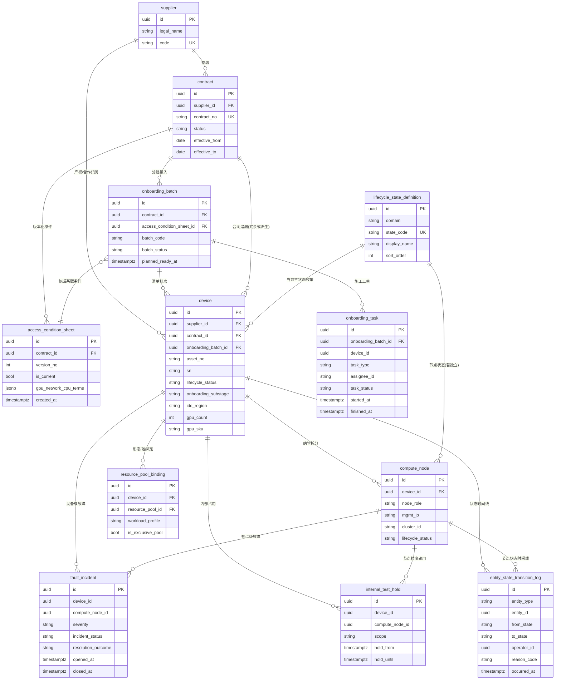
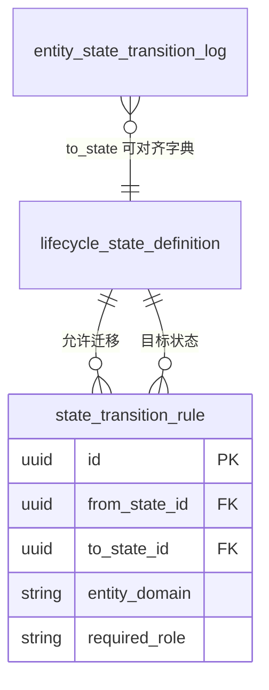

# 供应商算力资源接入与全生命周期管理 — 产品设计

**文档类型**：产品设计（流程与状态监控）  
**适用场景**：闲时算力调度平台 — 运维接入供应商设备、运营掌握全量算力资产状态  
**版本**：v1.0  
**范围**：不含技术实现与代码，聚焦业务流程、状态模型与大盘监控。

---

## 1. 背景与产品目标

### 1.1 背景

平台算力主要来自供应商设备。从合同签订到设备可对外服务，涉及销售、商务、供应商、运维等多方协作；设备在网期间还会出现故障、返修、内部测试占用等情况。若无统一流程与状态口径，容易出现「设备已上架但不可调度」「故障未闭环」「内部占用与对外售卖冲突」等问题。

### 1.2 产品目标

1. **资源接入全生命周期管理**：从商务条件沉淀、供应商清单、运维实施到可服务、故障处置、状态变更全程可追踪、可审计。  
2. **算力资产状态一盘棋**：提供**设备资源大盘**，按统一状态口径展示公司全部算力资产（含接入中、在线、返修、内部测试占用等），支持按供应商、地域、GPU 型号、业务形态等维度聚合与下钻。  
3. **与调度形态对齐**：设备接入后的使用形态包括裸金属短租、Serverless、Job、云主机；状态与容量视图需与这些形态的可用性、预留策略可解释地关联（至少不矛盾）。

---

## 2. 角色与职责边界

| 角色 | 在本模块中的职责 |
|------|------------------|
| 销售 | 与供应商确定合同；在系统中可关联「合同/项目」标识，便于后续清单与设备归属。 |
| 商务 | 录入或确认**接入条件**（GPU 规模、网络/IP 要求、是否提供 CPU 机器及配置与成本约定等），作为运维实施与验收的依据。 |
| 供应商 | 提交**接入设备清单**（可分批）；配合网络与现场信息确认。 |
| 运维 | 依据条件与清单实施接入（管控节点、Worker 等）；维护接入进度、故障标记与处置结果；执行上下线、返修等状态变更。 |
| 产品/运营 | 定义状态口径与大盘指标；协调流程；可配置内部测试占用策略（与权限结合）。 |
| 租户侧（间接） | 消费已「可服务」的资源；不直接操作供应商设备生命周期，但受状态影响（容量、可用区提示等）。 |

---

## 3. 端到端核心业务流程

下列步骤与业务叙述一一对应，并映射到系统内应存在的**阶段**与**关键动作**（非页面级 PRD）。

### 3.1 阶段 A：合同与接入条件（步骤 1–2）

1. **销售与供应商确定合同**  
   - 系统记录：合同编号、供应商主体、生效区间、关联项目/商机（可选）。  
   - 产出：**可创建接入批次**的前提（合同状态为已生效或等价口径）。

2. **商务提供接入条件**  
   - 系统记录结构化字段，建议至少包括：  
     - GPU：数量、型号、显存档位（若合同粒度到卡）。  
     - 网络：公网/专线、IP 段、端口与安全组约定、带宽。  
     - CPU 机器：是否提供、台数、CPU/内存/磁盘规格、成本归属（计费或内部码）。  
   - 产出：**接入条件单**（版本化：条件变更保留历史，避免运维按过期条件施工）。

### 3.2 阶段 B：清单与接入实施（步骤 3–4）

3. **供应商提供接入设备清单**  
   - 清单项建议字段：设备资产编号（内外部）、机位/机房、序列号、GPU 信息、管理网 IP、业务网信息、批次号。  
   - 支持**分批清单**：同一合同下多批次接入，每批次独立跟踪进度。

4. **运维实施设备接入**  
   - 按供应商网络与设备情况安装配置**管控节点**、**Worker 节点**（或平台等价组件命名）。  
   - 系统记录：施工任务、责任人、计划/实际时间、施工备注、与清单行的绑定关系。  
   - 关键检查点（可作为子状态或检查项）：网络打通、Agent/管控心跳、GPU 驱动与健康检查、与调度集群纳管成功等。

### 3.3 阶段 C：可服务与使用形态（步骤 5–6）

5. **设备对租户可用**  
   - 当纳管与健康检查通过后，设备（或节点）进入**可对外服务**相关状态；容量进入调度池。  
   - 使用形态：**裸金属短租、Serverless、Job、云主机** —— 产品层需约定：  
     - 同一物理设备是否允许多形态复用或互斥；  
     - 若互斥，通过「资源池/标签/业务域」与设备绑定，大盘需展示**形态维度占用**。

6. **内部测试占用**  
   - 支持将设备（或节点/GPU 粒度，按平台最小调度单位）标记为**内部测试预留**。  
   - 规则建议：内部占用期间**不计入对外可售容量**或单独统计为「内部占用」，避免运营误判可售资源。

### 3.4 阶段 D：故障与闭环（步骤 7–8）

7. **故障标记与处理结果**  
   - 故障事件与设备/节点关联；记录现象、开始时间、严重级别、当前处理人。  
   - **处理结果**为必选闭环字段（例如：已修复恢复在线、返修中、报废下线、误报取消等），与状态迁移联动。

8. **全状态标记与跟踪**  
   - 所有业务相关状态须在统一**状态字典**中定义，禁止仅依赖口头或表格；每次变更记录操作者、时间、原因（可选枚举+备注）。

### 3.5 阶段 E：大盘与持续运营（步骤 9）

9. **设备资源大盘**  
   - 聚合展示全公司算力资产的核心指标与分布；支持下钻至供应商、批次、机房、单设备。  
   - 与告警/心跳数据对接时，需区分「业务状态」与「瞬时监控状态」，避免口径打架（见第 5 节）。

---

## 4. 核心对象模型（产品视角）

为支撑流程与大盘，建议至少抽象以下对象（名称可按内部术语调整）：

| 对象 | 说明 |
|------|------|
| 供应商 | 法律与合作主体，关联多个合同与设备。 |
| 合同 | 商务与法务边界，关联接入条件版本。 |
| 接入条件单 | 商务输出、版本化；约束清单与施工验收。 |
| 接入批次 | 一次清单+一次或多次施工的自然分组。 |
| 设备（物理机） | 供应商清单的一行对应实体；可拆为多节点（若一台多 Worker）。 |
| 节点 | 调度与管控的最小纳管单位；与设备父子或 1:1 关系。 |
| 故障工单/事件 | 与设备或节点绑定，驱动异常类状态与处置结果。 |
| 内部测试预留 | 对设备或容量的策略标签，影响可售与大盘统计。 |

对象之间需保证：**清单行 → 设备 → 节点** 链路可追溯，便于大盘从「卡数」钻取到「单机」。

---

## 5. 状态体系设计（核心）

### 5.1 设计原则

1. **业务生命周期状态**与**实时健康/心跳**分层：大盘主展示生命周期状态；监控离线可作为子指标或告警，不必然等同于「返修」（避免抖动导致状态混乱）。  
2. 任一状态迁移需**允许原因**与**权限**（例如仅运维可将「在线」改为「返修」）。  
3. 支持**并行语义**：例如「在线」且「内部测试占用」— 可用子状态或标签表达，见 5.3。

### 5.2 建议主状态（设备或节点级，择一为主口径）

下列为建议枚举，实施时可合并或拆分，但需在大盘中可区分统计。

| 主状态 | 含义概要 |
|--------|----------|
| 待接入 | 已在清单中，尚未开始施工或纳管。 |
| 接入中 | 运维施工中（可再拆：待网络、待装机、待纳管等子阶段，见 5.4）。 |
| 验收中 | 施工完成，待联合验收或商务确认（若流程需要）。 |
| 在线 | 已纳管且健康检查通过，可参与调度（是否对外可售由标签/池策略决定）。 |
| 内部测试占用 | 在线但资源划给内部测试（若采用主状态表达）；若用标签，则主状态仍为在线。 |
| 故障待处理 | 已报障或监控判定异常，尚未分类处置。 |
| 返修中 | 硬件返修或线下维修，预期回网。 |
| 维护中 | 计划内维护、升级、迁移，短期不可用。 |
| 已下线 | 主动下线，可恢复。 |
| 已退网/报废 | 永久退出资源池，不参与调度。 |

### 5.3 子状态与标签（可选但利于运营）

- **接入中子阶段**：网络就绪、管控安装、Worker 安装、联合调试。  
- **容量形态标签**：裸金属 / Serverless / Job / 云主机（可多选或互斥池）。  
- **可售性**：可对外 / 仅内部 / 暂停售卖（合同或风控原因）。

### 5.4 状态与流程的对应关系（简表）

| 业务阶段 | 典型主状态 |
|----------|------------|
| 清单已提交、未开工 | 待接入 |
| 运维施工 | 接入中（+子阶段） |
| 可选验收环节 | 验收中 |
| 对外或对内可用 | 在线（+内部测试标签若需要） |
| 异常 | 故障待处理 → 返修中 / 维护中 / 在线 |
| 结束合作或报废 | 已退网/报废 |

### 5.5 故障与状态的联动规则（产品规则示例）

- 登记故障且确认影响业务：**在线** → **故障待处理**（或直接进入**维护中**，由严重级别策略决定）。  
- 确认需返厂：**故障待处理** → **返修中**。  
- 修复完成且验收通过：**返修中** / **维护中** → **在线**。  
- 误报或瞬时抖动：**故障待处理** → **在线**，并记录「误报」。  
- 每台设备**同时仅一个主状态**；内部测试建议用**标签**表达，避免与「在线」互斥造成统计困难。

---

## 6. 设备资源大盘（监控与展示）

### 6.1 大盘目标用户与问题

| 用户 | 典型问题 |
|------|----------|
| 产品/运营 | 全公司现在有多少卡在线？多少在接入？多少不可售？ |
| 运维 | 哪些批次卡点在网络？哪些机器长期故障未闭环？ |
| 商务/销售 | 某供应商合同下的交付进度与缺口？ |

### 6.2 建议核心指标（KPI）

- **物理设备数**、**GPU 卡数**（按型号拆分）。  
- 按主状态分布：**待接入 / 接入中 / 在线 / 故障待处理 / 返修中 / 维护中 / 已下线 / 已退网** 的数量与占比。  
- **对外可售 GPU** vs **内部占用 GPU** vs **不可用（故障+返修+维护）** 。  
- **接入 SLA**：批次维度「清单确认 → 在线」耗时分布与逾期列表。  
- **故障 MTTR**：从故障待处理到恢复在线的平均时长、未闭环清单。

### 6.3 维度与下钻

- 供应商、合同、接入批次、地域/机房、GPU 型号、业务形态（池）、时间（趋势图）。  
- 下钻路径示例：大盘卡片 → 供应商列表 → 批次 → 设备列表 → 单设备时间线（状态变更+故障记录）。

### 6.4 与监控数据的关系

- **大盘以生命周期与业务状态为准**；心跳/利用率来自监控系统，作为辅助列或二级页（如「在线但心跳异常」高亮预警）。  
- 定义统一规则：例如「业务状态=在线且连续 N 分钟无心跳」自动生成告警工单或建议转为「故障待处理」（需人工确认开关）。

---

## 7. 关键页面与功能清单（产品模块级）

1. **合同与供应商视图**：列表、详情、关联批次与条件单版本。  
2. **接入条件单**：创建、编辑（新版本）、与批次绑定。  
3. **设备清单**：导入/录入、校验与条件单差异提示、分批管理。  
4. **接入任务看板**：按批次展示子阶段进度、责任人、阻塞原因。  
5. **设备/节点详情**：当前状态、历史时间线、关联故障、标签（内部测试、形态池）。  
6. **故障中心**：登记、分派、处理结果、与状态联动。  
7. **资源大盘**：总览 + 多维筛选 + 下钻 + 导出（CSV/定期邮件可选）。  
8. **审计与操作日志**：状态变更、条件单变更、清单修改。

---

## 8. 权限与合规（摘要）

- **销售/商务**：合同与条件单只读或受限编辑；不可改设备技术状态。  
- **供应商**：仅可提交/更新清单（范围由合同授权），不可改内部状态机。  
- **运维**：设备状态、施工记录、故障闭环的主要操作方。  
- **运营**：大盘全局、内部测试策略配置、报表导出。  
- 所有敏感操作保留**审计日志**（谁、何时、从何状态到何状态、原因）。

---

## 9. 分期落地建议

| 阶段 | 范围 | 价值 |
|------|------|------|
| MVP | 接入条件单 + 清单 + 设备主状态（待接入/接入中/在线/返修/已下线）+ 简化大盘 + 故障登记与处置结果 | 先跑通主链路，大盘能回答「多少在线、多少在接」 |
| 二期 | 子阶段、内部测试标签、多形态池展示、SLA/MTTR、与监控联动规则 | 精细化运营与运维效率 |
| 三期 | 供应商门户、自动对账、预测性维护建议 | 规模化与合作深化 |

---

## 10. 验收标准（产品侧）

1. 任意一台设备可从**合同 → 条件单 → 清单行 → 施工记录 → 当前状态**完整追溯。  
2. 状态字典在后台可配置或代码枚举有**唯一文档源**，大盘与列表使用同一套口径。  
3. 故障必须**闭环**（处理结果必填）才可从故障相关状态回到在线（或进入报废等终态）。  
4. 大盘在默认时间粒度下，**各状态 GPU 合计与合同/清单理论值**可解释（允许展示「差异/待对齐」说明项）。  
5. 内部测试占用的资源在大盘中**单独可统计**，不与对外可售混淆。

---

## 附录：与业务步骤对照表

| 业务步骤 | 产品设计落点 |
|----------|----------------|
| 1 销售定合同 | 合同实体、生效门槛 |
| 2 商务接入条件 | 接入条件单（版本化） |
| 3 供应商清单 | 清单与批次、校验 |
| 4 运维接入 | 接入任务、子阶段、与节点纳管绑定 |
| 5 租户使用形态 | 资源池/标签与调度策略衔接 |
| 6 内部测试 | 标签或子状态、大盘单独统计 |
| 7 故障与结果 | 故障中心 + 状态联动 + 闭环字段 |
| 8 全状态跟踪 | 状态机 + 审计时间线 |
| 9 资源大盘 | KPI、维度、下钻、与监控分层 |

---

## 11. 业务实体与实体关系图（数据库建模参考）

本节从第 4～8 节对象与流程中**识别可持久化的业务实体**，给出英文建议表名（便于建模），关系用 Mermaid `erDiagram` 表达。实现时可按微服务拆分库表，但**逻辑关系**应保持一致。

### 11.1 实体清单与说明

| 建议逻辑实体 / 表名 | 中文含义 | 核心职责 |
|---------------------|----------|----------|
| `supplier` | 供应商 | 合作主体；设备与合同的归属根之一。 |
| `contract` | 合同 | 法务与商务边界；生效后允许创建接入批次。 |
| `access_condition_sheet` | 接入条件单（版本行） | 每条记录为一版条件（版本化）；约束验收与清单校验。 |
| `onboarding_batch` | 接入批次 | 同一合同下的分批接入单元；关联某一版条件单。 |
| `device` | 设备（物理机） | 对应清单中的可交付单元；承载生命周期主状态、机房/GPU 等。 |
| `compute_node` | 计算节点 | 调度/管控最小纳管单位；与设备 1:N 或 1:1。 |
| `onboarding_task` | 接入施工任务 | 运维施工工单；挂批次，可关联具体设备。 |
| `fault_incident` | 故障事件/工单 | 关联设备或节点；含严重级别、处理结果闭环字段。 |
| `internal_test_hold` | 内部测试预留 | 对设备或节点的占用声明；影响可售统计。 |
| `resource_pool_binding` | 资源池/形态绑定 | 设备与资源池、使用形态（裸金属/Serverless/Job/云主机）的关联。 |
| `lifecycle_state_definition` | 生命周期状态字典 | 主状态、子阶段等枚举元数据（可配置时存表，否则代码枚举+只读表）。 |
| `entity_state_transition_log` | 状态变更审计 | 通用或按设备分表；记录 from/to、操作者、原因。 |

可选扩展（未单独画图，与上表一对多挂载即可）：`crm_opportunity`（商机）、`datacenter`/`rack`（机房机位）、`gpu_inventory`（若卡级序列号独立管理）。

### 11.2 核心域实体关系图

主链路：**供应商 → 合同 → 条件单版本 → 接入批次 → 设备 → 节点**；故障、内部测试、资源池绑定挂在设备/节点上。

**建模说明（简要）**

- `contract` 与 `device`：若不做反范式，可仅通过 `onboarding_batch.contract_id` 关联合同；大盘按合同筛设备时用 `JOIN`。若查询极多，可冗余 `device.contract_id`（需一致性策略）。图中同时画出 `device.contract_id` 为可选冗余字段。  
- `onboarding_task`：可冗余 `device_id`（可空），表示任务针对单台设备；纯批次级任务则留空。图中未单独连线，避免与 Mermaid 可选基数语法兼容性问题。  
- `fault_incident`：建议约束「`device_id` 与 `compute_node_id` 至少其一非空」，且节点级故障时 `compute_node.device_id` 应可反查设备。  
- `internal_test_hold`：可与「内部测试」标签二选一；若仅标签，可退化为 `device` 上布尔/枚举字段 + 审计表。  
- `resource_pool_binding`：`resource_pool_id` 指向平台既有「资源池」主数据（若已存在）；若无独立池表，可暂用 `pool_code` 字符串 FK 逻辑关联。

### 11.3 审计与字典的补充关系（可选独立子图）

状态字典、审计日志常被多域复用，可单独成库或 schema。

> 若 `entity_state_transition_log` 仅存字符串状态码而不 FK 到字典表，则上图中 `state_transition_rule` 与日志的连线在逻辑上通过 `state_code` 关联即可。

---

*本文档存放路径：`apps/docs/content/design/supplier-compute-resource-lifecycle.md`，便于与 `content/docs` 中的用户文档区分；若需纳入文档站点导航，可在文档工程中将 `design` 目录纳入 source 或增加跳转说明。*
