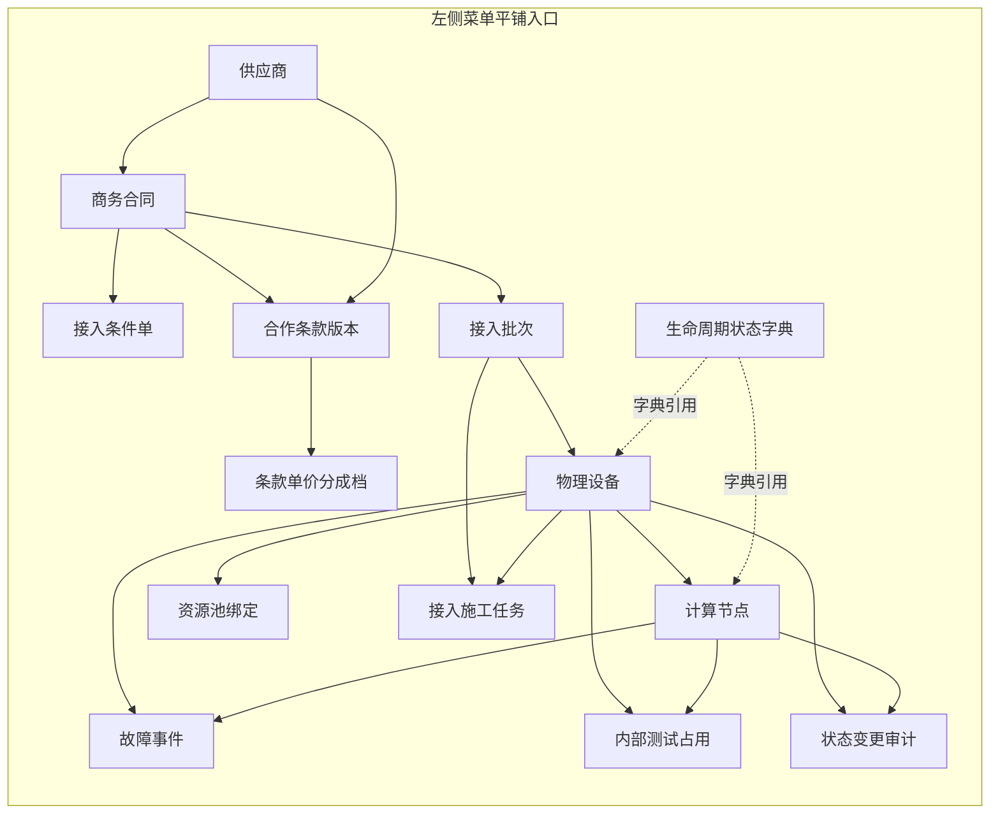

# 供应商与算力资源域 — 主表管理端线框（§2.1）

**依据**：[产品数据库表结构设计](./database-schema-structure.md) §2.1 表清单与字段说明（摘要）。

**范围**：为 §2.1 所列各主表规划 **列表 / 新建 / 详情 / 编辑 / 删除（弹窗二次确认）** 管理页面；界面字段展示为**中文**（列名与枚举值可做「代码 → 中文」映射）。

**不在本文**：具体路由实现、权限矩阵、API 契约（确认线框后再落代码）。

---

## 1. 左侧主菜单（建议结构）

一级菜单聚焦「供应商与算力资源」运营闭环；二级按主数据 → 接入链路 → 运行与审计分组。

```
供应商与算力资源
├── 供应商
├── 商务合同
├── 设备
├── 节点
├── 接入任务
├── 下架任务
├── 订单接入
├── 故障事件
└── 测试占用
├── 状态字典
└── 状态变更审计
```

**说明**：

- 「合作条款版本」与「条款单价/分成档」在数据上从属于供应商或合同，菜单仍可平铺，详情页用面包屑与「从父级进入」双路径。
- 若后续与 B 端 CRM 域合并同一后台，可将本组收拢到顶级「算力供应链」分组下，不改变各表 CRUD 页面结构。

---

## 2. 全局布局模板（单表 CRUD 共用）

所有主表页面共用**后台三栏骨架**：左侧菜单 + 顶栏（面包屑、用户）+ 主内容区。

```
┌──────────────┬────────────────────────────────────────────────────────┐
│  左侧菜单     │  顶栏：面包屑  >  当前模块  >  当前页                    │
│              ├────────────────────────────────────────────────────────┤
│              │  【列表】工具条：搜索 / 筛选 / 「新建」                   │
│              │  ┌──────────────────────────────────────────────────┐  │
│              │  │ 表格：中文列头 + 行操作「详情」「编辑」「删除」      │  │
│              │  └──────────────────────────────────────────────────┘  │
│              │  底部分页                                              │
└──────────────┴────────────────────────────────────────────────────────┘
```

- **新建 / 编辑**：主内容区替换为**表单页**（分区卡片 + 底部「保存」「取消」）。
- **详情**：只读描述列表（dl/表格）+ 顶部「编辑」「删除」+ **子表/关联入口**（链接或内嵌 Tab）。
- **删除**：任意入口触发后弹出 **Modal**：展示主键/名称摘要 +「确认删除」「取消」；删除成功后返回列表并刷新。

---

## 3. 导航关系（信息架构）

### 3.1 导航关系总览（Mermaid）




### 3.2 推荐「从详情下钻」路径（与菜单平铺互补）


| 父实体详情页 | 子实体入口（Tab 或区块链接）                     |
| ------ | ------------------------------------ |
| 供应商    | 商务合同列表、合作条款版本列表                      |
| 商务合同   | 接入条件单、接入批次、合作条款版本、物理设备（按合同筛选）        |
| 合作条款版本 | 条款单价/分成档列表                           |
| 接入批次   | 物理设备列表、接入施工任务列表                      |
| 物理设备   | 计算节点、资源池绑定、故障事件、内部测试占用、状态变更审计（按实体过滤） |
| 计算节点   | 故障事件、内部测试占用、状态变更审计（按实体过滤）            |


用户仍可通过左侧菜单直达任意子表「全量列表」；详情下钻减少迷路。

---

## 4. 各主表页面线框与字段（中文）

下列线框中，`[ ]` 为输入框，`( )` 为按钮，`{ }` 为只读展示；**列表默认展示「名称/编码 + 关键状态 + 时间」**，其余列可进详情或列配置。

---

### 4.1 `supplier`（供应商）


| 页面        | 线框要点                                            |
| --------- | ----------------------------------------------- |
| **列表**    | 列：供应商编码、法定名称、简称、操作（详情/编辑/删除）                    |
| **新建/编辑** | 区块「基本信息」：`[供应商编码]` `[法定名称]` `[简称]`              |
| **详情**    | 同上只读；链接：「下属合同」「下属条款版本」                          |
| **删除**    | 弹窗：展示法定名称/编码；若存在关联合同可提示「存在关联数据，是否仍删除」（策略由实现期决定） |


---

### 4.2 `contract`（商务合同 — 接入/商务）


| 页面        | 线框要点                                                 |
| --------- | ---------------------------------------------------- |
| **列表**    | 列：合同编号、供应商（名称）、状态、生效起、生效止、操作                         |
| **新建/编辑** | `[供应商]`（选择器）`[合同编号]` `[合同链接]` `[状态]` `[生效起]` `[生效止]` |
| **详情**    | 只读 + 入口：接入条件单、接入批次、设备（筛选本合同）、条款版本                    |
| **删除**    | 弹窗确认；提示接入批次/设备等外键约束（若有）                              |


---

### 4.3 `supplier_terms_version`（供应商合作条款版本）


| 页面        | 线框要点                                                                                        |
| --------- | ------------------------------------------------------------------------------------------- |
| **列表**    | 列：供应商或合同（二选一展示）、合作模式、生效起、生效止、操作                                                             |
| **新建/编辑** | `[供应商]` 与 `[商务合同]` 二选一或实现期 CHK 规则；`[合作模式]`；`[条款参数 JSON]`（可用 JSON 编辑器或表单化子段）；`[生效起]` `[生效止]` |
| **详情**    | 只读 + 「条款单价/分成档」列表入口                                                                         |
| **删除**    | 弹窗确认；提示下属单价档                                                                                |


---

### 4.4 `supplier_unit_cost`（条款下的单价或分成档）


| 页面        | 线框要点                                                              |
| --------- | ----------------------------------------------------------------- |
| **列表**    | 列：条款版本、供应商、机房编码、卡型/SKU、卡时单价、分成比例、操作                               |
| **新建/编辑** | `[合作条款版本]` `[供应商]` `[机房编码]` `[卡型]` `[卡时单价]` `[分成比例]` `[阶梯表 JSON]` |
| **详情**    | 只读                                                                |
| **删除**    | 弹窗确认                                                              |


*导航：优先从「合作条款版本详情」进入本表列表（预填筛选）。*

---

### 4.5 `access_condition_sheet`（接入条件单 — 版本行）


| 页面        | 线框要点                                                |
| --------- | --------------------------------------------------- |
| **列表**    | 列：商务合同、版本号、是否当前版本、操作                                |
| **新建/编辑** | `[商务合同]` `[版本号]` `[是否当前版本]` `[GPU/网络/CPU 等条件 JSON]` |
| **详情**    | 只读 + 「引用本条件的接入批次」                                   |
| **删除**    | 弹窗确认；若有批次引用则强提示                                     |


---

### 4.6 `onboarding_batch`（接入批次）


| 页面        | 线框要点                                            |
| --------- | ----------------------------------------------- |
| **列表**    | 列：批次编码、商务合同、接入条件单、批次状态、计划就绪时间、操作                |
| **新建/编辑** | `[商务合同]` `[接入条件单]` `[批次编码]` `[批次状态]` `[计划就绪时间]` |
| **详情**    | 只读 + 入口：物理设备列表、接入施工任务列表                         |
| **删除**    | 弹窗确认；提示下属设备/任务                                  |


---

### 4.7 `device`（物理设备）


| 页面        | 线框要点                                                                                                                                                         |
| --------- | ------------------------------------------------------------------------------------------------------------------------------------------------------------ |
| **列表**    | 列：资产号、序列号、供应商、批次、生命周期状态、接入子阶段、机房地域、卡型、GPU 卡数、操作                                                                                                              |
| **新建/编辑** | 分区「归属」：`[供应商]` `[商务合同]` `[接入批次]`；分区「资产」：`[资产号]` `[序列号]`；分区「状态与位置」：`[生命周期状态]` `[接入子阶段]` `[机房地域]` `[机房编码]`；分区「算力」：`[GPU 卡数]` `[卡型]`；分区「网络」：`[外网 IP]` `[内网 IP]` |
| **详情**    | 只读 + Tab：计算节点、资源池绑定、故障、内部测试占用、状态审计                                                                                                                           |
| **删除**    | 弹窗确认；提示子节点/绑定                                                                                                                                                |


---

### 4.8 `compute_node`（计算节点）


| 页面        | 线框要点                                             |
| --------- | ------------------------------------------------ |
| **列表**    | 列：所属设备、节点角色、管控 IP、集群 ID、生命周期状态、操作                |
| **新建/编辑** | `[物理设备]` `[节点角色]` `[管控 IP]` `[集群 ID]` `[生命周期状态]` |
| **详情**    | 只读 + 故障、内部测试占用、状态审计（按节点）                         |
| **删除**    | 弹窗确认                                             |


---

### 4.9 `onboarding_task`（接入施工任务）


| 页面        | 线框要点                                                             |
| --------- | ---------------------------------------------------------------- |
| **列表**    | 列：接入批次、物理设备、任务类型、负责人、任务状态、开始/结束时间、操作                             |
| **新建/编辑** | `[接入批次]` `[物理设备]`（可空）`[任务类型]` `[负责人]` `[任务状态]` `[开始时间]` `[结束时间]` |
| **详情**    | 只读                                                               |
| **删除**    | 弹窗确认                                                             |


---

### 4.10 `fault_incident`（故障事件）


| 页面        | 线框要点                                                                                   |
| --------- | -------------------------------------------------------------------------------------- |
| **列表**    | 列：设备/节点（合并展示）、严重程度、事件状态、闭环结果、打开/关闭时间、操作                                                |
| **新建/编辑** | `[物理设备]` `[计算节点]`（**至少填其一**，表单校验）；`[严重程度]` `[事件状态]` `[闭环结果]`（闭环必填提示）；`[打开时间]` `[关闭时间]` |
| **详情**    | 只读                                                                                     |
| **删除**    | 弹窗确认（运营上可改为「仅管理员」权限，实现期配置）                                                             |


---

### 4.11 `internal_test_hold`（内部测试占用）


| 页面        | 线框要点                                                      |
| --------- | --------------------------------------------------------- |
| **列表**    | 列：设备/节点、占用粒度说明、占用起止、操作                                    |
| **新建/编辑** | `[物理设备]` `[计算节点]`（按粒度二选一或同时）；`[占用粒度说明]` `[占用开始]` `[占用结束]` |
| **详情**    | 只读                                                        |
| **删除**    | 弹窗确认                                                      |


---

### 4.12 `resource_pool_binding`（资源池 / 使用形态绑定）


| 页面        | 线框要点                                          |
| --------- | --------------------------------------------- |
| **列表**    | 列：物理设备、资源池、工作负载形态、是否互斥池、操作                    |
| **新建/编辑** | `[物理设备]` `[资源池 ID 或池编码]` `[工作负载形态]` `[是否互斥池]` |
| **详情**    | 只读                                            |
| **删除**    | 弹窗确认                                          |


---

### 4.13 `lifecycle_state_definition`（状态字典）


| 页面        | 线框要点                            |
| --------- | ------------------------------- |
| **列表**    | 列：领域（设备/节点）、状态代码、显示名称、排序、操作     |
| **新建/编辑** | `[领域]` `[状态代码]` `[显示名称]` `[排序]` |
| **详情**    | 只读                              |
| **删除**    | 弹窗确认；若被迁移日志引用可警告（实现期）           |


---

### 4.14 `entity_state_transition_log`（状态变更审计）


| 页面        | 线框要点                                                                                                                                          |
| --------- | --------------------------------------------------------------------------------------------------------------------------------------------- |
| **列表**    | 列：实体类型、实体 ID、原状态、新状态、操作人、原因码、发生时间、操作                                                                                                          |
| **新建/编辑** | 审计表通常由系统写入；若产品坚持统一 CRUD：**新建**可为运维补录场景（少见）；**编辑**建议禁用或仅允许备注类扩展字段（需产品确认）。线框上仍保留表单位：`[实体类型]` `[实体 ID]` `[原状态]` `[新状态]` `[操作人]` `[原因码]` `[发生时间]` |
| **详情**    | 只读全文                                                                                                                                          |
| **删除**    | 弹窗确认。**备注**：生产环境常见策略为禁止删除或仅软删；与产品确认后可隐藏删除按钮                                                                                                   |


---

## 5. 删除确认弹窗（统一线框）

```
┌─────────────────────────────────────┐
│  确认删除                     [×]   │
├─────────────────────────────────────┤
│  确定要删除「{中文名称或编码}」吗？  │
│  此操作不可恢复（或：将标记为已删除） │
│                                     │
│        ( 取消 )    ( 确认删除 )      │
└─────────────────────────────────────┘
```

---

## 6. 确认清单（请您确认后我再生成代码）

1. **范围**：是否仅实现 §2.1 上述 14 张主表（不含 §1.1 CRM、§3.1 计费）？
2. **审计表**：`entity_state_transition_log` 是否保留「删除」按钮，还是仅列表 + 详情？
3. **技术栈**：是否沿用当前 monorepo 内 `apps/web`（如 Next.js + 既有 UI 组件）？
4. **菜单挂载**：本组菜单单独路由前缀（例如 `/admin/supplier/...`）是否与现有 `app-sidebar` 合并方式有要求？

您确认或修订以上点后，再按本文档生成具体页面与路由代码。