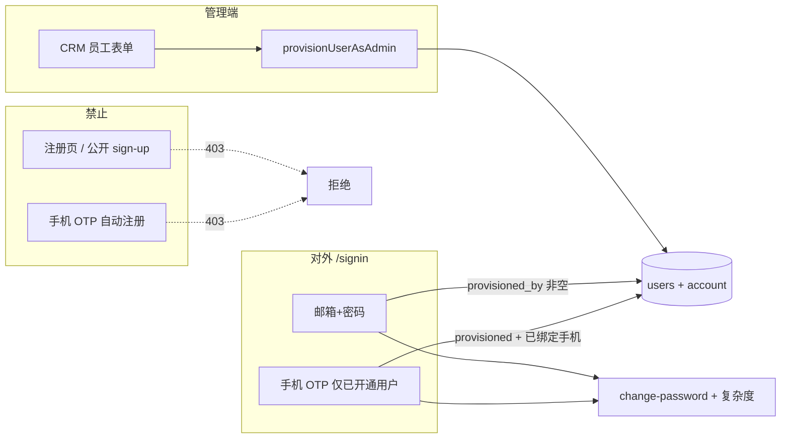

# 关闭公开注册与密码复杂度 — 实现方案

> 版本：v1.2  
> 日期：2026-06-02  
> 状态：**已实施（2026-06-02）— 上线前须执行迁移与 §9.2 回填 SQL**

---

## 1. 需求摘要

| # | 需求 | 验收标准 |
|---|------|----------|
| A1 | 禁止用户自助注册 | 无公开注册页/入口；`sign-up` API 对匿名请求返回 403 |
| A2 | 仅管理员开通的账号可登录 | 未由管理端创建的用户无法用邮箱+密码（及手机 OTP）登录 |
| A3 | 登录方式 | **邮箱+密码**（主路径）；**保留手机 OTP 登录**（仅已开通且已绑定手机号的用户）；关闭社交登录与手机自助开户 |
| A4 | 修改密码时校验复杂度 | 首次改密、设置页改密、忘记密码重置均走 §4.4.1 规则；前后端一致 |
| A5 | 与现有流程衔接 | 管理员在 CRM 员工表单「创建登录账号」仍可建号；首次登录仍强制改密 |

**本期范围**：认证与用户开通/改密（含 `provisioned_by` 字段与登录校验）。  
**不在本期**：CRM 行级权限、角色矩阵、`staff_id` 绑定等（见 [rbac-design.md](./rbac-design.md)）。

---

## 2. 现状（代码基线）

### 2.1 技术栈

- **认证库**：Better Auth 1.5.x（`apps/web/src/lib/auth.ts`）
- **主登录页（保留并扩展）**：`/[locale]/signin`（当前为 `SigninForm` 邮箱+密码）
- **待废弃登录入口**：`/auth/login` 及 `EmailLoginForm` / `PhoneLoginForm` / `UnifiedLoginForm`
- **注册入口（待关闭）**：`/auth/register`、`/signup`、导航栏「注册」
- **改密页**：`/change-password`（`ChangePasswordForm`）
- **管理端建号**：`createAuthUserForStaff`（`staff-auth.ts`）内部调用 `auth.api.signUpEmail`

### 2.2 已实现能力（可复用）

| 能力 | 位置 | 说明 |
|------|------|------|
| `must_change_password` | `packages/db` `users` 表 + `auth.ts` additionalFields | 首次登录门禁 |
| 改密重定向 | `apps/web/src/proxy.ts` | `mustChangePassword` 时除改密页外重定向 |
| 改密完成 | `firstLogin.completePasswordChange` + `clearMustChangePassword` | 清除标志位 |
| 员工关联登录账号 | CRM `CrmStaffAuthLinkFields` + `staff.ts` | 管理员勾选「创建登录账号」 |
| 默认初始密码 | 环境变量 `STAFF_DEFAULT_PASSWORD` | 建号后 `mustChangePassword=true` |

### 2.3 缺口

```
公开注册页、signUp API、手机 signUpOnVerification 仍可创建新用户
登录未校验「是否管理端开通」
改密仅 min(8)，无大小写/数字/特殊字符等规则
staff-auth 与公开注册共用 signUpEmail，关闭注册时需区分「可信服务端建号」
/auth/login 与 /signin 两套登录入口并存
```

---

## 3. 目标架构



**原则**：

1. **前端隐藏不等于安全**：必须在 Better Auth 层拦截公开 `sign-up`。
2. **管理端建号走专用服务端路径**，与公开 `signUp` 分离。
3. **密码规则单点定义**，Zod schema 前后端共用。
4. **单一登录入口**：对外仅 `/signin`（见 §9.1）。

---

## 4. 方案详述

### 4.1 关闭公开注册（A1）

#### 4.1.1 前端

| 动作 | 文件/位置 |
|------|-----------|
| 注册路由 404 或重定向 `/signin` | `app/[locale]/(auth)/register/page.tsx`、`/signup` |
| 移除「去注册」链接 | 原 `email-login-form`（随 `/auth/login` 废弃）、`signin` 页若有则移除 |
| 移除导航注册按钮 | `navbar.tsx`、`navbar-mobile.tsx` |
| `websiteConfig.auth.allowPublicSignUp: false` | `website.tsx` |
| `proxy.ts` | 未登录访问注册 URL → 重定向 `/signin`；从公开路由列表移除 `/signup` |

#### 4.1.2 后端（核心）

在 `auth.ts` 增加 **`databaseHooks.user.create.before`**：

```ts
// 伪代码
before: async (user, ctx) => {
  if (isTrustedProvisioning(ctx)) {
    return { data: user }
  }
  throw new APIError('FORBIDDEN', { message: '注册已关闭，请联系管理员开通账号' })
}
```

**`isTrustedProvisioning`**：仅 `provisionUserAsAdmin()` 等服务端路径通过 AsyncLocalStorage（或等价内部标记）放行；禁止仅靠「当前 session 是 admin」作为唯一条件。

#### 4.1.3 收口零散 signUp 调用

| 文件 | 处理 |
|------|------|
| `register-form.tsx` | 下线或静态提示「请联系管理员」 |
| `components/features/auth/actions.ts` `serverSignUp` | 删除或 403 |
| `lib/server/actions/users.ts` `signUp` | 删除或仅经 `provisionUserAsAdmin` |
| `signup-form.tsx` | 下线 |

#### 4.1.4 手机：关闭自动注册，保留登录（A3）

| 项 | 动作 |
|----|------|
| Better Auth | **删除** `phoneNumber.signUpOnVerification`；OTP 仅用于已存在 `users` 记录 |
| 登录 hook | 手机号登录前：用户存在、`provisioned_by IS NOT NULL`、`banned` 为 false、手机号已绑定且已验证（按现网字段） |
| 新手机号 OTP | 无匹配用户 → 403「账号未开通」 |

社交登录保持 `enableGoogleLogin` / `enableGithubLogin: false`，移除 `SocialLoginButton`。

---

### 4.2 仅管理端开通用户可登录（A2）

#### 4.2.1 数据模型

在 `users` 表增加（RBAC 文档同名字段，**本期仅用于登录门禁**）：

| 字段 | 类型 | 说明 |
|------|------|------|
| `provisioned_by` | `text` FK → `users.id` NULL | **NULL = 禁止登录**；建号时写操作员 `userId` |
| `provisioned_at` | `timestamptz` | 开通时间 |

**历史数据回填**：见 **§9.2**（库内仅个别账号；提供全量/部分两套 SQL；**不回填 `must_change_password`**）。

#### 4.2.2 登录校验

| Hook | 行为 |
|------|------|
| `hooks.before`：`/sign-in/email`、手机登录等价路径 | `provisioned_by IS NULL` 或 `banned` → 403「账号未开通或已禁用」 |
| `databaseHooks.session.create.before` | 同上，防止漏网 |

新建账号：`createAuthUserForStaff` → `provisionUserAsAdmin` 写入 `provisioned_by` / `provisioned_at`。

#### 4.2.3 管理端建号改造

`staff-auth.ts` 收敛为 `provisionUserAsAdmin(input, operatorUserId)`，内部 `runWithProvisioningContext` + `signUpEmail`（或 admin `createUser`），并更新 `provisioned_by`、`must_change_password` 等。

---

### 4.3 登录入口统一（已确认：仅 `/signin`）

| 项 | 动作 |
|----|------|
| **保留** | `/[locale]/signin` 为唯一对外登录页 |
| **废弃** | `/auth/login` 及子路由 → **301/302 重定向** 到 `/signin`（保留一段时间便于书签） |
| **合并 UI** | 将 `UnifiedLoginForm`（邮箱 + 手机切换）**迁移到 signin 页**；删除对 `Routes.Login` 的引用 |
| **SigninForm** | 与 Unified 合并为一套：默认邮箱；Tab/切换保留 **手机 OTP 登录**（§4.1.4） |
| **删除/归档** | `app/.../auth/login` 页面、`EmailLoginForm` 独立引用（组件可内联到 signin 后删除冗余文件） |
| `Routes.Login` | 标记 `@deprecated`，常量改为指向 `/signin` 或删除后全局替换 |
| `proxy.ts` 公开路由 | 保留 `/signin`；`/auth/login` 若仍可达则重定向；移除 `/signup` |

**忘记密码（已确认：保留）**：

- 保留 `sendResetPassword`、`/forgot-password`、`/reset-password`（或现网等价路由）
- 仅对 **已存在且 `provisioned_by` 非空** 的邮箱发送重置邮件（hook 内校验，防止枚举未开通账号时可返回统一文案）

---

### 4.4 密码复杂度（已确认：§4.4.1 规则）

#### 4.4.1 规则（本期默认值）

新建 `packages/auth/src/password-policy.ts`：

| 规则 | 要求 |
|------|------|
| 长度 | 8–128 字符 |
| 大写 | 至少 1 个 `[A-Z]` |
| 小写 | 至少 1 个 `[a-z]` |
| 数字 | 至少 1 个 `[0-9]` |
| 特殊字符 | 至少 1 个 `` !@#$%^&*()_+-=[]{}|;:'",.<>?/`~ `` |
| 禁止 | 与邮箱 local-part 相同（忽略大小写）；连续相同字符 ≥ 4 |
| 改密 | `newPassword !== currentPassword`（前端 refine + 服务端） |

错误信息结构化，i18n：`AuthPage.passwordPolicy.*`。

#### 4.4.2 应用点

| 场景 | 前端 | 服务端 |
|------|------|--------|
| 首次改密 `/change-password` | `passwordPolicySchema` | `changePassword` 前 hook |
| 忘记密码重置 | reset 表单 | `reset-password` hook |
| 管理员手填初始密码 | CRM 表单（若有） | `provisionUserAsAdmin` |
| `STAFF_DEFAULT_PASSWORD` | — | 部署时须满足策略 |

#### 4.4.3 与 `mustChangePassword`（已有，补强）

- 保持 `proxy.ts` 强制改密跳转
- `protectedProcedure`：`mustChangePassword` 时除 `firstLogin.*`、改密相关外 → `PRECONDITION_FAILED`
- 本期 **不强制** 新增 `password_changed_at`（可后续与 RBAC 一并加）

---

## 5. 配置项

```ts
// websiteConfig.auth（本期）
auth: {
  allowPublicSignUp: false,
  allowPhoneSignUp: false,           // 禁止手机自助开户
  loginMethods: ['email', 'phone'],  // 登录方式：邮箱 + 手机（仅已开通用户）
  requireProvisionedToLogin: true,   // 登录校验 provisioned_by
  enableGoogleLogin: false,
  enableGithubLogin: false,
  passwordPolicy: { /* §4.4.1 */ },
}
```

| 环境变量 | 用途 |
|----------|------|
| `STAFF_DEFAULT_PASSWORD` | 员工默认初始密码（须符合 password-policy） |
| `BOOTSTRAP_ADMIN_USER_ID` | **仅当执行 §9.2 回填时**：写入 `provisioned_by` 的占位操作员 ID |
| `INTERNAL_PROVISIONING_SECRET` | 可选，脚本建号 |

---

## 6. 文件改动清单（§9.2 确认后实施）

### 6.1 数据库

- 迁移：`users.provisioned_by`、`users.provisioned_at`（§9.2.1 DDL）
- 上线前按需执行：§9.2.3 全量回填 **或** §9.2.4 部分回填（`role = 'admin'`）

### 6.2 共享包

- `packages/auth/src/password-policy.ts`（新建）
- `packages/db/src/auth-schema.ts`（新字段）

### 6.3 认证核心

- `auth.ts`：禁止公开 signUp；关闭 `signUpOnVerification`；登录/改密 hooks；`additionalFields` 注册 `provisionedBy`
- `website.tsx`：§5 配置
- `staff-auth.ts`：`provisionUserAsAdmin`
- `proxy.ts`：路由与白名单

### 6.4 前端

- `signin/page.tsx`：合并邮箱+手机登录（自 UnifiedLoginForm 迁入）
- `/auth/login`：重定向 `/signin`
- `change-password-form.tsx`：复杂度 + 规则说明
- 注册页、navbar 注册入口：下线
- `messages/zh.json`、`en.json`：密码策略与登录文案

### 6.5 删除/废弃

- `serverSignUp`、公开 `users.signUp`
- `EmailLoginForm` 独立路由依赖（合并后清理）
- `Routes.Login` → `/signin`

### 6.6 本期明确不做

- CRM 行级过滤、`crmScopedProcedure`、`users.staff_id` 强制绑定（见 rbac-design）
- 组织权限与 CRM 角色统一

---

## 7. 实施顺序与工时（估算）

| 阶段 | 内容 | 预估 |
|------|------|------|
| P0 | DB 迁移 `provisioned_*` + `password-policy` + 按需执行 §9.2.3/9.2.4 回填 | 0.5d |
| P1 | `auth.ts` hooks：禁止 signUp、provisioned 登录校验、关闭手机注册 | 0.5d |
| P2 | `staff-auth` + 关闭注册 UI + **signin 合并手机/邮箱** + `/auth/login` 重定向 | 0.75d |
| P3 | 改密/重置密码校验 + tRPC 门禁 + 保留忘记密码 | 0.5d |
| P4 | `.env.example`、文档 | 0.25d |

**合计**：约 2–2.5 人日。

---

## 8. 测试计划

| # | 用例 | 期望 |
|---|------|------|
| T1 | 匿名 `POST /api/auth/sign-up/email` | 403 |
| T2 | `/auth/register`、`/signup` | 跳转 `/signin` 或 404 |
| T3 | `/auth/login` | 重定向 `/signin` |
| T4 | 未回填的非 admin 用户登录（若采用 §9.2.4） | 403；全量回填（§9.2.3）后应可登录 |
| T5 | CRM 创建登录账号 | `provisioned_by` 有值；`must_change_password=true` |
| T6 | 默认密码登录 | 跳转 `/change-password` |
| T7 | 弱密码改密 | 拒绝 |
| T8 | 合规新密码 | 成功进入 dashboard |
| T9 | 未开通手机号 OTP | 403 |
| T10 | 已开通且绑定手机的用户 OTP | 登录成功；`mustChangePassword` 时仍进改密页 |
| T11 | 忘记密码（已开通邮箱） | 收到邮件；重置密码须过复杂度 |

---

## 9. 决策记录

### 9.1 已确认（2026-06-02）

| # | 议题 | 决策 |
|---|------|------|
| 1 | 登录入口 | **是**：仅保留 `/signin`；`/auth/login` 废弃并重定向 |
| 3 | 忘记密码 | **是**：保留自助重置；仅对已开通账号邮箱生效 |
| 4 | 密码规则 | **接受** §4.4.1 默认复杂度 |
| 5 | 手机登录 | **保留**：关闭手机**自助注册**；登录页保留手机 OTP，**仅已开通且已绑定**用户可用 |
| 6 | 与 RBAC 分期 | **是**：本期只做认证域（`provisioned_by`、注册关闭、改密策略）；CRM 角色/行级权限按 [rbac-design.md](./rbac-design.md) |

### 9.2 待确认：历史账号 `provisioned_by` 回填

**请在阅读下列影响后回复「执行回填 / 不回填 / 仅回填部分」**，我们再更新 §4.2.1 与 P0 迁移脚本。

#### 9.2.1 这项操作是什么

上线「`provisioned_by IS NULL` 禁止登录」后，**所有在迁移前已存在、且 `provisioned_by` 仍为 NULL 的 `users` 行将无法登录**（邮箱与手机均受影响）。

**回填**指一次性 SQL（或脚本），例如：

```sql
UPDATE users
SET provisioned_by = :bootstrapAdminUserId,
    provisioned_at = COALESCE(created_at, NOW())
WHERE provisioned_by IS NULL;
```

`:bootstrapAdminUserId` 通常取环境变量 `BOOTSTRAP_ADMIN_USER_ID`（须为系统中真实存在的 `users.id`，一般为首位管理员）。

#### 9.2.2 执行回填的影响

| 维度 | 影响 |
|------|------|
| **谁能继续登录** | 现网所有已有账号在回填后**立即恢复**登录能力（在未被 `banned` 的前提下），不会被「未开通」拦截 |
| **安全语义** | 这些用户会被**视为**「由 bootstrap 管理员开通」，审计上 `provisioned_by` 指向同一人，**无法区分**其最初是自助注册还是管理员创建 |
| **与「仅管理员建号」目标** | 对**历史存量**放宽：过去自助注册账号若存在，回填后仍可使用，**不会**被自动淘汰；**新**用户仍无法自助注册 |
| **误伤风险（不回填时）** | 合法管理员早期手工插入、SQL 导入、`createAuthUserForStaff` 建号但尚未有 `provisioned_by` 字段的账号 → 上线校验后**全员无法登录**，需紧急回填或临时关闭校验 |
| **误放行风险（回填时）** | 若库中存在应封禁的测试账号、离职人员账号但未 `banned` → 回填后仍可登录，**须依赖**既有 `banned` 或事前数据清理 |
| **数据完整性** | `provisioned_by` FK 要求目标用户存在；错误的 `BOOTSTRAP_ADMIN_USER_ID` 导致迁移失败或脏数据 |
| **运营/合规** | 审计字段在回填日批量写入，**非**真实开通时点；若需严格审计，应另备迁移台账（Excel/工单号），库内仅作技术门禁 |

#### 9.2.3 不回填的替代策略

| 策略 | 适用 | 后果 |
|------|------|------|
| **不回填** | 接受上线后仅「新规则下新建」账号可登录 | 所有历史账号需管理员在后台逐条「重新开通」或跑定制白名单 SQL |
| **仅回填部分** | 明确只有子集合法 | `WHERE provisioned_by IS NULL AND (email IN (...) OR id IN (...) OR role = 'admin')`；其余保持 NULL → 仍无法登录 |
| **回填 + 强制改密** | 担心历史弱密码 | 回填同时对非 admin 设 `must_change_password = true` → 下次登录先进改密页（影响面大，需单独确认） |
| **延后启用校验** | 灰度 | 先加字段、仅新建号写 `provisioned_by`；登录 hook 二阶段再开启 `requireProvisionedToLogin` |

#### 9.2.4 建议（供决策，非最终结论）

- 若生产**已有**业务用户且曾开放注册或多种建号途径 → **倾向「执行全量回填」**，并在上线前核对 `banned`、删除测试账号，配置正确的 `BOOTSTRAP_ADMIN_USER_ID`。
- 若生产几乎为空或仅数名管理员手工账号 → 可 **不回填**，改为上线前手工为这几条 UPDATE。
- 若不确定库内用户来源 → 上线前跑 `SELECT id, email, role, created_at FROM users WHERE provisioned_by IS NULL` 评估数量与名单后再定。

**当前文档状态**：§4.2.2 登录校验、§6.1 回填脚本、§7 P0 均标注为 **依赖 §9.2 结论**；在您确认前，实施方案按「字段迁移 + 新用户必写 `provisioned_by`」编写，**默认不写死全量回填 SQL**。

---

## 10. 参考

- 认证实现：`apps/web/src/lib/auth.ts`
- 员工建号：`apps/web/src/lib/server/dataaccess/crm/staff-auth.ts`
- 改密页：`apps/web/src/app/[locale]/change-password/page.tsx`
- 中间件：`apps/web/src/proxy.ts`
- 扩展 RBAC：[rbac-design.md](./rbac-design.md)
