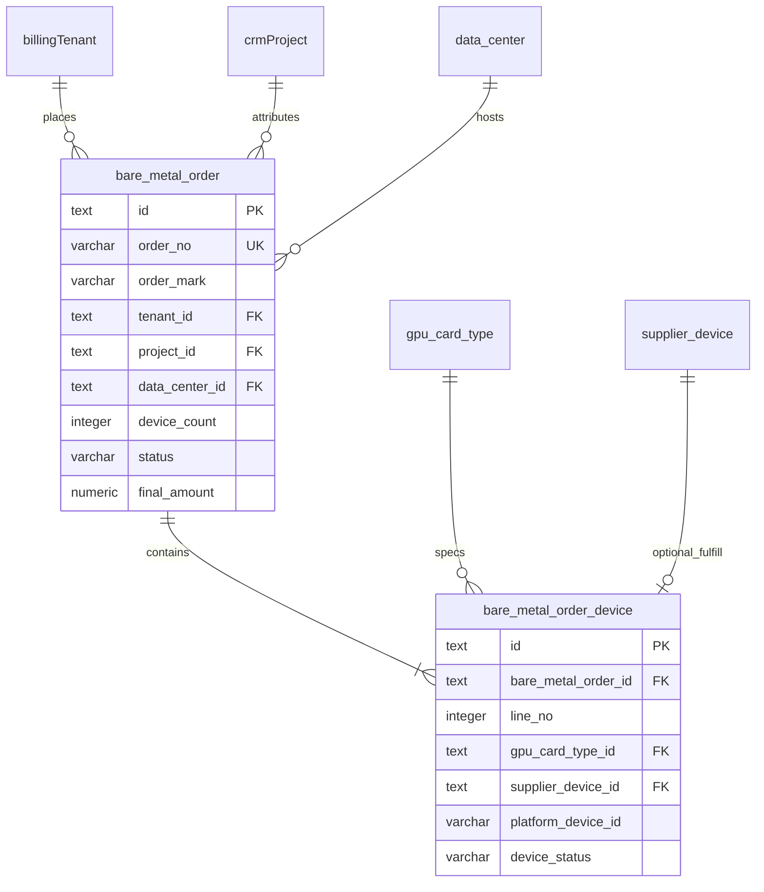
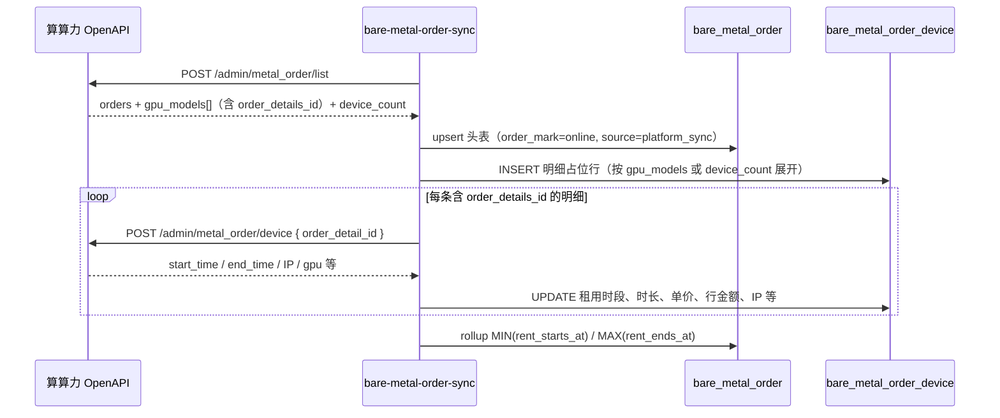
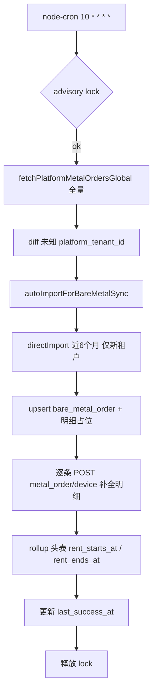
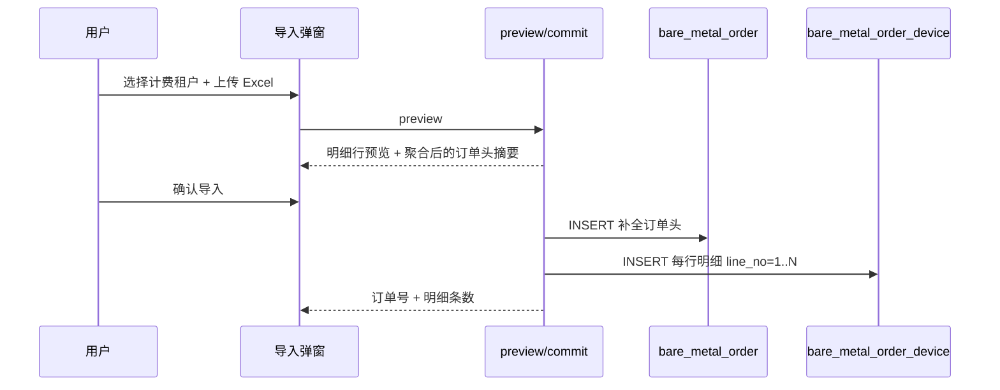

# 供应域 — 裸金属订单表结构设计

**状态**：**已确认 — 待实施**  
**版本**：v1.4（2026-06-17）  
**性质**：在既有 `packages/db/src/supply-schema.ts` 之上的 **增量专篇**；确认后修改 Drizzle schema、同步任务与前端页面。

**关联（只读引用）**：

- [supplier-database.md](./supplier-database.md) — 供应域主设计、命名与金额约定
- [platform-pricing-design.md](./platform-pricing-design.md) — 裸金属 `billing_unit`（hour/day/week/month）
- [tenant-billing-import-design.md](./tenant-billing-import-design.md) — 平台 `metal_order/list` 字段映射
- [billing-period-import-design.md](./billing-period-import-design.md) — 财务域 Excel 规范（**与本专篇线下导入格式不同**）
- [platform-tenant-import-design.md](./platform-tenant-import-design.md) — 平台租户拉取与入库（cron 自动导入复用）
- [project-billing-scheduled-sync-design.md](./project-billing-scheduled-sync-design.md) — 定时同步 + advisory lock 模式参考
- `packages/db/src/crm-schema.ts` — `billingTenant`、`commerce_order`（**本期不关联**）
- `packages/db/src/finance-schema.ts` — `billing_period_raw_baremetal_order`（**本期不关联**）

---

## 1. 背景与目标

### 1.1 业务诉求

租户在算算力平台可 **一次下单多台裸金属设备**（同机房、同规格或多规格）。CRM 供应域需要：

1. **订单头**：租户、机房、金额、租期、支付与订单状态等 **订单级** 信息；
2. **订单明细**：订单内 **每一台（或每一档规格×数量拆行后的单台槽位）** 的设备信息，含卡型、台内 GPU 数、平台设备 ID、交付后 SN/IP，以及可选挂接 `supplier_device` 的能力。

### 1.2 现网缺口

| 现网实体 | 问题 |
|----------|------|
| `commerce_order`（CRM） | 订单级宽表：`device_count` / `device_model` 聚合在头表；`commerce_order_item` 仅按 GPU 型号汇总，**无法表达多台设备明细** |
| `billing_period_raw_baremetal_order`（财务） | 账期 Excel **Raw 行**，非规范化订单模型 |
| `onboarding_batch.order_no`（供应） | `batch_kind=order_access` 时手工填订单号，**无结构化订单实体** |

### 1.3 本专篇目标

| # | 目标 | 说明 |
|---|------|------|
| G1 | 头表 + 明细表 | `bare_metal_order` + `bare_metal_order_device` |
| G2 | 一单多机 | 明细表 1:N；头表冗余 `device_count` 便于列表查询 |
| G3 | 供应域资源引用 | 头表可关联 `data_center`；明细可 FK `gpu_card_type`、可选 `supplier_device` |
| G4 | 平台幂等 | `platform_order_id` / `order_no` 全局唯一，支撑 OpenAPI 同步 |
| G5 | **小时级全量同步** | 每小时 **全量** 拉取平台裸金属订单列表；遇未知租户自动导入租户并拉取 **近 6 个月** 账单 |
| G6 | **全局订单浏览** | 侧栏入口 + 列表页 + 详情页（含 **订单标记** 筛选） |
| G7 | **项目级线下导入** | 项目详情页 Excel 导入 **设备明细行**；系统 **自动补全** 一条 `bare_metal_order` 订单头 |

### 1.4 非目标（本期）

- **不**与 `onboarding_batch`（`order_access`）、`billing_period_raw_baremetal_order`、`commerce_order` 建立读写关联（见 §6，二期再议）
- 不替代财务域账期 Excel 导入流程
- 不实现平台侧下单/支付（平台为权威来源；CRM 以同步/导入为主）
- 不在本期改造既有「项目同步账单」写入 `commerce_order` 的路径

---

## 2. 概念模型



**读模型分层**：

| 层级 | 实体 | 用途 |
|------|------|------|
| L1 订单头 | `bare_metal_order` | 全局列表、项目/租户维度筛选、金额汇总 |
| L2 设备明细 | `bare_metal_order_device` | 单台规格、交付状态、可选运维设备挂接 |
| L3 物理机 | `supplier_device` | 供应侧 SN 级真源（**本期仅字段预留，不做自动回填**） |

---

## 3. 设计决策（ADR）

| # | 议题 | 决策 | 状态 |
|---|------|------|------|
| **BM-1** | 表所属域 | 落在 **`supply-schema.ts`** §3.8；租户 FK 引用 CRM `billingTenant` | ✅ 已确认 |
| **BM-2** | 表数量 | **两张表**：`bare_metal_order` + `bare_metal_order_device` | ✅ 已确认 |
| **BM-3** | 明细粒度 | **一台设备一行**；列表 API 无单台 ID 时写 `planned` 占位行 | ✅ 已确认 |
| **BM-4** | 幂等键 | `platform_order_id` UK + `order_no` UK；至少其一 NOT NULL | ✅ 已确认 |
| **BM-5** | 机房匹配 | `data_center_id` 可空；按 `idc_name` 匹配 `data_center` | ✅ 已确认 |
| **BM-6** | 卡型匹配 | 保留 `device_model_text` 原文；`gpu_card_type_id` 解析失败记 `match_flags` | ✅ 已确认 |
| **BM-7** | 金额 | 头表 `order_amount` / `refund_amount` / `final_amount`；明细 `line_amount` 可空 | ✅ 已确认 |
| **BM-8** | 外部表关联 | **本期不与** `onboarding_batch`、`billing_period_raw_baremetal_order`、`commerce_order` **互写/互链** | ✅ 已确认 |
| **BM-9** | `commerce_order_id` 列 | 头表 **保留可空列**，供远期迁移；**本期恒为 null，不双写** | ✅ 已确认 |
| **BM-10** | 时间戳 | 复用 `supplyTimestamps`；业务时间 `ordered_at` / `completed_at` | ✅ 已确认 |
| **BM-11** | 定时同步 | **独立小时 cron**；**全量**拉取 `metal_order/list`（不按 CRM 已有租户枚举、不用增量时间窗） | ✅ v1.2 |
| **BM-12** | 未知租户 | 订单中出现 CRM 不存在的 `platform_tenant_id` → **自动**拉取平台租户并入库；**自动新建客户**（无需人工第二步） | ✅ v1.2 |
| **BM-13** | 新租户账单 | 自动导入租户后，对该租户调用 `directImport`，时间范围 **近 6 个自然月**（写 `tenant_bill` / `commerce_order` 等，**不**写 `bare_metal_order` 以外的关联） | ✅ v1.2 |
| **BM-14** | 订单标记 | 头表 `order_mark`：`online`（平台同步）\| `offline`（线下 Excel）；列表/详情必展示 | ✅ v1.2 |
| **BM-15** | 项目归因 | 线下 Excel 导入写 `project_id`；租户由 **弹窗选定**（项目关联租户）；cron **不写** `project_id` | ✅ v1.3 |
| **BM-16** | 线下导入粒度 | **一行 Excel = 一条 `bare_metal_order_device`**；**一次上传 = 一张 `bare_metal_order`**（头表由明细聚合生成） | ✅ v1.3 |
| **BM-17** | `supplier_device` | 一台供应设备同一时刻仅一条 **非 released** 明细可引用 | ✅ 已确认 |

---

## 4. 枚举与状态

### 4.1 订单状态 `bare_metal_order.status`

| 代码 | 含义 | 平台示例 |
|------|------|----------|
| `pending` | 待支付 / 待生效 | `Pending` |
| `paid` | 已支付待交付 | `Paid` |
| `provisioning` | 交付中 | `Processing` |
| `active` | 使用中 | `Active` / `Running` |
| `completed` | 已完结 | `Finished` |
| `cancelled` | 已取消 | `Cancelled` |
| `refunded` | 已退款 | `Refunded` |

### 4.2 支付状态 `pay_status`

| 代码 | 含义 |
|------|------|
| `unpaid` | 未支付 |
| `paid` | 已支付 |
| `partial_refund` | 部分退款 |
| `full_refund` | 全额退款 |

同步与导入默认请求 `is_paid: true`（与现网 `fetchPlatformMetalOrders` 一致）。

### 4.3 租期单位 `billing_unit`

| 代码 | 平台 `billing_type` 示例 |
|------|-------------------------|
| `hour` | `Hour` |
| `day` | `Day` |
| `week` | `Week` |
| `month` | `Month` |

### 4.4 明细分配状态 `bare_metal_order_device.allocation_status`

| 代码 | 含义 |
|------|------|
| `planned` | 占位行，尚无平台设备 ID |
| `allocated` | 已有平台设备 ID，未挂接供应设备 |
| `linked` | 已 FK `supplier_device` |
| `released` | 已退订/释放 |

### 4.5 订单标记 `bare_metal_order.order_mark`

区分 **平台线上单** 与 **线下补录单**（列表 Badge、筛选、详情页标题区展示）：

| 代码 | 含义 | 写入场景 |
|------|------|----------|
| `online` | 平台线上订单 | 小时 cron 全量同步 |
| `offline` | 线下订单 | 项目详情页 Excel 导入 |

> `order_mark` 与 `source` 正交：`source` 表示 **数据来源通道**；`order_mark` 表示 **业务属性（线上/线下）**。平台 cron 写入 `order_mark=online`；线下 Excel 写入 `order_mark=offline`。

### 4.6 订单来源 `bare_metal_order.source`

| 代码 | 含义 |
|------|------|
| `platform_sync` | 小时 cron 全量同步 |
| `offline_excel` | 项目详情页 Excel 导入 |
| `manual` | 预留：人工录入 |

---

## 5. 表结构

> 类型约定与 `supply-schema.ts` 一致：主键 `text`；金额 `numeric(15,4)`；时间 `timestamptz`。

### 5.1 `bare_metal_order`（裸金属订单头）

| 列名 | 类型 | 约束 | 说明 |
|------|------|------|------|
| `id` | text | PK | 建议 `bmord-{uuid}` 或 `metal-{platform_order_id}` |
| `platform_order_id` | varchar(64) | UK, 可空 | 平台 `order_id` |
| `order_no` | varchar(128) | UK, 可空 | 平台或线下订单编号 |
| `order_mark` | varchar(16) | NOT NULL | §4.5：`online` \| `offline` |
| `tenant_id` | text | FK→`tenant`, NOT NULL | CRM 计费租户 |
| `platform_tenant_id` | varchar(128) | NOT NULL | 冗余平台租户 ID |
| `customer_id` | text | FK→`customer`, 可空 | 来自租户，列表免 JOIN |
| `project_id` | text | FK→`project`, 可空 | **项目导入时写入**；cron 同步为 null |
| `data_center_id` | text | FK→`data_center`, 可空 | 匹配后的机房 |
| `supplier_id` | text | FK→`supplier`, 可空 | 冗余：机房归属供应商 |
| `idc_code` | varchar(64) | 可空 | 冗余快照 |
| `idc_name` | varchar(128) | 可空 | 平台机房名称原文 |
| `status` | varchar(32) | NOT NULL | §4.1 |
| `pay_status` | varchar(32) | NOT NULL | §4.2 |
| `billing_unit` | varchar(16) | NOT NULL | §4.3 |
| `purchase_qty` | integer | 可空 | 购买时长数量 |
| `purchase_qty_text` | varchar(128) | 可空 | 平台原文 |
| `device_count` | integer | NOT NULL DEFAULT 0 | 订单设备台数 |
| `gpu_count` | integer | NOT NULL DEFAULT 0 | 订单 GPU 总数 |
| `order_amount` | numeric(15,4) | 可空 | 订单金额 |
| `refund_amount` | numeric(15,4) | NOT NULL DEFAULT 0 | 退款金额 |
| `final_amount` | numeric(15,4) | NOT NULL | 最终总额 |
| `balance_amount` | numeric(15,4) | NOT NULL DEFAULT 0 | 余额支付 |
| `coupon_amount` | numeric(15,4) | NOT NULL DEFAULT 0 | 券支付 |
| `ordered_at` | timestamptz | NOT NULL | 下单时间 |
| `paid_at` | timestamptz | 可空 | 支付完成时间 |
| `completed_at` | timestamptz | 可空 | 订单完结时间 |
| `rent_starts_at` | timestamptz | 可空 | 租期开始 |
| `rent_ends_at` | timestamptz | 可空 | 租期结束 |
| `import_batch_id` | text | FK→`bare_metal_order_import_batch`, 可空 | 线下 Excel 导入批次；幂等重导 |
| `commerce_order_id` | text | FK→`commerce_order`, 可空 | **本期不写入**；远期迁移预留 |
| `source` | varchar(32) | NOT NULL DEFAULT `platform_sync` | §4.5 |
| `platform_payload` | jsonb | NOT NULL DEFAULT `{}` | 平台列表接口快照 |
| `match_flags` | jsonb | NOT NULL DEFAULT `{}` | 机房/卡型匹配标记 |
| `remark` | text | 可空 | 人工备注 |
| `created_at` | timestamptz | NOT NULL | supplyTimestamps |
| `updated_at` | timestamptz | NOT NULL | supplyTimestamps |

**索引**：

| 名称 | 类型 | 列 |
|------|------|-----|
| `bare_metal_order_platform_order_id_uk` | UNIQUE | `platform_order_id` WHERE NOT NULL |
| `bare_metal_order_order_no_uk` | UNIQUE | `order_no` WHERE NOT NULL |
| `bare_metal_order_tenant_ordered_idx` | INDEX | `tenant_id`, `ordered_at` DESC |
| `bare_metal_order_project_ordered_idx` | INDEX | `project_id`, `ordered_at` DESC |
| `bare_metal_order_data_center_idx` | INDEX | `data_center_id` |
| `bare_metal_order_status_idx` | INDEX | `status` |
| `bare_metal_order_order_mark_idx` | INDEX | `order_mark` |
| `bare_metal_order_ordered_at_idx` | INDEX | `ordered_at` DESC |

> **本期移除**：`onboarding_batch_id`（与 `order_access` 关联推迟至二期）。

---

### 5.2 `bare_metal_order_device`（裸金属订单设备明细）

| 列名 | 类型 | 约束 | 说明 |
|------|------|------|------|
| `id` | text | PK | `bmord-dev-{uuid}` |
| `bare_metal_order_id` | text | FK→`bare_metal_order`, NOT NULL, CASCADE | 所属订单 |
| `line_no` | integer | NOT NULL | 订单内序号，从 1 起 |
| `allocation_status` | varchar(32) | NOT NULL DEFAULT `planned` | §4.4 |
| `gpu_card_type_id` | text | FK→`gpu_card_type`, 可空 | 解析后的卡型 |
| `device_model_text` | varchar(128) | 可空 | 平台型号原文 |
| `gpu_count` | integer | NOT NULL DEFAULT 0 | 该台 GPU 数 |
| `platform_device_id` | varchar(128) | 可空 | 平台设备 ID |
| `supplier_device_id` | text | FK→`supplier_device`, 可空 | **本期可空**；不做自动挂接 |
| `device_status` | varchar(32) | 可空 | 平台设备状态 |
| `sn` | varchar(64) | 可空 | SN |
| `asset_no` | varchar(64) | 可空 | 资产编号 |
| `external_ip` | varchar(45) | 可空 | 公网 IP |
| `internal_ip` | varchar(45) | 可空 | 内网 IP |
| `line_amount` | numeric(15,4) | 可空 | 行总价（Excel「总价」） |
| `duration_hours` | numeric(15,4) | 可空 | 租用时长（小时）；Excel「时长」 |
| `unit_price_per_card_hour` | numeric(15,4) | 可空 | 卡时单价（元/卡/小时）；Excel「卡时单价」 |
| `rent_starts_at` | timestamptz | 可空 | 单台租期起；Excel「开始时间」 |
| `rent_ends_at` | timestamptz | 可空 | 单台租期止；Excel「结束时间」 |
| `linked_at` | timestamptz | 可空 | 挂接供应设备时间 |
| `platform_payload` | jsonb | NOT NULL DEFAULT `{}` | 平台 device 接口快照 |
| `match_flags` | jsonb | NOT NULL DEFAULT `{}` | 匹配标记 |
| `created_at` | timestamptz | NOT NULL | |
| `updated_at` | timestamptz | NOT NULL | |

**索引**：

| 名称 | 类型 | 列 |
|------|------|-----|
| `bare_metal_order_device_order_line_uk` | UNIQUE | `bare_metal_order_id`, `line_no` |
| `bare_metal_order_device_order_id_idx` | INDEX | `bare_metal_order_id` |
| `bare_metal_order_device_supplier_device_idx` | INDEX | `supplier_device_id` |
| `bare_metal_order_device_platform_device_uk` | UNIQUE | `platform_device_id` WHERE NOT NULL |

**规则**：

- `supplier_device_id`：全局至多一条 **非 released** 明细引用（BM-17）。
- 头表 `device_count` = 明细行数（线下导入 **一行即一条明细**，不再按 `device_count` 展开占位）。

---

### 5.4 `bare_metal_order_import_batch`（线下导入批次，建议新增）

一次 Excel 上传对应一个导入批次，用于幂等与审计。

| 列名 | 类型 | 说明 |
|------|------|------|
| `id` | text | PK |
| `project_id` | text | FK→`project`, NOT NULL |
| `tenant_id` | text | FK→`tenant`, NOT NULL | 用户选定计费租户 |
| `bare_metal_order_id` | text | FK→`bare_metal_order` | commit 后回填 |
| `file_name` | varchar(255) | 原始文件名 |
| `file_uri` | varchar(1024) | 落盘路径 |
| `row_count` | integer | 解析行数 |
| `committed_at` | timestamptz | 可空 |
| `created_by_staff_id` | text | FK→`user_staff` |
| `created_at` | timestamptz | |

UK（可选）：`(project_id, file_hash)` 防重复上传同一文件。

---

### 5.3 同步任务表（建议新增）

复用 [project-billing-scheduled-sync-design.md](./project-billing-scheduled-sync-design.md) 的 job 模式：

#### `bare_metal_sync_job_run`（任务运行）

| 列名 | 类型 | 说明 |
|------|------|------|
| `id` | text | PK |
| `trigger` | varchar(16) | `scheduled` \| `manual` |
| `started_at` | timestamptz | |
| `finished_at` | timestamptz | 可空 |
| `status` | varchar(16) | `running` \| `success` \| `partial` \| `failed` |
| `orders_fetched_count` | integer | 平台全量列表拉取条数 |
| `unknown_tenant_count` | integer | 订单中 CRM 不存在的平台租户 ID 数 |
| `tenants_auto_imported_count` | integer | 自动导入租户成功数 |
| `billing_sync_tenant_count` | integer | 触发 6 个月账单同步的租户数 |
| `order_upserted_count` | integer | upsert 至 `bare_metal_order` 的订单数 |
| `success_count` | integer | 账单同步成功租户数（仅新租户阶段） |
| `failed_count` | integer | 失败租户数 |
| `error_summary` | text | 可空 |

#### `bare_metal_sync_job_item`（租户级明细）

| 列名 | 类型 | 说明 |
|------|------|------|
| `id` | text | PK |
| `job_run_id` | text | FK→`bare_metal_sync_job_run` |
| `platform_tenant_id` | varchar(128) | |
| `tenant_id` | text | FK→`tenant`, 可空 | 导入后回填 |
| `phase` | varchar(32) | `tenant_import` \| `billing_sync` \| `order_upsert` |
| `status` | varchar(16) | `success` \| `failed` \| `skipped` |
| `order_count` | integer | 本租户相关订单 upsert 数 |
| `error_message` | text | 可空 |

#### `bare_metal_sync_state`（运行状态，单行）

| 列名 | 类型 | 说明 |
|------|------|------|
| `id` | text | 固定 `default` |
| `last_run_at` | timestamptz | 上次任务开始时间 |
| `last_success_at` | timestamptz | 上次成功结束时间 |
| `updated_at` | timestamptz | |

---

## 6. 与现有表的关系

> **本期原则（已确认）**：`bare_metal_order` 为 **独立真源**；以下关联 **全部推迟**，读写路径互不干扰。

| 关联 | 本期策略 | 二期方向 |
|------|----------|----------|
| **§6.1** `onboarding_batch` / `order_access` | **不做**。不读不写 `order_no` 匹配；不落 `onboarding_batch_id` | 订单号互查、接入批次选单提示 |
| **§6.2** `billing_period_raw_baremetal_order` | **不做**。财务 Excel 仍只写 Raw 表 | Raw 解析后可选 upsert 订单表 |
| **§6.3** `commerce_order` / `commerce_order_item` | **不做**。不双写、不互链；`commerce_order_id` 列保留且恒 null | 迁移读取路径、一次性回填链接 |
| **§6.4** `supplier_device` | 明细保留 `supplier_device_id` 可空 FK；**不做**自动回填与 UI 挂接 | 交付完成后运营手工或规则挂接 |

既有「项目同步账单」（`tenant-billing-import.ts` → `commerce_order`）**保持不变**。

**例外（仅 cron 新租户补齐）**：§7.2.5 对 **本轮新自动导入** 的租户调用 `directImport`，写入 `tenant_bill` / `commerce_order` 等，**不**回写 `bare_metal_order` 关联字段。

---

## 7. 数据写入与同步

### 7.1 平台订单 upsert 逻辑

抽取 `bare-metal-order-sync.ts`（data access），供 **§7.2 小时 cron** 使用（线下 Excel 走独立解析器，见 §7.3）：



| 平台字段 | 头表列 |
|----------|--------|
| `order_id` | `platform_order_id` |
| `order_no` | `order_no` |
| `tenant_id` | → `tenant_id` + `platform_tenant_id` |
| `total_price` | `order_amount` / `final_amount`（`platformAmountToRmb`） |
| `status` | `status` |
| `create_time` | `ordered_at` |
| `billing_type` | `billing_unit` |
| `idc_name` | `idc_name` → 匹配 `data_center_id` |
| `device_count` | `device_count` |
| `gpu_models[]` | 拆分到明细；`order_details_id` → device 补全入口 |
| `gpu_models[].total_price` | 明细 `line_amount`（经 §7.1.1 写入） |
| — | `order_mark` = **`online`**；`source` = **`platform_sync`** |

**明细展开（BM-3）**：

1. `gpu_models[]` 存在 → 按数组元素 **一行一条明细**（每元素对应一台/一档设备槽位）；
2. 否则 → 按 `device_count` 生成 `planned` 占位行（**无** `order_details_id`，无法调用 device 接口）；
3. 占位行 INSERT 后，对含 `gpu_models[].order_details_id` 的行 **逐条** 调用 §7.1.1 device 接口补全；
4. 补全按 `bare_metal_order_id` + `line_no`（或 `platform_device_id`）UPDATE，**禁止**因补全而重复 INSERT。

**幂等**：同一 `platform_order_id` 重复同步 → UPDATE 头表 + reconcile 明细行（按 `line_no` / `platform_device_id`）；device 补全可重复执行，以平台最新快照覆盖。

---

#### 7.1.1 平台设备补全 — `POST /admin/metal_order/device`

> **背景**：`metal_order/list` 仅含订单级字段与 `gpu_models[]` 摘要，**不含**租用起止、卡时单价等计费明细。详情页设备表（§8.4）所需字段需在本步骤补全。  
> **范围**：仅 **`order_mark = online`** 且 **`source = platform_sync`** 的平台同步路径；线下 Excel 导入（§7.3）**不**调用本接口。

##### 7.1.1.1 调用时机与顺序

| 步骤 | 动作 |
|------|------|
| 1 | `upsertPlatformBareMetalOrder` 完成头表 upsert + 明细占位行 INSERT |
| 2 | 遍历本订单刚写入（或 reconcile 后）的明细行 |
| 3 | 若对应 `gpu_models[i].order_details_id` 存在 → 调用 device 接口 |
| 4 | 将响应字段 UPDATE 至 `bare_metal_order_device` |
| 5 | 根据明细 rollup 头表 `rent_starts_at` / `rent_ends_at` |

封装建议：`enrichPlatformBareMetalOrderDevices({ orderId, record, traceId })`，由 `upsertPlatformBareMetalOrder` 在事务外 **顺序** 调用（OpenAPI 不宜长事务）。

##### 7.1.1.2 请求与响应

| 项 | 值 |
|----|-----|
| Path | `POST /admin/metal_order/device` |
| 请求体 | `{ "order_detail_id": <number> }` — 取自 `gpu_models[].order_details_id`（注意请求字段名为 **单数** `order_detail_id`） |
| 成功码 | `code === "0000"` |
| 封装位置 | `suanli-billing-api.ts` 新增 `fetchPlatformMetalOrderDevice`（复用 `throttledPost` + `SuanliBillingApiError`，**不**使用 legacy `api.ts` 的 `getMetalOrderDevice`） |

响应 `data` 示例字段（实施期 zod 校验，未知字段忽略）：

| 响应字段 | 类型 | 说明 |
|----------|------|------|
| `order_details_id` | number | 平台明细 ID（与 list 中 `order_details_id` 对应） |
| `start_time` | string | 租用开始（含时区） |
| `end_time` | string | 租用结束 |
| `pub_ip` | string | 公网 IP |
| `inner_ip` | string | 内网 IP |
| `gpu_count` | number | GPU 卡数 |
| `gpu_model` | string | GPU 型号 |
| `billing_type` | string | 如 `Hour` |
| `cpu_model` / `memory_size` / `operating_system` 等 | — | 写入 `platform_payload`，本期 UI 不展示 |

##### 7.1.1.3 明细字段映射

| 平台 device 接口 / list 摘要 | `bare_metal_order_device` 列 | 规则 |
|------------------------------|------------------------------|------|
| `order_details_id` | `platform_device_id` | `String(order_details_id)` |
| `start_time` | `rent_starts_at` | `parsePlatformDateTime` |
| `end_time` | `rent_ends_at` | `parsePlatformDateTime` |
| `end − start`（小时） | `duration_hours` | `(rentEndsAt − rentStartsAt) / 3600000`，保留 4 位小数（`toMoney`） |
| `gpu_models[i].total_price`（list） | `line_amount` | `platformMetalOrderListAmountToMoneyString`；若 list 无 `total_price` 且仅 1 条明细，可回退 `record.total_price` |
| 推导 | `unit_price_per_card_hour` | `line_amount ÷ (duration_hours × gpu_count)`，分母 > 0 时计算，4 位小数；否则 **null** |
| `pub_ip` | `external_ip` | 可空 |
| `inner_ip` | `internal_ip` | 可空 |
| `gpu_model` | `device_model_text` | 仅当占位行原文为空时覆盖 |
| `gpu_count` | `gpu_count` | 以 device 接口为准（与 list 不一致时以 device 为准并记 `match_flags.gpu_count_mismatch`） |
| 完整 `data` | `platform_payload` | JSON 快照 |
| — | `platform_payload.order_details_id` | 冗余存储，便于排查与幂等匹配 |
| list `gpu_models[i].order_detail_status` | `device_status` | 可空 |

**头表 rollup**（补全全部明细后）：

| 头表列 | 规则 |
|--------|------|
| `rent_starts_at` | `MIN(明细.rent_starts_at)`（忽略 null） |
| `rent_ends_at` | `MAX(明细.rent_ends_at)` |
| `purchase_qty_text` | 可选：由 `billing_unit` + 租期跨度生成展示文案（非阻塞） |

##### 7.1.1.4 跳过与失败策略

| 场景 | 行为 |
|------|------|
| `gpu_models[]` 元素无 `order_details_id` | **跳过** device 调用；明细保持 `planned`，计费列为 null |
| 按 `device_count` 展开的占位行 | **跳过**（无 platform 明细 ID） |
| 单条 device 接口 4xx/5xx 或 `code ≠ 0000` | 记 `crmWarn` + 可选 `bare_metal_sync_job_item` 子项；**不**阻断同订单其他明细与同批其他订单 |
| 同订单部分明细补全失败 | 头表 rollup 仅基于 **已成功补全** 的明细；订单级 `match_flags.device_enrich_partial = true` |
| 限流 | 每条 device 请求前 `delayBillingApi(BILLING_API_DETAIL_DELAY_MS)`（默认 300ms，可 env 覆盖） |

##### 7.1.1.5 幂等与 reconcile

重复 cron 同步时：

1. 头表 UPDATE；明细按 `line_no` reconcile（现有逻辑：删旧 INSERT 新 **或** 改为 upsert-by-line — 实施时 **推荐** 在 reconcile 后仍执行 device 补全）；
2. device 补全按 `platform_device_id = String(order_details_id)` 定位行；若 reconcile 重建了行 ID，以 `line_no` + `order_details_id` 匹配；
3. 已补全行再次同步 → UPDATE 租用/IP/金额字段，不新增行；
4. **`order_mark = offline`** 订单：cron **不得** 覆盖明细计费字段（现有 offline 保护逻辑保持不变）。

##### 7.1.1.6 实施文件清单

| 文件 | 变更 |
|------|------|
| `suanli-billing-api.ts` | 新增 `PlatformMetalOrderDeviceRecord` 类型 + `fetchPlatformMetalOrderDevice` |
| `bare-metal-order-sync.ts` | `buildDeviceLines` 保留 `order_details_id` / `total_price`；INSERT 后调用 enrich；头表 rollup |
| `bare-metal-order-scheduled-sync.ts` | 无需改循环结构；统计可选增加 `deviceEnrichedCount` / `deviceEnrichFailedCount` |
| `bare-metal-order-schema-design.md` | 本文 §7.1.1（v1.4） |

**幂等**：同一 `platform_order_id` 重复同步 → UPDATE 头表 + reconcile 明细行；`order_mark` 保持 `online`，**不被**线下导入覆盖。

---

### 7.2 小时级定时同步（Cron）— 全量列表 + 未知租户自动补齐

#### 7.2.1 注册方式

| 组件 | 路径（实施期） |
|------|----------------|
| 注册 | `apps/web/src/lib/server/jobs/register-bare-metal-order-sync-cron.ts` |
| 执行 | `apps/web/src/lib/server/dataaccess/supplier/bare-metal-order-scheduled-sync.ts` |
| 平台全量列表 | `fetchPlatformMetalOrdersGlobal`（`suanli-billing-api.ts` 新增） |
| 自动租户 | `platform-tenant-import.ts` 扩展 `autoImportForBareMetalSync` |
| 账单补齐 | 复用 `tenant-billing-import.directImport` |
| 配置 | `bare-metal-order-sync-config.ts` |
| 初始化 | `init-cron-jobs.ts` 并列注册 |

#### 7.2.2 调度参数

| 项 | 默认值 | 环境变量 |
|----|--------|----------|
| 开关 | `false` | `BARE_METAL_ORDER_SYNC_ENABLED=true` |
| Cron | `10 * * * *`（每小时第 10 分） | `BARE_METAL_ORDER_SYNC_CRON` |
| 时区 | `Asia/Shanghai` | `BARE_METAL_ORDER_SYNC_TIMEZONE` |
| 新租户账单回溯 | **6 个自然月** | `BARE_METAL_ORDER_SYNC_BILLING_LOOKBACK_MONTHS=6` |

> 与每日 05:00 **项目账单同步**解耦。本任务 **全量**拉订单，**不用**安全窗口/游标时间窗。

#### 7.2.3 全量拉取裸金属订单列表

**不再**枚举 CRM 已有租户。每次任务 **一次（分页拉全）** 调用平台接口：

| 项 | 值 |
|----|-----|
| Path | `POST /admin/metal_order/list` |
| `conditional.tenant_tid` | **`0` 或空**（表示不按单租户过滤，拉平台全量列表） |
| `conditional.start_time` | **`''`**（不限制起始） |
| `conditional.end_time` | **`''`**（不限制结束） |
| `conditional.is_paid` | `true`（与现网一致，仅已支付） |
| 分页 | `fetchAllPages`，直至 `results.length < page_size` |

封装为 `fetchPlatformMetalOrdersGlobal({ traceId })`，返回全平台 `PlatformMetalOrderRecord[]`。

#### 7.2.4 未知租户自动导入

从全量订单中提取 `tenant_id`（平台租户 ID）去重，与 CRM `billingTenant.platform_tenant_id` 比对：


| 步骤 | 规则 |
|------|------|
| 1. 识别未知 ID | `platform_tenant_id ∉ CRM` |
| 2. 拉取平台租户 | `fetchPlatformTenantsByIds`（可拆批，每批 ≤100） |
| 3. 自动新建客户 | `customer.name` = `company_name` → `tenant_name` → `租户-{id}`；`type` 默认 `B`（平台 `tenant_type` 可映射） |
| 4. 新建租户 | 同 [platform-tenant-import](./platform-tenant-import-design.md) `mapRecordToTenantFields`；`is_default=true`（该客户下首租户） |
| 5. 余额快照 | `writeBalanceSnapshotAfterImport`（`source=platform_sync`） |
| 6. 失败策略 | 单租户导入失败记入 `job_item`；**不阻断**同批其他未知租户；该租户订单暂跳过 upsert（下轮重试） |

> **与手工「导入租户」差异**：cron **无预览/确认第二步**，客户关联全自动；须在 Settings 明示「自动建档」开关（默认可随 `BARE_METAL_ORDER_SYNC_ENABLED` 启用）。

#### 7.2.5 新租户 — 近 6 个月账单导入

对每个 **本轮新入库** 的租户（含新建与更新后首次出现的平台 ID），在 upsert 订单 **之前** 调用：

```typescript
await tenantBillingImportDataAccess.directImport({
  tenantId: crmTenantId,
  startDate: formatDate(sixMonthsAgo), // 自然月：当月 1 日往前 6 个月
  endDate: formatDate(today),
})
```

| 项 | 说明 |
|----|------|
| 写入表 | `tenant_bill`、`tenant_bill_detail`、`recharge`、`commerce_order` 等（**既有账单同步链路**） |
| 与 §6 关系 | **不**回写 `bare_metal_order.commerce_order_id`；**不**读财务 `billing_period_raw` |
| 幂等 | 复用 `tenant-billing-import` 租户级 upsert |
| 限流 | 租户间 `delayBillingApi`；新租户账单同步 **串行** |

**已存在于 CRM 的租户**：本轮 **不**触发 6 个月账单重拉（仅处理未知租户）。

#### 7.2.6 订单 upsert + 设备补全

全量订单（或已能解析 `tenant_id` 的子集）逐条：

| 步骤 | 规则 |
|------|------|
| 1. upsert 头表 + 明细占位 | `order_mark = online`，`source = platform_sync`，`project_id = null` |
| 2. device 补全 | 对含 `order_details_id` 的明细调用 §7.1.1 |
| 3. 租户解析 | `tenant_id` 由平台 `tenant_id` 解析；未知且本轮导入失败则 **跳过** 整条订单 |

| 字段 | 规则 |
|------|------|
| `order_mark` | **`online`** |
| `source` | **`platform_sync`** |
| `project_id` | **null** |
| `tenant_id` | 由平台 `tenant_id` 解析；未知且本轮导入失败则 **跳过** |

#### 7.2.7 互斥与可观测

| 项 | 规则 |
|----|------|
| 多副本 | `pg_try_advisory_lock`（独立 lock key） |
| 日志 | `bare_metal_sync_job_run` + `bare_metal_sync_job_item`（分阶段 `phase`） |
| Settings | 「裸金属订单同步」卡片：上次全量条数、自动导入租户数、账单同步结果 |

#### 7.2.8 端到端流程



---

### 7.3 项目详情页 — 线下裸金属订单 Excel 导入

#### 7.3.1 业务说明

用户上传的 Excel 描述 **一张线下裸金属订单内的设备/租用明细**（每行一条租用记录），**不是**平台 `metal_order/list` 格式，也 **不是** 财务账期裸金属 Raw 格式。

| 概念 | 落库 |
|------|------|
| **一次上传** | **1 条** `bare_metal_order`（订单头，**系统自动补全**） |
| **Excel 每一行** | **1 条** `bare_metal_order_device`（设备/租用明细） |
| 订单标记 | 头表 `order_mark = offline`，`source = offline_excel` |

| 项 | 说明 |
|----|------|
| 页面 | `/crm/projects/[id]`（`project-detail-content.tsx`） |
| 入口 | **「导入线下裸金属订单」** |
| 组件 | `ProjectOfflineBareMetalOrderImportDialog` |
| 权限 | `adminProcedure` |

#### 7.3.2 交互流程



1. 弹窗只读：项目名称；
2. **必选计费租户**（项目关联租户下拉；仅 1 个时默认选中）；
3. 上传 `.xlsx` / `.csv`；
4. **预览**：上半部为 **聚合订单头摘要**（总金额、起止时间、明细行数）；下半部为 **明细行表格**；
5. 校验失败可下载错误高亮 Excel；
6. **确认导入**：事务内写 1 头 + N 明细 + `import_batch`。

#### 7.3.3 Excel 格式（设备明细行）

**表头（7 列，顺序固定，支持中英文别名）**：

| 列名 | 必填 | 类型 | 映射 `bare_metal_order_device` |
|------|------|------|--------------------------------|
| 卡型 | 是 | string | `device_model_text`；匹配 `gpu_card_type_id`（`gpu_card_type.code` 精确匹配，如 `5090`、`4090`） |
| 卡数 | 是 | integer | `gpu_count` |
| 开始时间 | 是 | datetime | `rent_starts_at` |
| 结束时间 | 是 | datetime | `rent_ends_at` |
| 时长 | 是 | number | `duration_hours`（单位：**小时**） |
| 卡时单价 | 是 | money | `unit_price_per_card_hour`（元/卡/小时，4 位小数） |
| 总价 | 是 | money | `line_amount` |

**列别名（解析器）**：

| 标准列 | 可识别别名 |
|--------|------------|
| 卡型 | `卡型`、`GPU型号`、`gpu_model`、`card_type` |
| 卡数 | `卡数`、`GPU数`、`gpu_count` |
| 开始时间 | `开始时间`、`起租时间`、`start_time`、`rent_start` |
| 结束时间 | `结束时间`、`到期时间`、`end_time`、`rent_end` |
| 时长 | `时长`、`租用时长`、`hours`、`duration_hours` |
| 卡时单价 | `卡时单价`、`单价`、`unit_price` |
| 总价 | `总价`、`金额`、`total`、`line_amount` |

**样例（用户提供）**：

| 卡型 | 卡数 | 开始时间 | 结束时间 | 时长 | 卡时单价 | 总价 |
|------|------|----------|----------|------|----------|------|
| 5090 | 4 | 2026/5/1 0:00 | 2026/5/31 23:59 | 744 | 3.2 | 9523.20 |
| 5090 | 8 | 2026/5/20 3:50 | 2026/5/20 13:50 | 10 | 3.25 | 260 |
| 4090 | 8 | 2026/5/18 3:44 | 2026/5/19 3:44 | 24 | 1.68 | 322.56 |

> 每行代表一条 **租用明细**（卡型 × 卡数 × 时间段 × 卡时计价），对应 **一台逻辑设备/一条租用记录**，不是平台 SN 级物理机（`supplier_device_id` 留空）。

#### 7.3.4 校验规则

| 编号 | 校验 | 级别 |
|------|------|------|
| V-O1 | 7 列齐全；数据行 ≥ 1 | 阻断 |
| V-O2 | `卡数` > 0 | 阻断 |
| V-O3 | `开始时间` ≤ `结束时间` | 阻断 |
| V-O4 | `时长` > 0 | 阻断 |
| V-O5 | `总价` ≥ 0 | 阻断 |
| V-O6 | `卡型` 能匹配 `gpu_card_type.code` | 阻断（或警告+允许 commit，实施默认 **阻断**） |
| V-O7 | **金额自洽**：`总价 ≈ 卡数 × 时长 × 卡时单价`（±0.01 元） | 警告（默认 **阻断**） |
| V-O8 | **时长自洽**：`时长` 与 `结束时间 − 开始时间` 折算小时差（±1 小时容差，跨月长租允许人工填 744） | **警告**（长租如 744h 与日历差可能不一致，不阻断） |
| V-O9 | 所选 `tenant_id` ∈ 项目关联计费租户 | 阻断 |
| V-O10 | 日期时间解析时区：**Asia/Shanghai** | — |

**金额自洽示例**：

- `4 × 744 × 3.2 = 9523.2` ✓  
- `8 × 10 × 3.25 = 260` ✓  
- `8 × 24 × 1.68 = 322.56` ✓  

#### 7.3.5 订单头自动补全规则

commit 时 **先聚合 Excel 全量明细**，再 **INSERT 一条** `bare_metal_order`：

| 头表字段 | 补全规则 |
|----------|----------|
| `id` | `bmord-{uuid}` |
| `platform_order_id` | `offline-{import_batch_id}`（UK） |
| `order_no` | `OFF-{project.code}-{YYYYMMDD}-{import_batch 短序}`，如 `OFF-PRJ01-20260515-A3F2` |
| `order_mark` | **`offline`** |
| `source` | **`offline_excel`** |
| `import_batch_id` | 当前批次 ID |
| `project_id` | 当前项目 |
| `tenant_id` / `platform_tenant_id` | 弹窗选定租户 |
| `customer_id` | 租户.customerId |
| `device_count` | **明细行数 N**（样例 N=3） |
| `gpu_count` | **Σ 卡数**（样例 4+8+8=20） |
| `final_amount` | **Σ 总价**（样例 9523.20+260+322.56=10105.76） |
| `order_amount` | 同 `final_amount` |
| `refund_amount` | `0` |
| `billing_unit` | **`hour`**（按卡时计价） |
| `ordered_at` | `MIN(明细.rent_starts_at)` |
| `rent_starts_at` | `MIN(明细.rent_starts_at)` |
| `rent_ends_at` | `MAX(明细.rent_ends_at)` |
| `status` | **`completed`**（线下已结算录入） |
| `pay_status` | **`paid`** |
| `data_center_id` | **null**（Excel 无机房；二期可选弹窗补充） |
| `purchase_qty_text` | 拼接摘要，如 `3 行明细 / 20 卡时` |

#### 7.3.6 明细行写入规则

| 字段 | 规则 |
|------|------|
| `bare_metal_order_id` | 上一步生成的头表 ID |
| `line_no` | Excel 数据行序号，从 1 起 |
| `gpu_count` | Excel「卡数」 |
| `device_model_text` | Excel「卡型」原文 |
| `gpu_card_type_id` | 卡型主数据匹配结果 |
| `duration_hours` | Excel「时长」 |
| `unit_price_per_card_hour` | Excel「卡时单价」 |
| `line_amount` | Excel「总价」 |
| `rent_starts_at` / `rent_ends_at` | Excel 起止时间 |
| `allocation_status` | **`planned`**（线下无平台 device ID） |
| `platform_device_id` | **null** |
| `platform_payload` | `{ "import_row_no", "raw": { ...7列 } }` |

#### 7.3.7 幂等与冲突

| 场景 | 行为 |
|------|------|
| 同一 `import_batch_id` 重复 commit | 拒绝（批次已 `committed_at`） |
| 同一项目重复上传相同文件 hash | 警告；默认允许（生成新订单号） |
| 头表 `platform_order_id` 与线上下单冲突 | 线下 ID 前缀 `offline-`，**不会**与平台数字 ID 冲突 |
| 更新已有线下订单 | **本期不支持** Excel 更新；须详情页手工或重新导入新单 |

#### 7.3.8 API 与实现

| 接口 | 说明 |
|------|------|
| `crm.projects.previewOfflineBareMetalOrders` | `{ projectId, tenantId, file }` → 头摘要 + 明细预览 |
| `crm.projects.commitOfflineBareMetalOrders` | `{ previewToken }` → 写库 |

解析：`bare-metal-order-offline-excel-utils.ts`（**独立**于财务 `baremetal_order` 解析器）。

#### 7.3.9 结果反馈

```typescript
type OfflineBareMetalOrderImportResult = {
  importBatchId: string
  bareMetalOrderId: string
  orderNo: string
  deviceLineCount: number
  finalAmount: string
  errors: Array<{ rowNo: number; message: string }>
}
```

成功后跳转或 toast 提供 **查看订单** 链接（`/supplier/bare-metal-orders/[id]`）。

---

## 8. 导航与页面

### 8.1 侧栏入口

在 `sidebar-menu.tsx` → `navSupply`（算力供应链）中，于 **「设备管理」与「计划批次」之间** 插入：

| 属性 | 值 |
|------|-----|
| title | 裸金属订单 |
| url | `/supplier/bare-metal-orders` |
| icon | `ShoppingCart` 或 `Package`（lucide-react） |
| roles | `ADMIN_MEMBER`（与供应域其他菜单一致） |

### 8.2 路由与页面

| 路由 | 文件（实施期） | 说明 |
|------|----------------|------|
| `/supplier/bare-metal-orders` | `supplier/bare-metal-orders/page.tsx` | 全局订单列表 |
| `/supplier/bare-metal-orders/[id]` | `supplier/bare-metal-orders/[id]/page.tsx` | 订单详情 |

### 8.3 列表页 `BareMetalOrdersContent`

**筛选**：

| 筛选项 | 字段 |
|--------|------|
| 订单编号 | `order_no` 模糊 |
| 平台订单 ID | `platform_order_id` |
| 租户 | `tenant_id` / 租户名 |
| 项目 | `project_id`（可空筛选） |
| 机房 | `data_center_id` |
| 状态 | `status` |
| **订单标记** | `order_mark`（`online` / `offline`） |
| 下单时间 | `ordered_at` 范围 |
| 来源 | `source` |

**表格列（建议）**：

| 列 | 来源 |
|----|------|
| **订单标记** | `order_mark` Badge（线上/线下） |
| 订单编号 | `order_no` |
| 租户 | JOIN `billingTenant.name` |
| 项目 | JOIN `crmProject.name`（可空显示「—」） |
| 机房 | `idc_name` / `data_center.name` |
| 设备台数 | `device_count` |
| 租期 | `purchase_qty_text` 或 `purchase_qty` + `billing_unit` |
| 金额 | `final_amount` |
| 状态 | `status` |
| 下单时间 | `ordered_at` |
| 来源 | `source` 标签 |

**API**：`supplier.bareMetalOrder.list`（分页 + 筛选）。

### 8.4 详情页 `BareMetalOrderDetailContent`

**头信息卡片**：**订单标记**（线上/线下 Badge）、订单编号、平台 ID、租户、项目、机房、状态、支付状态、租期、金额明细、下单/完成时间、`match_flags` 警告。

**设备明细表**（`bare_metal_order_device`）：

| 列 | 说明 |
|----|------|
| 行号 | `line_no` |
| 型号 | `device_model_text` / 卡型名 |
| 卡数 | `gpu_count` |
| 租用时段 | `rent_starts_at` ~ `rent_ends_at`（线上单由 §7.1.1 device 接口补全；线下单来自 Excel） |
| 时长(h) | `duration_hours`（线上单由起止时间推导；线下单来自 Excel） |
| 卡时单价 | `unit_price_per_card_hour`（线上单由 `line_amount ÷ (hours × gpu_count)` 推导；线下单来自 Excel） |
| 行金额 | `line_amount`（线上单来自 list `gpu_models[].total_price`；线下单来自 Excel） |

**API**：`supplier.bareMetalOrder.getById`。

### 8.5 项目详情页展示

项目详情 Tab「订单列表」增加 **裸金属订单** 子区或筛选：仅展示 `project_id = 当前项目` 的 `bare_metal_order`（含 `online` + `offline`）。导入入口见 §7.3。

---

## 9. 查询场景

| 场景 | 主要表 | 入口 |
|------|--------|------|
| 全局裸金属订单 | `bare_metal_order` | 侧栏 → 裸金属订单 |
| 订单设备清单 | `bare_metal_order_device` | 订单详情页 |
| 项目维度订单 | `bare_metal_order` WHERE `project_id` | 项目详情 Tab / 列表 `project_id` 筛选 |
| 线下单筛选 | `order_mark = offline` | 列表标记筛选 |
| 租户维度订单 | `bare_metal_order` WHERE `tenant_id` | 列表筛选 |

---

## 10. 已确认问题（ADR 结论）

| # | 问题 | 结论 |
|---|------|------|
| Q1 | 表放在 `supply-schema.ts`？ | **是** |
| Q2 | 明细粒度为 **一台设备一行**？ | **是** |
| Q3 | 允许 **planned 占位行**？ | **是** |
| Q4 | 保留 `commerce_order_id` 兼容列？ | **是**（本期不写入） |
| Q5 | 账期 Excel 本期同步写订单表？ | **否** |
| Q6 | 一台 `supplier_device` 仅一条活跃明细？ | **是** |
| Q7 | 与 `onboarding_batch` / 财务 Raw / `commerce_order` 关联？ | **否**（本期独立） |
| Q8 | 小时 cron 同步？ | **是** — **全量**列表 + 未知租户自动导入 + 6 个月账单（§7.2） |
| Q9 | 侧栏 + 列表/详情页？ | **是**（§8） |
| Q10 | 项目详情页导入？ | **是** — 线下 Excel **明细行** + 自动补全订单头（§7.3） |
| Q11 | 订单标记字段？ | **是** — `order_mark`: `online` \| `offline`（§4.5） |
| Q12 | cron 是否自动创建客户？ | **是** — 未知租户无人工确认（§7.2.4） |
| Q13 | 线下 Excel 是否含租户列？ | **否** — 弹窗选定项目计费租户；**不**自动建租户 |
| Q14 | 一次上传对应几张订单？ | **1 张**；每行 Excel = 1 条 `bare_metal_order_device`（§7.3.1） |

---

## 11. 实施清单（确认后执行）

### Phase 1 — Schema

1. `supply-schema.ts` §3.8：`bare_metal_order`（含 `order_mark`、`import_batch_id`）、`bare_metal_order_device`（含 `duration_hours`、`unit_price_per_card_hour`）
2. `bare_metal_order_import_batch`
3. 同步 job 表：`bare_metal_sync_job_run`、`bare_metal_sync_job_item`、`bare_metal_sync_state`
4. Drizzle migration + relations + 类型导出

### Phase 2 — 同步与 API

1. `bare-metal-order-sync.ts`（平台订单 upsert + §7.1.1 device 补全）
2. `suanli-billing-api.ts` — `fetchPlatformMetalOrderDevice`
3. `fetchPlatformMetalOrdersGlobal` + `autoImportForBareMetalSync`
4. `register-bare-metal-order-sync-cron.ts` + 全量 scheduled sync（含新租户 `directImport`）
5. `bare-metal-order-offline-excel-utils.ts` + preview/commit
6. tRPC：`list` / `getById`；`previewOfflineBareMetalOrders` / `commitOfflineBareMetalOrders`
7. Settings 同步状态卡片（建议同 PR；可选展示 device 补全成功/失败计数）

### Phase 3 — UI

1. `sidebar-menu.tsx` 增加「裸金属订单」
2. 列表页 + 详情页（含 `order_mark` Badge）
3. `ProjectOfflineBareMetalOrderImportDialog` + 项目详情入口
4. 项目详情 Tab 展示本项目裸金属订单

---

## 12. 测试计划

| 类型 | 用例 |
|------|------|
| Schema | migration；UK / FK / CASCADE |
| Upsert | 同一 `platform_order_id` 重复全量同步幂等 |
| Device 补全 | `order_details_id=1284` → `rent_starts_at`/`rent_ends_at`/IP/`duration_hours`/`line_amount`/`unit_price_per_card_hour` 落库 |
| Device 补全失败 | 单条 API 失败不阻断订单头与其余明细；`match_flags.device_enrich_partial` |
| Device 跳过 | 无 `order_details_id` 的占位行不调 API，计费列保持 null |
| 金额推导 | `line_amount` 来自 list `total_price`；`unit_price = line ÷ (hours × gpu_count)` 自洽 |
| 展开 | `device_count=3` 且无 `gpu_models` → 3 行占位，均不补全 |
| Cron 全量 | `tenant_tid=0` 拉全平台列表 |
| Cron 未知租户 | 自动建 customer+tenant；触发 6 个月 `directImport` |
| Cron 隔离 | 已存在租户 **不**重拉 6 个月账单 |
| 线下 Excel | 3 行样例 → 1 头 + 3 明细；`final_amount=10105.76` |
| 金额校验 | `4×744×3.2`、`8×10×3.25`、`8×24×1.68` 自洽 |
| 头表补全 | `device_count=行数`，`gpu_count=Σ卡数` |
| UI | 列表 `order_mark` 筛选；详情 Badge |

---

**变更记录**

| 版本 | 日期 | 说明 |
|------|------|------|
| v1.0 | 2026-06-15 | 初稿：头表 + 设备明细表 |
| v1.1 | 2026-06-15 | 确认 Q1–Q6；§6.1–6.3 本期独立；新增 §7.2 小时 cron、§7.3 项目导入、§8 导航与页面 |
| v1.2 | 2026-06-15 | §7.2 全量列表 + 未知租户 + 6 个月账单；§7.3 线下 Excel + `order_mark` |
| v1.3 | 2026-06-15 | §7.3 改为 **明细行 Excel**（7 列卡时格式）；一次上传补全 1 订单头；§5.2/§5.4 扩展字段与导入批次表 |
| v1.4 | 2026-06-17 | §7.1.1 平台 device 接口补全：`POST /admin/metal_order/device` 写入租用时段/时长/单价/行金额/IP；头表 rollup；cron 流程与测试计划更新 |
