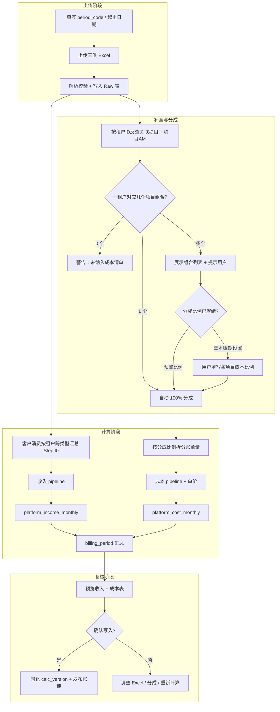

# 账期导入与经营核算实现方案

> 版本：v1.3（设计稿）  
> 日期：2026-05-19  
> 变更：v1.1 — 账单详情 Excel 不再含客户经理/项目名称；改由租户反查项目并补全 AM；支持一租户多项目成本分成配置  
> 变更：v1.2 — §6.4 增加「卡时价阶梯分成」：按成交卡时/刊例价落档后取档内分成比例计算售出成本  
> 变更：v1.3 — §5.3 增加 Step I0：客户消费明细按租户跨「类型」汇总后再参与收入计算  
> 状态：**设计稿 — 确认后再实施代码**  
> 关联：`apps/web/src/lib/types/finance.ts`、`cost-row-utils.ts`、`income-row-utils.ts`、`/finance/create` 页面

---

## 1. 目标与原则

### 1.1 业务目标

| # | 目标 | 说明 |
|---|------|------|
| G1 | 添加账期 | 用户填写账期编码与起止日期，上传三类 Excel，系统计算并生成收入/成本结果 |
| G2 | 原始数据可追溯 | 上传文件与解析行 **只追加、不覆盖**；计算结果可追溯到具体导入批次与源行号 |
| G3 | 规则自动计算 | 汇总、含税/不含税换算、卡时成本、毛利等由规则引擎生成，人工仅做 **调账**（沿用现有 override 机制） |
| G4 | B/C 分轨收入 | 「月度经营收入账单」按 **客户类型（B端 / C端）** 分别产出 |
| G5 | B端成本按 AM 汇总 | 「月度经营成本」仅统计 **B端** 租户账单；按 **项目 AM** → 区域 × 卡型 两级展示；一租户多项目时按 **成本分成比例** 拆分后归因 |
| G6 | 多项目成本分成 | 账单详情不含 AM/项目列；系统按租户 ID 反查 CRM 项目并补全；多项目组合须配置分成比例后方可计算成本 |

### 1.2 非目标（本期）

- 不解析 CPU 任务类消费（输入表已声明「除 CPU 任务外」）
- 不在本方案中实现供应商账单结算（仅消费 **机房 × 卡型** 的采购单价配置）
- 不替代 CRM 域 `tenant_bill` 的日常出账流程；本账期为 **财务经营月结** 专用

### 1.3 设计原则

1. **不可变原始层（Immutable Raw）**：Excel → 解析行表，禁止 UPDATE 业务字段，仅允许软删/作废导入批次。
2. **可重算派生层（Derived）**：`platform_income_monthly`、`platform_cost_monthly` 由计算任务根据原始层 + 主数据 **覆盖写入**（同一 `billing_period_id` + `calc_version`）。
3. **主数据外置**：项目名、客户经理、机房卡价、**成本分成比例** 来自 CRM/配置表；账单 Excel 仅含消费与卡时事实列（§3.3）。
4. **金额精度**：内部计算用 `decimal(15,4)`；展示四舍五入到分；与现有 `toMoneyString`（4 位小数）对齐。

---

## 2. 端到端流程



**状态机（`billing_period.status`）**

| 状态 | 含义 |
|------|------|
| `draft` | 已创建，未上传或上传未完成 |
| `imported` | 三类 Raw 均已导入且校验通过 |
| `pending_allocation` | 存在「一租户多项目」且本账期尚未确认成本分成比例（阻塞计算） |
| `computed` | 已计算，待人工复核（对应 UI「计算结果（未写入）」） |
| `published` | 已发布，对外可见；允许调账 override，调账后标记 `adjusted` |
| `void` | 作废；Raw 保留，派生层不再用于报表 |

---

## 3. 输入数据（Excel）

三类文件与现有 `/finance/create` 三个上传槽位一一对应。列名允许 **别名映射**（见 §3.4），以下为标准列名。

### 3.1 客户消费明细（`customer_consumption`）

| 列名 | 类型 | 必填 | 说明 |
|------|------|------|------|
| 租户ID | integer / string | 是 | 平台租户 ID，对应 `tenant.platform_tenant_id` |
| 类型 | string | 否 | 产品线，如「弹性服务部署」「云主机」 |
| 租户类型 | string | 否 | 内部 / 外部 |
| 客户类型 | string | 是 | **B端** / **C端**，收入分轨依据 |
| 项目名称 | string | 否 | Excel 内仅供参考；**输出以 DB 为准**（§5.1） |
| 总消费 | money | 是 | 含税消费总额 |
| 券消费 | money | 否 | 默认 0 |
| 余额消费 | money | 是 | 余额账户消费 |

**粒度**：一行 = 某租户在某一 **类型**（产品线）下的一条消费汇总。

**重要**：同一 `租户ID` 可在表中出现 **多行**（不同类型分开统计，如「弹性服务部署」「镜像仓库」「Other」）。收入计算前 **必须** 先按 `租户ID + 客户类型` 将多行 **加总为一条租户消费**（见 §5.3 Step I0），不得按「类型」分别产出收入行。

### 3.2 裸金属消费订单列表（`baremetal_order`）

| 列名 | 类型 | 必填 | 说明 |
|------|------|------|------|
| 订单ID | string | 是 | 平台订单主键 |
| 订单编号 | string | 否 | |
| 租户ID | integer / string | 是 | |
| 机房名称 | string | 否 | 如 `gdong`、`xcsh` |
| 设备型号 | string | 否 | 如 `4090 x 8` |
| 支付状态 | string | 是 | 仅统计 **已支付** |
| 设备状态 | string | 否 | |
| 购买数量 | string | 否 | 如 `20 x 小时时长包` |
| 设备数量 | number | 否 | |
| 订单金额 | money | 否 | |
| 退款金额 | money | 否 | 默认 0 |
| 最终总额 | money | 是 | 收入侧「线上裸金属消费」来源 |
| 下单时间 | datetime | 是 | 用于账期时间过滤 |

**账期过滤**：`period_start 00:00:00` ≤ `下单时间` ≤ `period_end 23:59:59`（时区：配置项，默认 `Asia/Shanghai`）。

### 3.3 客户账单详情（除 CPU 任务外）（`tenant_bill_snapshot`）

Excel **仅包含以下列**（不含客户经理、项目名称；二者由系统根据租户 ID 反查 CRM 补全，见 §4.4）：

| 列名 | 类型 | 必填 | 说明 |
|------|------|------|------|
| 租户ID | integer / string | 是* | 平台租户 ID；见下方「总计行」例外 |
| 总消费 | money | 是 | |
| 券消费 | money | 否 | 默认 0 |
| 余额消费 | money | 是 | 成本侧核心金额 |
| 总卡时 | hours | 否 | |
| 券卡时 | hours | 否 | 默认 0 |
| 余额卡时 | hours | 是 | 成本侧「售出时长」数量基础 |
| GPU型号 | string | 是** | 如 `4090`、`4090-48G`；总计行可空 |
| 区域 | string | 是** | 机房/集群编码，如 `guangdong`、`zjsx-p1`；总计行可空 |

\* **总计行**：`租户ID` 为 `总计` / `合计` / `Total`（大小写不敏感）时，该行作为表尾校验参考，**不写入 Raw 业务表**，不参与分成与成本计算。可选校验：总计行各金额列 ≈ 明细行之和（允许 ±0.01 元误差）。

\** 总计行 `GPU型号`、`区域` 留空。

**粒度**：一行 = 某租户在某 **区域 × GPU 型号** 下的账单汇总。同一租户可多行（如租户 984 在 `zjsx-p1` 与 `henan-xc-p1` 各一行）。

**样例（用户提供）**

| 租户ID | 总消费 | 券消费 | 余额消费 | 总卡时 | 券卡时 | 余额卡时 | GPU型号 | 区域 |
| --- | --- | --- | --- | --- | --- | --- | --- | --- |
| 总计 | 417,634.32 | 48,005.68 | 369,628.64 | 252,623.4 | 27,290.1 | 225,333.26 | | |
| 4583 | 94,301.97 | 0 | 94,301.97 | 37,968.66 | 0 | 37,968.66 | 4090 | guangdong |
| 984 | 49,190.86 | 0 | 49,190.86 | 25,312.97 | 0 | 25,312.97 | 4090-48G | zjsx-p1 |

### 3.4 列别名与清洗规则

| 规则 | 说明 |
|------|------|
| 金额清洗 | 去掉 `￥`、`,`、空格；空单元格 → `0` |
| 租户ID | 统一 trim；`"984"` 与 `984` 等价 |
| 客户类型 | 归一化：`B端`/`B`/`b端` → `B`；`C端`/`C` → `C` |
| 区域编码 | trim + lower；维护 `idc_region_alias` 映射表（如 `gdong` → 广东韶关） |
| GPU 型号 | 归一化用于 **单价匹配**：`4090-48G` 可匹配 `4090` 或精确档（配置优先级：精确 > 前缀） |

### 3.5 校验（导入阻断）

| 编号 | 校验 |
|------|------|
| V1 | 三类文件均已上传且解析成功 |
| V2 | 每表 `租户ID` 非空率 100% |
| V3 | `客户消费明细` 中 `客户类型` 仅为 B / C |
| V4 | `裸金属` 中 `最终总额` ≥ 0；`退款金额` ≤ `订单金额` |
| V5 | `账单详情` 明细行（非总计）中 `余额卡时` ≥ 0、`余额消费` ≥ 0 |
| V6 | 明细行租户 ID 在 `tenant.platform_tenant_id` 存在（未知租户 → 警告行表 + 可选阻断策略） |
| V7 | 账期内 `裸金属` 与 `账单详情` 的租户 ID 集合可与客户消费不一致（允许，但记入对账报告） |
| V8 | 总计行（若存在）金额与明细汇总一致（可配置为警告或阻断） |
| V9 | 单租户关联项目数 = 0 → 不阻断导入，但进入「无法补全项目」清单 |
| V10 | 单租户关联项目数 ≥ 2 且无预置/本账期分成 → 状态 `pending_allocation`，**阻断成本计算** |
| V11 | 同一租户分成比例之和 = 100%（±0.0001 容差）；每项 &gt; 0 |
| V12 | 同一 `租户ID` 在客户消费明细中 `客户类型` 唯一（若 B/C 混用 → 警告或阻断，见 §5.3） |
| V13 | Step I0 后：每个 `(租户ID, 客户类型)` 仅一条 agg 记录；`row_count_by_type` ≥ 1 |

---

## 4. 数据模型（可追溯）

### 4.1 原始层（只追加）

```
billing_period_import_batch
  id, billing_period_id, file_type, file_name, file_sha256,
  row_count, uploaded_by, uploaded_at, status

billing_period_raw_customer_consumption
  id, batch_id, row_no, tenant_platform_id, product_type,
  tenant_type, customer_type, project_name_excel,
  total_consumption, voucher_consumption, balance_consumption,
  raw_json
  -- product_type 即 Excel「类型」；收入计算前按租户汇总，见 agg 表

billing_period_agg_customer_consumption
  id, billing_period_id, tenant_platform_id, customer_type,
  total_consumption, voucher_consumption, balance_consumption,
  source_raw_ids, row_count_by_type, created_at
  -- Step I0 产出；一行 = 一租户×客户类型（跨类型已加总）

billing_period_raw_baremetal_order
  id, batch_id, row_no, order_id, order_no, tenant_platform_id,
  idc_name, device_model, pay_status, device_status,
  purchase_qty_text, device_qty, order_amount, refund_amount,
  final_amount, ordered_at, raw_json

billing_period_raw_tenant_bill
  id, batch_id, row_no, tenant_platform_id,
  total_consumption, voucher_consumption, balance_consumption,
  total_card_hours, voucher_card_hours, balance_card_hours,
  gpu_model, region_code,
  raw_json
  -- 注意：不含客户经理/项目名称，补全结果见 enrichment 表

billing_period_tenant_project_enrichment
  id, billing_period_id, tenant_platform_id, tenant_id,
  project_id, project_name, staff_id, account_manager_name,
  source, resolved_at
  -- source: auto_single | auto_preset | manual_period

billing_tenant_cost_allocation
  id, billing_period_id, tenant_platform_id, tenant_id,
  project_id, allocation_percent,          -- 0~100，同租户合计 100
  preset_id,                             -- 若来自预置表则记录 FK
  created_by, created_at, updated_at

tenant_project_cost     -- 预置：同一租户多项目默认分成
  id, tenant_id, project_id,
  allocation_percent,
  effective_from, effective_to,          -- effective_to NULL = 当前生效
  remark, created_by, created_at
```

- `raw_json`：保留原始行对象，便于审计。
- `row_no`：Excel 物理行号（含表头偏移），支持「定位到源表第 N 行」。
- 重新上传：新建 `batch_id`，旧 batch 标记 `superseded`；计算默认取 **最新有效 batch**。

### 4.2 派生层（与现有类型对齐）

沿用 `BillingPeriod`、`PlatformIncomeMonthly`、`PlatformCostMonthly`（见 `finance.ts`），补充：

| 字段 | 说明 |
|------|------|
| `billing_period.calc_version` | 单调递增，每次重算 +1 |
| `billing_period.customer_type` | 收入表分轨：`B` / `C`（账期级可各生成一套 income，或 income 行带 `customer_type`） |
| `platform_income_monthly.customer_type` | 建议增加，便于同账期 B/C 两行并存 |
| `platform_cost_monthly.source_raw_ids` | JSON：贡献的 raw 行 id 列表（可选，用于钻取） |
| `platform_cost_monthly.project_id` | 建议增加：多项目拆分后的项目归因 |
| `platform_cost_monthly.allocation_percent` | 建议增加：该行占原 Raw 行的比例（审计） |

### 4.3 主数据依赖

| 数据 | 用途 | 查询键 |
|------|------|--------|
| `tenant` | 租户主键、`platform_tenant_id` | 账单表 `租户ID` |
| `project` | **项目名称** | `primary_tenant_id` ∪ `project_tenant` |
| `project_staff_assignment` | **客户经理**（项目 AM） | `project_id` + `role_type = account_manager` + `effective_to IS NULL` |
| `customer` | 客户全称（法人名） | `tenant.customer_id` |
| `tenant_project_cost` | 多租户默认成本分成 | `tenant_id` |
| `billing_tenant_cost_allocation` | 本账期分成覆盖 | `billing_period_id` + `tenant_id` |
| 机房 × 卡型单价 | 卡时成本、分成成本 | `区域` + `GPU型号` → `supplier_unit_cost` 或 `data_center_device` |

### 4.4 租户 → 项目 → 客户经理 补全

导入账单详情后，对 **每个明细行租户 ID**（不含总计行）执行项目反查，生成 **项目 × 客户经理** 组合列表。

**关联项目集合（与 `crm-database.md` R2.2 / R2.3 一致）**

```sql
-- 给定平台租户 ID，列出所有关联经营项目及当前项目 AM
SELECT DISTINCT
  t.id              AS tenant_id,
  t.platform_tenant_id,
  p.id              AS project_id,
  p.name            AS project_name,
  psa.user_staff_id AS staff_id,
  us.name           AS account_manager_name   -- 或 login_name / display_name
FROM tenant t
JOIN project p ON p.customer_id = t.customer_id
  AND (
    p.primary_tenant_id = t.id
    OR EXISTS (
      SELECT 1 FROM project_tenant pt
      WHERE pt.tenant_id = t.id AND pt.project_id = p.id
    )
  )
LEFT JOIN project_staff_assignment psa
  ON psa.project_id = p.id
 AND psa.role_type = 'account_manager'
 AND psa.effective_to IS NULL
LEFT JOIN user_staff us ON us.id = psa.user_staff_id
WHERE t.platform_tenant_id = :tenant_platform_id
  AND p.status <> 'archived';   -- 可选：排除已归档项目
```

> **说明**：一个租户可对应 **多个** `(project_id, staff_id)` 组合（不同项目有不同 AM）。组合数 = 关联项目数（每项目取当前唯一 AM；无 AM 的项目单独标记，见 §6.1）。

**补全结果写入** `billing_period_tenant_project_enrichment`（每个账期、每个租户、每个项目一行）。

| 场景 | 系统行为 | 用户操作 |
|------|----------|----------|
| **0 个项目** | 写入 enrichment 空集；该租户账单进入「未关联项目」报告；**不参与成本计算** | CRM 中维护 `project.primary_tenant_id` 或 `project_tenant` |
| **1 个项目** | 自动 `allocation_percent = 100`；补全 `project_name`、`account_manager_name` | 无 |
| **≥2 个项目** | UI **醒目提示**：「租户 {id} 对应 N 个项目/客户经理组合，请设置成本分成比例」；列出下表 | 本账期填写比例，或依赖预置比例 |

**多项目提示 UI 示例**

| 租户ID | 项目名称 | 客户经理 | 成本比例(%) | 来源 |
|--------|----------|----------|-------------|------|
| 984 | 北京海绵·训练集群 | 高怎 | 60 | 预置 |
| 984 | 北京海绵·推理服务 | 李四 | 40 | 预置 |
| | | **合计** | **100** | |

### 4.5 成本分成比例（预置 + 账期覆盖）

**粒度**：按 **租户**（`platform_tenant_id`），对该租户下 **所有** 账单详情 Raw 行（各区域×卡型）统一适用同一套项目分成比例。

**优先级**（从高到低）

1. `billing_tenant_cost_allocation`（本账期用户保存的比例）
2. `tenant_project_cost`（`effective_to IS NULL` 且 `effective_from <= period_end`）
3. 无预置 → 多项目租户进入 `pending_allocation`，**必须**由用户在本账期配置后方可计算成本

**约束**

```
∀ tenant t:  Σ allocation_percent(t, project) = 100
∀ project:  allocation_percent > 0
```

**预置表示例**

| tenant_id (平台ID) | project_id | allocation_percent | 备注 |
|--------------------|------------|-------------------|------|
| 984 | prj-train | 60 | 训练为主 |
| 984 | prj-infer | 40 | 推理为辅 |

**拆分后的度量（对 Raw 行 *r*、项目 *p*）**

```
alloc = allocation_percent(t, p) / 100

balance_consumption[r,p] = balance_consumption[r] × alloc
balance_card_hours[r,p]  = balance_card_hours[r] × alloc
voucher_card_hours[r,p]  = voucher_card_hours[r] × alloc
-- 券消费、总消费等同理；金额/卡时均按同一比例线性拆分
```

> 线性拆分为默认策略；四舍五入后末个项目用「差额补齐」保证同 Raw 行各项目之和 = 原值（最大 0.0001 元/卡时误差）。

**收入侧说明**：月度经营收入账单仍按 **租户维度** 汇总（§5），不因多项目拆行；成本侧才按 **项目 AM** 拆分。若未来需要项目级收入，可二期在 `platform_income_monthly` 增加 `project_id`。

### 4.6 机房 × 卡型单价

解析顺序（与现有 `resolveUnitPricePerHour` 一致）：

1. `supplier_unit_cost`：`idc_code` + `card_type` + 账期生效日 `effective_from <= period_end`
2. `data_center_device`：`cardTimeCostPerHour` / `revenueShareCostPerHour`
3. `supplier_pricing_record`：合同单价

合作模式分支：

| 模式 | 售出时长成本（含税口径前） | 不含税售出时长成本 |
|------|---------------------------|-------------------|
| **卡时** `card_time` | `unit_price_per_hour × balance_card_hours` | 见 §6.3 / §6.4 |
| **固定分成** `revenue_share` | `balance_consumption × revenue_share_percent / 100` | 见 §6.3 / §6.4 |
| **卡时价阶梯分成** `tiered_revenue_share` | 先算成交/刊例比例落档，再 `balance_consumption × 档内分成% / 100` | 见 §6.3 Step C4、§6.4 |
| **卡时价阶梯卡时** `tiered_card_time` | 落档后 `list_price × list_price_multiplier × balance_card_hours` | 见 §6.4（可选，与供应商合同 `tier_basis=multiplier` 一致） |

主数据与档位定义对齐 [`supplier-database.md`](./supplier-database.md) §3.2.1：`supplier_card_list_price`（刊例价）、`supplier_pricing_tier` / `supplier_unit_cost.tier_json`（`deal_to_list_ratio_min/max` 或 `list_price_multiplier`）。

---

## 5. 输出一：月度经营收入账单

### 5.1 输出列定义

| 列 | 字段 | 说明 |
|----|------|------|
| 项目名称 | `project_name` | DB 解析（§4.3），非 Excel |
| 客户全称 | `customer_full_name` | `customer.legal_name` |
| 租户ID | `tenant_id` | 平台租户 ID（展示 `platform_tenant_id`） |
| 补充消费 | `supplementary_consumption` | 对账差额，可正可负 |
| 余额消费 | `balance_consumption` | 账单口径余额消费 |
| 线上裸金属消费 | `bare_metal_consumption` | 账期内裸金属 `最终总额` 合计 |
| 总消费 | `total_consumption` | 三项之和 |

### 5.2 分轨规则

- **先汇总、再分轨**：全部 Raw 客户消费行经 **§5.3 Step I0** 按 `(租户ID, 客户类型)` 合并为租户级消费后，再进入 B/C pipeline。
- **B端 pipeline**：Step I0 结果中 `customer_type = B` 的租户集合。
- **C端 pipeline**：Step I0 结果中 `customer_type = C` 的租户集合。
- 两套 pipeline **独立计算、独立落表**（或同一表用 `customer_type` 区分）；**每个租户在每条 pipeline 中至多一行收入**。
- 仅出现在 `账单详情` / `裸金属` 但未出现在 `客户消费明细` 的租户：归入 **对账差异报告**，不自动进入收入表（可配置为阻断）。

### 5.3 计算步骤（按租户 *t*、客户类型 *ctype*）

收入侧以 **租户** 为输出粒度（每个 `租户ID + 客户类型` 对应 `platform_income_monthly` 一行）。在套用账单、裸金属与补充消费公式 **之前**，须先将客户消费明细中同一租户下的多「类型」行合并。

#### Step I0 — 客户消费按租户预汇总（跨「类型」加总）

**分组键**：`(tenant_platform_id, customer_type)` — 即平台租户 ID + B端/C端。

**聚合规则**（对 Raw `customer_consumption` 中分组内 **所有** 行求和，**忽略** `类型` / `租户类型` / Excel 内 `项目名称` 差异）：

```
C_total(t, ctype)   = Σ row.total_consumption
C_voucher(t, ctype) = Σ row.voucher_consumption
C_balance(t, ctype) = Σ row.balance_consumption
```

其中求和范围：`row.tenant_platform_id = t` 且 `normalize(row.customer_type) = ctype`。

**示例（租户 984，B端）**

Excel 原始行（节选）：

| 租户ID | 类型 | 客户类型 | 总消费 | 券消费 | 余额消费 |
|--------|------|----------|--------|--------|----------|
| 984 | 弹性服务部署 | B端 | 80,000.00 | 0 | 80,000.00 |
| 984 | 镜像仓库 | B端 | 5,047.47 | 0 | 5,047.47 |
| 984 | Other | B端 | 25,000.00 | 0 | 25,000.00 |

预汇总后 **一条** 租户消费（写入中间表或内存 DTO，供 Step I1 使用）：

| 租户ID | 客户类型 | C_total | C_voucher | C_balance |
|--------|----------|---------|-----------|-----------|
| 984 | B | 110,047.47 | 0 | **110,047.47** |

> 此后 Step I1～I5 中的 `t` 均指该 **已汇总** 的租户消费，不再区分「弹性服务部署 / 镜像仓库 / Other」。

**一致性与校验**

| 规则 | 说明 |
|------|------|
| 客户类型一致 | 同一 `租户ID` 下若出现不同 `客户类型`（如既有 B 又有 C），**分别** 进入 B/C pipeline，**不得** 混加 |
| 可选阻断 | 同一 `租户ID` 仅允许一种 `客户类型`；若违反则导入警告（可配置为阻断） |
| 行级追溯 | 中间结果 `billing_period_agg_customer_consumption` 记录 `source_raw_ids[]`，可下钻至各「类型」源行 |

**中间表（建议）**

```
billing_period_agg_customer_consumption
  id, billing_period_id, tenant_platform_id, customer_type,
  total_consumption, voucher_consumption, balance_consumption,
  source_raw_ids, row_count_by_type, created_at
```

#### Step I1 — 客户消费侧（使用 Step I0 结果）

```
C_total(t)   = agg.total_consumption      -- 已含多类型加总
C_voucher(t) = agg.voucher_consumption
C_balance(t) = agg.balance_consumption
```

**Step I2 — 账单侧汇总（源：Raw 账单详情）**

```
B_balance(t) = Σ row.balance_consumption
B_total(t)   = Σ row.total_consumption
```

**Step I3 — 裸金属汇总（源：Raw 裸金属，已支付且账期内）**

```
M_bare(t) = Σ row.final_amount
```

**Step I4 — 输出字段**

```
balance_consumption(t) = B_balance(t)

bare_metal_consumption(t) = M_bare(t)

supplementary_consumption(t) = C_balance(t) - B_balance(t) - M_bare(t)

total_consumption(t) = supplementary_consumption(t)
                     + balance_consumption(t)
                     + bare_metal_consumption(t)
```

等价关系：

```
total_consumption(t) = C_balance(t)
```

即：**总消费以「客户消费明细」的余额消费口径为锚**；账单与裸金属通过「补充消费」吸收差额。

**Step I5 — 项目与客户名称**

对租户 *t* 执行 §4.4，取 **主项目** 展示（仅 1 个关联项目时即该项目；多项目时取 `primary_tenant_id` 对应项目，或 `project.name` 拼接展示为「多项目」并链到分成配置页），写入 `project_name`、`customer_full_name`。

### 5.4 公式说明

| 公式 | 含义 |
|------|------|
| `total = sup + balance + bare` | 与现有 `computeTotalConsumption` 一致 |
| `sup = C_balance - B_balance - M_bare` | **对账差额**：平台消费报表相对账单+裸金属归因的差异 |
| `total = C_balance` | 代入可得恒等式；保证与上游「客户消费」对齐 |

**示例演算（租户 984，B端）**

| 来源 | 值 |
|------|-----|
| 客户消费 `C_balance` | 110,047.47（= 弹性服务部署 80,000 + 镜像仓库 5,047.47 + Other 25,000，见 §5.3 Step I0） |
| 账单 `B_balance`（两行合计） | 49,190.86 + 38,225.85 = **87,416.71** |
| 裸金属 `M_bare` | 0 |
| `supplementary` | 110,047.47 − 87,416.71 − 0 = **22,630.76** |
| `balance`（输出） | 87,416.71 |
| `total` | 22,630.76 + 87,416.71 = **110,047.47** |

> 说明：用户样例输出中海绵智能一行显示 `balance=110,428.45`、`sup=-49,241.10`、`total=61,187.35`，与上述 **C_balance 锚定** 公式不一致，可能来自另一版对账口径（例如以账单 `总消费` 为锚、或含线下补录）。**实施前须与财务确认唯一口径**；本方案默认采用 `C_balance` 锚定，并在 UI 提供「对账差异说明」列展示 `C_total - B_total` 供核对。

**租户 4583（样例）**

| 项 | 值 |
|----|-----|
| `C_balance` | 94,301.97 |
| `B_balance`（账单单行） | 94,301.97 |
| `M_bare` | 0 |
| `supplementary` | 0 |
| `balance` | 94,301.97 |
| `total` | 94,301.97 |

**线下大额补充（样例 巨神智能 3018）**

若 `C_balance = 108,000` 且账单、裸金属均为 0：

```
supplementary = 108,000, balance = 0, bare = 0, total = 108,000
```

### 5.5 账期级汇总

```
billing_period.total_income     = Σ total_consumption   (B + C 两条 pipeline 合计)
billing_period.balance_income   = Σ balance_consumption
billing_period.baremetal_income = Σ bare_metal_consumption
billing_period.supplementary    = Σ supplementary_consumption
```

---

## 6. 输出二：月度经营成本（仅 B 端 + 项目 AM + 成本分成）

### 6.1 过滤条件

仅纳入同时满足：

1. `客户消费明细.customer_type = B`（或账单行对应租户在 B 端集合内）；
2. 租户至少关联 **1 个** CRM 项目（§4.4）；
3. 多项目租户已配置 **成本分成比例**（§4.5），且状态非 `pending_allocation`；
4. 项目存在有效 **项目 AM**：`project_staff_assignment.role_type = account_manager` 且 `effective_to IS NULL`。

**不纳入**：C 端租户；0 项目租户；多项目但未配置分成；项目无 AM（记入「未纳入成本计算清单」，列明原因）。

### 6.2 聚合维度

成本在 **拆分后的 (项目, AM)** 上聚合，再按 AM 汇总：

| 层级 | `platform_cost_monthly.type` | 维度 |
|------|------------------------------|------|
| 分项 | `record` | `staff_id` × `project_id` × `idc_code` × `card_type` |
| 汇总 | `sum` | `staff_id`（客户经理） |

展示（与现 UI 一致）：汇总行 = 客户经理（如 `wangpeng`）；子行 = `区域` + `GPU型号`（同一 AM 下多项目、多区域分项相加后展示，或 UI 增加 `project_name` 列可选展开）。

### 6.3 计算步骤

#### Step C0 — 租户项目拆分（源：Raw 账单 + §4.5 分成）

对每个 Raw 行 `row`（租户 `t`、区域 `r`、卡型 `g`），对每个关联项目 `p`：

```
row_p.balance_consumption = row.balance_consumption × alloc(t,p)
row_p.balance_card_hours  = row.balance_card_hours  × alloc(t,p)
row_p.voucher_card_hours  = row.voucher_card_hours  × alloc(t,p)
staff_id(p) = 项目 p 的 account_manager（§4.4）
```

#### Step C1 — 汇总原始量（拆分后）

```
balance_consumption[a,r,g] = Σ row_p.balance_consumption
  WHERE staff_id(row_p) = a AND region = r AND gpu = g

balance_card_hours[a,r,g]  = Σ row_p.balance_card_hours
total_card_hours[a,r,g]    = Σ row_p.total_card_hours      -- 阶梯分成落档用（§6.4）
voucher_card_hours[a,r,g]  = Σ row_p.voucher_card_hours
```

> 同一 AM 负责多项目时，不同项目的拆分行在 `(a,r,g)` 上 **累加**（如 wangpeng 同时负责项目甲、乙，各 50% 拆分的同区域行会合并到同一分项）。

**Step C2 — 确认收入（不含税）**

常量（与现网 `cost-row-utils.ts` 一致）：

```
TAX_DIVISOR = 1.06
```

```
confirmed_revenue_excl_tax = balance_consumption / TAX_DIVISOR
```

**数值验证（样例 wangpeng 汇总行）**

```
94,177.57 / 1.06 = 88,846.858… ≈ 88,846.87  ✓
```

**Step C3 — 解析单价与合作模式**

```
pricing = resolve_unit_cost(idc_code=r, card_type=g, as_of=period_end)
mode    = pricing.pricing_mode
        -- card_time | revenue_share | tiered_revenue_share | tiered_card_time

list_price = pricing.list_price_per_hour     -- 刊例价（元/卡时），阶梯模式必填
unit       = pricing.unit_price_per_hour      -- 固定卡时模式
ratio      = pricing.revenue_share_percent    -- 固定分成模式，%
tiers      = pricing.tier_json.tiers          -- 阶梯档列表（按 tier_order 排序）
tier_basis = pricing.tier_json.tier_basis     -- ratio_band | multiplier
```

**Step C4 — 售出时长成本（不含税）**

**模式 A — 卡时 `card_time`**

```
sold_duration_cost_excl_tax = (unit × balance_card_hours) / TAX_DIVISOR
```

**模式 B — 固定分成 `revenue_share`**

```
sold_duration_cost_excl_tax = (ratio / 100 × balance_consumption) / TAX_DIVISOR
```

**模式 C — 卡时价阶梯分成 `tiered_revenue_share`（§6.4）**

```
IF total_card_hours[a,r,g] <= 0:
  -- 无法计算成交卡时价 → 记入对账报告，售出成本 = 0 或阻断（可配置）
  sold_duration_cost_excl_tax = 0
ELSE:
  deal_unit_price = balance_consumption / total_card_hours
  deal_to_list_ratio = deal_unit_price / list_price
  tier = match_tier(tiers, deal_to_list_ratio, tier_basis)   -- 见 §6.4
  sold_duration_cost_excl_tax = (tier.revenue_share_percent / 100 × balance_consumption) / TAX_DIVISOR
```

**模式 D — 卡时价阶梯卡时 `tiered_card_time`（`tier_basis = multiplier`）**

```
deal_to_list_ratio = (balance_consumption / total_card_hours) / list_price   -- total_card_hours > 0
tier = match_tier_by_multiplier(tiers, deal_to_list_ratio)
tier_unit = list_price × tier.list_price_multiplier
sold_duration_cost_excl_tax = (tier_unit × balance_card_hours) / TAX_DIVISOR
```

> **模式边界**：固定分成 / 阶梯分成 **不使用** `balance_card_hours` 乘单价；固定卡时 / 阶梯卡时 **不使用** `balance_consumption` 直接乘固定分成比例。阶梯模式 **必须** 能解析 `list_price_per_hour` 与 `tiers`。

**样例验算（henan-xc-p1 · 4090）**

```
balance_consumption = 69,854.51
balance_card_hours  = 48,259.17
confirmed = 69,854.51 / 1.06 = 65,900.48  ✓
sold = 36,422.02 → 隐含单价 ≈ 36,422.02 × 1.06 / 48,259.17 ≈ 0.80 元/卡时
gross = 65,900.48 - 36,422.02 - 0 = 29,478.46  ✓
```

**Step C5 — 赠送时长成本（不含税）**

```
gifted_duration_cost_excl_tax = (unit × voucher_card_hours) / TAX_DIVISOR
```

若 `voucher_card_hours = 0`，则为 `0`。券卡时调账后按 override 重算（沿用 `deriveCostFieldsAfterVoucherAdjustment`）。

**Step C6 — 毛利**

```
gross_profit = confirmed_revenue_excl_tax
             - sold_duration_cost_excl_tax
             - gifted_duration_cost_excl_tax
```

**Step C7 — 客户经理汇总行（type = sum）**

对同一 `staff_id` 下所有 `record` 行：

```
field_sum = Σ record.field   -- field ∈ {balance_consumption, balance_card_hours, ...}
```

实现与 `recomputeStaffSumRows` 相同。

### 6.4 卡时成本与分成成本对照表

#### 6.4.1 模式总览

| 模式 | `pricing_mode` | 业务含义 | 售出时长成本（不含税） |
|------|----------------|----------|------------------------|
| 固定卡时 | `card_time` | 按采购卡时单价结算 | `(成交卡时单价 × 余额卡时) / 1.06` |
| 固定分成 | `revenue_share` | 按固定供应商分成比例 | `(分成比例% × 余额消费) / 1.06` |
| **卡时价阶梯分成** | `tiered_revenue_share` | 按 **实际成交卡时相对刊例价** 落档，取该档 **分成比例** | 见 §6.4.2 |
| 卡时价阶梯卡时 | `tiered_card_time` | 按成交/刊例比例落档，取该档 **刊例倍数** 作为结算单价 | 见 §6.4.3 |
| 赠送 | — | 券卡时部分（与主模式共用刊例/成交单价） | `(结算单价 × 券卡时) / 1.06` |

#### 6.4.2 卡时价阶梯分成（`tiered_revenue_share`）

**适用场景**：供应商合同约定——客户实际支付的卡时单价（相对刊例的折扣深度）不同，供应商 **分成比例** 不同。档位由 **成交/刊例比例** 划分，**不按累计用量（卡时）划档**（与 `supplier-database.md` R-S2.4 一致）。

**输入量（分项 `(a,r,g)` 聚合后）**

| 符号 | 来源 | 说明 |
|------|------|------|
| `B` | `balance_consumption` | 余额消费（元，含税） |
| `H_total` | `total_card_hours` | **总卡时**（Excel「总卡时」列，拆分后按 §6.4 汇总） |
| `L` | `list_price_per_hour` | **刊例价**（元/卡时），`supplier_card_list_price` |
| `Tiers[]` | `supplier_unit_cost.tier_json` 或 `supplier_pricing_tier` | 各档 `deal_to_list_ratio_min/max`、`revenue_share_percent` |

**Step T1 — 成交卡时价（元/卡时，含税口径与余额消费一致）**

```
deal_unit_price_per_hour = B / H_total        （要求 H_total > 0）
```

**Step T2 — 成交/刊例比例**

```
deal_to_list_ratio = deal_unit_price_per_hour / L
```

也可写为：`deal_to_list_ratio = B / (H_total × L)`。

**比例展示**：UI 与报告可用百分比，如 `87%` 表示 `deal_to_list_ratio = 0.87`。

**Step T3 — 档位匹配（`tier_basis = ratio_band`）**

在 `Tiers` 中查找满足下列条件的 **唯一** 档位 `tier`（推荐 **左闭右开** `[min, max)`）：

```
deal_to_list_ratio_min ≤ deal_to_list_ratio < deal_to_list_ratio_max
```

**示例档位表**

| tier_order | 成交/刊例区间（比例） | 成交/刊例区间（% 展示） | 档内分成 `revenue_share_percent` |
|------------|----------------------|-------------------------|----------------------------------|
| 1 | [0.95, 1.00) | [95%, 100%) | 25% |
| 2 | [0.90, 0.95) | [90%, 95%) | 28% |
| 3 | [0.80, 0.90) | [80%, 90%) | 32% |
| 4 | [0.00, 0.80) | [0%, 80%) | 35% |

**数值样例（与用户描述一致）**

```
B = 49,190.86 元
H_total = 25,312.97 卡时
L = 2.30 元/卡时（刊例价）

deal_unit_price = 49,190.86 / 25,312.97 ≈ 1.9434 元/卡时
deal_to_list_ratio = 1.9434 / 2.30 ≈ 0.8449  →  展示约 84.5%

落档：0.80 ≤ 0.8449 < 0.90  →  命中 tier_order = 3，分成 32%

售出时长成本(不含税) = (32% × 49,190.86) / 1.06 ≈ 14,850.83 元
```

若 `deal_to_list_ratio = 0.87`（87%），则 `0.80 ≤ 0.87 < 0.90`，仍命中 **80%–90%** 档，按该档 `revenue_share_percent` 计算（与用户举例一致）。

**Step T4 — 售出时长成本（不含税）**

```
sold_duration_cost_excl_tax = (tier.revenue_share_percent / 100 × B) / TAX_DIVISOR
```

**Step T5 — 审计字段（建议写入成本分项或计算日志）**

| 字段 | 示例 |
|------|------|
| `list_price_per_hour` | 2.30 |
| `deal_unit_price_per_hour` | 1.9434 |
| `deal_to_list_ratio` | 0.8449 |
| `matched_tier_order` | 3 |
| `revenue_share_percent_applied` | 32 |

**边界与异常**

| 情况 | 处理 |
|------|------|
| `H_total = 0` | 无法计算成交卡时价；**阻断该分项** 或售出成本 = 0 并记入「阶梯落档失败」报告（可配置） |
| 比例落在所有区间外 | 默认：取 **最接近** 的档位；或按合同 `overflow_policy`：`use_highest_tier` / `use_lowest_tier` / `block` |
| 多档区间重叠 | 导入合同时校验互斥；运行时取 `tier_order` 最小者并记 warning |
| 缺少刊例价或阶梯档 | 阻断计算，提示维护 `supplier_card_list_price` + `tier_json` |
| `tier_basis = multiplier` 且模式为 `tiered_revenue_share` | 先将 `list_price_multiplier` 视为目标成交/刊例比例，再按 §6.4.3 选档；或要求合同显式配置 `ratio_band`（推荐） |

**伪代码**

```typescript
function soldCostTieredRevenueShare(input: {
  balanceConsumption: number
  totalCardHours: number
  listPricePerHour: number
  tiers: TierRow[]
  taxDivisor?: number
}): SoldCostResult {
  const TAX = input.taxDivisor ?? 1.06
  if (input.totalCardHours <= 0 || input.listPricePerHour <= 0) {
    return { soldExclTax: 0, error: "INVALID_HOURS_OR_LIST_PRICE" }
  }
  const dealUnit = input.balanceConsumption / input.totalCardHours
  const ratio = dealUnit / input.listPricePerHour
  const tier = input.tiers.find(
    (t) =>
      t.dealToListRatioMin <= ratio &&
      ratio < (t.dealToListRatioMax ?? Number.POSITIVE_INFINITY),
  )
  if (!tier?.revenueSharePercent) {
    return { soldExclTax: 0, error: "NO_TIER_MATCH", dealUnit, ratio }
  }
  const soldExclTax =
    (tier.revenueSharePercent / 100) * input.balanceConsumption / TAX
  return {
    soldExclTax,
    dealUnit,
    ratio,
    tierOrder: tier.tierOrder,
    sharePercent: tier.revenueSharePercent,
  }
}
```

#### 6.4.3 卡时价阶梯卡时（`tiered_card_time`，可选）

当合同约定按落档后的 **卡时结算单价**（而非分成比例）计费时使用：

```
deal_to_list_ratio = (B / H_total) / L
tier = match_tier(Tiers, deal_to_list_ratio, tier_basis)
tier_unit_price = L × tier.list_price_multiplier     -- 或 tier.tier_deal_unit_price_per_hour
sold_duration_cost_excl_tax = (tier_unit_price × balance_card_hours) / TAX_DIVISOR
```

> 阶梯卡时模式用 **余额卡时** 计数量；阶梯分成模式用 **余额消费** 计金额。二者勿混用。

#### 6.4.4 赠送时长成本

```
gifted_duration_cost_excl_tax = (settlement_unit_price × voucher_card_hours) / TAX_DIVISOR
```

`settlement_unit_price` 取值：

- 固定卡时 / 阶梯卡时：与售出成本相同逻辑的 `unit` 或 `tier_unit_price`；
- 固定分成 / 阶梯分成：一般用 `deal_unit_price_per_hour`（Step T1），或合同约定的赠送结算价。

#### 6.4.5 完整公式卡片

```
确认收入(不含税) = 余额消费 / 1.06

售出时长成本(不含税) =
  IF pricing_mode = card_time
    THEN (unit_price_per_hour × 余额卡时) / 1.06
  ELSE IF pricing_mode = revenue_share
    THEN (revenue_share_percent% × 余额消费) / 1.06
  ELSE IF pricing_mode = tiered_revenue_share
    THEN (档内revenue_share_percent% × 余额消费) / 1.06
         其中 档内% 由 (余额消费/总卡时)/刊例价 落档得到
  ELSE IF pricing_mode = tiered_card_time
    THEN (档内结算卡时单价 × 余额卡时) / 1.06

赠送时长成本(不含税) = (赠送结算单价 × 券卡时) / 1.06

毛利 = 确认收入 - 售出时长成本 - 赠送时长成本
```

### 6.5 区域与机房映射

Excel `区域` 列写入 `platform_cost_monthly.idc_code`；`idc_name` 由 `dim_idc` / 机房主数据反查。

| Excel 区域 | idc_code（示例） | 备注 |
|------------|------------------|------|
| guangdong | guangdong | 广东集群 |
| henan-xc-p1 | henan-xc-p1 | 许昌 |
| zjsx-p1 | zjsx-p1 | 浙江 |
| chengde-p1 | chengde-p1 | 承德 |

裸金属 Excel `机房名称`（`gdong`、`xcsh`）仅用于订单归因，**不直接进入成本分项**，除非未来扩展裸金属成本模块。

### 6.6 账期级成本汇总

```
billing_period.total_cost = Σ gross_profit 的 record 层毛利
                          或 Σ confirmed - Σ sold - Σ gifted   (仅 B端 AM 范围)
```

> 现有 UI「账期毛利 = total_income - total_cost」中 `total_cost` 建议定义为 **售出 + 赠送成本合计** 或 **确认收入 - 毛利**；实施时与财务确认展示口径，并在 `billing_period` 增加 `total_gross_profit` 字段避免歧义。

---

## 7. 计算引擎与任务编排

### 7.1 Pipeline 伪代码

```typescript
async function computeBillingPeriod(periodId: string) {
  const period = await loadPeriod(periodId)
  const raw = await loadLatestRawBatches(periodId)

  const tenants = await resolveTenants(raw)
  const enrichments = await resolveTenantProjects(periodId, raw.tenantBills)
  const allocations = await resolveCostAllocations(periodId, enrichments)
  if (allocations.hasPendingMultiProject) {
    await setPeriodStatus(periodId, "pending_allocation")
    return { blocked: true, tenantsNeedingSplit: allocations.pending }
  }

  const pricing = await loadPricingAsOf(period.period_end)
  const splitRows = applyCostAllocation(raw.tenantBills, allocations)

  const customerAgg = aggregateCustomerConsumptionByTenant(raw.customerConsumption)
  for (const ctype of ["B", "C"] as const) {
    const incomeRows = computeIncome({ customerAgg, raw, tenants, ctype })
    await upsertIncome(periodId, ctype, incomeRows)
  }

  const costRecords = computeCost({
    splitRows,
    pricing,
    filter: "B_with_project_and_AM",
  })
  const costWithSums = recomputeStaffSumRows(costRecords)
  await upsertCost(periodId, costWithSums)

  await updatePeriodTotals(periodId)
  await writeReconciliationReport(periodId, raw, { enrichments, allocations })
}
```

### 7.2 对账报告（非阻断）

| 检查项 | 说明 |
|--------|------|
| 租户覆盖率 | 客户消费 vs 账单 vs 裸金属 租户集合 diff |
| 金额守恒 | `Σ C_balance` vs `Σ income.total` 按 ctype |
| 单价缺失 | 分项成本无法 resolve 单价/刊例价/阶梯档时列出行 |
| 阶梯落档失败 | `总卡时=0` 或 `deal_to_list_ratio` 无匹配档位 |
| AM 缺失 | B 端关联项目无 `account_manager` 指派 |
| 分成未配 | 多项目租户缺少 100% 分成配置 |
| 总计行校验 | Excel 总计 vs 明细 SUM |
| 拆分守恒 | 各租户拆分后金额/卡时之和 = Raw 原值 |

### 7.3 重算与版本

- 修改主数据单价 → 允许对 `computed` 状态账期 **重算**，`calc_version++`。
- 重新上传 Excel → 新 batch，自动触发重算。
- 人工调账（现有 store）→ 仅 override 派生层字段，**不回写 Raw**；记录 `income_adjustment_history` / `voucher_card_hours_adjustment_history`。

---

## 8. API 与 UI（对齐现有页面）

| 动作 | 接口 / 页面 | 说明 |
|------|-------------|------|
| 创建账期 | `POST /finance/billing-periods` | 返回 `draft` |
| 上传 Excel | `POST .../imports/{file_type}` | multipart，写 Raw + batch；账单表触发 §4.4 补全 |
| 查询租户项目组合 | `GET .../tenant-project-bindings` | 返回每租户的项目×AM 列表及预置分成 |
| 保存成本分成 | `PUT .../cost-allocations` | 写入 `billing_tenant_cost_allocation`；可勾选「同步为预置」 |
| 计算 | `POST .../compute` | 校验分成完备后执行；状态 → `computed` 或 `pending_allocation` |
| 发布 | `POST .../publish` | 状态 → `published` |
| 收入明细 | `/finance/[id]/income` | 分 B/C Tab；支持补充消费 / 调账 |
| 成本明细 | `/finance/[id]/cost` | `CostGroupedTable`；券卡时调账 |
| 钻取 Raw | `/finance/[id]/imports` | 展示 batch、行号、raw_json |
| 多项目分成 | `/finance/create` 或 `/finance/[id]/allocations` | 上传账单后展示待配置租户；表格编辑比例；阻断「计算」直至 100% |

**`/finance/create` 页面增补（上传账单后）**

1. 解析完成 → 自动跑 §4.4，刷新「租户项目绑定」卡片。  
2. 若存在多项目租户 → 顶部 **Banner**：「N 个租户需配置成本分成比例后方可计算成本」。  
3. 表格支持：加载预置、均分（100/N）、手动输入、合计实时校验 100%。  
4. 「保存分成」≠「计算」：先持久化 `billing_tenant_cost_allocation`，再允许点击计算。  
5. 单项目租户灰显 100%，不可编辑。

替换 `generateMockFinanceBundle`：改为真实 XLSX 解析（`sheetjs` / `exceljs`）+ 上述 pipeline。

---

## 9. 权限与审计

| 角色 | 权限 |
|------|------|
| Admin / 财务 | 创建账期、上传、计算、发布、调账 |
| AM | 只读已发布账期中 **本人** `staff_id` 的成本分项 |
| 其他 | 不可见草稿账期 |

审计日志：`import_batch`、`compute`（含 `calc_version`、规则版本号）、`publish`、`override` 操作人及时间戳。

---

## 10. 测试用例（验收）

### 10.1 收入

| 用例 | 输入 | 期望 |
|------|------|------|
| E1 | 租户 4583 单行消费+账单 | `sup=0`, `balance=94301.97`, `total=94301.97` |
| E1b | 租户 984 三行不同类型消费 | Step I0 加总后 `C_balance=110047.47`；收入表仅 **1 行** / 租户 |
| E2 | 租户 984 汇总消费+两行账单 | `total=C_balance=110047.47`, `sup=C_balance-B_balance` |
| E3 | 账期内裸金属 268.80 | 对应租户 `bare=268.80`，`sup` 相应减少 |
| E4 | 仅 C 端租户 | 只出现在 C 端收入表 |

### 10.2 成本

| 用例 | 输入 | 期望 |
|------|------|------|
| C1 | henan-xc-p1 + 4090 分项 | `confirmed = balance/1.06`（误差 &lt; 0.01） |
| C2 | 卡时单价已知 | `sold = unit×hours/1.06` |
| C3 | 固定分成模式 | `sold = ratio×balance/1.06` |
| C3b | 阶梯分成：ratio=87% 落在 [80%,90%) | 取该档 `revenue_share_percent`；`sold = pct×balance/1.06` |
| C3c | 阶梯分成：`H_total=0` | 落档失败报告或阻断 |
| C4 | 券卡时 &gt; 0 | `gifted &gt; 0`，毛利减少 |
| C5 | C 端租户 | 不出现在 cost 表 |
| C6 | 无 AM 的 B 端 | 进入未纳入清单，不出现在 cost 表 |
| C7 | 租户 984 关联 2 项目，60/40 分成 | 每条 Raw 行拆为 2 份；AM 汇总与分项毛利之和 = 拆分前按公式计算之总和 |
| C8 | 同上租户使用预置分成 | 上传后自动带出 60/40，无需手填即可计算 |
| C9 | 多项目未配置分成 | 状态 `pending_allocation`，`POST /compute` 返回 422 |
| C10 | Excel 含「总计」行 | 不入 Raw；可选通过 V8 校验 |

### 10.3 追溯

| 用例 | 期望 |
|------|------|
| T1 | 任一分项成本可查到 `raw_tenant_bill.id` + `row_no` |
| T2 | 重新上传后旧 batch `superseded`，历史仍可查 |
| T3 | 任一分项成本可追溯到 `raw_tenant_bill.id` + `project_id` + `allocation_percent` |
| T4 | 本账期分成覆盖预置后，审计日志记录操作者与变更前后比例 |

---

## 11. 实施分期建议

| 阶段 | 内容 |
|------|------|
| P1 | Raw 表 + Excel 解析（含总计行过滤）+ Step I0 agg 表 + §4.4 项目/AM 补全 |
| P1b | 预置分成表 + 账期分成 UI + `pending_allocation` 状态 |
| P2 | 收入 pipeline（B/C 分轨）+ 对账报告 |
| P3 | 成本 pipeline（拆分后聚合）+ 单价主数据 + AM 汇总行 |
| P4 | 发布/重算/审计 + 替换 mock 生成器 |
| P5 | 与 CRM `tenant_bill` 自动同步（可选，二期） |

---

## 12. 待财务确认项

1. **收入对账锚点**：本方案采用 `C_balance`（客户消费余额）为 `total` 锚点；样例海绵智能数据若为准绳，需调整 Step I4 公式。
2. **分成成本是否含税**：本方案对 `balance_consumption` 先按分成比例再除 `1.06`；若合同为含税分成需去掉除税步骤。
3. **阶梯落档口径**：已明确为 **成交卡时价 / 刊例价**（`余额消费/总卡时` 再除以刊例价），**不按累计卡时划档**（见 §6.4.2；与 `supplier-database.md` 一致）。待确认：区间外 `overflow_policy`、末档是否右闭。  
4. **租户 984 多区域两行账单**：收入按租户汇总；成本先按租户×项目分成拆分，再按 AM×区域×卡型分项。  
5. **多项目分成变更历史**：预置变更是否影响已发布账期 — 默认不影响已 `published` 账期，仅影响新账期。

---

## 附录 A：样例输入与输出映射

### A.1 输入片段（用户提供）

- 客户消费：租户 984 / 4583 / 497 / 338 …
- 裸金属：订单 37–33，租户 14829 / 544 / 6159 / 14062 …
- 账单详情：租户 4583 / 984 …；列含区域、GPU；**无**客户经理/项目名称；表尾可有「总计」行

**账单补全示例（租户 4583）**

| 租户ID | 区域 | GPU | → 反查项目 | → 项目 AM |
|--------|------|-----|------------|-----------|
| 4583 | guangdong | 4090 | 北京智算中心科技有限公司 | 王品（wangpeng） |

**账单补全示例（租户 984，假设关联 2 个项目）**

| 租户ID | 区域 | GPU | 项目 | AM | 成本比例 |
|--------|------|-----|------|-----|----------|
| 984 | zjsx-p1 | 4090-48G | 项目甲 | 高怎 | 60% |
| 984 | zjsx-p1 | 4090-48G | 项目乙 | 李四 | 40% |

> 同一 Raw 行（984 + zjsx-p1 + 4090-48G）在成本计算时拆为两行度量，分别进入对应 AM 的分项。

### A.2 输出片段

**收入（B端）**：智算中心 4583 → `balance≈94301.97`（或样例 97611.54 待确认口径）；海绵智能 984 → 见 §5.4 演算。

**成本（B端 × AM）**：`wangpeng` 汇总 + `henan-xc-p1` / `guangdong` 等子行，列与 §6.3 公式一致。

### A.3 与现有代码的对应关系

| 设计概念 | 现有代码 |
|----------|----------|
| `total = sup + balance + bare` | `income-row-utils.computeTotalConsumption` |
| `confirmed = balance / 1.06` | 样例与 `COST_TAX_DIVISOR` 一致 |
| `gifted = unit × voucher_hours / 1.06` | `computeGiftedDurationCostExclTax` |
| `gross = confirmed - sold - gifted` | `computeGrossProfit` |
| AM 汇总行 | `recomputeStaffSumRows` |
| 单价解析 | `resolveUnitPricePerHour`（待扩展刊例价 + `tier_json`） |
| 阶梯分成 | §6.4.2 `soldCostTieredRevenueShare` |

---

*文档结束。确认 §12 待确认项后即可进入 P1 开发。*
