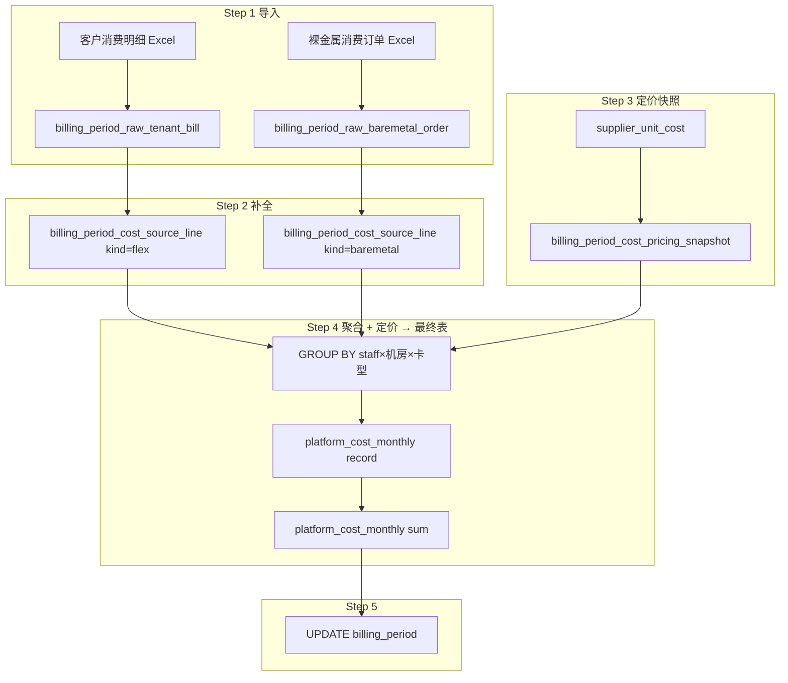

# 成本计算 v3 重设计方案（含逐步实例数据）

> 版本：v3.3  
> 日期：2026-05-25  
> 状态：**方案设计**  
> 关联：现网 `compute-cost.ts`、`finance-schema.ts`、`supply-schema.ts`  
> 说明：本文按业务方最新口径重设计成本 pipeline；**每步附可手算验证的实例数据**。

---

## 0. 数据源约定（成本计算唯一 Raw 来源）

成本计算 **只读** 以下两张 Raw 表，全文以 **DB 表名** 描述，不依赖 import 层的 `file_type` 枚举名：


| Excel 业务文件    | 写入 Raw 表                             | 业务含义                     | 主要字段                                                                                                                                                          |
| ------------- | ------------------------------------ | ------------------------ | ------------------------------------------------------------------------------------------------------------------------------------------------------------- |
| **客户消费明细**    | `billing_period_raw_tenant_bill`     | 卡时弹性消费（按租户×区域×GPU×卡时计量）  | `region_code`, `gpu_model`, `total_consumption`, `voucher_consumption`, `balance_consumption`, `total_card_hours`, `voucher_card_hours`, `balance_card_hours` |
| **裸金属消费订单列表** | `billing_period_raw_baremetal_order` | 裸金属订单（设备型号、购买数量、机房、支付金额） | `idc_name`, `device_model`, `device_qty`, `purchase_qty_text`, `final_amount`, `order_id`                                                                     |


```text
成本 pipeline 读路径：
  billing_period_raw_tenant_bill      ──► Step 2 kind=flex 补全
  billing_period_raw_baremetal_order  ──► Step 2 kind=baremetal 补全
                                        ──► billing_period_cost_source_line
                                        ──► Step 4 聚合 + 定价 → platform_cost_monthly
```

> **租户 Id 的用途**：Raw 中的 `tenant_platform_id` 仅用于 Step 2 解析 **项目 / 客户经理（staff_id、staff_name）**；结果写入 `source_line` 供审计。**成本 Tab 不展示租户列**，下游 **不** 按租户维度落库。

### 0.2 派生层表职责（v3.3）


| 表                                          | 职责                                  | 粒度            |
| ------------------------------------------ | ----------------------------------- | ------------- |
| `**billing_period_cost_source_line`**      | Step 2 补全结果；弹性与裸金属同表，`kind` 区分      | 1 Raw 行 → 1 行 |
| `**billing_period_cost_pricing_snapshot**` | Step 3 账期定价快照                       | 账期×窗口×机房×卡型   |
| `**platform_cost_monthly**`                | Step 4 **最终输出** + sum 行；成本 Tab 直接消费 | AM×机房×卡型      |


**不建** `platform_cost_monthly_detail`：租户维合并与定价结果一步写入 `platform_cost_monthly`。

---

## 0.1 与现网 v2.2 的差异（派生层改造）


| 维度       | 现网 v2.2                                     | 本方案 v3                                                                          |
| -------- | ------------------------------------------- | ------------------------------------------------------------------------------- |
| Raw 数据来源 | 同上两张 Raw 表                                  | **不变**（与现网 schema 列定义一致）                                                        |
| 补全中间层    | `cost_enrichment` + `cost_baremetal_agg` 分表 | `**billing_period_cost_source_line**`（kind 区分）                                  |
| 最终输出     | `billing_period_cost_detail` → rollup       | `**platform_cost_monthly**`（source_line 聚合 + 定价，**无 detail 表**）                 |
| 机房解析     | 字符串 region_code / idc_name 归一化              | **显式关联 `data_center**`：弹性读 `container_instance_region`；裸金属读 `bare_metal_region` |
| 卡型解析     | 字符串 gpu_model / device_model code           | **显式关联 `gpu_card_type.id**`                                                     |
| 单价来源     | `supplier_unit_cost` + pricing map          | 账期内生成 **成本定价快照表**，再驱动明细与汇总                                                      |
| 汇总表      | `platform_cost_monthly` 按 staff×idc×card    | **扩展字段**（见 §5.1）+ `type=record                                                  |


---

## 1. 场景设定（全链路共用）

### 1.1 账期


| 字段                        | 值                                         |
| ------------------------- | ----------------------------------------- |
| billing_period.id         | `bp-202604`                               |
| period_code               | `202604`                                  |
| period_start / period_end | `2026-04-01` ~ `2026-04-30`               |
| 当前计算窗口 window_id          | `win-202604`（`2026-04-01` ~ `2026-04-30`） |


### 1.2 主数据（只读引用）

**租户 / 项目 / 客户经理**


| tenant_platform_id | billing_tenant.id | customer | project.id | project.name | staff_id    | staff_name |
| ------------------ | ----------------- | -------- | ---------- | ------------ | ----------- | ---------- |
| `T-1001`           | `bt-001`          | 某 AI 公司  | `proj-001` | AI 训练平台      | `staff-001` | 张三         |
| `T-1002`           | `bt-002`          | 某游戏公司    | `proj-002` | 游戏渲染集群       | `staff-002` | 李四         |


**机房 `data_center`**


| id         | code  | name | container_instance_region | bare_metal_region |
| ---------- | ----- | ---- | ------------------------- | ----------------- |
| `dc-bj-01` | BJ-01 | 北京机房 | `华北2`                     | `北京裸金属A`          |
| `dc-sh-01` | SH-01 | 上海机房 | `华东1`                     | `上海裸金属B`          |


**卡型 `gpu_card_type`**


| id         | code | name            |
| ---------- | ---- | --------------- |
| `gpu-4090` | 4090 | NVIDIA RTX 4090 |
| `gpu-a800` | A800 | NVIDIA A800     |


**供应商成本 `supplier_unit_cost`（账期窗口内有效，`effective_to IS NULL`）**


| id            | data_center_id | gpu_card_type_id | pricing_mode           | list_price_per_hour | deal_unit_price_per_hour | revenue_share_percent | tier_json |
| ------------- | -------------- | ---------------- | ---------------------- | ------------------- | ------------------------ | --------------------- | --------- |
| `suc-4090-bj` | dc-bj-01       | gpu-4090         | `tiered_card_time`     | 10.0000             | 8.5000                   | —                     | 见 §4 实例   |
| `suc-a800-bj` | dc-bj-01       | gpu-a800         | `revenue_share`        | 15.0000             | —                        | 65.0000               | —         |
| `suc-4090-sh` | dc-sh-01       | gpu-4090         | `tiered_revenue_share` | 10.0000             | —                        | —                     | 见 §4 实例   |


定价模式中文映射：


| pricing_mode           | 中文   |
| ---------------------- | ---- |
| `revenue_share`        | 分成   |
| `tiered_revenue_share` | 阶梯分成 |
| `tiered_card_time`     | 卡时   |


---

## 2. Step 1 — 数据导入（Raw 层）

### 2.1 导入：客户消费明细 Excel → `billing_period_raw_tenant_bill`

> 卡时弹性消费：按 **租户 × 区域 × GPU 型号** 汇总消费与卡时。

**Excel 列（建议）**：租户 Id、区域、GPU 型号、总消费、券消费、余额消费、总卡时、券卡时、余额卡时

**实例 Raw 行**


| id           | batch_id   | row_no | tenant_platform_id | region_code | gpu_model | total_consumption | voucher_consumption | balance_consumption | total_card_hours | voucher_card_hours | balance_card_hours |
| ------------ | ---------- | ------ | ------------------ | ----------- | --------- | ----------------- | ------------------- | ------------------- | ---------------- | ------------------ | ------------------ |
| `raw-tb-001` | `batch-tb` | 1      | T-1001             | 华北2         | 4090      | 12800.0000        | 2200.0000           | 10600.0000          | 1200.0000        | 200.0000           | 1000.0000          |
| `raw-tb-002` | `batch-tb` | 2      | T-1002             | 华北2         | A800      | 25600.0000        | 4400.0000           | 21200.0000          | 2400.0000        | 400.0000           | 2000.0000          |
| `raw-tb-003` | `batch-tb` | 3      | T-1001             | 华东1         | 4090      | 5300.0000         | 0.0000              | 5300.0000           | 500.0000         | 0.0000             | 500.0000           |


**写入操作**

```text
INSERT billing_period_import_batch (..., window_id = win-202604)
INSERT billing_period_raw_tenant_bill × 3
```

### 2.2 导入：裸金属消费订单列表 Excel → `billing_period_raw_baremetal_order`

> 裸金属订单：按 **租户 × 机房 × 设备型号 × 购买数量** 记录支付金额，计算阶段再折算卡时。

**Excel 列（建议）**：租户 Id、机房名称、设备型号、设备数量、购买数量、最终支付金额、订单号

**实例 Raw 行**


| id           | batch_id   | row_no | tenant_platform_id | idc_name | device_model | device_qty | purchase_qty_text | final_amount | order_id |
| ------------ | ---------- | ------ | ------------------ | -------- | ------------ | ---------- | ----------------- | ------------ | -------- |
| `raw-bm-001` | `batch-bm` | 1      | T-1001             | 北京裸金属A   | 4090 x 8     | 1          | 2 x 24小时时长包       | 9600.0000    | BM-001   |
| `raw-bm-002` | `batch-bm` | 2      | T-1002             | 北京裸金属A   | A800 x 8     | 2          | 1 x 168小时时长包      | 80640.0000   | BM-002   |


**写入操作**

```text
INSERT billing_period_import_batch (...)
INSERT billing_period_raw_baremetal_order × 2
```

---

## 3. Step 2 — 补全并写入 `billing_period_cost_source_line`

Step 2 将弹性与裸金属补全结果写入 `**billing_period_cost_source_line**`（`kind` 区分）。`tenant_id` 仅用于 CRM 解析 staff，**不作为**最终汇总维度。

### 3.1 表结构：`billing_period_cost_source_line`


| 列         | DB 列名                 | 类型            | 说明                                                                               |
| --------- | --------------------- | ------------- | -------------------------------------------------------------------------------- |
| 主键        | id                    | text          |                                                                                  |
| 账期        | billing_period_id     | text FK       |                                                                                  |
| **来源类型**  | **kind**              | varchar       | `**flex`**（弹性）| `**baremetal**`（裸金属）                                             |
| 来源 Raw Id | source_raw_id         | text          | 指向 `billing_period_raw_tenant_bill.id` 或 `billing_period_raw_baremetal_order.id` |
| 租户 Id     | tenant_id             | text FK       | **仅补全链路**：解析 staff；source_line 审计用                                               |
| 平台租户 Id   | tenant_platform_id    | varchar       |                                                                                  |
| 项目 Id     | project_id            | text          |                                                                                  |
| 客户经理 Id   | staff_id              | text FK       |                                                                                  |
| 客户经理姓名    | staff_name            | varchar       |                                                                                  |
| 机房 Id     | data_center_id        | text FK       |                                                                                  |
| 机房名称      | data_center_name      | varchar       |                                                                                  |
| 卡型 Id     | gpu_card_type_id      | text FK       |                                                                                  |
| 卡型名称      | gpu_card_type_name    | varchar       |                                                                                  |
| 总消费       | total_consumption     | money         | 两侧统一口径                                                                           |
| 券消费       | voucher_consumption   | money         | 裸金属通常为 0                                                                         |
| 余额消费      | balance_consumption   | money         |                                                                                  |
| 总卡时       | total_card_hours      | numeric(15,4) |                                                                                  |
| 券卡时       | voucher_card_hours    | numeric(15,4) | 裸金属通常为 0                                                                         |
| 余额卡时      | balance_card_hours    | numeric(15,4) |                                                                                  |
| 成本配置      | supplier_unit_cost_id | text FK       | 可空；定价快照生成后回填                                                                     |
| 时间段       | window_id             | text FK       | 弹性侧必填；裸金属可空                                                                      |
| 来源扩展      | source_meta           | jsonb         | kind 相关原始/解析字段，见 §3.4                                                            |
| 创建时间      | created_at            | timestamptz   |                                                                                  |


**UK**：`(billing_period_id, kind, source_raw_id)`

**purge**：重算成本时与 pricing_snapshot、platform_cost_monthly 一并 DELETE。

### 3.2 kind = `flex`（读取 `billing_period_raw_tenant_bill`）


| 步骤        | 输入                   | 查询 / 规则                                                                                                 | 写入列                                                    |
| --------- | -------------------- | ------------------------------------------------------------------------------------------------------- | ------------------------------------------------------ |
| 项目 / 客户经理 | `tenant_platform_id` | `billing_tenant` → `crm_project` → `project_staff_assignment`；**tenant_id 写入 source_line 但不进入 monthly** | `tenant_id`, `project_id`, `staff_id`, `staff_name`    |
| 机房        | `region_code`        | `data_center.container_instance_region`                                                                 | `data_center_id`, `data_center_name`                   |
| 卡型        | `gpu_model`          | `gpu_card_type`                                                                                         | `gpu_card_type_id`, `gpu_card_type_name`               |
| 计量        | Raw 列                | 直接映射                                                                                                    | `total_`*, `voucher_*`, `balance_*` 消费与卡时              |
| 成本配置      | 机房 + 卡型 + 窗口         | `supplier_unit_cost`                                                                                    | `supplier_unit_cost_id`                                |
| 扩展        | —                    | —                                                                                                       | `source_meta`: `{ region_code, gpu_model, window_id }` |


### 3.3 kind = `baremetal`（读取 `billing_period_raw_baremetal_order`）


| 步骤        | 输入                   | 规则                                                | 写入列                                                                                                         |
| --------- | -------------------- | ------------------------------------------------- | ----------------------------------------------------------------------------------------------------------- |
| 项目 / 客户经理 | `tenant_platform_id` | 同 flex                                            | 同上                                                                                                          |
| 设备型号      | `device_model`       | `4090 x 8` → 卡型 + 单机卡数                            | `gpu_card_type_id`, `gpu_card_type_name`                                                                    |
| 购买数量      | `purchase_qty_text`  | `2 x 24小时时长包` → 份数 + 单位                           | 参与卡时计算                                                                                                      |
| 消费卡时      | `device_qty` 等       | `device_qty × cardCount × packageQty × unitHours` | `balance_card_hours`；`total_card_hours` 同值                                                                  |
| 消费金额      | `final_amount`       | —                                                 | `balance_consumption` = `total_consumption`；券列为 0                                                           |
| 机房        | `idc_name`           | `data_center.bare_metal_region`                   | `data_center_id`, `data_center_name`                                                                        |
| 成本配置      | 机房 + 卡型              | `supplier_unit_cost`                              | `supplier_unit_cost_id`                                                                                     |
| 扩展        | —                    | —                                                 | `source_meta`: `{ order_id, device_model, device_qty, purchase_qty_text, idc_name, card_count_per_device }` |


**单位小时数**：hour=1, day=24, week=168, month=720

### 3.4 实例：统一写入 `billing_period_cost_source_line`（5 行）


| id            | kind      | source_raw_id | tenant_platform_id | staff_name | data_center_id | gpu_card_type_id | total_consumption | voucher_consumption | balance_consumption | total_card_hours | voucher_card_hours | balance_card_hours | supplier_unit_cost_id |
| ------------- | --------- | ------------- | ------------------ | ---------- | -------------- | ---------------- | ----------------- | ------------------- | ------------------- | ---------------- | ------------------ | ------------------ | --------------------- |
| `sl-flex-001` | flex      | raw-tb-001    | T-1001             | 张三         | dc-bj-01       | gpu-4090         | 12800.0000        | 2200.0000           | 10600.0000          | 1200.0000        | 200.0000           | 1000.0000          | suc-4090-bj           |
| `sl-flex-002` | flex      | raw-tb-002    | T-1002             | 李四         | dc-bj-01       | gpu-a800         | 25600.0000        | 4400.0000           | 21200.0000          | 2400.0000        | 400.0000           | 2000.0000          | suc-a800-bj           |
| `sl-flex-003` | flex      | raw-tb-003    | T-1001             | 张三         | dc-sh-01       | gpu-4090         | 5300.0000         | 0                   | 5300.0000           | 500.0000         | 0                  | 500.0000           | suc-4090-sh           |
| `sl-bm-001`   | baremetal | raw-bm-001    | T-1001             | 张三         | dc-bj-01       | gpu-4090         | 9600.0000         | 0                   | 9600.0000           | 16.0000          | 0                  | 16.0000            | suc-4090-bj           |
| `sl-bm-002`   | baremetal | raw-bm-002    | T-1002             | 李四         | dc-bj-01       | gpu-a800         | 80640.0000        | 0                   | 80640.0000          | 2688.0000        | 0                  | 2688.0000          | suc-a800-bj           |


**裸金属卡时验算**

```text
sl-bm-001: 1 × 8 × 2 × 1  = 16
sl-bm-002: 2 × 8 × 1 × 168 = 2688
```

**伪代码**

```typescript
async function persistCostSourceLines(periodId: string, windowId: string) {
  const lines: SourceLineInsert[] = []

  for (const row of await loadRawTenantBill(periodId, windowId)) {
    lines.push({
      kind: 'flex',
      sourceRawId: row.id,
      ...resolveTenantProjectStaff(row.tenantPlatformId),
      ...resolveDataCenterByContainerRegion(row.regionCode),
      ...resolveGpuCardType(row.gpuModel),
      ...mapFlexMetrics(row),
      supplierUnitCostId: resolveUnitCost(...),
      windowId,
      sourceMeta: { region_code: row.regionCode, gpu_model: row.gpuModel },
    })
  }

  for (const row of await loadRawBaremetalOrder(periodId)) {
    const parsed = parseBaremetalOrderRow(row)
    lines.push({
      kind: 'baremetal',
      sourceRawId: row.id,
      ...resolveTenantProjectStaff(row.tenantPlatformId),
      ...resolveDataCenterByBareMetalRegion(row.idcName),
      ...parsed.cardType,
      ...parsed.metrics,
      supplierUnitCostId: resolveUnitCost(...),
      sourceMeta: parsed.audit,
    })
  }

  await db.insert(billingPeriodCostSourceLine).values(lines)
}
```

```text
DELETE billing_period_cost_source_line WHERE billing_period_id = bp-202604
INSERT billing_period_cost_source_line × 5
```

---

## 4. Step 3 — 生成当前时间段成本定价快照表

账期计算前，按 **窗口内有效的 `supplier_unit_cost`** 展开为账期级快照，供后续定价计算只读引用（避免计算中途主数据变更）。

### 4.1 新表：`billing_period_cost_pricing_snapshot`


| 列                        | 类型          | 说明                                                            |
| ------------------------ | ----------- | ------------------------------------------------------------- |
| id                       | text PK     |                                                               |
| billing_period_id        | text FK     |                                                               |
| window_id                | text FK     | 时间段                                                           |
| gpu_card_type_id         | text FK     | 卡型 Id                                                         |
| gpu_card_type_name       | varchar     | 卡型名称快照                                                        |
| data_center_id           | text FK     | 机房 Id                                                         |
| data_center_name         | varchar     | 机房名称快照                                                        |
| supplier_unit_cost_id    | text FK     | 来源成本配置                                                        |
| pricing_mode             | varchar     | `revenue_share` / `tiered_revenue_share` / `tiered_card_time` |
| list_price_per_hour      | money       | 刊例价（卡时基准）                                                     |
| deal_unit_price_per_hour | money       | 成交卡时价（卡时模式）                                                   |
| revenue_share_percent    | numeric     | 分成比例（分成模式）                                                    |
| pricing_tiers            | jsonb       | 阶梯分成 / 阶梯卡时配置                                                 |
| created_at               | timestamptz |                                                               |


**UK**：`(billing_period_id, window_id, data_center_id, gpu_card_type_id)`

### 4.2 实例：快照数据

**suc-4090-bj（阶梯卡时 `tiered_card_time`）阶梯 JSON 示例**

```json
[
  { "tier_order": 1, "deal_to_list_ratio_min": 0.80, "deal_to_list_ratio_max": 1.00, "deal_unit_price_per_hour": 8.5000 },
  { "tier_order": 2, "deal_to_list_ratio_min": 0.60, "deal_to_list_ratio_max": 0.79, "deal_unit_price_per_hour": 7.0000 }
]
```

**suc-4090-sh（阶梯分成 `tiered_revenue_share`）阶梯 JSON 示例**

```json
[
  { "tier_order": 1, "deal_to_list_ratio_min": 0.85, "deal_to_list_ratio_max": 1.00, "revenue_share_percent": 70.0000 },
  { "tier_order": 2, "deal_to_list_ratio_min": 0.70, "deal_to_list_ratio_max": 0.84, "revenue_share_percent": 60.0000 }
]
```

**写入实例**


| id       | billing_period_id | window_id  | gpu_card_type_id | gpu_card_type_name | data_center_id | data_center_name | pricing_mode         | list_price_per_hour | deal_unit_price_per_hour | revenue_share_percent | pricing_tiers |
| -------- | ----------------- | ---------- | ---------------- | ------------------ | -------------- | ---------------- | -------------------- | ------------------- | ------------------------ | --------------------- | ------------- |
| snap-001 | bp-202604         | win-202604 | gpu-4090         | NVIDIA RTX 4090    | dc-bj-01       | 北京机房             | tiered_card_time     | 10.0000             | 8.5000                   | —                     | §4.2 4090-bj  |
| snap-002 | bp-202604         | win-202604 | gpu-a800         | NVIDIA A800        | dc-bj-01       | 北京机房             | revenue_share        | 15.0000             | —                        | 65.0000               | —             |
| snap-003 | bp-202604         | win-202604 | gpu-4090         | NVIDIA RTX 4090    | dc-sh-01       | 上海机房             | tiered_revenue_share | 10.0000             | —                        | —                     | §4.2 4090-sh  |


```text
DELETE billing_period_cost_pricing_snapshot WHERE billing_period_id = bp-202604
INSERT billing_period_cost_pricing_snapshot × 3
```

---

## 5. Step 4 — 聚合、定价并写入 `platform_cost_monthly`

从 `**billing_period_cost_source_line**` 按 `**(staff_id, data_center_id, gpu_card_type_id)**` 跨租户（跨 kind）聚合计量列，**再**应用定价快照计算财务列，直接写入 `**platform_cost_monthly`**（`type=record`）；最后插入 `**type=sum**` 合计行。

> **定价顺序**：必须先 SUM 计量列，再算确认收入 / 售出成本 / 毛利（阶梯模式依赖聚合后口径）。

### 5.1 `platform_cost_monthly` 扩展 Schema（v3.3）

在现网表基础上 **新增 / 调整** 如下（成本 Tab 读此表，**不含 tenant_id**）：


| 列           | DB 列名                         | 类型            | 说明                             |
| ----------- | ----------------------------- | ------------- | ------------------------------ |
| 行类型         | type                          | varchar       | `**record`** 分项 | `**sum**` 合计 |
| 客户经理 Id     | staff_id                      | text FK       | record 必填；sum 为 NULL           |
| 客户经理姓名      | staff_name                    | varchar       | 快照（替代/并存 account_manager）      |
| 机房 Id       | **data_center_id**            | text FK       | **新增**；rollup 键                |
| 机房名称        | idc_name                      | varchar       | 保留；= data_center.name 快照       |
| 机房 code     | idc_code                      | varchar       | 保留；= data_center.code          |
| 卡型 Id       | **gpu_card_type_id**          | text FK       | **新增**；rollup 键                |
| 卡型 code     | card_type                     | varchar       | 保留；= gpu_card_type.code 快照     |
| **总消费**     | **total_consumption**         | money         | **新增**                         |
| **券消费**     | **voucher_consumption**       | money         | **新增**                         |
| 余额消费        | balance_consumption           | money         | 已有                             |
| **总卡时**     | **total_card_hours**          | numeric(15,4) | **新增**                         |
| 券卡时         | voucher_card_hours            | numeric(15,4) | 已有                             |
| 余额卡时        | balance_card_hours            | numeric(15,4) | 已有                             |
| 定价快照        | **pricing_snapshot_id**       | text FK       | **新增**                         |
| 成本配置        | supplier_unit_cost_id         | text FK       | 已有                             |
| 确认收入(不含税)   | confirmed_revenue_excl_tax    | money         | 已有                             |
| 售出时长成本(不含税) | sold_duration_cost_excl_tax   | money         | 已有                             |
| 赠送时长成本(不含税) | gifted_duration_cost_excl_tax | money         | 已有                             |
| 毛利          | gross_profit                  | money         | 已有                             |
| 单价审计        | deal_unit_price_per_hour 等    | money         | 已有，定价落档快照                      |
| 来源追溯        | **source_line_ids**           | jsonb         | **新增**；贡献的 source_line.id 列表   |
| ~~项目 Id~~   | ~~project_id~~                | —             | **移除**（租户/项目仅 source_line 审计）  |


**UK（部分唯一索引）**：

```sql
-- record 行
UNIQUE (billing_period_id, staff_id, data_center_id, gpu_card_type_id) WHERE type = 'record'
-- sum 行：每账期至多 1 条
UNIQUE (billing_period_id) WHERE type = 'sum'
```

### 5.2 聚合规则（source_line → monthly record）

```text
GROUP BY (billing_period_id, staff_id, staff_name, data_center_id, data_center_name,
          data_center.code, gpu_card_type_id, gpu_card_type.code)

total_consumption    = Σ source_line.total_consumption
voucher_consumption  = Σ source_line.voucher_consumption
balance_consumption  = Σ source_line.balance_consumption
total_card_hours     = Σ source_line.total_card_hours
voucher_card_hours   = Σ source_line.voucher_card_hours
balance_card_hours   = Σ source_line.balance_card_hours

source_line_ids = ARRAY_AGG(source_line.id)   -- 含 flex + baremetal
```

### 5.3 定价规则（聚合后）

对每组 `(staff_id, data_center_id, gpu_card_type_id)` 取 `billing_period_cost_pricing_snapshot` 一行，按 `pricing_mode` 计算：

```text
confirmed_revenue_excl_tax = balance_consumption / 1.06
sold / gifted / gross_profit = cost-pricing-utils（与现网一致，基于聚合后卡时与消费）
```

### 5.4 实例：聚合 + 定价（3 条 record）

**R1 — 张三 × 北京 × 4090**（sl-flex-001 + sl-bm-001）


| 字段                  | sl-flex-001 | sl-bm-001 | 合计             |
| ------------------- | ----------- | --------- | -------------- |
| balance_consumption | 10600.0000  | 9600.0000 | **20200.0000** |
| balance_card_hours  | 1000.0000   | 16.0000   | **1016.0000**  |
| voucher_card_hours  | 200.0000    | 0         | **200.0000**   |


定价 snap-001（`tiered_card_time`，deal=8.5/h）：

```text
confirmed_revenue_excl_tax = 20200 / 1.06 = 19056.6038
sold_duration_cost_excl_tax = 1016 × 8.5 = 8636.0000
gifted_duration_cost_excl_tax = 200 × 8.5 = 1700.0000
gross_profit = 8720.6038
```

**R2 — 张三 × 上海 × 4090**（仅 sl-flex-003）


| balance_consumption | balance_card_hours | gross_profit |
| ------------------- | ------------------ | ------------ |
| 5300.0000           | 500.0000           | 3500.0000    |


**R3 — 李四 × 北京 × A800**（sl-flex-002 + sl-bm-002）


| balance_consumption | balance_card_hours | voucher_card_hours | gross_profit |
| ------------------- | ------------------ | ------------------ | ------------ |
| 101840.0000         | 4688.0000          | 400.0000           | 60996.2264   |


### 5.5 实例：写入 `platform_cost_monthly`


| id      | type   | staff_id  | staff_name | data_center_id | gpu_card_type_id | card_type | total_consumption | voucher_consumption | balance_consumption | total_card_hours | voucher_card_hours | balance_card_hours | pricing_snapshot_id | source_line_ids          | gross_profit |
| ------- | ------ | --------- | ---------- | -------------- | ---------------- | --------- | ----------------- | ------------------- | ------------------- | ---------------- | ------------------ | ------------------ | ------------------- | ------------------------ | ------------ |
| pcm-r1  | record | staff-001 | 张三         | dc-bj-01       | gpu-4090         | 4090      | 22400.0000        | 2200.0000           | 20200.0000          | 1216.0000        | 200.0000           | 1016.0000          | snap-001            | [sl-flex-001, sl-bm-001] | 8720.6038    |
| pcm-r2  | record | staff-001 | 张三         | dc-sh-01       | gpu-4090         | 4090      | 5300.0000         | 0                   | 5300.0000           | 500.0000         | 0                  | 500.0000           | snap-003            | [sl-flex-003]            | 3500.0000    |
| pcm-r3  | record | staff-002 | 李四         | dc-bj-01       | gpu-a800         | A800      | 106240.0000       | 4400.0000           | 101840.0000         | 5088.0000        | 400.0000           | 4688.0000          | snap-002            | [sl-flex-002, sl-bm-002] | 60996.2264   |
| pcm-sum | sum    | —         | 合计         | —              | —                | —         | 133940.0000       | 6600.0000           | 127340.0000         | 6804.0000        | 600.0000           | 6204.0000          | —                   | —                        | 73216.8302   |


**sum 行**：对 3 条 record 的计量列与财务列分别 SUM（`staff_id` / 机房 / 卡型 置 NULL，`staff_name='合计'`）。

```text
DELETE platform_cost_monthly WHERE billing_period_id = bp-202604
INSERT platform_cost_monthly × 4   -- 3 record + 1 sum
```

**伪代码**

```typescript
async function rollupSourceLineToPlatformMonthly(periodId: string) {
  const lines = await loadSourceLines(periodId)
  const bucket = aggregateByStaffDcCard(lines)

  const records = []
  for (const group of bucket.values()) {
    const snap = await findPricingSnapshot(periodId, group.dataCenterId, group.gpuCardTypeId)
    const financials = applyPricing(snap, group.metrics)
    records.push({ type: 'record', ...group, ...financials, sourceLineIds: group.lineIds })
  }
  const sumRow = buildSumRow(records)
  await db.insert(platformCostMonthly).values([...records, sumRow])
}
```

---

## 6. Step 5 — 更新账期汇总

```text
UPDATE billing_period SET
  total_cost = SUM(sold_duration_cost_excl_tax + gifted_duration_cost_excl_tax) over record 行,
  total_gross_profit = SUM(gross_profit) over record 行,
  status = 'computed',
  last_computed_at = now()
WHERE id = bp-202604

-- 实例：total_cost = 43762.4151 + 3152.8302 = 46915.2453
--       total_gross_profit = 73216.8302
```

---

## 7. 端到端 Pipeline（v3.3）




| 步骤     | 读                                                    | 写                                          |
| ------ | ---------------------------------------------------- | ------------------------------------------ |
| 1 导入   | Excel                                                | Raw 表 + import_batch                       |
| 2 补全   | Raw + CRM（tenant→staff）+ data_center + gpu_card_type | `**billing_period_cost_source_line**`      |
| 3 定价快照 | supplier_unit_cost                                   | `**billing_period_cost_pricing_snapshot**` |
| 4 输出   | source_line + pricing_snapshot                       | `**platform_cost_monthly**`（record + sum）  |
| 5 账期   | monthly record 行                                     | `**billing_period**` 汇总字段                  |


**purge 范围（重算成本）**：

```text
DELETE billing_period_cost_source_line
DELETE billing_period_cost_pricing_snapshot
DELETE platform_cost_monthly
-- 不删 Raw 表；不建 platform_cost_monthly_detail
```

---

## 8. Schema 迁移清单（建议）

1. **Raw 表不变**
2. **新建** `billing_period_cost_source_line`（kind + 统一计量列；含 tenant_id 仅审计）
3. **新建** `billing_period_cost_pricing_snapshot`
4. **扩展** `platform_cost_monthly`（§5.1）：
  - ADD `data_center_id`, `gpu_card_type_id`, `total_consumption`, `voucher_consumption`, `total_card_hours`, `pricing_snapshot_id`, `source_line_ids`
  - DROP `project_id`（可选，若已无读路径依赖）
  - 部分唯一索引：`record` / `sum` 分行 UK
5. **不建** `platform_cost_monthly_detail`
6. **废弃** `billing_period_cost_detail`、`billing_period_cost_baremetal_agg`、`billing_period_cost_enrichment`

---

## 9. 测试用例（基于实例数据）


| #   | 场景                    | 期望                                                                  |
| --- | --------------------- | ------------------------------------------------------------------- |
| T1  | 客户消费明细导入              | `billing_period_raw_tenant_bill` 3 行                                |
| T2  | 裸金属订单导入               | `billing_period_raw_baremetal_order` 2 行                            |
| T3  | Step 2 source_line    | 5 行；kind=flex×3 + kind=baremetal×2；UK 不冲突                           |
| T4  | 裸金属卡时                 | sl-bm-001=16；sl-bm-002=2688                                         |
| T5  | source_line → monthly | R1 聚合 [sl-flex-001, sl-bm-001]；balance_consumption=20200；无 tenant 列 |
| T6  | monthly sum 行         | 3 record + 1 sum；合计与 record SUM 一致                                  |
| T7  | 三种 pricing_mode       | 4090 北京=卡时；4090 上海=阶梯分成；A800=固定分成                                   |
| T8  | getBundle.cost        | 单表读 platform_cost_monthly；列含 staff_name / 机房 / 卡型 / 计量 / 财务         |


---

## 修订记录


| 版本   | 日期         | 说明                                                                                               |
| ---- | ---------- | ------------------------------------------------------------------------------------------------ |
| v3.0 | 2026-05-25 | 初稿：按业务口径重设计 + 全链路实例数据                                                                            |
| v3.1 | 2026-05-25 | 修正 Raw 数据源映射                                                                                     |
| v3.2 | 2026-05-25 | source_line 统一中间表（kind 区分）                                                                       |
| v3.3 | 2026-05-25 | 取消 platform_cost_monthly_detail；source_line 直聚合写入扩展版 platform_cost_monthly；tenant_id 仅用于解析 staff |


