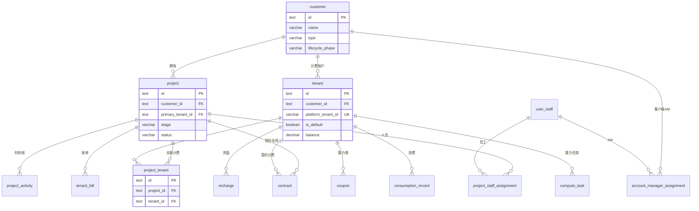
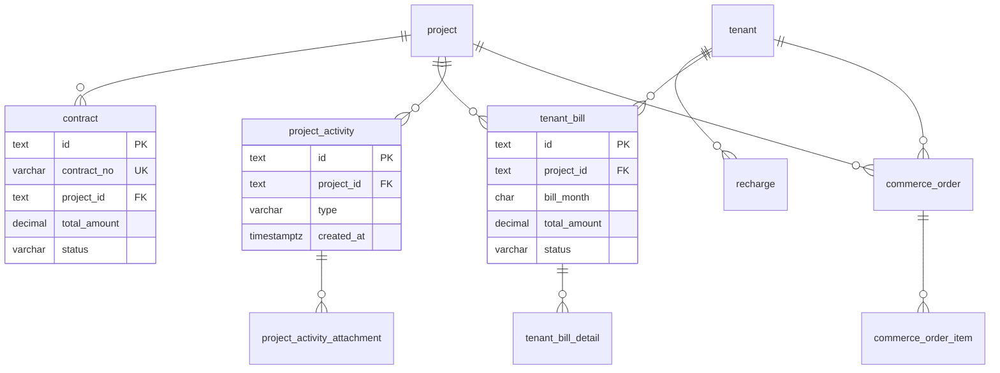
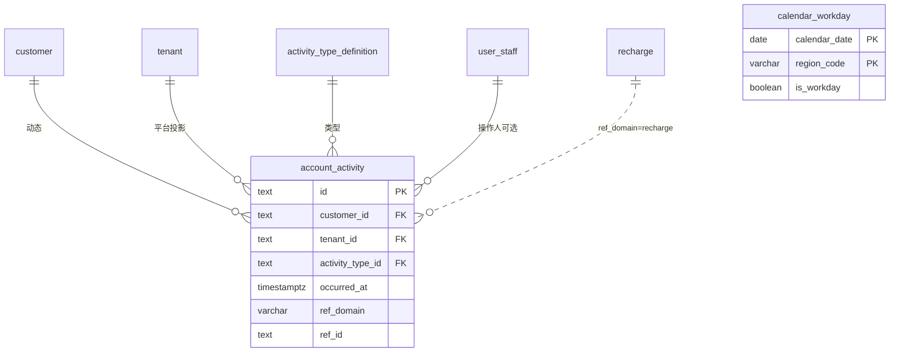

# CRM 模块数据库设计

**依据**：`apps/web/src/app/[locale]/(protected)/crm` 路由及子组件、`apps/web/src/components/dashboard/*` 业务面板、`lib/data/types.ts`（客户/项目主流程）、`lib/types/crm.ts`（员工/日历/经营扩展）、`lib/stores/crm-mock-store.ts`。

**文档性质**：CRM 域逻辑表结构（PostgreSQL 风格类型）；物理实现可拆 schema，外键语义与唯一约束应保持一致。

**版本**：v3.0（2026-05-18）

**模型**：**Customer（客户主体）→ Project（经营项目）→ Tenant（平台计费租户）** 三层分离；经营与计费职责边界见 §1.1。

---

## 0. 现状说明（前端双 Mock + 命名错位）

当前 CRM 页面使用 **两套未合并的 Mock 数据源**。前端已按 v3.0 完成 **Customer / Project / PlatformTenant** 拆分：客户路由为 `/crm/customers`，类型见 `lib/data/types.Customer` 与 `mockCustomers`；计费 Mock 仍用 `tenantId` 指向 `mockPlatformTenants`。落库与 API 以 **§1.1 规则** 为准。

| 数据源 | 路径 | 使用页面 | v3.0 归属 |
|--------|------|----------|-----------|
| **经营主流程 Mock** | `lib/data/mock-data.ts` + `lib/data/types.ts` | 工作台、**客户列表（实为 tenant）**、项目、合同 | `types.Tenant` → 应对齐 **`customer`**；计费字段拆至 **`tenant`** |
| **CRM Store Mock** | `lib/data/crm-mock.ts` + `lib/types/crm.ts` + `crm-mock-store` | 员工、日历 | `crm.Tenant` → **`customer`**；`tenant_binding` → **`project_tenant`** |

合并实现时：统一 API；`user_staff`、`account_activity`、`calendar_workday` 等复用 Store 形状并改 FK 为 `customer_id` / `project_id`。

---

## 1. 设计决策

| 决策 | 说明 |
|------|------|
| **三层实体** | **Customer**：CRM 客户主体，一对多 **Project**；**Tenant**：平台计费租户，归属一个 Customer，承载充值/消费/券/账单/算力任务等。 |
| **默认 1:1** | 创建 Customer 时 **同事务** 创建默认 Tenant（`is_default = true`）；多数客户仅一个 Tenant。 |
| **项目必属客户** | `project.customer_id` NOT NULL；项目四人组、阶段、时间线均在 Project 层。 |
| **项目与计费 Tenant** | Project 可指定 `primary_tenant_id`（可空则继承 Customer 默认 Tenant）；多 Tenant 归因用 **`project_tenant`**（替代旧 `tenant_binding` 的项目级语义）。 |
| **项目四人组** | 创建项目时四类角色各一条 `project_staff_assignment`；不在 `project` 表存姓名字符串。 |
| **员工主数据** | `user_staff` 为选人唯一来源。 |
| **两类「活动」** | `project_activity`：项目时间线；`account_activity`：客户动态（日历，按 `customer_id` 聚合）。 |
| **两类「任务」** | `compute_task`：平台算力运行任务（**Tenant/计费域**，可按 `tenant_id` 过滤后在 Project 视图展示）；`follow_up_task`：CRM 协作跟进（**Customer/Project**）。 |
| **合同** | `contract` 为完整商务合同；可同时存 `customer_id`、`project_id`、`tenant_id`（签约计费主体）。 |
| **分析页只读** | `/crm/analytics` 读计费域月结，非 CRM 写表。 |
| **路由目标** | CRM「客户」列表/详情应对 **Customer**；**`/crm/tenants` 为历史路径**（§9 迁移为 `/crm/customers` 或保留别名）。 |

### 1.1 领域模型与强制规则（避免后期歧义）

以下规则为 **必须遵守** 的不变量；实现、API、Mock 合并与报表均不得违反。

#### 规则 1：Customer 与 Tenant 的默认与多对多

| 规则 | 说明 |
|------|------|
| **R1.1 默认 1:1** | `INSERT customer` 后 **同一事务** `INSERT tenant`（`customer_id`、`is_default = true`）。 |
| **R1.2 一 Customer 多 Tenant** | 允许（集团多开票主体、多平台子商户）；`tenant.customer_id` → `customer.id`；**至多一条** `is_default = true` per customer。 |
| **R1.3 禁止跨 Customer 绑 Tenant** | `project_tenant.tenant_id` 所属 Customer **必须等于** `project.customer_id`（应用层 + DB CHECK 或触发器）。 |
| **R1.4 唯一平台 ID** | `tenant.platform_tenant_id` 全局 UK（与平台对齐）；不得用「锚点 tenant + 平台 ID 字符串」的非 FK 绑定。 |

#### 规则 2：Project 与 Customer、Tenant

| 规则 | 说明 |
|------|------|
| **R2.1 必属客户** | `project.customer_id` NOT NULL；删除 Customer 时级联或阻止删除（若仍有 Project）。 |
| **R2.2 主计费 Tenant** | `project.primary_tenant_id` NULLABLE；为空时读路径使用 `customer` 的 `is_default` Tenant。 |
| **R2.3 多 Tenant 归因** | 通过 **`project_tenant`**（`project_id`, `tenant_id`, `role`）声明；**禁止**仅依赖已废弃的 hub-`tenant_id` + `bound_tenant_id` 字符串模型。 |
| **R2.4 项目级余额** | `project.balance` 为 **读模型/缓存**（可选）；财务真值以 Tenant 余额及账单为准。 |

#### 规则 3：计费事实只落 Tenant

| 规则 | 说明 |
|------|------|
| **R3.1 写表** | `recharge`、`consumption_record`、`coupon`、`tenant_bill`、`commerce_order`（及明细）、平台侧 **`compute_task`** 等 **必须** 带 `tenant_id`。 |
| **R3.2 可选 project_id** | 上表 `project_id` 可空；用于单笔归属项目；未填时仅在 Customer/Tenant 维度汇总。 |
| **R3.3 Project 视图聚合** | 项目详情 Tab 查询：`tenant_id IN (SELECT tenant_id FROM project_tenant WHERE project_id = ?) UNION primary_tenant`；无 `project_tenant` 行时仅用 `primary_tenant_id` 或 Customer 默认 Tenant。 |
| **R3.4 Customer 视图聚合** | 客户详情充值/消费/券 Tab：`tenant_id IN (SELECT id FROM tenant WHERE customer_id = ?)`。 |
| **R3.5 余额** | `tenant.balance` 为计费真值；**不在** `customer` 表存余额（Customer 卡片展示 SUM 下属 Tenant）。 |

#### 规则 4：两类「任务」不可混用

| 类型 | 表 | 归属 | 展示 |
|------|-----|------|------|
| **算力运行任务** | `compute_task` | **Tenant**（`tenant_id`）；可选 `project_id` | 项目详情·任务 Tab：按 R3.3 过滤 |
| **协作跟进** | `follow_up_task` | **Customer + Project**（`customer_id`, `project_id`） | 客户/项目 Hub；**不得**写入 Tenant |

#### 规则 5：人员与动态归属

| 规则 | 说明 |
|------|------|
| **R5.1 项目四人组** | `project_staff_assignment.project_id` → `project`；创建项目事务内写入 4 条当前主责。 |
| **R5.2 客户级 AM** | `account_manager_assignment.customer_id`（**非** tenant）；统计「负责客户数」用此表。 |
| **R5.3 提成口径** | 确认收入来自 `tenant_bill`（paid）；提成归属 **项目 AM**（`project_staff_assignment.role_type = account_manager`），与客户级 AM 分工见 §9.0.2。 |
| **R5.4 客户动态** | `account_activity.customer_id` NOT NULL；`tenant_id` 仅当事件来自平台计费投影时填写。 |
| **R5.5 生命周期** | `lifecycle_milestone`、`conversion_record`、`engagement_*` 等经营扩展 **挂 Customer**（`customer_id`）。 |

#### 规则 6：命名与 API 读模型

| 规则 | 说明 |
|------|------|
| **R6.1 表名** | 逻辑表：`customer`、`project`、`tenant`、`project_tenant`；ORM 可用 `CommercialProject` 等别名，文档以 `project` 为准。 |
| **R6.2 禁止混用** | 对外 API 与前端类型：**Customer** ≠ **Tenant**；禁止再把 `types.Tenant` 当作 CRM 客户主体导出。 |
| **R6.3 兼容字段** | 过渡期 API 可返回 `customerId` + 只读 `tenantId`（默认 Tenant），但 **新写入** 必须带 `customerId`。 |

---

## 2. 页面与表映射

> **v3.0**：「客户」页面对 **Customer**（`/crm/customers`）；计费 Tab 聚合下属 **PlatformTenant**（`mockPlatformTenants`）。

### 2.1 一级路由

| 路由（目标） | 路由（当前） | 页面入口 | 主要组件 | 涉及表 |
|--------------|--------------|----------|----------|--------|
| `/crm` | 同左 | `crm/page.tsx` | `DashboardContent` | `customer`、`project`、`contract`、`tenant_bill`、`project_activity` |
| `/crm/analytics` | 同左 | `crm/analytics/page.tsx` | `AnalyticsContent` | 计费域月结（只读） |
| **`/crm/customers`** | `/crm/tenants` | `crm/tenants/page.tsx` | `TenantsContent` → **`CustomersContent`** | **`customer`**（当前误用 `tenant`） |
| **`/crm/customers/[id]`** | `/crm/tenants/[id]` | `crm/tenants/[id]/page.tsx` | `TenantDetailContent` → **`CustomerDetailContent`** | **`customer`**、`tenant`、`project`；计费 Tab 聚合 `tenant` |
| `/crm/projects` | 同左 | `crm/projects/page.tsx` | `ProjectsContent` | `project`、`customer`、`project_tenant`、`tenant`、`project_staff_assignment` |
| `/crm/projects/[id]` | 同左 | `crm/projects/[id]/page.tsx` | `ProjectDetailContent` + 子面板 | 同上 + §2.4 |
| `/crm/staff` | `crm/staff/page.tsx` | `CrmStaffListClient` | `user_staff`、`account_manager_assignment`（统计） |
| `/crm/staff/new` | `crm/staff/new/page.tsx` | `CrmStaffFormClient` | `user_staff` |
| `/crm/staff/[staffId]` | `crm/staff/[staffId]/page.tsx` | `CrmStaffDetailClient` | `user_staff` |
| `/crm/contracts` | `crm/contracts/page.tsx` | `ContractsContent` | `contract` |
| `/crm/calendar` | `crm/calendar/page.tsx` | `CalendarContent` | `account_activity`、`activity_type_definition`；可选 `calendar_workday` |

### 2.2 客户详情 Tab（目标：`CustomerDetailContent`）

| Tab | 组件逻辑 | 表名 | 说明 |
|-----|----------|------|------|
| 概览 | 图表占位 | `customer`、`tenant` | 经营字段来自 customer；余额/消费趋势 SUM 下属 **tenant**（§1.1 R3.4） |
| 计费账户 | 可选子 Tab | `tenant` | 一客户多 Tenant 时列表展示；默认 Tenant 标「主账户」 |
| 项目 | 项目列表 | `project` | `getProjectsByCustomerId`（当前为 `getProjectsByTenantId`） |
| 充值记录 | 充值表 | `recharge` | `tenant_id IN customer 下所有 tenant` |
| 消费记录 | 消费明细 | `consumption_record` | 同上 |
| 算力券 | 券列表 | `coupon` | 同上 |
| 合同 | 合同列表 | `contract` | `customer_id` 或下属 tenant / project |

### 2.3 新建/编辑项目（`ProjectsContent` 对话框）

创建项目时与 `project` **同事务** 写入四条 `project_staff_assignment`；并处理 **Customer / Tenant 关联**：

| 表单项 | 落库 |
|--------|------|
| 所属客户 | `project.customer_id`（必选） |
| 主计费账户 | `project.primary_tenant_id`（可选，默认 Customer 的 `is_default` Tenant） |
| 附加计费账户 | `project_tenant` 多选（可选；须满足 R1.3） |

表单字段与 `role_type` 映射：

| 表单标签 | `role_type` | 选人控件 |
|----------|-------------|----------|
| 售前经理 | `pre_sales` | `user_staff` 下拉（仅 `status = active`） |
| 客户经理 | `account_manager` | 同上 |
| 交付经理 | `delivery_manager` | 同上 |
| 项目经理 | `project_manager` | 同上 |

校验：四个 `user_staff_id` 均非空；同一项目下四种角色各仅能有一条当前有效主责记录。人员变更时 **截断旧行**（写 `effective_to`）并 **插入新行**，不原地改 `user_staff_id`。

项目列表/详情展示：对 `project_staff_assignment` JOIN `user_staff.display_name`（Mock 过渡期 `preSalesManager` / `accountManager` 等字段由 API 聚合填充，不落库）。

### 2.4 项目详情 Tab（`ProjectDetailContent` + 子面板）

| Tab | 子组件 | 表名 |
|-----|--------|------|
| 概览 | 内联 + 运行中任务表 | `project_activity`、`compute_task` |
| 活动时间线 | `ProjectTimelinePanel` | `project_activity` |
| 消费明细 | `ProjectConsumptionPanel` | `consumption_record` |
| 任务列表 | `ProjectTasksPanel` | `compute_task` |
| 订单列表 | `ProjectOrdersPanel` | `commerce_order`、`commerce_order_item` |
| 算力券 | `ProjectCouponsPanel` | `coupon` |
| 充值记录 | `ProjectRechargesPanel` | `recharge` |
| 月度账单 | `ProjectBillsPanel` | `tenant_bill`、`tenant_bill_detail` |

### 2.5 CRM Store 扩展（待 UI 接入，表结构保留）

`crm-mock-store` 已建模、**尚无独立路由页**，供客户经营 Hub / 后续迭代：

| 概念 | 表名 | 前端类型 |
|------|------|----------|
| 项目–计费账户关联 | `project_tenant` | `ProjectTenant`（替代旧 `tenant_binding` 项目级语义） |
| 客户经理分配 | `account_manager_assignment` | `AccountManagerAssignment` |
| 测试券发放 | `test_voucher_issue` | `TestVoucherIssue` |
| 生命周期里程碑 | `lifecycle_milestone` | `LifecycleMilestone` |
| 里程碑佐证 | `milestone_evidence` | `MilestoneEvidence` |
| 合同摘要 | `contract_snapshot` | `ContractSnapshot` |
| 充值订单（CRM 视图） | `recharge_order` | `RechargeOrder` |
| 用量日汇总 | `consumption_usage_daily` | `ConsumptionUsageDaily` |
| 转正记录 | `conversion_record` | `ConversionRecord` |
| 过程文档 | `engagement_document` | `EngagementDocument` |
| 协作跟进 | `follow_up_task` | `FollowUpTask` |
| 动态评论 | `engagement_comment` | `EngagementComment` |
| 工作日历 | `calendar_workday` | `CalendarWorkday` |

---

## 3. 表结构

### 3.1 通用约定

- 主键：`id text` PK（ULID / nanoid / UUID text）。
- 时间：`timestamptz`；纯日历业务日用 `date`。
- 金额：`decimal(15,4)`；页面 Mock 为 `number`，落库统一 decimal。
- 扩展字段：`jsonb`。
- 外键列均为 `text`。
- 聚合字段（如 `project_count`、`total_recharge`）**不入库**，由查询或物化视图维护。

### 3.2 主数据（Customer / Project / Tenant）

#### `customer`（客户主体 — CRM 经营）

对应目标类型 `lib/data/types.Customer`（**待从现有 `Tenant` 拆分**）；合并 `lib/types/crm.Tenant` 中生命周期/规模字段。

| 列名 | 类型 | 约束 | 前端字段 / 页面 |
|------|------|------|-----------------|
| `id` | text | PK | `Customer.id` |
| `name` | varchar | NOT NULL | `name`；客户列表/详情标题 |
| `customer_code` | varchar | UK 可选 | 原 `tenant_code` |
| `account_name` | varchar | | 经营简称 |
| `cert_code` | varchar | | 社会统一信用编码 |
| `type` | varchar | NOT NULL | `B` / `C` |
| `status` | varchar | NOT NULL | `active` / `inactive` / `suspended` |
| `contact_person` | varchar | | `contactPerson` |
| `contact_phone` | varchar | | `contactPhone` |
| `contact_email` | varchar | | `contactEmail` |
| `industry` | varchar | | `industry` |
| `address` | text | | `address` |
| `lifecycle_phase` | varchar | | `lifecycle_phase` |
| `expected_scale` | jsonb | | |
| `observed_scale_summary` | jsonb | | |
| `test_started_on` | date | | |
| `test_completed_on` | date | | |
| `conversion_date` | date | | |
| `conversion_trigger` | varchar | | |
| `created_at` | timestamptz | NOT NULL | `createdAt` |
| `updated_at` | timestamptz | | |

**禁止**：`balance`、`platform_tenant_id` — 见 `tenant` 表（§1.1 R3.5）。

**派生指标**（客户列表）：`project_count` ← COUNT `project`；`total_recharge` / `total_consumption` ← SUM 下属 `tenant` 的计费表。

#### `tenant`（平台计费租户）

对应平台侧租户；**归属一个 Customer**；承载 §1.1 R3 全部计费写表。

| 列名 | 类型 | 约束 | 前端字段 / 页面 |
|------|------|------|-----------------|
| `id` | text | PK | `Tenant.id` |
| `customer_id` | text | FK→customer, NOT NULL | `customerId` |
| `name` | varchar | NOT NULL | 计费账户显示名（可与 customer.name 相同） |
| `platform_tenant_id` | varchar | UK | 平台计费客户 ID |
| `is_default` | boolean | NOT NULL DEFAULT false | 该 Customer 下默认计费账户 |
| `status` | varchar | NOT NULL | `active` / `inactive` / `suspended` |
| `balance` | decimal(15,4) | NOT NULL DEFAULT 0 | `balance` |
| `created_at` | timestamptz | NOT NULL | |
| `updated_at` | timestamptz | | |

**唯一约束**：`UNIQUE (customer_id) WHERE is_default = true`（每客户至多一个默认 Tenant）。

**创建 Customer 事务**：`INSERT customer` → `INSERT tenant`（`is_default = true`，`platform_tenant_id` 可后补）。

#### `project`（经营项目 — 最小业务跟踪单元）

对应 `lib/data/types.Project`；物理表可由 `commercial_project` 重命名。

| 列名 | 类型 | 约束 | 前端字段 / 页面 |
|------|------|------|-----------------|
| `id` | text | PK | `Project.id` |
| `customer_id` | text | FK→customer, NOT NULL | `customerId` |
| `primary_tenant_id` | text | FK→tenant, 可空 | `primaryTenantId`；空则用 Customer 默认 Tenant |
| `name` | varchar | NOT NULL | `name` |
| `description` | text | | `description` |
| `stage` | varchar | NOT NULL | `lead` / `testing` / `converted` |
| `status` | varchar | NOT NULL | `active` / `paused` / `completed` |
| `start_date` | date | | `startDate` |
| `end_date` | date | 可空 | `endDate` |
| `monthly_budget` | decimal(15,4) | | `monthlyBudget` |
| `balance` | decimal(15,4) | | 可选缓存；非财务真值 |
| `created_at` | timestamptz | NOT NULL | `createdAt` |
| `updated_at` | timestamptz | | |

索引：`(customer_id)`、`(primary_tenant_id)`、`(stage)`、`(status)`。

**迁移说明**：原 `commercial_project.tenant_id` 拆为 `customer_id` + `primary_tenant_id`（原 tenant 行需先挂到 customer）。

**项目人员**：见 `project_staff_assignment`（§3.8）。

#### `project_tenant`（项目关联计费账户）

替代旧 `tenant_binding` 的 **项目级** 多 Tenant 归因；`bound_tenant_id` 平台字符串 **废弃**。

| 列名 | 类型 | 约束 | 说明 |
|------|------|------|------|
| `id` | text | PK | |
| `project_id` | text | FK→project, NOT NULL | |
| `tenant_id` | text | FK→tenant, NOT NULL | 必须满足 §1.1 R1.3 |
| `role` | varchar | 可空 | 如 `primary` / `secondary` / `子商户` |
| `binding_label` | varchar | 可空 | 展示用 |
| `sort_order` | int | DEFAULT 0 | |
| `created_at` | timestamptz | NOT NULL | |

**唯一约束**：`UNIQUE (project_id, tenant_id)`。

**查询项目可用 Tenant 集合**（R3.3）：

```sql
SELECT t.id FROM tenant t
WHERE t.id = (SELECT primary_tenant_id FROM project WHERE id = :pid)
   OR t.id IN (SELECT tenant_id FROM project_tenant WHERE project_id = :pid);
-- 实现可合并为 COALESCE(primary_tenant_id, customer_default_tenant) ∪ project_tenant
```

#### `user_staff`（内部员工）

对应 `lib/types/crm.UserStaff`；`CrmStaffFormClient` 字段。

| 列名 | 类型 | 约束 | 前端字段 |
|------|------|------|----------|
| `id` | text | PK | `id` |
| `employee_no` | varchar | UK 可选 | `employee_no` |
| `display_name` | varchar | NOT NULL | `display_name` |
| `mobile` | varchar | NOT NULL | `mobile` |
| `email` | varchar | UK 可选 | `email` |
| `status` | varchar | NOT NULL | `active` / `inactive` |
| `department` | varchar | 可空 | 表单待补 |
| `created_at` / `updated_at` | timestamptz | | |

---

### 3.3 商务与资金流

#### `contract`（项目合同 — CRM 全量）

对应 `lib/data/types.Contract`；`/crm/contracts` 与客户/项目详情 Tab。

| 列名 | 类型 | 约束 | 前端字段 |
|------|------|------|----------|
| `id` | text | PK | `id` |
| `contract_no` | varchar | UK | `contractNo` |
| `customer_id` | text | FK→customer | `customerId` |
| `tenant_id` | text | FK→tenant | `tenantId`；签约计费主体 |
| `project_id` | text | FK→project | `projectId` |
| `type` | varchar | NOT NULL | `standard` / `enterprise` / `custom` |
| `status` | varchar | NOT NULL | `draft` / `pending` / `active` / `expired` / `terminated` |
| `start_date` | date | NOT NULL | `startDate` |
| `end_date` | date | NOT NULL | `endDate` |
| `total_amount` | decimal(15,4) | NOT NULL | `totalAmount` |
| `paid_amount` | decimal(15,4) | NOT NULL DEFAULT 0 | `paidAmount` |
| `signed_at` | timestamptz | 可空 | `signedAt` |
| `signer_name` | varchar | 可空 | `signerName` |
| `terms` | text | | `terms` |
| `created_at` | timestamptz | NOT NULL | `createdAt` |

#### `recharge`（充值）

对应 `lib/data/types.Recharge`。

| 列名 | 类型 | 约束 | 前端字段 |
|------|------|------|----------|
| `id` | text | PK | |
| `tenant_id` | text | FK→tenant, NOT NULL | `tenantId` |
| `project_id` | text | FK 可空 | `projectId` |
| `amount` | decimal(15,4) | NOT NULL | `amount` |
| `payment_method` | varchar | NOT NULL | `bank_transfer` / `alipay` / `wechat` / `invoice` |
| `status` | varchar | NOT NULL | `pending` / `completed` / `failed` |
| `transaction_id` | varchar | UK 可选 | `transactionId` |
| `created_at` | timestamptz | NOT NULL | `createdAt` |
| `completed_at` | timestamptz | 可空 | `completedAt` |

#### `coupon`（算力券）

对应 `lib/data/types.Coupon`。

| 列名 | 类型 | 约束 | 前端字段 |
|------|------|------|----------|
| `id` | text | PK | |
| `tenant_id` | text | FK→tenant | `tenantId` |
| `project_id` | text | FK 可空 | `projectId` |
| `code` | varchar | UK | `code` |
| `name` | varchar | NOT NULL | `name` |
| `type` | varchar | NOT NULL | `discount` / `cash` |
| `value` | decimal(15,4) | NOT NULL | `value` |
| `min_amount` | decimal(15,4) | | `minAmount` |
| `status` | varchar | NOT NULL | `active` / `used` / `expired` |
| `issued_at` | timestamptz | NOT NULL | `issuedAt` |
| `expired_at` | timestamptz | NOT NULL | `expiredAt` |
| `used_at` | timestamptz | 可空 | `usedAt` |

---

### 3.4 用量、任务与订单

#### `consumption_record`（消费明细）

对应 `lib/data/types.Consumption`（单笔资源消费，非日汇总）。

| 列名 | 类型 | 约束 | 前端字段 |
|------|------|------|----------|
| `id` | text | PK | |
| `customer_id` | text | FK→customer | `customerId` |
| `tenant_id` | text | FK→tenant | `tenantId`；签约计费主体 |
| `project_id` | text | FK→project | `projectId` |
| `product_line` | varchar | NOT NULL | `serverless` / `cloud_vm` / `job` / … |
| `resource_name` | varchar | | `resourceName` |
| `amount` | decimal(15,4) | NOT NULL | `amount` |
| `duration` | numeric | | `duration` |
| `unit` | varchar | | `hour` / `day` / `month` / `count` |
| `occurred_at` | timestamptz | NOT NULL | `createdAt` |

索引：`(project_id, occurred_at DESC)`、`(tenant_id, occurred_at DESC)`。

#### `compute_task`（算力运行任务 — 计费域）

对应 `lib/data/types.Task`（**非** `follow_up_task`）。**归属 Tenant**（§1.1 R4）；`project_id` 可选，供项目视图过滤。

| 列名 | 类型 | 约束 | 前端字段 |
|------|------|------|----------|
| `id` | text | PK | |
| `tenant_id` | text | FK→tenant, NOT NULL | `tenantId` |
| `project_id` | text | FK→project, 可空 | `projectId` |
| `title` | varchar | NOT NULL | `title` |
| `description` | text | | `description` |
| `status` | varchar | NOT NULL | `pending` / `running` / `completed` / `failed` |
| `resource_type` | varchar | | `serverless` / `cloud_vm` / `job` / `bare_metal` |
| `gpu_count` | int | 可空 | `gpuCount` |
| `cpu_count` | int | 可空 | `cpuCount` |
| `memory_gb` | int | 可空 | `memoryGB` |
| `start_time` | timestamptz | NOT NULL | `startTime` |
| `end_time` | timestamptz | 可空 | `endTime` |
| `cost` | decimal(15,4) | | `cost` |

#### `commerce_order`（产品订单）

对应 `lib/data/types.Order`。

| 列名 | 类型 | 约束 | 前端字段 |
|------|------|------|----------|
| `id` | text | PK | |
| `order_no` | varchar | UK | `orderNo` |
| `customer_id` | text | FK→customer | `customerId` |
| `tenant_id` | text | FK→tenant | `tenantId`；签约计费主体 |
| `project_id` | text | FK→project | `projectId` |
| `product_line` | varchar | | `productLine` |
| `status` | varchar | NOT NULL | `pending` / `processing` / `completed` / `cancelled` |
| `amount` | decimal(15,4) | NOT NULL | `amount` |
| `created_at` | timestamptz | NOT NULL | `createdAt` |
| `completed_at` | timestamptz | 可空 | `completedAt` |

#### `commerce_order_item`（订单行）

对应 `lib/data/types.OrderItem`（嵌套在 Order 内）。

| 列名 | 类型 | 约束 | 前端字段 |
|------|------|------|----------|
| `id` | text | PK | |
| `order_id` | text | FK→commerce_order | |
| `name` | varchar | NOT NULL | `name` |
| `quantity` | numeric | NOT NULL | `quantity` |
| `unit_price` | decimal(15,4) | NOT NULL | `unitPrice` |
| `total` | decimal(15,4) | NOT NULL | `total` |
| `sort_order` | int | DEFAULT 0 | |

---

### 3.5 账单与时间线

#### `tenant_bill`（月度账单）

对应 `lib/data/types.Bill`。

| 列名 | 类型 | 约束 | 前端字段 |
|------|------|------|----------|
| `id` | text | PK | |
| `customer_id` | text | FK→customer | `customerId` |
| `tenant_id` | text | FK→tenant | `tenantId`；签约计费主体 |
| `project_id` | text | FK→project | `projectId` |
| `bill_month` | char(7) | NOT NULL | `month`（`YYYY-MM`） |
| `total_amount` | decimal(15,4) | NOT NULL | `totalAmount` |
| `status` | varchar | NOT NULL | `pending` / `paid` / `overdue` |
| `due_date` | date | NOT NULL | `dueDate` |
| `paid_at` | timestamptz | 可空 | `paidAt` |
| | | UK 建议 | `(project_id, bill_month)` |

#### `tenant_bill_detail`（账单明细行）

对应 `lib/data/types.BillDetail`。

| 列名 | 类型 | 约束 | 前端字段 |
|------|------|------|----------|
| `id` | text | PK | |
| `bill_id` | text | FK→tenant_bill | |
| `product_line` | varchar | | |
| `resource_name` | varchar | | |
| `usage` | numeric | | |
| `unit` | varchar | | |
| `unit_price` | decimal(15,4) | | |
| `amount` | decimal(15,4) | NOT NULL | |

#### `project_activity`（项目活动时间线）

对应 `lib/data/types.Activity`；`ProjectTimelinePanel`、工作台最近动态。

| 列名 | 类型 | 约束 | 前端字段 |
|------|------|------|----------|
| `id` | text | PK | |
| `project_id` | text | FK→project | `projectId` |
| `type` | varchar | NOT NULL | `comment` / `file` / `task` / `meeting` / `stage_change` / `recharge` / `consumption` |
| `title` | varchar | NOT NULL | `title` |
| `description` | text | | `description` |
| `author_name` | varchar | | `author`（过渡） |
| `author_staff_id` | text | FK 可空 | 目标接 `user_staff` |
| `author_role` | varchar | | `pre_sales` / `account_manager` / `delivery_manager` / `project_manager` / `system` |
| `metadata` | jsonb | | `metadata` |
| `created_at` | timestamptz | NOT NULL | `createdAt` |

#### `project_activity_attachment`（时间线附件）

对应 `lib/data/types.Attachment`。

| 列名 | 类型 | 约束 | 前端字段 |
|------|------|------|----------|
| `id` | text | PK | |
| `activity_id` | text | FK→project_activity | |
| `file_name` | varchar | NOT NULL | `name` |
| `file_size` | bigint | | `size` |
| `mime_type` | varchar | | `type` |
| `storage_uri` | varchar | NOT NULL | `url` |

---

### 3.6 客户动态与日历（CRM Store）

#### `activity_type_definition`（动态类型字典）

| 列名 | 类型 | 约束 | 前端字段 |
|------|------|------|----------|
| `id` | text | PK | |
| `type_code` | varchar | UK | `type_code` |
| `display_name` | varchar | NOT NULL | `display_name` |
| `category` | varchar | | PLATFORM / INTERNAL |
| `is_platform_projection` | boolean | DEFAULT true | |
| `sort_order` | int | | |

#### `account_activity`（客户动态 — 日历/时间线）

`CalendarContent` 按 `occurred_at` 聚合；**与 `project_activity` 分立**。

| 列名 | 类型 | 约束 | 前端字段 |
|------|------|------|----------|
| `id` | text | PK | |
| `customer_id` | text | FK→customer, NOT NULL | CRM 客户主体 |
| `tenant_id` | text | FK→tenant, 可空 | 平台计费投影事件时填写 |
| `activity_type_id` | text | FK | `activity_type_id` |
| `occurred_at` | timestamptz | NOT NULL | `occurred_at` |
| `ref_domain` | varchar | 可空 | `ref_domain` |
| `ref_id` | text | 可空 | `ref_id` |
| `idempotency_key` | varchar | UK 可选 | |
| `actor_user_id` | text | FK→user_staff 可空 | `actor_user_id` |
| `title_snapshot` | varchar | | |
| `summary_snapshot` | text | | |
| `payload` | jsonb | | |
| `visibility` | varchar | | |

索引：`(customer_id, occurred_at DESC)`、`(tenant_id, occurred_at DESC)`。

#### `calendar_workday`（工作日历）

| 列名 | 类型 | 约束 | 前端字段 |
|------|------|------|----------|
| `calendar_date` | date | PK（复合） | `calendar_date` |
| `region_code` | varchar | PK（复合） | `region_code` |
| `is_workday` | boolean | NOT NULL | `is_workday` |

应用层合成 id：`{region_code}__{calendar_date}`（`calendarWorkdayRecordId`）。

---

### 3.7 经营扩展子表（CRM Store，待 UI）

外键 **统一 `customer_id`**（经营）或 **`project_id`**（项目级待办）；**计费类**仍 `tenant_id`。

| 表 | 主外键 | 说明 |
|----|--------|------|
| `project_tenant` | `project_id`, `tenant_id` | 见 §3.2；**替代**旧 `tenant_binding` |
| `account_manager_assignment` | **`customer_id`** | 客户级 AM |
| `lifecycle_milestone`、`milestone_evidence` | **`customer_id`** | |
| `test_voucher_issue`、`conversion_record` | **`customer_id`** 或 `tenant_id` | 发券/转正若走平台用 `tenant_id` |
| `contract_snapshot`、`recharge_order`、`consumption_usage_daily` | **`customer_id`** + 可选 `tenant_id` | |
| `engagement_document`、`follow_up_task`、`engagement_comment` | **`customer_id`** + `project_id` | `follow_up_task` 禁止仅挂 tenant |
| `calendar_workday` | — | 无客户 FK |

**旧 `tenant_binding` 迁移**：`tenant_id`（hub）→ 确定 `customer_id`；`bound_tenant_id`（平台 ID）→ 匹配或创建 `tenant` 行后写入 `project_tenant` 或 `tenant.customer_id`。
- `test_voucher_issue`、`lifecycle_milestone`、`milestone_evidence`
- `contract_snapshot` — 轻量合同摘要（与 `contract` 并存时：`contract` 为主，`contract_snapshot` 可存外链）
- `recharge_order`、`consumption_usage_daily`、`conversion_record`
- `engagement_document`、`follow_up_task`、`engagement_comment`

`lifecycle_milestone.notes` 对应前端 `notes`（非 `remark`）。

---

### 3.8 项目人员分配

项目侧四类经营角色均引用 `user_staff`；与客户级 `account_manager_assignment`（组合/客户维度、可多人多角色）分离。

#### `project_role_type`（角色枚举 — 应用常量）

| `role_type` | 中文 | 创建项目必填 |
|-------------|------|----------------|
| `pre_sales` | 售前经理 | 是 |
| `account_manager` | 客户经理 | 是 |
| `delivery_manager` | 交付经理 | 是 |
| `project_manager` | 项目经理 | 是 |

首版可用 CHECK 约束或应用层校验；若需运营可配置，可升级为字典表 `project_role_definition`（`role_code` UK + `display_name`）。

#### `project_staff_assignment`

| 列名 | 类型 | 约束 | 说明 |
|------|------|------|------|
| `id` | text | PK | |
| `project_id` | text | FK→project, NOT NULL | |
| `user_staff_id` | text | FK→user_staff, NOT NULL | 创建/编辑项目时从员工列表选择 |
| `role_type` | varchar | NOT NULL | 见上表四种之一 |
| `effective_from` | timestamptz | NOT NULL | 创建项目时通常 = `project.created_at` |
| `effective_to` | timestamptz | 可空 | `NULL` = 当前主责；换人时写入历史截断时间 |
| `created_at` | timestamptz | NOT NULL | |
| `created_by` | text | FK→user_staff 可空 | 操作人（审计） |

**唯一约束（当前主责）**：`UNIQUE (project_id, role_type)` WHERE `effective_to IS NULL` — 每项目每种角色仅一名在职主责。

**创建项目事务**（伪代码）：

1. `INSERT project`（含 `customer_id`、`primary_tenant_id`）
2. 若有多计费账户：`INSERT project_tenant`（可选）
3. 对四种 `role_type` 各 `INSERT project_staff_assignment`（`effective_to = NULL`）
4. 任一步失败则整体回滚

**查询当前四人组**（列表/详情/筛选）：

```sql
SELECT psa.role_type, us.id, us.display_name
FROM project_staff_assignment psa
JOIN user_staff us ON us.id = psa.user_staff_id
WHERE psa.project_id = :project_id AND psa.effective_to IS NULL
  AND psa.role_type IN ('pre_sales','account_manager','delivery_manager','project_manager');
```

**与 Mock 类型映射**：`lib/data/types.Project` 中的 `preSalesManager`、`accountManager` 为 **API 读模型** 字段（JOIN 聚合），实现后应从类型中改为 `*_staff_id` 或嵌套 `staff: { role, user_staff_id, display_name }[]`，不再作为持久化列。

索引：`(project_id)` WHERE `effective_to IS NULL`；`(user_staff_id)` WHERE `effective_to IS NULL`（统计员工负责项目数）。

---

## 4. ER 图

### 4.1 Customer、Project、Tenant 与员工



### 4.2 商务、账单与项目时间线



### 4.3 客户动态与日历



---

## 5. 跨域与实现提示

| 场景 | 关联方式 |
|------|----------|
| 工作台指标 | 活跃 **customer** 数；`tenant` 余额 SUM；活跃 `project.status = active`；待付 `tenant_bill` |
| 充值写入动态 | `account_activity.customer_id` + `ref_domain = 'recharge'`；可选 `tenant_id` |
| 阶段转换 | 更新 `project.stage` + `project_activity`（`stage_change`） |
| **创建客户** | 单事务：`customer` + 默认 `tenant`（`is_default = true`） |
| **创建项目** | 单事务：`project` + 可选 `project_tenant` + 4×`project_staff_assignment` |
| **更换项目角色** | 截断 `effective_to` + INSERT；禁止无历史 UPDATE `user_staff_id` |
| 删除客户 | 软删除 `customer`；禁止删除仍有 `project` 的客户（或级联） |
| 员工「负责客户数」 | `account_manager_assignment.customer_id` |
| 员工「负责项目数」 | `project_staff_assignment` DISTINCT `project_id` |
| 分析页 | 计费域月结；按 `platform_tenant_id` ↔ `tenant` JOIN |
| Mock 合并 | `mockTenants` 拆为 `mockCustomers` + `mockTenants`；ID 映射表见 §9 |

---

## 6. 表清单速查

| 表名 | 中文 | 页面入口 |
|------|------|----------|
| `customer` | 客户主体 | `/crm/customers`（目标）、当前 `/crm/tenants` |
| `tenant` | 平台计费租户 | 客户详情·计费账户 Tab |
| `project` | 经营项目 | `/crm/projects`、客户详情·项目 Tab |
| `project_tenant` | 项目–计费账户 | 新建/编辑项目 |
| `user_staff` | 内部员工 | `/crm/staff` |
| `project_staff_assignment` | 项目四人组（售前/客户/交付/项目经理） | 新建项目对话框、项目列表/详情 |
| `contract` | 项目合同 | `/crm/contracts`、客户/项目详情 |
| `recharge` | 充值 | 客户/项目详情 |
| `consumption_record` | 消费明细 | 客户/项目详情 |
| `coupon` | 算力券 | 客户/项目详情 |
| `compute_task` | 算力任务 | 项目详情·任务 |
| `commerce_order` | 产品订单 | 项目详情·订单 |
| `commerce_order_item` | 订单行 | 同上 |
| `tenant_bill` | 月度账单 | 项目详情·账单、工作台 |
| `tenant_bill_detail` | 账单明细 | 同上 |
| `project_activity` | 项目时间线 | 项目详情·时间线、工作台 |
| `project_activity_attachment` | 时间线附件 | 同上 |
| `account_activity` | 客户动态 | `/crm/calendar` |
| `activity_type_definition` | 动态类型 | 系统配置 |
| `calendar_workday` | 工作日历 | 待接日历 CRUD |
| `account_manager_assignment` | 客户级 AM | 员工详情统计（Store） |
| `project_tenant` 等 | 经营扩展 | Store 待接 Hub |

---

## 7. 文档维护

- 页面或 `lib/data/types.ts` / `lib/types/crm.ts` 变更时同步表定义；**禁止**再把 CRM 客户字段加回 `tenant`。
- 统一 Mock 后删除 §0 双源说明；API 对外使用 `customerId` / `tenantId` / `projectId`。
- CRM 写模型以 **Customer + Project + Tenant（§3.2–3.5）** 为准。
- §8 样例部分表名仍为迁移前写法（`tenant` 兼客户主体），实现时按 §3.2 拆分为 `customer` + `tenant`。

---

## 8. 前端与代码迁移指引（不改库表前的重构清单）

> 本节描述 **仅文档与类型层** 的迁移顺序；具体 PR 可按阶段拆分。当前仓库 **尚未** 改代码。

### 8.0 问题陈述

| 现象 | 根因 |
|------|------|
| 侧边栏「客户」进入 `/crm/tenants` | 路由命名沿用平台 tenant |
| `TenantsContent` 读 `mockTenants` | `types.Tenant` 混合 CRM 客户 + 计费字段 |
| `TenantDetailContent` 充值/消费 Tab | 按 `tenant.id` 查计费表，实际应为 customer 下 **多 tenant 聚合** |
| `Project.tenantId` | 应拆为 `customerId` + `primaryTenantId` |
| `crm.Tenant` / `tenant_binding` | Store 模型与 v3.0 不一致 |

### 8.1 阶段一：类型与 Mock 拆分（无路由变更）

| 步骤 | 文件 | 动作 |
|------|------|------|
| 1 | `lib/data/types.ts` | 新增 `Customer`；`Tenant` 仅保留 `customerId`、`platformTenantId`、`balance`、`isDefault` 等计费字段 |
| 2 | `lib/data/mock-data.ts` | `mockTenants` → `mockCustomers` + `mockPlatformTenants`；由原数据 **脚本拆分**（一一默认 tenant） |
| 3 | `lib/data/mock-data.ts` | `Project`：`tenantId` → `customerId`，`tenantName` → `customerName`；增加 `primaryTenantId` |
| 4 | `lib/data/mock-data.ts` | 计费数组（`recharges`、`consumptions`…）保持 `tenantId`，确保指向新 `tenant.id` |
| 5 | `lib/types/crm.ts` | `Tenant` 重命名为 `Customer`（或并存 deprecate）；`TenantBinding` → `ProjectTenant` |
| 6 | `lib/data/crm-mock.ts` | 对齐 `crmMockTenants` → customers + tenants；binding → `project_tenant` |
| 7 | `lib/data/mock-data.ts` | 新增 `getProjectsByCustomerId`、`getCustomerById`、`getTenantsByCustomerId`；旧函数 **@deprecated** 包装 |

### 8.2 阶段二：组件与页面（解决「客户页 = tenant」）

| 步骤 | 文件 | 动作 |
|------|------|------|
| 1 | `components/dashboard/tenants-content.tsx` | 重命名 `customers-content.tsx`；props/状态改用 `Customer` |
| 2 | `components/dashboard/tenant-detail-content.tsx` | 重命名 `customer-detail-content.tsx`；props: `customer` + `tenants[]` |
| 3 | 客户详情 Tab | 充值/消费/券：`getXByTenantIds(tenants.map(t => t.id))` 或 `getXByCustomerId` |
| 4 | 客户详情 | 新增「计费账户」子 Tab（多 tenant 时） |
| 5 | `projects-content.tsx` | 创建项目：选 **Customer** → 选/默认 **Tenant** → 可选 `project_tenant` |
| 6 | `dashboard-content.tsx`、`contracts-content.tsx`、`calendar-content.tsx` | 链接 `/crm/customers/:id`；文案 tenant → customer |
| 7 | `crm/tenants/page.tsx`、`[id]/page.tsx` | 改引 `CustomersContent` / `CustomerDetailContent`；`mockCustomers` |

### 8.3 阶段三：路由与导航

| 步骤 | 文件 | 动作 |
|------|------|------|
| 1 | 新建 `app/.../crm/customers/page.tsx` 等 | 正式路由 |
| 2 | `crm/tenants/*` | **301 或 Next `redirect`** 到 `/crm/customers/*`（保留旧书签） |
| 3 | `app-sidebar.tsx` | 「客户」url → `/crm/customers` |
| 4 | 全局 `grep /crm/tenants` | 合同、员工详情、工作台等链接批量替换 |

### 8.4 阶段四：Store 与日历

| 步骤 | 文件 | 动作 |
|------|------|------|
| 1 | `crm-mock-store.ts` | `tenantBindings` → `projectTenants`；级联删除按 `customer_id` |
| 2 | `calendar-content.tsx` | `activity.tenant_id` → `activity.customer_id`（展示仍可同时显示计费账户名） |
| 3 | `crm-staff-detail-client.tsx` | 负责客户链接 → `/crm/customers/` |

### 8.5 数据迁移 SQL（落库时）

```sql
-- 1) 由 legacy tenant 生成 customer（示意）
INSERT INTO customer (id, name, type, status, contact_person, ...)
SELECT id, name, type, status, contact_person, ... FROM legacy_tenant;

-- 2) 新建 tenant 行挂 customer
INSERT INTO tenant (id, customer_id, platform_tenant_id, balance, is_default, ...)
SELECT gen_id(), id, platform_tenant_id, balance, true, ... FROM legacy_tenant;

-- 3) project 改 FK
ALTER TABLE project ADD customer_id text, ADD primary_tenant_id text;
UPDATE project SET customer_id = tenant_id, primary_tenant_id = tenant_id; -- 经步骤 2 映射
ALTER TABLE project DROP COLUMN tenant_id; -- 验证后

-- 4) account_manager_assignment.tenant_id → customer_id
```

### 8.6 验收清单

- [ ] 客户列表展示 **Customer** 名称，不直接暴露 `platform_tenant_id` 为主标题
- [ ] 客户详情余额 = 下属 **Tenant** `balance` 之和
- [ ] 新建客户自动出现 **1 个默认 Tenant**
- [ ] 项目列表显示 `customerName`；详情计费 Tab 仅含该项目关联 Tenant 的数据
- [ ] `follow_up_task` / `compute_task` 不混用（§1.1 R4）
- [ ] 旧 `/crm/tenants/t1` 可访问或重定向到 `/crm/customers/c1`

---

## 9. 业务场景样例：客户-项目跟踪与客户经理收入提成

本节给出两类典型经营形态：**一客户一项目**、**一客户多项目**。均基于 §3 表结构，覆盖项目四人组、时间线/跟进、账单与消费，并说明如何汇总 **客户经理（AM）收入** 与 **提成**。样例账期为 `2026-03`～`2026-05`。

> **v3.0 读法**：样例表中 **`tenant`（如 `ten-a`）在实现上应拆为 `customer`（经营）+ `tenant`（计费，`platform_tenant_id`）**；下文保留合并 ID 仅为与旧 Mock 对照，逻辑关系以 §1.1 为准。

### 9.0 跟踪与计酬约定（全场景共用）

#### 9.0.1 经营跟踪链路

| 跟踪维度 | 数据表 | 说明 |
|----------|--------|------|
| 客户主体 | **`customer`** | CRM 经营；详情 Tab 聚合项目、里程碑、AM |
| 计费账户 | **`tenant`** | 充值/消费/券/账单；客户详情按 customer 聚合下属 tenant |
| 经营项目 | **`project`** | `stage` / `status` 驱动漏斗；一客户可多项目 |
| 项目四人组 | `project_staff_assignment` | 创建项目时四类角色各一条 `effective_to IS NULL` |
| 客户级 AM | `account_manager_assignment` | 客户列表/员工「负责客户数」；与项目 AM 可同人 |
| 项目时间线 | `project_activity` | 评论、会议、阶段变更等 |
| 协作待办 | `follow_up_task` | 客户 Hub / 经营跟进（§3.7） |
| 生命周期 | `lifecycle_milestone` | 测试完成、转正等里程碑 |
| 客户动态 | `account_activity` | 日历页跨客户聚合；充值等可 `ref_domain=recharge` |
| 资金与用量 | `recharge`、`consumption_record`、`tenant_bill` | 项目详情各 Tab；账单 UK `(project_id, bill_month)` |

#### 9.0.2 客户经理收入与提成口径

**归属规则**

1. **项目级 AM（计酬主口径）**：`project_staff_assignment` 中 `role_type = account_manager` 且 `effective_to IS NULL` 的 `user_staff_id`。
2. **客户级 AM（统计口径）**：`account_manager_assignment` 同条件；客户仅一个项目时通常与项目 AM 一致；多项目时客户级 AM 负责协调，**提成按项目 AM 分别计算后汇总**。
3. **换人**：账期内若 AM 变更，按 `effective_from` / `effective_to` 对 `tenant_bill.paid_at` 落在岗区间分段归因（样例未演示分段，实现须支持）。

**收入基数（确认收入）**

```
项目账期确认收入(project_id, bill_month)
  = SUM(tenant_bill.total_amount)
    WHERE tenant_bill.project_id = project_id
      AND tenant_bill.bill_month = bill_month
      AND tenant_bill.status = 'paid'
```

备选实时口径（未出账前预估）：`SUM(consumption_record.amount)` 按 `project_id` + 月过滤 `occurred_at`（与财务域 `platform_income_monthly` 对账后，以 **已付账单** 为提成结算依据）。

**提成比例（业务策略 — 首版应用常量，可升级为策略表）**

| `project.stage` | 提成比例 |
|----------------------------|----------|
| `lead` | 0% |
| `testing` | 1.5% |
| `converted` | 3.0% |

```
项目账期提成(project_id, bill_month)
  = 项目账期确认收入 × 提成比例(stage)
```

**客户经理汇总（某 AM、某账期）**

```
AM账期确认收入 = Σ 项目账期确认收入  （其担任项目 AM 的项目）
AM账期提成     = Σ 项目账期提成
```

以下 **「派生·AM 收入汇总」** 表为查询结果示意，**非持久化表**；落库可由物化视图或财务域 `platform_cost_monthly.confirmed_revenue_excl_tax` 与 CRM 项目 AM JOIN 生成。

---

### 9.1 场景 A：一客户对应一项目（可跟踪 + 计酬）

#### 9.1.1 场景摘要

| 项 | 值 |
|----|-----|
| 客户 | 杭州星云数据有限公司（`cust-a`） |
| 项目 | 大模型推理平台（`prj-a1`），`stage=converted`，`status=active` |
| 客户级 AM | 张敏（`staff-zhang`） |
| 项目级 AM | 张敏（与上级一致） |
| 跟踪要点 | 里程碑转正、跟进任务、项目时间线、两期已付账单 |
| 2026-03～04 已付确认收入合计 | 66,200.00（`2026-05` 账单待付不计入） |
| 张敏提成合计（converted 3%） | 1,986.00 |

#### 9.1.2 用户故事

| ID | 角色 | 用户故事 | 验收标准 |
|----|------|----------|----------|
| US-A1 | 售前经理 | 作为售前，我想在客户下 **只创建一个经营项目** 并指定四人组，以便全流程在同一项目内跟踪。 | 创建 `project` 同事务写入 4 条 `project_staff_assignment`；客户详情「项目」Tab 仅 1 条。 |
| US-A2 | 客户经理 | 作为 AM，我想在 **项目时间线** 记录拜访与阶段变更，以便团队看到经营进展。 | `project_activity` 可按 `project_id` 倒序展示；`stage_change` 与 `project.stage` 一致。 |
| US-A3 | 客户经理 | 作为 AM，我想为客户登记 **跟进待办** 并在完成后关闭，以免漏跟。 | `follow_up_task` 关联 `customer_id` + `project_id`；状态 `open` → `done`。 |
| US-A4 | 运营 | 作为运营，我想在客户转正时登记 **生命周期里程碑** 并留痕。 | `lifecycle_milestone` 存在 `CONVERSION`；可选 `milestone_evidence`。 |
| US-A5 | 财务 | 作为财务，我想按 **项目 + 账期** 出具账单并在回款后标记已付，以便 AM 提成结算。 | `tenant_bill` UK `(prj-a1, bill_month)`；`status=paid` 后计入确认收入。 |
| US-A6 | 销售管理 | 作为管理者，我想查看 AM 在账期内的 **确认收入与提成**，以便发放绩效。 | 按 §9.0.2 汇总；`staff-zhang` 已付账期（03～04）样例提成 1,986.00。 |
| US-A7 | 客户经理 | 作为 AM，我想在 **日历** 看到客户充值等动态。 | `account_activity.customer_id=cust-a` 且 `ref_domain=recharge`。 |

#### 9.1.3 样例表数据

**`customer`**

| id | name | type | status | contact_person | lifecycle_phase | conversion_date |
|----|------|------|--------|----------------|-----------------|-----------------|
| cust-a | 杭州星云数据有限公司 | B | active | 周宁 | 已转正 | 2026-03-15 |

**`tenant`**（`customer_id = cust-a`，默认账户）

| id | customer_id | platform_tenant_id | is_default | balance |
|----|-------------|-------------------|------------|---------|
| tn-a | cust-a | （平台 ID） | true | 42800.0000 |

**`project`**

| id | customer_id | primary_tenant_id | name | stage | status | start_date | monthly_budget |
|----|-------------|-------------------|------|-------|--------|------------|----------------|
| prj-a1 | cust-a | tn-a | 大模型推理平台 | converted | active | 2026-02-01 | 50000.0000 |

**`user_staff`（片段）**

| id | display_name | status |
|----|--------------|--------|
| staff-zhang | 张敏 | active |
| staff-li | 李航 | active |
| staff-chen | 陈交付 | active |
| staff-wang | 王项 | active |

**`account_manager_assignment`**

| id | customer_id | user_staff_id | role_type | effective_from | effective_to |
|----|-------------|---------------|-----------|------------------|--------------|
| am-a-001 | cust-a | staff-zhang | account_manager | 2026-01-10T08:00:00Z | NULL |

**`project_staff_assignment`（`prj-a1` 当前四人组）**

| id | project_id | user_staff_id | role_type | effective_from | effective_to |
|----|------------|---------------|-----------|------------------|--------------|
| psa-a-01 | prj-a1 | staff-li | pre_sales | 2026-02-01T09:00:00Z | NULL |
| psa-a-02 | prj-a1 | staff-zhang | account_manager | 2026-02-01T09:00:00Z | NULL |
| psa-a-03 | prj-a1 | staff-chen | delivery_manager | 2026-02-01T09:00:00Z | NULL |
| psa-a-04 | prj-a1 | staff-wang | project_manager | 2026-02-01T09:00:00Z | NULL |

**`lifecycle_milestone`**

| id | customer_id | milestone_type | milestone_date | filled_by |
|----|-------------|----------------|----------------|-----------|
| lm-a-01 | cust-a | TEST_COMPLETE | 2026-02-28 | staff-zhang |
| lm-a-02 | cust-a | CONVERSION | 2026-03-15 | staff-zhang |

**`follow_up_task`**

| id | customer_id | project_id | title | status | due_at | assignee_staff_id |
|----|-------------|------------|-------|--------|--------|-------------------|
| fut-a-01 | cust-a | prj-a1 | 确认 4 月扩容 GPU 规格 | done | 2026-04-10 | staff-zhang |
| fut-a-02 | cust-a | prj-a1 | 跟进合同续签条款 | open | 2026-06-30 | staff-zhang |

**`project_activity`（节选）**

| id | project_id | type | title | author_staff_id | author_role | created_at |
|----|------------|------|-------|-----------------|-------------|------------|
| pa-a-01 | prj-a1 | stage_change | 阶段：测试 → 转正 | staff-zhang | account_manager | 2026-03-15T14:00:00Z |
| pa-a-02 | prj-a1 | meeting | 季度业务复盘 | staff-zhang | account_manager | 2026-04-20T10:00:00Z |
| pa-a-03 | prj-a1 | comment | 客户确认 H100 8 卡续费 | staff-zhang | account_manager | 2026-05-08T16:30:00Z |

**`contract`**

| id | contract_no | customer_id | tenant_id | project_id | status | total_amount | paid_amount | start_date | end_date |
|----|-------------|-------------|-----------|------------|--------|--------------|-------------|------------|----------|
| ctr-a-01 | HT-2026-NX-001 | cust-a | tn-a | prj-a1 | active | 600000.0000 | 200000.0000 | 2026-03-01 | 2027-02-28 |

**`recharge`**

| id | tenant_id | project_id | amount | status | completed_at |
|----|-----------|------------|--------|--------|--------------|
| rch-a-01 | tn-a | prj-a1 | 200000.0000 | completed | 2026-03-05T11:00:00Z |

**`consumption_record`（2026-05 节选）**

| id | tenant_id | project_id | product_line | amount | occurred_at |
|----|-----------|------------|--------------|--------|---------------|
| cns-a-01 | tn-a | prj-a1 | cloud_vm | 12000.0000 | 2026-05-12T08:00:00Z |
| cns-a-02 | tn-a | prj-a1 | job | 3500.0000 | 2026-05-18T15:00:00Z |

**`tenant_bill`**

| id | tenant_id | project_id | bill_month | total_amount | status | paid_at |
|----|-----------|------------|------------|--------------|--------|---------|
| bill-a-03 | tn-a | prj-a1 | 2026-03 | 38200.0000 | paid | 2026-04-05T09:00:00Z |
| bill-a-04 | tn-a | prj-a1 | 2026-04 | 28000.0000 | paid | 2026-05-06T09:00:00Z |
| bill-a-05 | tn-a | prj-a1 | 2026-05 | 20000.0000 | pending | NULL |

**`tenant_bill_detail`（`bill-a-03`）**

| id | bill_id | product_line | amount |
|----|---------|--------------|--------|
| tbd-a-01 | bill-a-03 | cloud_vm | 30000.0000 |
| tbd-a-02 | bill-a-03 | job | 8200.0000 |

**`account_activity`（充值投影）**

| id | customer_id | tenant_id | occurred_at | ref_domain | ref_id | actor_user_id |
|----|-------------|-----------|-------------|------------|--------|---------------|
| aa-a-01 | cust-a | tn-a | 2026-03-05T11:05:00Z | recharge | rch-a-01 | staff-zhang |

**派生·AM 收入汇总（`staff-zhang`，仅已付账期）**

| bill_month | project_id | stage | 确认收入 | 提成比例 | 提成金额 |
|------------|------------|-------|----------|----------|----------|
| 2026-03 | prj-a1 | converted | 38200.0000 | 3.0% | 1146.0000 |
| 2026-04 | prj-a1 | converted | 28000.0000 | 3.0% | 840.0000 |
| 2026-05 | prj-a1 | converted | —（未付） | 3.0% | 0 |
| **合计（已付）** | | | **66200.0000** | | **1986.0000** |

> `bill-a-05`（2026-05，20,000）为 `pending`，回款并标记 `paid` 后，当月将增确认收入 20,000、提成 600.00。

---

### 9.2 场景 B：一客户对应多个项目（可跟踪 + 计酬）

#### 9.2.1 场景摘要

| 项 | 值 |
|----|-----|
| 客户 | 北京深智科技有限公司（`cust-b` / 计费 `tn-b`） |
| 项目 | `prj-b1` AI 训练（converted）、`prj-b2` NLP 微调（testing）、`prj-b3` 视频渲染（lead） |
| 客户级 AM | 王磊（`staff-wanglei`） |
| 项目级 AM | b1、b2 → 王磊；`prj-b3` → 李航（`staff-li`） |
| 跟踪要点 | 三项目独立时间线/账单；客户详情聚合 3 项目；AM 提成按 **项目 AM** 分别计算 |
| 2026-04 已付确认收入 | b1: 52000 + b2: 18500 = 70500（王磊）；b3 无已付账单 |
| 2026-04 提成 | 王磊：52000×3% + 18500×1.5% = 1560 + 277.5 = **1837.50**；李航：**0** |

#### 9.2.2 用户故事

| ID | 角色 | 用户故事 | 验收标准 |
|----|------|----------|----------|
| US-B1 | 客户经理 | 作为 AM，我想在同一客户下 **维护多个经营项目**（训练/微调/渲染），以便按业务线分别跟踪预算与阶段。 | `project.customer_id=cust-b` 返回 3 条；各项目 `stage` 可不同。 |
| US-B2 | 项目经理 | 作为项目经理，我想在每个项目详情看到 **本项目的** 消费、账单、任务，而不与其它项目混淆。 | 子表均带 `project_id`；`tenant_bill` UK 按项目+月份。 |
| US-B3 | 客户经理 | 作为客户级 AM，我想在客户详情 **项目 Tab** 一览各项目阶段与 AM，以便协调资源。 | JOIN `project_staff_assignment` 展示各项目 `account_manager` 姓名。 |
| US-B4 | 销售管理 | 作为管理者，当 **不同项目由不同 AM 负责** 时，我想按项目 AM **分别** 计算提成，避免重复或遗漏。 | 提成 SUM 以 `project_staff_assignment.account_manager` 为准，而非仅客户级 `account_manager_assignment`。 |
| US-B5 | 客户经理 | 作为 AM（王磊），我想看到自己在该客户下 **多个项目的提成汇总**，以便了解个人业绩。 | `staff-wanglei` 汇总 b1+b2 的已付账期提成；不含 `prj-b3`（非其项目 AM）。 |
| US-B6 | 客户经理 | 作为 AM（李航），我想在 `lead` 阶段项目 **暂不计提成**，但仍可登记跟进与时间线。 | `prj-b3` 有 `project_activity` / `follow_up_task`；`stage=lead` 提成比例为 0%。 |
| US-B7 | 运营 | 作为运营，我想在 **日历** 按客户聚合三项目的充值与动态。 | `account_activity.customer_id=cust-b` 跨项目展示；`ref_id` 指向具体 `recharge`。 |

#### 9.2.3 样例表数据

**`customer`**

| id | name | type | status | contact_person | project_count（派生） |
|----|------|------|--------|----------------|---------------------|
| cust-b | 北京深智科技有限公司 | B | active | 张明 | 3 |

**`tenant`**

| id | customer_id | is_default | balance |
|----|-------------|------------|---------|
| tn-b | cust-b | true | 172000.0000 |

**`project`**

| id | customer_id | primary_tenant_id | name | stage | status | start_date | monthly_budget |
|----|-------------|-------------------|------|-------|--------|------------|----------------|
| prj-b1 | cust-b | tn-b | AI 图像识别训练 | converted | active | 2024-02-01 | 50000.0000 |
| prj-b2 | cust-b | tn-b | NLP 大模型微调 | testing | active | 2024-03-20 | 80000.0000 |
| prj-b3 | cust-b | tn-b | 视频渲染加速 | lead | active | 2024-05-01 | 30000.0000 |

**`user_staff`（片段）**

| id | display_name | status |
|----|--------------|--------|
| staff-wanglei | 王磊 | active |
| staff-li | 李航 | active |
| staff-chensi | 陈思思 | active |
| staff-zhangwei | 张伟 | active |

**`account_manager_assignment`（客户级）**

| id | customer_id | user_staff_id | role_type | effective_from | effective_to |
|----|-------------|---------------|-----------|------------------|--------------|
| am-b-001 | cust-b | staff-wanglei | account_manager | 2024-01-15T08:00:00Z | NULL |

**`project_staff_assignment`（当前主责，每项目 4 行，仅列 AM）**

| project_id | user_staff_id | role_type |
|------------|---------------|-----------|
| prj-b1 | staff-wanglei | account_manager |
| prj-b2 | staff-wanglei | account_manager |
| prj-b3 | staff-li | account_manager |

> 完整四人组：各项目另含 `pre_sales` / `delivery_manager` / `project_manager`（`prj-b1`、`prj-b2` 售前均为 `staff-chensi`；`prj-b3` 售前为 `staff-zhangwei`），创建规则同 §3.8。

**`follow_up_task`**

| id | customer_id | project_id | title | status | assignee_staff_id |
|----|-------------|------------|-------|--------|-------------------|
| fut-b-01 | cust-b | prj-b1 | 续签年度框架合同 | open | staff-wanglei |
| fut-b-02 | cust-b | prj-b2 | 推动测试转正式计费 | open | staff-wanglei |
| fut-b-03 | cust-b | prj-b3 | 首次需求调研纪要 | done | staff-li |

**`project_activity`（每项目至少 1 条）**

| id | project_id | type | title | author_staff_id | author_role |
|----|------------|------|-------|-----------------|-------------|
| pa-b-01 | prj-b1 | meeting | 训练集群月度复盘 | staff-wanglei | account_manager |
| pa-b-02 | prj-b2 | stage_change | 进入测试阶段 | staff-wanglei | account_manager |
| pa-b-03 | prj-b3 | comment | 方案 POC 范围确认 | staff-li | account_manager |

**`tenant_bill`（2026-04 账期）**

| id | tenant_id | project_id | bill_month | total_amount | status | paid_at |
|----|-----------|------------|------------|--------------|--------|---------|
| bill-b1-04 | tn-b | prj-b1 | 2026-04 | 52000.0000 | paid | 2026-05-08T10:00:00Z |
| bill-b2-04 | tn-b | prj-b2 | 2026-04 | 18500.0000 | paid | 2026-05-10T10:00:00Z |
| bill-b3-04 | tn-b | prj-b3 | 2026-04 | 0.0000 | — | — |

**`tenant_bill`（2026-05 账期 — 演示多项目并行出账）**

| id | project_id | bill_month | total_amount | status |
|----|------------|------------|--------------|--------|
| bill-b1-05 | prj-b1 | 2026-05 | 48000.0000 | paid |
| bill-b2-05 | prj-b2 | 2026-05 | 22000.0000 | pending |
| bill-b3-05 | prj-b3 | 2026-05 | 8000.0000 | pending |

**`recharge`（客户级充值，按项目归属）**

| id | tenant_id | project_id | amount | status |
|----|-----------|------------|--------|--------|
| rch-b-01 | tn-b | prj-b1 | 300000.0000 | completed |
| rch-b-02 | tn-b | prj-b2 | 100000.0000 | completed |

**派生·AM 收入汇总（2026-04，仅 `status=paid`）**

| AM | project_id | project_name | stage | 确认收入 | 提成比例 | 提成金额 |
|----|------------|--------------|-------|----------|----------|----------|
| staff-wanglei | prj-b1 | AI 图像识别训练 | converted | 52000.0000 | 3.0% | 1560.0000 |
| staff-wanglei | prj-b2 | NLP 大模型微调 | testing | 18500.0000 | 1.5% | 277.5000 |
| staff-li | prj-b3 | 视频渲染加速 | lead | 0 | 0% | 0 |
| **王磊小计** | | | | **70500.0000** | | **1837.5000** |
| **李航小计** | | | | **0** | | **0** |

**派生·AM 收入汇总（2026-05，混合已付/待付）**

| AM | project_id | 确认收入（已付） | 提成 |
|----|------------|------------------|------|
| staff-wanglei | prj-b1 | 48000.0000 | 1440.0000 |
| staff-wanglei | prj-b2 | 0（待付） | 0 |
| staff-li | prj-b3 | 0（待付） | 0 |

**派生·客户维度经营看板（`cust-b`，查询聚合）**

| 指标 | 计算 | 样例值 |
|------|------|--------|
| 项目数 | COUNT `project` WHERE customer_id=cust-b | 3 |
| 活跃项目 | status=active | 3 |
| 客户总确认收入（2026-04 已付） | SUM 上表确认收入 | 70500.0000 |
| 客户总提成（2026-04） | SUM 各 AM 提成 | 1837.5000 |
| 王磊负责项目数 | COUNT project_staff_assignment AM | 2 |
| 李航负责项目数 | 同上 | 1 |

#### 9.2.4 场景 A vs B 对照

| 维度 | 场景 A（1:1） | 场景 B（1:N） |
|------|---------------|---------------|
| `project` 行数 | 1 | 3 |
| 客户详情项目 Tab | 单项目列表 | 多项目列表 + 分项目阶段 |
| 账单 UK | 每账期 1 张 bill | 每项目每账期各 1 张 bill |
| 客户级 AM 与项目 AM | 通常同人 | 可同人；**提成以项目 AM 为准** |
| 提成汇总 | 单项目求和 | 按 AM 跨项目 SUM（王磊）或单项目（李航） |
| 跟踪 | 时间线/待办/里程碑集中 | 各项目独立子表 + 客户级日历聚合 |

---

### 9.3 实现与 API 提示

| 能力 | 建议 |
|------|------|
| 客户列表 | `GET /customers` → `customer` + 派生指标 |
| 客户详情·计费 | `GET /customers/:id/tenants` |
| 项目列表（客户详情） | `GET /customers/:id/projects` → `project` + JOIN 四人组 |
| 项目详情·计费 Tab | `GET /projects/:id/billing-*` → 按 §1.1 R3.3 解析 tenant 集合后过滤 |
| AM 绩效报表 | `tenant_bill`（paid）JOIN `project_staff_assignment` JOIN `project`（stage） |
| 提成策略升级 | `commission_policy` 表 |
| 与财务域对齐 | `platform_tenant_id` ↔ `tenant`；`project.name` ↔ 收入行项目名 |
| 路由兼容 | `GET /tenants/:id` 可 308 到 `/customers/:id`（过渡期） |
