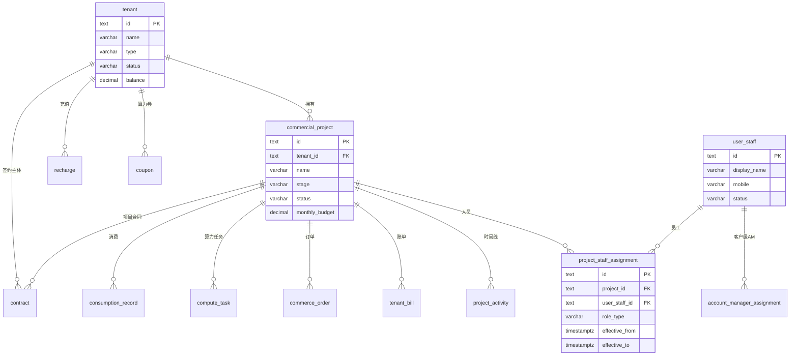
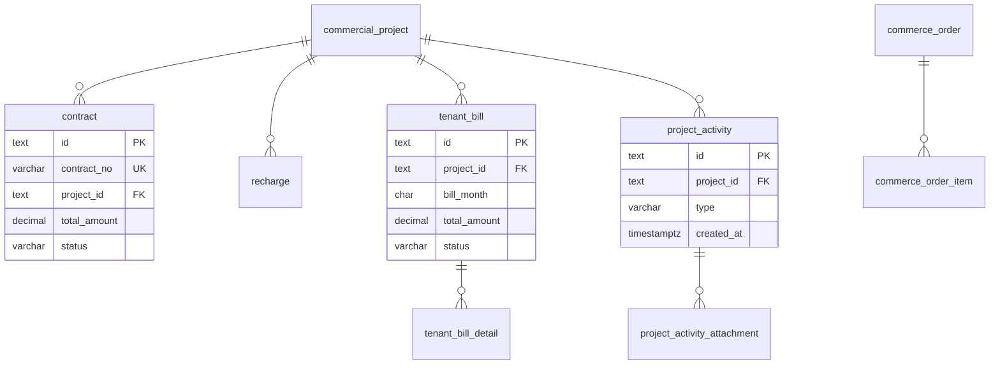
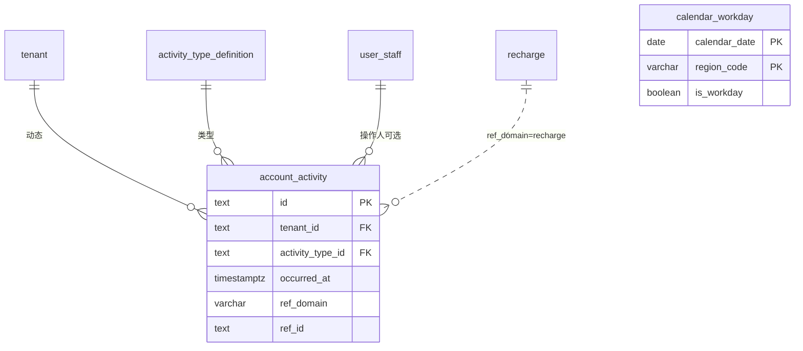

# CRM 模块数据库设计

**依据**：`apps/web/src/app/[locale]/(protected)/crm` 路由及子组件、`apps/web/src/components/dashboard/*` 业务面板、`lib/data/types.ts`（客户/项目主流程）、`lib/types/crm.ts`（员工/日历/经营扩展）、`lib/stores/crm-mock-store.ts`。

**文档性质**：CRM 域逻辑表结构（PostgreSQL 风格类型）；物理实现可拆 schema，外键语义与唯一约束应保持一致。

**版本**：v2.1（2026-05-18）

---

## 0. 现状说明（前端双 Mock）

当前 CRM 页面使用 **两套未合并的 Mock 数据源**，落库设计按 **目标统一模型** 描述，并标注各表的前端来源。

| 数据源 | 路径 | 使用页面 |
|--------|------|----------|
| **经营主流程 Mock** | `lib/data/mock-data.ts` + `lib/data/types.ts` | 工作台、客户、项目、合同、数据看板 |
| **CRM Store Mock** | `lib/data/crm-mock.ts` + `lib/types/crm.ts` + `crm-mock-store` | 员工、日历（客户动态） |

合并实现时：客户/项目页迁移至统一 API；`user_staff`、`account_activity`、`calendar_workday` 等可复用 CRM Store 已有形状。

---

## 1. 设计决策

| 决策 | 说明 |
|------|------|
| **客户 + 项目两级** | 侧边栏与页面以 **客户**（计费/联系主体）与 **项目**（经营跟踪单元）为主轴；一个客户可有多个项目（`TenantsContent` / `ProjectsContent`）。 |
| **`commercial_account` 可选合并** | 若需与全产品逻辑模型对齐，可将 `tenant` 与 `commercial_account` 保持 1:1（`primary_tenant_id`）；本 CRM UI 当前以 `tenant` 单表承载列表字段。 |
| **项目四人组** | 创建项目时 **必须** 指定售前经理、客户经理、交付经理、项目经理，均通过 `user_staff` 选择，落库 `project_staff_assignment`（四种 `role_type` 各一条当前有效记录）。不在 `commercial_project` 上存姓名字符串。 |
| **员工主数据** | `user_staff` 为选人唯一来源；项目列表/详情通过 JOIN 分配表展示姓名。 |
| **两类「活动」** | `project_activity`：项目时间线（评论/会议/阶段变更等）；`account_activity`：客户动态投影（日历页，可跨客户聚合）。 |
| **两类「任务」** | `compute_task`：算力运行任务（GPU/Job）；`follow_up_task`：协作跟进待办（CRM Store，待客户 Hub 接入）。 |
| **合同** | CRM 合同页为 **完整商务合同**（`contract`）；`contract_snapshot` 保留为摘要/外链形态，供未来轻量录入。 |
| **分析页只读** | `/crm/analytics` 读计费域月结汇总，非 CRM 写表。 |

---

## 2. 页面与表映射

### 2.1 一级路由

| 路由 | 页面入口 | 主要组件 | 涉及表 |
|------|----------|----------|--------|
| `/crm` | `crm/page.tsx` | `DashboardContent` | 聚合：`tenant`、`commercial_project`、`contract`、`tenant_bill`、`project_activity` |
| `/crm/analytics` | `crm/analytics/page.tsx` | `AnalyticsContent` | 计费域月结（只读，非本文件详述） |
| `/crm/tenants` | `crm/tenants/page.tsx` | `TenantsContent` | `tenant` |
| `/crm/tenants/[id]` | `crm/tenants/[id]/page.tsx` | `TenantDetailContent` | `tenant`、`commercial_project`、`recharge`、`consumption_record`、`coupon`、`contract` |
| `/crm/projects` | `crm/projects/page.tsx` | `ProjectsContent` | `commercial_project`、`tenant`、`project_staff_assignment`、`user_staff` |
| `/crm/projects/[id]` | `crm/projects/[id]/page.tsx` | `ProjectDetailContent` + 子面板 | 同上 + §2.4 项目子表 |
| `/crm/staff` | `crm/staff/page.tsx` | `CrmStaffListClient` | `user_staff`、`account_manager_assignment`（统计） |
| `/crm/staff/new` | `crm/staff/new/page.tsx` | `CrmStaffFormClient` | `user_staff` |
| `/crm/staff/[staffId]` | `crm/staff/[staffId]/page.tsx` | `CrmStaffDetailClient` | `user_staff` |
| `/crm/contracts` | `crm/contracts/page.tsx` | `ContractsContent` | `contract` |
| `/crm/calendar` | `crm/calendar/page.tsx` | `CalendarContent` | `account_activity`、`activity_type_definition`；可选 `calendar_workday` |

### 2.2 客户详情 Tab（`TenantDetailContent`）

| Tab | 组件逻辑 | 表名 | 说明 |
|-----|----------|------|------|
| 概览 | 图表占位 | — | 消费趋势/产品线分布来自聚合查询 |
| 项目 | 项目列表 | `commercial_project` | `getProjectsByTenantId` |
| 充值记录 | 充值表 | `recharge` | `getRechargesByTenantId` |
| 消费记录 | 消费明细 | `consumption_record` | `getConsumptionsByTenantId` |
| 算力券 | 券列表 | `coupon` | `getCouponsByTenantId` |
| 合同 | 合同列表 | `contract` | `getContractsByTenantId` |

### 2.3 新建/编辑项目（`ProjectsContent` 对话框）

创建项目时与 `commercial_project` **同事务** 写入四条 `project_staff_assignment`（`effective_to IS NULL`）。表单字段与 `role_type` 映射：

| 表单标签 | `role_type` | 选人控件 |
|----------|-------------|----------|
| 售前经理 | `pre_sales` | `user_staff` 下拉（仅 `status = active`） |
| 客户经理 | `account_manager` | 同上 |
| 交付经理 | `delivery_manager` | 同上 |
| 项目经理 | `project_manager` | 同上 |

校验：四个 `user_staff_id` 均非空；同一项目下四种角色各仅能有一条当前有效主责记录。人员变更时 **截断旧行**（写 `effective_to`）并 **插入新行**，不原地改 `user_staff_id`。

项目列表/详情展示：对 `project_staff_assignment` JOIN `user_staff.display_name`（Mock 过渡期 `preSalesManager` / `accountManager` 等字段由 API 聚合填充，不落库）。

### 2.4 项目详情 Tab（`ProjectDetailContent` + 子面板）

| Tab | 子组件 | 表名 |
|-----|--------|------|
| 概览 | 内联 + 运行中任务表 | `project_activity`、`compute_task` |
| 活动时间线 | `ProjectTimelinePanel` | `project_activity` |
| 消费明细 | `ProjectConsumptionPanel` | `consumption_record` |
| 任务列表 | `ProjectTasksPanel` | `compute_task` |
| 订单列表 | `ProjectOrdersPanel` | `commerce_order`、`commerce_order_item` |
| 算力券 | `ProjectCouponsPanel` | `coupon` |
| 充值记录 | `ProjectRechargesPanel` | `recharge` |
| 月度账单 | `ProjectBillsPanel` | `tenant_bill`、`tenant_bill_detail` |

### 2.5 CRM Store 扩展（待 UI 接入，表结构保留）

`crm-mock-store` 已建模、**尚无独立路由页**，供客户经营 Hub / 后续迭代：

| 概念 | 表名 | 前端类型 |
|------|------|----------|
| 多客户绑定 | `tenant_binding` | `TenantBinding` |
| 客户经理分配 | `account_manager_assignment` | `AccountManagerAssignment` |
| 测试券发放 | `test_voucher_issue` | `TestVoucherIssue` |
| 生命周期里程碑 | `lifecycle_milestone` | `LifecycleMilestone` |
| 里程碑佐证 | `milestone_evidence` | `MilestoneEvidence` |
| 合同摘要 | `contract_snapshot` | `ContractSnapshot` |
| 充值订单（CRM 视图） | `recharge_order` | `RechargeOrder` |
| 用量日汇总 | `consumption_usage_daily` | `ConsumptionUsageDaily` |
| 转正记录 | `conversion_record` | `ConversionRecord` |
| 过程文档 | `engagement_document` | `EngagementDocument` |
| 协作跟进 | `follow_up_task` | `FollowUpTask` |
| 动态评论 | `engagement_comment` | `EngagementComment` |
| 工作日历 | `calendar_workday` | `CalendarWorkday` |

---

## 3. 表结构

### 3.1 通用约定

- 主键：`id text` PK（ULID / nanoid / UUID text）。
- 时间：`timestamptz`；纯日历业务日用 `date`。
- 金额：`decimal(15,4)`；页面 Mock 为 `number`，落库统一 decimal。
- 扩展字段：`jsonb`。
- 外键列均为 `text`。
- 聚合字段（如 `project_count`、`total_recharge`）**不入库**，由查询或物化视图维护。

### 3.2 主数据

#### `tenant`（客户 — 计费与联系主体）

对应 `lib/data/types.Tenant`；与 `lib/types/crm.Tenant` 生命周期字段可合并到同表或 `commercial_account` 扩展表。

| 列名 | 类型 | 约束 | 前端字段 / 页面 |
|------|------|------|-----------------|
| `id` | text | PK | `Tenant.id` |
| `name` | varchar | NOT NULL | `name`；列表/详情标题 |
| `cert_code` | varchar | | `cert_code`；社会统一信用编码 |
| `type` | varchar | NOT NULL | `type`：`B` / `C` |
| `status` | varchar | NOT NULL | `status`：`active` / `inactive` / `suspended` |
| `contact_person` | varchar | | `contactPerson`；新建客户表单 |
| `contact_phone` | varchar | | `contactPhone` |
| `contact_email` | varchar | | `contactEmail` |
| `industry` | varchar | | `industry` |
| `address` | text | | `address` |
| `balance` | decimal(15,4) | NOT NULL DEFAULT 0 | `balance`；详情卡片 |
| `created_at` | timestamptz | NOT NULL | `createdAt` |
| `updated_at` | timestamptz | | |
| `tenant_code` | varchar | UK 可选 | `crm.Tenant.tenant_code`（Store） |
| `account_name` | varchar | | `crm.Tenant.account_name` |
| `platform_tenant_id` | varchar | UK 可选 | 平台计费客户 ID |
| `lifecycle_phase` | varchar | | `crm.Tenant.lifecycle_phase` |
| `expected_scale` | jsonb | | `expected_scale` |
| `observed_scale_summary` | jsonb | | `observed_scale_summary` |
| `test_started_on` | date | | |
| `test_completed_on` | date | | |
| `conversion_date` | date | | |
| `conversion_trigger` | varchar | | |

**派生指标**（工作台/列表）：`total_recharge`、`total_consumption`、`project_count` ← 分别 SUM `recharge`、`consumption_record`、COUNT `commercial_project`。

#### `commercial_project`（经营项目）

对应 `lib/data/types.Project`。

| 列名 | 类型 | 约束 | 前端字段 / 页面 |
|------|------|------|-----------------|
| `id` | text | PK | `Project.id` |
| `tenant_id` | text | FK→tenant, NOT NULL | `tenantId` |
| `name` | varchar | NOT NULL | `name` |
| `description` | text | | `description` |
| `stage` | varchar | NOT NULL | `stage`：`lead` / `testing` / `converted` |
| `status` | varchar | NOT NULL | `status`：`active` / `paused` / `completed` |
| `start_date` | date | | `startDate` |
| `end_date` | date | 可空 | `endDate` |
| `monthly_budget` | decimal(15,4) | | `monthlyBudget` |
| `balance` | decimal(15,4) | | `balance`；项目详情卡片 |
| `created_at` | timestamptz | NOT NULL | `createdAt` |
| `updated_at` | timestamptz | | |

索引：`(tenant_id)`、`(stage)`、`(status)`。

**项目人员**：不在本表存售前/客户/交付/项目经理；统一见 `project_staff_assignment`（§3.8）。创建项目 API 须校验四条分配均已写入。

#### `user_staff`（内部员工）

对应 `lib/types/crm.UserStaff`；`CrmStaffFormClient` 字段。

| 列名 | 类型 | 约束 | 前端字段 |
|------|------|------|----------|
| `id` | text | PK | `id` |
| `employee_no` | varchar | UK 可选 | `employee_no` |
| `display_name` | varchar | NOT NULL | `display_name` |
| `mobile` | varchar | NOT NULL | `mobile` |
| `email` | varchar | UK 可选 | `email` |
| `status` | varchar | NOT NULL | `active` / `inactive` |
| `department` | varchar | 可空 | 表单待补 |
| `created_at` / `updated_at` | timestamptz | | |

---

### 3.3 商务与资金流

#### `contract`（项目合同 — CRM 全量）

对应 `lib/data/types.Contract`；`/crm/contracts` 与客户/项目详情 Tab。

| 列名 | 类型 | 约束 | 前端字段 |
|------|------|------|----------|
| `id` | text | PK | `id` |
| `contract_no` | varchar | UK | `contractNo` |
| `tenant_id` | text | FK→tenant | `tenantId` |
| `project_id` | text | FK→commercial_project | `projectId` |
| `type` | varchar | NOT NULL | `standard` / `enterprise` / `custom` |
| `status` | varchar | NOT NULL | `draft` / `pending` / `active` / `expired` / `terminated` |
| `start_date` | date | NOT NULL | `startDate` |
| `end_date` | date | NOT NULL | `endDate` |
| `total_amount` | decimal(15,4) | NOT NULL | `totalAmount` |
| `paid_amount` | decimal(15,4) | NOT NULL DEFAULT 0 | `paidAmount` |
| `signed_at` | timestamptz | 可空 | `signedAt` |
| `signer_name` | varchar | 可空 | `signerName` |
| `terms` | text | | `terms` |
| `created_at` | timestamptz | NOT NULL | `createdAt` |

#### `recharge`（充值）

对应 `lib/data/types.Recharge`。

| 列名 | 类型 | 约束 | 前端字段 |
|------|------|------|----------|
| `id` | text | PK | |
| `tenant_id` | text | FK→tenant, NOT NULL | `tenantId` |
| `project_id` | text | FK 可空 | `projectId` |
| `amount` | decimal(15,4) | NOT NULL | `amount` |
| `payment_method` | varchar | NOT NULL | `bank_transfer` / `alipay` / `wechat` / `invoice` |
| `status` | varchar | NOT NULL | `pending` / `completed` / `failed` |
| `transaction_id` | varchar | UK 可选 | `transactionId` |
| `created_at` | timestamptz | NOT NULL | `createdAt` |
| `completed_at` | timestamptz | 可空 | `completedAt` |

#### `coupon`（算力券）

对应 `lib/data/types.Coupon`。

| 列名 | 类型 | 约束 | 前端字段 |
|------|------|------|----------|
| `id` | text | PK | |
| `tenant_id` | text | FK→tenant | `tenantId` |
| `project_id` | text | FK 可空 | `projectId` |
| `code` | varchar | UK | `code` |
| `name` | varchar | NOT NULL | `name` |
| `type` | varchar | NOT NULL | `discount` / `cash` |
| `value` | decimal(15,4) | NOT NULL | `value` |
| `min_amount` | decimal(15,4) | | `minAmount` |
| `status` | varchar | NOT NULL | `active` / `used` / `expired` |
| `issued_at` | timestamptz | NOT NULL | `issuedAt` |
| `expired_at` | timestamptz | NOT NULL | `expiredAt` |
| `used_at` | timestamptz | 可空 | `usedAt` |

---

### 3.4 用量、任务与订单

#### `consumption_record`（消费明细）

对应 `lib/data/types.Consumption`（单笔资源消费，非日汇总）。

| 列名 | 类型 | 约束 | 前端字段 |
|------|------|------|----------|
| `id` | text | PK | |
| `tenant_id` | text | FK→tenant | `tenantId` |
| `project_id` | text | FK→commercial_project | `projectId` |
| `product_line` | varchar | NOT NULL | `serverless` / `cloud_vm` / `job` / … |
| `resource_name` | varchar | | `resourceName` |
| `amount` | decimal(15,4) | NOT NULL | `amount` |
| `duration` | numeric | | `duration` |
| `unit` | varchar | | `hour` / `day` / `month` / `count` |
| `occurred_at` | timestamptz | NOT NULL | `createdAt` |

索引：`(project_id, occurred_at DESC)`、`(tenant_id, occurred_at DESC)`。

#### `compute_task`（算力运行任务）

对应 `lib/data/types.Task`（**非** `follow_up_task`）。

| 列名 | 类型 | 约束 | 前端字段 |
|------|------|------|----------|
| `id` | text | PK | |
| `project_id` | text | FK→commercial_project | `projectId` |
| `title` | varchar | NOT NULL | `title` |
| `description` | text | | `description` |
| `status` | varchar | NOT NULL | `pending` / `running` / `completed` / `failed` |
| `resource_type` | varchar | | `serverless` / `cloud_vm` / `job` / `bare_metal` |
| `gpu_count` | int | 可空 | `gpuCount` |
| `cpu_count` | int | 可空 | `cpuCount` |
| `memory_gb` | int | 可空 | `memoryGB` |
| `start_time` | timestamptz | NOT NULL | `startTime` |
| `end_time` | timestamptz | 可空 | `endTime` |
| `cost` | decimal(15,4) | | `cost` |

#### `commerce_order`（产品订单）

对应 `lib/data/types.Order`。

| 列名 | 类型 | 约束 | 前端字段 |
|------|------|------|----------|
| `id` | text | PK | |
| `order_no` | varchar | UK | `orderNo` |
| `tenant_id` | text | FK→tenant | `tenantId` |
| `project_id` | text | FK→commercial_project | `projectId` |
| `product_line` | varchar | | `productLine` |
| `status` | varchar | NOT NULL | `pending` / `processing` / `completed` / `cancelled` |
| `amount` | decimal(15,4) | NOT NULL | `amount` |
| `created_at` | timestamptz | NOT NULL | `createdAt` |
| `completed_at` | timestamptz | 可空 | `completedAt` |

#### `commerce_order_item`（订单行）

对应 `lib/data/types.OrderItem`（嵌套在 Order 内）。

| 列名 | 类型 | 约束 | 前端字段 |
|------|------|------|----------|
| `id` | text | PK | |
| `order_id` | text | FK→commerce_order | |
| `name` | varchar | NOT NULL | `name` |
| `quantity` | numeric | NOT NULL | `quantity` |
| `unit_price` | decimal(15,4) | NOT NULL | `unitPrice` |
| `total` | decimal(15,4) | NOT NULL | `total` |
| `sort_order` | int | DEFAULT 0 | |

---

### 3.5 账单与时间线

#### `tenant_bill`（月度账单）

对应 `lib/data/types.Bill`。

| 列名 | 类型 | 约束 | 前端字段 |
|------|------|------|----------|
| `id` | text | PK | |
| `tenant_id` | text | FK→tenant | `tenantId` |
| `project_id` | text | FK→commercial_project | `projectId` |
| `bill_month` | char(7) | NOT NULL | `month`（`YYYY-MM`） |
| `total_amount` | decimal(15,4) | NOT NULL | `totalAmount` |
| `status` | varchar | NOT NULL | `pending` / `paid` / `overdue` |
| `due_date` | date | NOT NULL | `dueDate` |
| `paid_at` | timestamptz | 可空 | `paidAt` |
| | | UK 建议 | `(project_id, bill_month)` |

#### `tenant_bill_detail`（账单明细行）

对应 `lib/data/types.BillDetail`。

| 列名 | 类型 | 约束 | 前端字段 |
|------|------|------|----------|
| `id` | text | PK | |
| `bill_id` | text | FK→tenant_bill | |
| `product_line` | varchar | | |
| `resource_name` | varchar | | |
| `usage` | numeric | | |
| `unit` | varchar | | |
| `unit_price` | decimal(15,4) | | |
| `amount` | decimal(15,4) | NOT NULL | |

#### `project_activity`（项目活动时间线）

对应 `lib/data/types.Activity`；`ProjectTimelinePanel`、工作台最近动态。

| 列名 | 类型 | 约束 | 前端字段 |
|------|------|------|----------|
| `id` | text | PK | |
| `project_id` | text | FK→commercial_project | `projectId` |
| `type` | varchar | NOT NULL | `comment` / `file` / `task` / `meeting` / `stage_change` / `recharge` / `consumption` |
| `title` | varchar | NOT NULL | `title` |
| `description` | text | | `description` |
| `author_name` | varchar | | `author`（过渡） |
| `author_staff_id` | text | FK 可空 | 目标接 `user_staff` |
| `author_role` | varchar | | `pre_sales` / `account_manager` / `delivery_manager` / `project_manager` / `system` |
| `metadata` | jsonb | | `metadata` |
| `created_at` | timestamptz | NOT NULL | `createdAt` |

#### `project_activity_attachment`（时间线附件）

对应 `lib/data/types.Attachment`。

| 列名 | 类型 | 约束 | 前端字段 |
|------|------|------|----------|
| `id` | text | PK | |
| `activity_id` | text | FK→project_activity | |
| `file_name` | varchar | NOT NULL | `name` |
| `file_size` | bigint | | `size` |
| `mime_type` | varchar | | `type` |
| `storage_uri` | varchar | NOT NULL | `url` |

---

### 3.6 客户动态与日历（CRM Store）

#### `activity_type_definition`（动态类型字典）

| 列名 | 类型 | 约束 | 前端字段 |
|------|------|------|----------|
| `id` | text | PK | |
| `type_code` | varchar | UK | `type_code` |
| `display_name` | varchar | NOT NULL | `display_name` |
| `category` | varchar | | PLATFORM / INTERNAL |
| `is_platform_projection` | boolean | DEFAULT true | |
| `sort_order` | int | | |

#### `account_activity`（客户动态 — 日历/时间线）

`CalendarContent` 按 `occurred_at` 聚合；**与 `project_activity` 分立**。

| 列名 | 类型 | 约束 | 前端字段 |
|------|------|------|----------|
| `id` | text | PK | |
| `tenant_id` | text | FK→tenant | `tenant_id`（CRM 类型；事实客户） |
| `commercial_account_id` | text | FK 可空 | 与 tenant 1:1 时可同 id |
| `activity_type_id` | text | FK | `activity_type_id` |
| `occurred_at` | timestamptz | NOT NULL | `occurred_at` |
| `ref_domain` | varchar | 可空 | `ref_domain` |
| `ref_id` | text | 可空 | `ref_id` |
| `idempotency_key` | varchar | UK 可选 | |
| `actor_user_id` | text | FK→user_staff 可空 | `actor_user_id` |
| `title_snapshot` | varchar | | |
| `summary_snapshot` | text | | |
| `payload` | jsonb | | |
| `visibility` | varchar | | |

索引：`(tenant_id, occurred_at DESC)`。

#### `calendar_workday`（工作日历）

| 列名 | 类型 | 约束 | 前端字段 |
|------|------|------|----------|
| `calendar_date` | date | PK（复合） | `calendar_date` |
| `region_code` | varchar | PK（复合） | `region_code` |
| `is_workday` | boolean | NOT NULL | `is_workday` |

应用层合成 id：`{region_code}__{calendar_date}`（`calendarWorkdayRecordId`）。

---

### 3.7 经营扩展子表（CRM Store，待 UI）

以下表结构同 v1.2；外键 `tenant_id` 落库建议 **`tenant.id`** 或 **`commercial_account_id`**（与全产品模型对齐时）。

- `tenant_binding` — 多计费客户绑定
- `account_manager_assignment` — 组合/客户级 AM（`role_type`、`effective_from` / `effective_to`）
- `test_voucher_issue`、`lifecycle_milestone`、`milestone_evidence`
- `contract_snapshot` — 轻量合同摘要（与 `contract` 并存时：`contract` 为主，`contract_snapshot` 可存外链）
- `recharge_order`、`consumption_usage_daily`、`conversion_record`
- `engagement_document`、`follow_up_task`、`engagement_comment`

`lifecycle_milestone.notes` 对应前端 `notes`（非 `remark`）。

---

### 3.8 项目人员分配

项目侧四类经营角色均引用 `user_staff`；与客户级 `account_manager_assignment`（组合/客户维度、可多人多角色）分离。

#### `project_role_type`（角色枚举 — 应用常量）

| `role_type` | 中文 | 创建项目必填 |
|-------------|------|----------------|
| `pre_sales` | 售前经理 | 是 |
| `account_manager` | 客户经理 | 是 |
| `delivery_manager` | 交付经理 | 是 |
| `project_manager` | 项目经理 | 是 |

首版可用 CHECK 约束或应用层校验；若需运营可配置，可升级为字典表 `project_role_definition`（`role_code` UK + `display_name`）。

#### `project_staff_assignment`

| 列名 | 类型 | 约束 | 说明 |
|------|------|------|------|
| `id` | text | PK | |
| `project_id` | text | FK→commercial_project, NOT NULL | |
| `user_staff_id` | text | FK→user_staff, NOT NULL | 创建/编辑项目时从员工列表选择 |
| `role_type` | varchar | NOT NULL | 见上表四种之一 |
| `effective_from` | timestamptz | NOT NULL | 创建项目时通常 = `commercial_project.created_at` |
| `effective_to` | timestamptz | 可空 | `NULL` = 当前主责；换人时写入历史截断时间 |
| `created_at` | timestamptz | NOT NULL | |
| `created_by` | text | FK→user_staff 可空 | 操作人（审计） |

**唯一约束（当前主责）**：`UNIQUE (project_id, role_type)` WHERE `effective_to IS NULL` — 每项目每种角色仅一名在职主责。

**创建项目事务**（伪代码）：

1. `INSERT commercial_project`
2. 对 `pre_sales`、`account_manager`、`delivery_manager`、`project_manager` 各 `INSERT project_staff_assignment`（`effective_to = NULL`）
3. 任一步失败则整体回滚

**查询当前四人组**（列表/详情/筛选）：

```sql
SELECT psa.role_type, us.id, us.display_name
FROM project_staff_assignment psa
JOIN user_staff us ON us.id = psa.user_staff_id
WHERE psa.project_id = :project_id AND psa.effective_to IS NULL
  AND psa.role_type IN ('pre_sales','account_manager','delivery_manager','project_manager');
```

**与 Mock 类型映射**：`lib/data/types.Project` 中的 `preSalesManager`、`accountManager` 为 **API 读模型** 字段（JOIN 聚合），实现后应从类型中改为 `*_staff_id` 或嵌套 `staff: { role, user_staff_id, display_name }[]`，不再作为持久化列。

索引：`(project_id)` WHERE `effective_to IS NULL`；`(user_staff_id)` WHERE `effective_to IS NULL`（统计员工负责项目数）。

---

## 4. ER 图

### 4.1 客户、项目与员工



### 4.2 商务、账单与项目时间线



### 4.3 客户动态与日历



---

## 5. 跨域与实现提示

| 场景 | 关联方式 |
|------|----------|
| 工作台指标 | `tenant` 余额 SUM；活跃项目 `commercial_project.status = active`；待付账单 `tenant_bill.status IN (pending, overdue)` |
| 充值写入动态 | `account_activity.ref_domain = 'recharge'`, `ref_id = recharge.id` |
| 阶段转换 | 更新 `commercial_project.stage` + 插入 `project_activity`（`type = stage_change`） |
| **创建项目** | 单事务：`commercial_project` + 4×`project_staff_assignment`；缺任一角色则 400 |
| **更换项目角色** | 对原行 SET `effective_to = now()`，INSERT 新行；禁止无历史地 UPDATE `user_staff_id` |
| 删除客户 | 级联 `commercial_project` 及项目子表（含 `project_staff_assignment`），或软删除 |
| 员工列表「负责客户数」 | COUNT `account_manager_assignment` WHERE `effective_to IS NULL`（客户级） |
| 员工列表「负责项目数」 | COUNT DISTINCT `project_id` FROM `project_staff_assignment` WHERE `user_staff_id = ?` AND `effective_to IS NULL` |
| 分析页 | 读计费域 `tenant_consumption_monthly` 等，非 CRM 写模型 |
| Mock 合并 | `mock-data` 客户 ID（如 `t1`）与 `crm-mock`（如 `t-001`）需在 API 层统一后再接 Store |

---

## 6. 表清单速查

| 表名 | 中文 | 页面入口 |
|------|------|----------|
| `tenant` | 客户 | `/crm/tenants`、客户详情 |
| `commercial_project` | 经营项目 | `/crm/projects`、项目详情、客户详情·项目 Tab |
| `user_staff` | 内部员工 | `/crm/staff` |
| `project_staff_assignment` | 项目四人组（售前/客户/交付/项目经理） | 新建项目对话框、项目列表/详情 |
| `contract` | 项目合同 | `/crm/contracts`、客户/项目详情 |
| `recharge` | 充值 | 客户/项目详情 |
| `consumption_record` | 消费明细 | 客户/项目详情 |
| `coupon` | 算力券 | 客户/项目详情 |
| `compute_task` | 算力任务 | 项目详情·任务 |
| `commerce_order` | 产品订单 | 项目详情·订单 |
| `commerce_order_item` | 订单行 | 同上 |
| `tenant_bill` | 月度账单 | 项目详情·账单、工作台 |
| `tenant_bill_detail` | 账单明细 | 同上 |
| `project_activity` | 项目时间线 | 项目详情·时间线、工作台 |
| `project_activity_attachment` | 时间线附件 | 同上 |
| `account_activity` | 客户动态 | `/crm/calendar` |
| `activity_type_definition` | 动态类型 | 系统配置 |
| `calendar_workday` | 工作日历 | 待接日历 CRUD |
| `account_manager_assignment` | 客户级 AM | 员工详情统计（Store） |
| `tenant_binding` 等 | 经营扩展 | Store 待接 Hub |

---

## 7. 文档维护

- 页面或 `lib/data/types.ts` / `lib/types/crm.ts` 字段变更时，同步本节表定义。
- 统一 Mock 后，删除本文 §0 双源说明，并将 `tenant_id` / `commercial_account_id` 命名在 API 层定稿。
- 全产品逻辑模型若有 `database-schema-structure.md`，CRM 写模型以 **客户 + 项目 + 本文件 §3.3–3.5** 为准；§3.7 与全产品 §1 对齐。
