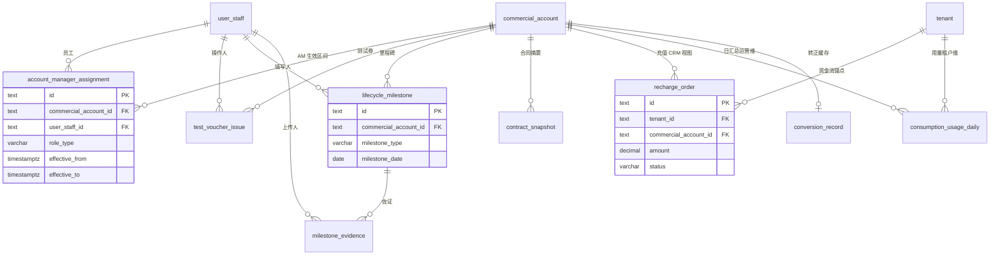
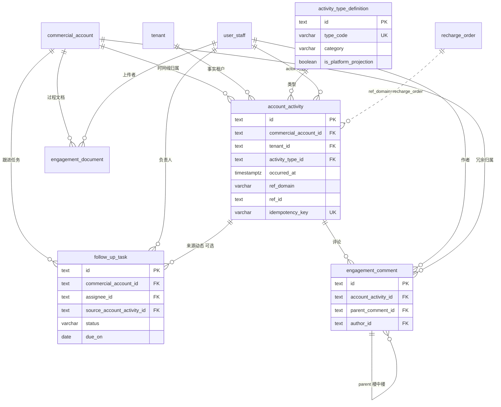
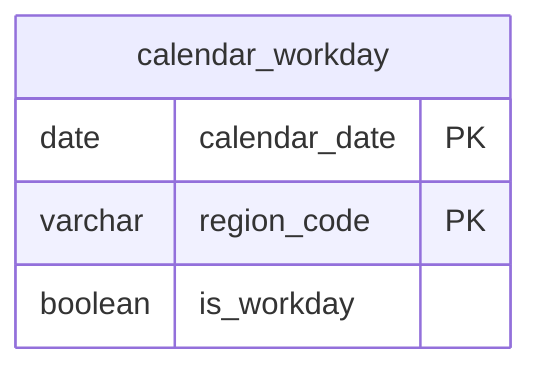
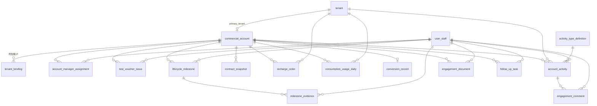

# CRM 模块数据库设计

**依据**：`apps/web/src/app/[locale]/(protected)/crm` 路由与子组件、`apps/web/src/lib/types/crm.ts` 前端模型，并与全产品逻辑模型 [`database-schema-structure.md`](../../../../docs/content/design/database-schema-structure.md) §1 对齐。

**文档性质**：CRM 域逻辑表结构（PostgreSQL 风格类型）；物理实现可拆 schema，但外键语义与唯一约束应保持一致。

**版本**：v1.2（2026-05-18）

---

## 0. 设计决策（简化模型）

本产品设计为 **全新 CRM**，采用尽可能简单的经营模型：

| 决策 | 说明 |
|------|------|
| **`tenant` ↔ `commercial_account` 默认 1:1** | 主租户经 `primary_tenant_id` 关联；同一组合可附加多个计费租户，见 `tenant_binding`。 |
| **`tenant_binding` 多租户绑定** | 表达 Originflow 类树形：组合名 + 多个平台租户 ID；AM/生命周期仍挂在组合级。 |
| **不设 `commercial_project`** | 经营跟踪、生命周期、AM 归属、合同/充值/动态等 **全部挂在 `commercial_account`**。不单独维护项目实体。 |
| **AM 在组合级分配** | `account_manager_assignment` 仅关联 `commercial_account_id`；通过 `role_type`（客户经理 / 售前 / 交付等）与 `effective_from` / `effective_to` 表达多人协作与交接。 |
| **合同用 CRM 摘要** | 仅 `contract_snapshot` 挂在组合上；无项目维合同。 |

**多 AM、多角色**：同一组合下可有多条 `account_manager_assignment`（不同员工或不同角色）；「当前主责客户经理」= `role_type = 客户经理` 且 `effective_to IS NULL` 的行。

**原先由「项目」承载的信息**，合并到组合或子表即可覆盖大部分场景：

- 阶段（线索 / 测试 / 转正）→ `commercial_account.lifecycle_phase`
- 跟进待办 → `follow_up_task`
- 过程材料 → `engagement_document`
- 关键节点 → `lifecycle_milestone`
- 多人服务 → `account_manager_assignment`（多行 + 角色）

**明确不做（首版）**：按项目拆预算、按项目签商务合同、同一客户并行多条独立 POC 线。若未来需要，再引入 `commercial_project`，不与当前模型冲突。

---

## 1. 范围与数据分层

依据 `lib/types/crm.ts` 与 `crm` 路由下 `_components`；前端 mock 中 `tenant_id` 即 **`commercial_account_id`**。

**命名映射（实现必读）**：

- 前端 `Tenant`（`crm.ts`）= **`tenant` + `commercial_account` 1:1 合并视图**（API 可仍称 tenant，库表拆开）。
- 子表外键 `tenant_id` → 落库 **`commercial_account_id`**；资金流/用量类 **双键** 保留 `tenant_id` + `commercial_account_id`。
- `account_name`、`lifecycle_phase` 等 → `commercial_account`；`tenant_code`、`name`（法定名）→ `tenant`。

---

## 2. 页面与表映射

### 2.1 一级路由

| 路由 | 页面入口 | 主要组件 | 涉及表 |
|------|----------|----------|--------|
| `/crm` | `crm/page.tsx` | 工作台（待接 CRM Store） | 聚合只读：`commercial_account`、子表汇总 |
| `/crm/analytics` | `crm/analytics/page.tsx` | 数据看板 | 计费域月结汇总（只读） |
| `/crm/tenants` | `crm/tenants/page.tsx` | `CrmTenantsListClient` | `tenant`、`commercial_account` |
| `/crm/tenants/[id]` | | `CrmTenantDetailClient` | 同上 + 辐射子表（§2.2） |
| `/crm/tenants/[id]/relations/{relation}` | | `CrmTenantRelationListClient` 等 | 见 §2.2 |
| `/crm/staff` | `crm/staff/page.tsx` | `CrmStaffListClient` | `user_staff` |
| `/crm/staff/new`、`/crm/staff/[id]/edit` | | `CrmStaffFormClient` | `user_staff` |
| `/crm/staff/[staffId]` | | `CrmStaffDetailClient` | `user_staff` |
| `/crm/contracts` | `crm/contracts/page.tsx` | `CrmContractsListClient` | `contract_snapshot`（全局列表，FK 组合） |
| `/crm/calendar` | `crm/calendar/page.tsx` | `CalendarContent` / `CrmCalendar*` | `calendar_workday`、`account_activity` |

> **不包含** `/crm/projects`：产品层取消「项目」模块，经营单元仅为 `commercial_account`。

### 2.2 租户详情辐射子表（`TenantHubCards`）

| `relation` 路由段 | 组件 | 表名 | 可写 |
|-------------------|------|------|------|
| `bindings` | `CrmTenantRelationList/Form/Detail` | `tenant_binding` | 是 |
| `assignments` | `CrmTenantRelationList/Form/Detail` | `account_manager_assignment` | 是 |
| `vouchers` | 同上 | `test_voucher_issue` | 是 |
| `milestones` | 同上 | `lifecycle_milestone` | 是 |
| `evidences` | 同上 | `milestone_evidence` | 是 |
| `contracts` | 同上 | `contract_snapshot` | 是 |
| `recharges` | 同上 | `recharge_order` | 是 |
| `usage-daily` | 同上 | `consumption_usage_daily` | 是 |
| `conversion` | 同上 | `conversion_record` | 是 |
| `activities` | 同上 | `account_activity` | **只读投影** |
| `documents` | 同上 | `engagement_document` | 是 |
| `tasks` | 同上 | `follow_up_task` | 是 |
| `comments` | 同上 | `engagement_comment` | 是 |

全局入口（组件已存在）：`/crm/timeline` → `account_activity`；`/crm/calendar` CRUD 组件 → `calendar_workday`。

---

## 3. 表结构

### 3.1 通用约定

- 主键：`id text` PK（ULID / nanoid / UUID text）。
- 时间：`timestamptz`；纯日历业务日用 `date`。
- 金额：`decimal(15,4)`；用量：`numeric`。
- 扩展字段：`jsonb`。
- 外键列均为 `text`。

### 3.2 主数据

#### `tenant`（租户 — 计费与资源主体）

| 列名 | 类型 | 约束 | 前端字段 / 页面 |
|------|------|------|-----------------|
| `id` | text | PK | `Tenant.id` |
| `external_id` | varchar | UK | 租户外部系统主键 |
| `tenant_code` | varchar | UK | `tenant_code`；列表筛选 |
| `name` | varchar | | 企业法定名称 |
| `short_name` | varchar |  | 简称 |
| `cert_code` | varchar |  | 统一信用编码 |
| `status` | varchar | | 注册/冻结等 |
| `type` | varchar | | system / manual 或 B端/C端 |
| `source` | varchar | system / manual | 系统 / 手动录入 |
| `created_at` | timestamptz | NOT NULL | `created_at` |
| `registered_at` | timestamptz | | 可选 |

联系人、地址等可扩展为 `tenant_contact` 或 jsonb，首版非必需。

#### `commercial_account`（客户组合 — **唯一经营跟踪单元**）

| 列名 | 类型 | 约束 | 前端字段 / 页面 |
|------|------|------|-----------------|
| `id` | text | PK | 可与 `tenant.id` 同值或独立生成；**1:1 时建议同 id** |
| `primary_tenant_id` | text | FK→tenant, **UK** | 主绑定租户，强制 1:1 |
| `account_code` | varchar | UK | 可映射 `tenant_code` |
| `account_name` | varchar | NOT NULL | `account_name`；列表/详情标题 |
| `type` | varchar | NOT NULL | `type`（B端/C端） |
| `lifecycle_phase` | varchar | | `lifecycle_phase` |
| `expected_scale` | jsonb | | `expected_scale` |
| `observed_scale_summary` | jsonb | | `observed_scale_summary` |
| `test_started_on` | date | | `test_started_on` |
| `test_completed_on` | date | | `test_completed_on` |
| `conversion_date` | date | | `conversion_date` |
| `conversion_trigger` | varchar | | `conversion_trigger` |
| `created_at` / `updated_at` | timestamptz | | `created_at` / `updated_at` |

#### `tenant_binding`（多租户绑定到同一客户组合）

将多个**平台计费租户 ID** 归入同一 `commercial_account`，用于列表树形展示（如 Originflow → 兰天游账号 / 独立商户）。**经营与 AM 仍在组合级**，不在绑定行重复维护生命周期。

| 列名 | 类型 | 约束 | 前端字段 |
|------|------|------|----------|
| `id` | text | PK | `TenantBinding.id` |
| `commercial_account_id` | text | FK→commercial_account, NOT NULL | `tenant_id` |
| `bound_tenant_id` | varchar | NOT NULL | 平台租户 ID（如 `12724`） |
| `binding_label` | varchar | NOT NULL | 列表展示名（如「兰天游账号」） |
| `binding_role` | varchar | 可空 | 子商户 / 项目线等 |
| `sort_order` | int | NOT NULL DEFAULT 0 | 树内排序，越小越靠前 |
| `created_at` | timestamptz | NOT NULL | `created_at` |
| | | **UK** `(commercial_account_id, bound_tenant_id)` | 同一组合不可重复绑定 |

**主租户**：`tenant.platform_tenant_id`（或 `commercial_account.primary_tenant_id` 指向的 tenant 行）在 UI 中作为树形父行；**附加行**来自本表。主租户 ID 不得出现在 `tenant_binding` 中。

**页面**：租户详情「计费租户绑定」卡片；`/crm/tenants/[id]/relations/bindings` 列表/新建/编辑。

#### `user_staff`（内部员工）

| 列名 | 类型 | 约束 | 前端字段 |
|------|------|------|----------|
| `id` | text | PK | `UserStaff.id` |
| `employee_no` | varchar | UK 可选 | `employee_no` |
| `display_name` | varchar | NOT NULL | `display_name` |
| `department` | varchar | | 逻辑模型要求；表单待补 |
| `mobile` | varchar | NOT NULL | `mobile` |
| `email` | varchar | UK 可选 | `email` |
| `status` | varchar | | `status` |
| `created_at` / `updated_at` | timestamptz | | `created_at` / `updated_at` |

---

### 3.3 租户关联子表（辐射导航）

以下表在前端均以 **`tenant_id`** 关联；落库时改为 **`commercial_account_id`**。标注「双键」者须同时存 `tenant_id`。

#### `account_manager_assignment`（客户经理分配）

| 列名 | 类型 | 约束 | 前端字段 |
|------|------|------|----------|
| `id` | text | PK | `id` |
| `commercial_account_id` | text | FK | `tenant_id` |
| `user_staff_id` | text | FK | `user_staff_id` |
| `role_type` | varchar | NOT NULL | `role_type` |
| `remark` | text | | 逻辑模型有；表单待补 |
| `effective_from` | timestamptz | NOT NULL | `effective_from` |
| `effective_to` | timestamptz | 可空 | `effective_to` |
| `created_at` | timestamptz | | `created_at` |

索引：`(commercial_account_id, user_staff_id, effective_from)`；当前有效：`WHERE effective_to IS NULL`。

#### `test_voucher_issue`（测试券发放）

| 列名 | 类型 | 约束 | 前端字段 |
|------|------|------|----------|
| `id` | text | PK | |
| `commercial_account_id` | text | FK | `tenant_id` |
| `operator_id` | text | FK→user_staff | `operator_id` |
| `issued_at` | timestamptz | NOT NULL | `issued_at` |
| `issue_status` | varchar | NOT NULL | `issue_status` |
| `coupon_id` | text | 可空 | `coupon_id` |
| `coupon_config` | jsonb | 可空 | `coupon_config` |
| `remark` | text | | `remark` |

#### `lifecycle_milestone`（生命周期里程碑）

| 列名 | 类型 | 约束 | 前端字段 |
|------|------|------|----------|
| `id` | text | PK | |
| `commercial_account_id` | text | FK | `tenant_id` |
| `milestone_type` | varchar | NOT NULL | `milestone_type` |
| `milestone_date` | date | NOT NULL | `milestone_date` |
| `filled_by` | text | FK | `filled_by` |
| `filled_at` | timestamptz | NOT NULL | `filled_at` |
| `remark` | text | | `remark`（逻辑层 `remark`） |

#### `milestone_evidence`（里程碑佐证）

| 列名 | 类型 | 约束 | 前端字段 |
|------|------|------|----------|
| `id` | text | PK | |
| `lifecycle_milestone_id` | text | FK | `lifecycle_milestone_id` |
| `file_name` | varchar | NOT NULL | `file_name` |
| `file_size` | varchar | | 逻辑模型有；表单待补 |
| `storage_uri` | varchar | NOT NULL | `storage_uri` |
| `file_hash` | varchar | 可空 | `file_hash` |
| `uploaded_by` | text | FK | `uploaded_by` |
| `uploaded_at` | timestamptz | NOT NULL | `uploaded_at` |

#### `contract_snapshot`（合同摘要 — CRM）

| 列名 | 类型 | 约束 | 前端字段 |
|------|------|------|----------|
| `id` | text | PK | |
| `commercial_account_id` | text | FK | `tenant_id` |
| `contract_no` | varchar | | `contract_no` |
| `contract_url` | varchar | | `contract_url` |
| `signed_on` | date | | `signed_on` |
| `amount_summary` | decimal(15,4) | 可空 | `amount_summary` |
| `external_crm_id` | varchar | 可空 | `external_crm_id` |

#### `recharge_order`（充值订单）— 双键

| 列名 | 类型 | 约束 | 前端字段 |
|------|------|------|----------|
| `id` | text | PK | |
| `tenant_id` | text | FK→tenant | 资金流锚点 |
| `commercial_account_id` | text | FK | `tenant_id`（运营） |
| `amount` | decimal(15,4) | NOT NULL | `amount` |
| `currency` | char(3) | NOT NULL | `currency` |
| `status` | varchar | NOT NULL | `status` |
| `type` | varchar | NOT NULL | `type` |
| `paid_at` | timestamptz | 可空 | `paid_at` |
| `external_trade_no` | varchar | UK 可选 | `external_trade_no` |

#### `consumption_usage_daily`（用量日汇总）— 双键

| 列名 | 类型 | 约束 | 前端字段 |
|------|------|------|----------|
| `id` | text | PK | |
| `tenant_id` | text | FK | |
| `commercial_account_id` | text | FK | `tenant_id` |
| `usage_date` | date | NOT NULL | `usage_date` |
| `product_line` | varchar | | `product_line` |
| `unit` | varchar | | `unit` |
| `amount` | decimal(15,4) | | `amount` |
| `gpu_seconds` | numeric | | `gpu_seconds` |
| | | UK 建议 | `(tenant_id, commercial_account_id, usage_date, product_line)` |

#### `conversion_record`（转正记录）

| 列名 | 类型 | 约束 | 前端字段 |
|------|------|------|----------|
| `id` | text | PK | |
| `commercial_account_id` | text | FK, UK | `tenant_id` |
| `conversion_date` | date | NOT NULL | `conversion_date` |
| `trigger_type` | varchar | NOT NULL | `trigger_type` |
| `remark` | text | | 逻辑模型有 |
| `candidate_signed_on` | date | 可空 | `candidate_signed_on` |
| `candidate_scale_met_on` | date | 可空 | `candidate_scale_met_on` |
| `candidate_recharge_ge_threshold_at` | timestamptz | 可空 | `candidate_recharge_ge_threshold_at` |
| `computed_at` | timestamptz | NOT NULL | `computed_at` |

---

### 3.4 客户动态与协作

#### `activity_type_definition`（动态类型字典）

| 列名 | 类型 | 约束 | 前端字段 |
|------|------|------|----------|
| `id` | text | PK | |
| `type_code` | varchar | UK | `type_code` |
| `display_name` | varchar | NOT NULL | `display_name` |
| `category` | varchar | | PLATFORM / INTERNAL |
| `is_platform_projection` | boolean | DEFAULT true | `is_platform_projection` |
| `sort_order` | int | | `sort_order` |

#### `account_activity`（客户动态 — 只读投影）— 双键

| 列名 | 类型 | 约束 | 前端字段 |
|------|------|------|----------|
| `id` | text | PK | |
| `commercial_account_id` | text | FK | `tenant_id` |
| `tenant_id` | text | FK | 事实发生租户 |
| `activity_type_id` | text | FK | `activity_type_id` |
| `occurred_at` | timestamptz | NOT NULL | `occurred_at`；日历/时间线排序 |
| `ref_domain` | varchar | 可空 | `ref_domain` |
| `ref_id` | text | 可空 | `ref_id` |
| `idempotency_key` | varchar | UK 可选 | `idempotency_key` |
| `actor_user_id` | text | FK 可空 | `actor_user_id` |
| `title_snapshot` | varchar | | `title_snapshot` |
| `summary_snapshot` | text | | `summary_snapshot` |
| `payload` | jsonb | | `payload` |
| `visibility` | varchar | | `visibility` |

索引：`(commercial_account_id, occurred_at DESC)`。

#### `engagement_document`（过程文档）

| 列名 | 类型 | 约束 | 前端字段 |
|------|------|------|----------|
| `id` | text | PK | |
| `commercial_account_id` | text | FK | `tenant_id` |
| `uploaded_by` | text | FK | `uploaded_by` |
| `title` | varchar | NOT NULL | `title` |
| `version_no` | int | DEFAULT 1 | `version_no` |
| `storage_uri` | varchar | NOT NULL | `storage_uri` |
| `visibility` | varchar | NOT NULL | `visibility` |
| `created_at` | timestamptz | NOT NULL | `created_at` |

#### `follow_up_task`（协作跟进任务）

| 列名 | 类型 | 约束 | 前端字段 |
|------|------|------|----------|
| `id` | text | PK | |
| `commercial_account_id` | text | FK | `tenant_id` |
| `assignee_id` | text | FK 可空 | `assignee_id` |
| `source_account_activity_id` | text | FK 可空 | `source_account_activity_id` |
| `title` | varchar | NOT NULL | `title` |
| `status` | varchar | NOT NULL | `status` |
| `due_on` | date | 可空 | `due_on` |
| `completed_at` | timestamptz | 可空 | `completed_at` |
| `completion_note` | text | 可空 | `completion_note` |

#### `engagement_comment`（评论）

| 列名 | 类型 | 约束 | 前端字段 |
|------|------|------|----------|
| `id` | text | PK | |
| `commercial_account_id` | text | FK | `tenant_id`（冗余过滤） |
| `account_activity_id` | text | FK | `account_activity_id` |
| `author_id` | text | FK | `author_id` |
| `parent_comment_id` | text | FK 可空 | `parent_comment_id` |
| `body` | text | NOT NULL | `body` |
| `created_at` | timestamptz | NOT NULL | `created_at` |

---

### 3.5 工作日历

#### `calendar_workday`（工作日历）

| 列名 | 类型 | 约束 | 前端字段 |
|------|------|------|----------|
| `calendar_date` | date | PK（复合） | `calendar_date` |
| `region_code` | varchar | PK（复合） | `region_code` |
| `is_workday` | boolean | NOT NULL | `is_workday` |

应用层合成 id：`{region_code}__{calendar_date}`（见 `calendarWorkdayRecordId`）。

---

## 4. ER 图

### 4.1 租户、客户组合与主数据

```mermaid
erDiagram
  tenant ||--|| commercial_account : "primary_tenant 主租户"
  commercial_account ||--o{ tenant_binding : "附加计费租户"
  tenant_binding }o--|| tenant : "bound_tenant_id 逻辑引用平台ID"

  commercial_account ||--o{ account_manager_assignment : "AM 与协作角色"
  user_staff ||--o{ account_manager_assignment : "内部员工"

  tenant {
    text id PK
    varchar tenant_code UK
    varchar name
    varchar status
    timestamptz created_at
  }

  commercial_account {
    text id PK
    text primary_tenant_id FK_UK
    varchar account_name
    varchar lifecycle_phase
    jsonb expected_scale
    date conversion_date
  }

  tenant_binding {
    text id PK
    text commercial_account_id FK
    varchar bound_tenant_id
    varchar binding_label
    int sort_order
  }

  account_manager_assignment {
    text id PK
    text commercial_account_id FK
    text user_staff_id FK
    varchar role_type
    timestamptz effective_from
    timestamptz effective_to
  }

  user_staff {
    text id PK
    varchar display_name
    varchar mobile
    varchar status
  }
```

### 4.2 租户关联子表（辐射 Hub）



### 4.3 客户动态、协作与评论



### 4.4 工作日历（独立维度）



`calendar_workday` 无外键；`CalendarContent` 将 `account_activity.occurred_at` 按日聚合展示，与 `commercial_account` 通过动态表间接关联。

### 4.5 CRM 域全表总览



---

## 5. 跨域与实现提示

| 场景 | 关联方式 |
|------|----------|
| 充值投影到时间线 | `account_activity.ref_domain = 'recharge_order'`, `ref_id = recharge_order.id`；`idempotency_key` 幂等 |
| 删除租户级联 | 与 `crm-mock-store.removeTenant` 一致：子表按 `commercial_account_id` / 里程碑链删除 |
| 前负责人数据截断 | 查询 `account_activity` 等带 `occurred_at` 的表时，按 `account_manager_assignment.effective_to` 过滤 |
| 数据看板 / 分析页 | 读计费域月结表（`tenant_consumption_monthly`、`platform_cost_monthly` 等），非 CRM 写模型 |
| 商务全量合同 | 在供应商/计费域；CRM 仅 `contract_snapshot` 摘要，挂 `commercial_account_id` |

---

## 6. 表清单速查

| 表名 | 中文 | 页面入口 |
|------|------|----------|
| `tenant` | 租户 | 租户列表/详情 |
| `commercial_account` | 客户组合 | 租户列表/详情（合并视图） |
| `tenant_binding` | 多租户绑定 | 租户详情、`relations/bindings` |
| `user_staff` | 内部员工 | `/crm/staff` |
| `account_manager_assignment` | 客户经理/协作角色分配 | 租户 relations/assignments |
| `test_voucher_issue` | 测试券发放 | relations/vouchers |
| `lifecycle_milestone` | 生命周期里程碑 | relations/milestones |
| `milestone_evidence` | 里程碑佐证 | relations/evidences |
| `contract_snapshot` | 合同摘要 | relations/contracts、`/crm/contracts` |
| `recharge_order` | 充值订单 | relations/recharges |
| `consumption_usage_daily` | 用量日汇总 | relations/usage-daily |
| `conversion_record` | 转正记录 | relations/conversion |
| `activity_type_definition` | 动态类型字典 | 系统配置 |
| `account_activity` | 客户动态 | relations/activities、日历、时间线 |
| `engagement_document` | 过程文档 | relations/documents |
| `follow_up_task` | 跟进任务 | relations/tasks |
| `engagement_comment` | 评论 | relations/comments |
| `calendar_workday` | 工作日历 | `/crm/calendar` |

---

## 7. 文档维护

- 字段变更请同步 `lib/types/crm.ts` 与 `apps/docs/content/design/database-schema-structure.md` §1。
- 前端 `tenant_id` 重命名为 `commercial_account_id` 时，须同时处理双键表（`recharge_order`、`consumption_usage_daily`、`account_activity`）的 `tenant_id` 保留策略。
