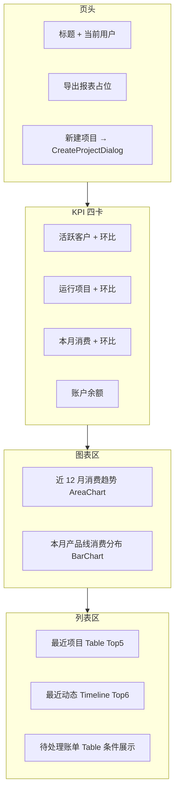

# CRM 工作台 — 实现方案

**页面**：`/crm/workbench`（`apps/web/src/components/dashboard/workbench-content.tsx`）  
**关联设计**：

- [crm-database.md](./crm-database.md) §5（工作台指标口径）、§3.5（`tenant_bill` / `project_activity`）
- [project-tenant-daily-consumption-design.md](./project-tenant-daily-consumption-design.md)（`consumption_usage_daily` 为日/月消费真值）
- [tenant-balance-snapshot-design.md](./tenant-balance-snapshot-design.md)（余额快照，**远期**用于趋势；本期仍用 `tenant.balance`）

**文档性质**：实现方案（确认后再改代码）  
**版本**：v1.0（2026-05-29）

---

## 1. 背景与目标

### 1.1 现状

工作台 UI 骨架已就绪，tRPC 部分接口已接 DB，但仍存在 **Mock 残留、口径偏差、链接错误**：

| 区域 | 组件位置 | 当前数据来源 | 问题 |
|------|----------|--------------|------|
| 页头 | `workbench-content.tsx` L64–72 | 硬编码 | 用户名写死「系统管理员」；按钮未绑定行为 |
| KPI 四卡 | L76–104 | `crm.dashboard.summary` | 「活跃客户」实为全量客户；「本月消费」用累计消费；环比 % 为 Mock（12/8/15） |
| 消费趋势 | L108–162 | `crm.analytics.consumptionTrend` | 读 `consumption_record` 明细表，与平台同步后的日汇总表不一致 |
| 产品线分布 | L164–206 | **硬编码** `productLineData` | 未调用已有 `productLineBreakdown` API |
| 最近项目 | L212–266 | `crm.dashboard.recentProjects` | 「本月消费」误用 `totalConsumption / 10`；链接 `/projects` 应为 `/crm/projects` |
| 最近动态 | L268–294 | `crm.dashboard.recentActivities` | 项目名依赖「最近项目」交集，活动所属项目可能不在 Top5 导致名称为空 |
| 待处理账单 | L297–339 | `crm.dashboard.pendingBills` | 数据基本正确；「查看详情」未跳转 |

后端入口：`lib/server/dataaccess/crm/dashboard.ts` + `routers/crm/index.ts` 中 `dashboard` / `analytics` 子路由 **已实现但未完全对齐设计口径**。

### 1.2 目标

1. **指标口径与 `crm-database.md` §5 一致**：活跃客户、租户余额合计、活跃项目、待付账单。
2. **消费类图表迁移至 `consumption_usage_daily`**（平台同步写入），与项目详情日消费 Tab、账单同步链路一致。
3. **消除 Mock**：产品线分布、KPI 环比、页头用户信息均接真实数据或明确隐藏。
4. **最小 UI 破坏**：保留现有卡片布局与 Recharts 样式，仅改数据源与少量交互。
5. **性能可接受**：Dashboard 聚合 SQL 化，避免 `customers.list()` + 全量 `projects.list()` 再 `slice`。

### 1.3 非目标（本期）

- 不做「导出报表」Excel/PDF 实现（保留按钮占位或 disabled + tooltip）。
- 不接入 `tenant_balance_snapshot` 余额历史曲线（设计稿阶段，见 balance-snapshot 文档）。
- 不在工作台展示 `account_activity`（客户日历动态）；仍用 `project_activity`。
- 不做按员工/业务线的权限过滤（全员可见全局 CRM 汇总；RBAC 细粒度另案）。

---

## 2. 页面信息架构



---

## 3. 数据口径与表映射

### 3.1 权威规则（摘自 crm-database §1.1 / §5）

| 规则 | 说明 |
|------|------|
| R3.5 | 余额真值在 `tenant.balance`；Customer 层展示 **SUM(tenant.balance)** |
| R3.1 | 消费事实挂 `tenant_id`；项目视图通过 `project_tenant` + `primary_tenant_id` 反查 |
| 活跃客户 | `customer.status = 'active'` |
| 运行项目 | `project.status = 'active'` |
| 待付账单 | `tenant_bill.status IN ('pending', 'overdue')` |
| 项目动态 | `project_activity`，按 `created_at DESC` |
| 月消费 | 优先 `consumption_usage_daily` 按 `usage_month` 聚合；项目级本月字段可读 `project.this_month_consumption` 快照 |

### 3.2 时区

与账单同步一致，统一 **东八区 `Asia/Shanghai`**：

- 「本月」= 当前东八区自然月 `YYYY-MM`（`usage_month` 或 `formatShanghaiDate` 截取）。
- 「上月」= 东八区上一自然月。
- 环比公式：`last === 0 ? null : round((this - last) / last * 100, 1)`；前端 `last === 0` 时不展示 trend。

复用现有工具：

- `lib/crm/balance-snapshot-utils.ts` → `formatShanghaiDate`、`monthDateRange`
- 或 `lib/crm/tenant-billing-import-utils.ts` → `usageMonthFromDate`

### 3.3 各区块 ↔ 表 / 字段

| UI 区块 | 主表 | 聚合方式 |
|---------|------|----------|
| 活跃客户 | `customer` | `COUNT(*) WHERE status = 'active'` |
| 运行项目 | `project` | `COUNT(*) WHERE status = 'active'` |
| 本月消费 | `consumption_usage_daily` | `SUM(amount) WHERE usage_month = :currentMonth` |
| 上月消费（环比） | 同上 | `usage_month = :lastMonth` |
| 账户余额 | `tenant` | `SUM(balance)` |
| 消费趋势（12 月） | `consumption_usage_daily` | `GROUP BY usage_month ORDER BY usage_month LIMIT 12` |
| 产品线分布 | `consumption_usage_daily` | `GROUP BY product_line WHERE usage_month = :currentMonth` |
| 最近项目 | `project` + JOIN | `ORDER BY updated_at DESC NULLS LAST, created_at DESC LIMIT 5`；展示字段 JOIN `customer`、`project_staff_assignment` |
| 本月项目消费 | `project.this_month_consumption` | 快照字段（由 `refreshProjectMonthlyMetrics` 维护）；列表展示只读 |
| 最近动态 | `project_activity` + `project` | `ORDER BY created_at DESC LIMIT 6`；JOIN 带出 `project.name` |
| 待处理账单 | `tenant_bill` + `project` | 现有逻辑保留；补 `LIMIT 10` |

> **迁移说明**：`consumption_record` 仍保留兼容旧 Tab，但工作台/分析页读路径应切换到 `consumption_usage_daily`。若某环境日汇总尚未同步，图表可能为空——属数据问题，不回退读 mock。

---

## 4. API 设计

### 4.1 方案选择

**推荐**：扩展 `crm.dashboard` 路由，新增/改造专用 procedure，避免前端拼装 5+ 次 query。

| 方案 | 优点 | 缺点 |
|------|------|------|
| A. 单接口 `dashboard.getWorkbench` | 一次 RTT；服务端并行 SQL | 需新 DTO |
| B. 保留多 procedure + React Query | 改动小 | 瀑布请求、口径分散 |

**本期采用 B 的渐进改造**（与现有 `analytics-content.tsx` 一致），P2 可合并为 A。

### 4.2 改造 `dashboard.summary`

**现返回**：

```typescript
{
  customerCount, activeProjectCount, totalConsumption, totalBalance, activeContractCount
}
```

**目标返回**：

```typescript
type DashboardSummary = {
  /** 活跃客户数 */
  activeCustomerCount: number
  /** 活跃项目数 */
  activeProjectCount: number
  /** 东八区本月总消费（元） */
  thisMonthConsumption: number
  /** 东八区上月总消费（元） */
  lastMonthConsumption: number
  /** 全部 tenant 余额合计（元） */
  totalBalance: number
  /** 活跃合同数（保留，UI 暂未展示） */
  activeContractCount: number
  /** 环比 %；分母为 0 时为 null */
  trends: {
    activeCustomerCount: number | null
    activeProjectCount: number | null
    thisMonthConsumption: number | null
  }
}
```

**SQL 要点**（`dashboard.ts`）：

```sql
-- 活跃客户
SELECT COUNT(*) FROM customer WHERE status = 'active';

-- 活跃项目（已有）
SELECT COUNT(*) FROM project WHERE status = 'active';

-- 余额合计
SELECT COALESCE(SUM(balance), 0) FROM tenant;

-- 本月 / 上月消费
SELECT COALESCE(SUM(amount), 0)
FROM consumption_usage_daily
WHERE usage_month = :month;

-- 环比：活跃客户/项目可用「本月新增 active」或「期末 active 数 vs 上月同日快照」
-- 首期简化：比较「当前 active 数」与「上月末 active 数」需历史快照 → **首期仅对消费做真实环比**；
-- 客户/项目环比用「本月新建且仍 active」vs「上月新建且仍 active」或 **隐藏 trend**（推荐首期隐藏客户/项目 trend，避免误导）。
```

**环比策略（确认项）**：

| KPI | 首期建议 |
|-----|----------|
| 本月消费 | ✅ 真实环比（`thisMonth` vs `lastMonth` from `consumption_usage_daily`） |
| 活跃客户 | ⚠️ 隐藏 trend，或展示「较上月」文案但不显示 % |
| 运行项目 | ⚠️ 同上 |
| 账户余额 | 不展示 trend（当前 UI 已符合） |

### 4.3 改造 `analytics.consumptionTrend`

```typescript
// 输入（可选）
{ months?: number } // default 12

// 输出
{ month: string; consumption: number }[]  // month = 'YYYY-MM'
```

实现：从 `consumption_usage_daily` 按 `usage_month` SUM，取最近 N 个自然月，不足补 0（前端 X 轴仍用 `month.slice(5)` 显示「MM月」）。

### 4.4 改造 `analytics.productLineBreakdown`

```typescript
// 输入（可选）
{ usageMonth?: string } // default 当前东八区月

// 输出
{ name: string; value: number }[]  // name 为 product_line 原始码；前端 map productLineNames
```

按 `value DESC` 排序；颜色使用与 `analytics-content.tsx` 相同的 `CHART_COLORS` 循环。

### 4.5 改造 `dashboard.recentProjects`

```typescript
// 输入
{ limit?: number } // default 5

// 输出：现有 Project 类型，但 list 路径改为 DB limit + orderBy updatedAt
```

- `ORDER BY project.updated_at DESC, project.created_at DESC`
- `LIMIT :limit`
- 复用 `projectsDataAccess` 的 enrichment（客户经理、`thisMonthConsumption` 等）
- **禁止** `list()` 全量后 `slice`

### 4.6 改造 `dashboard.recentActivities`

扩展 `Activity` 读模型（或局部 DTO）：

```typescript
type ActivityWithProject = Activity & {
  projectName: string
}
```

查询：`project_activity` LEFT JOIN `project ON project.id = project_activity.project_id`，`LIMIT 6`。

### 4.7 `dashboard.pendingBills`

- 保持 `status IN ('pending', 'overdue')`
- 增加 `LIMIT 10`
- 返回结构不变（已有 `projectName`）

---

## 5. 前端改造清单

文件：`apps/web/src/components/dashboard/workbench-content.tsx`

| # | 改动 | 说明 |
|---|------|------|
| F1 | 删除 `productLineData` 常量 | 改用 `trpc.crm.analytics.productLineBreakdown.useQuery({ usageMonth })` |
| F2 | KPI 绑定新 summary 字段 | `activeCustomerCount`、`thisMonthConsumption`；trend 仅消费卡展示真实值 |
| F3 | 最近项目「本月消费」 | `project.thisMonthConsumption.toLocaleString()`，与 `projects-content.tsx` 一致 |
| F4 | 路由修正 | `/projects` → `/crm/projects`；详情 `/crm/projects/[id]` |
| F5 | 最近动态 | 使用 API 返回的 `projectName`，移除 `recentProjects.find` |
| F6 | 页头用户 | `authClient.useSession()` → `session.user.name` |
| F7 | 新建项目 | 复用 `CreateProjectDialog` + `trpc.crm.businessLines.listActive`；成功后 invalidate dashboard queries |
| F8 | 空态 / Loading | 各 Card 使用 `Skeleton` 或沿用项目列表的简单 loading（与 Global 大盘风格对齐即可） |
| F9 | 待处理账单 | 「查看详情」链至 `/crm/projects/[projectId]` 账单 Tab（hash 或 query `?tab=bills` 若已有） |
| F10 | 产品线中文名 | `productLineNames[row.name] ?? row.name` |

**可选抽取**（非必须）：将 `CHART_COLORS`、产品线 BarChart 与 `analytics-content.tsx` 共用到 `dashboard/chart-utils.ts`，避免重复。

### 5.1 Invalidate 缓存键

新建/编辑项目、账单状态变更后，失效：

```typescript
utils.crm.dashboard.summary.invalidate()
utils.crm.dashboard.recentProjects.invalidate()
utils.crm.dashboard.recentActivities.invalidate()
utils.crm.dashboard.pendingBills.invalidate()
utils.crm.analytics.consumptionTrend.invalidate()
utils.crm.analytics.productLineBreakdown.invalidate()
```

可在 `lib/dashboard/invalidate-crm-workbench.ts` 封装（对称 `invalidate-global-dashboard.ts`）。

---

## 6. 后端文件改动

| 文件 | 改动 |
|------|------|
| `lib/server/dataaccess/crm/dashboard.ts` | 重写 `summary`；优化 `recentProjects` / `recentActivities` / `pendingBills`；新增东八区 month helper |
| `lib/server/routers/crm/index.ts` | `summary` 返回类型变更；`recentProjects` / `recentActivities` / analytics 增加 optional input |
| `lib/data/types.ts` | （可选）`ActivityWithProject`；或仅在 router 层 infer |
| `lib/server/dataaccess/crm/project-monthly-metrics.ts` | 无改动；确保 cron/账单同步后调用 `refreshProjectMonthlyMetrics`（已有则文档注明依赖） |

**不建议**修改 DB Schema；现有表已满足需求。

---

## 7. 分阶段交付

| 阶段 | 范围 | 验收标准 |
|------|------|----------|
| **P1 口径修正** | summary 活跃客户/本月消费；图表切 `consumption_usage_daily`；产品线接 API；项目消费字段与链接修复 | KPI 与 DB 手工 SQL 对账一致；无硬编码 chart 数据 |
| **P2 体验** | 页头用户、CreateProjectDialog、loading/empty、账单详情跳转 | 主流程可点通；无 console 报错 |
| **P3 优化** | 单接口 `getWorkbench`；客户/项目真实环比（需快照或历史表）；导出报表 | 可选 |

---

## 8. 测试与对账

### 8.1 SQL 对账示例

```sql
-- 活跃客户
SELECT COUNT(*) FROM customer WHERE status = 'active';

-- 本月消费
SELECT SUM(amount) FROM consumption_usage_daily WHERE usage_month = '2026-05';

-- 余额
SELECT SUM(balance) FROM tenant;

-- 待付账单
SELECT COUNT(*) FROM tenant_bill WHERE status IN ('pending', 'overdue');
```

### 8.2 手工测试清单

- [ ] 无数据时 KPI 为 0、图表空态不报错
- [ ] 同步账单后本月消费 KPI 与 `consumption_usage_daily` 一致
- [ ] 最近项目 Top5 按更新时间排序；本月消费与项目列表页同项目一致
- [ ] 最近动态始终显示项目名
- [ ] 待付账单仅 pending/overdue；paid 不出现
- [ ] 新建项目后列表与 KPI 刷新

---

## 9. 待确认项

实施前请确认：

1. **客户/项目 KPI 环比**：首期是否 **仅展示消费环比**，客户/项目卡隐藏 trend？（推荐是）
2. **产品线分布时间窗**：默认 **本月** 还是 **近 12 月累计**？（推荐本月，与「本月消费」KPI 一致）
3. **最近项目排序**：`updated_at DESC` 还是 `created_at DESC`？（推荐 `updated_at`，体现近期活跃）
4. **导出报表**：本期 disabled 占位是否可接受？
5. **P1 是否合并 `getWorkbench` 单接口**？（默认否，保持多 query）

---

## 10. 参考：现状 vs 目标对照

| 字段 / 行为 | 现状 | 目标 |
|-------------|------|------|
| 活跃客户 | `customers.length` 全量 | `status = 'active'` COUNT |
| 本月消费 KPI | `SUM(customer.totalConsumption)` 累计 | `consumption_usage_daily` 当月 SUM |
| 消费趋势 | `consumption_record` | `consumption_usage_daily` 按月 |
| 产品线图 | Mock 数组 | API + `productLineNames` |
| 项目本月消费 | `totalConsumption / 10` ❌ | `thisMonthConsumption` |
| 项目链接 | `/projects` | `/crm/projects` |
| 动态项目名 | 依赖 recentProjects 交集 | JOIN 返回 `projectName` |
| 用户名 | 硬编码 | Session user name |

---

确认本文档后，按 **P1 → P2** 顺序修改 `dashboard.ts` 与 `workbench-content.tsx`，不在确认前提交代码变更。
