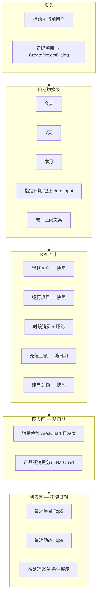

# CRM 工作台 — 实现方案

**页面**：`/crm/workbench`（`apps/web/src/components/dashboard/workbench-content.tsx`）  
**关联设计**：

- [crm-database.md](./crm-database.md) §5（工作台指标口径）、§3.5（`tenant_bill` / `project_activity`）
- [project-tenant-daily-consumption-design.md](./project-tenant-daily-consumption-design.md)（`consumption_usage_daily` 为日/月消费真值）
- [tenant-balance-snapshot-design.md](./tenant-balance-snapshot-design.md)（余额快照，**远期**用于趋势；本期仍用 `tenant.balance`）
- [role-menu-data-access-design.md](./role-menu-data-access-design.md) §3.4（CRM 行级数据范围 / AM 并集规则）

**文档性质**：实现方案（确认后再改代码）  
**版本**：v2.0（2026-06-15）

**v2.0 变更摘要**：

- 新增 **日期切换**（今天 / 7 天 / 本月 / 指定起止日期），联动 KPI、消费趋势、产品线分布
- KPI 新增 **充值金额**；消费 KPI 改为 **时段消费** 并保留环比
- 明确 **按当前登录用户 CRM 数据范围（AM + 项目四人组并集）** 过滤全部工作台统计
- 明确 **SQL 跨表过滤使用 JOIN / EXISTS，禁止 `IN (id 列表)`**（`status` 等枚举字段除外）
- 移除 v1.0「不做权限过滤」非目标表述（与现网 `crmScopedProcedure` 行为对齐）

---

## 1. 背景与目标

### 1.1 现状（v2.0 基线）

| 区域 | 组件 | 当前数据来源 | 问题 |
|------|------|--------------|------|
| 页头 | `workbench-header.tsx` | Session 用户名 | 已实现；缺日期切换入口 |
| KPI 四卡 | `workbench-kpi-section.tsx` | `crm.dashboard.summary` | 无充值；消费固定「本月」；无日期联动 |
| 消费趋势 | `workbench-consumption-trend-card.tsx` | `crm.analytics.consumptionTrend({ months: 12 })` | 固定近 12 **月**，与业务日期无关 |
| 产品线分布 | `workbench-product-line-card.tsx` | `crm.analytics.productLineBreakdown({})` | 固定当月 `usage_month` |
| 最近项目 / 动态 / 账单 | 各 Card | `crm.dashboard.*` | 已接 DB；**不**随日期切换变化 |

后端入口：`lib/server/dataaccess/crm/dashboard.ts` + `routers/crm/index.ts` 中 `dashboard` / `analytics` 子路由；路由层已通过 `crmScopedProcedure` 注入 `ctx.crmScope`。

### 1.2 v2.0 目标

1. **日期切换**：今天 / 近 7 天 / 本月 / 指定起止日期；切换后 **时段消费 KPI、充值 KPI、消费趋势、产品线分布** 同步刷新。
2. **KPI 扩展**：新增 **充值金额**；布局调整为 5 卡（见 §2.2）。
3. **数据范围**：工作台全部统计与列表 **严格遵循当前登录用户的 `CrmDataScope`**（§4）；`admin` 全量，`user` 为 AM 并集范围，`member` 不可访问 CRM。
4. **SQL 规范**：跨表可见性过滤 **JOIN 链路**，避免 `tenant_id IN (...)` / `project_id IN (...)` 等 ID 列表 `IN`（§5）；枚举 **状态** 字段仍可用 `IN`。
5. **最小 UI 破坏**：保留现有卡片布局与 Recharts 样式；新增日期选择条与 Context 共享状态。

### 1.3 非目标（本期）

- 不做「导出报表」Excel/PDF 实现（保留占位或 disabled）。
- 不接入 `tenant_balance_snapshot` 余额历史曲线。
- **最近项目、最近动态、待处理账单** 不随日期切换过滤（仍为「最新 N 条」，但 **仍受 CRM 数据范围约束**）。
- 充值 KPI **首期不展示环比**（消费 KPI 展示环比，见 §3.4）。
- 不在此期合并为单接口 `getWorkbench`（仍多 procedure + React Query）。

---

## 2. 页面信息架构

### 2.1 布局



### 2.2 KPI 五卡

| 卡片 | 随日期切换 | 数据来源 |
|------|------------|----------|
| 活跃客户 | **否** | `customer`，`status = 'active'`，CRM 范围过滤 |
| 运行项目 | **否** | `crm_project`，`status = 'active'`，CRM 范围过滤 |
| 时段消费 | **是** | `consumption_usage_daily`，`usage_date` 区间 SUM |
| 充值金额 | **是** | `recharge`，`status = 'paid'`，`completed_at` 东八区日界 SUM |
| 账户余额 | **否** | `billing_tenant.balance` SUM，CRM 范围过滤 |

布局：`grid-cols-1 md:grid-cols-2 lg:grid-cols-3 xl:grid-cols-5`。

---

## 3. 日期切换

### 3.1 预设与区间（东八区 `Asia/Shanghai`）

| 预设 | `startDate` | `endDate` | 说明 |
|------|-------------|-----------|------|
| **今天** | 今日 | 今日 | 单日 |
| **7天** | 今日 − 6 日 | 今日 | **含今天共 7 天**（已确认） |
| **本月** | 当月 1 日 | **今日** | **非整月**，截至当前日（已确认） |
| **指定日期** | 用户选 | 用户选 | **起止日期范围**（已确认）；`startDate ≤ endDate`，否则前端归一化或提示 |

- 默认预设：**本月**。
- 工具模块（建议）：`lib/crm/workbench-date-range.ts`，复用 `formatShanghaiDate`、`shanghaiDateTimeToUtc`、`monthDateRange`。
- 页头下方展示区间文案，例如：`统计区间：2026-06-01 ~ 2026-06-15`。

### 3.2 联动范围

| 模块 | 随日期 |
|------|--------|
| 时段消费 KPI | ✅ |
| 充值金额 KPI | ✅ |
| 消费趋势图 | ✅ |
| 产品线分布 | ✅ |
| 活跃客户 / 运行项目 / 账户余额 | ❌ |
| 最近项目 / 动态 / 账单 | ❌ |

### 3.3 消费趋势图（随日期）

- **粒度**：按 `consumption_usage_daily.usage_date` **日**聚合（非固定 12 月）。
- **X 轴**：区间内每日；标签 `MM-DD`；单日仅 1 个点。
- **补零**：区间内无数据的日期补 `consumption: 0`，保证折线连续。
- **标题**：可附区间副标题。

### 3.4 环比策略（已确认）

消费 KPI **展示环比**；对比区间与预设对齐：

| 预设 | 当前区间 | 对比区间 | KPI 副文案 |
|------|----------|----------|------------|
| 今天 | `[today, today]` | `[today-1, today-1]` | 较昨日 |
| 7天 | `[today-6, today]` | `[today-13, today-7]` | 较上 7 天 |
| 本月 | `[month-01, today]` | 上月 **同天数**（1 日 ~ 上月同日；若上月无该日则取上月最后一天） | 较上月 |
| 指定日期 | `[start, end]` | 等长紧邻上一段：`[start−len, start−1]` | 较上周期 |

公式：`last === 0 ? null : round((this - last) / last * 100, 1)`；前端 `null` 时不展示 trend。

充值 KPI：**不展示环比**（首期）。

活跃客户 / 运行项目 / 账户余额：**不展示环比**（快照指标，已确认）。

---

## 4. CRM 数据范围（AM）— 必读

> **结论**：工作台 **所有** 读接口（summary、analytics、recentProjects、recentActivities、pendingBills）必须在服务端按 **`ctx.crmScope`** 过滤；**禁止**前端按 AM 自行裁剪。与 [role-menu-data-access-design.md](./role-menu-data-access-design.md) §3.4 完全一致。

### 4.1 角色 × 范围

| 角色 | `CrmDataScope` | 工作台行为 |
|------|----------------|------------|
| `admin` | `{ type: 'all' }` | 全量 CRM 汇总 |
| `user` | `{ type: 'am_assigned', staffId }` | **仅** 可见集合内统计 |
| `member` | 不可访问 CRM | 路由 / procedure 403 |

解析：`resolveCrmDataScope(ctx.user)`，由 `crmScopedProcedure` 注入（`lib/server/auth/crm-data-scope.ts`）。

### 4.2 `user` 可见集合（三路并集）

1. **客户级 AM**：`account_manager_assignment`  
   `user_staff_id = :staffId AND effective_to IS NULL` → `amCustomerIds`
2. **项目级分配**：`project_staff_assignment`  
   同上 + `role_type IN ('pre_sales','account_manager','delivery_manager','project_manager')` → `staffProjectIds`
3. **派生**：
   - `visibleCustomerIds` = `amCustomerIds` ∪ 各 `staffProjectIds` 所属 `customer_id`
   - `visibleProjectIds` = `crm_project.id WHERE customer_id ∈ amCustomerIds` ∪ `staffProjectIds`
   - `visibleTenantIds` = `project_tenant.tenant_id WHERE project_id ∈ visibleProjectIds` ∪ `crm_project.primary_tenant_id`（可见项目且非空）

**继承规则**：

- 客户级 AM → 该客户下 **全部项目** 可见。
- 仅项目四人组 / 项目 AM → **仅** 参与项目 + 所属客户可见；**不**继承同客户其他项目。
- 租户 **仅** 来自可见项目的 `project_tenant` / `primary_tenant_id`；**不**回退客户默认租户。

### 4.3 各区块范围落点

| UI 区块 | 过滤锚点 | 说明 |
|---------|----------|------|
| 活跃客户 | `customer.id` | 在 `visibleCustomerIds` 语义内 |
| 运行项目 | `crm_project.id` | 在 `visibleProjectIds` 语义内 |
| 账户余额 | `billing_tenant.id` | 在 `visibleTenantIds` 语义内 |
| 时段消费 / 趋势 / 产品线 | `consumption_usage_daily.tenant_id` | 必须 JOIN 到可见项目—租户链路 |
| 充值金额 | `recharge.tenant_id` | 同上 |
| 最近项目 / 动态 / 账单 | `project_id` / `tenant_bill.project_id` | 项目范围 |

**空范围**：聚合结果为 `0` / `[]`，不返回 403。

### 4.4 与 v1 文档差异

v1.0 §1.3 曾写「不做按员工/业务线的权限过滤」——**已作废**。现网 `dashboard.ts` 已传入 `ctx.crmScope`，v2.0 要求在 **新增日期 / 充值 / 图表 SQL** 中同样贯彻，且 **改为 JOIN 实现**（§5），不再依赖 `loadVisibleTenantIds` + `inArray` 模式。

---

## 5. SQL 设计规范（避免跨表 `IN`）

### 5.1 原则

| 允许 | 禁止 |
|------|------|
| `status IN ('pending','overdue')`、`role_type IN (...)` 等 **枚举/状态** | `tenant_id IN (:idList)`、`project_id IN (:idList)`、`customer_id IN (:idList)` |
| 单表 `WHERE status = 'active'` | 先查 ID 列表再 `IN` 过滤事实表 |

**原因**：ID 列表 `IN` 在 AM 范围较大时计划不稳定、难利用索引；JOIN 链路可固定走 FK / 索引路径。

**`admin`（`scope.type === 'all'`）**：无可见性 JOIN，仅日期 / 状态条件。

**`user`（`scope.type === 'am_assigned'`）**：通过 §5.2 可见性子查询 / JOIN，`staffId` 来自 `ctx.crmScope.staffId`（**禁止**客户端传入）。

### 5.2 可见项目 / 租户 JOIN 模板

**可见项目**（逻辑等价于 `visibleProjectIds`，实现用 JOIN）：

```sql
-- 别名 vp：当前 staff 可见的 crm_project
SELECT p.id AS project_id, p.customer_id, p.primary_tenant_id
FROM crm_project p
LEFT JOIN account_manager_assignment ama
  ON ama.customer_id = p.customer_id
 AND ama.user_staff_id = :staffId
 AND ama.effective_to IS NULL
LEFT JOIN project_staff_assignment psa
  ON psa.project_id = p.id
 AND psa.user_staff_id = :staffId
 AND psa.effective_to IS NULL
 AND psa.role_type IN (
   'pre_sales', 'account_manager', 'delivery_manager', 'project_manager'
 )
WHERE ama.customer_id IS NOT NULL OR psa.project_id IS NOT NULL
```

**可见租户**（逻辑等价于 `visibleTenantIds`）：

```sql
SELECT DISTINCT pt.tenant_id
FROM project_tenant pt
INNER JOIN ( /* 上节 vp */ ) vp ON vp.project_id = pt.project_id
UNION
SELECT vp.primary_tenant_id
FROM ( /* 上节 vp */ ) vp
WHERE vp.primary_tenant_id IS NOT NULL
```

下文称该集合为 **`scoped_tenant`**（实现可用 CTE 或 Drizzle 子查询，**不要** materialize 为 ID 数组再 `IN`）。

### 5.3 各指标 SQL 要点

#### 活跃客户

```sql
SELECT COUNT(DISTINCT c.id)
FROM customer c
INNER JOIN ( /* 可见客户：vp 的 DISTINCT customer_id ∪ amCustomerIds 直接 JOIN */ ) vc
  ON vc.customer_id = c.id
WHERE c.status = 'active';
```

可见客户也可由 `ama` 直接 UNION `vp.customer_id` 子查询表达，**不用** `customer.id IN (...)`.

#### 运行项目

```sql
SELECT COUNT(*)
FROM crm_project p
INNER JOIN ( /* vp */ ) vp ON vp.project_id = p.id
WHERE p.status = 'active';
```

#### 账户余额

```sql
SELECT COALESCE(SUM(bt.balance), 0)
FROM billing_tenant bt
INNER JOIN scoped_tenant st ON st.tenant_id = bt.id;
```

#### 时段消费（KPI + 环比）

```sql
SELECT COALESCE(SUM(cud.amount), 0)
FROM consumption_usage_daily cud
INNER JOIN scoped_tenant st ON st.tenant_id = cud.tenant_id
WHERE cud.usage_date >= :startDate
  AND cud.usage_date <= :endDate;
```

环比：对 `:compareStartDate` / `:compareEndDate` 再执行一次。

#### 充值金额

口径与 `tenant-recharge-balance-query` 一致：

- `recharge.status = 'paid'`
- `completed_at IS NOT NULL`
- 东八区日界：`completed_at >= :startUtc AND completed_at < :endExclusiveUtc`

```sql
SELECT COALESCE(SUM(r.amount), 0)
FROM recharge r
INNER JOIN scoped_tenant st ON st.tenant_id = r.tenant_id
WHERE r.status = 'paid'
  AND r.completed_at IS NOT NULL
  AND r.completed_at >= :startUtc
  AND r.completed_at < :endExclusiveUtc;
```

#### 消费趋势（日序列）

```sql
SELECT cud.usage_date, COALESCE(SUM(cud.amount), 0) AS consumption
FROM consumption_usage_daily cud
INNER JOIN scoped_tenant st ON st.tenant_id = cud.tenant_id
WHERE cud.usage_date >= :startDate
  AND cud.usage_date <= :endDate
GROUP BY cud.usage_date
ORDER BY cud.usage_date;
```

服务端或前端对 `[startDate, endDate]` 逐日补零。

#### 产品线分布

```sql
SELECT cud.product_line, COALESCE(SUM(cud.amount), 0) AS value
FROM consumption_usage_daily cud
INNER JOIN scoped_tenant st ON st.tenant_id = cud.tenant_id
WHERE cud.usage_date >= :startDate
  AND cud.usage_date <= :endDate
GROUP BY cud.product_line
ORDER BY value DESC;
```

#### 待处理账单（状态 `IN` 允许）

```sql
SELECT ...
FROM tenant_bill tb
INNER JOIN ( /* vp */ ) vp ON vp.project_id = tb.project_id
WHERE tb.status IN ('pending', 'overdue')
ORDER BY tb.due_date DESC
LIMIT :limit;
```

### 5.4 实现注意

- Drizzle 实现时提取 **`buildScopedTenantSubquery(staffId)`** / **`scopedProjectJoin`** 复用，避免每个方法复制 JOIN。
- **重构**现有 `dashboard.ts` 中 `loadVisibleTenantIds` + `inArray(consumptionUsageDaily.tenantId, visibleTenantIds)` 为 JOIN 写法（与 v2.0 一并交付）。
- `ensureVisibilityCache` 仍可保留给 `assert*InScope` 单条校验；**聚合读路径**优先 JOIN。

---

## 6. API 设计

### 6.1 方案

本期仍采用 **多 procedure + React Query**（与 `analytics-content.tsx` 一致）；前端用 **Context** 共享 `{ preset, startDate, endDate }`。

### 6.2 `crm.dashboard.summary`

**输入**（optional，向后兼容）：

```typescript
{
  startDate?: string  // YYYY-MM-DD；与 endDate 成对传入
  endDate?: string
}
// 不传：默认「本月」区间（§3.1）
```

**输出**（扩展）：

```typescript
type DashboardSummary = {
  activeCustomerCount: number
  activeProjectCount: number
  /** 选中区间内消费（元） */
  periodConsumption: number
  /** 对比区间消费（元），用于环比 */
  comparePeriodConsumption: number
  /** 选中区间内充值（元） */
  periodRecharge: number
  totalBalance: number
  activeContractCount: number
  /** 区间元数据，便于前端展示 */
  period: { startDate: string; endDate: string; preset?: string }
  trends: {
    activeCustomerCount: number | null   // 首期 null
    activeProjectCount: number | null    // 首期 null
    periodConsumption: number | null     // 环比 %
  }
  /** @deprecated 保留字段可选：thisMonthConsumption 等，避免 analytics 页 break */
}
```

### 6.3 `crm.analytics.consumptionTrend`

**输入**（二选一，向后兼容）：

```typescript
// 工作台：日趋势
{ startDate: string; endDate: string }

// 分析页：月趋势（现有）
{ months?: number }
```

**输出**：

```typescript
// 日模式
{ date: string; consumption: number }[]  // date = YYYY-MM-DD

// 月模式（不变）
{ month: string; consumption: number }[]
```

### 6.4 `crm.analytics.productLineBreakdown`

**输入**（优先级：`startDate/endDate` > `usageMonth`）：

```typescript
{
  startDate?: string
  endDate?: string
  usageMonth?: string  // 分析页兼容
}
```

**输出**：`{ name: string; value: number }[]`（`product_line` 原始码；前端 `productLineNames`）。

### 6.5 其他 dashboard procedure

`recentProjects` / `recentActivities` / `pendingBills`：**接口签名不变**；内部 SQL 改为 §5 JOIN 范围过滤（替换现有 `buildProjectIdFilter` + `inArray` 读路径）。

---

## 7. 前端改造清单

| # | 文件 | 改动 |
|---|------|------|
| F1 | `workbench/workbench-period-context.tsx` | **新增** Context：`preset`、`startDate`、`endDate`、`setPreset`、`setCustomRange` |
| F2 | `workbench/workbench-period-selector.tsx` | **新增** Toggle + 起止 `type="date"`；参考 `global-dashboard-header.tsx` |
| F3 | `workbench-content.tsx` | 包裹 Provider；Header 下插入 PeriodSelector |
| F4 | `workbench-kpi-section.tsx` | 5 卡；消费/充值读 summary；标题随 preset 变化 |
| F5 | `workbench-consumption-trend-card.tsx` | 传 `startDate/endDate`；日粒度图表 |
| F6 | `workbench-product-line-card.tsx` | 传 `startDate/endDate`；空态「该时段暂无消费数据」 |
| F7 | `lib/crm/workbench-date-range.ts` | **新增** 区间解析 + 对比区间 |
| F8 | `lib/dashboard/invalidate-crm-workbench.ts` | 保持不变；summary / analytics invalidate |

**Query key**：所有受日期影响的 `useQuery` 必须将 `{ startDate, endDate }` 纳入 input，确保切换时自动 refetch。

---

## 8. 后端文件改动

| 文件 | 改动 |
|------|------|
| `lib/crm/workbench-date-range.ts` | **新增** 预设 / 对比区间 / UTC 边界 |
| `lib/server/auth/crm-data-scope.ts` | **可选** 导出 `scopedTenantSubquery` / JOIN helper（读路径专用） |
| `lib/server/dataaccess/crm/dashboard.ts` | summary 扩展充值 + 日期；图表日聚合；**全面 JOIN 范围** |
| `lib/server/routers/crm/index.ts` | summary / analytics 增加 zod input |

**不建议**修改 DB Schema。

---

## 9. 已确认项（2026-06-15）

| # | 问题 | 结论 |
|---|------|------|
| 1 | 「指定日期」形态 | **起止日期范围**（两个 date input） |
| 2 | 「7天」是否含今天 | **是**，共 7 天 |
| 3 | 「本月」截止日 | **当月 1 日 ~ 今天** |
| 4 | 消费 KPI 环比 | **是**，规则见 §3.4 |
| 5 | 快照 KPI 不随日期 | **是**（活跃客户 / 运行项目 / 账户余额） |
| 6 | AM 数据范围 | **是**，全工作台按 `crmScope` 过滤，见 §4 |
| 7 | SQL 跨表过滤 | **JOIN / EXISTS**，禁止 ID 列表 `IN`；`status IN (...)` 除外 |

---

## 10. 分阶段交付

| 阶段 | 范围 | 验收标准 |
|------|------|----------|
| **P1 后端** | JOIN 范围重构 + 日期 / 充值 API | `user` 账号仅见 AM 范围内汇总；SQL 无跨表 `IN (ids)` |
| **P2 前端** | PeriodSelector + KPI/图表联动 | 切换预设后三处数据一致；指定区间合法校验 |
| **P3 对账** | 与手工 SQL / 项目详情日消费交叉验证 | 见 §11 |

---

## 11. 测试与对账

### 11.1 数据范围

- [ ] `admin`：汇总等于全库 active 客户 / 当月消费
- [ ] `user`（仅客户级 AM）：含该客户下全部项目消费；不含其他客户
- [ ] `user`（仅项目四人组）：仅参与项目 + 所属客户 KPI；不含同客户其他项目消费
- [ ] 空 AM 范围：KPI 为 0、图表空态不报错

### 11.2 日期切换

- [ ] 默认「本月」与改前「本月消费」一致（同 scope）
- [ ] 「今天」趋势图 1 个点；「7天」7 个点（含补零）
- [ ] 指定区间：`start > end` 前端归一化或阻止查询
- [ ] 切换日期后充值 KPI 与 `recharge` 表手工 SUM 一致

### 11.3 SQL 审查

- [ ] `dashboard.ts` 聚合查询无 `inArray(factTable.tenantId, ...)`
- [ ] `tenant_bill.status IN ('pending','overdue')` 等保留

---

## 12. 参考：v1 → v2 对照

| 项 | v1.0 | v2.0 |
|----|------|------|
| KPI 数量 | 4 | **5**（+充值） |
| 日期切换 | 无 | **今天 / 7天 / 本月 / 指定区间** |
| 消费趋势 | 固定 12 月 | **选中区间日趋势** |
| 产品线 | 固定当月 | **选中区间** |
| 权限 | 文档写「不做过滤」 | **crmScope / AM 并集** |
| SQL | `inArray` 过滤 tenant | **JOIN scoped_tenant** |

---

确认本文档后，按 **P1 → P2 → P3** 修改代码；本文档 v2.0 已反映 2026-06-15 产品确认，**代码变更尚未开始**。
