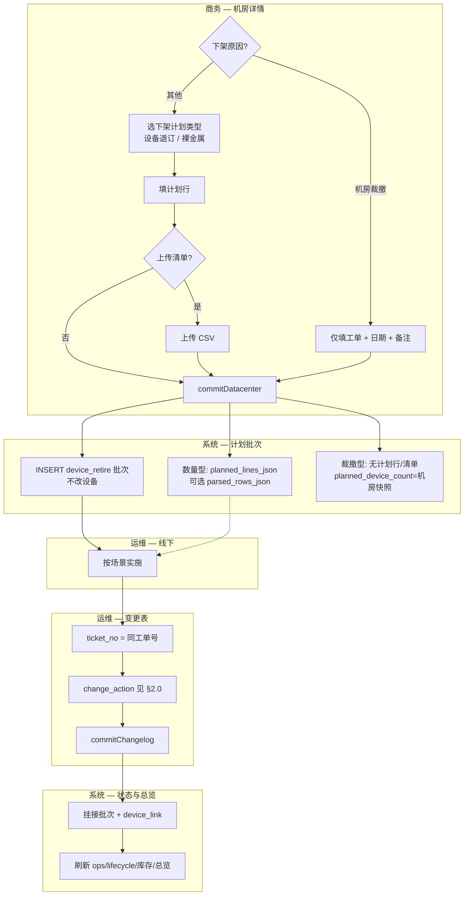

# 机房详情页 — 设备下架（计划 + 清单 + 变更表）设计方案

> 版本：**v2.3**  
> 日期：2026-05-23  
> 状态：**评审已全部确认，可实施** — UI/tRPC 骨架已落地，**业务闭环与变更表挂接尚未对齐**  
> 关联：[supplier-onboarding-plan-changelog-tracking-design.md](./supplier-onboarding-plan-changelog-tracking-design.md)（v2.4 批次↔变更表↔总览）、[supplier-device-import-schema.md](./supplier-device-import-schema.md)（变更动作字典）、[supplier-device-retire-design.md](./supplier-device-retire-design.md)（Legacy 供应商 Excel 下架，**方案 A 对齐 v2.0**）

---

## 1. 背景与定位

| 项 | 说明 |
|----|------|
| 入口 | 机房详情 `/supplier/datacenters/[id]` → **设备下架** |
| 弹窗 | `DatacenterDeviceRetireDialog` |
| 后端 | `supplier.deviceRetire.getDatacenterContext` / `previewDatacenter` / `commitDatacenter` |
| 批次 | `onboarding_batch`（`batch_kind=device_retire`） |
| **状态变更唯一入口** | 运维上传 **设备变更表** → `commitChangelog`（与上架对称，见 §4） |

### 1.1 核心原则（v2.0 修订）

1. **商务只下发工单/批次**：创建 `device_retire` 批次，填写飞书工单号；**不修改** `supplier_device` 状态。  
2. **三种业务场景**（见 §2.0）：**设备退订下架**、**裸金属下架**、**机房裁撤**——后两者与前者共用「计划 → 线下 → 变更表」闭环，但输入项不同。  
3. **清单是给运维的指引**（仅「设备退订 / 裸金属」数量型计划）：可选 CSV；**机房裁撤不需要清单**。  
4. **无清单的数量型计划**：计划行约束卡型×合作类型×数量；具体设备由运维决定，通过变更表回填。  
5. **运维线下实施 → 变更表驱动系统**：运维在变更表填 `ticket_no`（同工单号）与 `change_action`；`commitChangelog` 挂接批次、刷新设备态与资源总览。  
6. **与上架路径对称**：状态变更唯一入口均为 `commitChangelog`。

### 1.2 与上架的对称关系（目标态）

| 维度 | 设备上架 | 设备下架（含裁撤） |
|------|----------|-------------------|
| 商务计划批次 | `online` / `order_access` | `device_retire` |
| 计划行 | 卡型 + 合作类型 + 数量 | **数量型**场景必填；**机房裁撤**不需要 |
| 飞书工单 | `work_order_no`（supplier 内唯一） | 相同 |
| 可选附件 | 清单 CSV（非进度主路径） | **数量型**可选清单；**机房裁撤**不需要 |
| 计划 commit | **不改设备** | **不改设备** |
| 状态变更 | `commitChangelog` | `commitChangelog` |
| 典型变更动作 | `设备接收` → 上架类 → `加入集群` | `设备退订` / `下架裸金属` / `非常规下线` |
| 批次挂接 | 变更表 `ticket_no` → 上架批次 | 变更表 `ticket_no` → 下架批次 |
| 进度统计 | `onboarding_batch_device_link` + `refreshBatchProgress` | 同左（需扩展支持 `device_retire`） |
| 资源总览 | changelog 后重算 `supplier_gpu_inventory` + L2 聚合 | 同左 |

---

## 2. 端到端业务闭环

### 2.0 三种业务场景（必区分）

系统须正确区分以下三类，**共用**「商务建批次 → 运维线下 → 变更表推进」闭环，**差异在商务侧输入与变更动作期望**：

| 场景 | 识别方式 | 商务侧输入 | 清单 | 期望变更动作 | 业务含义 |
|------|----------|------------|------|--------------|----------|
| **A. 设备退订下架** | `retire_plan_mode=line_plan` 且 `retire_action_type=device_unsubscribe` | 计划行（卡型×合作类型×数量）+ 工单 | 可选 | `设备退订` / `非常规下线` | 指定数量的整机退订 |
| **B. 裸金属下架** | `retire_plan_mode=line_plan` 且 `retire_action_type=bare_metal_offboard` | 计划行 + 工单 | 可选 | `下架裸金属` | 指定数量退裸金属池，设备仍可调度 |
| **C. 机房裁撤** | `retire_plan_mode=datacenter_closure`（`retire_reason=dc_closure`） | **仅**工单、期望日期、备注 | **不需要** | `设备退订` / `非常规下线`（整机清退） | 整机房清退，不按卡型拆计划 |

**字段关系**：

- **`retire_reason`**（下架原因）：业务归因。选 **`dc_closure`（机房裁撤）** 时进入场景 C，**隐藏**计划行与上传清单。  
- **`retire_action_type`**（下架计划类型）：场景 A/B 由商务**显式选择**；场景 C **固定**为 `device_unsubscribe`（不可选裸金属）。  
- **`retire_plan_mode`**（派生或持久化）：`line_plan` | `datacenter_closure`，驱动校验与 UI。

```typescript
function resolveRetirePlanMode(meta: {
  reason: DeviceRetireReason
  retireActionType?: RetireActionType
}): 'line_plan' | 'datacenter_closure' {
  if (meta.reason === 'dc_closure') return 'datacenter_closure'
  return 'line_plan'
}
```

**UI 互斥规则**：

| 用户选择 | 计划行 | 上传清单 | 下架计划类型 |
|----------|--------|----------|--------------|
| 下架原因 ≠ 机房裁撤 | 必填（≥1 行） | 可选 | 必选：设备退订 **或** 裸金属下架 |
| 下架原因 = **机房裁撤** | **隐藏/不填** | **隐藏/禁用** | 固定为设备退订（只读提示） |

### 2.1 参与方与职责

| 角色 | 动作 | 系统边界 |
|------|------|----------|
| **商务** | 发起下架/裁撤批次：工单号、原因；**数量型**另填计划行与可选清单 | 写 `device_retire` 批次；写活动流 |
| **运维（线下）** | 按清单或自行选机实施物理/平台操作 | 系统外 |
| **运维（系统）** | 上传设备变更表 Excel | `commitChangelog`：挂批次、改状态、刷新库存与总览 |
| **运营/商务** | 查看下架任务详情、进度、资源总览 | 读模型 |

### 2.2 主流程

**闭环对三种场景相同**；商务侧分支如下。



### 2.2.1 路径细分

| 路径 | 触发 | 商务 commit 写入 |
|------|------|------------------|
| **A/B 数量型** | 原因 ≠ 机房裁撤 | `planned_lines_json`、`planned_device_count`、可选 `parsed_rows_json` |
| **C 裁撤型** | `reason=dc_closure` | `planned_lines_json=[]`；`retire_plan_mode=datacenter_closure`；`planned_device_count`=commit 时本机房**可下架设备快照总数**（作进度分母） |

### 2.3 有清单 vs 无清单（仅场景 A/B）

| | **有清单** | **无清单** |
|---|-----------|-----------|
| 商务意图 | 明确建议下架的具体设备（IP/SN 等） | 只约束数量，设备由运维决定 |
| commit 写入 | `parsed_rows_json` + `import_file_name` 等 | `list_upload_mode=none` |
| 是否改设备 | **否** | **否** |
| 批次详情展示 | Tab「建议下架设备」（来自 `parsed_rows_json`） | 仅展示计划行 |
| 运维变更表 | 应按清单设备填写（运维责任）；系统不强制逐行比对 | 在计划数量内任意选机 |
| 进度判定 | 变更表挂接数 vs `planned_device_count` | 同左 |

> **场景 C（机房裁撤）**：不适用本节；无清单、无计划行；进度见 §2.3.1。

#### 2.3.1 机房裁撤（场景 C）专项

| 项 | 规则 |
|----|------|
| 计划行 | **不需要**；`planned_lines_json` 为空数组 |
| 清单 | **不需要**；禁止 `uploadList=true` |
| 进度分母 | commit 时快照：`planned_device_count` = 本机房当前**可下架**设备总数（与 `getDatacenterContext.availability` 汇总一致） |
| 运维变更表 | 对本机房设备逐台（或批量）填 `设备退订` / `非常规下线` + 同工单号 |
| 自动结案 | 进度 link 数 ≥ `planned_device_count`（快照）→ `已完成` + `completion_mode=auto` |
| 批次标签 | UI 展示「机房裁撤」，与「设备退订」「裸金属下架」区分 |

### 2.4 场景与变更动作映射

| 场景 | 条件 | UI 标签 | 运维变更表 `change_action` | 默认 `ops` | 默认 `lifecycle` |
|------|------|---------|---------------------------|------------|------------------|
| **A. 设备退订下架** | `line_plan` + `device_unsubscribe` | 设备退订下架 | `设备退订` / `非常规下线` | `已退订` | `下线中` |
| **B. 裸金属下架** | `line_plan` + `bare_metal_offboard` | 裸金属下架 | `下架裸金属` | `预留闲置中` | `接入中` |
| **C. 机房裁撤** | `datacenter_closure`（`reason=dc_closure`） | 机房裁撤 | `设备退订` / `非常规下线` | `已退订` | `下线中` |

场景 A/C 均整机退订语义；场景 B 仅退裸金属池。映射细节见 [supplier-onboarding-plan-changelog-tracking-design.md §3.4.4](./supplier-onboarding-plan-changelog-tracking-design.md)。

### 2.5 批次状态机（目标态）

| `batch_status` | 含义 | 触发 |
|----------------|------|------|
| `待开始` | 计划已创建，尚无变更表挂接设备 | `commitDatacenter` |
| `下架中` | 已有部分设备经变更表挂接，未达计划数量 | 首次 `commitChangelog` 挂接 |
| `已完成` | **自动**：进度 link 数 ≥ `planned_device_count`（数量型=计划总数；裁撤型=机房快照，§2.3.1） | `refreshBatchProgress` |
| `已取消` | 计划作废 | 人工 |

**废止**：v1.x「含清单 commit → 直接 `已完成`」——清单不再触发即时完成。

#### 2.5.1 自动结案与排查标记（已确认）

当 `refreshBatchProgress` 判定进度 link 数 ≥ `planned_device_count` 时，**自动**将 `batch_status` 置为 `已完成`（无需人工点「结案」）。

同时写入 **`progress_flags_json`**（或等价 metadata），便于运营人工排查异常批次：

| 标记 | 字段示例 | 含义 | UI |
|------|----------|------|-----|
| 自动结案 | `completion_mode: 'auto'` | 由进度达标触发，非人工结案 | 批次详情展示「自动完成」 |
| 动作与计划不符 | `has_action_mismatch: true` | 存在 §3.7 / §12.2 所述不一致行（**策略 A**：仍写 link） | 黄色 Badge「动作不一致」 |
| 超额挂接 | `has_over_plan_link: true` | 挂接数 > `planned_device_count` | Badge「超额 N 台」 |
| 待人工复核 | `needs_review: true` | 上述任一异常为 true 时置位 | 列表/详情高亮「待复核」 |

> **范围**：不处理 v1.x 历史批次数据；新流程批次自 v2.1 实施起生效。

### 2.6 资源总览联动

变更表 commit 后链路（与上架共用基础设施）：

```
commitChangelog
  → supplier_device.ops_status / lifecycle_status（§3.4.4 动作映射）
  → onboarding_batch_device_link（business = device_retire 批次）
  → refreshBatchProgress（retiredDeviceCount / batch_status）
  → refreshSupplierGpuInventory（L1 机房×卡型库存）
  → supplier.overview.getStats（L2 KPI：在线 / 下线中 / 可售等）
```

「下线中」KPI：`lifecycle_status = '下线中'`（已关联进行中下架批次且 ops 为退订类，见主设计 §3.4.3）。

---

## 3. 变更表挂接规则（跨模块约定）

本节为 **device_retire 在变更表路径的增量**，完整规则见 [supplier-onboarding-plan-changelog-tracking-design.md §5.3](./supplier-onboarding-plan-changelog-tracking-design.md)。

### 3.1 工单解析

```typescript
// 目标：resolveBusinessBatchByTicketNo 扩展 batch_kind
inArray(onboardingBatch.batchKind, ['online', 'order_access', 'device_retire'])
```

| 输入 | 匹配字段 | 结果 |
|------|----------|------|
| 变更表 `ticket_no` | 下架批次 `work_order_no` 或 `batch_code`（`RET-*`） | 解析为 `device_retire` 业务批次 |

### 3.2 每行写入

| 字段 | 值 |
|------|-----|
| `supplier_device_change_log.onboarding_batch_id` | 本次 `device_changelog` 导入批次 ID |
| `supplier_device_change_log.business_onboarding_batch_id` | 解析到的 `device_retire` 批次 ID |
| `supplier_device_change_log.ticket_no` | 原文 |

### 3.3 设备挂接

当 `ticket_no` 命中下架批次且设备解析成功：

- **始终** `UPSERT onboarding_batch_device_link`（`business_onboarding_batch_id` = 下架批次），含 §3.7 动作不一致行（**策略 A**）  
- `link_kind`：按行内实际 `change_action` 区分——`retired`（`设备退订` / `非常规下线`）或 `touched`（`下架裸金属` 等）  
- 动作与 `retire_action_type` 不一致时：仍写 link，另记 warning + `has_action_mismatch` + `needs_review`（§2.5.1）  
- **不**写 `supplier_device.onboarding_batch_id`

### 3.4 变更表设备匹配增强

| 能力 | 规则 |
|------|------|
| 外网 IP | 支持 `IP:端口`（`endpointMatches`，与清单一致） |
| 内网 IP | 精确匹配（暂不支持端口） |
| 标识优先级 | 与主数据导入一致：设备 ID → 内网 IP → SN / asset |

### 3.5 批次详情读模型

| 数据 | 来源 |
|------|------|
| 计划行 | `planned_lines_json`（裁撤型为空） |
| **建议设备** | `parsed_rows_json`（**仅数量型且有清单**） |
| **已执行设备** | `onboarding_batch_device_link` + change_log |
| 进度 | link 数 vs `planned_device_count`（裁撤型=机房快照） |

### 3.6 警告文案

| 场景 | 提示 |
|------|------|
| 有工单号但未匹配任何业务批次 | 「变更表工单号未匹配到上架/订单接入/**下架**批次，仅写入变更审计」 |
| 匹配下架批次但动作与计划类型不符 | warning：「第 N 行：变更动作 `{实际}` 与下架计划类型 `{期望}` 不一致**；已挂接批次，请复核**」（**策略 A**） |
| 挂接数已达计划仍继续导入 | warning + `has_over_plan_link`；允许超额挂接并计入进度，自动结案时 `needs_review=true` |

### 3.7 动作一致性校验

变更表导入时，将行的 `change_action` 与下架批次 `retire_action_type` 比对：

| `retire_action_type` | 视为合规的 `change_action` |
|----------------------|---------------------------|
| `device_unsubscribe` | `设备退订`、`非常规下线` |
| `bare_metal_offboard` | `下架裸金属` |

**机房裁撤**（`retire_plan_mode=datacenter_closure`）：按 `device_unsubscribe` 校验；若行内为 `下架裸金属` 仍适用 **策略 A**（写 link + warning + `needs_review`）。

**策略 A（已确认）**：动作不一致时 **仍写** `device_link` 并计入进度；同时 warning + `has_action_mismatch`。  
无论动作是否一致，均写 `supplier_device_change_log` 并按行内动作刷新设备状态（审计不丢）。

---

## 4. tRPC API（目标行为）

| 过程 | 权限 | 说明 |
|------|------|------|
| `getDatacenterContext` | protected | 机房卡型 + 可下架数量（在线设备按卡型×合作类型 COUNT） |
| `previewDatacenter` | admin | 校验计划 + 可选解析清单（不写库） |
| `commitDatacenter` | admin | 重新校验后 **仅创建/更新计划批次**；**永不**直接改设备 |

### 4.1 请求体（增量）

```typescript
{
  dataCenterId: string
  meta: {
    reason: DeviceRetireReason           // 含 dc_closure → 机房裁撤
    retireActionType?: 'device_unsubscribe' | 'bare_metal_offboard'  // 裁撤时省略，服务端固定 device_unsubscribe
    expectedCompletionDate: string
    workOrderNo: string
    remark?: string
  }
  // reason !== 'dc_closure' 时必填且 ≥1 行；dc_closure 时必须为空数组
  planLines: Array<{
    gpuCardTypeCode: string
    gpuCardTypeId?: string
    cooperationType: DeviceCooperationType
    plannedQuantity: number
  }>
  // dc_closure 时必须 false；服务端拒绝 uploadList=true
  uploadList: boolean
  listFile?: { fileName: string; fileBase64: string }
}
```

**校验摘要**：

| 条件 | `planLines` | `uploadList` | `retireActionType` |
|------|-------------|--------------|-------------------|
| `reason !== 'dc_closure'` | 必填 | 可选 | 必填 |
| `reason === 'dc_closure'` | 必须 `[]` | 必须 `false` | 服务端写 `device_unsubscribe` |

### 4.2 commit 行为（v2.0 目标）

| 场景 | `batch_status` | 计划/清单 | 设备 | 库存 | change_log |
|------|----------------|-----------|------|------|------------|
| 数量型 · 仅计划 | `待开始` | 有 `planned_lines`；无清单 | **不变** | **不变** | **不写** |
| 数量型 · 含清单 | `待开始` | + `parsed_rows_json` | **不变** | **不变** | **不写** |
| **机房裁撤** | `待开始` | 无计划行、无清单；`planned_device_count`=机房快照 | **不变** | **不变** | **不写** |

清单 commit 额外写入：`parsed_rows_json`、`import_file_name`、`list_upload_mode=simplified_csv`（**仅数量型**）。

### 4.3 响应语义调整

| 字段 | v1.x | v2.0 |
|------|------|------|
| `retiredCount` | commit 即时下架台数 | **废止**或改为 `0`；改为 `plannedDeviceCount` + `listRowCount` |
| 完成页文案 | 「已下架 N 台」 | 「下架计划已创建，请运维通过变更表更新设备状态」 |

---

## 5. 下架清单 CSV（运维指引，**仅场景 A/B**）

> **机房裁撤**不出现清单步骤；本节不适用。

### 5.1 列定义

| 列 | 必填 | 说明 |
|----|------|------|
| 卡型 | ✓ | 须在计划内 |
| 合作类型 | ✓ | |
| 外网IP | △ | 支持 `IP:端口` |
| 内网IP | △ | 至少填一 |
| 设备ID / 设备标识 | | 辅助匹配 |

### 5.2 校验（preview / commit 共用）

- 设备存在于本机房、卡型/合作类型与行一致  
- 无重复行  
- 各 `(卡型, 合作类型)` 组合行数 **=** 计划数量（严格相等）  
- 匹配失败行：`parse_status=error`，**阻断 commit**（清单作为指引仍需可解析）

### 5.3 外网 IP：`IP:端口`

| 输入示例 | 匹配规则 |
|----------|----------|
| `203.0.113.11:8080` | 主机与库中 `203.0.113.11` 或带端口值均可匹配 |
| `[2001:db8::1]:443` | 取括号内 IPv6 主机比较 |
| 纯 IP | 不变 |

实现：`lib/supplier/ip-endpoint-utils.ts` → `endpointMatches()`。  
**变更表导入**需同步接入（当前仅清单/Legacy 下架校验已用）。

内网 IP 暂不支持端口；**外网与内网不能同时为空**。

---

## 6. 弹窗向导（UI 目标）

| 步骤 | 数量型（A/B） | 机房裁撤（C） |
|------|---------------|---------------|
| `meta` | 工单、下架原因、**下架计划类型**、期望日期、计划行；可勾选「上传清单」 | 工单、下架原因选 **机房裁撤** 后隐藏计划类型/计划行/清单；仅日期+备注 |
| `upload` | 勾选清单时出现 | **跳过** |
| `preview` | 计划 + 可选清单摘要 | 裁撤摘要：机房名、快照设备数、工单号 |
| `done` | 提示变更表动作（退订 **或** 裸金属） | 提示变更表用 `设备退订` + 同工单号；跳转下架任务详情 |

**原因联动**：`reason` 切到 `dc_closure` 时清空计划行、取消 `uploadList`；切回其他原因时恢复计划行 UI。

---

## 7. 数据模型增量

| 列 / 字段 | 说明 |
|-----------|------|
| `onboarding_batch.retire_plan_mode` | 新增：`line_plan` \| `datacenter_closure` |
| `onboarding_batch.retire_action_type` | `device_unsubscribe` \| `bare_metal_offboard`；裁撤固定 `device_unsubscribe` |
| `onboarding_batch.retire_reason` | 含 `dc_closure` 表示机房裁撤场景 |
| `onboarding_batch.planned_device_count` | 数量型=计划行合计；裁撤型=commit 时机房可下架快照 |
| `onboarding_batch.planned_lines_json` | 数量型必填；裁撤型 `[]` |
| `onboarding_batch.work_order_no` | 已有：与变更表 `ticket_no` 关联键 |
| `onboarding_batch.parsed_rows_json` | 建议设备清单（有清单时） |
| `onboarding_batch.retired_device_count` | 由 `refreshBatchProgress` 按 link + 动作类型写入，**非** commit 直写 |
| `onboarding_batch.progress_flags_json` | 自动结案与异常排查标记（§2.5.1） |

---

## 8. 代码映射（现状）

| 职责 | 路径 |
|------|------|
| IP 端点 | `lib/supplier/ip-endpoint-utils.ts` |
| 清单解析 | `lib/supplier/parse-datacenter-retire-list.ts` |
| 清单校验 | `lib/supplier/datacenter-retire-list-validation.ts` |
| 计划校验 | `lib/supplier/datacenter-retire-plan-validation.ts` |
| Data access | `lib/server/dataaccess/supplier/datacenter-device-retire.ts` |
| Schema | `lib/server/routers/supplier/datacenter-device-retire-schemas.ts` |
| 弹窗 | `supplier/_components/datacenter-device-retire-dialog.tsx` |
| 变更表 commit | `lib/server/dataaccess/supplier/device-import.ts` |
| 批次工单解析 | `lib/server/dataaccess/supplier/changelog-business-batch-link.ts` |
| 批次进度 | `lib/server/dataaccess/supplier/batch-progress.ts` |
| 下架批次详情 | `lib/server/dataaccess/supplier/device-retire.ts` |

---

## 9. 现状偏差（v1.x 已实施 vs v2.0 目标）

| # | 环节 | v2.0 目标 | v1.x 现状 | 风险 |
|---|------|-----------|-----------|------|
| G1 | `commitDatacenter`（含清单） | 只存档清单 | 直接 `lifecycle=已下线`、`ops=已退订`，写 change_log，`batch_status=已完成` | **绕过变更表审计**；与商务/运维分工不符 |
| G2 | `commitDatacenter`（仅计划） | 只建批次 | 基本符合 | 低 |
| G3 | `resolveBusinessBatchByTicketNo` | 含 `device_retire` | 仅 `online` / `order_access` | 变更表**无法挂接下架批次** |
| G4 | `commitChangelog` device_link | 写入下架批次 | 因 G3 失败，仅审计 | 下架任务进度永远为 0 |
| G5 | `getBatchById` 设备列表 | 来自 device_link | 来自 `onboardingBatchId=下架批次` 的 change_log | 仅 G1 路径有数据；主路径为空 |
| G6 | `change_action` | `设备退订` / `下架裸金属` | commit 直写 `下架`（字典无） | 动作不一致 |
| G7 | `lifecycle_status` | `下线中` / `接入中` | 直写 `已下线`（已废止） | 总览 KPI 口径错误 |
| G8 | `refreshBatchProgress` | 支持 `device_retire` | 仅上架批次 | 下架进度不刷新 |
| G9 | 变更表 IP 匹配 | `endpointMatches` | 内网/外网精确匹配 | `IP:端口` 可能匹配失败 |
| G10 | UI 完成页 | 提示走变更表 | 展示「已下架 N 台」 | 误导运维 |
| G11 | Legacy `device-retire.ts`（供应商 Excel） | **方案 A**：与 v2.0 对齐，只建计划+存清单 | 仍直改设备 | 双入口行为不一致 |

---

## 10. 整改方案

> **范围**：评审已全部确认（§12），按 §11 分阶段改代码。

### 10.1 后端 — 计划 commit 收口（P0）

**文件**：`datacenter-device-retire.ts`

1. 删除 `hasList` 分支内对 `supplier_device` 的 UPDATE、`entity_state_transition_log`、`supplier_device_change_log` 插入。  
2. 含清单时：仅更新批次 `parsed_rows_json`、`import_*` 字段；`batch_status` 保持 `待开始`（或 `下架中` 若产品定义创建即进行中）。  
3. `retiredDeviceCount` / `committedDeviceCount` 初始为 `0`；`committedAt` 在计划 commit 时为 `null`。  
4. 新增持久化 `retireActionType`、`retire_plan_mode`；`dc_closure` 时固定 action 并计算机房快照 `planned_device_count`。  
5. 活动流文案：数量型「下架计划已创建」；裁撤型「机房裁撤计划已创建」。

**文件**：`device-retire.ts`（Legacy，**已确认方案 A**）

- commit **只建批次 + 存 Excel 解析行**（`parsed_rows_json`），**不改** `supplier_device`、**不写** change_log。  
- 弹窗完成页与机房下架一致：提示运维通过变更表 + 同工单号推进。  
- 供应商详情入口 **保留**；行为与机房详情下架 v2.0 对齐（Legacy 无计划行时，以 Excel 行数作为 `planned_device_count` 或按文件行聚合，实现时与产品确认 Legacy 是否补计划行 UI）。

### 10.2 后端 — 变更表挂接下架批次（P0）

**文件**：`changelog-business-batch-link.ts`

- `resolveBusinessBatchByTicketNo`：`batch_kind` 增加 `'device_retire'`。  
- 可选：返回 `batchKind` 供 downstream 分支（进度公式、动作校验）。

**文件**：`device-import.ts`（`commitChangelog`）

- 解析到 `device_retire` 时：  
  - 写 `business_onboarding_batch_id`；  
  - UPSERT `onboarding_batch_device_link`；  
  - 调用扩展后的 `refreshBatchProgress`；  
  - 若批次 `retire_action_type` 与行 `change_action` 不匹配 → `bindWarnings` + `has_action_mismatch`，**仍 UPSERT device_link**（策略 A，§3.3）。  
- 更新 warning 文案（§3.6）。

**文件**：`device-import-utils.ts`

- `buildChangeLogsFromChangelogImport`：`link_kind` 按动作区分 `retired` / `touched`。  
- `findDeviceByImportKeys`：外网 IP 走 `endpointMatches`。  
- `resolveOpsStatusFromChangelogRow` / lifecycle：对齐 §3.4.4（`设备退订` → `下线中` + `已退订`）。

### 10.3 后端 — 进度与详情读模型（P0）

**文件**：`batch-progress.ts`

- 支持 `batch_kind=device_retire`：  
  - `retiredDeviceCount` = link 且 lifecycle=`下线中` 或 ops=`已退订` 的去重设备数（与计划类型 `device_unsubscribe` 对齐）；  
  - `touchedDeviceCount` = 全部 link 数；  
  - **进度 link 数**（计入自动结案）：凡已 UPSERT 的 `device_link` 均计入（含动作不一致行，策略 A）；存在不一致时 `has_action_mismatch` + `needs_review`。  
  - 进度 link 数 ≥ `planned_device_count` → **自动** `batch_status=已完成`，并写 `progress_flags_json`（§2.5.1）；超额挂接时 `has_over_plan_link` + `needs_review`。

**文件**：`device-retire.ts`（`getBatchById`）

- **已执行设备**：从 `onboarding_batch_device_link` + change_log 聚合。  
- **建议设备**：从 `parsed_rows_json` 只读 Tab（与 link 对比可展示「待执行/已执行」）。

### 10.4 前端（P1）

**文件**：`datacenter-device-retire-dialog.tsx`

- 增加「下架计划类型」（设备退订 / 裸金属；**机房裁撤时隐藏**）。  
- `reason=dc_closure` 时隐藏计划行、清单、upload 步骤。  
- `preview` / `done` 步骤：移除「即将变更设备状态」类 copy；完成页展示工单号与变更动作提示。  
- 成功跳转下架任务详情，展示「待运维变更表确认」状态。

**文件**：`device-retire-batch-detail-content.tsx`

- 双 Tab：数量型且有清单时 **建议下架设备** / **已执行设备**；裁撤型仅 **已执行设备**。  
- 展示场景标签 + `progress_flags_json` Badge（§2.5.1）。

### 10.5 文档与 Legacy 对齐（P1）

- 更新 [supplier-device-retire-design.md](./supplier-device-retire-design.md) §6.4 commit 行为，引用本文 v2.1（方案 A）。  
- 在主设计 [supplier-onboarding-plan-changelog-tracking-design.md](./supplier-onboarding-plan-changelog-tracking-design.md) §5 增补 **路径 F：设备下架计划 + 变更表**（可单独 PR）。

---

## 11. 实施计划

### 11.1 阶段划分

| 阶段 | 目标 | 交付物 | 依赖 |
|------|------|--------|------|
| **P0-a** | 计划 commit 不再改设备 | `datacenter-device-retire.ts` + 单测/手测用例 | — |
| **P0-b** | 变更表挂接 `device_retire` | `changelog-business-batch-link` + `device-import` + `device-import-utils` | P0-a |
| **P0-c** | 进度 + 批次详情读模型 | `batch-progress` + `device-retire.getBatchById` | P0-b |
| **P1-a** | UI/文案 + `retireActionType` | Dialog + 批次详情 + schema 迁移 | P0-c |
| **P1-b** | Legacy Excel 下架方案 A 对齐 | `device-retire.ts` + 供应商详情入口 | P0-a |

### 11.2 P0 验收用例（必须通过）

| # | 步骤 | 期望 |
|---|------|------|
| T1 | 数量型 · 仅计划 commit | 批次 `待开始`；设备不变 |
| T2 | 数量型 · 含清单 commit | `parsed_rows_json` 有值；设备不变 |
| T2c | **机房裁撤** commit | 无计划行/清单；`planned_device_count`=快照；设备不变 |
| T3 | 变更表 + 同工单 + `设备退订` | 设备 `ops=已退订`，`lifecycle=下线中`；device_link 存在 |
| T4 | 变更表 + `下架裸金属` | `ops=预留闲置中`，`lifecycle=接入中`；bare_metal binding 清除 |
| T5 | 变更表工单号错误 | warning；不写 device_link；仍写审计 log |
| T6 | 资源总览 | T3 commit 后 `下线中` / 在线 / 可售 KPI 变化符合 §2.6 |
| T7 | 外网 `IP:端口` 变更表 | 设备可匹配 |

### 11.3 P1 验收用例

| # | 步骤 | 期望 |
|---|------|------|
| T8 | 完成页 / 批次详情 | 展示建议动作与工单号指引 |
| T9 | 动作与计划类型不符 | **仍写 device_link**；warning + `has_action_mismatch` + `needs_review`；设备态按行内动作更新 |
| T9b | T9 且挂接数达计划 | 批次仍可**自动** `已完成`，但 `needs_review=true` |
| T10 | 挂接数 ≥ 计划数（动作均合规） | 批次**自动** `已完成`；`completion_mode=auto`；无异常则 `needs_review=false` |
| T11 | 超额挂接 | 仍可为 `已完成`（若≥计划），但 `has_over_plan_link` + `needs_review=true` |

### 11.4 风险与回滚

| 风险 | 缓解 |
|------|------|
| 运维习惯 v1.x「上传清单即下架」 | 发布说明 + 完成页明确「下一步：变更表」 |
| Legacy Excel 入口双轨 | P1-b 方案 A 与机房下架对齐 |

**回滚**：P0-a 可独立回滚（恢复直 commit 分支）；P0-b 与 P0-a 需一起回滚以避免「只建计划但变更表仍挂不上」的中间态。

---

## 12. 评审结论

### 12.1 已确认项

| # | 项 | 结论 |
|---|-----|------|
| 1 | 清单语义 | ✅ 清单仅为运维指引，commit **不改**设备状态 |
| 2 | 变更表为唯一状态入口 | ✅ 与上架一致 |
| 3 | `retireActionType` | ✅ 与原因分离；裁撤时固定 `device_unsubscribe`，见 §2.0 |
| 4 | Legacy 供应商 Excel 下架 | ✅ **方案 A**：与 v2.0 对齐，commit 只建批次+存清单，入口保留 |
| 5 | 批次完成 | ✅ **自动**结案（合规挂接数 ≥ 计划）；写 `progress_flags_json` 便于人工排查（§2.5.1） |
| 6 | 历史数据 | ✅ **不处理** v1.x 历史批次与设备态 |
| 7 | 动作与计划类型不一致 | ✅ **策略 A**（见 §12.2） |
| 8 | **机房裁撤** | ✅ 不需要计划行与清单；流程仍为变更表驱动；进度分母=机房快照 |

### 12.2 动作不一致处理（策略 A，已确认）

**规则**：变更表 `change_action` 与批次 `retire_action_type` 不一致时：

1. 写 `supplier_device_change_log`，设备态按**行内实际动作**更新（审计完整）。  
2. **仍** `UPSERT onboarding_batch_device_link`，该设备**计入**批次进度。  
3. 导入结果 warning + 批次 `progress_flags_json.has_action_mismatch=true`、`needs_review=true`。  
4. 若进度 link 数已达 `planned_device_count`，批次**仍自动** `已完成`，但 UI 展示「待复核 / 动作不一致」。

**示例**：计划 `device_unsubscribe` × 10 台，运维 10 行均填 `下架裸金属` → 10 link、自动完成、`needs_review=true`。

---

## 13. 变更记录

| 版本 | 日期 | 说明 |
|------|------|------|
| **v2.3** | 2026-05-23 | 区分设备退订/裸金属/机房裁撤；裁撤无需计划行与清单；`retire_plan_mode` |
| **v2.2** | 2026-05-23 | §12.2 策略 A；评审闭环 |
| **v2.1** | 2026-05-23 | 评审结论：方案 A Legacy、自动结案+排查标记、不迁历史；移除工时排期 |
| **v2.0** | 2026-05-23 | **业务闭环修订**：清单=运维指引；变更表驱动状态；整改方案与实施计划；废止含清单直 commit |
| v1.2 | 2026-05-23 | tRPC 落地；外网 IP:端口；库存重算（含清单直 commit，**已由 v2.0 废止**） |
| v1.1 | 2026-05-23 | 上传清单向导、飞书工单 |
| v1.0 | 2026-05-23 | 首版 Mock |
