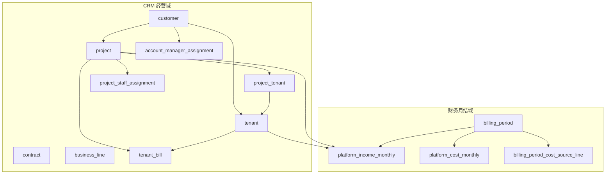
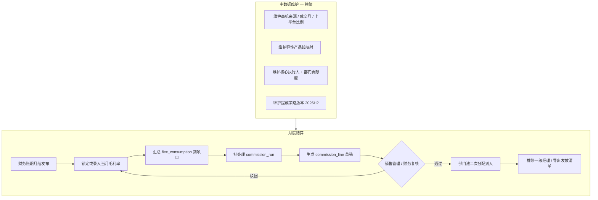

# 弹性算力类业务提成 — 实现方案（计算逻辑与流程）

> 版本：v1.3  
> 日期：2026-06-04  
> 状态：**设计稿 — 不涉及代码**（§10 已纳入 2026-06-04 业务确认；v1.3 明确与 `platform_cost_monthly` 边界）  
> 政策范围：通用类业务（按毛利）— 弹性算力类业务及衍生业务；执行期 **2026-05-01 ～ 2026-12-31**  
> 关联：  
>
> - `apps/web/content/design/crm-database.md`（§9 既有 AM 提成样例）  
> - `packages/db/src/crm-schema.ts`、`packages/db/src/finance-schema.ts`  
> - `apps/web/content/design/billing-period-import-design.md`（财务月结收入/成本）  
> - `apps/web/content/design/project-revenue-department-design.md`（项目部门归属）

---

## 1. 政策摘要（待实现口径）

### 1.1 适用业务


| 范围   | 说明                                                                       |
| ---- | ------------------------------------------------------------------------ |
| 平台成交 | 基于 `suanli.cn` 成交的业务                                                     |
| 衍生业务 | Token、数据交付等弹性算力衍生                                                        |
| 裸金属  | **当前实现**：账期导入的裸金属订单 **全部** 计入弹性算力消费（见 §10 Q9）；政策原文「≤1 月短租」待后续与导入字段对齐后再过滤 |
| 排除   | 一级部门经理；未覆盖事项由销售管理委员会个案确认                                                 |


### 1.2 计算公式

**政策书面口径：**

```
当月毛利基数 = 当月弹性算力消费金额 × 毛利率
提成金额     = 当月毛利基数 × 提点比例
```

**系统实现口径（§10 Q1、Q6 已确认）：**

```
当月毛利基数 B = 项目粒度毛利合计（单行公式与 platform_cost_monthly 一致，见 §2.5、§4.3.1）
提成金额       = B × 提点比例（中台见 §4.4，项目租户均视为上平台）
```

- **毛利单行公式**与财务成本 Tab 写入 `platform_cost_monthly` 的 `gross_profit` **相同**；**不修改** 该表及其 rollup 规则（AM×机房×卡型，见 §2.5）。
- **项目级 `B`** 在 **提成域** 按 `project_id` 汇总（读 `source_line` 或只读派生），与成本表「按客户经理汇总其所负责项目毛利」的 **展示粒度不同**。
- **毛利率**另表维护（§4.3.2、§7.3），用于校验、报表，可与 `B / flex_consumption` 对照。
- **提点**由 **商机来源** × **成交后月序** × **受益角色** 三维查表（见 §1.3）。
- §11 数值举例仍用「消费 10 万 × 毛利率 25% = 2.5 万」便于对照政策原文；**落库计算以 §4.3 的 `B` 为准**。

### 1.3 提点矩阵（政策表）

**商机来源**（三选一）：


| 编码（建议）            | 含义          |
| ----------------- | ----------- |
| `marketing_sales` | 市场 + 销售共同开发 |
| `sales_self`      | 销售自拓        |
| `exec_sales`      | 高管管理层 + 销售  |


**月序分段**（同一客户/项目锚定「成交月」后自动切换）：


| 分段                    | 自然月范围                      |
| --------------------- | -------------------------- |
| `months_1_6`          | 成交后第 1～6 个自然月（含成交当月为第 1 月） |
| `months_7_to_2026_12` | 第 7 个自然月起至 **2026-12-31**  |


**提点（占毛利基数的比例）**


| 商机来源  | 受益方                | months_1_6 | months_7_to_2026_12 |
| ----- | ------------------ | ---------- | ------------------- |
| 市场+销售 | 销售个人               | 10%        | 7%                  |
| 市场+销售 | 市场部门               | 3%         | 3%                  |
| 市场+销售 | 中台部门（**仅业务上平台部分**） | 3%         | 6%                  |
| 销售自拓  | 销售个人               | 15%        | 15%                 |
| 销售自拓  | 市场部门               | 0%         | 0%                  |
| 销售自拓  | 中台部门（业务上平台）        | 3%         | 6%                  |
| 高管+销售 | 销售个人               | 12%        | 9%                  |
| 高管+销售 | 市场部门               | 0%         | 0%                  |
| 高管+销售 | 中台部门（业务上平台）        | 3%         | 6%                  |


### 1.4 发放与分配


| 规则   | 说明                                                                            |
| ---- | ----------------------------------------------------------------------------- |
| 节奏   | 月度结算/审计通过后发放                                                                  |
| 个人   | 仅 **核心执行人员**；**一级部门经理**不参与本激励                                                 |
| 部门池  | 市场、中台部门提成为 **部门池**，须按部门内 **贡献度** 二次分配后再落到人                                    |
| 中台口径 | **已确认**：项目关联的全部 `tenant` 均视为 **业务上平台**（`P=100%`），中台提成按全额毛利基数 × 提点，不再单独维护上平台比例 |


### 1.5 数值样例

统一前提下的 **9 种组合**（3 种商机来源 × 2 个时间阶段 × 3 类受益方）及毛利率变化、月序切换、上平台比例拆分，见 **§11 全场景计算举例表**。

---

## 2. 现状：数据库与已实现逻辑

### 2.1 领域分层（与提成相关的表）




### 2.2 CRM 侧：与「谁开发、谁成交」相关的字段


| 表/字段                                                                   | 现状                               | 与本次政策的关系                            |
| ---------------------------------------------------------------------- | -------------------------------- | ----------------------------------- |
| `customer.sales_manager_id`                                            | 客户级销售经理 FK `user_staff`          | 最接近 **销售个人** 归属，但无「商机来源」            |
| `customer.conversion_date`                                             | 客户转正日期                           | 可作 **成交锚点** 候选，语义需与业务「成交月」对齐        |
| `project.stage`                                                        | `lead` / `testing` / `converted` | 现有 §9 提成按 stage 给 AM 比例，**与本次政策无关** |
| `project.business_line_id`                                             | 业务线                              | 可用于筛选「弹性算力类」项目，**字典需配置**            |
| `project_staff_assignment`                                             | 售前/AM/交付/PM，`role_type` + 生效区间   | 现有提成归 **AM**；本次政策归 **销售个人**，角色不同    |
| `project.revenue_department` + `project_revenue_department_assignment` | 收入归属部门（销售/中台等）                   | 与 **部门池** 有关，但不等于「市场部门提成池」          |
| `user_staff.department`                                                | 自由文本 + UI 枚举（含「销售」「中台」）          | **无「市场」**；无职级/是否一级经理标记              |
| `contract`                                                             | 商务合同，无商机来源、无提成策略 FK              | 不能直接驱动本次矩阵                          |


**结论**：CRM 主数据能支撑 **客户—项目—租户—销售经理** 链路，但 **缺少** 商机来源、成交月锚点、业务上平台比例、经理职级排除、提成策略版本等专用字段/表。

### 2.3 财务侧：消费与毛利相关数据


| 表/字段                                      | 含义                                    | 与「弹性算力消费」的关系                                                                                 |
| ----------------------------------------- | ------------------------------------- | -------------------------------------------------------------------------------------------- |
| `platform_income_monthly`                 | 账期 × 租户（× 项目）收入行                      | `balance_consumption`（余额消费）、`bare_metal_consumption`、`total_consumption`；**未单独拆「弹性 vs 衍生」列** |
| `billing_period_raw_customer_consumption` | 客户消费 Excel 原始行                        | 按类型汇总后进入收入 pipeline（Step I0）                                                                 |
| `billing_period_cost_source_line.kind`    | `flex`                                | `baremetal`                                                                                  |
| `platform_cost_monthly.gross_profit`      | 成本 rollup 后 **按客户经理×机房×卡型** 的毛利（§2.5） | 提成 **只读对齐公式**，**不** 改表；项目级 `B` 在提成域汇总（§4.3.1）                                                |
| `billing_period.status`                   | 至 `published` 方可视为月结定稿                | 适合作为 **「审计通过后发放」** 的门闩                                                                       |


| 数据源                                            | 粒度                | 优点                     | 缺点                           |
| ---------------------------------------------- | ----------------- | ---------------------- | ---------------------------- |
| 财务 `platform_income_monthly` + `kind=flex` 成本源 | 账期 × 项目 × 租户      | 与月结、发布状态一致；可拆 flex/裸金属 | 需账期 Excel 流程或单账期收入流程跑通       |
| CRM `tenant_bill` / `tenant_bill_detail`       | 租户 × `bill_month` | 贴近「已出账/已付」经营习惯（§9）     | 产品线字段未必与 flex 一一对应；与财务月结可能双轨 |
| 项目快照 `project.this_month_consumption`          | 项目 × 月            | 列表展示用                  | **非财务真值**，不宜单独作为提成结算依据       |


### 2.4 已实现逻辑（与本政策易混淆的部分）

`**crm-database.md` §9 — 客户经理（AM）提成样例**

- 基数：`tenant_bill.total_amount` 且 `status = paid`（确认收入）。
- 比例：按 `project.stage`（lead 0% / testing 1.5% / converted 3%）。
- 归属：`project_staff_assignment` 中 `account_manager`。

这是 **另一套** 按确认收入 × 阶段比例 的 AM 激励，**不** 使用毛利基数、商机来源、成交后 6 个月分段。文档已预留 `commission_policy` 表升级，**尚未落库**。

### 2.5 与 `platform_cost_monthly` 的边界（必读）

`platform_cost_monthly` 属于 **财务月结 / 成本 Tab** 既有能力，与本提成设计 **无功能耦合**——本设计 **不** 将其改造为提成子模块，也 **不** 修改其计算、写入、唯一键或 rollup 规则。


| 维度           | `platform_cost_monthly`（现网）                                                                             | 弹性算力提成（本设计）                                               |
| ------------ | ------------------------------------------------------------------------------------------------------- | --------------------------------------------------------- |
| **业务目的**     | 汇总 **各客户经理（AM）** 在其负责项目下带来的经营毛利，供成本页、对账、经营分析                                                            | 按 **经营项目** 计算销售/市场/中台提成                                   |
| **存储粒度**     | `type=record`：**AM × 机房 × 卡型**（+ sum / staff_sum 行）                                                     | `**project_id` × 结算月**（`commission_line`）                 |
| **pipeline** | `billing_period_cost_source_line` → 定价 → **rollup 写入本表**（见 `cost-compute-v3-redesign-with-examples.md`） | 账期发布后 **只读消费** 成本结果；提成 **独立** `commission_run`            |
| **本设计是否改表**  | —                                                                                                       | **否**：不增列、不改 `compute-cost` / `compute-cost-rollup`、不改 UK |


**毛利计算公式对齐（Q1）**：提成使用的单行毛利与成本 Tab 一致：

```
gross_profit = confirmed_revenue_excl_tax − sold_duration_cost_excl_tax − gifted_duration_cost_excl_tax
```

（`cost-row-utils.computeGrossProfit`，现网写入 `platform_cost_monthly.gross_profit`。）

**项目级毛利基数 `B` 的获取（只读、提成域）**：在 **不改动** `platform_cost_monthly` 的前提下，任选一种 **只读** 路径（实现择一）：

1. **推荐**：对已发布账期，按 `billing_period_cost_source_line.project_id` 复用 **同一套定价快照** 计算各行毛利后，**按项目 SUM** → 得到 `B(project)`（与 AM 表并行，粒度不同）。
2. **可选**：读取 `platform_cost_monthly` 的 `record` 行，经 `source_line_ids` 反查 `source_line.project_id`，将各行 `gross_profit` **分摊/归集** 到项目（只读 JOIN，**不** 回写成本表）。

无论路径 1 或 2，`B` 的 **数值口径** 与成本 pipeline 一致，仅 **聚合维度** 为项目而非 AM。

**毛利率表**（§4.3.2）归属 **提成域** 新表，与 `platform_cost_monthly` 无 schema 交叉。

---

## 3. 差距分析（Gap）


| #   | 能力        | 现状                                    | 需要补充                                                              |
| --- | --------- | ------------------------------------- | ----------------------------------------------------------------- |
| G1  | 商机来源      | 无字段                                   | 项目或客户级枚举 + 历史变更（生效日）                                              |
| G2  | 成交月锚点     | `conversion_date` 等语义模糊               | **已定**：首月有消费写入 `deal_closed_month`（§4.5）                          |
| G3  | 月序分段      | 无计算                                   | 由锚点 + 结算月推导 `months_1_6` / `months_7_to_2026_12`                  |
| G4  | 弹性算力消费额   | 部分具备                                  | **已定**：同账期收入 + **全部** 导入裸金属订单；Q8 产品线细分 **待定**                     |
| G5  | 毛利率表      | 无                                     | **已定**：`commission_gross_profit_rate` + 审计表；允许修改并重算               |
| G6  | 业务上平台比例   | 无                                     | **已定**：项目下 tenant 均视为上平台，`P=100%`，**不需** `platform_revenue_ratio` |
| G7  | 提点策略      | 仅文档常量                                 | `commission_policy` + `commission_policy_rate` 版本化                |
| G8  | 提成运行与明细   | 无                                     | `commission_run` / `commission_line` 可审计、可重算                      |
| G9  | 发放对象过滤    | 无职级                                   | `user_staff` 扩展或独立「提成资格」标记 + 一级经理名单                               |
| G10 | 部门二次分配    | 无                                     | 部门池 + 贡献度配置 + 到人分摊明细                                              |
| G11 | 市场部门      | 无「市场」枚举                               | **已定**：`STAFF_DEPARTMENTS` 等新增 **「市场」**                           |
| G12 | 与 AM 提成并存 | §9 逻辑独立                               | **待决**（§10.3）；策略码区分 `am_stage` vs `elastic_gross_profit`          |
| G13 | 项目级毛利 `B` | 现网仅有 AM×机房×卡型 `platform_cost_monthly` | 提成域按 `project_id` 只读汇总（§4.3.1）；**不改** 成本 rollup                   |
| G14 | 成交月       | 无规则                                   | **已定**：该项目 **首次出现消费的 natural month**（见 §4.5）                      |


---

## 4. 计算口径定义（实现前必须写死的规则）

### 4.1 结算主体与粒度

建议以 **经营项目 `project_id`** 为提成结算单元（与客户举例一致：同一客户不同项目可不同商机来源与成交月）。

- 消费金额：该项目在结算月关联的全部 `tenant_id` 集合（`primary_tenant_id` ∪ `project_tenant`，遵循 `crm-database.md` §1.1 R3.3）上的弹性算力消费 **之和**。
- 多项目共租户：须先按既有 **成本分成比例** 思路，将租户当月 flex 消费拆到项目（可复用财务多项目分成配置，无则 100% 归唯一项目）。

### 4.2 当月弹性算力消费金额 `flex_consumption`

**结算真值（§10 Q1）**：以 **已发布** 财务账期（`billing_period.status = published`，`period_code` = `settlement_month`）为准，**不** 以 CRM `tenant_bill` 已付金额为提成消费口径。

```
flex_consumption(project, settlement_month)
  = Σ platform_income_monthly.balance_consumption     -- 项目关联租户，同账期
  + Σ platform_income_monthly.bare_metal_consumption  -- 同左；当前全部裸金属订单计入（§10 Q9）
```

- 租户集合：`primary_tenant_id` ∪ `project_tenant`（§4.1）。
- 多项目共租户：按账期 **成本分成比例** 将消费拆到项目（与 `billing-period-import-design.md` G6 一致）。
- **成交月判定**（§10 Q4）依赖本指标：某自然月 `flex_consumption > 0` 即视为该项目在该月「有消费」。
- **Q8 待定**：Token、数据交付等产品线是否单独映射、是否从 `balance_consumption` 子集统计，待产品线编码清单确认后再收窄 `flex_consumption`；当前按收入行 **余额消费 + 裸金属消费** 全额汇总。

### 4.3 毛利基数与毛利率（公式对齐成本表 + 提成域汇总）

#### 4.3.1 毛利基数 `B`（公式对齐 `platform_cost_monthly`，项目粒度在提成域计算）

**前置**：账期须已完成成本 pipeline 并 **发布**（保证 `source_line` / `platform_cost_monthly` 与现网一致）；提成 run **不得** 早于发布，且 **不得** 触发成本重算逻辑变更。

**单行毛利**（与现网成本 Tab 写入 `platform_cost_monthly.gross_profit` 的算法一致，见 §2.5）：

```
gross_profit_line = confirmed_revenue_excl_tax
                  − sold_duration_cost_excl_tax
                  − gifted_duration_cost_excl_tax
```

**项目级基数 `B`**（提成域，**不写入、不修改** `platform_cost_monthly`）：

```
B(project, settlement_month)
  = Σ gross_profit_line
    OVER billing_period_cost_source_line sl
    WHERE sl.billing_period_id = 账期(settlement_month)
      AND sl.project_id = project_id
      AND sl.kind IN ('flex', 'baremetal')   -- 与 flex_consumption 对齐（§10 Q9）
    -- 每行 sl 经与 Step 4 相同的定价快照算出 gross_profit_line
```

- 上式在 **提成批处理** 或 `**commission_project_gross_profit` 快照表** 中落库，便于审计与重跑；**不** 改变 `platform_cost_monthly` 的 AM×机房×卡型 rollup。
- **可选只读校验**：将 `B(project)` 与经 `source_line_ids` 从 `platform_cost_monthly` **反查归集** 的结果对账，偏差超阈值则阻塞提成发布。
- 多项目共租户：与 §4.2 相同，按成本分成比例拆分 **source_line 级** 毛利再归集到项目。

**与 `platform_cost_monthly` 的关系**：该表继续服务 **「每个客户经理负责项目所带来的毛利汇总」**（按 AM 展示）；提成结算使用 **同一毛利公式** 在 **项目维度** 重聚合，二者 **数值可追溯、职责分离**。

**与政策公式等价关系**：当毛利率表 `R` 满足 `B ≈ flex_consumption × R` 时，与「消费×毛利率×提点」一致；**实现以提成域 `B` 为准**。

#### 4.3.2 毛利率表 `commission_gross_profit_rate`（§10 Q6）


| 要求  | 设计                                                                                                   |
| --- | ---------------------------------------------------------------------------------------------------- |
| 粒度  | 建议 `settlement_month`（YYYY-MM）+ 可选 `project_id`（NULL 表示全局默认）                                         |
| 可改  | 允许在账期发布后修改；修改后允许 **重跑** 当月 `commission_run`                                                          |
| 审计  | 每次 INSERT/UPDATE 写入 `commission_gross_profit_rate_audit`（改前值、改后值、`changed_by`、`changed_at`、`reason`） |
| 默认值 | 若未手工录入：`R_default = B / flex_consumption`（同项目同月，分母为 0 则不除）                                           |
| 用途  | ① 报表展示与政策对照；② 校验 `B` 与 `flex × R` 偏差；③ 成本未就绪时的 **暂估**（需明示「未发布成本」状态，建议默认禁止发放）                         |


### 4.4 各行提成

```
commission_line_amount
  = B × rate(opportunity_source, month_phase, recipient_role)   -- 销售、市场
  = B × P × rate(...)                                         -- 中台；已定 P = 100%
```


| `recipient_role`          | 系数                                              |
| ------------------------- | ----------------------------------------------- |
| `sales_individual`        | `B × 提点`                                        |
| `marketing_dept_pool`     | `B × 提点`（部门枚举 **市场**，§10 Q3）                    |
| `middle_office_dept_pool` | `B × 100% × 提点`（项目下 **全部 tenant** 视为上平台，§10 Q2） |


§11 中 `P=40%` 示例 **仅作政策推演**，**不再** 作为系统默认。

### 4.5 成交月序 `month_phase`

**成交锚定月 `deal_closed_month`（§10 Q4）**：项目 **历史上第一个存在消费的 natural month**。

```
deal_closed_month(project)
  = MIN(settlement_month)
    WHERE flex_consumption(project, settlement_month) > 0
    AND settlement_month 落在政策执行期内或之后首次消费月
```

- **写入**：首次满足条件时写入 `project.deal_closed_month`（或历史表），后续 **不** 因更早月份补录消费而自动前移（补录须走人工更正 + 审计）。
- **与** `customer.conversion_date`、合同 `signed_at` **脱钩**；仅认「账期消费事实」。

```
months_since_deal = monthDiff(settlement_month, deal_closed_month) + 1
```


| 条件                                                         | `month_phase`         |
| ---------------------------------------------------------- | --------------------- |
| `1 ≤ months_since_deal ≤ 6` 且 `settlement_month ≤ 2026-12` | `months_1_6`          |
| `months_since_deal ≥ 7` 且 `settlement_month ≤ 2026-12`     | `months_7_to_2026_12` |
| `settlement_month < 2026-05`                               | **不计**（政策执行期外）        |
| `settlement_month > 2026-12`                               | **停算**（待 2027 新政策）    |


同一客户在第 7 个月 **自动切换** 提点：仅更新 `month_phase`，商机来源不变。

### 4.6 销售个人归属（§10 Q5）

**已定**：销售个人提成归属 `**customer.sales_manager_id`**（FK `user_staff`）。

- 不按项目 AM（`account_manager`）发放本策略销售个人行。
- 客户换人：若未来 `customer.sales_manager_id` 支持生效历史，则按 `settlement_month` 分段；当前 schema 为单字段，以 **结算月末** 客户主数据为准。
- `sales_manager_id` 为空：该月销售个人行 **跳过** 并记入 `commission_run` 异常清单。

### 4.7 一级部门经理排除

结算前过滤：

```
eligible_staff = core_executors(project, settlement_month)
                 MINUS level_1_dept_managers
```

需在主数据增加 `**is_level_1_manager**` 或维护排除名单表；部门池二次分配时同样不得分给一级经理。

---

## 5. 核心业务逻辑（伪代码级，无实现代码）

### 5.1 单月单项目计算

```
function computeProjectCommission(projectId, settlementMonth):

  if not inPolicyWindow(settlementMonth): return empty

  oppSource = resolveOpportunitySource(projectId, settlementMonth)
  dealMonth = resolveDealClosedMonth(projectId)
  phase = resolveMonthPhase(dealMonth, settlementMonth)

  flexConsumption = loadFlexConsumption(projectId, settlementMonth)
  B = loadProjectGrossProfitBase(projectId, settlementMonth)  // 提成域按 project 汇总；不改 platform_cost_monthly
  gpr = loadGrossProfitRate(projectId, settlementMonth)  // 表 + 审计；校验 B ≈ flex × gpr

  platformRatio = 1.0   // 项目 tenant 均视为上平台（§10 Q2）

  lines = []

  for role in [sales_individual, marketing_dept_pool, middle_office_dept_pool]:
    rate = lookupPolicyRate(oppSource, phase, role)
    if rate == 0: continue
    factor = (role == middle_office) ? platformRatio : 1
    amount = B * factor * rate
    lines.append({ role, amount, rate, factor, base, flexConsumption, gpr })

  assignSalesIndividual(lines, customer.sales_manager_id)       // §10 Q5；过滤一级经理
  assignDeptPool(lines, marketing_dept_pool, ...)               // 进池
  assignDeptPool(lines, middle_office_dept_pool, ...)           // 进池

  return lines
```

### 5.2 部门池二次分配

```
function distributeDeptPool(poolAmount, dept, projectId, settlementMonth):

  weights = loadContributionWeights(dept, projectId, settlementMonth)
  // Σ weight = 1；仅 eligible_staff

  for each staff in weights:
    staffAmount = poolAmount * weight
    emitCommissionLine(staff, staffAmount, parent_pool_id)
```

贡献度来源（待产品选一或组合）：项目四人组权重、手工配置表、工时占比、历史约定比例。

### 5.3 账期批处理

```
function runCommissionForPeriod(settlementMonth):

  assert billing_period(settlementMonth).status == 'published'  // 或等价「审计通过」

  projects = listProjectsInScope(settlementMonth)  // 业务线 ∈ 弹性算力类

  run = createCommissionRun(settlementMonth, policy_version)

  for project in projects:
    lines = computeProjectCommission(project.id, settlementMonth)
    persist(run, project, lines)

  run.status = 'calculated' → 人工复核 → 'approved' → 导出发放
```

---

## 6. 端到端流程




| 阶段  | 责任         | 输入                          | 输出                |
| --- | ---------- | --------------------------- | ----------------- |
| 主数据 | 销售运营 / CRM | 项目、客户、人员                    | 商机来源、成交月、执行人、贡献度  |
| 月结  | 财务         | 已发布 `billing_period`、收入/成本表 | 项目级 flex 消费（可追溯）  |
| 参数  | 财务 / 管委会   | 毛利率、策略版本                    | 当月锁定参数快照          |
| 计算  | 系统         | §5 逻辑                       | `commission_line` |
| 复核  | 销售管理       | 明细、样例抽检                     | `approved`        |
| 分配  | 部门负责人      | 部门池规则                       | 到人明细              |
| 发放  | HR/财务      | 银行/工资系统                     | 外部流程              |


---

## 7. 建议数据模型扩展（逻辑表）

> 仅列 **提成域** 新增/扩展；物理表名可合并 schema。

### 7.1 策略与费率


| 表                        | 用途                                                                        |
| ------------------------ | ------------------------------------------------------------------------- |
| `commission_policy`      | 策略头：`code`（如 `elastic_gross_2026h2`）、`effective_from/to`、`business_scope` |
| `commission_policy_rate` | 三维费率：`opportunity_source`、`month_phase`、`recipient_role`、`rate`           |


### 7.2 项目归因


| 表/字段                                                                   | 用途                              |
| ---------------------------------------------------------------------- | ------------------------------- |
| `project.opportunity_source` 或 `project_opportunity_source_assignment` | 商机来源 + 生效区间                     |
| `project.deal_closed_month`                                            | 成交锚点 YYYY-MM；**首月有消费** 写入（§4.5） |
| ~~`project.platform_revenue_ratio`~~                                   | **不需要**（tenant 均视为上平台）          |
| `commission_product_line_map`                                          | **待定（Q8）**；当前不按产品线子集过滤          |


### 7.3 月度参数与运行


| 表                                     | 用途                                                                                                             |
| ------------------------------------- | -------------------------------------------------------------------------------------------------------------- |
| `commission_gross_profit_rate`        | `settlement_month` + 可选 `project_id` + `rate`；可改、可重算                                                           |
| `commission_gross_profit_rate_audit`  | 毛利率变更审计（前后值、操作人、时间、原因）                                                                                         |
| `commission_run`                      | 批处理头：`settlement_month`、`policy_id`、`billing_period_id`、`status`                                               |
| `commission_line`                     | 明细：`project_id`、`recipient_type`（staff/dept_pool）、`amount`、费率快照、`flex_consumption`、`gross_profit_base`（即 `B`）等 |
| `commission_project_gross_profit`（可选） | 账期×项目 `B` 快照；自 `source_line` 算出，**不** 写回 `platform_cost_monthly`                                               |
| `commission_dept_distribution`        | 部门池 → 员工权重与金额                                                                                                  |


### 7.4 人员资格


| 表/字段                                                     | 用途                 |
| -------------------------------------------------------- | ------------------ |
| `user_staff.is_level_1_manager` 或 `commission_exclusion` | 一级经理排除             |
| `project_commission_participant`                         | 核心执行人名单（可选，与四人组解耦） |


### 7.5 与现有表关系

- `commission_run.billing_period_id` → `billing_period.id`（保证 **先发布后算提成**）。
- `commission_line.project_id` → `project.id`；`staff_id` → `user_staff.id`。
- `**platform_cost_monthly`**：**只读引用 / 公式对齐**（§2.5）。**禁止** 为本提成修改：表结构、`compute-cost` / `compute-cost-rollup`、record 唯一键（`billing_period_id + staff_id + data_center_id + gpu_card_type_id`）、AM 汇总语义。
- 提成结果 **仅** 写入提成域表（`commission_run`、`commission_line` 等），与 `project-revenue-department-design.md` C2（成本表不按部门拆 UK）**无冲突**。

---

## 8. 与现有 AM 提成（§9）的并存策略


| 维度  | AM 阶段提成（§9）                       | 弹性算力毛利提成（本文）             |
| --- | --------------------------------- | ------------------------ |
| 策略码 | `am_stage`（建议）                    | `elastic_gross_2026h2`   |
| 基数  | 确认收入（`tenant_bill` paid）          | 项目级毛利 `B`（公式同成本表，§4.3.1） |
| 归属  | 项目 AM                             | 销售个人 + 市场/中台部门池          |
| 比例  | stage 1.5%/3%                     | 商机来源 × 月序 × 角色矩阵         |
| 运行  | 可同一 `commission_run` 多策略并行，或分 run |                          |


同一项目同一月份 **是否可同时发放** 见 **§10.3（Q7 待决）**；系统侧建议分策略、分栏展示，制度确认前 **默认不自动合并发放**。

---

## 9. 分期实施建议


| 阶段            | 内容                                                                      | 依赖              |
| ------------- | ----------------------------------------------------------------------- | --------------- |
| **P0 口径冻结**   | §10 已确认项落库规格；**待决** Q7/Q8 书面结论                                          | Q7/Q8           |
| **P1 主数据**    | 商机来源、首消成交月、`STAFF_DEPARTMENTS` 增「市场」、经理排除、策略表                           | CRM + 员工枚举      |
| **P1b 毛利率**   | `commission_gross_profit_rate` + audit 表及维护 UI                          | P1              |
| **P2 消费与毛利**  | 账期发布后项目级 `flex_consumption` + 提成域 `B`（`source_line` 定价汇总，只读成本 pipeline） | 财务 pipeline 已发布 |
| **P3 计算引擎**   | `commission_run` + 项目级 line + 费率快照                                      | P1+P2           |
| **P4 部门二次分配** | 贡献度配置 + 池到人                                                             | P3              |
| **P5 报表与审批**  | 复核页、导出、与 §9 AM 提成并列展示                                                   | P3/P4           |


---

## 10. 业务确认结论（2026-06-04）

### 10.1 已确认项


| #      | 结论                                                                                                                                                                      | 设计落点             |
| ------ | ----------------------------------------------------------------------------------------------------------------------------------------------------------------------- | ---------------- |
| **Q1** | 毛利 **单行公式** 与 `platform_cost_monthly` 一致；**不修改** 该表及 AM×机房×卡型 rollup；项目级 `B` 在提成域按 `source_line.project_id` 汇总；消费侧用已发布账期 `platform_income_monthly`，**不用** `tenant_bill` | §2.5、§4.2、§4.3.1 |
| **Q2** | 项目关联的 **全部 `tenant` 均视为中台「业务上平台」**，`P = 100%`，不按比例拆分                                                                                                                    | §1.4、§4.4        |
| **Q3** | 员工/项目部门枚举 **新增「市场」**（扩展 `STAFF_DEPARTMENTS`、`staffDepartmentSchema`）                                                                                                    | §4.4、P1          |
| **Q4** | **成交月** = 该项目 **第一个有消费的自然月**（`flex_consumption > 0` 的最早 `settlement_month`）                                                                                             | §4.5             |
| **Q5** | **销售个人** = `customer.sales_manager_id`                                                                                                                                  | §4.6             |
| **Q6** | **新建毛利率表**，按 **月**（+ 可选项目）保存；**允许修改**；变更须 **审计记录**；修改后可重跑提成                                                                                                             | §4.3.2、§7.3      |
| **Q9** | **当前** 账期导入的 **全部裸金属订单** 均计入弹性算力消费（与 flex 余额消费一并进入 `flex_consumption` 及成本源 `baremetal`）                                                                                 | §4.2、§1.1        |


### 10.2 待确认项


| #      | 状态     | 说明                                                                            |
| ------ | ------ | ----------------------------------------------------------------------------- |
| **Q7** | **待决** | 与 §9 AM 提成是否可 **叠加发放** — 见 §10.3，需制度确认后写入 `commission_policy` 互斥规则            |
| **Q8** | **待定** | Token、数据交付等产品线 **编码清单** 及是否从 `flex_consumption` 中单独拆分子集 — 确认前按 §4.2 **全额** 汇总 |


### 10.3 Q7 说明：与 AM 提成（`crm-database.md` §9）的关系

两套激励 **并行存在于制度与数据模型**，但口径不同，发放前须由销售管理委员会裁定是否 **同一人、同一项目、同一月份** 可各拿一份。


| 维度    | AM 阶段提成（§9）                                    | 弹性算力毛利提成（本文）                                      |
| ----- | ---------------------------------------------- | ------------------------------------------------- |
| 策略    | 按 `project.stage`（testing 1.5% / converted 3%） | 按商机来源 × 成交后月序 × 角色矩阵                              |
| 基数    | `tenant_bill` **已付** 确认收入                      | 项目级毛利 `**B`**（公式对齐成本表，不改 `platform_cost_monthly`） |
| 销售侧归属 | 项目 **客户经理**（`account_manager`）                 | 客户 **销售经理**（`sales_manager_id`）                   |
| 部门    | 无市场/中台部门池                                      | 市场、中台 **部门池** + 二次分配                              |
| 数据依赖  | CRM 账单回款                                       | 账期 **发布** 后的收入 + 成本月结                             |


**叠加风险**：同一客户若 AM 与 `sales_manager` 为同一人，或制度允许双轨，可能出现 **同一项目月收入被两套规则各计一次**（基数定义不同，金额不可直接相加比较）。

**系统建议（待 Q7 裁定）**：


| 选项      | 含义                                    |
| ------- | ------------------------------------- |
| A. 允许叠加 | 分策略独立 `commission_run`，报表分栏；发放由 HR 合并 |
| B. 互斥择高 | 同人同项目同月只发较高者（需定义比较口径）                 |
| C. 互斥择一 | 项目或客户级配置默认策略                          |
| D. 分段互斥 | 例：`stage=converted` 前只发 AM，之后只发弹性毛利   |


**在 Q7 未决前**：实现上 **不** 做自动去重；`commission_line.policy_code` 区分 `am_stage` 与 `elastic_gross_2026h2`；发放导出需人工或二次审批。

### 10.4 Q8 待定说明

- **现状**：`flex_consumption` = 项目租户在账期内 `balance_consumption + bare_metal_consumption`（`platform_income_monthly`），**不** 按 `tenant_bill_detail.product_line` 过滤。
- **待定后可能**：增加 `commission_product_line_map`，仅统计映射为「弹性算力 / Token / 数据交付」的行；裸金属是否仍 **全量** 计入需与 Q9 政策原文一并复核。
- **影响**：Q8 确认前，提成消费面 **偏宽**；毛利 `B` 已通过成本源 `kind` 与收入侧对齐，但产品线级精细拆分仍缺。

### 10.5 主数据变更摘要（实现 checklist，仍不写代码）


| 项                                             | 变更                                                                                 |
| --------------------------------------------- | ---------------------------------------------------------------------------------- |
| `STAFF_DEPARTMENTS` / `staffDepartmentSchema` | 增加 `**市场`**                                                                        |
| 提成域新表                                         | `commission_gross_profit_rate`、`commission_gross_profit_rate_audit`、…              |
| `project`                                     | `opportunity_source`、`deal_closed_month`（首消月写入）                                    |
| 计算前置                                          | `billing_period` **published** + 成本/收入已算（**不** 改 `platform_cost_monthly` pipeline） |
| 边界                                            | 提成 **禁止** 修改 `platform_cost_monthly` 及其 rollup（§2.5）                               |


---

## 11. 全场景计算举例表

本节在 **同一套基础数据** 下，列出每种商机来源、每个时间阶段、每一类受益方的 **计算公式** 与 **金额（元）**。金额保留整数展示（与政策举例一致）；实现层用 `decimal(15,4)` 计算后再四舍五入到分。

> **与 §10 的关系**：下表 `**B = 25,000`** 在教学中等价于「消费 10 万 × 毛利率 25%」。**系统实现（Q1）** 在提成域按项目汇总 `**B`**（毛利公式与 `platform_cost_monthly` 单行一致，不改动 成本表 rollup），§4.3.2 毛利率表做校验；中台 `**P = 100%`**（Q2）。

### 11.1 统一前提（基准月）


| 参数         | 符号  | 取值                      | 说明                      |
| ---------- | --- | ----------------------- | ----------------------- |
| 当月弹性算力消费金额 | `C` | **100,000**             | 项目关联租户当月计入政策的 flex 消费合计 |
| 毛利率        | `R` | **25%**（0.25）           | 当月审批锁定，可变               |
| 业务上平台占消费比例 | `P` | **100%**（1.0）           | §10 Q2：项目 tenant 均视为上平台 |
| 成交锚定月      | —   | **2026-05**             | 仅用于 §11.4 月序切换示例        |
| 政策执行期      | —   | 2026-05-01 ～ 2026-12-31 | 结算月须落在此区间内              |


**派生量：**


| 派生量    | 公式            | 基准月计算                        |
| ------ | ------------- | ---------------------------- |
| 当月毛利基数 | `B = C × R`   | `100,000 × 25% =` **25,000** |
| 中台有效基数 | `B_m = B × P` | `25,000 × 100% =` **25,000** |


**各类受益方通用公式：**


| 受益方            | 提成公式                                       | 说明                 |
| -------------- | ------------------------------------------ | ------------------ |
| 销售个人           | `提成 = B × 提点_sales`                        | 提点查 §1.3           |
| 市场部门（部门池）      | `提成 = B × 提点_marketing`                    | 提点为 0 时不产生池        |
| 中台部门（部门池，仅上平台） | `提成 = B_m × 提点_middle = B × P × 提点_middle` | `P<1` 时中台低于销售/市场口径 |


---

### 11.2 主表：三商机来源 × 两时间阶段（`C=100,000`，`R=25%`，`P=100%`）

下表每一格：**公式 → 金额**。`B = 25,000`。

#### 11.2.1 市场 + 销售（`marketing_sales`）


| 结算阶段          | 成交后月序    | 受益方     | 提点  | 计算公式                 | 提成金额（元）   |
| ------------- | -------- | ------- | --- | -------------------- | --------- |
| 成交 1～6 月      | 第 1～6 月  | 销售个人    | 10% | `25,000 × 10%`       | **2,500** |
| 成交 1～6 月      | 第 1～6 月  | 市场部门    | 3%  | `25,000 × 3%`        | **750**   |
| 成交 1～6 月      | 第 1～6 月  | 中台（上平台） | 3%  | `25,000 × 100% × 3%` | **750**   |
| 第 7 月～2026.12 | 第 7 月及以后 | 销售个人    | 7%  | `25,000 × 7%`        | **1,750** |
| 第 7 月～2026.12 | 第 7 月及以后 | 市场部门    | 3%  | `25,000 × 3%`        | **750**   |
| 第 7 月～2026.12 | 第 7 月及以后 | 中台（上平台） | 6%  | `25,000 × 100% × 6%` | **1,500** |


**同月三方合计（部门池尚未二次分配）：**


| 阶段       | 销售 + 市场 + 中台                    |
| -------- | ------------------------------- |
| 1～6 月    | 2,500 + 750 + 750 = **4,000**   |
| 7 月～12 月 | 1,750 + 750 + 1,500 = **4,000** |


> 说明：本政策下该商机来源两阶段 **总提点之和** 均为 16%（1～6 月：10%+3%+3%；7 月后：7%+3%+6%），故在 `B` 不变时两阶段提成总额相同，但 **销售与中台之间结构** 随月份变化。

#### 11.2.2 销售自拓（`sales_self`）


| 结算阶段          | 受益方     | 提点  | 计算公式                 | 提成金额（元）   |
| ------------- | ------- | --- | -------------------- | --------- |
| 成交 1～6 月      | 销售个人    | 15% | `25,000 × 15%`       | **3,750** |
| 成交 1～6 月      | 市场部门    | 0%  | `25,000 × 0%`        | **0**     |
| 成交 1～6 月      | 中台（上平台） | 3%  | `25,000 × 100% × 3%` | **750**   |
| 第 7 月～2026.12 | 销售个人    | 15% | `25,000 × 15%`       | **3,750** |
| 第 7 月～2026.12 | 市场部门    | 0%  | `25,000 × 0%`        | **0**     |
| 第 7 月～2026.12 | 中台（上平台） | 6%  | `25,000 × 100% × 6%` | **1,500** |


| 阶段       | 三方合计                          |
| -------- | ----------------------------- |
| 1～6 月    | 3,750 + 0 + 750 = **4,500**   |
| 7 月～12 月 | 3,750 + 0 + 1,500 = **5,250** |


#### 11.2.3 高管管理层 + 销售（`exec_sales`）


| 结算阶段          | 受益方     | 提点  | 计算公式                 | 提成金额（元）   |
| ------------- | ------- | --- | -------------------- | --------- |
| 成交 1～6 月      | 销售个人    | 12% | `25,000 × 12%`       | **3,000** |
| 成交 1～6 月      | 市场部门    | 0%  | `25,000 × 0%`        | **0**     |
| 成交 1～6 月      | 中台（上平台） | 3%  | `25,000 × 100% × 3%` | **750**   |
| 第 7 月～2026.12 | 销售个人    | 9%  | `25,000 × 9%`        | **2,250** |
| 第 7 月～2026.12 | 市场部门    | 0%  | `25,000 × 0%`        | **0**     |
| 第 7 月～2026.12 | 中台（上平台） | 6%  | `25,000 × 100% × 6%` | **1,500** |


| 阶段       | 三方合计                          |
| -------- | ----------------------------- |
| 1～6 月    | 3,000 + 0 + 750 = **3,750**   |
| 7 月～12 月 | 2,250 + 0 + 1,500 = **3,750** |


---

### 11.3 速查对照表（仅金额，单位：元）

便于横向对比；前提同 §11.1（`B=25,000`，`P=100%`）。


| 场景编号 | 商机来源  | 阶段       | 销售个人  | 市场部门 | 中台（上平台） | 当月合计  |
| ---- | ----- | -------- | ----- | ---- | ------- | ----- |
| S1   | 市场+销售 | 1～6 月    | 2,500 | 750  | 750     | 4,000 |
| S2   | 市场+销售 | 7 月～12 月 | 1,750 | 750  | 1,500   | 4,000 |
| S3   | 销售自拓  | 1～6 月    | 3,750 | 0    | 750     | 4,500 |
| S4   | 销售自拓  | 7 月～12 月 | 3,750 | 0    | 1,500   | 5,250 |
| S5   | 高管+销售 | 1～6 月    | 3,000 | 0    | 750     | 3,750 |
| S6   | 高管+销售 | 7 月～12 月 | 2,250 | 0    | 1,500   | 3,750 |


对应用户最初三个举例：**S1、S3、S5**（均为成交 1～6 月阶段）。

---

### 11.4 毛利率变化举例（场景 S1：市场+销售，1～6 月）


| 毛利率 `R` | 毛利基数 `B = C × R` | 销售 `B×10%` | 市场 `B×3%` | 中台 `B×3%` |
| ------- | ---------------- | ---------- | --------- | --------- |
| 25%     | 25,000           | 2,500      | 750       | 750       |
| **30%** | **30,000**       | **3,000**  | **900**   | **900**   |
| 20%     | 20,000           | 2,000      | 600       | 600       |


**缩放规则：** 在 `C`、`P`、提点不变时，各角色提成 = 原金额 × `(新 R / 原 R)`。  
例：30% 相对 25% → 各角色 × `30/25 = 1.2`。

---

### 11.5 业务上平台比例 `P`（政策推演 vs 系统默认）


| 口径               | `P`      | 中台提成（S1，1～6 月，提点 3%）      |
| ---------------- | -------- | ------------------------- |
| **系统默认（§10 Q2）** | **100%** | `25,000 × 3% =` **750**   |
| 政策推演（已废弃为默认）     | 40%      | `25,000 × 40% × 3% =` 300 |


项目下全部 `tenant` 视为上平台后，**仅保留第一行** 作为实现口径。

---

### 11.6 成交月序自动切换举例（同一项目，消费不变）


| 项目参数             | 取值                               |
| ---------------- | -------------------------------- |
| 成交锚定月            | 2026-05（第 1 月）                   |
| 商机来源             | 市场+销售                            |
| 当月消费 `C`、毛利率 `R` | 每月均为 100,000、25% → 每月 `B=25,000` |


| 结算月         | 成交后第 N 月 | 适用阶段         | 销售个人      | 市场  | 中台        | 计算说明                 |
| ----------- | -------- | ------------ | --------- | --- | --------- | -------------------- |
| 2026-05     | 1        | 1～6 月        | 2,500     | 750 | 750       | 提点 10% / 3% / 3%     |
| 2026-10     | 6        | 1～6 月        | 2,500     | 750 | 750       | 仍为第 6 月，规则不变         |
| **2026-11** | **7**    | **7 月～12 月** | **1,750** | 750 | **1,500** | **自动切换**：销售 7%、中台 6% |
| 2026-12     | 8        | 7 月～12 月     | 1,750     | 750 | 1,500     | 同第 7 月规则             |


**切换前后单月差额（销售个人）：** `2,500 − 1,750 = 750`（因销售提点由 10% 降为 7%，基数不变）。

---

### 11.7 部门池二次分配举例（场景 S1，市场部门池 750 元）

部门池金额来自 §11.2.1，**一级部门经理不参与**；以下为池内 **假设** 贡献度。


| 员工      | 贡献度  | 公式          | 分到金额（元） |
| ------- | ---- | ----------- | ------- |
| 市场专员 A  | 60%  | `750 × 60%` | 450     |
| 市场专员 B  | 40%  | `750 × 40%` | 300     |
| 一级市场部经理 | —    | 排除          | 0       |
| **合计**  | 100% |             | **750** |


中台部门池 **750 元**（1～6 月）可按同样方式拆分；销售个人 **2,500 元** 为单人直达，不经过部门池（除非项目配置多人分成，属扩展规则）。

---

### 11.8 公式与场景编号索引


| 场景编号 | 商机来源  | 阶段     | 销售公式    | 市场公式   | 中台公式     |
| ---- | ----- | ------ | ------- | ------ | -------- |
| S1   | 市场+销售 | 1～6 月  | `B×10%` | `B×3%` | `B×P×3%` |
| S2   | 市场+销售 | 7～12 月 | `B×7%`  | `B×3%` | `B×P×6%` |
| S3   | 销售自拓  | 1～6 月  | `B×15%` | `B×0%` | `B×P×3%` |
| S4   | 销售自拓  | 7～12 月 | `B×15%` | `B×0%` | `B×P×6%` |
| S5   | 高管+销售 | 1～6 月  | `B×12%` | `B×0%` | `B×P×3%` |
| S6   | 高管+销售 | 7～12 月 | `B×9%`  | `B×0%` | `B×P×6%` |


其中 **教学式 `B = C × R`**；**实现式 `B` = 提成域按 `project_id` 汇总之毛利**（公式对齐 `platform_cost_monthly`，§4.3.1、§2.5）。中台 `**P = 1`**（§10 Q2）。

---

## 12. 附录：政策查表速查（实现配置种子）

```text
policy_version: elastic_gross_2026h2
effective: 2026-05-01 .. 2026-12-31

rates[marketing_sales][months_1_6]       = { sales: 0.10, marketing: 0.03, middle_office: 0.03 }
rates[marketing_sales][months_7_to_2026_12] = { sales: 0.07, marketing: 0.03, middle_office: 0.06 }
rates[sales_self][months_1_6]            = { sales: 0.15, marketing: 0.00, middle_office: 0.03 }
rates[sales_self][months_7_to_2026_12]   = { sales: 0.15, marketing: 0.00, middle_office: 0.06 }
rates[exec_sales][months_1_6]            = { sales: 0.12, marketing: 0.00, middle_office: 0.03 }
rates[exec_sales][months_7_to_2026_12]   = { sales: 0.09, marketing: 0.00, middle_office: 0.06 }
```

---

**文档结束。** §10 已确认项可进入 §7 表结构设计与 §5 批处理细化；**Q7、Q8** 结论后更新互斥规则与 `flex_consumption` 边界。本文不包含任何应用代码。