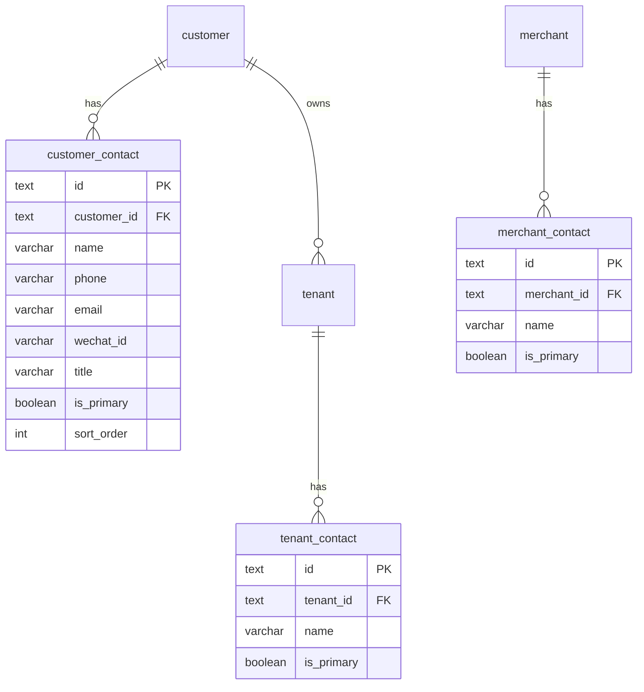

# 租户 / 商户 / 客户多联系人设计方案

> **版本**：v1.0（设计稿）  
> **日期**：2026-06-11  
> **状态**：**待确认** — 确认后再实施数据库迁移与代码改动  
> **关联**：`crm-database.md`（§3.2 Customer / Tenant）、`merchant-management-design.md`（商户主数据）、`supplier-database.md`（`supplier_ops_engineer` 运维通讯录）

**文档性质**：CRM 经营域与商户域的联系人子资源设计；描述数据模型、兼容策略、API、UI 与迁移方案。实现时可 **复用** 供应商域「机房运维通讯录」的交互与代码结构（非强制抽象为同一表）。

---

## 1. 目标与原则

### 1.1 业务目标

| # | 目标 | 说明 |
|---|------|------|
| G1 | **多联系人** | 客户（Customer）、计费租户（Tenant）、商户（Merchant）均支持维护 **多条** 联系人记录 |
| G2 | **独立归属** | 三类主体的联系人 **各自独立**；租户联系人不再与客户联系人混在同一编辑表单里隐式修改 |
| G3 | **列表可读** | 列表页仍展示「主联系人 + 电话」等摘要，避免表格列膨胀 |
| G4 | **交互一致** | 详情页提供通讯录管理（表格 + 新增/编辑/删除），交互对齐 `SupplierOpsEngineersDialog` |
| G5 | **平滑迁移** | 现有单字段联系人数据 **零丢失** 迁移为第一条主联系人；旧列只读兼容一期 |

### 1.2 非目标（本期）

- **不** 做跨实体联系人复制/关联（例如「从客户复制到租户」）— 可二期加快录入
- **不** 改造供应商域 `supplier_ops_engineer` 表结构或 UI（仅 **参考复用** 组件模式）
- **不** 实现联系人维度的 RBAC 字段级权限（沿用各实体既有编辑权限）
- **不** 对接平台 OpenAPI 的多联系人同步（平台仍只回传单个 `contact_user` / `contact_phone`）
- **不** 在本期删除 `customer.contact_*` / `merchant.contact_*` 列（标记废弃，由主联系人回写）

### 1.3 设计原则

1. **子表 + 级联删除**：联系人存独立子表，`ON DELETE CASCADE` 随主体删除。
2. **主联系人唯一**：每个主体至多一条 `is_primary = true`；列表/旧 API 字段取自主联系人。
3. **联系方式校验对齐运维通讯录**：姓名必填；手机号 / 邮箱 / 微信号 **至少填一项**。
4. **读写分离**：列表/详情读子表；创建主体时可 **可选** 附带首条联系人，也可事后在通讯录维护。
5. **平台同步只动主联系人**：商户平台同步更新 **主联系人** 的姓名/电话，不删除 CRM 手工维护的其他联系人。
6. **UI 组件复用优先于表复用**：抽取通用 `EntityContactsPanel` / `EntityContactsDialog`，底层可按域分表实现。

---

## 2. 现状与问题

### 2.1 当前数据模型

| 实体 | 表 | 联系人字段 | 问题 |
|------|-----|-----------|------|
| **Customer** | `customer` | `contact_person`, `contact_phone`, `contact_email` | 仅 1 人；创建/编辑表单强制必填 |
| **Tenant** | `tenant` | 无独立联系人；详情展示 **Customer** 的联系人 | 多计费账户无法各自维护对接人 |
| **Merchant** | `merchant` | `contact_user`, `contact_phone` | 仅 1 人；平台同步写这两列 |

### 2.2 当前 UI 行为

- **客户详情** `customer-detail-content.tsx`：只读展示单个联系人三字段。
- **客户表单** `customer-form-fields` / `customer-form-utils`：`contactPerson` / `contactPhone` 必填。
- **租户详情** `crm-tenant-detail-client.tsx`：「关联客户」卡片展示客户联系人；**租户编辑** `crm-tenant-edit-dialog.tsx` 可修改客户联系人（易混淆归属）。
- **商户详情** `merchant-detail-content.tsx`：基本信息区展示单个联系人/电话；编辑对话框写 `merchant.contact_*`。
- **参考实现** `supplier_ops_engineer` + `SupplierOpsEngineersDialog`：按机房维护多条，含 sortOrder、审计日志、独立 CRUD tRPC。

### 2.3 核心问题

1. 单字段无法表达「商务 + 财务 + 运维」等多角色对接人。
2. 租户与客户联系人 **耦合**，不符合「一客户多租户、各租户不同对接人」的场景。
3. 商户仅两列，缺少邮箱/微信，与运维通讯录字段不对齐。

---

## 3. 领域模型

### 3.1 实体关系

```text
┌─────────────┐     1      *  ┌──────────────────┐
│  customer   │──────────────►│  customer_contact │
└─────────────┘               └──────────────────┘
       │
       │ 1
       │ *
       ▼
┌─────────────┐     1      *  ┌──────────────────┐
│   tenant    │──────────────►│   tenant_contact  │
└─────────────┘               └──────────────────┘

┌─────────────┐     1      *  ┌──────────────────┐
│  merchant   │──────────────►│  merchant_contact │
└─────────────┘               └──────────────────┘
```

**语义**：

- **Customer 联系人**：客户主体层面的商务/决策对接人。
- **Tenant 联系人**：该计费账户（平台租户）层面的运营/财务/技术对接人；与客户联系人 **无自动同步**。
- **Merchant 联系人**：商户主体对接人；平台同步结果映射到 **主联系人**。

### 3.2 表结构（推荐：三张同构子表）

为保留强 FK 与清晰域边界，采用 **三张同构表**（字段一致，代码通过共享 type / mapper / zod schema 复用）。若后续实体继续增加，再评估合并为 polymorphic `entity_contact`。

#### 通用字段（三张表相同）

| 列名 | 类型 | 约束 | 说明 |
|------|------|------|------|
| `id` | text | PK | ULID / UUID |
| `{owner}_id` | text | FK NOT NULL, CASCADE | `customer_id` / `tenant_id` / `merchant_id` |
| `name` | varchar(128) | NOT NULL | 姓名 |
| `phone` | varchar(32) | 可空 | 手机号 |
| `email` | varchar(255) | 可空 | 邮箱 |
| `wechat_id` | varchar(128) | 可空 | 微信号 |
| `title` | varchar(64) | 可空 | 职务/角色，如「商务」「财务」 |
| `is_primary` | boolean | NOT NULL DEFAULT false | 是否主联系人 |
| `sort_order` | integer | NOT NULL DEFAULT 0 | 展示排序 |
| `remark` | text | 可空 | 备注 |
| `created_at` | timestamptz | NOT NULL | |
| `updated_at` | timestamptz | NOT NULL | |

**CHECK（应用层 + 可选 DB CHECK）**：`(phone IS NOT NULL AND phone <> '') OR (email IS NOT NULL AND email <> '') OR (wechat_id IS NOT NULL AND wechat_id <> '')`

**部分唯一索引**（每张表各一条）：

```sql
CREATE UNIQUE INDEX customer_contact_primary_uk
  ON customer_contact (customer_id)
  WHERE is_primary = true;
-- tenant_contact / merchant_contact 同理
```

**排序索引**：`(owner_id, sort_order, created_at)`

#### 3.2.1 `customer_contact`

- FK → `customer.id` ON DELETE CASCADE
- 文件：`packages/db/src/crm-schema.ts`

#### 3.2.2 `tenant_contact`

- FK → `tenant.id` ON DELETE CASCADE
- 文件：`packages/db/src/crm-schema.ts`

#### 3.2.3 `merchant_contact`

- FK → `merchant.id` ON DELETE CASCADE
- 文件：`packages/db/src/merchant-schema.ts`

### 3.3 与运维通讯录对比

| 项 | `supplier_ops_engineer` | 本方案联系人 |
|----|-------------------------|--------------|
| 归属 | 机房 `data_center_id` | 客户 / 租户 / 商户 |
| 冗余 FK | `supplier_id`（便于按供应商列表） | 不需要（按 owner 查即可） |
| 字段 | name, phone, email, wechat_id | 同上 + **title**, **is_primary**, remark |
| 审计 | `entity_state_transition_log` | **本期可选**：先写应用 log；二期对齐 supplier 审计 |
| UI | Dialog + Table | **复用** 同一套 Dialog/Table 组件 |

---

## 4. 兼容与迁移

### 4.1 数据迁移（migration `0005_*`）

对每张主表执行 **一次性回填**：

| 来源 | 条件 | 插入子表 |
|------|------|----------|
| `customer` | `contact_person` 非空 **或** 电话/邮箱任一有值 | 1 条 `is_primary=true`, `sort_order=0` |
| `tenant` | 无历史字段 | **不自动插入**；列表摘要仍可通过客户主联系人展示 |
| `merchant` | `contact_user` 或 `contact_phone` 有值 | 1 条 `is_primary=true` |

姓名缺省时用 `'未命名联系人'` 或跳过（需迁移脚本统计）；**推荐**：有 phone/email 但无 name 时用 `'—'` 占位并在 UI 提示补全。

### 4.2 旧列策略（过渡期）

| 列 | 策略 |
|----|------|
| `customer.contact_person/phone/email` | **保留**；写联系人 CRUD 时 **同步回写主联系人** 到这三列，保证旧列表/SQL/导入脚本仍可用 |
| `merchant.contact_user/phone` | **保留**；主联系人变更时同步；平台 sync 更新主联系人后 **回写** 这两列 |
| 租户 | 无旧列；租户列表 `contactPerson` 改为：**优先** `tenant` 主联系人，**否则** 回落客户主联系人（见 §5.3） |

### 4.3 废弃时间表

- **v1（本期）**：子表为事实来源；旧列由主联系人镜像。
- **v2（后续）**：客户/商户创建编辑表单 **移除** 单联系人输入，改通讯录入口；旧列改 nullable 或只读视图。
- **v3（远期）**：删除旧列，列表改 JOIN 子表。

---

## 5. API 设计（tRPC）

### 5.1 共享类型

```typescript
// apps/web/src/lib/types/entity-contact.ts
export type EntityContact = {
  id: string
  name: string
  phone: string
  email: string
  wechatId: string
  title: string
  isPrimary: boolean
  sortOrder: number
  remark: string
  createdAt: string
  updatedAt: string
}
```

各域扩展 owner 字段，例如 `CustomerContact = EntityContact & { customerId: string }`。

### 5.2 共享 Zod（对齐 `supplier-ops-engineer-schemas.ts`）

```typescript
const entityContactFieldsSchema = z.object({
  name: z.string().trim().min(1, '请填写姓名').max(128),
  phone: z.string().trim().max(32).optional().default(''),
  email: z.string().trim().max(255).optional().default('')
    .refine(v => !v || emailRegex.test(v), { message: '请填写有效的邮箱地址' }),
  wechatId: z.string().trim().max(128).optional().default(''),
  title: z.string().trim().max(64).optional().default(''),
  remark: z.string().trim().optional().default(''),
  isPrimary: z.boolean().optional().default(false),
})
// + superRefine: 至少一项联系方式
```

### 5.3 路由结构

| 过程 | Input | 说明 |
|------|-------|------|
| `crm.customers.contacts.list` | `{ customerId }` | 按 sort_order |
| `crm.customers.contacts.create` | `{ customerId, ...fields }` | 若 `isPrimary` 则事务内清除其他 primary |
| `crm.customers.contacts.update` | `{ id, data }` | 同步镜像旧列 |
| `crm.customers.contacts.delete` | `{ id }` | 若删主联系人，提示需指定新 primary 或阻止删除最后一条 |
| `crm.customers.contacts.setPrimary` | `{ id }` | 可选：单独 endpoint |

`crm.tenants.contacts.*` 结构相同，owner 换 `tenantId`。

`merchant.contacts.*` 结构相同，owner 换 `merchantId`；平台 sync 后调用内部 `upsertPrimaryFromPlatform(name, phone)`。

**列表摘要字段**（扩展既有 list/getById 响应，不破坏现有字段）：

```typescript
// Customer — 仍返回 contactPerson/Phone/Email = 主联系人镜像
contacts?: EntityContact[]  // 详情可选 eager load

// BillingTenantListItem
contactPerson?: string  // COALESCE(tenant_primary.name, customer_primary.name)
contactPhone?: string   // 同上
tenantContacts?: EntityContact[]  // 详情
```

### 5.4 业务规则

| 规则 | 说明 |
|------|------|
| R1 | 每个 owner **至少 0 条** 联系人（客户创建可不填；但现有表单必填需调整，见 §6） |
| R2 | 每个 owner **至多 1 条** `is_primary=true` |
| R3 | 设置新 primary 时，同事务将旧 primary 置 `false` 并镜像旧列 |
| R4 | **禁止**删除最后一条且为 primary 的联系人，若该实体旧列仍被外部依赖 — 或删除后清空镜像列 |
| R5 | 租户编辑 API **不再** 接受 `customer.contactPerson` 等字段（拆分为独立 contacts API + 客户编辑） |

### 5.5 Data Access 层

- `apps/web/src/lib/server/dataaccess/crm/customer-contacts.ts`
- `apps/web/src/lib/server/dataaccess/crm/tenant-contacts.ts`
- `apps/web/src/lib/server/dataaccess/merchant/merchant-contacts.ts`

抽取共享 helper（同文件或 `entity-contacts-shared.ts`）：

- `assertAtLeastOneChannel(phone, email, wechatId)`
- `clearOtherPrimary(tx, table, ownerId, exceptId?)`
- `mirrorPrimaryToLegacyColumns(tx, ownerType, ownerId, contact)`

---

## 6. UI 设计

### 6.1 组件复用（推荐抽取）

从 `supplier-ops-engineers-dialog.tsx` / `supplier-ops-engineers-list.tsx` 抽取：

| 新组件 | 职责 |
|--------|------|
| `EntityContactsList` | 只读表格：姓名、职务、手机、邮箱、微信、主联系人 Badge |
| `EntityContactsDialog` | 列表 + 新增/编辑/删除/设为主联系人；props: `title`, `description`, `contacts`, `mutations` |
| `EntityContactFormDialog` | 单条表单（姓名、职务、手机、邮箱、微信、备注、是否主联系人） |

供应商域 **暂不替换** 现有组件，避免 scope 扩散；CRM/商户直接使用新通用组件。

### 6.2 页面改动

| 页面 | 改动 |
|------|------|
| **客户详情** | 「联系信息」卡片改为：`EntityContactsList` + 按钮「管理通讯录」；地址仍单独展示 |
| **客户创建/编辑** | **方案 A（推荐）**：表单 **移除** 三个联系人字段，创建后引导在详情维护；**方案 B**：保留「主联系人」折叠区，创建时写 1 条 primary |
| **客户列表** | 列不变（仍用镜像字段 `contactPerson` / `contactPhone`） |
| **租户详情** | 新增「租户通讯录」卡片；「关联客户」卡片 **只读** 展示客户主联系人 + 链接「查看客户通讯录」 |
| **租户编辑** | **移除** 客户联系人编辑区；租户侧字段不变（name/phone/balance 等） |
| **商户详情** | 基本信息区去掉单行联系人；新增「通讯录」区块 + Dialog |
| **商户编辑** | **移除** contactUser/Phone 输入；改由通讯录维护 |
| **商户平台同步** | 无 UI 变化；sync 写主联系人 + 镜像列 |

### 6.3 交互草图

```text
客户详情 / 租户详情 / 商户详情
┌──────────────────────────────────────────────┐
│ 通讯录                          [管理通讯录] │
├──────────┬──────┬──────────┬────────┬────────┤
│ 姓名     │ 职务 │ 手机     │ 邮箱   │ 主联系人│
│ 张三     │ 商务 │ 138…     │ a@…    │ ★      │
│ 李四     │ 财务 │ 139…     │ —      │        │
└──────────┴──────┴──────────┴────────┴────────┘

[管理通讯录 Dialog] — 与运维通讯录相同：表格 + 行内编辑/删除 + 新增
```

---

## 7. 导入与集成

| 场景 | 行为 |
|------|------|
| **客户导入** / **租户导入** | 仍读 Excel 单列「联系人/电话/邮箱」→ 创建 **1 条 primary** + 镜像旧列 |
| **项目导入** 顺带建客户 | 空联系人允许（若取消表单必填） |
| **商户平台 sync** | 更新 **primary** 的 name/phone；无 primary 则 insert primary |
| **客户合并** | 从客户合并设计继承：被合并客户的 contacts **不自动合并**（二期）；本期合并前提示手工处理 |

---

## 8. 权限

沿用现有过程权限，不新增菜单：

| 操作 | 权限 |
|------|------|
| 查看通讯录 | 对应实体 `getById` / 详情读权限 |
| 增删改联系人 | 对应实体 `update` 权限（与编辑主数据同级） |

---

## 9. 实施计划

| 阶段 | 内容 | 预估 |
|------|------|------|
| **P1 数据库** | 三张子表 + migration 回填 + Drizzle schema | 0.5d |
| **P2 后端** | dataaccess + tRPC + 主联系人镜像 + 商户 sync 适配 | 1d |
| **P3 前端组件** | 抽取 `EntityContacts*` + 三处详情接入 | 1d |
| **P4 表单清理** | 客户/租户/商户编辑表单去联系人字段；列表/导入适配 | 0.5d |
| **P5 验证** | 迁移数据抽检、平台 sync 回归、租户列表回落逻辑 | 0.5d |

**建议实施顺序**：Customer → Tenant → Merchant（商户涉及平台 sync，放最后）。

---

## 10. 待确认项

| # | 问题 | 建议默认 |
|---|------|----------|
| Q1 | 客户创建是否仍 **强制** 至少 1 个联系人？ | **否** — 与多联系人模型一致，允许空，详情再补 |
| Q2 | 租户列表「联系人」列展示 **租户 primary** 还是 **客户 primary**？ | **租户 primary 优先**，无则回落客户 primary |
| Q3 | 是否抽取 **一张** polymorphic 表替代三表？ | **否（本期）** — 三表 FK 更清晰；组件层复用即可 |
| Q4 | 联系人 CRUD 是否写 `entity_state_transition_log`？ | **本期否** — 与商户活动/供应商审计对齐可二期补 |
| Q5 | 客户编辑表单采用 **方案 A**（移除联系人）还是 **方案 B**（保留主联系人快捷录入）？ | **方案 B** — 降低录入步骤，仍写 primary 子表 |
| Q6 | 删除主联系人时是否 **必须** 先指定继任？ | **是** — 或禁止删除最后一条 |

---

## 11. 附录：ER 图



---

**确认后下一步**：按 §9 顺序提交 migration + tRPC + UI PR；本文档状态改为「已确认 / 实施中」。
