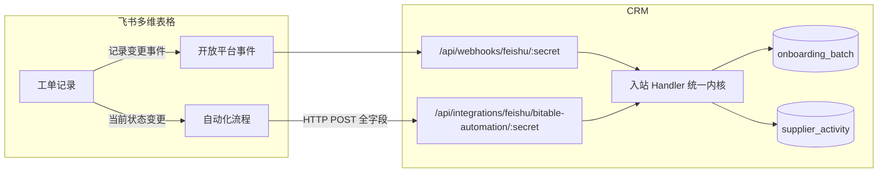
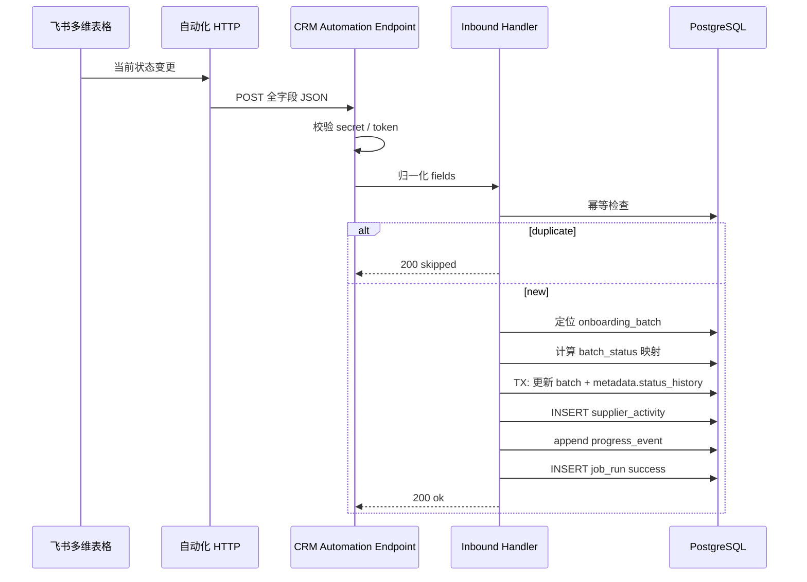

# 飞书多维表格自动化 HTTP 入站同步设计方案

**文档性质**：架构与实施设计稿（**不修改代码**）  
**版本**：v1.0  
**日期**：2026-06-16  
**状态**：ADR 已确认，实施中  

**关联文档**：

- [feishu-integration-design.md](./feishu-integration-design.md) — 飞书集成总设计（§5.11 工单 Bitable、事件订阅 Webhook）
- [feishu-env-configuration.md](../guide/feishu-env-configuration.md) — Webhook / 验签环境变量配置
- [supplier-device-management-ops-panorama.md](./supplier-device-management-ops-panorama.md) — §7.3 方案 A：工单只驱动批次态
- [supplier-onboarding-plan-changelog-tracking-design.md](./supplier-onboarding-plan-changelog-tracking-design.md) — 批次进度事件、工单桥接键

**代码锚点（现网，供实施对照）**：

| 能力 | 路径 |
|------|------|
| 事件订阅 Bitable 入站 | `bitable-record-webhook-handler.ts` |
| 工单字段映射 / 状态枚举 | `feishu-work-order.ts`、`work-order-bitable-mapper.ts` |
| 批次 metadata 合并 | `FeishuBatchMetadata`（`integrations/feishu/types.ts`） |
| 供应商时间线 | `supplier-activity.ts` → `supplier_activity` |
| 批次进度事件 | `batch-progress-events.ts` → `onboarding_batch_progress_event` |
| 工单 Bitable 配置表 | `feishu_work_order_bitable_config`（`feishu-schema.ts`） |

---

## 1. 背景与目标

### 1.1 现状

现网工单 Bitable **入站**默认依赖飞书开放平台 **事件订阅**（`drive.file.bitable_record_changed_v1` 等）：

1. 飞书推送事件 → `POST /api/webhooks/feishu/{secret}`
2. CRM 验签后 **再调 Open API** 拉取记录详情
3. 读取「当前状态」列 → 映射终态 → 更新 `batch_status` + 写时间线

该路径需要：企业自建应用、事件订阅配置、`FEISHU_VERIFICATION_TOKEN` / `FEISHU_ENCRYPT_KEY`、应用发布与权限开通。

### 1.2 新诉求

运营希望在 **多维表格自动化流程** 中，当记录的 **「当前状态」** 发生变更时，由自动化直接向 CRM 发送 **HTTP 请求**，实现：

| # | 目标 | 说明 |
|---|------|------|
| **G1** | 字段全量同步入时间线 | 将工单表 **所有已映射字段** 的快照写入 **供应商活动时间线**（`supplier_activity`） |
| **G2** | 驱动批次状态 | 按「当前状态」五态映射更新 `onboarding_batch.batch_status` |
| **G3** | 批次内保留审计 | 在 `onboarding_batch.metadata.feishu` 中记录状态变更历史与字段快照摘要 |
| **G4** | 不改设备态 | **不**更新 `supplier_device.lifecycle_status` / `ops_status`（延续 ops-panorama §7.3 方案 A） |
| **G5** | 与事件订阅并存可选 | 作为 **入站通道选项**，与现有事件订阅回调 **二选一或双开（可配置）** |

### 1.3 非目标

- 不替代 CRM → Bitable **出站建单**（`create-bitable-work-order.ts`）
- 不通过本通道同步 **设备主数据 / 变更表**（仍走 `feishu_bitable_sync_config` + Cron）
- 不要求飞书自动化推送附件二进制（附件仅记录 token / 链接摘要，P2 再拉取）
- 不改造 `entity_state_transition_log` 或 Period ETL

### 1.4 设计原则

1. **工单号仍是桥接键**：`work_order_no` = Bitable「工单ID编号」；`feishu_external_link(bitable_work_order_record)` 辅助关联。
2. **设备态仍由变更表驱动**：入站只动 **批次进程** + **时间线**；与 [feishu-integration-design.md §1.5](./feishu-integration-design.md) 原则 2 一致。
3. **幂等与可审计**：每次入站请求可去重；成功 / 跳过 / 失败均写 `feishu_integration_job_run`。
4. **配置外置**：入站模式、状态映射、自动化密钥存 DB 配置，不进 git。

---

## 2. 入站通道对比与选型

### 2.1 两种入站方式

| 维度 | **A. 事件订阅 Webhook**（现网） | **B. 多维表格自动化 HTTP**（本方案） |
|------|--------------------------------|--------------------------------------|
| 触发方 | 飞书开放平台事件推送 | Bitable 自动化「发送 HTTP 请求」 |
| CRM 入口 | `POST /api/webhooks/feishu/{secret}` | `POST /api/integrations/feishu/bitable-automation/{secret}`（建议新路由） |
| 鉴权 | Verification Token + 可选 Encrypt Key | URL path secret + 可选 `X-Feishu-Automation-Token` |
| 载荷 | 标准 `FeishuWebhookEnvelope` | **自定义 JSON**（运营在自动化中拼装） |
| 字段来源 | CRM 调 API 回读 Bitable 记录 | 自动化请求体 **直接携带字段**（可减少 API 调用） |
| 飞书应用依赖 | 强（需订阅权限） | 弱（自动化在表格侧配置即可） |
| 适用场景 | 统一事件总线、需平台级验签 | 运营自主配流程、仅需工单表状态同步 |

### 2.2 配置项：`inbound_channel`

在 `feishu_work_order_bitable_config` 增加入站通道（实施时迁移）：

| 值 | 行为 |
|----|------|
| `bitable_automation` | **默认（ADR-BA6）**；仅处理多维表格自动化 HTTP 入站 |
| `event_subscription` | 仅处理开放平台事件订阅 |
| `dual` | 两种通道均启用；**同一状态变更**须靠幂等键去重，避免重复写时间线 |

**ADR-BA6 已确认**：`inbound_channel` 可配置，**默认 `bitable_automation`**。



---

## 3. 飞书多维表格自动化配置（运营侧）

### 3.1 触发条件

在 **资源接入工单** 多维表格中创建自动化流程：

| 项 | 建议 |
|----|------|
| 触发器 | **当记录满足条件时** → 字段「当前状态」**变更为**（或「已更新」且状态在列表内） |
| 条件 | `当前状态` 属于 `{ 待审核, 待分配, 处理中, 已结束, 已终止 }` |
| 动作 | **发送 HTTP 请求** |

> 建议 **每个终态/关键态单独一条自动化**（已结束、已终止），中间态（待分配→处理中）可合并；避免一条自动化内复杂分支难以排查。

### 3.2 HTTP 请求配置

| 项 | 值 |
|----|-----|
| 方法 | `POST` |
| URL | `{APP_BASE_URL}/api/integrations/feishu/bitable-automation/{FEISHU_AUTOMATION_SECRET}` |
| Content-Type | `application/json` |
| 请求体 | 见 §4.1（可用飞书自动化「插入字段值」模板） |

**请求头（可选，推荐）**：

```http
X-Feishu-Automation-Token: <与 CRM 配置一致的 automation_token>
X-Idempotency-Key: <记录ID>-<当前状态>-<最后修改时间戳>
```

### 3.3 自动化请求体拼装示例

飞书自动化支持将字段插入 JSON 文本。运营侧模板示例（字段名须与工单表一致）：

```json
{
  "source": "feishu_bitable_automation",
  "record_id": "{{记录 ID}}",
  "ticket_no": "{{工单ID编号}}",
  "trigger": "work_order_status_changed",
  "work_order_status": "{{当前状态}}",
  "occurred_at": "{{最后更新时间}}",
  "fields": {
    "工单ID编号": "{{工单ID编号}}",
    "所属模块": "{{所属模块}}",
    "工单内容": "{{工单内容}}",
    "当前状态": "{{当前状态}}",
    "优先级": "{{优先级}}",
    "工单分类": "{{工单分类}}",
    "经办人": "{{经办人}}",
    "提交人": "{{提交人}}",
    "备注": "{{备注}}",
    "工单处理反馈": "{{工单处理反馈}}",
    "工单完成时间": "{{工单完成时间}}"
  }
}
```

CRM 侧按 `field_mapping_json`（`field_key` → 列名）归一化，**不硬编码中文列名**。

---

## 4. CRM 入站 API 契约

### 4.1 路由与安全

**建议路由**（与开放平台 Webhook 分离，避免验签逻辑耦合）：

```
POST /api/integrations/feishu/bitable-automation/:secret
```

| 安全层 | 规则 |
|--------|------|
| Path secret | `:secret` === 配置项 `automation_webhook_secret`（可复用 `FEISHU_WEBHOOK_SECRET` 或独立密钥） |
| Header token | 若配置 `automation_token`，校验 `X-Feishu-Automation-Token` |
| 来源 IP | 可选白名单（P2）；Phase 1 仅靠 secret |
| 响应 | 业务失败仍返回 **200** + `{ ok: false, code }`（与现网 Webhook 一致，避免飞书自动化无限重试）；鉴权失败返回 **401** |

### 4.2 请求体 Schema

```typescript
type FeishuBitableAutomationInbound = {
  source?: 'feishu_bitable_automation'
  record_id: string           // 必填，Bitable record_id
  ticket_no?: string          // 工单ID编号，桥接键
  trigger?: string            // 默认 work_order_status_changed
  work_order_status: string   // 必填，当前状态原文
  previous_status?: string    // 可选，自动化若能提供「变更前」
  occurred_at?: string        // ISO8601，默认服务端 now
  idempotency_key?: string    // 可选，优先于服务端构造
  fields: Record<string, unknown>  // 必填，全字段快照（键为列名或 field_key）
}
```

**校验规则**：

- `record_id`、`work_order_status`、`fields` 缺失 → `400`
- `work_order_status` 不在配置的白名单 → `200` + `skipped: unknown_status`
- 找不到批次 → `200` + `skipped: batch_not_found`（记 job_run 告警）

### 4.3 批次定位

与现网 `bitable-record-webhook-handler.ts` 相同优先级：

1. `feishu_external_link`：`external_type=bitable_work_order_record` + `external_id=record_id`
2. `onboarding_batch.work_order_no` = `ticket_no`（trim 后精确匹配）

---

## 5. 「当前状态」五态映射

### 5.1 运营确认的状态枚举

| Bitable `当前状态` | 语义键 `status_semantic` | CRM `batch_status` 目标 | 是否终态 |
|--------------------|--------------------------|-------------------------|----------|
| 待审核 | `pending_review` | **不变**（保持 `待开始`） | 否 |
| 待分配 | `pending_assign` | **不变**（保持 `待开始`） | 否 |
| 处理中 | `in_progress` | 按 `batch_kind` 映射中间态（见 §5.2） | 否 |
| 已结束 | `completed` | `已完成`（受 `auto_complete_on_approval` 约束，见 §5.4） | 是 |
| 已终止 | `cancelled` | `已取消` | 是 |

> **新增「待分配」**：相对现网 `DEFAULT_FEISHU_WORK_ORDER_STATUS_MAPPING` 扩展；语义为工单已通过审核、待运维认领，**不强制推进 CRM 批次中间态**，仅写时间线与审计。

### 5.2 `batch_kind` → 中间态

当 `work_order_status=处理中` 且 `auto_sync_in_progress_status=true`（新配置，默认 **true**）：

| `batch_kind` | `batch_status` |
|--------------|----------------|
| `online` / `order_access` | `接入中` |
| `device_retire` | `下架中` |
| `internal_occupancy` | `占用中` |
| 其他 | 不变更 |

若批次已为终态（`已完成` / `已取消`），**禁止回退**中间态。

### 5.3 `status_mapping_json` 扩展

```json
{
  "待审核": "pending_review",
  "待分配": "pending_assign",
  "处理中": "in_progress",
  "已结束": "completed",
  "已终止": "cancelled"
}
```

存储位置：`feishu_work_order_bitable_config.status_mapping_json`（与现网列复用）。

### 5.4 与 `auto_complete_on_approval` 的关系

| 飞书状态 | `auto_complete_on_approval=true` | `auto_complete_on_approval=false` |
|----------|----------------------------------|-----------------------------------|
| 已结束 | `batch_status` → `已完成` + 终态时间线 | **仅**写时间线 + `work_order_closed` 进度事件，**不改** `batch_status` |
| 已终止 | → `已取消` | → `已取消`（终止仍建议同步批次态） |
| 处理中 | 按 §5.2 更新中间态 | 同左（中间态与保守模式正交） |

**提前完工审查**：`已完成` 且 `touched_device_count < planned_device_count` 时，写 `progress_flags_json.needs_review=true`（与现网 Webhook 一致）。

---

## 6. 供应商活动时间线写入

### 6.1 触发时机

**每次**自动化入站成功且 `work_order_status` 与上次入站不同（或 `fields` 快照有变化，可配置）时写入时间线。

| 配置项 | 默认 | 说明 |
|--------|------|------|
| `timeline_on_every_sync` | `true` | 任意状态同步均写时间线 |
| `timeline_on_terminal_only` | `false` | 若 true，仅 `已结束` / `已终止` 写时间线（与现网 Webhook 偏终态行为接近） |

### 6.2 `supplier_activity` 记录结构

| 列 | 值 |
|----|-----|
| `supplier_id` | 批次 `supplier_id` |
| `type` | **`batch_work_order_sync`**（新增 type；与 `batch_work_order_completed` 区分） |
| `title` | `飞书工单 {ticket_no}：{work_order_status}` |
| `description` | 人类可读摘要：状态变更 + 经办人 + 处理反馈摘要 |
| `author_name` | `系统` |
| `author_role` | `system` |
| `ref_domain` | `onboarding_batch` |
| `ref_id` | `batch.id` |
| `metadata` | 见下表 |
| `occurred_at` | 请求 `occurred_at` 或服务端时间 |

**`metadata` 建议结构**：

```json
{
  "data_center_id": "uuid",
  "idc_code": "BJ-XX",
  "work_order_no": "12345",
  "feishu_record_id": "recxxx",
  "feishu_status": "处理中",
  "previous_feishu_status": "待分配",
  "activity_kind": "work_order_sync",
  "inbound_channel": "bitable_automation",
  "fields_snapshot": {
    "ticket_no": "12345",
    "module": "资源接入",
    "work_order_content": "…",
    "work_order_status": "处理中",
    "priority": "紧急-P0",
    "category": "集群机器上下架",
    "assignees": ["ou_xxx"],
    "submitter": "ou_yyy",
    "remark": "…",
    "handler_feedback": "…",
    "completed_at": null
  },
  "fields_display": {
    "所属模块": "资源接入",
    "当前状态": "处理中"
  }
}
```

- `fields_snapshot`：按 `FeishuWorkOrderFieldKey` 归一化后的键值（实施时复用 `work-order-bitable-mapper` 反向解析）
- `fields_display`：原始列名 → 展示值，便于时间线 UI 直接渲染
- 人员字段存 `open_id` 数组；展示名 P2 通过飞书通讯录解析

### 6.3 幂等（时间线）

幂等键：`(ref_id, feishu_record_id, work_order_status, idempotency_key)`

- 同一幂等键重复请求 → 跳过 INSERT，仍更新 `metadata.feishu.last_sync_at`
- `batch_work_order_completed` 与 `batch_work_order_sync` **不**互相去重（终态可各有一条）

### 6.4 机房维度

与现网一致：`metadata.idc_code` / `metadata.data_center_id` 必须写入，供机房详情页时间线过滤。

---

## 7. 批次 metadata 审计

### 7.1 扩展 `onboarding_batch.metadata.feishu`

在现有 `FeishuBatchMetadata` 上增量（实施时扩展类型）：

```json
{
  "feishu": {
    "instance_id": "recxxx",
    "instance_code": "12345",
    "create_status": "created",
    "inbound_channel": "bitable_automation",
    "last_sync_at": "2026-06-16T10:00:00+08:00",
    "last_feishu_status": "处理中",
    "last_sync_idempotency_key": "recxxx-处理中-1718503200",
    "completion_source": "feishu_automation",
    "status_history": [
      {
        "at": "2026-06-16T09:00:00+08:00",
        "from_status": "待审核",
        "to_status": "待分配",
        "batch_status_before": "待开始",
        "batch_status_after": "待开始",
        "inbound_channel": "bitable_automation",
        "idempotency_key": "recxxx-待分配-1718499600",
        "fields_snapshot_digest": "sha256:abc…",
        "operator_hint": "经办人: 张三"
      },
      {
        "at": "2026-06-16T10:00:00+08:00",
        "from_status": "待分配",
        "to_status": "处理中",
        "batch_status_before": "待开始",
        "batch_status_after": "接入中",
        "inbound_channel": "bitable_automation",
        "idempotency_key": "recxxx-处理中-1718503200",
        "fields_snapshot_digest": "sha256:def…"
      }
    ]
  }
}
```

### 7.2 审计字段说明

| 字段 | 说明 |
|------|------|
| `status_history[]` | 按时间追加；**上限 50 条**，超出时 FIFO 裁剪最旧记录 |
| `fields_snapshot_digest` | 全字段快照 SHA-256，避免 metadata 过大；完整快照在时间线 `metadata.fields_snapshot` |
| `batch_status_before/after` | 本次入站前后 CRM 批次态，便于审计与排障 |
| `inbound_channel` | `bitable_automation` \| `event_subscription`，双通道时区分来源 |
| `last_sync_at` | 最后一次入站处理时间（无论是否变更 batch_status） |

### 7.3 批次详情 UI（P1）

- 「飞书同步」卡片展示：`最后状态`、`最后同步时间`、`入站通道`
- 可展开 `status_history` 时间线（只读）
- 双通道时若短时间内收到相同状态，展示「已去重」提示

---

## 8. 批次进度事件

除 `supplier_activity` 外，同步写入 `onboarding_batch_progress_event`：

| 条件 | `event_type` | `payload` 要点 |
|------|--------------|----------------|
| 状态变更 | `status_changed` | `source: feishu_automation`, `from`, `to`, `feishu_status` |
| 已结束且改批次态 | `work_order_closed` | `backend: bitable_automation` |
| 已结束且自动完工 | `batch_completed` | `source: feishu_automation` |
| 已终止 | `batch_cancelled` | `source: feishu_automation` |
| 仅字段同步、状态未变 | `work_order_fields_synced` | **新增**；`fields_digest` |

进度事件幂等：同 `batch_id + event_type + idempotency_key` 唯一。

---

## 9. 明确边界：不更新设备状态

与 [supplier-device-management-ops-panorama.md §7.3](./supplier-device-management-ops-panorama.md) **方案 A** 严格一致：

| 允许 | 禁止 |
|------|------|
| 更新 `onboarding_batch.batch_status` | 更新 `supplier_device.lifecycle_status` |
| 写 `supplier_activity` / `progress_event` | 写 `supplier_device.ops_status` |
| 更新 `metadata.feishu` 审计 | 触发 `device-import` / `commitChangelog` |
| 更新 `progress_flags_json`（如 `needs_review`） | 因「已结束」自动将设备标为在线/下线 |

设备态仍由 **设备变更表挂接** + `refreshBatchProgress` 驱动。

---

## 10. 数据模型增量

### 10.1 `feishu_work_order_bitable_config` 扩展列

| 列 | 类型 | 默认 | 说明 |
|----|------|------|------|
| `inbound_channel` | varchar(32) | `event_subscription` | `event_subscription` \| `bitable_automation` \| `dual` |
| `automation_webhook_secret` | varchar(128) 可空 | null | 自动化 URL secret；空则回退 env `FEISHU_AUTOMATION_SECRET` |
| `automation_token` | varchar(255) 可空 | null | Header 校验 |
| `inbound_policy_json` | jsonb | 见下 | 入站行为策略 |

**`inbound_policy_json` 默认**：

```json
{
  "timeline_on_every_sync": true,
  "timeline_on_terminal_only": false,
  "auto_sync_in_progress_status": true,
  "dedupe_window_seconds": 60
}
```

`status_mapping_json` 默认值扩展为 §5.3 五态。

### 10.2 `feishu_integration_job_run.job_kind` 增量

新增枚举值：`bitable_automation_inbound`

### 10.3 幂等表

**方案 A（推荐）**：复用 `feishu_webhook_event`，`idempotency_key` 前缀 `bitable_automation:`

**方案 B**：新建 `feishu_automation_inbound_event`（字段同 webhook_event）

---

## 11. 双通道并存与去重

当 `inbound_channel=dual` 时，同一状态变更可能先后触发：

1. 开放平台 `bitable_record_changed` → 拉 API → 处理
2. 自动化 HTTP → 直接处理

**去重策略**：

```
dedupe_key = hash(record_id + normalized_status + floor(occurred_at / dedupe_window_seconds))
```

- 窗口内第二次命中 → `skipped: duplicate_cross_channel`
- `status_history` 仅追加一条，`inbound_channel` 记 **先到达** 者
- job_run 记 `response_summary.duplicate_of`

**运营建议**：稳定后择一通道为主；`dual` 仅用于迁移期并行验证。

---

## 12. 处理流程



---

## 13. 模块划分（实施参考）

| 模块 | 职责 |
|------|------|
| `apps/web/src/app/api/integrations/feishu/bitable-automation/[secret]/route.ts` | HTTP 入口、鉴权、解析 body |
| `bitable-automation-inbound-handler.ts` | 业务编排（新建，与 webhook-handler 并列） |
| `work-order-inbound-mapper.ts` | `fields` → `FeishuWorkOrderFieldKey` 反向映射 + 展示名 |
| `work-order-inbound-policy.ts` | 状态 → batch_status、是否写时间线 |
| 共享 | `mergeBatchMetadata`、`appendBatchProgressEvent`、`feishu_external_link` 查询 |

**重构建议（P1）**：将 `bitable-record-webhook-handler.ts` 与 automation handler 的 **批次更新 + 时间线 + 审计** 抽为 `syncWorkOrderInboundSnapshot()`，两入口仅负责载荷归一化。

---

## 14. Settings 管理 UI

在现有「飞书工单映射」面板（`feishu-bitable-sync-panel` 同区）增加：

| 控件 | 说明 |
|------|------|
| 入站通道 | 单选：事件订阅 / 自动化 HTTP / 双通道 |
| 自动化 URL | 只读展示，含 copy 按钮 |
| 自动化 Secret | 生成 / 轮换 |
| 状态映射表 | 五态 → 语义 → 是否推进 batch_status |
| 策略开关 | `timeline_on_every_sync`、`auto_sync_in_progress_status` |
| 试发 | 粘贴 sample JSON → 预览将写入的时间线条目（admin） |

---

## 15. 错误处理与可观测性

| 场景 | HTTP | job_run |
|------|------|---------|
| 鉴权失败 | 401 | 不写入 |
| 批次不存在 | 200 `batch_not_found` | `status=skipped` |
| 未知状态 | 200 `unknown_status` | `status=skipped` |
| 事务失败 | 200 `internal_error` | `status=failed` + `error_message` |
| 成功 | 200 `ok` | `status=success` + `response_summary` |

告警：连续 5 次 `batch_not_found` → Settings 红色提示「桥接键不匹配」。

---

## 16. 实施分期

### Phase 1 — 自动化入站 MVP

- [x] 新路由 + handler + 五态映射
- [x] `supplier_activity.type=batch_work_order_sync`
- [x] `metadata.feishu.status_history` 审计
- [x] `inbound_channel` 配置（`bitable_automation` | `event_subscription` | `dual`）
- [x] Settings 展示自动化 URL

**验收**：Bitable 改「当前状态」→ 自动化 POST → CRM 时间线出现全字段快照；`处理中` → 批次 `接入中`；`已结束` → 批次 `已完成` + 设备态不变。

### Phase 1.5 — 双通道与 UI

- [ ] `dual` 模式跨通道去重
- [ ] 批次详情飞书审计卡片
- [ ] 抽公共 `syncWorkOrderInboundSnapshot`

### Phase 2 — 增强

- [ ] 人员字段 open_id → 显示名
- [ ] 附件 token 拉取入 `supplier_activity_attachment`
- [ ] 自动化失败重放（死信队列）

---

## 17. 测试要点

| 类型 | 用例 |
|------|------|
| 单元 | 五态映射、`batch_kind` 中间态、`status_history` 裁剪 |
| 集成 | 自动化 sample payload → batch + activity + progress_event |
| 幂等 | 相同 `idempotency_key` 重复 POST |
| 双通道 | 60s 内 event + automation 各一次 → 仅一条时间线 |
| 回归 | `inbound_channel=event_subscription` 行为与现网一致 |
| 边界 | 批次已 `已完成` 再收 `处理中` → 不回退 |

---

## 18. ADR 摘要

| ID | 决策 | 状态 |
|----|------|------|
| **ADR-BA1** | 自动化入站与开放平台 Webhook **各自独立**路由与验签逻辑 | **已确认** |
| **ADR-BA2** | 「待审核 / 待分配」**不推进** CRM `batch_status`，仅审计 + 时间线 | **已确认** |
| **ADR-BA3** | 「处理中」默认映射 `接入中`/`下架中`/`占用中` | **已确认** |
| **ADR-BA4** | 全字段快照入 `supplier_activity.metadata`，批次 metadata 仅存 digest + history | **已确认** |
| **ADR-BA5** | 设备态 **永不** 由此通道更新（方案 A） | **已确认**（延续 F 系列原则） |
| **ADR-BA6** | `inbound_channel` 三态可配置；**默认 `bitable_automation`** | **已确认** |

---

## 19. 环境变量（增量）

```env
# 自动化入站 URL secret（可与 FEISHU_WEBHOOK_SECRET 相同或独立）
FEISHU_AUTOMATION_SECRET=your-automation-secret

# 可选 Header token（对应 X-Feishu-Automation-Token）
FEISHU_AUTOMATION_TOKEN=

# 批次详情链接 / 自动化 URL 的 host
APP_BASE_URL=https://crm.example.com
```

自动化入站完整 URL：

```
{APP_BASE_URL}/api/integrations/feishu/bitable-automation/{FEISHU_AUTOMATION_SECRET}
```

与开放平台 Webhook（`/api/webhooks/feishu/{secret}`）**相互独立**（ADR-BA1）。

详见 [feishu-env-configuration.md](../guide/feishu-env-configuration.md) 与 [feishu-bitable-automation-inbound-design.md](../design/feishu-bitable-automation-inbound-design.md)。
