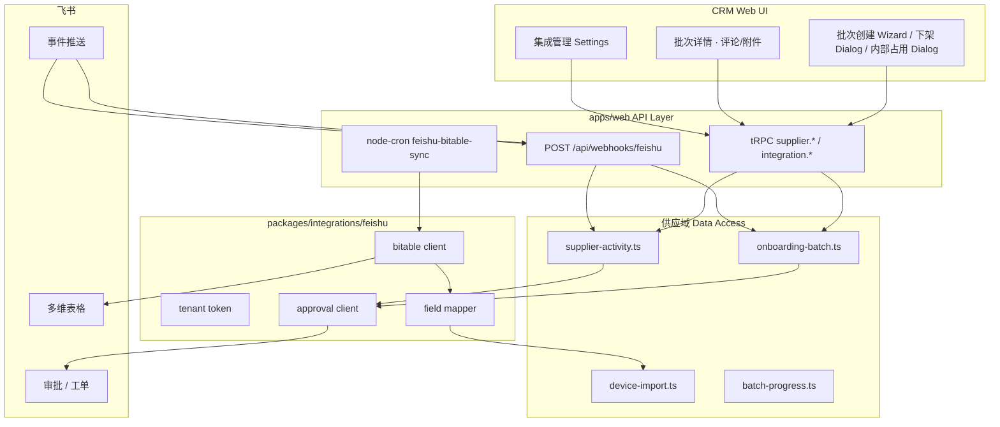
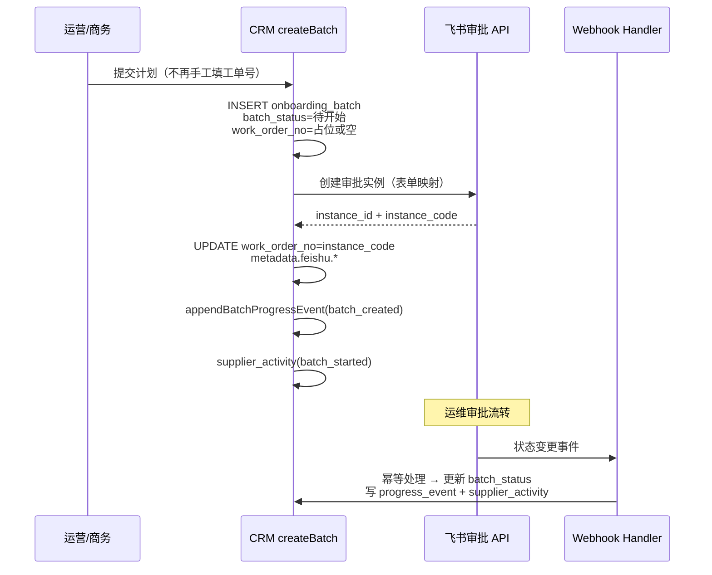
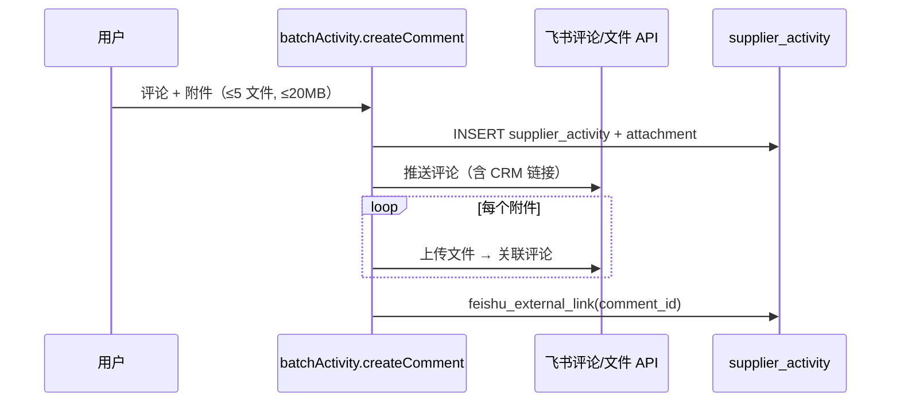
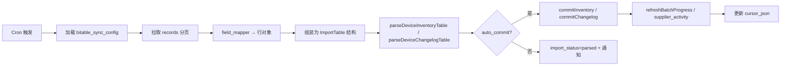

# 供应域 — 飞书集成（工单 + Webhook + 多维表格）设计方案

**文档性质**：架构与实施设计稿（**不修改代码**）  
**版本**：v1.0  
**日期**：2026-06-11  
**状态**：待评审  

**关联文档**：

- [supplier-onboarding-plan-changelog-tracking-design.md](./supplier-onboarding-plan-changelog-tracking-design.md) — 工单桥接键、`ticket_no` 挂批、进度事件（§2 阶段三预留飞书 API）
- [supplier-device-import-schema.md](./supplier-device-import-schema.md) — 设备主数据表 / 设备变更表 Excel 列权威
- [supplier-device-management-ops-panorama.md](./supplier-device-management-ops-panorama.md) — 批次类型、工单驱动进程（§7.3）
- [supplier-planned-batches-hub-design.md](./supplier-planned-batches-hub-design.md) — 计划批次统一列表
- [supplier-internal-occupancy-batch-design.md](./supplier-internal-occupancy-batch-design.md) — 内部占用批次
- [datacenter-device-retire-design.md](./datacenter-device-retire-design.md) — 机房下架 / 裁撤
- [supplier-device-masterdata-integration-api-design.md](./supplier-device-masterdata-integration-api-design.md) — 第三方同步 API（Cron 模式参考）
- [project-billing-scheduled-sync-design.md](./project-billing-scheduled-sync-design.md) — 定时任务 + advisory lock 模式参考

**代码锚点（现网）**：

| 能力 | 路径 |
|------|------|
| 批次创建 / 工单唯一性 | `onboarding-batch.ts`、`work-order-uniqueness.ts` |
| 设备 Excel 解析 / commit | `device-import.ts`、`parse-device-import-file.ts`、`device-import-utils.ts` |
| 批次进度事件 | `batch-progress.ts` → `onboarding_batch_progress_event` |
| 供应商时间线 | `supplier-activity.ts` → `supplier_activity` |
| Cron 注册 | `instrumentation.ts`、`register-*-cron.ts` |

---

## 1. 背景与目标

### 1.1 现状痛点

| 环节 | 现网行为 | 问题 |
|------|----------|------|
| 创建计划批次 | 商务在 CRM 手工填写 **飞书审批工单号**（`work_order_no`） | 易错号、重复录入、与飞书侧不同步 |
| 工单状态 | 运维在飞书审批内流转；CRM 靠 **变更表** 或手工「确认完成」 | 批次 `batch_status` 与飞书脱节 |
| 沟通附件 | 供应商时间线 `supplier_activity` 支持评论/附件；飞书工单评论区独立 | 双轨维护 |
| 设备台账 | 运维更新 **飞书多维表格**，再在 CRM **手工上传 Excel** | 重复劳动、延迟高 |

### 1.2 业务目标

| # | 目标 | 说明 |
|---|------|------|
| **G1** | 自动发起飞书工单 | 创建计划批次时 **代发** 飞书审批/工单，回填 `work_order_no` |
| **G2** | 接收工单 Webhook | 飞书状态变更 → CRM 更新批次态 + 写机房/供应商时间线 |
| **G3** | 读取多维表格 | 按配置拉取 Bitable 记录，映射为设备主数据 / 变更表行 |
| **G4** | 复用导入闭环 | Bitable 数据 **不走新写库路径**，复用 `parse*` + `commitInventory` / `commitChangelog` |
| **G5** | 双向评论同步 | 批次详情评论/附件 → 飞书工单；飞书回复 → CRM 时间线（可选 inbound） |
| **G6** | 可观测 | 集成任务日志、失败重试、管理端配置与手动触发 |

### 1.3 应用场景（本期范围）

1. **计划批次 ↔ 工单**：设备上架 / 设备下架 / 机房裁撤 / 内部占用 — 创建时发起工单；工单结束后自动拉取摘要写入 **对应机房** 时间线（`supplier_activity`，`metadata.idc_code` / `data_center_id`）。**主入口**含供应域列表 Wizard 与 **机房详情页**「设备上架/接入」「设备下架/裁撤」（§5.8）。
2. **批次评论/附件 ↔ 工单**：在批次详情（或机房计划面板）发表评论、上传文件，同步至飞书工单评论/附件区。
3. **定时多维表格同步**：Cron 读取 Bitable，按 [supplier-device-import-schema.md](./supplier-device-import-schema.md) 表头映射，自动走与 Excel 上传相同的 preview → commit 逻辑（可配置为仅 preview 告警或自动 commit）。

### 1.4 非目标（本期不做）

- 替代飞书侧审批流定义（表单字段在飞书管理后台维护，CRM 只 **填表 + 订阅事件**）
- 改造 `entity_state_transition_log` 或 Period ETL 口径
- 在 Bitable 同步路径开放 **显卡型号 / 显卡数量** 的绕过写入（仍遵守 D1 / 主数据导入规则）
- 多飞书租户（一个企业一个飞书应用实例即可；多企业另立项）
- 飞书即时消息（IM）机器人推送（可作 P2）
- 飞书服务台（Helpdesk）工单（ADR-F2 已确认仅用 **飞书审批**）

### 1.5 设计原则

1. **工单号仍是桥接键**：`onboarding_batch.work_order_no` = 飞书侧稳定工单/审批实例标识；变更表 `ticket_no` 匹配逻辑 **不变**。
2. **设备态仍由变更表/主数据驱动**：Webhook 只动 **批次进程**（`batch_status`）与时间线；**不**因「审批通过」直接改 `supplier_device.lifecycle_status`（与 [supplier-device-management-ops-panorama.md §7.3](./supplier-device-management-ops-panorama.md) 方案 A 一致）。
3. **集成层与业务层分离**：`packages/integrations/feishu/*` 封装 Open API；供应域 data access 只调集成服务。
4. **幂等与可重放**：Webhook、Cron 均按 `(source, external_id)` 去重；失败入队重试。
5. **配置外置**：App ID/Secret、Bitable app_token、表 ID、审批 definition_code 存 DB 或加密 env，**不进** git。

---

## 2. 飞书 Open Platform 能力映射

> 以下 API 名称以飞书开放平台 v2 为准；实施前需在目标飞书租户创建 **企业自建应用**，开通权限并发布。

### 2.1 工单（审批）能力

| CRM 需求 | 飞书 API / 事件 | 备注 |
|----------|-----------------|------|
| 发起工单 | `POST /open-apis/approval/v4/instances` | 传入 `approval_code` + 表单字段 |
| 查询工单详情 | `GET /open-apis/approval/v4/instances/:instance_id` | 拉取终态摘要、表单快照 |
| 订阅状态变更 | 事件 `approval_instance` / `approval.approval_instance.updated`（以控制台订阅为准） | 配置 **事件订阅 URL** → CRM Webhook |
| 评论（出站） | `POST /open-apis/approval/v4/instances/:instance_id/comments` 或 IM 机器人 @（视租户开通项） | 以实际可用接口为准 |
| 附件（出站） | 先 `POST /open-apis/im/v1/files` 上传，再挂到审批评论/表单 | 与 CRM 对象存储中转 |

**工单号取值策略（ADR-F1，见 §12）**：

- **推荐**：存飞书 **`instance_code`**（审批实例对外编号，与运营口头「工单号」一致）→ 写入 `work_order_no`。
- **并存**：`onboarding_batch.metadata.feishu_instance_id` 存内部 `instance_id`，便于 API 回调关联。

**工单产品形态（ADR-F2，已确认）**：本期统一采用 **飞书审批**（`approval/v4` 实例模型）；飞书服务台（Helpdesk）不在本期范围，若未来接入需另立项替换 API 层。

### 2.2 多维表格（Bitable）能力

| CRM 需求 | 飞书 API | 备注 |
|----------|----------|------|
| 列出记录 | `GET /open-apis/bitable/v1/apps/:app_token/tables/:table_id/records` | 分页 + `filter` |
| 增量游标 | 记录 `last_modified_time` 或专用 **「同步批次号」列** | 见 §8.3 |
| 字段映射 | Bitable `fields` JSON → Excel 表头名 | 配置表维护 |
| 附件列 | 文件 token → 下载 API → 可选不入库 | 主数据/变更表通常无附件列 |

### 2.3 鉴权

| 项 | 约定 |
|----|------|
| 租户访问凭证 | `app_id` + `app_secret` → `tenant_access_token`（缓存 ~2h） |
| Webhook 验签 | 飞书 `Encrypt Key` + `Verification Token`；Challenge 握手 |
| 用户身份 | 发起审批时传 **发起人 open_id**（映射 CRM `user_staff.feishu_open_id`，待扩展列或映射表） |

---

## 3. 总体架构



### 3.1 模块划分

| 模块 | 职责 |
|------|------|
| `packages/integrations/feishu` | 纯 HTTP 客户端、token 缓存、重试、错误码映射 |
| `apps/web/src/lib/server/integrations/feishu/*` | 配置加载、Webhook 路由、事件分发、与 DB 事务衔接 |
| `apps/web/src/lib/server/jobs/feishu-bitable-sync/*` | Cron 入口、advisory lock、按供应商/机房维度串行 |
| DB 集成表 | 见 §4 |

---

## 4. 数据模型（增量）

### 4.1 `feishu_integration_config`（租户级配置，单行或按环境）

| 列 | 类型 | 说明 |
|----|------|------|
| `id` | text PK | |
| `app_id` | varchar | 飞书应用 ID |
| `app_secret_enc` | text | 加密存储 |
| `encrypt_key` | varchar | 事件解密 |
| `verification_token` | varchar | 事件验签 |
| `default_approval_codes` | jsonb | `{ "online": "...", "device_retire": "...", ... }` |
| `approval_form_mapping_json` | jsonb | CRM 字段 → 飞书审批控件映射，见 §5.10 |
| `webhook_policy_json` | jsonb | 见 §5.4.1；默认 `{ "auto_complete_on_approval": true, "auto_create_enabled": true }` |
| `enabled` | boolean | 总开关 |
| `created_at` / `updated_at` | timestamptz | |

### 4.2 `feishu_work_order_bitable_config`（租户级工单 Bitable，单行）

| 列 | 类型 | 说明 |
|----|------|------|
| `id` | text PK | 固定 `default` |
| `app_token` | varchar | 工单 Bitable app_token |
| `table_id` | varchar | 工单表 ID |
| `view_id` | varchar 可空 | 可选视图 |
| `work_order_backend` | varchar | `bitable`（默认）\| `approval` |
| `field_mapping_json` | jsonb | `field_key` → `field_id`，见 §5.11 |
| `defaults_json` | jsonb | `module`/`priority`/`category`/`initial_status`/`assignee_open_ids` |
| `status_mapping_json` | jsonb | Bitable 状态 → CRM 语义 |
| `enabled` | boolean | |
| `created_at` / `updated_at` | timestamptz | |

### 4.3 `feishu_bitable_sync_config`（按供应商或机房）

| 列 | 类型 | 说明 |
|----|------|------|
| `id` | text PK | |
| `supplier_id` | text FK | |
| `data_center_id` | text FK 可空 | 空表示供应商级默认 |
| `sync_kind` | varchar | `device_inventory` \| `device_changelog` |
| `app_token` | varchar | Bitable app_token |
| `table_id` | varchar | 表 ID |
| `view_id` | varchar 可空 | 可选视图 |
| `field_mapping_json` | jsonb | Bitable 字段名 → Excel 表头名 |
| `filter_formula` | text 可空 | 飞书 filter 表达式 |
| `cron_expr` | varchar | 默认 `15 * * * *`（每小时 :15） |
| `auto_commit` | boolean | true=直接 commit；false=仅 parsed + 告警 |
| `cursor_json` | jsonb | `{ "lastModifiedMs": ..., "lastRecordId": ... }` |
| `enabled` | boolean | |
| `last_run_at` / `last_success_at` | timestamptz | |

### 4.4 `feishu_external_link`（CRM ↔ 飞书实体关联）

| 列 | 类型 | 说明 |
|----|------|------|
| `id` | text PK | |
| `domain` | varchar | `onboarding_batch` \| `supplier_activity` \| `onboarding_batch_import` |
| `ref_id` | text | CRM 主键 |
| `external_type` | varchar | `approval_instance` \| `bitable_work_order_record` \| `bitable_record` \| `approval_comment` |
| `external_id` | varchar | 飞书侧 ID |
| `external_code` | varchar 可空 | 如 `instance_code`（工单号） |
| `metadata` | jsonb | 原始 payload 摘要 |
| `created_at` | timestamptz | |

唯一索引：`(domain, ref_id, external_type)`、`(external_type, external_id)`。

### 4.5 `feishu_integration_job_run`（任务日志）

| 列 | 类型 | 说明 |
|----|------|------|
| `id` | text PK | |
| `job_kind` | varchar | `webhook` \| `bitable_sync` \| `approval_create` \| `work_order_create` \| `comment_push` |
| `status` | varchar | `running` \| `success` \| `failed` \| `skipped` |
| `supplier_id` | text 可空 | |
| `ref_domain` / `ref_id` | 可空 | |
| `request_summary` | jsonb | |
| `response_summary` | jsonb | |
| `error_message` | text | |
| `started_at` / `finished_at` | timestamptz | |

### 4.6 既有表扩展（JSONB，避免大迁移）

**`onboarding_batch.metadata`** 增量键：

```json
{
  "feishu": {
    "instance_id": "xxx",
    "instance_code": "202406110001",
    "approval_code": "xxx",
    "create_status": "pending|created|failed",
    "last_webhook_at": "ISO8601",
    "last_feishu_status": "PENDING|APPROVED|REJECTED|CANCELED"
  }
}
```

**`user_staff`**（或新建 `user_external_identity`）：`feishu_open_id` — 发起审批时的 `user_id`。

---

## 5. 场景一：创建计划批次 → 自动发起工单 → Webhook → 时间线

### 5.1 适用批次类型

| `batch_kind` | 创建入口 | 飞书审批模板（配置键） |
|--------------|----------|------------------------|
| `online` | 上架 Wizard；**机房详情** → 设备上架（§5.8） | `default_approval_codes.online` |
| `order_access` | 订单接入 Wizard；**机房详情** → 订单接入 | `default_approval_codes.order_access` |
| `device_retire` | 机房下架 Dialog（含裁撤）；**机房详情** → 设备下架/裁撤 | `default_approval_codes.device_retire` |
| `internal_occupancy` | 内部占用 Dialog；**机房详情** → 内部占用 | `default_approval_codes.internal_occupancy` |

### 5.2 创建流程（目标态）



### 5.3 表单字段映射（CRM → 飞书审批）

> **Phase 1 现状**：建单时将批次摘要写入**单个 textarea**（`FEISHU_APPROVAL_FORM_FIELD_ID` 或降级无 id）。  
> **Phase 1.5 目标**：CRM 表单**每个业务字段**按映射表同步至飞书审批对应控件（§5.10）。

#### 5.3.1 映射原则

1. **飞书表单在管理后台维护**；CRM 只负责按 `field_id` 填值，不改造审批流。
2. 映射配置按 **`batch_kind`**（及必要时 `retire_plan_mode`）分场景；同一飞书模板可服务多 kind，也可一 kind 一模板。
3. 值为空且配置 `optional: true` 的字段**跳过**，不阻断建单。
4. 映射缺失或飞书 API 拒收某字段时：**降级**为摘要 textarea + `feishu_integration_job_run` 告警，批次仍落库。
5. **末级审批节点**已确认为「验收完成」（ADR-F8）；映射与 Webhook 语义不变。

#### 5.3.2 上架（`batch_kind=online`）

| 映射键 `field_key` | 飞书控件建议 | CRM 来源 |
|--------------------|-------------|----------|
| `supplier_name` | 单行文本 | `onboarding_batch.supplier_name` |
| `data_center_name` | 单行文本 | `onboarding_batch.data_center_name` |
| `idc_code` | 单行文本 | `onboarding_batch.idc_code` |
| `batch_kind_label` | 单行文本 | 固定「设备上架」 |
| `batch_code` | 单行文本 | `onboarding_batch.batch_code` |
| `planned_lines` | 多行文本 | `planned_lines_json` 渲染：卡型 × 合作类型 × 数量 |
| `planned_device_count` | 数字 | `planned_device_count` |
| `online_reason` | 单选/文本 | `online_reason` → 中文标签 |
| `access_method` | 单选/文本 | `access_method` → 中文标签 |
| `planned_ready_at` | 日期 | `planned_ready_at`（ISO8601 +08:00） |
| `contract_no` | 单行文本（optional） | join `supplier_contract.contract_no` |
| `remark` | 多行文本（optional） | `remark` |
| `crm_batch_url` | 链接/文本 | `{APP_BASE_URL}/supplier/.../batches/{id}` |

#### 5.3.3 订单接入（`batch_kind=order_access`）

在 §5.3.2 基础上：

| 映射键 | 飞书控件 | CRM 来源 |
|--------|----------|----------|
| `batch_kind_label` | 单行文本 | 固定「订单接入」 |
| `order_no` | 单行文本 | `order_no` |
| `remark` | 多行文本 | **必填**场景下的 `remark` |

#### 5.3.4 内部占用（`batch_kind=internal_occupancy`）

| 映射键 | 飞书控件 | CRM 来源 |
|--------|----------|----------|
| `batch_kind_label` | 单行文本 | 固定「内部占用」 |
| `user_name` | 单行文本 | `internal_test_hold.user_name`（首条或拼接） |
| `department` | 单选/文本 | `department` → 中文 |
| `settlement_mode` | 单选/文本 | `settlement_mode` → 中文 |
| `hold_from` / `hold_until` | 日期 | hold 时间窗 |
| `planned_lines` / `planned_device_count` | 同 §5.3.2 | 计划行 |

#### 5.3.5 下架 / 机房裁撤（`batch_kind=device_retire`）

| 映射键 | 飞书控件 | CRM 来源 |
|--------|----------|----------|
| `supplier_name` / `data_center_name` / `idc_code` | 单行文本 | 批次冗余字段 |
| `batch_kind_label` | 单行文本 | `retire_plan_mode=datacenter_closure` →「机房裁撤」；否则「设备下架」 |
| `retire_reason` | 单选/文本 | `retire_reason` → 中文 |
| `retire_plan_mode` | 单行文本 | `line_plan` / `datacenter_closure` 中文 |
| `retire_action_type` | 单行文本 | `device_unsubscribe` / `bare_metal_offboard` 中文 |
| `expected_completion_date` | 日期 | `expected_completion_date` |
| `planned_lines` / `planned_device_count` | 多行/数字 | 计划行 |
| `list_summary` | 多行文本（optional） | 有建议清单时：`fileName`、解析行数、成功数；**不传全量设备明细** |
| `retire_remark` | 多行文本（optional） | `retire_remark` / `remark` |
| `crm_batch_url` | 链接/文本 | 批次详情 URL |

#### 5.3.6 配置示例 `approval_form_mapping_json`

```json
{
  "online": {
    "approval_code": "7C35A7CC-...",
    "fields": {
      "supplier_name": { "field_id": "widget_1", "type": "input" },
      "data_center_name": { "field_id": "widget_2", "type": "input" },
      "planned_lines": { "field_id": "widget_3", "type": "textarea" },
      "planned_device_count": { "field_id": "widget_4", "type": "number" },
      "crm_batch_url": { "field_id": "widget_5", "type": "input" }
    }
  },
  "device_retire": { "...": "..." }
}
```

实施前须与运营在飞书后台导出各 `approval_code` 的 widget 定义，填入真实 `field_id`（见 §5.10.3）。

### 5.4 Webhook 处理规则

**路由**：`POST /api/webhooks/feishu`（Next.js Route Handler，`runtime=nodejs`）

**处理步骤**：

1. 验签 + 解密（若启用 Encrypt Key）
2. 写入 `feishu_integration_job_run`（`job_kind=webhook`）
3. 解析 `instance_code` / `instance_id` → 查 `feishu_external_link` 或 `onboarding_batch.work_order_no`
4. **幂等键**：`(event_type, instance_id, status, update_time)`
5. 按飞书状态映射 CRM 动作（**ADR-F3**，见 §5.4.1）：

> **已确认**：飞书审批流 **末级节点为「验收完成」**；`APPROVED` 事件语义与 ops-panorama §7.3「工单执行结束」对齐。

| 飞书审批状态 | CRM `batch_status`（默认 `auto_complete_on_approval=true`） | 其他动作 |
|--------------|-----------------------------------------------------------|----------|
| 审批中 / 进行中 | 保持或 → `接入中`/`下架中`（可配置中间态映射） | 可选写 `supplier_activity` |
| 已通过 | → `已完成`（保守模式见 §5.4.1，不更新状态） | **始终** §5.5 写时间线 + `progress_event` |
| 已拒绝 / 已撤回 | → `已取消` | 写时间线 + 通知创建人 |
| 未知 | 不变更 | 仅记日志；仍返回 200 |

> **与 [supplier-device-management-ops-panorama.md §7.3](./supplier-device-management-ops-panorama.md) 方案 A 对齐**：Webhook 只更新 **`batch_status`** 与时间线，**不改**设备 `lifecycle_status` / `ops_status`。若运营希望「开始执行工单 / 工单执行结束」与飞书节点 **一一对应**，可在飞书流程中增加自定义节点，Webhook 解析 `task_name` 映射中间态（`接入中`/`下架中`）与终态（`已完成`），**不改设备 lifecycle**。

### 5.4.1 审批通过策略（ADR-F3，已确认）

| 配置项 | 位置 | 默认值 | 说明 |
|--------|------|--------|------|
| `auto_complete_on_approval` | `feishu_integration_config.webhook_policy_json` | **`true`** | 飞书 `APPROVED` 时是否将 `batch_status` → `已完成` |
| `auto_complete_batch_kinds` | 同上 | 全部计划批次 kind | 可按 `batch_kind` 白名单限制自动完工 |
| `write_timeline_on_approval` | 同上 | **`true`**（固定，不可关） | 审批通过 **始终** 写 §5.5 机房时间线 |

**默认行为（F3）**：飞书审批通过 → **写机房时间线** + **`batch_status=已完成`** + `work_order_closed` 进度事件。

**保守模式**（`auto_complete_on_approval=false`）：仅写时间线与 `work_order_closed` 事件，**不**改 `batch_status`；批次终态仍由变更表挂接 + `refreshBatchProgress` 或人工结案驱动（与现网一致）。

**与 `refreshBatchProgress` 的优先级**：

1. 若 Webhook 已将批次置为 `已完成`，后续 `refreshBatchProgress` **不得回退** 状态。
2. 若保守模式未自动完工，`refreshBatchProgress` 在 `touched ≥ planned` 时仍可自动 → `已完成`（`completion_mode=auto`）。
3. 两种路径均可能触发 `已完成` 时，以 **先到达者** 为准；后到达者仅刷新 `touched_*` 计数，并视情况置 `progress_flags_json.needs_review`（见 §12.1）。

### 5.5 工单结束后写入机房时间线

触发：飞书 `APPROVED`（或配置的「结束节点」）；**与 ADR-F3 是否自动改 `batch_status` 无关，时间线始终写入**。

**写入 `supplier_activity`**（幂等：`metadata.feishu_instance_id` + `type=work_order_completed`）：

| 字段 | 值 |
|------|-----|
| `supplier_id` | 批次.supplier_id |
| `type` | `batch_work_order_completed`（新增 type_code，或复用 `batch_started` + metadata） |
| `title` | 如「上架批次 WO-xxx 工单已完成」 |
| `description` | 飞书表单摘要 + 审批人 + 完成时间 |
| `ref_domain` | `onboarding_batch` |
| `ref_id` | batch.id |
| `metadata` | `{ "data_center_id", "idc_code", "work_order_no", "feishu_instance_id", "feishu_status" }` |
| `author_role` | `system` |

**写入 `onboarding_batch_progress_event`**：

- `event_type`: `work_order_closed`（新增枚举）
- `payload.source`: `feishu_webhook`
- 快照当前 `planned_*` / `touched_*` / `batch_status`

**机房维度展示**：供应商详情 / 机房详情时间线组件增加按 `metadata.data_center_id` 过滤（若尚无机房级 Tab，先在机房详情「计划与占用」面板增加 **「相关动态」** 折叠区读 `supplier_activity`）。

### 5.6 UI 变更要点

| 现网 | 目标态 |
|------|--------|
| 必填「飞书审批工单号」 | **默认自动建单**；见 §5.9 双模式 |
| 手工填工单（兼容） | 表单内 **「手工填写已有工单号」** 选项 + 租户级 `auto_create_enabled=false` 总闸 |
| 审批通过行为 | Settings 可切换 `auto_complete_on_approval`（默认开：时间线 + 自动完工） |
| 创建失败 | 批次仍落库，`metadata.feishu.create_status=failed`；详情页重试 / 补录工单号 |
| 详情页 | 飞书同步状态、最近 Webhook 时间、`needs_review` Badge |
| 机房详情入口 | §5.8；子 Dialog 锁定供应商/机房，默认自动建单 |

### 5.7 与变更表挂接（不变）

运维上传变更表或 Bitable 同步后，`ticket_no` 仍匹配 `work_order_no`（即 `instance_code`）。**设备进度** 仍由 `commitChangelog` → `refreshBatchProgress` 驱动。

### 5.8 机房详情入口（`datacenter-detail-content`）

**代码锚点**：`apps/web/src/app/[locale]/(protected)/supplier/_components/datacenter-detail-content.tsx`

| 按钮 | 子组件 | 可选子场景 | `batch_kind` |
|------|--------|------------|--------------|
| 设备上架 / 接入 | `DatacenterOnboardingDialog` | 设备上架 / 订单接入 / 内部占用 | `online` / `order_access` / `internal_occupancy` |
| 设备下架 / 裁撤 | `DatacenterDeviceRetireDialog` | 行计划下架 / 机房裁撤 | `device_retire`（`retire_plan_mode` 区分） |

**组件链**：

```text
datacenter-detail-content.tsx
  ├─ DatacenterOnboardingDialog（mode picker）
  │    ├─ OnboardingBatchWizardDialog（online / order_access，lockContext）
  │    └─ InternalOccupancyBatchCreateDialog（lockContext）
  └─ DatacenterDeviceRetireDialog（lockContext）
```

**机房上下文约束**（`lockContext=true`）：

- `supplierId`、`dataCenterId` 由机房详情传入，表单内**不可改**。
- 飞书映射中的 `supplier_name`、`data_center_name`、`idc_code` 取自批次落库冗余字段，避免用户选错机房。
- 创建成功后 `invalidateAfterImport` 刷新机房计划面板与库存。

**本入口不要求新增 Dialog**；在现有三个子 Dialog 内统一接入 §5.9 工单模式组件与 §5.10 字段映射即可。

### 5.9 工单创建方式（auto / manual，ADR-F9）

#### 5.9.1 双模式定义

| 模式 | 请求字段 | 服务端行为 | 适用 |
|------|----------|------------|------|
| **`auto`（默认）** | `workOrderMode=auto`，不传 `workOrderNo` | INSERT 批次 → `createFeishuApprovalForBatch` → 回填 `work_order_no` | 新流程、机房详情入口 |
| **`manual`** | `workOrderMode=manual`，`workOrderNo` 必填 | 校验供应商内唯一 → INSERT，**不调**飞书建单 API | 历史补录、线下已建审批 |

#### 5.9.2 优先级与总闸

```text
FEISHU_INTEGRATION_ENABLED=false  → 仅 manual（集成不可用）
FEISHU_AUTO_CREATE_ENABLED=false  → 全局强制 manual，UI 不展示 auto 选项
否则                               → UI 默认选中 auto，用户可切 manual
```

#### 5.9.3 共享 UI 组件

新建 `FeishuWorkOrderModeField`（路径建议：`supplier/_components/feishu-work-order-mode-field.tsx`）：

- **auto**：展示说明文案「提交后将自动创建飞书审批（末级节点：验收完成）」
- **manual**：展示工单号 `Input`，提交前校验非空

**接入位置**（与机房详情入口共用）：

1. `onboarding-batch-wizard-dialog.tsx`
2. `internal-occupancy-batch-create-dialog.tsx`
3. `datacenter-device-retire-dialog.tsx`

#### 5.9.4 API / Schema 扩展

```ts
// onboarding-batch create / datacenter retire commit
workOrderMode: z.enum(['auto', 'manual']).default('auto')
workOrderNo: z.string().trim().optional()
// superRefine: manual 时 workOrderNo 必填
```

#### 5.9.5 建单失败与补录

| 状态 | UI |
|------|-----|
| `metadata.feishu.create_status=failed` | 批次详情「重试飞书建单」 |
| 仍失败或运营坚持线下工单 | 「补录工单号」→ tRPC `integration.feishu.linkManualWorkOrder`（校验唯一性，写 `work_order_no`，`external_type=manual_link`） |

### 5.10 审批表单字段映射器（Phase 1.5b）

#### 5.10.1 模块职责

路径建议：`apps/web/src/lib/server/integrations/feishu/approval-form-mapper.ts`

```text
buildApprovalFormPayload(batchKind, batchRow, extras?)
  → 读 approval_form_mapping_json[batchKind]
  → field_key 值提取器（batch + join）
  → 按 type 格式化（input / textarea / number / date / single_select）
  → FeishuFormField[] → JSON.stringify → POST instances.form
```

替换 Phase 1 的 `buildFeishuApprovalFormJson` 单 textarea 实现。

#### 5.10.2 值提取器（`field_key` 注册表）

| `field_key` | 提取逻辑 |
|-------------|----------|
| `planned_lines` | `renderPlanLines(planned_lines_json)` |
| `batch_kind_label` | `FEISHU_BATCH_KIND_LABELS` + retire 场景覆盖 |
| `crm_batch_url` | `config.appBaseUrl` + 批次详情 path |
| `contract_no` | 创建时 join contract（extras 传入） |
| `list_summary` | retire 清单 meta，无则 skip |

#### 5.10.3 与飞书后台对齐流程（实施门禁）

1. 运营提供各场景 `approval_code` 及表单截图。
2. 开发调用 `GET /approval/v4/approvals/:approval_code` 获取 widget 列表。
3. 将 widget id 填入 `approval_form_mapping_json`（或 Settings 向导，Phase 1.5d）。
4. **试发空实例**（admin）：用 fixture 批次数据验证各字段在飞书侧可见。
5. 上线后字段变更走配置版本化，不硬编码在业务代码。

#### 5.10.4 降级策略

| 条件 | 行为 |
|------|------|
| 无 `approval_form_mapping_json` | 回退 Phase 1 摘要 textarea |
| 某 `field_id` 飞书返回校验错误 | 跳过该字段 + job_run 记录；其余字段仍提交 |
| 全部字段失败 | `create_status=failed`，批次可重试 / manual 补号 |

### 5.11 Bitable 工单表出站 / 入站（ADR-F10，已确认）

> **运营现网工单载体为飞书多维表格**（非 Approval 实例）。Phase 1.5-Bitable 为默认路径；`work_order_backend=approval` 保留兼容。

#### 5.11.1 现网 Bitable 列（资源接入工单表）

| Bitable 列 | CRM `field_key` | 出站 | 入站 |
|------------|-----------------|------|------|
| 工单ID编号 | `ticket_no` | 不写（自增）；建单后读回 → `work_order_no` | 桥接键 |
| 所属模块 | `module` | 默认 **资源接入** | — |
| 工单内容 | `work_order_content` | 按 `batch_kind` 模板生成 | — |
| 截图或附件 | `attachments` | Phase 1.5e | P2 |
| 当前状态 | `work_order_status` | 默认 **待审核** | 驱动 CRM |
| 优先级 | `priority` | 默认 **紧急-P0** | — |
| 工单分类 | `category` | 默认 **技术支持** | — |
| 经办人 | `assignees` | 默认 **曲耀亮**（配置 open_id） | — |
| 提交人 | `submitter` | CRM 用户 open_id | — |
| 工单处理反馈 | `handler_feedback` | 不写 | P2 可读入时间线 |
| 备注 | `remark` | `remark` / `retire_remark` | — |
| 创建日期 | — | Bitable 自动 | — |
| 工单完成时间 | `completed_at` | 不写 | `已结束` 时读入 metadata |

#### 5.11.2 状态枚举与 CRM 映射（已确认）

| Bitable `当前状态` | 出站默认 | CRM 动作 |
|--------------------|----------|----------|
| 待审核 | **建单默认值** | — |
| 处理中 | — | 可选写时间线（P2） |
| 已结束 | — | **F3 默认**：时间线 + `batch_status=已完成`（等同 ADR-F8 验收完成） |
| 已终止 | — | `batch_status=已取消` |

入站优先 **Bitable 记录变更事件订阅**（`drive.file.bitable_record_changed_v1` 等）；轮询为兜底。

#### 5.11.3 数据模型 `feishu_work_order_bitable_config`（租户单行）

见 §4.4；Settings「飞书工单映射」维护 `app_token`、`table_id`、`field_mapping_json`（`field_key` → `field_id`）、`defaults_json`、`status_mapping_json`、`assignee_open_ids`。

#### 5.11.4 出站流程

```text
createBatch (workOrderMode=auto)
  → INSERT onboarding_batch
  → work-order-bitable-mapper.buildFields(batch, config)
  → POST bitable/v1/.../records
  → 读回 工单ID编号 → work_order_no
  → feishu_external_link(bitable_work_order_record)
```

#### 5.11.5 与设备 Bitable 同步的区别

| 能力 | 方向 | Settings 入口 |
|------|------|---------------|
| 设备主数据/变更表 | Bitable → CRM | 飞书多维表格 |
| **资源接入工单** | **CRM → Bitable** + 状态入站 | **飞书工单映射** |

---

## 6. 场景二：批次评论与附件 ↔ 飞书工单同步

### 6.1 范围

- **出站（必做）**：CRM 批次详情新增 **「评论与附件」** 面板（可复用 `SupplierActivityPanel` 交互，但 `ref_domain=onboarding_batch`）。
- **入站（P1）**：飞书审批评论回复 → Webhook / 轮询 → CRM 时间线（若飞书未推送评论事件，则 P2 用定时 pull）。

### 6.2 出站流程



**数据模型**：

- 新建 `onboarding_batch_activity` **或** 复用 `supplier_activity` + `ref_domain=onboarding_batch`（**推荐后者**，与商户/项目时间线模式一致）。
- 附件继续 `supplier_activity_attachment` + 对象存储；同步飞书时从 `storage_uri` 读取流上传。

**权限**：`supplier:batch:comment`（与供应域 RBAC 对齐）。

**失败策略**：DB 已提交则标记 `metadata.feishu_sync_status=failed`；后台 job 重试，不阻断用户发评论。

### 6.3 入站流程（P1）

若订阅 **审批评论事件**：

1. Webhook → 查 `feishu_external_link`（instance → batch）
2. INSERT `supplier_activity`，`author_name` 取飞书用户映射
3. 附件：飞书 file_token 下载 → 存对象存储 → `supplier_activity_attachment`

**去重**：`external_id=comment_id`。

### 6.4 UI

- 批次详情 Tab：**进度时间轴**（现有 `BatchProgressTimeline`）+ **协作动态**（评论，含飞书同步图标）
- 评论卡片展示：`已同步至飞书` / `同步失败，点击重试`

---

## 7. 场景三：定时读取多维表格 → 复用 Excel 导入逻辑

### 7.1 目标

将飞书 Bitable 视为 **Excel 的在线源**，定时同步到 CRM：

| Bitable 配置 `sync_kind` | 等价 Excel | commit 路径 |
|--------------------------|------------|-------------|
| `device_inventory` | 设备主数据表 | `device-import.ts` → `commitInventory` |
| `device_changelog` | 设备变更表 | `device-import.ts` → `commitChangelog` |

### 7.2 流水线



**关键复用点**（避免重复实现）：

```text
readImportTable(buffer)  ← 现有 Excel 入口
       ↓
新增 buildImportTableFromRows(headers, rows)  ← 将 Bitable 映射结果转为相同 Table 结构
       ↓
parseDeviceInventoryTable(table) / parseDeviceChangelogTable(table)
       ↓
现有 preview / commit（与 DeviceChangelogImportDialog 相同后端）
```

### 7.3 字段映射

配置示例 `field_mapping_json`：

```json
{
  "设备ID": "fldXxxxx",
  "内网IP地址": "fldYyyyy",
  "设备状态": "fldZzzzz",
  "变更动作": "fldAaaaa",
  "工单": "fldBbbbb"
}
```

- **键**：Excel 表头名（[supplier-device-import-schema.md §4.1 / §4.2](./supplier-device-import-schema.md)）
- **值**：Bitable 字段 ID 或字段名（实施时统一用 field_id，避免改名）
- 解析器 **白名单列** 逻辑与机会导入一致：多余 Bitable 列忽略

**类型转换**：

| Bitable 类型 | 处理 |
|--------------|------|
| 文本 / 数字 | 直接 stringify |
| 单选 | 取 option 文本 |
| 日期 | 转 ISO8601 +08:00 |
| 人员 | 取 name 或忽略 |
| 关联 | 不支持，需展平为文本列 |

### 7.4 增量策略

| 策略 | 说明 |
|------|------|
| **时间戳** | filter：`LastModifiedTime > cursor.lastModifiedMs` |
| **版本列** | 运维在 Bitable 维护「同步版本」整数，只拉 `>= cursor.version` |
| **全量** | 小表可每小时全量；大表必须增量 |

每次成功 commit 后更新 `cursor_json`；失败 **不** 推进 cursor（允许重复拉取，commit 幂等靠批次语义）。

### 7.5 批次与机房约束

与手工 Excel 一致：

- `device_inventory`：必须指定 `supplier_id` + `data_center_id`（来自 sync_config）
- `device_changelog`：变更行「工单」列匹配业务批次；机房须与批次一致（现网校验保留）
- 每次 changelog 同步仍新建 `onboarding_batch.batch_kind=device_changelog` 导入批次

### 7.6 Cron 与互斥

| 项 | 约定 |
|----|------|
| 注册 | `instrumentation.ts` → `registerFeishuBitableSyncCron()` |
| 默认表达式 | `15 * * * *`（东八区，错开 `5 * * * *` 主数据快照） |
| 互斥 | PostgreSQL advisory lock per `(supplier_id, data_center_id, sync_kind)` |
| 多副本 | 与 [project-billing-scheduled-sync-design.md](./project-billing-scheduled-sync-design.md) 相同 |
| 手动触发 | Settings / tRPC `integration.feishu.runBitableSyncNow({ configId })` |

### 7.7 `auto_commit` 模式

| 模式 | 行为 | 适用 |
|------|------|------|
| `false`（默认） | 仅 `parse` → 写 `import_status=parsed`，发通知/待办 | 新接入机房试运行 |
| `true` | 直接 `commit` | 成熟机房、字段映射已验证 |

解析错误行写入 `feishu_integration_job_run.response_summary.errors`，与 Excel preview 错误 UX 对齐。

---

## 8. 安全、配置与权限

### 8.1 密钥管理

- `app_secret`、Webhook `encrypt_key`：**加密 at rest**（复用现有 env KMS 或 libsodium sealed box）
- 生产 / 预发 **分应用**；Webhook URL 带 path secret：`/api/webhooks/feishu/:webhookSecret`

### 8.2 RBAC

| 能力 | 建议权限 |
|------|----------|
| 查看集成状态 | `integration:feishu:read` |
| 编辑 Bitable 映射 | `integration:feishu:admin` |
| 手动触发同步 | `integration:feishu:ops` |
| 批次自动建单 | 现有 `supplier:batch:create` |

### 8.3 审计

- 所有出站 API 写 `feishu_integration_job_run`
- Webhook payload **脱敏**后存 `response_summary`（不含手机号等 PII 原文）

---

## 9. 错误处理与可观测性

### 9.1 重试

| 场景 | 策略 |
|------|------|
| 飞书 5xx / 限流 | 指数退退避，最多 3 次 |
| Webhook 业务失败 | 返回 200 避免飞书无限重试；内部入 **死信表** / job_run 标记 failed |
| Bitable sync 部分行失败 | commit 按现网「部分成功」规则；失败行不进库 |

### 9.2 告警

- 连续 3 次 `bitable_sync` 失败 → 日志 `feishu-warn` + 可选钉钉/飞书群机器人（P2）
- 建单失败率 > 阈值 → Settings 页红色提示

### 9.3 管理 UI（Settings）

- 飞书应用连接测试（get tenant token）
- 审批模板 code 配置与 **「试发空实例」**（仅 admin）
- **审批表单字段映射向导**（Phase 1.5d）：选 `approval_code` → 拉 widget → 绑定 `field_key`（§5.10.3）
- Bitable 映射向导：选 app → 表 → 自动拉字段 → 映射 Excel 列 → 试跑 preview
- Job 运行历史列表（复用 billing sync job 表格样式）

---

## 10. 实施分期

### Phase 1 — 工单出站 + Webhook（MVP）

- [x] 飞书 HTTP 客户端（`apps/web/src/lib/server/integrations/feishu/*`）
- [x] 创建批次时自动发起审批 + 回填 `work_order_no`
- [x] Webhook 路由 + 批次状态 + `supplier_activity` + `progress_event`
- [x] 上架 / 下架 / 内部占用入口；机房裁撤走 `device_retire` + `retire_plan_mode=datacenter_closure`
- [x] 手工填工单兼容开关（`FEISHU_AUTO_CREATE_ENABLED=false`）
- [x] `needs_review` 标记 + 详情 Badge（L2–L3）

**验收**：创建批次后飞书可见审批；审批通过后 CRM **时间线自动写入**且 **默认** `batch_status=已完成`；保守模式可关自动完工；变更表仍可用工单号挂批。

### Phase 1.5 — 机房入口 + 字段同步 + 双模式工单（待实施）

> 针对机房详情「设备上架/接入」「设备下架/裁撤」及同源 Wizard，在 Phase 1 基础上补齐 **表单内 auto/manual** 与 **逐字段飞书映射**。

#### Phase 1.5a — 工单双模式 UI + API

- [ ] `FeishuWorkOrderModeField` 共享组件
- [ ] `workOrderMode` / 条件校验 `workOrderNo`（`onboarding-batch-schemas`、`datacenter-device-retire-schemas`）
- [ ] `onboarding-batch.ts` / `datacenter-device-retire.ts` 按 mode 分支建单
- [ ] 接入：`onboarding-batch-wizard-dialog`、`internal-occupancy-batch-create-dialog`、`datacenter-device-retire-dialog`
- [ ] `integration.feishu.linkManualWorkOrder`（补录工单号）

**验收**：机房详情两按钮打开的子 Dialog 默认 auto；可切 manual 填历史工单号；`FEISHU_AUTO_CREATE_ENABLED=false` 时仅 manual。

#### Phase 1.5b — 审批表单字段映射器

- [ ] `approval-form-mapper.ts` + `field_key` 提取器注册表
- [ ] `feishu_integration_config.approval_form_mapping_json`（或 env `FEISHU_APPROVAL_FORM_MAPPING` 过渡）
- [ ] `createFeishuApprovalForBatch` 改用映射器输出 `form` JSON
- [ ] 映射缺失时降级 textarea + job_run 告警

**验收**：飞书审批实例中可见 §5.3.2–5.3.5 各字段（非仅摘要块）；与 CRM 表单提交值一致。

#### Phase 1.5c — 运营对齐飞书表单

- [ ] 四场景 `approval_code` + widget `field_id` 定稿
- [ ] 填入 `approval_form_mapping_json`
- [ ] 试发空实例通过

#### Phase 1.5d — Settings 映射向导（可选，可并入 Phase 2 前）

- [ ] 拉取审批定义 → 下拉绑定 `field_key` → 保存映射
- [ ] Job 历史展示建单字段摘要 / 降级原因

**机房详情专项验收**（§5.8）：

1. 锁定供应商/机房，提交后自动建单，飞书表单字段与 CRM 一致。
2. manual 模式可绑定已有工单号，变更表 `ticket_no` 挂批正常。
3. 裁撤与行计划下架均走正确 `batch_kind_label` / `retire_plan_mode` 映射。

### Phase 2 — 评论/附件同步

- [ ] 批次详情评论面板（`ref_domain=onboarding_batch`）
- [ ] 出站评论/附件推飞书
- [ ] 失败重试 job

### Phase 3 — Bitable 定时同步

- [ ] `feishu_bitable_sync_config` + Cron
- [ ] `buildImportTableFromRows` + 复用 parse/commit
- [ ] Settings 映射 UI + 手动触发
- [ ] `auto_commit` 可配置

### Phase 4 — 增强（可选）

- [ ] 飞书评论入站
- [ ] 按机房过滤时间线组件
- [ ] 订单接入 `order_access` 与 CRM 订单实体双向链接

---

## 11. 测试计划

| 类型 | 用例 |
|------|------|
| 单元 | field_mapper、Webhook 状态机、幂等键 |
| 集成 | Mock 飞书 API：创建实例 → 模拟 Webhook → 断言 batch + activity |
| 映射 | 各 `batch_kind` fixture → `approval-form-mapper` 输出与飞书 widget 类型一致 |
| 机房入口 | `lockContext` 创建 online + device_retire；auto/manual 双模式 |
| 导入 | Bitable fixture 行 → parse 结果与同名 Excel 一致 |
| 回归 | 关闭集成开关后，现网手工工单 + Excel 上传路径不变 |
| 安全 | 错误验签拒绝；secret 不入日志 |

---

## 12. 已确认决策（ADR，待评审）

| # | 议题 | 决策 | 状态 |
|---|------|------|------|
| **F1** | `work_order_no` 存什么 | Bitable 模式：**`工单ID编号`**；Approval 模式：`instance_code`；`record_id` / `instance_id` 放 metadata | **已确认** |
| **F2** | 工单产品形态 | **Bitable 工单表为主**（§5.11）；Approval API 兼容 | **已确认** |
| **F10** | 工单载体 | `work_order_backend=bitable`（默认）；桥接键 = **工单ID编号** | **已确认** |
| **F11** | 建单初始状态 | **待审核**；可选：处理中 / 已结束 / 已终止 | **已确认** |
| **F12** | 默认优先级 / 经办人 | **紧急-P0** / **曲耀亮**（open_id 可配置） | **已确认** |
| **F13** | 状态入站 | 优先 **Bitable 记录变更事件订阅** | **已确认** |
| **F3** | 审批通过后 CRM 动作 | **可配置**；默认 **写机房时间线 + `batch_status=已完成`**；保守模式（`auto_complete_on_approval=false`）仅写时间线 | **已确认** |
| **F8** | 飞书审批末级节点 | **「验收完成」**（与 §7.3 工单执行结束语义对齐） | **已确认** |
| **F9** | 工单创建方式 | 表单内 **`auto`（默认）/ `manual`**；租户级 `auto_create_enabled` 为总闸；见 §5.9 | **建议** |
| **F4** | Bitable 同步默认 | `auto_commit=false`，试运行通过后再开 | 建议 |
| **F5** | 时间线存储 | 复用 **`supplier_activity`** + `metadata.data_center_id`，不新建 `datacenter_activity` 表 | 建议 |
| **F6** | Cron 宿主 | **Web 进程内** `node-cron`（与账单同步一致），不启用 `apps/workers` | 建议 |
| **F7** | 发起人 | 映射 CRM 登录用户 → `feishu_open_id`；缺失时用 **应用机器人身份** + 表单注明「CRM 代发」 | 建议 |

### 12.1 F2 / F3 逻辑与设计问题（评审须关注）

| # | 问题 | 说明 | 缓解 / 实施要求 |
|---|------|------|------------------|
| **L1** | ~~语义映射~~ | **已确认**：飞书审批流 **末级节点为「验收完成」**；`APPROVED` 与 ops-panorama §7.3「工单执行结束」语义对齐，F3 默认行为可实施 | 实施时 Webhook 仍记录 `task_name` 便于审计；若未来流程变更，可改 `task_name` 白名单 |
| **L2** | **双路径完工**：Webhook vs `refreshBatchProgress` | F3 默认可能在 `touched < planned` 时即将批次标为 `已完成`；变更表路径亦可在挂接达标时自动完工 | 见 §5.4.1 优先级；`已完成` 且 `touched < planned` 时 **必须** 写 `progress_flags_json.needs_review=true` |
| **L3** | **进度展示分裂** | 批次态已是 `已完成`，但 `online`/`retired` 计数未达标，列表 KPI 与详情进度条不一致 | UI 并列展示「批次态 / 数量进度 / 目标 ops 达标率」（§7.3.6）；详情 Badge「工单已结案，设备进度未达标」 |
| **L4** | **中间态缺失** | 若仅订阅终态 `APPROVED`，无法自动写入 `接入中`/`下架中`（对应变更表「开始执行工单」） | Phase 1 可接受：中间态仍靠变更表首行挂接触发；P1 增强：解析飞书 `task_name` 或增加中间 Webhook 节点 |
| **L5** | **保守模式与 F3 默认的运维预期** | 关 `auto_complete_on_approval` 后，商务在 CRM 看到批次仍「进行中」，与飞书侧「已通过」不一致 | 时间线文案明确「飞书审批已通过（CRM 批次待变更表结案）」；Settings 说明两种模式差异 |
| **L6** | **`internal_occupancy` 特例** | 内部占用批次 `refreshBatchProgress` 逻辑独立（`占用中` → `已完成`） | `auto_complete_batch_kinds` 默认含全部 kind；若占用场景审批语义不同，可单独排除或覆写 |
| **L7** | **重复事件** | Webhook 自动完工与 `refreshBatchProgress` 自动完工均可能写 `batch_completed` | 幂等：`batch_status` 已是 `已完成` 时跳过状态迁移；`batch_completed` 事件按 `(batch_id, source)` 去重 |

**结论**：F2 无逻辑冲突。**L1 已确认**（末级节点「验收完成」），F3 默认行为与 §7.3「完工 = 工单执行结束」一致。**L2、L3 为必做**：Phase 1 须含 `needs_review` 标记与 UI 并列展示，避免运营误判批次已设备级完工。

---

## 13. 风险与依赖

| 风险 | 缓解 |
|------|------|
| 飞书表单字段变更 | 映射配置版本化；建单失败告警 |
| 审批流与 CRM 状态语义不一致（F3 / L1） | **已确认**末级节点「验收完成」；流程变更时更新 `task_name` 审计或改保守模式 |
| Webhook 提前完工 vs 设备进度未达标（F3 / L2–L3） | `progress_flags_json.needs_review` + 详情并列展示批次态与数量进度 |
| Bitable 大表超时 | 增量 + 分页；单次 sync 行数上限（如 5000） |
| 多副本 Webhook 重复 | 幂等表 + DB 唯一约束 |
| 用户无 feishu_open_id | 首期允许 service account 代发 |

**外部依赖**：飞书管理员开通应用权限（审批、Bitable、通讯录只读）；提供各场景审批 `approval_code`；Bitable app_token 与表结构稳定。

---

## 14. 附录：与现网字段对照

| 概念 | 现网 | 飞书集成后 |
|------|------|------------|
| 工单桥接键 | 手工 `work_order_no` | API 回填 `instance_code`；manual 模式手工录入 |
| 建单方式 | 仅手工 | **auto 默认** + manual 兼容（§5.9） |
| 飞书表单 | 无 | **逐字段映射**（§5.3 / §5.10）；Phase 1 为摘要 textarea |
| 机房详情入口 | 手工填工单 | `DatacenterOnboardingDialog` / `DatacenterDeviceRetireDialog` + lockContext（§5.8） |
| 批次进度 | 变更表 + `refreshBatchProgress` | **不变** |
| 设备主数据 | Excel → `device_inventory` | Bitable → 同一 commit |
| 设备变更 | Excel → `device_changelog` | Bitable → 同一 commit |
| 机房动态 | 分散在 supplier 活动 | `supplier_activity.metadata.data_center_id` 聚合展示 |

---

**文档维护**：实施 PR 须更新本文「状态」与各 Phase checklist；API 字段以飞书开放平台最新文档为准。
