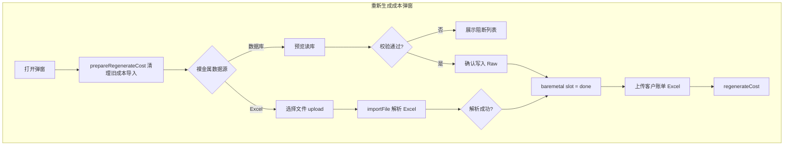

# 成本重新生成 · 裸金属数据源双通道实现方案

> 版本：v1.0  
> 日期：2026-06-17  
> 状态：**已定稿 — 实施中**  
> 入口：`/finance/[id]/cost` →「重新生成成本」弹窗  
> 组件：`apps/web/src/app/[locale]/(protected)/finance/[id]/cost/_components/cost-regenerate-dialog.tsx`  
> 关联：  
> - [billing-period-import-design.md](./billing-period-import-design.md) §3.2（裸金属 Excel Raw 格式）  
> - [bare-metal-order-schema-design.md](./bare-metal-order-schema-design.md) §5–§7（`bare_metal_order` / `bare_metal_order_device`）  
> - [finance-create-billing-period-dialog-plan.md](./finance-create-billing-period-dialog-plan.md)（收入读库 vs 成本 Excel 的双轨先例）

---

## 1. 背景与目标

### 1.1 现状

「重新生成成本」弹窗（`cost-regenerate-dialog.tsx`）当前要求用户 **手动上传两类 Excel**：

| 槽位 | 用途 | 当前实现 |
|------|------|----------|
| 裸金属消费订单列表 | 成本侧裸金属卡时与消费 | `importFile` → `billing_period_raw_baremetal_order` |
| 客户账单详情 | 成本侧弹性消费卡时 | `importFile` → `billing_period_raw_tenant_bill` |

裸金属槽位依赖平台导出的 Excel，列包括：订单 ID、租户 ID、**机房名称**、**设备型号（卡型 × 卡数）**、**购买数量（数量 × 时长包）**、最终总额、下单时间等（见 `BAREMETAL_HINT` 常量）。

与此同时，供应链域已落地规范化订单模型：

- **`bare_metal_order`**：订单头（租户、机房、金额、下单时间、`purchase_qty_text`、`device_count` 等）
- **`bare_metal_order_device`**：设备/租用明细（**卡型**、**卡数**、**时长(h)**、租用时段、行金额等）

数据来源包括：

- 平台 cron 同步（`order_mark = online`，`source = platform_sync`）
- 项目详情页线下 Excel 导入（`order_mark = offline`，`source = offline_excel`）

[`bare-metal-order-schema-design.md`](./bare-metal-order-schema-design.md) §6.2 曾明确 **本期不做** 与 `billing_period_raw_baremetal_order` 的关联；随着订单主数据成熟，财务成本侧应可 **直接读库**，减少重复导出/上传。

### 1.2 本期目标

在 **裸金属消费订单列表** 槽位增加 **数据源选项**：

| 选项 | 说明 |
|------|------|
| **从数据库读取** | 按账期时间窗查询 `bare_metal_order` + 明细，映射写入 `billing_period_raw_baremetal_order`，再走现有成本 pipeline |
| **上传 Excel** | 保持现网行为不变 |

**客户账单详情** 槽位 **不在本期范围**（仍仅支持 Excel 上传）。

### 1.3 非目标（本期）

- 不改造成本计算核心逻辑（`compute-cost-source-line.ts` / `computeBillingPeriodCost`）
- 不改变 `billing_period_raw_baremetal_order` 表结构
- 不在读库路径回写/修正 `bare_metal_order` 主数据
- 不扩展至 `/finance/create` 或「添加账期」弹窗（可二期复用同一 mapper）
- 读库路径 **不落盘原始文件**（与 Excel 路径的 `storage_path` 语义不同，见 §4.4）

### 1.4 设计原则

1. **Raw 表仍为唯一成本输入真源**：读库与 Excel 均须产出 **相同形状** 的 Raw 行，下游零改动。
2. **Replace-in-Period**：与现网一致，同一账期裸金属槽位仅保留 **一个有效 batch**；切换数据源或重复导入时覆盖旧 batch。
3. **可预览、可阻断**：读库路径在写入 Raw 前提供 **预览 + 校验摘要**；阻断规则与 Excel 路径对齐。
4. **溯源字段**：Raw 行 `raw_json` 写入 `{ source: 'db', bare_metal_order_id, ... }` 便于排查。

---

## 2. 数据映射

### 2.1 目标 Raw 形状（回顾）

成本 pipeline（`buildBaremetalSourceLines`）消费 `billing_period_raw_baremetal_order`，关键字段：

| Raw 列 | 成本用途 |
|--------|----------|
| `order_id` | 溯源、刊例价缺失提示 |
| `tenant_platform_id` | 租户绑定、AM 分成 |
| `idc_name` | 匹配 `data_center`（按名称） |
| `device_model` | 解析卡型 × 卡数 → `parseDeviceModel` |
| `purchase_qty_text` | 解析数量 × 时长包 → `parsePurchaseQty` → 卡时 |
| `device_qty` | 设备台数 |
| `final_amount` | 余额消费 / 总消费（成本侧） |
| `ordered_at` | 账期过滤、刊例价 as-of 日期 |
| `pay_status` | 仅统计已支付 |

卡时计算公式（现有，不变）：

```
card_hours = device_qty × card_count × package_qty × billingUnitToHours(billing_unit)
```

### 2.2 源表字段对照

#### 订单头 `bare_metal_order`

| 源列 | Raw 列 | 规则 |
|------|--------|------|
| `platform_order_id` | `order_id` | 线上订单优先；线下无平台 ID 时用内部 `id` 并前缀 `offline:` |
| `order_no` | `order_no` | 直传 |
| `platform_tenant_id` | `tenant_platform_id` | 直传 |
| `idc_name` 或 `data_center.name` | `idc_name` | 优先 `idc_name`；空则 JOIN `data_center.name`；仍空则 **阻断** |
| `pay_status` | `pay_status` | 直传；须满足 `isBaremetalPayStatusPaid` |
| `device_count` | `device_qty` | 直传；≤ 0 阻断 |
| `order_amount` / `refund_amount` / `final_amount` | 同名 | 直传 |
| `ordered_at` | `ordered_at` | 须在账期 `[period_start 00:00, period_end 23:59]`（东八区） |
| `purchase_qty_text` + `billing_unit` | `purchase_qty_text` | 头表已有则直传；否则 §2.4 从明细推导 |
| — | `device_model` | §2.3 从明细聚合 |
| `status` | `device_status` | 可选写入 |

#### 订单明细 `bare_metal_order_device`

| 源列 | 映射用途 |
|------|----------|
| `gpu_card_type.code` / `device_model_text` | 组成 `device_model` |
| `gpu_count` | `device_model` 中的卡数 |
| `duration_hours` | 推导 `purchase_qty_text`（头表缺失时） |
| `line_amount` | 异构订单拆行时分配 `final_amount` |
| `line_no` | 拆行排序、溯源 |

### 2.3 `device_model` 聚合规则

财务 Excel 约定格式：`{卡型code} x {卡数}`，如 `4090 x 8`（见 `parseDeviceModel`）。

| 场景 | 规则 |
|------|------|
| 明细 0 行 | **阻断**：「订单 {order_no} 无设备明细」 |
| 全部明细卡型+卡数一致 | `"{cardCode} x {gpuCount}"`，`cardCode = gpu_card_type.code ?? device_model_text` |
| 明细卡型/卡数不一致 | **拆分为多行 Raw**（见 §2.5），每行一个 homogenous `(cardCode, gpuCount)` 分组 |
| 卡型无法解析（无 FK 且无 text） | **阻断** |

### 2.4 `purchase_qty_text` 推导规则

标准格式：`{数量} x {时长包}`，如 `20 x 小时时长包`（见 `parsePurchaseQty`）。

**优先级：**

1. 头表 `purchase_qty_text` 非空且可解析 → **直用**
2. 头表 `billing_unit` + `purchase_qty` 非空 → 格式化为 `"{purchase_qty} x {unitLabel}时长包"`（`unitLabel` 映射：`hour→小时`, `day→24小时`, `week→7天`, `month→30天`）
3. 从明细 `duration_hours` 聚合推导（适用于线下单台租用明细）：
   - 若组内所有明细 `duration_hours` 相同且 `device_qty=1` → `"{duration_hours} x 小时时长包"`
   - 若组内为「每台相同小时包 × N 台」→ `"{hours_per_device} x 小时时长包"` + `device_qty = N`
   - 无法匹配已知时长包模式 → **阻断**，提示「请在订单头维护 purchase_qty_text 或调整明细时长」

> **说明**：线下导入样例（5090×4 租一整月）的 `duration_hours=744` 可映射为 `744 x 小时时长包` 或 `1 x 30天时长包`；为与刊例价 `(region × card × billing_unit)` 校验一致，推导时 **优先尝试匹配** `24小时/7天/30天/小时` 四类时长包关键字（与 Excel 解析器相同）。

### 2.5 异构订单拆行（多卡型/多规格）

当同一 `bare_metal_order` 内存在多组 `(cardCode, gpuCount)` 时，**一行 Raw 无法正确归因卡型与卡时**。处理：

1. 按 `(cardCode, gpuCount)` 分组明细；
2. 每组生成 **一条** Raw 行；
3. `order_id` 使用 `{platform_order_id}#{groupIndex}` 或 `{platform_order_id}:{line_no_from}-{line_no_to}` 保证唯一；
4. `final_amount` 分配：
   - 优先：组内 `SUM(line_amount)`（线下订单通常有行金额）；
   - 回退：按组内 `Σ(duration_hours × gpu_count)` 占订单总量比例 × 头表 `final_amount`；
5. `device_qty` = 组内明细行数；
6. `raw_json` 记录 `bare_metal_order_id`、`device_line_ids[]`、`split_reason: 'heterogeneous_devices'`。

拆行后 **刊例价校验、成本 source line** 均按 Raw 行独立处理，与上传多行 Excel 等价。

### 2.6 账期过滤与支付过滤

与 Excel 路径一致（`mapBaremetalRows`）：

```sql
WHERE ordered_at >= :period_start 00:00:00 +08:00
  AND ordered_at <= :period_end   23:59:59 +08:00
  AND isBaremetalPayStatusPaid(pay_status)
```

**订单范围：**

- 默认包含 `online` + `offline` 全部 `order_mark`
- 可选 UI 筛选项（建议 v1 不做，减少复杂度）：仅线上 / 仅线下

---

## 3. 端到端流程



**与现网差异**：仅裸金属槽位增加分支；`canConfirm` 条件不变（裸金属 + 客户账单均 `done`）。

---

## 4. 后端设计

### 4.1 新增模块

| 模块 | 路径（建议） | 职责 |
|------|--------------|------|
| Mapper | `apps/web/src/lib/server/dataaccess/finance/baremetal-db-import.ts` | 查询订单、映射 Raw、校验 |
| 类型 | 同上或 `baremetal-db-import-types.ts` | Preview DTO、Issue 结构 |

**依赖复用：**

- `parseDeviceModel` / `parsePurchaseQty` / `parseDeviceQty` — `baremetal-order-parse.ts`
- `isBaremetalPayStatusPaid` — 从 `import.ts` **抽取** 到 `baremetal-order-parse.ts`（避免 finance↔finance 循环依赖）
- `newId`、batch 写入模式 — 参考 `importExcelFile` baremetal 分支

### 4.2 tRPC 接口

在 `finance.periods` router 新增：

#### `previewBaremetalFromDb`（query 或 mutation）

```typescript
input: {
  billingPeriodId: string
}
output: {
  totalCandidates: number      // 账期内已支付订单数
  validRows: number              // 可写入 Raw 行数（含拆行后）
  skippedPaidFilter: number
  issues: Array<{
    orderId: string
    orderNo: string | null
    level: 'error' | 'warning'
    code: string                 // e.g. MISSING_IDC, HETEROGENEOUS_SPLIT
    message: string
  }>
  preview: Array<{               // 最多 50 行，供 UI 表格
    orderId: string
    tenantPlatformId: string
    idcName: string
    deviceModel: string
    purchaseQtyText: string
    deviceQty: number
    finalAmount: string
    orderedAt: string
    sourceOrderMark: 'online' | 'offline'
  }>
}
```

#### `importBaremetalFromDb`（mutation）

```typescript
input: {
  billingPeriodId: string
  preserveIncomeDerived?: boolean  // 默认 true，与 regenerate 场景一致
}
output: {
  ok: boolean
  message: string
  rowCount: number
  batchId: string
}
```

**行为：**

1. 读取账期 `period_start` / `period_end`；
2. 调用 mapper 生成全部 Raw 行；
3. 若存在 **error 级** issue → 抛 `FinanceError`，**不写入**；
4. 事务内：
   - DELETE 本账期既有 `baremetal_order` batch（与 Excel 上传相同 replace 语义）；
   - INSERT `billing_period_import_batch`：
     - `file_type = 'baremetal_order'`
     - `file_name = 'db:bare_metal_order'`
     - `storage_path = null`（或 sentinel `db-import/{periodId}/{timestamp}` 占位，**不存文件**）
     - `parse_status = 'ok'`
   - INSERT `billing_period_raw_baremetal_order` 行，`raw_json` 含 DB 溯源。

> **权限**：`adminProcedure`，与 `importFile` 一致。

### 4.3 查询 SQL 概要

```sql
SELECT o.*, dc.name AS data_center_name
FROM bare_metal_order o
LEFT JOIN data_center dc ON dc.id = o.data_center_id
WHERE o.ordered_at BETWEEN :start AND :end
  AND (pay_status 满足已支付)
ORDER BY o.ordered_at, o.id;

-- 明细批量加载
SELECT d.*, g.code AS gpu_card_type_code
FROM bare_metal_order_device d
LEFT JOIN gpu_card_type g ON g.id = d.gpu_card_type_id
WHERE d.bare_metal_order_id IN (:orderIds)
ORDER BY d.bare_metal_order_id, d.line_no;
```

### 4.4 Batch 元数据约定

| 字段 | Excel 路径 | 读库路径 |
|------|------------|----------|
| `file_name` | 用户文件名 | `db:bare_metal_order` |
| `storage_path` | 磁盘路径 | `null` |
| `file_sha256` | 文件 hash | `null` 或 hash(preview JSON) |
| `uploaded_by` | 操作人 | 操作人 |

`purgeCostImportsForRegenerate` 删除 batch 时，对 `storage_path = null` **跳过** `deleteStorageFile`（需补 **空值守卫**，避免现网报错）。

---

## 5. 前端设计

### 5.1 UI 结构（裸金属槽位）

在现有「裸金属消费订单列表」卡片内增加 **数据源 RadioGroup**：

```
○ 从数据库读取（推荐）
    说明：读取账期内已同步/导入的裸金属订单（含机房、卡型、时长）
    [预览订单]  →  展示摘要 + 前 N 行表格
    [确认导入]  →  写入并标记 slot done

○ 上传 Excel
    （保持现有文件选择 + 解析状态 UI）
```

**默认选中**：`从数据库读取`（与 `finance-create-billing-period-dialog-plan` 收入侧读库策略一致）。

### 5.2 状态扩展

```typescript
type BaremetalSourceMode = 'database' | 'excel'

type SlotState = {
  mode: BaremetalSourceMode
  file: File | null
  status: 'empty' | 'loading' | 'preview' | 'done' | 'error'
  message: string
  rowCount: number
  preview?: PreviewBaremetalRow[]  // 读库预览
  issues?: ImportIssue[]
}
```

**状态机：**

| 模式 | 到达 `done` 的条件 |
|------|-------------------|
| `database` | `importBaremetalFromDb` 成功 |
| `excel` | 现网 `importFile` 成功 |

切换模式时 **重置** 该槽位状态（不清 windowId / tenantBill）。

### 5.3 预览弹窗 / 内联表格

读库路径点击「预览订单」：

- 调用 `previewBaremetalFromDb`
- 展示：候选订单数、有效 Raw 行数、warning/error 列表
- 表格列：订单号、租户 ID、机房、设备型号、购买数量、设备数、最终总额、下单时间、来源（线上/线下）
- error > 0：**禁用**「确认导入」，引导修正主数据或改选 Excel
- warning（如拆行）：允许导入，文案说明

「确认导入」成功后：`status = done`，`message = 已从数据库导入 N 行`。

### 5.4 文案调整

- `DialogDescription` 补充：裸金属支持 **从数据库读取** 或 **上传 Excel**。
- `BAREMETAL_HINT` 拆为两条：读库说明 + Excel 列说明（条件渲染）。

---

## 6. 校验与错误处理

### 6.1 阻断规则（与 Excel 对齐）

| 编号 | 条件 | 提示 |
|------|------|------|
| V-D1 | 账期内无已支付订单 | 「账期内无符合条件的裸金属订单」 |
| V-D2 | 缺少 `tenant_platform_id` | 订单级 error |
| V-D3 | 缺少可匹配 `idc_name` | 订单级 error |
| V-D4 | 无法组成合法 `device_model` | 订单级 error |
| V-D5 | 无法组成合法 `purchase_qty_text` | 订单级 error |
| V-D6 | `device_qty` 无效 | 订单级 error |
| V-D7 | `final_amount` 缺失或 < 0 | 订单级 error |
| V-D8 | `ordered_at` 不在账期 | 查询层已过滤；若脏数据漏入则 error |

### 6.2 警告（不阻断导入）

| 编号 | 条件 | 说明 |
|------|------|------|
| W-D1 | 异构订单拆行 | 告知拆行数与金额分配方式 |
| W-D2 | 头表 `data_center_id` 为空但 `idc_name` 有值 | 仍可匹配，提示未关联主数据 |
| W-D3 | 线下订单无 `platform_order_id` | 使用 `offline:{id}` 作为 Raw order_id |

### 6.3 错误报告

- 读库路径 **不提供** Excel 高亮下载（无单元格概念）；
- 提供 **可复制的错误清单** 或 **CSV 导出**（二期可选）；
- 每条 error 附 **订单详情页链接** `/supplier/bare-metal-orders/{id}` 便于修正。

### 6.4 计算阶段

写入 Raw 后，`regenerateCost` / `validate` / `findMissingBaremetalPlatformListPrice` **无需改动**——仍基于 Raw 字段解析。

---

## 7. 边界场景

| 场景 | 处理 |
|------|------|
| 平台 cron 尚未同步完账期订单 | 读库结果偏少；用户可改选 Excel 或等待同步后重试 |
| 线上订单仅有占位明细、未 device 补全 | 缺 `duration_hours` / 卡型 → 阻断并提示「待平台补全」 |
| 同一账期先 Excel 后读库 | 新 batch 覆盖旧 batch（replace） |
| 读库后再 Excel | 同上 |
| 订单重复（平台 ID 唯一） | 数据库层唯一；Raw 一行对一订单（或拆行组） |
| 时区 | 与 Excel 一致，东八区日界 |

---

## 8. 实施步骤

| 阶段 | 任务 | 产出 |
|------|------|------|
| **P1** | 抽取 `isBaremetalPayStatusPaid`；实现 `baremetal-db-import.ts` mapper + 单元测试 | 映射逻辑可测 |
| **P2** | tRPC `previewBaremetalFromDb` / `importBaremetalFromDb`；`purge-cost` 空 path 守卫 | 后端可独立验证 |
| **P3** | `cost-regenerate-dialog.tsx` UI：Radio、预览、确认导入 | 用户可走完读库路径 |
| **P4** | 联调 `regenerateCost` + missing pricing 提示 | 端到端通过 |
| **P5**（可选） | `/finance/create`、添加账期弹窗复用同一组件/props | 体验一致 |

### 8.1 测试要点

- [ ] 账期仅含 online 订单：读库 rowCount 与列表页过滤一致
- [ ] 含 offline 项目导入订单：device_model / duration 正确映射
- [ ] 异构卡型订单：拆行后卡时之和与手工 Excel 接近（允许四舍五入误差）
- [ ] 缺机房/缺卡型：preview 报 error，import 被拒绝
- [ ] 读库 → regenerateCost → source-lines 页 `kind=baremetal` 行数正确
- [ ] 读库与 Excel 对同一账期产出 **相同** cost 汇总（金标准对比）
- [ ] `prepareRegenerateCost` 后切换数据源无残留 batch

---

## 9. 待确认问题

| # | 问题 | 建议默认 |
|---|------|----------|
| Q1 | 读库是否包含 `offline` 订单？ | **包含**（线下单也是成本事实来源） |
| Q2 | 异构订单拆行时 `order_id` 后缀方案 | `{platform_order_id}#G{n}` |
| Q3 | 预览表格是否需要展示全部订单 | 预览 **50 行** + 总数；导入写全量 |
| Q4 | 是否在 create 弹窗同步上线 | 本期 **仅 cost-regenerate**；create 二期 |
| Q5 | `storage_path = null` 是否可接受 | 可接受；purge 需空值守卫 |

---

## 10. 文档与关联变更

实施完成后更新：

- [billing-period-import-design.md](./billing-period-import-design.md) §3.2 增加「读库替代 Excel」脚注
- [bare-metal-order-schema-design.md](./bare-metal-order-schema-design.md) §6.2 将「Raw 解析后可选 upsert 订单表」补充反向链路：**订单表 → Raw 导入**

---

## 变更记录

| 版本 | 日期 | 说明 |
|------|------|------|
| v1.0 | 2026-06-17 | 初稿：成本重新生成弹窗裸金属双通道（读库 / Excel） |
