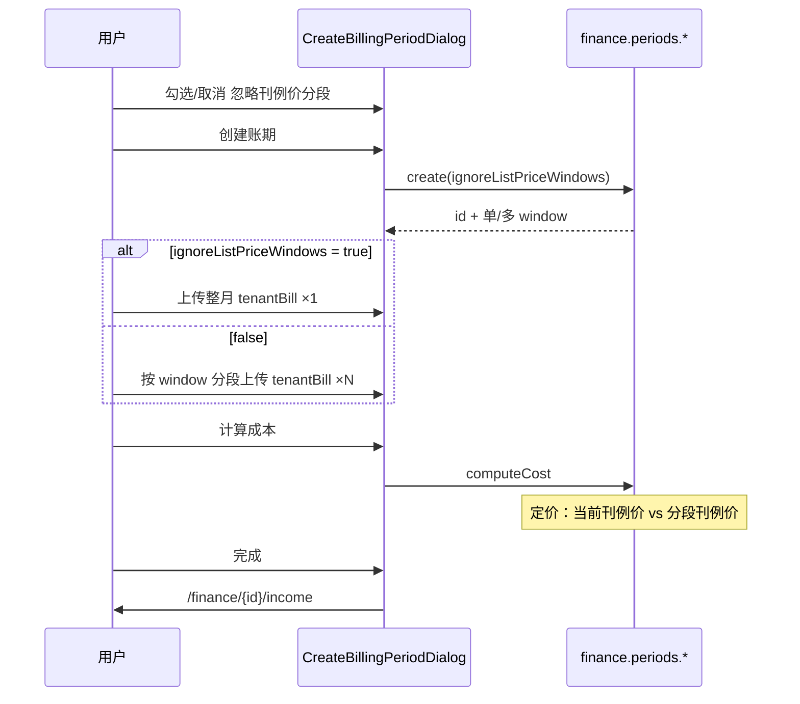

# 添加账期弹窗实现方案

> 版本：v1.1  
> 日期：2026-05-29  
> 状态：**设计稿 — 待确认后编码**  
> 入口：`/finance` 账期列表页「添加账期」按钮  
> 组件：`apps/web/src/app/[locale]/(protected)/finance/create/_components/create-billing-period-dialog.tsx`  
> 关联：  
> - `finance-single-period-income-design.md`（CRM 账单读库算收入）  
> - `billing-period-import-design.md`（成本 Excel 导入与计算）  
> - `single-income-recompute-dialog.tsx`（收入校验字段参考，**不引用 create 页代码**）

---

## 1. 背景与已确认决策

### 1.1 业务目标

在账期列表页通过弹窗完成：

1. **创建账期**（元数据）
2. **计算收入** — 读 CRM `tenant_bill`，无需上传 Excel
3. **计算成本** — 上传裸金属 + 客户账单详情 Excel，走现有成本 pipeline

收入与成本 **可独立操作**，互不影响。

### 1.2 已确认产品决策

| # | 决策 | 说明 |
|---|------|------|
| D1 | 完成后跳转 | 点击「完成并查看详情」→ **`/finance/{billingPeriodId}/income`**（本期收入页） |
| D2 | 收入交互 | **直接「计算收入」**，不提供试算预览步骤 |
| D3 | 刊例价分段 | 通过 **「忽略刊例价分段」选项**（见 §3.4）处理；开启后按 **当前有效刊例价** 整月计算；配置缺失则 **报错并停止** |
| D4 | 旧页面 | **`/finance/create` 暂时保留**；新弹窗 **不得引用** create 页及其私有 helper（独立实现或抽取到 `_components` / `_lib` 公共层） |
| D5 | 弹窗默认策略 | 本弹窗 **默认勾选**「忽略刊例价分段」；用户可取消以走现网多窗口流程（与 `/finance/create` 一致） |

### 1.3 非目标（本期）

- 不改造 `/finance/create` 全流程页面（但现网将在该页 **同步增加** 同一选项，见 §3.4）
- 不在弹窗内实现「发布账期」
- 不在弹窗内编辑补充消费（跳转收入页后处理）

---

## 2. 架构与代码边界

```mermaid
flowchart TB
  subgraph entry [入口]
    L["/finance 账期列表"]
    B["添加账期 Button"]
    D["CreateBillingPeriodDialog"]
  end

  subgraph platform [现网共用能力 — 本期一并落地]
    OPT["ignoreListPriceWindows 账期选项"]
    SYNC["syncTenantBillWindows 单/多窗口"]
    PRICE["成本定价：当前刊例价 vs 分段刊例价"]
  end

  subgraph isolated [新功能独立代码]
    D
    U["billing-period-upload-slot.tsx 可选"]
    V["billing-period-inline-alerts.tsx 可选"]
  end

  subgraph legacy [暂不改动逻辑 / 不引用私有 helper]
    C["/finance/create/page.tsx"]
    CHelpers["create 页内 BillingPeriodFormCard 等"]
  end

  L --> B --> D
  D --> OPT
  OPT --> SYNC
  OPT --> PRICE
  D -.->|禁止 import| CHelpers
```



### 2.1 文件清单（编码阶段）

| 文件 | 职责 |
|------|------|
| `finance/create/_components/create-billing-period-dialog.tsx` | 主弹窗：创建 / 算收入 / 算成本 |
| `components/dashboard/finance-billing-periods-content.tsx` | 挂载弹窗、`onPeriodReady` 跳转收入页 |
| `finance/create/page.tsx`（现网） | **增加同一选项** UI；勾选行为与弹窗一致 |
| `_components/billing-period-file-upload-slot.tsx`（新建，可选） | 通用 Excel 上传槽 UI |
| `_components/billing-period-inline-alerts.tsx`（新建，可选） | 成本缺失定价 / 分成 / 导入错误内联提示 |
| 后端 / schema | 账期字段 + create / validate / compute / import 配套（§6） |

**禁止**：新弹窗从 `finance/create/page.tsx` import 任何 symbol；选项相关的 **展示组件** 可抽到 `finance/_components/` 供两处复用。

---

## 3. 弹窗交互设计

### 3.1 阶段划分

| 阶段 | 标题 | 内容 |
|------|------|------|
| `create` | 添加账期 | 元数据 + **忽略刊例价分段** 选项 |
| `manage` | 账期 {code} | 收入区块 + 成本区块（创建成功后进入） |

关闭弹窗时 **重置全部本地状态**（含选项恢复默认勾选）。

### 3.2 Wireframe（create 阶段）

```
┌──────────────────────────────────────────────────────────────┐
│ 添加账期                                          [×]         │
│ 填写账期信息后创建；创建成功后可分别计算收入与成本              │
├──────────────────────────────────────────────────────────────┤
│ period_code    period_start    period_end                     │
│                                                               │
│ [✓] 忽略刊例价分段，按当前有效刊例价计算                        │
│     开启：整月上传一份客户账单，不按刊例价变动日切分              │
│     关闭：与现网一致，刊例价变动时需按时间段分别上传              │
│                                                               │
│                              [取消]  [创建账期]                │
└──────────────────────────────────────────────────────────────┘
```

### 3.3 Wireframe（manage 阶段）

```
┌──────────────────────────────────────────────────────────────┐
│ 账期 2026-05                                    [×]           │
│ 2026-05-01 ~ 2026-05-31 · 忽略刊例价分段：是/否               │
├──────────────────────────────────────────────────────────────┤
│ ✓ 账期已创建  [2026-05]  [忽略刊例价分段 ✓]                   │
├──────────────────────────────────────────────────────────────┤
│ 计算收入 …（同 v1.0，读库无 Excel）                            │
├──────────────────────────────────────────────────────────────┤
│ 计算成本                                                      │
│ 若 忽略刊例价分段=是：                                          │
│   ┌ 裸金属 ─┐  ┌ 客户账单详情 (整月 start~end) ─┐             │
│ 若 忽略刊例价分段=否：                                          │
│   ┌ 裸金属 ─┐  ┌ 客户账单 (window1) ─┐ ┌ window2 ─┐ …       │
│ ⚠ 成本前置校验                                                │
│                                    [计算成本] / [重新计算成本]  │
├──────────────────────────────────────────────────────────────┤
│                              [关闭]  [完成并查看详情]          │
└──────────────────────────────────────────────────────────────┘
```

### 3.4 「忽略刊例价分段」选项（现网共用）

| 项 | 说明 |
|----|------|
| 字段名（建议） | `ignoreListPriceWindows: boolean` |
| 持久化 | 写入 `billing_period`（或等价账期元数据）；创建后 **不可修改** |
| 现网 `/finance/create` | 创建表单增加 **同一 Checkbox**；默认 **不勾选**（保持现网行为） |
| 本弹窗 | 默认 **勾选**（D5）；满足「快速添加账期、整月当前价」场景 |
| 开启时 | 见 §6.2 |
| 关闭时 | 完全沿用现网：`detectPriceWindows` 多段、`validate` 要求每段 tenantBill 均上传 |

**说明文案（建议）**：

> 忽略刊例价分段：不按账期内刊例价变动日期切分上传窗口；成本计算统一采用 **账期结束日** 当前有效的平台刊例价。若区域×卡型缺少刊例价或成本配置，将报错并停止。

### 3.5 按钮与跳转

| 按钮 | 条件 | 行为 |
|------|------|------|
| 创建账期 | 表单合法 | `periods.create({ ..., ignoreListPriceWindows })` → `manage` |
| 计算收入 | `validateSingleIncome.canComputeSingleIncome` | `computeSingleIncome` |
| 计算成本 | 上传就绪 + `validate.canComputeCost` | 见 §4.3 |
| 重新计算成本 | 已有成本 | `prepareRegenerateCost` → 重传 → `regenerateCost` |
| 完成并查看详情 | 至少完成收入或成本之一 | → `/finance/{id}/income` |
| 关闭 | 任意 | 关闭弹窗 |

---

## 4. tRPC 接入明细

### 4.1 创建账期

```typescript
const created = await createPeriod.mutateAsync({
  periodCode: periodCode.trim(),
  periodStart,
  periodEnd,
  ignoreListPriceWindows, // 新增
})
```

| 错误码 | UI |
|--------|-----|
| `CONFLICT` | 账期编码已存在 |
| `BAD_REQUEST` | 日期不合法 |

创建成功后：

- `validateSingleIncome`
- `validate`（含 `windows`、选项相关字段）

### 4.2 计算收入

与 v1.0 相同：`validateSingleIncome` + `computeSingleIncome`；**不受** `ignoreListPriceWindows` 影响。

### 4.3 计算成本

#### 上传槽位（随选项分支）

| `ignoreListPriceWindows` | 裸金属 | 客户账单详情 |
|--------------------------|--------|--------------|
| `true` | 1 份 | **1 份**（整月 `period_start ~ period_end`） |
| `false` | 1 份 | **N 份**（`validate.windows` 每段各 1 份） |

`importFile` 参数不变；`tenantBill` 需传对应 `windowId`。

#### 计算

```typescript
await computeCost({ billingPeriodId })
// 或 regenerateCost({ billingPeriodId })
```

后端根据账期 persisted 的 `ignoreListPriceWindows` 选择定价策略（§6.2），**前端无需再传 flag**。

`importFile` 重算路径仍传 `preserveIncomeDerived: true`。

#### 成本前置校验

| 字段 | 含义 |
|------|------|
| `missingPricing` | 缺刊例价/成本 → **报错停止** |
| `pendingAllocations` | 缺成本分成 |
| `canComputeCost` | 按钮 disabled |
| `windows` | `false` 时驱动多上传槽；`true` 时长度应为 1 |

### 4.4 完成跳转

```typescript
router.push(`/finance/${period.id}/income`)
```

---

## 5. 端到端流程



---

## 6. 后端配套（现网一并实现）

### 6.1 权限

不变：`create`、`importFile`、`computeSingleIncome`、`computeCost`、`prepareRegenerateCost`、`regenerateCost` 均为 `adminProcedure`。

### 6.2 `ignoreListPriceWindows = true` 行为

| 环节 | 行为 |
|------|------|
| **create** | 持久化 `ignore_list_price_windows = true` |
| **syncTenantBillWindows** | 强制 **仅 1 个** window：`period_start ~ period_end`，不随刊例价 cutDates 切分 |
| **validate.canComputeCost** | 仅要求 **1 个** tenantBill window parse ok + baremetal ok |
| **成本定价解析** | 区域×卡型统一取 **`period_end` 当日** 当前有效平台刊例价（`resolvePlatformListPriceAt(asOf = period_end)`）；**不按 window 分段取价** |
| **缺失配置** | 任一所需 `(区域×GPU)` 无刊例价或无供应商成本 → `UNPROCESSABLE` / `PRECONDITION_FAILED`，**停止计算** |
| **computeCost / regenerateCost** | 读取账期 flag，走上述定价分支；`mode` 逻辑不变 |

### 6.3 `ignoreListPriceWindows = false` 行为

与 **现网完全一致**：多 window、`validate` 全段上传、分段刊例价。

### 6.4 API / Schema 变更（建议）

| 位置 | 变更 |
|------|------|
| `billing_period` 表 | 新增 `ignore_list_price_windows boolean NOT NULL DEFAULT false` |
| `periodCreateSchema` | 新增 `ignoreListPriceWindows: z.boolean().optional().default(false)` |
| `periods.create` | 传入 data access；触发单 window sync |
| `syncTenantBillWindowsForPeriod` | 若 flag=true，跳过 `detectPlatformListPriceWindows` 切分 |
| `validatePeriod` | flag=true 时 `tenantBillReady` 仅校验 1 window |
| `compute-cost` 定价快照 | flag=true 时使用 `period_end` 单点刊例价 |
| `periods.getById` / `getBundle` | 返回 `ignore_list_price_windows` 供 UI 展示 |
| `/finance/create` 页 | create 表单增加 checkbox，传同一字段 |

### 6.5 `/finance/[id]/page.tsx`

仍不实现 hub 页；列表 → `/income`、`/cost` 子路由。

---

## 7. 实施步骤

| 步骤 | 内容 | 产出 |
|------|------|------|
| **0** | Schema + 后端 flag 全链路（§6.2～6.4） | 现网与弹窗共用能力 |
| **1** | `/finance/create` 增加选项 UI（默认不勾选） | 现网页面可用手动选项 |
| **2** | 弹窗接入 `create` + 选项（默认勾选） | 可创建真实账期 |
| **3** | 收入：`validateSingleIncome` + `computeSingleIncome` | 读库算收入 |
| **4** | 成本：按 flag 渲染 1/N 上传槽 + `importFile` + `validate` | 可上传 |
| **5** | `computeCost` / regenerate 分支 + 错误明细下载 | 可算成本 |
| **6** | 列表页跳转 `/finance/{id}/income` | 闭环 |

### 7.1 测试计划

- [ ] `ignoreListPriceWindows=true`：刊例价月中变动账期，仅 1 份 tenantBill 可算成本
- [ ] `ignoreListPriceWindows=true`：缺刊例价/成本 → 报错停止，不部分计算
- [ ] `ignoreListPriceWindows=false`：多 window 行为与现网一致
- [ ] 弹窗默认勾选；create 页默认不勾选
- [ ] 创建后 flag 不可改；manage 阶段只读展示
- [ ] 收入/成本独立计算、`preserveIncomeDerived` 不重算收入
- [ ] 完成后跳转收入页
- [ ] `/finance/create` 原流程（未勾选选项）无回归

---

## 8. 确认清单

- [x] D1：完成后跳转 **`/finance/{id}/income`**
- [x] D2：收入直接 **`computeSingleIncome`**
- [x] D3：通过 **「忽略刊例价分段」选项** + 当前刊例价；缺失则报错停止
- [x] D4：保留 `/finance/create`；弹窗不引用其私有代码
- [x] D5：弹窗 **默认勾选**；现网 create 页 **默认不勾选**
- [x] §6.2：现网增加账期级选项，后端单 window + 单点定价，**替代** v1.0 的 B1/B2 方案

**确认后即可按 §7 步骤修改代码。**
