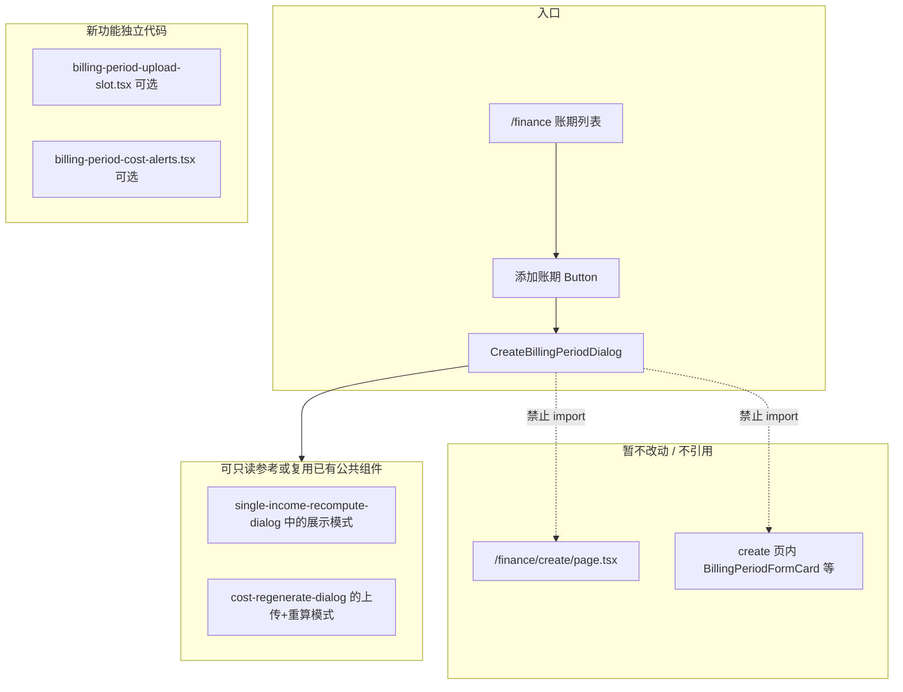
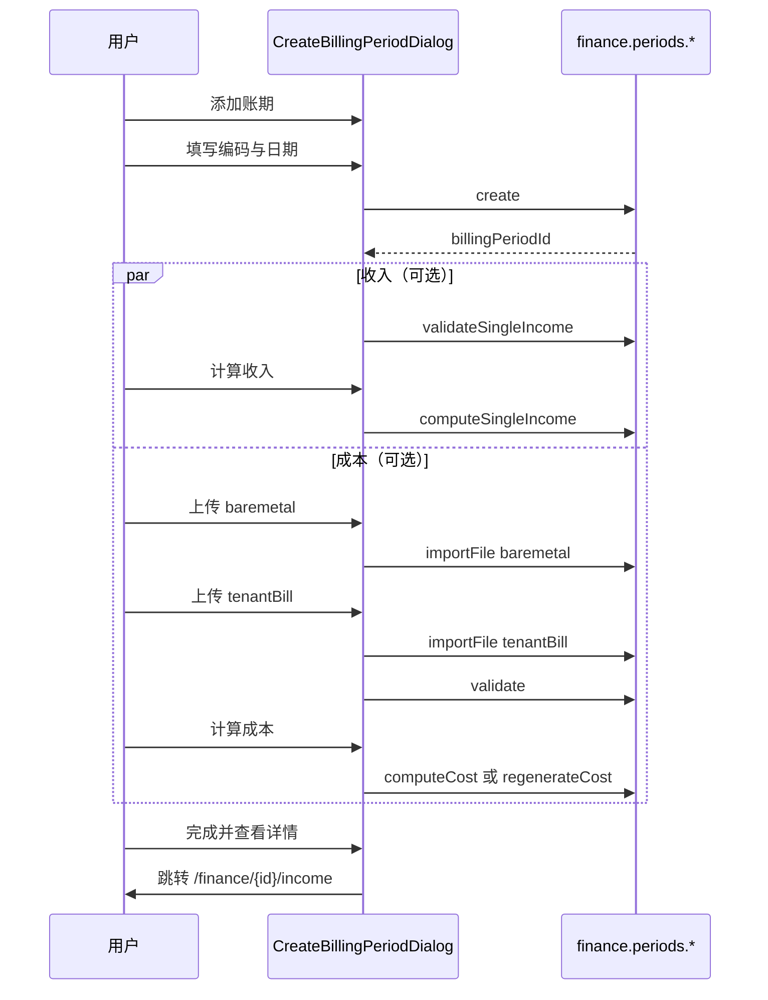

# 添加账期弹窗实现方案

> 版本：v1.0（已定稿 — **待确认后编码**）  
> 日期：2026-05-29  
> 状态：**设计稿 — 不涉及代码修改**  
> 入口：`/finance` 账期列表页「添加账期」按钮  
> 组件：`apps/web/src/app/[locale]/(protected)/finance/create/_components/create-billing-period-dialog.tsx`  
> 关联：  
> - `finance-single-period-income-design.md`（CRM 账单读库算收入）  
> - `billing-period-import-design.md`（成本 Excel 导入与计算）  
> - `single-income-recompute-dialog.tsx`（收入校验字段参考，**不引用 create 页代码**）

---

## 1. 背景与已确认决策

### 1.1 业务目标

在账期列表页通过弹窗完成：

1. **创建账期**（元数据）
2. **计算收入** — 读 CRM `tenant_bill`，无需上传 Excel
3. **计算成本** — 上传裸金属 + 客户账单详情 Excel，走现有成本 pipeline

收入与成本 **可独立操作**，互不影响。

### 1.2 已确认产品决策

| # | 决策 | 说明 |
|---|------|------|
| D1 | 完成后跳转 | 点击「完成并查看详情」→ **`/finance/{billingPeriodId}/income`**（本期收入页） |
| D2 | 收入交互 | **直接「计算收入」**，不提供试算预览步骤 |
| D3 | 刊例价分段 | **不考虑**账期内刊例价变动多窗口；按 **当前有效刊例价** 计算；配置缺失则 **报错并停止** |
| D4 | 旧页面 | **`/finance/create` 暂时保留**；新弹窗 **不得引用** create 页及其私有 helper（独立实现或抽取到 `_components` / `_lib` 公共层） |

### 1.3 非目标（本期）

- 不改造 `/finance/create` 全流程页面
- 不在弹窗内实现「发布账期」
- 不在弹窗内编辑补充消费（跳转收入页后处理）
- 不新增后端 API（优先复用现有 tRPC）；若 D3 与现有多 window 校验冲突，见 §6.2

---

## 2. 架构与代码边界



### 2.1 文件清单（编码阶段）

| 文件 | 职责 |
|------|------|
| `finance/create/_components/create-billing-period-dialog.tsx` | 主弹窗：创建 / 算收入 / 算成本 |
| `components/dashboard/finance-billing-periods-content.tsx` | 挂载弹窗、`onPeriodReady` 跳转收入页 |
| `_components/billing-period-file-upload-slot.tsx`（新建，可选） | 通用 Excel 上传槽 UI |
| `_components/billing-period-inline-alerts.tsx`（新建，可选） | 成本缺失定价 / 分成 / 导入错误内联提示 |

**禁止**：从 `finance/create/page.tsx` import 任何 symbol。

---

## 3. 弹窗交互设计

### 3.1 阶段划分

| 阶段 | 标题 | 内容 |
|------|------|------|
| `create` | 添加账期 | `period_code`、`period_start`、`period_end` |
| `manage` | 账期 {code} | 收入区块 + 成本区块（创建成功后进入） |

关闭弹窗时 **重置全部本地状态**。

### 3.2 Wireframe（manage 阶段）

```
┌──────────────────────────────────────────────────────────────┐
│ 账期 2026-05                                    [×]           │
│ 2026-05-01 ~ 2026-05-31 · 收入与成本可独立计算                  │
├──────────────────────────────────────────────────────────────┤
│ ✓ 账期已创建  [2026-05]  2026-05-01 ~ 2026-05-31              │
├──────────────────────────────────────────────────────────────┤
│ 计算收入                                                      │
│ 基于 CRM tenant_bill 读库，无需上传 Excel                      │
│ ┌ 数据来源说明（INCOME_FLOW_STEPS 列表）────────────────┐   │
│ └────────────────────────────────────────────────────────┘   │
│ ⚠ 校验问题（validateSingleIncome：缺账单项目等，有则展示）     │
│                                    [计算收入] / [重新计算收入]  │
├──────────────────────────────────────────────────────────────┤
│ 计算成本                                                      │
│ 上传裸金属 + 客户账单详情（整月）                               │
│ ┌ 裸金属消费订单 ─ 选择文件 ─────────────────────────────┐   │
│ └ 客户账单详情 (start ~ end) ─ 选择文件 ─────────────────┘   │
│ ⚠ 成本前置校验（missingPricing / pendingAllocations 等）      │
│                                    [计算成本] / [重新计算成本]  │
├──────────────────────────────────────────────────────────────┤
│                              [关闭]  [完成并查看详情]          │
└──────────────────────────────────────────────────────────────┘
```

### 3.3 按钮与跳转

| 按钮 | 条件 | 行为 |
|------|------|------|
| 创建账期 | 表单合法 | `periods.create` → 进入 `manage` |
| 计算收入 | `validateSingleIncome.canComputeSingleIncome` | `computeSingleIncome`（无 preview） |
| 重新计算收入 | 已成功算过收入 | 再次 `computeSingleIncome` |
| 计算成本 | baremetal + tenantBill 均 parse ok，且 `validate.canComputeCost` | 见 §4.3 |
| 重新计算成本 | 已有成本结果 | `prepareRegenerateCost` → 重传 → `regenerateCost` |
| 完成并查看详情 | 至少完成收入或成本之一 | `list.invalidate` → `router.push(/finance/{id}/income)` |
| 关闭 | 任意 | 关闭弹窗，不跳转 |

---

## 4. tRPC 接入明细

### 4.1 创建账期

```typescript
const created = await createPeriod.mutateAsync({
  periodCode: periodCode.trim(),
  periodStart,
  periodEnd,
})
setCreatedPeriod({
  id: created.id,
  periodCode: created.period_code,
  periodStart: created.period_start,
  periodEnd: created.period_end,
})
setPhase('manage')
```

| 错误码 | UI |
|--------|-----|
| `CONFLICT` | 内联：账期编码已存在 |
| `BAD_REQUEST` | 内联：日期不合法 |

创建成功后立即启用：

- `periods.validateSingleIncome({ billingPeriodId })`
- `periods.validate({ billingPeriodId })`（成本区块轮询/失效刷新）

### 4.2 计算收入（读库，无 Excel）

**使用接口**（不用 `computeIncome`）：

| 顺序 | API | 说明 |
|------|-----|------|
| 1 | `validateSingleIncome` | manage 阶段常驻 query；驱动按钮 disabled 与问题列表 |
| 2 | `computeSingleIncome` | 用户点击「计算收入」直接写入 |

**不使用**：`previewSingleIncome`、`computeIncome`、`importFile(slot: 'customer')`。

**校验展示**（`canComputeSingleIncome === false` 时）：

- `projectsMissingBill` — 无对应 CRM 月度账单的项目
- `sharedPlatformTenantWarnings` — 同 platform_tenant_id 多项目
- `issueRows` — 汇总问题（可简化列表，不必做试算表格）

**成功**：`toast.success` + `getBundle.invalidate` + `validateSingleIncome.invalidate` + 标记 `incomeComputed = true`。

**失败**：`toast.error` + 保留弹窗；后端返回的缺失账单/冲突信息原样展示。

### 4.3 计算成本（Excel + 现有 pipeline）

#### 上传

| 槽位 | `importFile.slot` | 说明 |
|------|-------------------|------|
| 裸金属消费订单 | `baremetal` | 必选 |
| 客户账单详情（整月） | `tenantBill` | 必选；`windowId` 见 §4.3.1 |

上传实现：

- 文件 → `fileToBase64`（使用 `@/lib/utils/file-to-base64`，与 cost-regenerate-dialog 一致）
- 解析结果更新本地 slot 状态；失败时展示 `message`，若有 `hasErrorReport` 则提供「下载错误明细」→ `downloadImportErrorReport`

#### 4.3.1 客户账单 windowId（D3）

产品要求：**不做刊例价分段多上传 UI**。

实现约定：

1. 创建账期后，从 `validate.windows` 取 **覆盖整账期** 的窗口：  
   `windowStart === period_start && windowEnd === period_end`
2. 若存在唯一匹配窗口 → 上传时传入其 `windowId`
3. 若 **不存在** 或 **存在多个** 整月窗口 → 内联报错，**禁止计算成本**，提示用户（文案示例：「无法确定账单上传窗口，请联系管理员」）
4. 若后端因刊例价变动生成 **多个非整月子窗口** 且校验要求全部上传 → 属 D3 与现网后端差异，见 §6.2

#### 首次计算 vs 重新计算

```typescript
const isCostRegenerate = (validation?.slots?.baremetal?.parseStatus === 'ok'
  && bundle?.cost?.length > 0)
  || period.status === 'computed' // 且已有 cost 行

if (isCostRegenerate) {
  await prepareRegenerateCost({ billingPeriodId })
  // 用户重新上传 baremetal + tenantBill（preserveIncomeDerived: true）
  await regenerateCost({ billingPeriodId })
} else {
  await computeCost({ billingPeriodId }) // mode: create
}
```

`importFile` 在重算路径上传 tenantBill / baremetal 时传 **`preserveIncomeDerived: true`**，避免清空已算收入。

#### 成本前置校验（`validate`）

在成本区块展示（内联 Alert，不用 toast 替代阻断说明）：

| 字段 | 含义 |
|------|------|
| `missingPricing` | 区域×卡型缺刊例价/成本配置 → **报错停止**（D3） |
| `pendingAllocations` | 缺成本分成配置 |
| `canComputeCost` | 控制「计算成本」按钮 |
| `slots.*.parseStatus` | 上传是否成功 |

计算失败时：后端 `PRECONDITION_FAILED` / `UNPROCESSABLE` 消息内联 + toast。

### 4.4 完成跳转（D1）

```typescript
onPeriodReady={(period) => {
  void utils.finance.periods.list.invalidate()
  router.push(`/finance/${period.id}/income`)
}}
```

不在此步调用 `publish`；补充消费、调账、发布仍在收入页 / 成本页 / 旧 create 流程中完成。

---

## 5. 端到端流程



---

## 6. 风险与后端配套

### 6.1 权限

以下均为 `adminProcedure`：`create`、`importFile`、`computeSingleIncome`、`computeCost`、`prepareRegenerateCost`、`regenerateCost`。

### 6.2 刊例价多窗口（D3 vs 现网）

现网 `validatePeriod.canComputeCost` 要求：

```text
tenantBillWindows.length === windows.length
且每个 window parseStatus === 'ok'
```

若 `syncTenantBillWindowsForPeriod` 在创建账期时仍按刊例价切分为 **多个** window，则仅上传整月一份 Excel **可能无法通过校验**。

**首版编码前需二选一**（确认后写入实现 PR 描述）：

| 方案 | 说明 |
|------|------|
| **B1（推荐）** | 后端：对新弹窗创建的账期，强制 **单整月 window**（调整 `syncTenantBillWindowsForPeriod` 或 create 后合并） |
| **B2** | 保持现网；弹窗检测到 `windows.length > 1` 时阻断成本并提示 — **与 D3 冲突，不推荐** |

文档假定采用 **B1**；若确认不做后端改动，需在评审时回退 D3 或接受成本仅在单 window 账期可用。

### 6.3 `/finance/[id]/page.tsx`

当前为空文件。本期 **不实现** 账期详情 hub；列表操作仍指向 `/income`、`/cost` 子路由。

---

## 7. 实施步骤（确认后执行）

| 步骤 | 内容 | 产出 |
|------|------|------|
| 1 | 移除 dialog 内全部 mock；接入 `create` | 可创建真实账期 |
| 2 | 接入 `validateSingleIncome` + `computeSingleIncome` | 收入可读库计算 |
| 3 | 接入 `importFile` + `validate` + 错误明细下载 | 成本可上传 |
| 4 | 接入 `computeCost` / `prepareRegenerateCost` + `regenerateCost` | 成本可计算/重算 |
| 5 | 更新 `finance-billing-periods-content` 跳转至 `/finance/{id}/income` | 闭环 |
| 6 | （若选 B1）后端单 window 配套 + 联调 | D3 成立 |

### 7.1 测试计划

- [ ] 创建新账期：编码冲突、日期非法
- [ ] 无 CRM 账单时：收入按钮禁用 + 缺失项目提示
- [ ] 有 CRM 账单：直接计算收入成功；收入页可见明细
- [ ] 成本：裸金属 + 账单上传失败/成功；缺 pricing 时报错停止
- [ ] 仅算收入 → 完成 → 跳转收入页
- [ ] 仅算成本 → 完成 → 跳转收入页（成本在 cost 子页查看）
- [ ] 重算收入 / 重算成本不互相覆盖（`preserveIncomeDerived`）
- [ ] `/finance/create` 原流程未回归

---

## 8. 确认清单

编码开始前请确认：

- [x] D1：完成后跳转 **`/finance/{id}/income`**
- [x] D2：收入 **无试算**，直接 `computeSingleIncome`
- [x] D3：不做刊例价分段 UI；缺失配置 **报错停止**
- [x] D4：保留 `/finance/create`；新功能 **独立代码**，不引用 create 页
- [ ] **§6.2 B1/B2**：刊例价多 window 后端策略（推荐 B1）

**确认 §6.2 后即可开始修改代码。**
