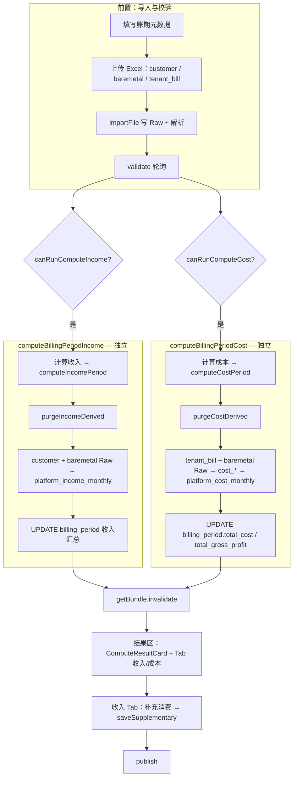
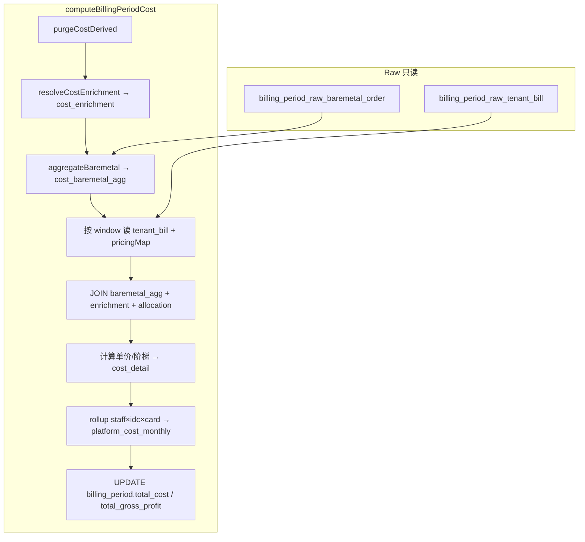

# 账期创建页「计算成功」流程可行性分析

> 版本：v2.1  
> 日期：2026-05-25  
> 状态：**方案设计（含成本重构 v2.1 + 页面双轨交互）**  
> 关联：`income-sql-compute-design.md` v1.3、`apps/web/src/app/[locale]/(protected)/finance/create/page.tsx`、`compute-cost.ts`（待建）、`compute-billing-period-income.ts`、`billing-periods.ts`  
> 说明：§1～§7 为创建页流程分析；**§9 为成本 v2 实现方案**；**§2.4 为页面双按钮 + Tab 展示约定**（与现网 `page.tsx` 对齐）。

---

## 1. 分析范围与结论摘要

### 1.1 范围

对照 `income-sql-compute-design.md`，评估账期创建页在 **计算收入 / 计算成本** 成功后的端到端流程，包括：

- **双轨触发**：「计算收入」与「计算成本」**独立按钮、独立 API**，互不耦合（§2.4）
- 成本计算流程及表结构（§9）
- **Tab 分栏**展示收入明细与成本明细（§2.4）
- 补充消费编辑与保存（收入 Tab）
- 发布账期

### 1.2 总体结论

| 维度 | 结论 |
|------|------|
| **整体架构** | **可行**。页面采用「导入 Raw → 服务端计算写派生层 → `getBundle` 单表读 income/cost → 人工补 supplementary → 发布」的分层，与收入 SQL 方案的读模型约定一致。 |
| **收入数据来源** | **可行**。`getBundle` 仅查 `platform_income_monthly`，页面直接使用 `project_name`、`customer_full_name`、`tenant_name` 等冗余字段，符合 §6.2 禁止联表原则。 |
| **计算实现形态** | **部分偏离设计，但不阻塞页面**。后端当前为 `compute-income.ts`（TypeScript 分步写库），尚未拆为设计 §8 中的 `compute-income-sql.ts`；语义上与 I0～I5 + 多项目内存路径一致，页面无感知。 |
| **成本数据来源（v2）** | **需重构**。现实现依赖 `billing_period_agg_customer_consumption`（收入表）筛 B 端；v2 改为 **仅** `tenant_bill` Raw + `baremetal_order` Raw，**不读客户消费明细**。 |
| **成本中间层（v2）** | **需新建**。与收入 agg / enrichment **分离**；明细落 `billing_period_cost_detail`，再 rollup 至精简版 `platform_cost_monthly`。 |
| **页面计算入口（v2.1）** | **已拆分**。主操作区两个按钮：「计算收入」（`computeIncome`）与「**计算成本**」（`computeCost`）；**不再**通过单一「计算」同时跑收入+成本。 |
| **结果展示（v2.1）** | **Tab 分栏**。收入明细与成本明细分属「收入」「成本」两个 Tab；汇总卡（`ComputeResultCard`）可同时展示两侧汇总字段。 |
| **成本汇总表（v2.1）** | `platform_cost_monthly` 增加 **`staff_name`** 快照列（§9.5），页面成本 Tab / 导出直接读该列，不联表 `user_staff`。 |
| **交互完整性** | **存在 2 处需修复的缺口**（见 §5）：补充消费未保存即可发布；成本/收入重算门禁需分别对齐 `canComputeCost` / `canComputeIncome`。 |

**一句话**：收入与成本在页面按钮、API、purge、Tab 展示四层解耦；后端需落地独立 `computeCost` endpoint；`platform_cost_monthly` 补 `staff_name`。

## 2. 页面「计算成功」端到端流程

### 2.1 流程图



### 2.2 关键状态与 API 映射

| 页面状态 / 条件 | 来源 | 作用 |
|-----------------|------|------|
| `allParsed` | customer + baremetal + 全部 tenant_bill 窗口 `done` | 「计算成本」前端必要条件 |
| `incomeImportsParsed` | customer + baremetal `done` | 「计算收入」前端必要条件 |
| `canRunComputeIncome` | `validation.canComputeIncome` + 日期合法 + `incomeImportsParsed` | 控制「计算收入」按钮 |
| `canRunCompute` / `canRunComputeCost` | `validation.canComputeCost`（或 `canCompute` 改名）+ `allParsed` + 日期合法 | 控制「**计算成本**」/「重新计算成本」按钮 |
| `hasIncomePreview` | `draftBundle.income.length > 0` | 未发布态可展示收入预览 Card |
| `hasCostResult` | `draftBundle.cost.length > 0` 或 `period.total_cost != null` | 成本 Tab 有数据 |
| `hasFullResult` | `status ∈ {computed, published}` 或 **任一侧已有计算结果** | 切换紧凑表单 + 结果区（含 Tab） |
| `resultTab` | 本地 state：`"income"` \| `"cost"` | 默认 `"income"`；仅一侧有数据时自动选中该 Tab |
| `draftBundle` | `getBundle` | `income` ← `platform_income_monthly`；`cost` ← `platform_cost_monthly`（含 `staff_name`） |
| `supplementaryDraft` | 本地 state，由 `draftBundle.income` 初始化 | **仅收入 Tab** 可编辑 |

**API 映射（v2.1，与按钮一一对应）**：

| 按钮文案 | 页面 handler | tRPC mutation | 服务端 | purge 范围 |
|----------|--------------|---------------|--------|------------|
| 计算收入 | `handleComputeIncome` | `periods.computeIncome` | `computeBillingPeriodIncome` | `derived_income` |
| **计算成本** | `handleCompute` | `periods.computeCost`（**新**，替代原 `compute` 全量） | `computeBillingPeriodCost` | `derived_cost` |

> **迁移说明**：现网 `handleCompute` 仍调 `periods.compute`（全量）；实现 §9 时改为 `periods.computeCost`，且 **不得** 在成本请求内调用收入 pipeline。

### 2.3 计算成功后的 UI 行为

1. **收入 Tab**：列与 Excel 导出一致；补充消费可编辑；「保存补充消费」仅在此 Tab。
2. **成本 Tab**：`CostGroupedTable` 读 `draftBundle.cost`；列含 **`staff_name`**、datacenter、cardType 及 §9.5 计量列；**只读**。
3. **ComputeResultCard**：同时展示 `total_income`、`total_cost`、毛利（`total_income - total_cost`）；「重新计算成本」仅触发 `computeCost`，不影响已算收入。
4. **读路径**：`getBundle.income` / `getBundle.cost` 各单表 SELECT，无 CRM 联表。

### 2.4 页面布局与 Tab 结构（v2.1）

与 `page.tsx` 对齐的目标布局：

```text
┌─────────────────────────────────────────────────────────┐
│ 表单 Card（上传区）                                        │
│  [计算收入]  [计算成本]  [取消]                             │
└─────────────────────────────────────────────────────────┘

未发布 / 已有任一侧结果时：
┌──────────────────────┬──────────────────────────────────┐
│ 表单 Card（compact）   │  ComputeResultCard（汇总 + 重算成本） │
└──────────────────────┴──────────────────────────────────┘

┌─────────────────────────────────────────────────────────┐
│  Tabs:  [ 收入 (n) ]  [ 成本 (m) ]                        │
├─────────────────────────────────────────────────────────┤
│  Tab=收入：收入明细表 + [保存补充消费]                        │
│  Tab=成本：CostGroupedTable（platform_cost_monthly）       │
│           列：staff_name | datacenter | cardType | …       │
└─────────────────────────────────────────────────────────┘
                              [取消]  [发布账期并返回列表]
```

**Tab 交互规则**：

| 规则 | 说明 |
|------|------|
| 独立可见 | 仅算收入时成本 Tab 显示空态「请先计算成本」；仅算成本时收入 Tab 空态「请先计算收入」 |
|  badge 计数 | Tab 标签展示 `income.length` / `cost.length` |
| 默认选中 | 刚完成「计算成本」→ 切到成本 Tab；刚完成「计算收入」→ 切到收入 Tab |
| 发布前置 | 发布仍要求账期 `status=computed`；产品可定义须 **两侧均已计算** 才可发布（待确认，默认两侧都算过） |

**按钮 loading 文案**（已实现）：

- 计算收入：`计算收入中…`
- 计算成本：`成本计算中…`

---

## 3. 与收入 SQL 方案的分步对照

### 3.1 服务端计算（设计 I0～I5 vs 现实现）

| 设计步骤 | 设计意图 | 当前实现 | 页面是否依赖 |
|----------|----------|----------|--------------|
| I0 租户分类 | SQL 按 project_count 分标准/多项目 | `classifyTenants()` Drizzle 查询 | 否（透明） |
| I1 汇总 Raw | SQL GROUP BY 写 agg | `buildTenantAggMap` + `insertAggBaseRows` | 否 |
| I2 CRM  enrichment | SQL UPDATE…FROM | `enrichStandardAggRows` 逐行 UPDATE | 否 |
| I3 INSERT income | SQL INSERT，冗余 project/customer 名 | `insertStandardIncomeRows` | **是**（读 bundle） |
| I4 UPDATE 裸金属 | SQL UPDATE 标准租户整笔 | `applyStandardBaremetal` | **是** |
| 多项目 §5 | TS 拆行 + 裸金属按比例 | `processMultiProjectTenants` | **是**（多行 income） |
| I5 账期汇总 | SQL UPDATE billing_period | `compute.ts` 内存 SUM + UPDATE | **是**（ComputeResultCard） |

**结论**：页面只消费派生层结果，不依赖「必须用 SQL 实现」；待 SQL 化完成后，只要 `getBundle` 字段与 UK 不变，**创建页无需改动**。

### 3.2 前置校验对照

| 校验项 | 设计 / compute.ts | 页面展示 | v2 成本变更 |
|--------|-------------------|----------|-------------|
| 三类 Excel 齐全且解析 ok | `loadCurrentRaw` | `allParsed` + slots 同步 | **成本**仅需 tenant_bill + baremetal；customer 仅 **收入** 需要 |
| B 端未知租户 | `validateCrossFileImports`（读 customer） | crossFileOk | 成本改：tenant_bill 租户须在 `billing_tenant` 注册 |
| B/C 混用 | 导入期 + `validateCustomerTypeConsistency` | 错误明细 | **仅收入**校验 |
| 机房×卡型成本 / 刊例价 | `findMissingTenantBillPricing` 等 | missingPricing | 成本仍需要 tenant_bill 单价；裸金属刊例价 **收入与成本共用** |
| 多项目分成未配置 | `pending_allocation` | pendingAllocationCount | 成本仍需要；写入成本专用 enrichment |
| 账期状态 | `imported` 或 `computed` 可算 | **见 §5.1** | 不变 |

---

## 4. 可行性详细评估

### 4.1 数据正确性 — 可行

- **余额收入口径**：仍来自 **客户消费 Raw**（收入专用）；与成本 v2 **解耦**。
- **成本余额口径（v2）**：`balance_consumption` / 卡时来自 **账户消费详情（tenant_bill Raw）**；tenant_bill 已含平台侧客户消费汇总，**不再**引用 `billing_period_raw_customer_consumption` 或 `billing_period_agg_customer_consumption`。
- **裸金属（v2）**：在成本中间表按 **租户 Id × 机房 × 卡型** 汇总 `baremetal_order.final_amount`；与 tenant_bill 同粒度合并后再算售出/赠送成本与毛利。
- **展示字段快照**：收入 → `platform_income_monthly`；成本明细 → `billing_period_cost_detail`；成本汇总 → `platform_cost_monthly`（含 **`staff_name`**，§9.5）。

### 4.2 交互流程 — 基本可行，有缺口

- 双按钮（计算收入 / **计算成本**）+ **Tab 分栏**符合「两侧独立计算、分视图复核、收入侧补 supplementary、最后发布」的顺序（§2.4）。
- `saveSupplementary` 仅在 **收入 Tab** 操作，回写 `platform_income_monthly`，**不影响**已算成本。

### 4.3 边界场景 — 与设计一致或已文档化

| 场景 | 设计 | 页面表现 |
|------|------|----------|
| E1 标准 1 项目 | 每租户 1 行 income | 正常展示 |
| E2 多项目 | 每租户×项目多行 | 表格多行，需配置分成后才可算 |
| E3 无 project_tenant | project_id NULL | 项目名列空，客户全称仍可有 |
| E5 仅有裸金属无客户消费 | 不进 income，报告 | 不会出现在收入明细（符合设计） |
| E7 重算 | supplementary 归零 | purge 删除 income 后重算为 0；**但重算入口当前可能被禁用** |

### 4.4 对账信息未 surfaced — 可接受但建议增强

`computePeriodIncome` 产生 `ref_gap tenant=…` 等对账 issue 写入 `billing_period_reconciliation_report`，**创建页不展示**。计算在 issue 存在时仍会成功，用户可能误以为完全无差异。这不违背收入 SQL 方案，但影响财务复核体验（见 §6.3）。

---

## 5. 已识别的缺口与风险

### 5.1 【高】`canComputeCost` / `canComputeIncome` 与重算状态不一致

**现象**：

- 页面：「计算成本」依赖 `validation.canCompute`（建议后端改名为 **`canComputeCost`**）。
- 若 validate 仍要求 `crossFileOk`（customer 交叉），与 **成本不读 customer** 的 v2 口径冲突。
- `computed` 后重算门禁若未分别处理，「重新计算成本」可能被禁用。

**方案**：

```text
canComputeCost :=
  period.status in ('imported', 'computed')
  && tenantBillReady && baremetalReady
  && missingTenantBillPricing.length = 0
  && missingBaremetalListPrice.length = 0
  && pendingCostAllocation.length = 0
  // 不含 crossFileOk / customer_consumption

canComputeIncome :=
  period.status in ('draft', 'imported', 'computed')
  && customer + baremetal 解析 ok
  && crossFileOk
  && pendingAllocation.length = 0
```

页面「重新计算成本」绑定 `canRunComputeCost`；「计算收入」绑定 `canRunComputeIncome`。

### 5.2 【高】补充消费未保存即可发布

**现象**：

- 用户在收入明细表中修改 `supplementaryDraft` 仅更新 **React 本地 state**。
- `handlePersist` → `publish` **不**调用 `saveSupplementary`。
- 若用户未点「保存补充消费」直接「发布账期」，DB 中 supplementary 仍为计算时的 0，**与界面所见不一致**。

**方案**（任选或组合）：

1. **发布前强制保存**：`handlePersist` 内若检测到 draft 与 bundle 不一致，先 `saveSupplementary` 再 `publish`（或弹确认）。
2. **脏数据提示**：`supplementaryDraft` 与 `draftBundle.income` 比较，有差异时禁用发布并提示「请先保存补充消费」。
3. **自动保存**：发布按钮点击时 silently save supplementary（需处理校验失败回滚）。

推荐 **1 + 2**：既保证数据一致，又给用户明确反馈。

### 5.3 【中】行内 total 与 DB total 在保存前不一致

**现象**：表格「总消费」列用本地 `supplementaryDraft` 实时相加；`row.total_consumption`（DB）在保存前仍为旧值。仅影响展示一致性，保存后修复。

**方案**：保存前用本地公式展示即可（当前做法合理）；可选在列标题加注「* 含未保存补充消费」或在 save 前禁用依赖 total 的汇总联动。

### 5.4 【低】未展示 `customer_type`

设计保留 B/C 分轨；创建页收入表未列示 `customer_type`，多项目/B 端筛选在此页不可用。若创建页需与导出/详情页一致，可增加只读列或 Tab 筛选（非阻塞 SQL 方案）。

### 5.5 【低】实现层未 SQL 化

`compute-income.ts` 仍为 TS 循环写库，与设计 §8 文件结构不一致；**不影响**创建页可行性，但 SQL 化后应保证：

- `getBundle` 字段映射不变；
- 标准/多项目行数与 UK `(billing_period_id, tenant_id, project_id)` 行为不变；
- 重算 purge 范围不变。

---

## 6. 推荐方案（分阶段）

### 6.1 阶段 A：修复交互门禁（优先，与 SQL 化并行）

| 序号 | 项 | 改动面 | 验收标准 |
|------|----|--------|----------|
| A1 | 成本/收入重算可用 | `validatePeriod` 拆分 `canComputeCost` / `canComputeIncome` | 各自 `computed` 后可重算，且互不影响 |
| A2 | 发布前 supplementary 一致 | `page.tsx` handlePersist 或 UI 禁用逻辑 | 未保存补充消费时不能发布，或自动保存后发布 |
| A3 | 重算后刷新 draft | 已有 invalidate getBundle | 重算后 supplementaryDraft 重置为 0（依赖 useEffect on draftBundle） |

### 6.2 阶段 B：收入 SQL 化 + 成本 v2 + 页面 Tab（并行）

1. 收入：`computeBillingPeriodIncome` + `purgeIncomeDerived`（不变）。
2. 成本：§9 `computeBillingPeriodCost` + `purgeCostDerived`；**废弃** `computeBillingPeriod` 全量编排。
3. API：`periods.computeIncome` + **`periods.computeCost`**（替换 `periods.compute`）。
4. 页面：结果区 **Tabs（收入/成本）**；`getBundle.cost` 映射 `staff_name`。
5. 回归：T1～T11 + §9.9。

### 6.3 阶段 C：体验增强（可选）

1. 计算成功后展示 reconciliation issue 摘要（只读，链接到对账报告）。
2. 收入表增加 `customer_type` 列或筛选。
3. ComputeResultCard 在 supplementary 未保存时显示「账期总收入 *预览*」与 DB 汇总差异提示。

---

## 7. 测试建议（验证「计算成功流程」可行）

| # | 场景 | 步骤 | 期望 |
|---|------|------|------|
| T1 | 标准租户计算收入 | customer + baremetal → 计算收入 | income 每租户 1 行 |
| T2 | 多项目租户收入 | 配置分成 → 计算收入 | income 多行 |
| T3 | 计算成本 | tenant_bill + baremetal → **计算成本** | `platform_cost_monthly` 有数据；**income 不变** |
| T4 | 补充消费 + 发布 | 收入 Tab 改 supplementary → 保存 → 发布 | 与 DB 一致 |
| T5 | 重算成本 | 成本 Tab → 重新计算成本 | 仅 purge/重写 cost 侧；income 保留 |
| T6 | getBundle 无联表 | 单测 | income / cost 各单表 |
| T7 | 成本 Tab 列 | 计算成本后切 Tab | 展示 `staff_name` + §9.5 列 |
| T8 | 仅算收入 | 不算成本 | 成本 Tab 空态 |
| T9 | 仅算成本 | 无 customer | 收入 Tab 空态；成本成功 |
| T10 | 裸金属汇总 | 同租户同机房卡型多订单 | `cost_detail.bare_metal_consumption` 合计正确 |
| T11 | Tab 默认选中 | 先算收入再算成本 | 每次计算完成后自动切到对应 Tab |

---

## 8. 修订记录

| 版本 | 日期 | 说明 |
|------|------|------|
| v1.0 | 2026-05-25 | 初稿：创建页计算成功流程可行性分析 |
| v1.1 | 2026-05-25 | 新增 §9：成本计算流程与表结构读写清单（描述现实现） |
| v2.0 | 2026-05-25 | §9 重写：成本与收入分离、独立中间表、精简 `platform_cost_monthly` |
| v2.1 | 2026-05-25 | 页面「计算成本」独立 API；Tab 分栏展示；`platform_cost_monthly` 增加 `staff_name` |

---

## 9. 成本计算 v2 实现方案（与收入分离）

> **目标**：成本 pipeline **仅**依赖 **账户消费详情（tenant_bill）** 与 **裸金属消费订单（baremetal_order）**；不读取客户消费明细 Raw / 收入 agg。  
> 与收入共用的中间表 **拆出成本专用表**；明细 enriched 后 rollup 至 **精简版** `platform_cost_monthly`。

### 9.1 现实现问题：与收入复用的表

| 现复用对象 | 所属 pipeline | v2 处置 |
|------------|---------------|---------|
| `billing_period_agg_customer_consumption` | 收入 I1；成本 C1 筛 B 端 | **成本不再读取**；保留给收入 |
| `billing_period_tenant_project_enrichment` | import tenant_bill 写入；成本 C2 读 AM/项目 | **废弃于成本路径**；改写入 `billing_period_cost_enrichment` |
| `runPeriodIncomePipeline` 内嵌于 `computeBillingPeriod` | 成本必须在收入之后 | **解耦**：`computeBillingPeriodCost` 可独立调用 |
| `platform_cost_monthly.type` record/sum | 明细 + staff 汇总同表 | **移除**；明细 → `billing_period_cost_detail`；汇总表仅 staff×机房×卡型 |
| `platform_cost_monthly.project_id` 等 | 明细字段混入汇总表 | **移出**至 `billing_period_cost_detail`；汇总表增加 **`staff_name`** |

### 9.2 数据源口径（v2）

| 数据 | Raw 表 | 在成本中的作用 |
|------|--------|----------------|
| **账户消费详情** | `billing_period_raw_tenant_bill` | 主计量：`balance_consumption`、`balance_card_hours`、`voucher_card_hours`；按租户×window×`region_code`×`gpu_model` |
| **裸金属消费订单** | `billing_period_raw_baremetal_order` | 按租户×机房×卡型汇总 `final_amount` → 写入中间表 **`bare_metal_consumption`** 列；参与同机房卡型的成本/毛利计算 |
| ~~客户消费明细~~ | ~~`billing_period_raw_customer_consumption`~~ | **不参与成本**（仅服务收入与 B/C 交叉校验） |

**B 端租户判定（v2）**：不再读 customer_type agg；改为 tenant_bill 行上的 `tenant_platform_id` 必须在 `billing_tenant` 存在且关联 CRM 客户（与 import 期校验一致）。C 端-only 租户若无 CRM 绑定，写入 reconciliation issue 并跳过。

### 9.3 成本专用中间表设计

#### 9.3.1 `billing_period_cost_enrichment`（成本 CRM 快照）

账期×租户×项目的成本专用 enrichment，**不**读写 `billing_period_tenant_project_enrichment`。

| 列 | 类型 | 说明 |
|----|------|------|
| `id` | text PK | |
| `billing_period_id` | text FK | |
| `tenant_platform_id` | varchar | 平台租户 Id |
| `tenant_id` | text FK → `billing_tenant` | |
| `customer_id` | text FK → `customer` | |
| `customer_full_name` | varchar | 快照 |
| `project_id` | text FK → `crm_project` | |
| `project_name` | varchar | 快照 |
| `staff_id` | text FK → `user_staff` | 客户经理 |
| `account_manager_name` | varchar | 快照 |
| `allocation_percent` | numeric | 多项目分成；单项目 100 |
| `source` | varchar | `auto_single` / `auto_preset` / `manual_period` |
| `resolved_at` | timestamptz | |

**UK**：`(billing_period_id, tenant_platform_id, project_id)`

写入时机：tenant_bill import 成功后 **或** 成本计算前 lazy resolve（读 CRM + `billing_tenant_cost_allocation` + `tenant_project_cost`，逻辑同现 `resolveAndPersistEnrichment`，但 **INSERT 目标为本表**）。

#### 9.3.2 `billing_period_cost_baremetal_agg`（裸金属按租户×机房×卡型汇总）

| 列 | 类型 | 说明 |
|----|------|------|
| `id` | text PK | |
| `billing_period_id` | text FK | |
| `tenant_platform_id` | varchar | |
| `idc_code` | varchar | 由 `baremetal_order.idc_name` 归一化 |
| `idc_name` | varchar | 原始机房名快照 |
| `card_type` | varchar | 由 `device_model` 解析出的 GPU code |
| `bare_metal_consumption` | money | **SUM(`final_amount`)** |
| `order_count` | integer | 订单行数 |
| `source_order_ids` | jsonb | 来源 `order_id` 列表（审计） |

**UK**：`(billing_period_id, tenant_platform_id, idc_code, card_type)`

解析规则：复用 `baremetal-order-parse`（`parseDeviceModel` → 卡型 code；`normalizeBaremetalRegion` → 机房 code）。

#### 9.3.3 `billing_period_cost_detail`（成本明细 — enriched + 单价 + 裸金属列）

成本计算主输出明细表，**替代**现 `platform_cost_monthly` 的 record 行。

| 列 | 类型 | 说明 |
|----|------|------|
| `id` | text PK | |
| `billing_period_id` | text FK | |
| `tenant_platform_id` | varchar | |
| `tenant_id` | text | |
| `customer_id` | text | |
| `customer_full_name` | varchar | |
| `project_id` | text | |
| `project_name` | varchar | |
| `staff_id` | text | |
| `account_manager_name` | varchar | |
| `window_id` | text FK | tenant_bill 时间段（可空：跨 window 合并后为 null） |
| `idc_code` / `idc_name` | varchar | 机房 |
| `card_type` | varchar | GPU 型号 |
| `balance_consumption` | money | tenant_bill × allocation |
| `balance_card_hours` | card_hours | |
| `voucher_card_hours` | card_hours | |
| **`bare_metal_consumption`** | money | 来自 §9.3.2 同租户×机房×卡型汇总 × allocation |
| `supplier_unit_cost_id` | text FK | 解析的机房×卡型成本 |
| `deal_unit_price_per_hour` | money | 单价快照 |
| `list_price_per_hour` | money | 刊例/清单价快照 |
| `confirmed_revenue_excl_tax` | money | `balance_consumption / 1.06` |
| `sold_duration_cost_excl_tax` | money | 阶梯/固定单价计算 |
| `gifted_duration_cost_excl_tax` | money | 券卡时部分 |
| `gross_profit` | money | `confirmed - sold - gifted` |
| `allocation_percent` | numeric | 审计 |
| `source_tenant_bill_raw_ids` | jsonb | |
| `source_baremetal_agg_id` | text | 关联 §9.3.2 行 |

**UK（合并后）**：`(billing_period_id, staff_id, project_id, idc_code, card_type)`

> **裸金属列语义**：同一租户在 `baremetal_agg` 中按机房×卡型汇总的金额，按项目 `allocation_percent` 拆分到各 `cost_detail` 行；与 tenant_bill 同机房×卡型行 **共存于同一 detail 行**（LEFT JOIN 无 tenant_bill 仅有裸金属时仍生成 detail，balance 字段为 0）。

### 9.4 成本 pipeline（K0～K7）

新增 `compute-cost.ts` → `computeBillingPeriodCost`；**不**调用收入 pipeline。



| 步骤 | 读写 | 说明 |
|------|------|------|
| K0 | D: `cost_enrichment`, `cost_baremetal_agg`, `cost_detail`, `platform_cost_monthly` | `purgeCostDerived`；**不**删 income / agg |
| K1 | W: `billing_period_cost_enrichment` | CRM 补全 + 分成；读 `billing_tenant`、`crm_project`、`billing_tenant_cost_allocation`、`tenant_project_cost` |
| K2 | W: `billing_period_cost_baremetal_agg` | GROUP BY tenant×idc×card；SUM final_amount |
| K3 | R: tenant_bill Raw；R: 供应商单价表 | `buildTenantBillPricingMap` |
| K4 | 内存 | tenant_bill 行 × 项目分成 LEFT JOIN baremetal_agg 同键 |
| K5 | W: `billing_period_cost_detail` | 应用 `cost-pricing-utils`；写 enriched 列 + 裸金属列 + 毛利 |
| K6 | W: `platform_cost_monthly` | GROUP BY staff_id, idc_code, card_type；写入 §9.5 列含 **`staff_name`** |
| K7 | W: `billing_period` | `total_cost` = SUM(sold+gifted)；`total_gross_profit` = SUM(gross_profit) |

**前置校验（成本专属）**：

```text
canComputeCost :=
  period.status in ('imported', 'computed')
  && tenantBillReady                    // 各 window tenant_bill 解析 ok
  && baremetalReady                     // baremetal 解析 ok
  && missingTenantBillPricing.length = 0
  && missingBaremetalListPrice.length = 0   // 裸金属订单刊例价（解析卡型用）
  && pendingCostAllocation.length = 0   // cost_enrichment 多项目分成齐全
  // 不要求 customer_consumption
  // 不要求 validateCrossFileImports（customer 交叉）
```

### 9.5 `platform_cost_monthly` 精简 schema（v2.1）

**职责**：账期级 **汇总表**；供创建页 **成本 Tab**、`CostGroupedTable` 及导出直接消费。  
**粒度**：`(billing_period_id, staff_id, idc_code, card_type)` — 每账期每个 AM×机房×卡型一行。

| 列（表头 / UI） | DB 列名 | 说明 |
|-----------------|---------|------|
| staffId | `staff_id` | 客户经理 Id（FK → `user_staff`） |
| **staffName** | **`staff_name`** | **客户经理姓名快照**；K6 rollup 时取自 `cost_enrichment.account_manager_name` 或 `user_staff.display_name`；**禁止读路径联表** |
| datacenter | `idc_name` | 机房显示名（`idc_code` 保留为 UK 组成部分与内部键） |
| cardType | `card_type` | GPU 型号 |
| 余额消费 | `balance_consumption` | SUM from `cost_detail` |
| 余额卡时 | `balance_card_hours` | |
| 券卡时 | `voucher_card_hours` | |
| 确认收入(不含税) | `confirmed_revenue_excl_tax` | |
| 售出时长成本(不含税) | `sold_duration_cost_excl_tax` | |
| 赠送时长成本(不含税) | `gifted_duration_cost_excl_tax` | |
| 毛利 | `gross_profit` | |

**相对现 schema 变更**：

- **新增** `staff_name` varchar(128) NOT NULL（与 v2 移除的 `account_manager` 语义等价，命名与 UI 列 `staffName` 对齐）。
- **移除**：`type`、`account_manager`（由 `staff_name` 替代）、`project_id`、`supplier_unit_cost_id`、单价审计列等（明细在 `billing_period_cost_detail`）。

**UK**：`(billing_period_id, staff_id, idc_code, card_type)`

**`getBundle.cost` 映射**：增加 `staff_name: r.staffName`（或 snake_case `staff_name` 与 income 一致）。

**`billing_period.total_cost`** = SUM(`sold_duration_cost_excl_tax` + `gifted_duration_cost_excl_tax`) over 本表。

### 9.6 编排与 purge 边界（v2.1 — 无全量 compute）

```text
// 收入 — 仅由「计算收入」触发
computeBillingPeriodIncome({ billingPeriodId }):
  purgeIncomeDerived()
  runPeriodIncomePipeline(...)
  UPDATE billing_period 收入汇总字段

// 成本 — 仅由「计算成本」触发
computeBillingPeriodCost({ billingPeriodId }):
  purgeCostDerived()
  K1～K7（§9.4）
  UPDATE billing_period.total_cost, total_gross_profit

// 发布前合并 status（可选 helper）
syncPeriodComputedStatus():
  if total_income 已汇总 && total_cost 已汇总 → status = 'computed'
  elif 仅一侧完成 → status 保持 imported 或新增 cost_computed / income_computed（待产品确认）
```

| purge scope | 删除对象 | 触发时机 |
|-------------|----------|----------|
| `derived_income` | `platform_income_monthly`, `billing_period_agg_customer_consumption` | **仅** computeIncome |
| `derived_cost` | `billing_period_cost_*`, `platform_cost_monthly` | **仅** computeCost |
| `derived`（全量） | 上述 + `billing_period_reconciliation_report` | regenerate / void |

**禁止**：在 `computeBillingPeriodCost` 内调用 `runPeriodIncomePipeline` 或 purge 收入表。

### 9.7 页面 / API 变更（v2.1）

| 项 | 变更 |
|----|------|
| 主按钮 | 「**计算成本**」→ `periods.computeCost` → `computeBillingPeriodCost`（**不**触发收入） |
| 次按钮 | 「计算收入」→ `periods.computeIncome`（不变） |
| `canRunCompute` | 语义改为 **成本**；后端字段建议 rename → `canComputeCost` |
| 结果区 | **Tabs**：`收入` / `成本`；替换现上下堆叠双 Card（§2.4） |
| `CostGroupedTable` | 列顺序：`staff_name` → datacenter → cardType → 计量列；数据来自 `platform_cost_monthly` |
| `getBundle` | `cost[]` 含 `staff_name`；可选 `costDetail[]` 读 `billing_period_cost_detail`（项目/客户/裸金属展开） |
| `ComputeResultCard` | 文案：「重新计算成本」；`onRecompute` → `handleCompute` / `computeCost` only |
| 发布 | 仍 `publish`；建议两侧均已计算 + 收入 supplementary 已保存（§5.2） |

import tenant_bill 时：成本路径写入 `billing_period_cost_enrichment`（§9.3.1）；收入路径 enrichment 逻辑不变。

### 9.8 文件结构（建议）

```text
apps/web/src/lib/server/dataaccess/finance/
  compute-cost.ts              # K0～K7 主编排
  compute-cost-enrichment.ts   # K1，镜像 enrichment 但写 cost_enrichment
  compute-cost-baremetal-agg.ts # K2
  compute-cost-detail.ts       # K4～K5
  compute-cost-rollup.ts       # K6
  purge-cost.ts                # purgeCostDerived
packages/db/src/finance-schema.ts
  billingPeriodCostEnrichment
  billingPeriodCostBaremetalAgg
  billingPeriodCostDetail
  platformCostMonthly          # 精简列 migration
```

### 9.9 测试用例（成本 v2）

| # | 场景 | 期望 |
|---|------|------|
| C1 | 仅 tenant_bill + baremetal，无 customer | 成本成功；`cost_detail` 有项目/客户；income 空 |
| C2 | 同租户裸金属多订单同机房卡型 | `cost_baremetal_agg.bare_metal_consumption` = 合计；detail 列一致 |
| C3 | 多项目租户 | detail 按 allocation 拆分；rollup 后 `platform_cost_monthly` 无 project 列 |
| C4 | 仅有裸金属无 tenant_bill 行 | detail 仍生成（balance=0，bare_metal>0）或 issue（产品确认） |
| C5 | 重算成本 | purgeCostDerived 后中间表与汇总表全部重建；income 不受影响 |
| C6 | getBundle | cost 含 `staff_name`；单表无联 staff |
| C7 | 计算成本后再算收入 | income 追加；cost 不被 purge |
| C8 | Tab 切换 | 成本计算完成默认打开成本 Tab |

### 9.10 迁移说明

1. Drizzle migration：新增 `billing_period_cost_*`；`platform_cost_monthly` 删列、**加 `staff_name`**、去 `type`；历史账期 **重算成本**。
2. 删除 `computeBillingPeriod` 全量入口；`periods.compute` deprecated → `periods.computeCost`。
3. 页面：结果 Card 改为 Tabs；`ComputeResultCard` 重算绑定成本 API。
