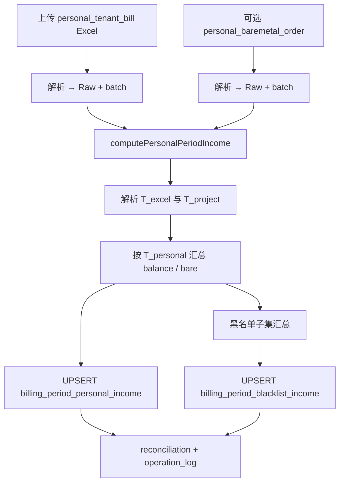

# 个人收入（非项目租户）重新生成 — 库表评估与实现方案

> 版本：v1.0（设计稿）  
> 日期：2026-06-03  
> 状态：**设计稿 — 不涉及代码修改**  
> 页面：`apps/web/src/app/[locale]/(protected)/finance/[id]/personal/page.tsx`（当前为空）  
> 关联：  
> - `billing-period-import-design.md` §3.3（客户账单详情 Excel）、§5（收入 pipeline）  
> - `finance-single-period-income-design.md`（**项目关联租户** 的 CRM 账单收入，与本方案互补）  
> - `tenant-blacklist-management-design.md`（`platform_tenant_blacklist`）  
> - `packages/db/src/finance-schema.ts`、`packages/db/src/crm-schema.ts`

---

## 1. 需求摘要

| # | 需求 | 说明 |
|---|------|------|
| R1 | 上传 Excel | 列与 **客户账单详情** 一致（见 §2.1）；支持「总计」行仅作校验 |
| R2 | 计算规则 | 与 **企业收入**（`/finance/create` Excel pipeline）同源公式，但 **排除** 已在 CRM 关联经营项目的租户 |
| R3 | 汇总一条记录 | 本账期 **个人收入（非项目）** 汇总：`余额消费`、`线上裸金属消费`、`总消费` |
| R4 | 黑名单子集 | 与 `platform_tenant_blacklist` 比对，输出 **本账期内黑名单租户** 的同类三项汇总 |
| R5 | 重新生成 | 支持覆盖上传后重算；不破坏企业收入明细（若同账期并存） |

**与企业收入、单账期 CRM 收入的关系**

| 入口 | 纳入租户 | 粒度 | 数据源 |
|------|----------|------|--------|
| `/finance/create` 企业收入 | 客户消费 Excel 出现的租户（再拆项目） | 租户 × 项目 × B/C | 三类 Excel |
| `/finance/create/single` CRM 收入 | **仅** 有关联项目的租户 | 项目 × 租户 | `tenant_bill` |
| **`/finance/[id]/personal` 个人收入** | **无** 项目关联的租户 | **账期级一条汇总** + 黑名单汇总 | 本页上传账单 Excel（+ 裸金属，见 §4.3） |

---

## 2. 输入 Excel 规范

### 2.1 列定义（与 `billing-period-import-design.md` §3.3 一致）

| 列名 | 映射 Raw 字段 | 必填 |
|------|---------------|------|
| 租户ID | `tenant_platform_id` | 是（总计行除外） |
| 总消费 | `total_consumption` | 是 |
| 券消费 | `voucher_consumption` | 否，默认 0 |
| 余额消费 | `balance_consumption` | 是 |
| 总卡时 | `total_card_hours` | 否 |
| 券卡时 | `voucher_card_hours` | 否 |
| 余额卡时 | `balance_card_hours` | 是 |
| GPU型号 | `gpu_model` | 是（总计行可空） |
| 区域 | `region_code` | 是（总计行可空） |

**总计行**：`租户ID ∈ {总计, 合计, Total}` → 不写入 Raw，可选校验明细之和（±0.01）。

**样例（需求提供）**

```
租户ID  总消费      券消费    余额消费    …  GPU型号   区域
总计    602,268.83  …         …                  （空）
984     214,308.3   …         214,050.24  …  4090-48G  zjsx-p1
4583    80,183.94   …         80,183.94   …  4090      guangdong
```

解析、金额清洗、别名映射 **复用** 现有 `tenant_bill` 解析器（`import.ts` / `tenant-bill-parse` 类模块），仅 `file_type` 区分来源。

### 2.2 裸金属（线上裸金属消费）

企业收入 Step I3 来自 **`baremetal_order` Excel**（已支付 + 账期内 `final_amount` 按租户合计）。

个人收入若 **仅** 上传账单详情 Excel，则 **无法** 从账单行直接得到「线上裸金属消费」（账单行的 `balance_consumption` 是弹性/云主机等余额消费，非裸金属订单）。

**建议（实施默认）**

| 方案 | 说明 |
|------|------|
| **A（推荐）** | 个人收入页增加 **可选** 第二上传槽：`personal_baremetal_order`，列与 §3.2 企业裸金属一致；计算时仅统计 **非项目租户** 的订单 |
| B | 若本账期已在企业流程上传过 `baremetal_order`，个人收入 **只读引用** 同一 Raw，按租户过滤；与「个人重新生成 purge」解耦弱，不推荐作唯一路径 |
| C | 首期裸金属恒为 0 | 仅当业务确认个人收入不含裸金属时可采纳 |

**待产品确认**：R3 是否必须含裸金属。下文按 **方案 A** 描述完整 pipeline。

---

## 3. 数据库表结构评估

### 3.1 结论总览

| 能力 | 现库是否满足 | 说明 |
|------|--------------|------|
| 存储上传账单 Raw 行 | **部分满足** | `billing_period_raw_tenant_bill` 结构完全匹配；但 `billing_period_import_batch` 对 `tenant_bill` 有 **按 window 唯一** 约束，且与企业成本共用，不宜直接混用 |
| 存储裸金属 Raw | **部分满足** | `billing_period_raw_baremetal_order` 可用；需独立 `file_type` 避免与企业 purge 互相清空 |
| 项目关联判断 | **满足** | 无需新表；查询 `crm_project` + `project_tenant` + `primary_tenant_id`（与 `enrichment.ts` / `cost-tenant-resolve.ts` 一致） |
| 黑名单主数据 | **满足** | `platform_tenant_blacklist.platform_tenant_id`；可选 `local_tenant_id` → `billing_tenant` |
| **个人收入一条汇总** | **不满足** | 无专用表；`platform_income_monthly` 为租户×项目明细，且 UNIQUE `(billing_period_id, tenant_id, project_id)` |
| **黑名单收入汇总** | **不满足** | 无账期级黑名单汇总表 |
| 账期级三项金额（与企业分开） | **不满足** | `billing_period.balance_income` / `baremetal_income` / `total_income` 为 **全账期** 汇总，写入企业或 CRM 收入后会覆盖，不能同时表达「个人收入汇总」 |

**总评**：现有 schema **可支撑 Raw 导入与主数据关联**，但 **缺少个人收入与黑名单收入的持久化模型**；若强行写入 `platform_income_monthly` 或 `billing_period` 汇总字段，会与 **企业收入**、**单账期 CRM 收入** 冲突或语义混淆。

### 3.2 可复用表（无需改结构即可读）

| 表 | 复用方式 |
|----|----------|
| `billing_period` | 账期元数据 `period_start` / `period_end` / `status`；**不**建议把个人汇总写入 `total_income` 等列 |
| `billing_period_raw_tenant_bill` | 行结构复用；通过 **不同 `batch_id`** + 新 `file_type` 区分个人账单导入 |
| `billing_period_raw_baremetal_order` | 同上，个人裸金属批次 |
| `billing_tenant` | `platform_tenant_id` 解析 CRM 租户 |
| `platform_tenant_blacklist` | 黑名单比对（见 §5） |
| `billing_period_operation_log` | 记录 `compute_personal_income` / `import_personal_batch` |
| `billing_period_reconciliation_report` | 可附加 warnings（总计行偏差、未知租户、券合计等） |

### 3.3 不宜直接复用的表

| 表 | 原因 |
|----|------|
| `platform_income_monthly` | 粒度为租户×项目；需求为 **一条账期汇总**；且企业/CRM 收入已占用 |
| `billing_period_agg_customer_consumption` | 依赖 **客户消费 Excel** Step I0，个人收入不上传该文件 |
| `billing_period_import_batch`（`file_type = tenant_bill`） | 企业成本按 **tenant_bill_window** 多批次；与个人「单文件整账期」模型冲突 |
| `billing_period.total_*` | 单套汇总字段，无法并存企业 + 个人两套收入 |

### 3.4 建议新增表（DDL 示意）

#### 3.4.1 `billing_period_personal_income`（个人收入汇总，每账期至多一行）

```sql
CREATE TABLE billing_period_personal_income (
  id                text PRIMARY KEY,
  billing_period_id text NOT NULL UNIQUE REFERENCES billing_period(id) ON DELETE CASCADE,
  balance_consumption     numeric(15,4) NOT NULL DEFAULT 0,
  bare_metal_consumption  numeric(15,4) NOT NULL DEFAULT 0,
  total_consumption       numeric(15,4) NOT NULL,
  tenant_bill_batch_id    text REFERENCES billing_period_import_batch(id) ON DELETE SET NULL,
  baremetal_batch_id      text REFERENCES billing_period_import_batch(id) ON DELETE SET NULL,
  included_tenant_count   integer NOT NULL DEFAULT 0,
  excluded_project_tenant_count integer NOT NULL DEFAULT 0,
  rule_version          varchar(32),
  last_computed_at      timestamptz,
  created_at            timestamptz NOT NULL DEFAULT now(),
  updated_at            timestamptz NOT NULL DEFAULT now()
);
```

#### 3.4.2 `billing_period_blacklist_income`（黑名单子集汇总，每账期至多一行）

```sql
CREATE TABLE billing_period_blacklist_income (
  id                text PRIMARY KEY,
  billing_period_id text NOT NULL UNIQUE REFERENCES billing_period(id) ON DELETE CASCADE,
  balance_consumption     numeric(15,4) NOT NULL DEFAULT 0,
  bare_metal_consumption  numeric(15,4) NOT NULL DEFAULT 0,
  total_consumption       numeric(15,4) NOT NULL,
  matched_tenant_count  integer NOT NULL DEFAULT 0,
  blacklist_match_mode  varchar(32) NOT NULL,  -- e.g. 'active_open'
  rule_version          varchar(32),
  last_computed_at      timestamptz,
  created_at            timestamptz NOT NULL DEFAULT now(),
  updated_at            timestamptz NOT NULL DEFAULT now()
);
```

#### 3.4.3 `billing_period_import_batch` 扩展 `file_type`

在 Drizzle 层增加枚举值（需 migration）：

| file_type | 唯一约束建议 |
|-----------|----------------|
| `personal_tenant_bill` | `UNIQUE (billing_period_id) WHERE file_type = 'personal_tenant_bill'` |
| `personal_baremetal_order` | `UNIQUE (billing_period_id) WHERE file_type = 'personal_baremetal_order'` |

Raw 行仍写入现有 `billing_period_raw_tenant_bill` / `billing_period_raw_baremetal_order`，仅 `batch.file_type` 不同，避免重复建 Raw 表。

**可选（审计）**：`billing_period_personal_income_tenant` 记录参与汇总的 `platform_tenant_id` 列表 — 仅当需要下钻时再加；首期可只靠 reconciliation JSON。

---

## 4. 计算逻辑

### 4.1 租户分类：是否「项目关联」

与 `listProjectsForPlatformTenant`（`enrichment.ts`）**同一规则**，判定为 **项目租户**（需排除）：

```text
存在非 archived / 非 paused 的 crm_project，且满足：
  project.customer_id = tenant.customer_id
  AND (
    project.primary_tenant_id = tenant.id
    OR EXISTS project_tenant(project_id, tenant_id)
  )
```

| 集合 | 符号 | 参与个人汇总 |
|------|------|----------------|
| Excel 中出现的平台租户 ID | `T_excel` | — |
| 项目关联租户 | `T_project` | **否** |
| 个人收入租户 | `T_personal = T_excel \ T_project` | **是** |

**注意**

- 租户 **不在** `billing_tenant` 主数据：记入 reconciliation **警告**，是否纳入汇总需产品确认（建议：**纳入**，仅用平台 ID 聚合）。
- 租户在 Excel 但 **仅** 因项目关联被排除：记入报告 `excluded_project_tenants[]`（平台 ID、关联项目名）。

### 4.2 与企业收入相同的分项公式（在 `T_personal` 上聚合）

对每个 `t ∈ T_personal`：

```text
B_balance(t) = Σ raw_tenant_bill.balance_consumption   -- 该租户所有区域×GPU 行
M_bare(t)    = Σ raw_baremetal.final_amount            -- 已支付且 ordered_at 在账期内
```

账期 **一条** 个人收入记录：

```text
balance_consumption    = Σ_{t ∈ T_personal} B_balance(t)
bare_metal_consumption = Σ_{t ∈ T_personal} M_bare(t)
total_consumption      = balance_consumption + bare_metal_consumption
```

**与企业收入的差异**

| 维度 | 企业收入 | 个人收入 |
|------|----------|----------|
| 租户范围 | 客户消费 Excel 租户集 | `T_personal` |
| 补充消费 | UI 手工 `supplementary` | **本期不做**（汇总表无该列；若后续需要再加字段） |
| 输出 | 多行 `platform_income_monthly` | 单行 `billing_period_personal_income` |
| 项目拆分 | 有 | **无** |
| B/C 分轨 | 有 | **不按 B/C 拆**（汇总层）；券消费仅对账 |

**券消费**：从 Raw 汇总 `voucher_consumption` 写入 reconciliation，**不计入** `total_consumption`（与企业 §5 一致）。

### 4.3 Pipeline（`computePersonalPeriodIncome`）



**前置条件**

| 检查 | 阻断？ |
|------|--------|
| 账期存在且非 `void` | 是 |
| 已发布需先撤回（与企业一致） | 是 |
| `personal_tenant_bill` 已导入且 `parse_status = ok` | 是 |
| `personal_baremetal` 未上传 | 否（裸金属按 0） |
| 账期内无有效行（排除后 `T_personal` 为空） | 是（无可汇总数据） |

**重新生成**

1. `purgePersonalIncomeDerived(periodId)`：DELETE `billing_period_personal_income`、`billing_period_blacklist_income`、对应 import batch + Raw（**不**动 `platform_income_monthly` / 企业三类 batch）。  
2. 重新上传 → 再计算。

---

## 5. 黑名单比对规则

### 5.1 匹配键

优先：`platform_tenant_blacklist.platform_tenant_id = raw.tenant_platform_id`  
回退：`local_tenant_id` → `billing_tenant.platform_tenant_id`（当 Excel 租户能在 CRM 反查时）

### 5.2 纳入黑名单集合 `T_blacklist`

**首期推荐（实现简单、可解释）**

```text
status = 'Open'（封禁中）
AND removed_at IS NULL
AND blacklist_type = 'TenantBlack'
```

在 `T_personal` 上再取子集：

```text
T_blacklist_personal = T_personal ∩ T_blacklist
```

汇总公式同 §4.2，将 `T_personal` 换为 `T_blacklist_personal`，写入 `billing_period_blacklist_income`。

### 5.3 账期时间语义（待联调 / 待确认）

`platform_tenant_blacklist` **无** `billing_period_id`，也 **无**「账期内曾封禁」快照表。若业务要求「本账期内曾上过黑名单的租户」：

| 策略 | 数据依据 | 复杂度 |
|------|----------|--------|
| S0 当前封禁 | §5.2 | 低 |
| S1 平台更新时间窗 | `platform_updated_at` ∈ [period_start, period_end]（东八区日界转 UTC） | 中；依赖 A1（过滤字段语义） |
| S2 账期黑名单快照表 | 计算时 COPY 黑名单 ID 列表 | 高；可审计 |

**建议**：首期 **S0**；UI 文案标明「按当前封禁状态匹配」；若财务要求历史口径，二期增加 `billing_period_blacklist_snapshot` 或在计算 job 中固化 `matched_blacklist_ids` JSON。

### 5.4 输出示例

| 汇总项 | 字段 |
|--------|------|
| 个人收入（非项目） | `billing_period_personal_income.*` |
| 其中黑名单租户 | `billing_period_blacklist_income.*` |

关系：`blacklist.total ≤ personal.total`（在 S0 且 `T_blacklist_personal ⊆ T_personal` 时成立）。

---

## 6. API 与页面（实施指引）

### 6.1 tRPC（`finance.periods` 或 `finance.personal` 子路由）

| 过程 | 说明 |
|------|------|
| `getPersonalBundle` | `{ period, personalIncome, blacklistIncome, batches, reconciliation }` |
| `importPersonalTenantBill` | multipart → batch + Raw |
| `importPersonalBaremetal` | 可选 |
| `validatePersonalIncome` | 导入是否就绪、排除租户预览条数 |
| `computePersonalIncome` | 执行 §4.3 |
| `purgePersonalIncome` | 重新生成前清理 |

权限：`adminProcedure`（与现有财务写操作一致）。

### 6.2 页面 `/finance/[id]/personal`

| 区块 | 内容 |
|------|------|
| 账期信息 | 只读 `period_code`、起止日、状态 |
| 上传 | 账单 Excel（必填）+ 裸金属 Excel（可选） |
| 操作 | 「重新生成」→ purge + 上传；「计算个人收入」 |
| 结果卡片 1 | 个人收入汇总：余额 / 裸金属 / 总消费 |
| 结果卡片 2 | 黑名单汇总：同上三项 + 匹配租户数 |
| 明细（可选） | 展开：被排除的项目租户列表、黑名单命中 ID 列表 |

**禁止** 使用 toast 作为唯一错误载体（对齐 `billing-period-import-design.md` v1.5.1 内联 Alert）。

### 6.3 与企业收入 coexistence

同一 `billing_period_id` 可同时存在：

- `platform_income_monthly`（企业或 CRM 路径写入）
- `billing_period_personal_income`（本方案）

账期列表「总收入」列 **不应** 自动相加两套；列表可增加列「个人收入」或仅在 personal 页展示。

---

## 7. 实施阶段

| 阶段 | 内容 |
|------|------|
| P0 | Migration：两表 + `file_type` 扩展 + 唯一索引 |
| P1 | 导入解析（复用 tenant_bill / baremetal 解析）+ `computePersonalPeriodIncome` + purge |
| P2 | tRPC + `personal/page.tsx` UI |
| P3 | 黑名单 S1/S2、租户级下钻表、与企业列表联动展示 |

---

## 8. 待确认项

| ID | 问题 | 建议默认 |
|----|------|----------|
| Q1 | 个人收入是否必须含裸金属？第二份 Excel 还是引用企业 batch？ | 独立 `personal_baremetal_order`（§2.2 方案 A） |
| Q2 | 黑名单「本账期」用 S0 还是 S1？ | 首期 S0 |
| Q3 | 未知平台租户 ID（无 `billing_tenant`）是否计入个人汇总？ | 计入，并 warning |
| Q4 | 同一账期是否允许先算企业再算个人？ | 允许，存储隔离 |
| Q5 | 是否需要补充消费字段？ | 本期无 |

---

## 9. 修订记录

| 版本 | 日期 | 说明 |
|------|------|------|
| v1.0 | 2026-06-03 | 初稿：库表评估 + 新增表建议 + 计算与黑名单规则 + 页面/API |
