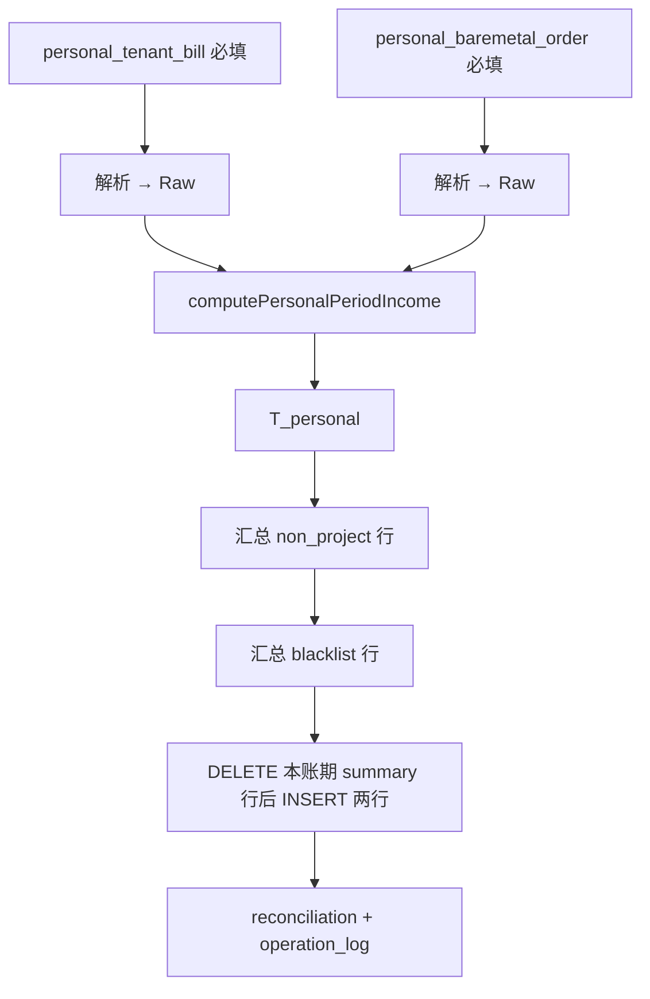

# 个人收入（非项目租户）重新生成 — 库表评估与实现方案

> 版本：v1.1（设计稿）  
> 日期：2026-06-03  
> 状态：**设计稿 — 不涉及代码修改**  
> 页面：`apps/web/src/app/[locale]/(protected)/finance/[id]/personal/page.tsx`（当前为空）  
> 关联：  
> - `billing-period-import-design.md` §3.2（裸金属）、§3.3（客户账单详情）、§5（收入 pipeline）  
> - `finance-single-period-income-design.md`（**项目关联租户** 的 CRM 账单收入，与本方案互补）  
> - `tenant-blacklist-management-design.md`（`platform_tenant_blacklist`）  
> - `packages/db/src/finance-schema.ts`、`packages/db/src/crm-schema.ts`

---

## 1. 需求摘要

| # | 需求 | 说明 |
|---|------|------|
| R1 | 上传两类 Excel | **账单详情**（§2.1）+ **裸金属订单**（§2.2，与成本/企业收入同一格式），均 **必填** |
| R2 | 计算规则 | 与 **企业收入** Excel pipeline 同源公式，但 **排除** 已在 CRM 关联经营项目的租户 |
| R3 | 个人收入汇总 | 账期 **一条** 记录：`余额消费`、`线上裸金属消费`、`总消费` |
| R4 | 黑名单汇总 | 在 R3 租户集合内，按 **当前封禁** 筛选后再汇总；**表头与 R3 一致**，与 R3 **同表存储** |
| R5 | 重新生成 | 支持覆盖上传后重算；不破坏企业收入明细（若同账期并存） |

### 1.1 已确认项（2026-06-03）

| # | 结论 |
|---|------|
| C1 | 裸金属 Excel **必传**；列、解析、账期过滤与 **成本计算 / 企业收入** 使用的 `baremetal_order` **完全一致**（§2.2） |
| C2 | 黑名单按 **当前封禁** 匹配（`status = Open` 等，§5.2）；**不**按账期历史时间窗 |
| C3 | 个人收入汇总行与黑名单汇总行 **字段一致**，存入 **同一张** 派生表，以 `summary_kind` 区分（§3.4） |

**与企业收入、单账期 CRM 收入的关系**

| 入口 | 纳入租户 | 粒度 | 数据源 |
|------|----------|------|--------|
| `/finance/create` 企业收入 | 客户消费 Excel 出现的租户（再拆项目） | 租户 × 项目 × B/C | 三类 Excel |
| `/finance/create/single` CRM 收入 | **仅** 有关联项目的租户 | 项目 × 租户 | `tenant_bill` |
| **`/finance/[id]/personal` 个人收入** | **无** 项目关联的租户 | 账期 **2 行汇总**（同表、同列） | 个人账单 Excel + 个人裸金属 Excel |

---

## 2. 输入 Excel 规范

个人收入页 **固定两个上传槽**，重新生成时 **须同时** 替换两类文件（或一次上传双文件后计算）。

### 2.1 客户账单详情（`personal_tenant_bill`）

列定义与 `billing-period-import-design.md` **§3.3** 一致：

| 列名 | 映射 Raw 字段 | 必填 |
|------|---------------|------|
| 租户ID | `tenant_platform_id` | 是（总计行除外） |
| 总消费 | `total_consumption` | 是 |
| 券消费 | `voucher_consumption` | 否，默认 0 |
| 余额消费 | `balance_consumption` | 是 |
| 总卡时 | `total_card_hours` | 否 |
| 券卡时 | `voucher_card_hours` | 否 |
| 余额卡时 | `balance_card_hours` | 是 |
| GPU型号 | `gpu_model` | 是（总计行可空） |
| 区域 | `region_code` | 是（总计行可空） |

**总计行**：`租户ID ∈ {总计, 合计, Total}` → 不写入 Raw，可选校验明细之和（±0.01）。

解析 **复用** 企业/成本路径的 `tenant_bill` 解析器；`billing_period_import_batch.file_type = 'personal_tenant_bill'`。

### 2.2 裸金属消费订单（`personal_baremetal_order`，必填）

与 **成本计算、企业收入** 使用的 **`baremetal_order`** 格式 **完全一致**（`billing-period-import-design.md` **§3.2**）：

| 列名 | 类型 | 必填 | 说明 |
|------|------|------|------|
| 订单ID | string | 是 | |
| 订单编号 | string | 否 | |
| 租户ID | string | 是 | 平台租户 ID |
| 机房名称 | string | 否 | |
| 设备型号 | string | 否 | |
| 支付状态 | string | 是 | 仅统计 **已支付** |
| 设备状态 | string | 否 | |
| 购买数量 | string | 否 | |
| 设备数量 | number | 否 | |
| 订单金额 | money | 否 | |
| 退款金额 | money | 否 | 默认 0 |
| 最终总额 | money | 是 | 收入侧「线上裸金属消费」 |
| 下单时间 | datetime | 是 | 账期过滤 |

**账期过滤**（与企业/成本一致）：`period_start 00:00:00` ≤ `下单时间` ≤ `period_end 23:59:59`（默认 `Asia/Shanghai`）。

解析 **复用** `baremetal_order` 解析器；Raw 写入 `billing_period_raw_baremetal_order`；`file_type = 'personal_baremetal_order'`。

> 个人收入 **不** 读取企业流程已上传的 `baremetal_order` batch，避免 purge / 重新生成与企业成本耦合；本页 **独立批次** 必传。

---

## 3. 数据库表结构评估

### 3.1 结论总览

| 能力 | 现库是否满足 | 说明 |
|------|--------------|------|
| 存储账单 Raw | **部分满足** | `billing_period_raw_tenant_bill` 结构匹配；需 `personal_tenant_bill` 批次隔离 |
| 存储裸金属 Raw | **部分满足** | `billing_period_raw_baremetal_order` + `personal_baremetal_order` 批次 |
| 项目关联判断 | **满足** | `crm_project` + `project_tenant` + `primary_tenant_id` |
| 黑名单主数据 | **满足** | `platform_tenant_blacklist`（当前封禁，§5） |
| **两行汇总（同表头）** | **不满足** | 需 **一张** 新派生表 + `summary_kind`（§3.4） |
| 账期级与企业收入分开 | **不满足** | 勿写入 `billing_period.total_*` / `platform_income_monthly` |

**总评**：Raw 与主数据足够；派生层需 **单表两行**（`non_project` + `blacklist`）。

### 3.2 可复用表

| 表 | 复用方式 |
|----|----------|
| `billing_period` | 元数据；个人汇总 **不** 写入其 `total_income` 等列 |
| `billing_period_raw_tenant_bill` / `billing_period_raw_baremetal_order` | 经个人 `batch_id` 写入 |
| `billing_tenant`、`platform_tenant_blacklist` | 租户解析、黑名单比对 |
| `billing_period_operation_log`、`billing_period_reconciliation_report` | 审计与对账 |

### 3.3 不宜直接复用

| 表 | 原因 |
|----|------|
| `platform_income_monthly` | 租户×项目明细，非账期汇总 |
| 企业 `tenant_bill` / `baremetal_order` batch | 与个人重新生成生命周期冲突 |
| `billing_period.total_*` | 无法并存企业 + 个人两套语义 |

### 3.4 建议新增表：`billing_period_personal_income_summary`

**一张表** 存两类汇总，**列结构完全一致**；`summary_kind` 区分行语义。

#### 3.4.1 逻辑表头（UI / 导出 / API 统一）

| 列（展示） | 字段 | 说明 |
|------------|------|------|
| 汇总类型 | `summary_kind` | `non_project` → 个人收入（非项目租户）；`blacklist` → 黑名单子集 |
| 余额消费 | `balance_consumption` | numeric(15,4) |
| 线上裸金属消费 | `bare_metal_consumption` | numeric(15,4) |
| 总消费 | `total_consumption` | `balance + bare_metal` |

两类汇总 **仅 `summary_kind` 不同**，其余三列含义相同。

#### 3.4.2 DDL 示意

```sql
CREATE TABLE billing_period_personal_income_summary (
  id                      text PRIMARY KEY,
  billing_period_id       text NOT NULL REFERENCES billing_period(id) ON DELETE CASCADE,
  summary_kind            varchar(32) NOT NULL,  -- 'non_project' | 'blacklist'
  balance_consumption     numeric(15,4) NOT NULL DEFAULT 0,
  bare_metal_consumption  numeric(15,4) NOT NULL DEFAULT 0,
  total_consumption       numeric(15,4) NOT NULL,
  -- 元数据（两行可有不同统计值，列名一致便于扩展）
  matched_tenant_count    integer NOT NULL DEFAULT 0,
  tenant_bill_batch_id    text REFERENCES billing_period_import_batch(id) ON DELETE SET NULL,
  baremetal_batch_id      text REFERENCES billing_period_import_batch(id) ON DELETE SET NULL,
  rule_version            varchar(32),
  last_computed_at        timestamptz,
  created_at              timestamptz NOT NULL DEFAULT now(),
  updated_at              timestamptz NOT NULL DEFAULT now(),
  CONSTRAINT billing_period_personal_income_summary_kind_ck
    CHECK (summary_kind IN ('non_project', 'blacklist'))
);

CREATE UNIQUE INDEX billing_period_personal_income_summary_period_kind_uk
  ON billing_period_personal_income_summary (billing_period_id, summary_kind);
```

计算完成后每个账期 **固定两行**（若 `T_personal` 为空则阻断，不产生空账期；黑名单行可为 0）：

| summary_kind | 含义 |
|--------------|------|
| `non_project` | 非项目租户全集汇总（R3） |
| `blacklist` | `T_personal ∩ T_blacklist` 汇总（R4） |

#### 3.4.3 `billing_period_import_batch.file_type` 扩展

| file_type | 唯一约束 | 必填 |
|-----------|----------|------|
| `personal_tenant_bill` | `UNIQUE (billing_period_id) WHERE file_type = 'personal_tenant_bill'` | 是 |
| `personal_baremetal_order` | `UNIQUE (billing_period_id) WHERE file_type = 'personal_baremetal_order'` | 是 |

---

## 4. 计算逻辑

### 4.1 租户分类

**项目租户** `T_project`：与 `enrichment.ts` `listProjectsForPlatformTenant` 相同（非 archived / 非 paused 项目 + `primary_tenant_id` 或 `project_tenant`）。

| 集合 | 定义 |
|------|------|
| `T_bill` | 个人账单 Raw 中出现的 `tenant_platform_id`（去重，不含总计行） |
| `T_bare` | 个人裸金属 Raw 中出现的 `tenant_platform_id`（去重） |
| `T_excel` | `T_bill ∪ T_bare`（并集，避免仅出现在裸金属的租户被漏计） |
| `T_personal` | `T_excel \ T_project` |

被排除的项目租户写入 reconciliation `excluded_project_tenants[]`。

### 4.2 分项公式（与企业收入 Step I2 / I3 一致）

对每个 `t ∈ T_personal`：

```text
B_balance(t) = Σ personal_tenant_bill.balance_consumption  （该租户所有区域×GPU 行）
M_bare(t)    = Σ personal_baremetal.final_amount           （已支付且账期内）
```

**`non_project` 行**（写入 `summary_kind = 'non_project'`）：

```text
balance_consumption    = Σ_{t ∈ T_personal} B_balance(t)
bare_metal_consumption = Σ_{t ∈ T_personal} M_bare(t)
total_consumption      = balance_consumption + bare_metal_consumption
matched_tenant_count   = |T_personal|
```

**`blacklist` 行**：令 `T_blacklist_personal = T_personal ∩ T_blacklist`（§5），公式相同，租户集合换为 `T_blacklist_personal`；`matched_tenant_count = |T_blacklist_personal|`。

券消费：记入 reconciliation，**不计入** `total_consumption`。

### 4.3 Pipeline（`computePersonalPeriodIncome`）



**前置条件**

| 检查 | 阻断？ |
|------|--------|
| 账期存在且非 `void` | 是 |
| 已发布须先撤回 | 是 |
| `personal_tenant_bill` 已导入且 `parse_status = ok` | 是 |
| `personal_baremetal_order` 已导入且 `parse_status = ok` | **是** |
| 排除后 `T_personal` 为空 | 是 |
| 黑名单行允许全 0（`T_blacklist_personal` 为空） | 否 |

**落库**：同一事务内 `DELETE FROM billing_period_personal_income_summary WHERE billing_period_id = ?`，再 `INSERT` 两行（`non_project`、`blacklist`）。

**重新生成**：`purgePersonalIncomeDerived` 删除本表两行 + 个人两类 batch 及关联 Raw；**不**动企业与 `platform_income_monthly`。

---

## 5. 黑名单比对规则（当前封禁）

### 5.1 已确认口径

按 **当前封禁状态** 计算，**不**使用账期 `[period_start, period_end]` 时间窗过滤黑名单记录。

### 5.2 匹配条件 `T_blacklist`

```text
platform_tenant_blacklist.blacklist_type = 'TenantBlack'
AND status = 'Open'          -- 封禁中（见 tenant-blacklist-management-design Q5）
AND removed_at IS NULL
```

**匹配键**（对 Raw 行 `tenant_platform_id`）：

1. `platform_tenant_blacklist.platform_tenant_id` 相等；或  
2. `local_tenant_id` → `billing_tenant.platform_tenant_id` 与 Raw 一致。

### 5.3 与子集关系

```text
T_blacklist_personal = T_personal ∩ T_blacklist
```

写入 `summary_kind = 'blacklist'` 行；UI 展示与 `non_project` 行 **同一表格、同一表头**（§3.4.1）。

恒有：`blacklist.total_consumption ≤ non_project.total_consumption`（在集合意义上）。

---

## 6. API 与页面

### 6.1 tRPC

| 过程 | 说明 |
|------|------|
| `getPersonalBundle` | `period` + `summaries[]`（两行，同结构）+ `batches` + `reconciliation` |
| `importPersonalTenantBill` | 必填 |
| `importPersonalBaremetal` | **必填** |
| `validatePersonalIncome` | 两类文件是否就绪、`|T_personal|` 预览 |
| `computePersonalIncome` | §4.3 |
| `purgePersonalIncome` | 清理 summary 表 + 个人 batch/Raw |

### 6.2 页面 `/finance/[id]/personal`

| 区块 | 内容 |
|------|------|
| 上传 | **两个槽位均必填**：账单详情 + 裸金属（格式说明链到 §2） |
| 操作 | 重新生成（purge + 双文件上传）→ 计算 |
| 结果 | **单表** 展示两行：汇总类型 \| 余额消费 \| 线上裸金属消费 \| 总消费 |

错误提示：内联 Alert（禁止仅 toast）。

### 6.3 与企业收入并存

- `platform_income_monthly`：企业/CRM 路径  
- `billing_period_personal_income_summary`：个人路径两行  
- 账期列表「总收入」**不**自动合并个人汇总

---

## 7. 实施阶段

| 阶段 | 内容 |
|------|------|
| P0 | Migration：`billing_period_personal_income_summary` + `file_type` 扩展 + 唯一索引 |
| P1 | 双文件导入（复用解析器）+ `computePersonalPeriodIncome` + purge |
| P2 | tRPC + `personal/page.tsx`（双槽必填 + 汇总表两行） |
| P3 | 可选：租户级下钻、导出 Excel、账期列表展示个人总消费 |

---

## 8. 待确认项

| ID | 问题 | 状态 |
|----|------|------|
| Q1 | 裸金属是否必传、格式 | **已确认**：必传，与成本 `baremetal_order` 一致（C1） |
| Q2 | 黑名单时间口径 | **已确认**：当前封禁（C2） |
| Q3 | 汇总存储模型 | **已确认**：同表、同表头、`summary_kind` 两行（C3） |
| Q4 | 未知平台租户 ID 是否计入 | 建议：**计入**，reconciliation 警告 |
| Q5 | 是否需补充消费列 | 建议：本期无 |

---

## 9. 修订记录

| 版本 | 日期 | 说明 |
|------|------|------|
| v1.0 | 2026-06-03 | 初稿：库表评估 + 双表方案 + 裸金属可选 |
| v1.1 | 2026-06-03 | **已确认**：裸金属必传且与成本 Excel 一致；黑名单按当前封禁；`billing_period_personal_income_summary` 单表两行同表头 |
