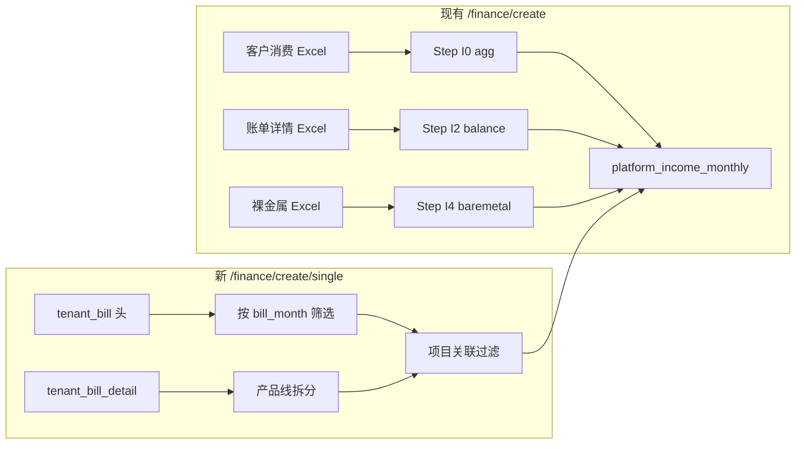
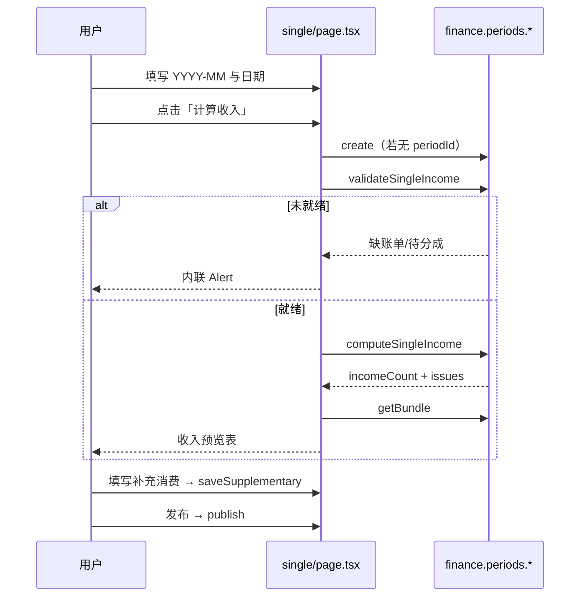

# 单账期收入（CRM 账单）页面与月度收入实现方案

> 版本：v1.0（设计稿）  
> 日期：2026-05-26  
> 状态：**设计稿 — 不涉及代码修改**  
> 页面：`apps/web/src/app/[locale]/(protected)/finance/create/single/page.tsx`（当前为空文件）  
> 关联：  
> - `apps/web/src/app/[locale]/(protected)/finance/page.tsx`（账期列表）  
> - `apps/web/src/app/[locale]/(protected)/finance/create/page.tsx`（完整 Excel 账期流程）  
> - `billing-period-import-design.md`（现有 Excel 收入 pipeline）  
> - `tenant-billing-import-design.md`（CRM `tenant_bill` 同步）  
> - `packages/db/src/crm-schema.ts`（`tenant_bill` / `tenant_bill_detail` / `project_tenant`）

---

## 1. 背景与目标

### 1.1 业务诉求

在财务域增加 **「单账期 · 仅收入」** 入口：用户创建账期后，**不依赖** 客户消费明细 / 裸金属 Excel，直接从 CRM 已同步的 **`tenant_bill` + `tenant_bill_detail`** 计算月度经营收入，且 **只统计已关联经营项目（project）的租户**。

| # | 目标 | 说明 |
|---|------|------|
| G1 | 创建账期 | 与现有「添加账期」一致：`period_code`（YYYY-MM）、`period_start`、`period_end`，调用同一 `finance.periods.create` |
| G2 | 收入数据源切换 | 以 CRM 月度账单为真值，替代 `billing_period_raw_customer_consumption` 驱动的收入 Step I0～I4 |
| G3 | 项目关联过滤 | 仅纳入「租户 ↔ 项目」已在 CRM 维护的租户（`primary_tenant_id` 或 `project_tenant`） |
| G4 | 输出兼容 | 仍写入 `platform_income_monthly` + 更新 `billing_period` 汇总字段，便于账期列表与明细页复用 |

### 1.2 非目标（本期）

- **不** 在本页面实现成本计算（`platform_cost_monthly`、账单详情 Excel、卡型成本匹配）
- **不** 替代租户详情页「从平台同步账单」；本页 **只读消费** 已入库的 `tenant_bill`
- **不** 修改现有 `/finance/create` 三类 Excel 全流程（两入口并存）
- **不** 按产品线拆成多行 `platform_income_monthly`（仍保持 **一租户（× 客户类型 × 项目）一行** 的既有粒度）

### 1.3 与现有方案的关系



---

## 2. 页面设计：`/finance/create/single`

### 2.1 路由与入口

| 项 | 值 |
|----|-----|
| 路径 | `/[locale]/finance/create/single` |
| 文件 | `apps/web/src/app/[locale]/(protected)/finance/create/single/page.tsx` |
| 布局 | `AppShell`（与 `finance/page.tsx` 一致） |
| 建议入口 | 账期管理页「添加账期」旁增加 **「快速收入账期（CRM 账单）」** 链接；或 finance 子导航 |

支持 query：`?periodId={uuid}` — 与 `/finance/create` 相同，用于编辑已创建账期（只读元数据 + 重新计算收入）。

### 2.2 页面结构（Wireframe）

```
┌─────────────────────────────────────────────────────────────┐
│ 单账期收入（CRM 账单）                    [返回账期管理]      │
│ 基于 CRM tenant_bill 计算收入，无需上传客户消费/裸金属 Excel   │
├─────────────────────────────────────────────────────────────┤
│ Card: 账期信息（与 create 页前三项字段一致）                  │
│   period_code [YYYY-MM]  period_start  period_end            │
│   （编辑模式：三项只读）                                      │
├─────────────────────────────────────────────────────────────┤
│ Card: 数据就绪检查                                            │
│   · 本账期 bill_month = period_code 的 tenant_bill 条数      │
│   · 已关联项目的租户数 / 被排除（无项目）租户数               │
│   · 缺账单租户列表（有项目关联但无 bill）— 警告，不阻断        │
│   · [刷新检查] trpc.finance.periods.validateSingleIncome      │
├─────────────────────────────────────────────────────────────┤
│ Alert 区（内联，禁止 toast 作为主提示 — 对齐 v1.5.1）          │
│   · 多项目未配置分成 → pending_allocation（若启用分成校验）   │
│   · 计算错误摘要                                              │
├─────────────────────────────────────────────────────────────┤
│ Actions                                                     │
│   [计算收入]  [保存补充消费]  [发布账期]                       │
│   （计算收入前 ensurePeriod → create 若尚无 periodId）        │
├─────────────────────────────────────────────────────────────┤
│ Card: 收入预览（computed 后展示）                             │
│   Table: platform_income_monthly 同列                        │
│   · 项目 / 客户 / 租户 / 补充 / 余额 / 裸金属 / 总消费        │
└─────────────────────────────────────────────────────────────┘
```

### 2.3 账期创建逻辑（与现有完全一致）

复用 `/finance/create` 中的 **`ensurePeriod` + `createPeriod`** 模式，不新增表结构。

| 步骤 | 行为 | 代码锚点（实施时参考） |
|------|------|----------------------|
| 1 | 用户输入 `periodCode`，`onChange` 调用 `getPeriodDateRange(periodCode)` 自动填充起止日 | `finance/_lib/period.ts` |
| 2 | 校验 `isValidPeriodCode`、`periodStart <= periodEnd` | 同上 |
| 3 | 首次「计算收入」或显式「保存账期」时 `createPeriod.mutateAsync({ periodCode, periodStart, periodEnd })` | `trpc.finance.periods.create` → `financeBillingPeriodsDataAccess.create` |
| 4 | 创建后 `syncTenantBillWindowsForPeriod(id)` 仍会执行（库表副作用）；本页 **不使用** tenant_bill window 上传 | `billing-periods.ts` L104 |
| 5 | 编辑已有账期：`?periodId=` 加载 `getById`，元数据只读 | `create/page.tsx` L915-924 |

**与账期管理页关系**：`finance/page.tsx` 仅渲染 `FinanceBillingPeriodsContent`，「添加账期」跳转 `/finance/create`；本设计建议新增跳转 `/finance/create/single`，**创建 API 不变**。

### 2.4 前端状态与 tRPC（建议）

| 状态 | 说明 |
|------|------|
| `periodCode` / `periodStart` / `periodEnd` / `periodId` | 与 create 页相同 |
| `computingIncome` | 计算中禁用按钮 |
| `supplementaryDraft` | 与 create 页相同，按 `incomeRowId` 草稿 |
| `validation` | 新过程 `finance.periods.validateSingleIncome` |

| 过程 | 类型 | 说明 |
|------|------|------|
| `finance.periods.create` | 已有 | 创建账期 |
| `finance.periods.getById` | 已有 | 加载账期 |
| `finance.periods.getBundle` | 已有 | 收入预览 |
| `finance.periods.validateSingleIncome` | **新增** | 账单覆盖度 + 项目关联 + 分成就绪 |
| `finance.periods.computeSingleIncome` | **新增** | CRM 账单收入 pipeline |
| `finance.periods.saveSupplementary` | 已有 | 补充消费 |
| `finance.periods.publish` | 已有 | 发布 |

权限：与现有财务写操作一致（`adminProcedure`）。

### 2.5 用户操作流程



---

## 3. 月度收入新实现方案（核心）

### 3.1 数据源与账期对齐

**主表**

| 表 | 用途 |
|----|------|
| `tenant_bill` | 月度账单头：`bill_month`、`total_amount`、`balance_amount`、`coupon_amount`、`tenant_id` |
| `tenant_bill_detail` | 产品线级拆分：`product_line`、`amount`、`balance_amount`、`coupon_amount` |

**账期对齐键**

```
tenant_bill.bill_month = billing_period.period_code   -- 均为 YYYY-MM
```

可选二次校验（警告级）：`tenant_bill.platform_period_start/end` 与 `billing_period.period_start/end` 区间一致；不一致记入对账报告，**不阻断**计算。

**租户主数据**：`tenant_bill.tenant_id` → `billing_tenant.id`；展示用 `platform_tenant_id`。

### 3.2 项目关联过滤（硬性纳入条件）

只统计 **至少关联一个非归档经营项目** 的租户账单。

**关联项目集合**（与 `enrichment.ts` `listProjectsForPlatformTenant` / `billing-period-import-design.md` §4.3 **一致**）：

```sql
-- 给定 billing_tenant.id = :tenantId，是否存在关联项目
SELECT EXISTS (
  SELECT 1
  FROM project p
  WHERE p.customer_id = (SELECT customer_id FROM tenant WHERE id = :tenantId)
    AND p.status <> 'archived'
    AND (
      p.primary_tenant_id = :tenantId
      OR EXISTS (
        SELECT 1 FROM project_tenant pt
        WHERE pt.tenant_id = :tenantId AND pt.project_id = p.id
      )
    )
);
```

| 场景 | 是否计入收入 | 说明 |
|------|--------------|------|
| 有 `tenant_bill` 且 EXISTS 关联项目 | **是** | 进入 pipeline |
| 有 `tenant_bill` 但 0 个关联项目 | **否** | 写入「未关联项目-已排除」报告 |
| 有关联项目但无 `tenant_bill`（该 `bill_month`） | **否** | 写入「缺账单」警告清单 |
| `tenant_bill.project_id` 非空但与关联集合不一致 | **否**（以关联集合为准） | 导入时 `project_id` 常为 `null`，**不以 bill 头 project_id 为准** |

### 3.3 聚合公式（替代 Excel Step I2/I3/I4）

对 **每个纳入的** `(tenant_id, customer_type)` 计算（`customer_type` 来自 `customer.type`，归一化为 `B` | `C`）。

#### 3.3.1 账单头（`tenant_bill`）

设账期内该租户唯一账单头（`UNIQUE(tenant_id, bill_month)`）：

```
H_total   = tenant_bill.total_amount
H_balance = tenant_bill.balance_amount
H_coupon  = tenant_bill.coupon_amount
```

#### 3.3.2 明细拆分（`tenant_bill_detail`）

按 `product_line` 归类（与 `tenant-billing-lists.ts` 常量对齐）：

```
D_bare    = Σ detail.amount       WHERE product_line = 'bare_metal'
D_balance = Σ detail.balance_amount WHERE product_line <> 'bare_metal'
          -- 或：H_balance - Σ(detail.balance_amount WHERE product_line = 'bare_metal')
D_metal_bal = Σ detail.balance_amount WHERE product_line = 'bare_metal'  -- 仅对账用
```

**推荐输出映射**（写入 `platform_income_monthly`）：

| 输出字段 | 公式 | 说明 |
|----------|------|------|
| `balance_consumption` | `D_balance`（优先）否则 `H_balance - D_metal_bal` | 非裸金属余额消费 |
| `bare_metal_consumption` | `D_bare` | 裸金属线上消费 |
| `supplementary_consumption` | `0`（初始） | 仍由 UI 手工填写 |
| `total_consumption` | `supplementary + balance + bare` | 沿用 `computeTotalConsumption` |

**券消费**：记入对账报告 `coupon_amount` / `H_coupon`，**不**进入 `total_consumption`（与 Excel 路径一致：券不驱动收入总额）。

#### 3.3.3 与 Excel 路径的差异说明

| 维度 | Excel 路径 (`compute-billing-period-income`) | CRM 账单路径（本方案） |
|------|---------------------------------------------|------------------------|
| 余额消费来源 | `billing_period_raw_tenant_bill` 汇总 | `tenant_bill_detail.balance_amount` |
| 裸金属来源 | `billing_period_raw_baremetal_order` | `product_line = bare_metal` 的 detail.amount |
| 客户类型 | Excel「客户类型」列 | `customer.type` |
| 纳入租户集合 | 客户消费 Excel 中出现的租户 | **有项目关联** 且有 `tenant_bill` 的租户 |
| 客户消费 Excel | 必填 | **不需要** |

### 3.4 项目与客户补全（Step S3）

对每个纳入租户，解析 **单个** 或 **多个** 关联项目（规则同 `classifyTenantsSql`）：

| 关联项目数 | 行为 |
|------------|------|
| 0 | 排除（§3.2） |
| 1 | `project_id` / `project_name` 取该项目；`allocation_percent = 100` |
| ≥2 | **收入侧默认策略（需产品确认）**：见 §3.5 |

客户经理：取 `project_staff_assignment` 中 `role_type = account_manager` 且 `effective_to IS NULL` 的员工（与 enrichment 一致）。

客户全称：`customer` 法人名字段（与现有 income SQL 一致）。

### 3.5 一租户多项目（收入归因）

Excel 路径对 **收入** 按租户一行输出，多项目主要在 **成本分成** 拆分；CRM 路径若严格「只统计 project 关联租户」，多项目时可选：

| 策略 | 说明 | 推荐 |
|------|------|------|
| A. 租户级一行 + 主项目 | 取 `primary_tenant_id` 对应项目，或 `project_tenant.sort_order` 最小 | 实施快，与现表 UNIQUE(period, tenant, project) 兼容 |
| B. 按成本分成拆为多行 | 每个项目一行，`balance/bare` × `allocation_percent` | 与成本侧一致，需分成已配置 |
| C. 阻断直至用户选择主项目 | 状态 `pending_project_pick` | 交互重 |

**建议首期采用策略 A**；策略 B 作为 v1.1。若采用 A，须在 UI 对多项目租户展示 **醒目提示**（与 create 页 `pending_allocation` 类似，但文案为「收入归因至主项目 xxx」）。

### 3.6 B/C 分轨

- `customer.type` → `platform_income_monthly.customer_type`（`B` | `C`）
- 同一租户仅一种客户类型；若数据异常，阻断并提示修 CRM

### 3.7 计算 Pipeline（Step S0～S5）

建议新模块：`compute-single-period-income.ts`（命名实施时确定）。

```
S0  加载 billing_period，校验状态（同 assertIncomeComputePreconditions，但去掉 Excel 前置条件）
S1  查询 tenant_bill WHERE bill_month = period_code
S2  INNER JOIN 过滤：仅保留 §3.2 EXISTS 关联项目的 tenant_id
S3  JOIN tenant_bill_detail，按 §3.3 聚合 bare / balance
S4  JOIN customer / project / staff，写入 platform_income_monthly（DELETE 本账期旧 income 后 INSERT）
S5  stepI5UpdatePeriodIncomeTotals({ markComputed: true })
S6  写入 billing_period_reconciliation_report（可选）：缺账单、已排除、券合计、与 H_total 差异
```

**前置条件（相对 Excel 路径的简化）**

| 检查 | 阻断？ |
|------|--------|
| 账期存在且非 published/void | 是 |
| 至少 1 条纳入的 tenant_bill | 是（无数据不可计算） |
| 多项目且策略 B 未配置分成 | 是 |
| 部分关联租户缺 bill | 否（警告） |
| detail 汇总与 bill 头金额偏差 > ε | 否（对账报告） |

**不再要求**：`customer_consumption` / `baremetal` Excel、`validateCrossFileImports`（B 端未知租户来自 Excel 的场景）。

### 3.8 参考 SQL（单租户聚合示意）

```sql
-- 账期 :periodCode, :periodId
SELECT
  tb.tenant_id,
  c.type AS customer_type,
  tb.id AS bill_id,
  COALESCE(SUM(CASE WHEN d.product_line = 'bare_metal' THEN d.amount::numeric ELSE 0 END), 0) AS bare_metal,
  COALESCE(SUM(CASE WHEN d.product_line <> 'bare_metal' OR d.product_line IS NULL
                    THEN d.balance_amount::numeric ELSE 0 END), 0) AS balance_non_bare
FROM tenant_bill tb
JOIN tenant t ON t.id = tb.tenant_id
JOIN customer c ON c.id = t.customer_id
LEFT JOIN tenant_bill_detail d ON d.bill_id = tb.id
WHERE tb.bill_month = :periodCode
  AND EXISTS ( /* §3.2 项目关联子查询 */ )
GROUP BY tb.tenant_id, c.type, tb.id;
```

### 3.9 输出表与账期汇总

与 `billing-period-import-design.md` §5.4 / §5.7 保持一致：

```
total_consumption = supplementary + balance_consumption + bare_metal_consumption

billing_period.total_income     = Σ total_consumption
billing_period.balance_income   = Σ balance_consumption
billing_period.baremetal_income = Σ bare_metal_consumption
billing_period.supplementary    = Σ supplementary_consumption
billing_period.status           = 'computed'（计算完成后）
```

### 3.10 补充消费与发布

- **补充消费**：完全复用 `saveSupplementary` + create 页表格交互
- **发布**：复用 `publish`；发布前须 `status = computed`
- **重新计算**：`purge` 仅删 `platform_income_monthly` 与本账期 reconciliation（**不**删 CRM `tenant_bill`）；或新增 `purgeSingleIncomeDerived(periodId)`

---

## 4. 数据就绪检查 API 设计

### 4.1 `validateSingleIncome`

**输入**：`{ billingPeriodId: string }`

**输出示例**：

```typescript
type ValidateSingleIncomeResult = {
  periodStatus: string
  billMonth: string                    // = period_code
  billsInDb: number                    // 该月 tenant_bill 总数
  tenantsWithProject: number           // 有关联项目的租户数（去重）
  tenantsIncluded: number              // 将参与计算的租户数（有 bill ∩ 有项目）
  tenantsExcludedNoProject: Array<{ tenantId; platformTenantId; tenantName }>
  tenantsMissingBill: Array<{ tenantId; platformTenantId; tenantName; projectNames: string[] }>
  pendingAllocations: /* 同 validate */  // 若采用策略 B
  canComputeSingleIncome: boolean
}
```

### 4.2 `computeSingleIncome`

**输入**：`{ billingPeriodId: string }`  
**输出**：`{ incomeCount: number; reconciliationIssues: string[] }`（与 `ComputeIncomeResult` 对齐）

**操作日志**：`operation = 'compute_single_income'`，`metadata.source = 'crm_tenant_bill'`。

---

## 5. 对账与可观测性

| 报告项 | 来源 | 级别 |
|--------|------|------|
| 明细余额 + 裸金属 ≠ 账单头 `total_amount`（容差 0.01） | S3 vs H_total | 警告 |
| 有项目无账单 | anti-join | 警告 |
| 有账单无项目（已排除） | §3.2 | 信息 |
| 券消费合计 | H_coupon | 信息 |
| 多项目收入归因项目名 | 策略 A | 信息 |

存储：复用 `billing_period_reconciliation_report` JSON 字段，或扩展 `metadata` 结构，避免新表。

---

## 6. 实施阶段建议

| 阶段 | 内容 | 依赖 |
|------|------|------|
| P0 | `validateSingleIncome` + `computeSingleIncome` data access + tRPC | CRM 账单已通过租户详情同步 |
| P1 | `single/page.tsx` UI（账期表单 + 检查 + 计算 + 预览） | P0 |
| P2 | 账期列表入口、操作日志、对账报告展示 | P1 |
| P3 | 多项目策略 B、与成本账期联动（可选） | 成本分成 UI |

---

## 7. 风险与待确认项

| ID | 问题 | 建议默认 |
|----|------|----------|
| Q1 | 多项目租户收入归因用策略 A 还是 B？ | 首期 A |
| Q2 | `product_line IS NULL` 的 detail 行归入 balance 还是忽略？ | 归入 balance_non_bare |
| Q3 | 是否要求 `tenant_bill.status` 为已支付才计入？ | 否，凡有账单即计；status 仅展示 |
| Q4 | C 端租户是否全部纳入？ | 是，只要有关联项目且有 bill |
| Q5 | 与 `/finance/create` 同一 `period_code` 是否允许两种算法切换？ | 不允许；同一账期仅一种收入计算方式（创建入口区分） |

---

## 8. 文件清单（实施时 touch，本文不修改）

| 层级 | 文件 |
|------|------|
| 页面 | `apps/web/src/app/[locale]/(protected)/finance/create/single/page.tsx` |
| 计算 | `apps/web/src/lib/server/dataaccess/finance/compute-single-period-income.ts` |
| 校验 | `apps/web/src/lib/server/dataaccess/finance/validate-single-income.ts` |
| 路由 | `apps/web/src/lib/server/routers/finance/index.ts` |
| 列表入口 | `apps/web/src/components/dashboard/finance-billing-periods-content.tsx` |
| 共享 | 复用 `finance/_lib/period.ts`、`income-row-utils.ts`、`billing-periods.ts` create/getBundle/publish |

---

## 9. 附录：关键 schema 摘录

`tenant_bill`（`crm-schema.ts`）：

- `tenant_id`、`bill_month`（YYYY-MM）、`total_amount`、`balance_amount`、`coupon_amount`
- `project_id`（可选，导入常为 null）
- 唯一约束：`(tenant_id, bill_month)`

`tenant_bill_detail`：

- `bill_id`、`product_line`、`amount`、`balance_amount`、`coupon_amount`、`type`（预付费/后付费）

`project` 关联：

- `primary_tenant_id`
- `project_tenant(project_id, tenant_id)`

`platform_income_monthly`（输出）：

- `balance_consumption`、`bare_metal_consumption`、`supplementary_consumption`、`total_consumption`
- 唯一：`(billing_period_id, tenant_id, project_id)`
