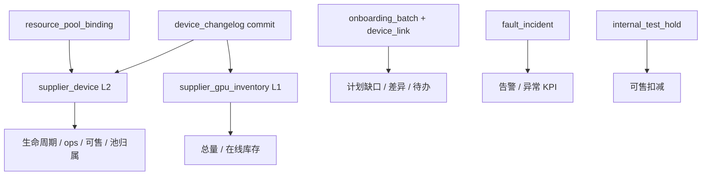

# 全局运营监控大盘 — 实现方案（对齐资源总览统计口径）

**页面**：`/dashboard/global`（`apps/web/src/app/[locale]/(protected)/dashboard/global/page.tsx`）  
**关联设计**：

- [supplier-onboarding-plan-changelog-tracking-design.md](./supplier-onboarding-plan-changelog-tracking-design.md) §5.4（资源总览读模型，**已部分落地**）
- [global-dashboard-period-analytics.md](./global-dashboard-period-analytics.md)（时间段分析，**远期扩展**）
- [supplier-lifecycle-product-plan.md](./supplier-lifecycle-product-plan.md)（产品定位）

**文档性质**：实现方案（不涉及代码改动）  
**版本**：v1.0（2026-05-23）

---

## 1. 背景与目标

### 1.1 现状

`/dashboard/global` 当前由 7 个卡片组件 + `GlobalDashboardHeader` 组成，**全部为硬编码 Mock**：

| 组件 | 文件 | 当前数据来源 |
|------|------|--------------|
| KPI 区 | `global-kpi-section.tsx` | `KPI_ITEMS` 常量（8 项） |
| 生命周期流转 | `lifecycle-flow-card.tsx` | `LIFECYCLE_STAGES`（9 段 IDC 语义） |
| 资源池饼图 | `resource-pool-chart-card.tsx` | `POOL_PIE`（6 池：platform/dedicated/…） |
| 机房集群 | `cluster-status-card.tsx` | `CLUSTERS` 常量 |
| 差异校验 | `discrepancy-table-card.tsx` | `DISCREPANCY_ROWS`（交付/部署/上架/可售） |
| 告警时间线 | `alerts-timeline-card.tsx` | `ALERTS` 常量 |
| 待办任务 | `global-todos-card.tsx` | `TODOS` 常量 |
| 页头 | `global-dashboard-header.tsx` | 本地时钟 + 卡型 Mock 下拉 |

服务端 **`dashboard.globalOps` tRPC 尚未实现**（`routers/web/dashboard.ts` 为空 router）；`supplier.overview.getStats` **已实现**并接 DB（`lib/server/dataaccess/supplier/overview.ts`）。

### 1.2 目标

1. **Snapshot 模式优先**：大盘展示与 `/supplier/overview` **同一套 L1/L2 聚合口径**，全局无筛选时数值应与 overview「全部供应商 + 全部区域 + 全部卡型 + 全部资源池」一致。
2. **双看板同步**（设计 G5）：Global 与 Supplier Overview 对同一指标不出现两套算法。
3. **分阶段交付**：P1 接真实 DB 截面；P2 补批次缺口/差异/告警/待办；P3 再引入 Period 分析（见 `global-dashboard-period-analytics.md`）。
4. **最小 UI 破坏**：优先改数据源与口径映射；生命周期漏斗建议 **对齐 5 段 CRM 模型**（见 §3.2）。

### 1.3 非目标（本期）

- 不实现 6 池 workload 细分的真实利用率/财务指标（饼图右侧「收入 +12%」等保留占位或隐藏）。
- 不新建 `device_daily_snapshot` / DWS 日表（Period 模式专属，见 §8）。
- 不替代供应商明细页的 CRUD。

---

## 2. 统计口径权威来源

### 2.1 分层模型（与 §5.4 一致）



**原则（R-OV1 ~ R-OV3）**：

| 规则 | 含义 |
|------|------|
| R-OV1 | 「在线 / 可售 / 裸金属池 / 弹性池 / 双池 / 线下交付」来自 **`supplier_device` 当前态**，不用业务批次 `device_link` |
| R-OV2 | `不可调度节点运行中` 计在线但不计可售；`其他部门使用中` 不计可售 |
| R-OV3 | 表头字段与聚合字段一一对应，禁止错位 |
| R-LINK* | 批次进度（计划 / 触达 / 在线）**仅**用 `onboarding_batch_device_link` + `getProgress` |

### 2.2 共享模块（建议抽取）

当前逻辑集中在 `overview.ts`，Global 实现 **不应复制 SQL**，应抽取：

| 模块 | 路径（建议） | 职责 |
|------|--------------|------|
| 池归属 | 已有 `lib/supplier/device-pool-membership.ts` | `resolveDevicePoolMemberships` / `isDualPool` |
| 聚合核心 | 新建 `lib/server/aggregation/overview-aggregation.ts` | `kpiFromDevices`、可售公式、lifecycle 分桶、ops 管道、supplier/inventory 行 |
| 数据访问 | `overview.ts` + 新建 `global-ops.ts` | 调用聚合；overview 带筛选，global 默认 `filters=all` |
| 类型 | 扩展 `lib/types/supplier-overview-api.ts` 或新建 `global-dashboard-api.ts` | Global 专用 DTO |

**重构顺序**：先从 `overview.ts` 抽出纯函数 → `overview.getStats` 与 `globalOps.getSnapshot` 共用 → 再改 Global 前端。

### 2.3 通用 KPI 结构

与 Supplier Overview 一致，每个状态桶同时返回 **卡数 + 台数**：

```typescript
type OverviewKpiMetric = {
  deviceCount: number  // COUNT(DISTINCT supplier_device.id)
  gpuCount: number     // SUM(supplier_device.gpu_count)
}
```

---

## 3. Global 卡片 ↔ 统一口径对照

### 3.1 KPI 区（`GlobalKpiSection`）

**现状 Mock 8 项与统一口径映射**（Snapshot 模式）：

| Global Mock 标题 | 建议 key | 统一口径（§5.4.1 / §5.4.2） | 单位 | 与 overview 字段 |
|------------------|----------|------------------------------|------|------------------|
| GPU 总卡数 | `gpu_total` | L1：`SUM(supplier_gpu_inventory.quantity)`；设备台数 = 过滤后 `supplier_device` 行数 | 卡 / 台 | `kpis.total` |
| 在线设备 | `device_online` | `lifecycle_status = '在线'` | 卡 · 台 | `kpis.online` |
| 弹性资源池 | `pool_elastic` | §3.4.5：`memberships.has('elastic_service')` 的 GPU 汇总 | 卡 | `Σ inventoryRows.elasticServiceGpu` 或设备级聚合 |
| 裸金属池 | `pool_bare_metal` | §3.4.5：`memberships.has('bare_metal')` | 卡 | `Σ bareMetalPoolGpu` |
| 内部占用 | `internal_test` | L1 测试标记 + `internal_test_hold` 叠加 | 卡 | `kpis.internalTestGpu` |
| 异常设备 | `device_abnormal` | 未关闭 `fault_incident` 关联设备去重台数；辅：`faultOpenCount` | 台 | `kpis.faultOpenCount` + 设备维度 |
| 待上架设备 | `device_pending_shelving` | **`lifecycle_status = '待接入'`**（非 IDC「待上架」） | 卡 · 台 | `kpis.pendingAccess` |
| 待上架机房 | `idc_pending_access` | 存在 `待接入` 设备的 `data_center` / `idc_region` 去重数 | 个 | 由设备聚合 |

**口径对齐说明（重要）**：

1. Mock 文案「待上架」在 CRM 域对应 **`待接入`**（已创建接入批次、尚未 `设备接收`），不是 IDC 部署链路的 `pending_shelving`。
2. Mock「在线设备」仅展示台数；统一口径卡片建议改为 **`{gpuCount} 卡 · {deviceCount} 台`**，与 overview 一致。
3. 「弹性 / 裸金属」两 KPI **允许双池重叠**（代理裸金属），不在 KPI 层做互斥去重；表底 footnote 复用 §5.4.6 文案。
4. Sparkline / delta：P1 可返回 `null` 或基于 **7 日 inventory 快照占位**；真实趋势属 Period 能力（§8）。

**建议 P1 KPI 扩展（可选，与 overview 子 KPI 对齐）**：

| 标题 | 字段 | 口径 |
|------|------|------|
| 接入中 | `onboarding` | `lifecycle_status = '接入中'` |
| 可售 | `sellable` | §5.4.2 公式 |
| 活跃批次 | hint | `activeBatches` |

可在第二行子 KPI 区展示（与 `supplier-overview-content` 布局对齐），或保留 8 卡但替换语义。

### 3.2 生命周期流转（`LifecycleFlowCard`）

**口径冲突**：

| 来源 | 阶段模型 |
|------|----------|
| Global Mock | 9 段：已交付 → … → 运营中 → 异常 → … |
| Supplier Overview（已实现） | **5 段 CRM**：待接入 → 接入中 → 在线 → 维护中 → 下线中 |

**决策（推荐）**：Global 漏斗 **改为 5 段**，与 `LIFECYCLE_ORDER` 及 `supplier.overview.getStats.lifecycleFunnel` **完全一致**。

| 阶段 | 聚合 | warn 条件 |
|------|------|-----------|
| 待接入 | `lifecycle_status = '待接入'` | `deviceCount > 0` |
| 接入中 | `lifecycle_status = '接入中'` | 同上 |
| 在线 | `lifecycle_status = '在线'` | — |
| 维护中 | `lifecycle_status = '维护中'` 或 `in_maintenance=true` | — |
| 下线中 | `lifecycle_status = '下线中'` | — |

**展示字段**：`{gpuCount} 卡 · {deviceCount} 台`；Mock 的「平均停留」P1 **不实现**（需 `entity_state_transition_log` 或日快照，属 Period/P3）。

**IDC 9 段模型**：保留在 `global-dashboard-period-analytics.md` 作为 **远期 Period 维度**；Snapshot 阶段不混用，避免与 CRM 状态机双轨。

### 3.3 资源池分布（`ResourcePoolChartCard`）

**口径分层**：

| 层级 | P1 Snapshot | 说明 |
|------|-------------|------|
| **平台池（2 池）** | ✅ 实现 | 裸金属池 / 弹性用量池，与 §3.4.5 一致 |
| **Workload 6 池** | ⏸ 占位 | platform/dedicated/inference/training/standby/maintenance 需 `workload_profile` + 监控，P1 用 2 池饼图替代或折叠 |

**P1 饼图数据**：

```typescript
// 来自 getStats 全平台聚合（filters=all）
slices: [
  { key: 'elastic_service', label: '弹性用量池', gpuCount, deviceCount },
  { key: 'bare_metal', label: '裸金属池', gpuCount, deviceCount },
  { key: 'dual_pool', label: '双池（重叠）', gpuCount, deviceCount }, // 可选第三扇区或 footnote
]
```

- **中心总计**：`gpuCount` 之和 **不等于** `gpu_total`（双池重复计数）；中心文案应写「池占用 GPU」而非「平台 GPU 总量」，并附 §5.4.6 footnote。
- **利用率 / 财务 / 型号结构**：P1 隐藏或显示「暂无数据」；禁止继续展示 Mock 百分比以免误导。

**与 overview 对齐验证**：Global 裸金属 + 弹性 − 双池 = overview 供应商表各行 `bareMetalPoolGpu + elasticServiceGpu − dualPoolGpu` 之和。

### 3.4 机房集群状态（`ClusterStatusCard`）

**聚合维度**：`data_center`（JOIN `supplier_device.data_center_id` + `data_center.name`），可选按主卡型取 `MODE(gpu_card_type.name)` 展示。

| Mock 字段 | 统一口径 | 数据源 |
|-----------|----------|--------|
| `total` | 该机房下设备 `SUM(gpu_count)` | L2 设备 |
| `online` | `lifecycle_status = '在线'` | L2 |
| `abnormal` | 未关闭故障且 `supplier_device_id` 属于该机房 | `fault_incident` |
| `pending` | `lifecycle_status = '待接入'` 或 `'接入中'`（建议分列或合并为「接入未完成」） | L2 |
| `shelvingRate` | **`在线 GPU / 总量 GPU`**（非 IDC 交付→上架率） | 与 overview 可售率不同，需在 UI 标注「在线率」 |
| `netOk` | P1：`true` 占位；P2：网络类 `fault_incident` 或外部探测 | — |
| `owner` | P1：空或 `data_center` 运维字段（若有） | 维度属性 |

**排序**：按 `sellableGpu` 或 `onlineGpu` 降序，Top N=4~8。

### 3.5 资源差异校验（`DiscrepancyTableCard`）

Mock 的「交付 / 部署 / 上架 / 可售」四级 **与 CRM 当前模型不对齐**。P1 改为 **接入计划 vs 实际** 差异（§5.5 Path E）：

| 列 | 字段 | 口径 |
|----|------|------|
| 对象 | `supplierName` + `dataCenterName` | 进行中 `onboarding_batch`（`batch_kind ∈ online, order_access`，非终态） |
| 计划 | `plannedDeviceCount` | 批次 `planned_device_count` |
| 触达 | `touchedDeviceCount` | `onboarding_batch_device_link` 去重设备数 / 缓存 `touched_device_count` |
| 在线 | `onlineDeviceCount` | link 设备中 `lifecycle_status = '在线'` |
| 可售 | `sellableGpu` | 该批次关联设备按 §5.4.2 汇总 GPU（可选 P2） |
| 差异 | 文案 | `planned − online` 或 `planned − touched` |
| 状态 | `ok` / `pending` / `abnormal` | 缺口 > 0 且超 `planned_ready_at` → abnormal |

**注意**：批次「在线」**≠** 供应商表「在线 GPU」（R-OV1）。表头 Tooltip 必须说明。

**远期**：IDC 四级差异（交付/部署/上架/可售）依赖 `entity_state_transition_log` + 日快照，见 `global-dashboard-period-analytics.md` §5.5。

### 3.6 异常告警（`AlertsTimelineCard`）

**P1 数据源**：`fault_incident`（已有 overview `faultSla.recentOpen`）

| UI 字段 | DB 映射 |
|---------|---------|
| `time` | `opened_at` |
| `level` | `severity`：P1→严重，P2→警告，P3/P4→提示 |
| `type` | P1 固定 `fault`；P2 可按 `fault_type` 映射 network/shelving/pool |
| `title` | `fault_type` + 供应商/机房 |
| `detail` | 影响设备数、`incident_status` |
| `state` | `incident_status`：未关闭→未恢复，处理中→处理中，已关闭→已恢复 |

筛选器：级别 / 类型接 API query；默认最近 20 条，按 `opened_at DESC`。

**P2 扩展**：SLA 违规（待接入超期批次）、池利用率（需监控）、网络探测 → 写入未来 `ops_alert_event` 表。

### 3.7 待办任务（`GlobalTodosCard`）

**P1 数据源**（无需新表）：

| 待办类型 | 生成规则 | 跳转 |
|----------|----------|------|
| 接入缺口 | 活跃批次 `planned_device_count − online_device_count > 0` 且距 `planned_ready_at` < 24h 或已超期 | `/supplier/onboarding-batches/[id]` |
| 故障处理 | 未关闭 P1/P2 `fault_incident` | 设备/故障详情 |
| 差异核对 | §3.5 表 status=abnormal 行 | 批次详情 |

字段映射：`priority` ← severity 或批次 SLA；`assignee` P1 可空；`due` ← `planned_ready_at` 相对时间。

**P2**：独立 `ops_todo_item` 表（见 period 设计 §5.7）。

---

## 4. API 设计

### 4.1 tRPC Router

在 `appRouter` 下扩展（二选一，推荐 A）：

**方案 A — 独立 namespace**（与设计 §8.4 一致）：

```
dashboard.globalOps
├── getFilterOptions   // 卡型、区域、机房（复用 overview 逻辑）
├── getSnapshot        // P1 一站式 Snapshot（推荐单请求）
├── getKpis            // 可选拆分
├── getLifecycleFunnel
├── getResourcePools
├── getClusters
├── getDiscrepancies
└── getAlertsAndTodos
```

**方案 B — 复用 overview**：

```
supplier.overview.getStats({ region:'all', supplierId:'all', cardType:'all', poolCode:'all' })
```

+ 前端组装 Global 卡片。  
**缺点**：一次返回 supplier/inventory 全表，Global 不需要；且差异/待办/集群需额外过程。

**推荐**：**方案 A**，内部调用共享 `overview-aggregation`，`getSnapshot` 返回 Global 专用 DTO。

### 4.2 `getSnapshot` 请求 / 响应

**Input**：

```typescript
type GlobalDashboardFilters = {
  region?: string        // default 'all'
  cardType?: string      // default 'all'，对接 header 卡型下拉
  dataCenterId?: string  // optional，P2
  supplierId?: string    // optional，P2
}
```

**Output**（Snapshot）：

```typescript
type GlobalDashboardSnapshot = {
  meta: {
    asOf: string           // ISO8601
    timezone: 'Asia/Shanghai'
    filters: GlobalDashboardFilters
  }
  kpis: GlobalKpiItem[]    // §3.1，含 metric: OverviewKpiMetric
  lifecycleFunnel: LifecycleFunnelStageDto[]  // 与 overview 同型
  resourcePools: {
    slices: Array<{ key: string; label: string; gpuCount: number; deviceCount: number }>
    dualPoolGpu: number
    footnote: string       // §5.4.6 固定文案
  }
  clusters: ClusterStatusRow[]
  discrepancies: DiscrepancyRow[]
  alerts: AlertRow[]
  todos: TodoRow[]
  // 可选：与 overview 对齐的 opsPipeline
  opsPipeline?: OpsPipelineGroupDto[]
}
```

**缓存**：React Query `staleTime: 30_000`；服务端可对 `filters=all` 短缓存 30s。

### 4.3 与 `supplier.overview.getStats` 的一致性校验

实现完成后应满足（同一 DB 快照下）：

| 指标 | 关系 |
|------|------|
| Global `gpu_total.gpuCount` | = overview `kpis.total.gpuCount`（filters 均为 all） |
| Global `device_online` | = overview `kpis.online` |
| Global `pool_elastic` | = Σ `inventoryRows.elasticServiceGpu` |
| Global `pool_bare_metal` | = Σ `inventoryRows.bareMetalPoolGpu` |
| Global `lifecycleFunnel` | = overview `lifecycleFunnel` |
| Global 批次缺口之和 | ≤ overview `kpis.pendingAccess + kpis.onboarding`（批次维度 ⊂ 设备维度） |

建议增加 **集成测试** 或 seed 数据断言上述恒等式。

---

## 5. 前端改造要点

### 5.1 页面与 Header

| 文件 | 改造 |
|------|------|
| `page.tsx` | 保持布局；子组件改接 `trpc.dashboard.globalOps.getSnapshot` |
| `global-dashboard-header.tsx` | 卡型下拉接 `getFilterOptions.cardTypes`；筛选变更触发 query refetch；P3 再加 mode/日期范围 |
| 各 `_*-card.tsx` | 删除常量数组；接收 props 或内部 `useQuery`；loading/error/empty 态 |

### 5.2 生命周期卡片 UI 变更

- 标题改为「物理机生命周期漏斗」（与 overview 一致）。
- 副标题 Snapshot：`L2 物理设备按 lifecycle_status 分布`。
- 移除 9 段 IDC 文案，避免与 CRM 混淆。

### 5.3 资源池卡片 UI 变更

- P1：2~3 扇区（弹性 / 裸金属 / 可选双池说明）。
- 移除 Mock 联线卡片中的利用率、财务文案，或改为 skeleton。
- 表底增加 §5.4.6 footnote。

### 5.4 下钻链接

| 卡片 | 点击行为 |
|------|----------|
| KPI 可售 / 在线 | `/supplier/overview` |
| 生命周期某阶段 | `/supplier/overview` + query 预置筛选（P2） |
| 差异行 | `/supplier/onboarding-batches/[id]` |
| 集群 | `/supplier/suppliers/[id]` 或机房详情（P2） |

---

## 6. 实施分期

与设计文档 §10 阶段五对齐，细化为：

| 阶段 | 范围 | 交付物 | 依赖 |
|------|------|--------|------|
| **G0** | 抽取 `overview-aggregation.ts`；overview 回归无行为变化 | 共享聚合模块 + 测试 | overview 已上线 |
| **G1** | `dashboard.globalOps.getSnapshot`（KPI + 漏斗 + 2 池饼图） | Global P1 可演示真实存量 | G0 |
| **G2** | clusters + discrepancies + alerts + todos | 运营闭环卡片 | onboarding progress |
| **G3** | Header 筛选；与 overview 一致性测试；footnote / Tooltip | 双看板数值对齐 | G1 |
| **G4** | `entity_state_transition_log` 驱动停留时长；ops_alert_event | 生命周期 SLA、告警扩展 | 日志落库完整 |
| **G5** | Period 模式（`global-dashboard-period-analytics.md`） | 日期范围 + 净增/吞吐 | 日快照 + DWS |

**建议优先级**：G0 → G1 → G3（对齐验证）→ G2 → G4 → G5。

---

## 7. 文件清单（实现时）

| 类型 | 路径 |
|------|------|
| 聚合 | `apps/web/src/lib/server/aggregation/overview-aggregation.ts` |
| DataAccess | `apps/web/src/lib/server/dataaccess/dashboard/global-ops.ts` |
| 类型 | `apps/web/src/lib/types/global-dashboard-api.ts` |
| Schema | `apps/web/src/lib/server/routers/dashboard/global-ops-schemas.ts` |
| Router | `apps/web/src/lib/server/routers/web/dashboard.ts` 或 `routers/dashboard/global-ops.ts` |
| 注册 | `apps/web/src/lib/server/routers/index.ts` → `dashboard.globalOps` |
| 前端 | `dashboard/global/_components/*.tsx` |
| 测试 | `apps/web/src/lib/server/aggregation/overview-aggregation.test.ts` |
| 测试 | `apps/web/src/lib/server/dataaccess/dashboard/global-ops.test.ts` |

---

## 8. 与 Period 分析文档的关系

[`global-dashboard-period-analytics.md`](./global-dashboard-period-analytics.md) 描述 **Snapshot + Period 双模式** 及 DWS 架构。本文 Snapshot 口径 **以 §5.4 为准**；Period 文档中的差异项如下：

| 主题 | Period 文档 | 本文 Snapshot 决策 |
|------|-------------|-------------------|
| 生命周期 | 9 段 `dim_lifecycle_stage` | **5 段 CRM**，与 overview 一致 |
| 待上架 | `pending_shelving` | **`待接入`** CRM 状态 |
| 资源池 | 6 个 `pool_code` | **2 池** bare_metal / elastic_service（§3.4.5） |
| 差异四级 | 交付/部署/上架/可售 | **计划/触达/在线**（批次）；四级留 Period |
| KPI delta | 环比/sparkline | P1 不实现；Period 接 `global_kpi_daily` |

Period 模式应在 G5 启动，且 **Snapshot 期末值** 必须与本文 `getSnapshot` 在 `as_of = period_end` 时一致（见 period 文档 §7.3）。

---

## 9. 风险与待确认

| # | 项 | 建议 |
|---|-----|------|
| Q1 | Global KPI 是否保留 8 卡布局，还是改为 overview 6+3 布局？ | 产品确认；口径以 §3.1 为准，布局可灵活 |
| Q2 | 「待上架设备/机房」文案是否改为「待接入」？ | **建议改**，避免与 IDC 语义混淆 |
| Q3 | 集群卡片「上架率」是否改名为「在线率」？ | **建议改**，公式为 online/total |
| Q4 | 6 池饼图何时恢复？ | 依赖 `workload_profile` 绑定完整 + 利用率监控，标 P4 |
| Q5 | `entity_state_transition_log` 是否已随 changelog commit 写入？ | 需审计；否则生命周期停留/Sla 不可做 |
| Q6 | Global 是否需要独立 RBAC？ | 默认与 overview 同 `protectedProcedure` |

---

## 10. 修订记录

| 版本 | 日期 | 说明 |
|------|------|------|
| v1.0 | 2026-05-23 | 初稿：基于已实现的 `supplier.overview.getStats` 对齐 Global 大盘 Snapshot 实现方案 |
