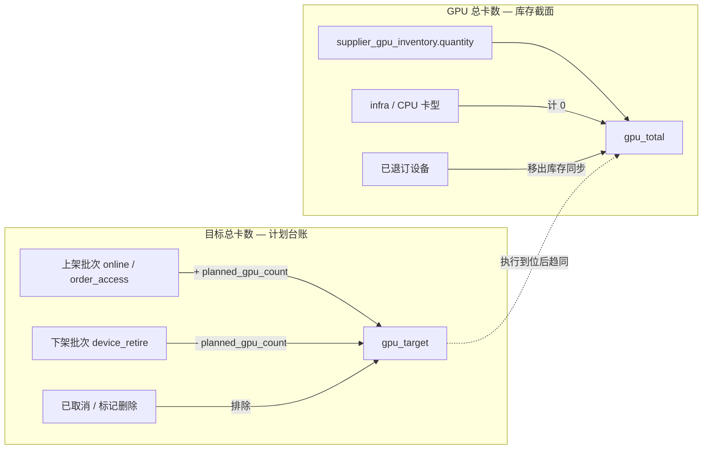

# 全局运营监控大盘 — KPI 统计口径规范

**页面**：`/dashboard/global`（`GlobalKpiSection` 及关联卡片）  
**关联实现**：

- `apps/web/src/lib/server/dataaccess/dashboard/global-ops.ts`（Snapshot）
- `apps/web/src/lib/server/dataaccess/dashboard/global-period.ts`（Period）
- `apps/web/src/lib/server/dataaccess/supplier/overview.ts`（共享聚合）
- `apps/web/src/lib/server/aggregation/overview-aggregation.ts`（纯函数）
- `packages/db/src/dashboard-schema.ts`（DWS metric_key 元数据）

**关联设计**：

- [global-dashboard-implementation-plan.md](./global-dashboard-implementation-plan.md)
- [global-dashboard-period-analytics.md](./global-dashboard-period-analytics.md)
- [supplier-overview-scenarios-from-zero.md](./supplier-overview-scenarios-from-zero.md)
- [datacenter-device-retire-design.md](./datacenter-device-retire-design.md)

**文档性质**：字段定义 + 全量 KPI 计算公式（权威口径）  
**版本**：v1.0（2026-05-29）

---

## 1. 核心概念：GPU 总卡数 vs 目标总卡数

大盘同时展示两类 **不同语义** 的 GPU 规模指标，禁止混用或相互替代。

| 指标 | 建议 key | 语义 | 回答的问题 |
|------|----------|------|------------|
| **GPU 总卡数** | `gpu_total` | **当前库存截面**：L1 库存表已入库 GPU 卡数之和 | 「此刻账上有多少 GPU 卡？」 |
| **目标总卡数** | `gpu_target` | **计划净容量**：历史上有效上架计划卡数 − 有效下架计划卡数 | 「按商务/运营下达的计划，净应有多少 GPU 卡？」 |



**典型剪刀差**（见 [supplier-overview-scenarios-from-zero.md §3.3](./supplier-overview-scenarios-from-zero.md)）：

| 阶段 | GPU 总卡数 | 目标总卡数 | 说明 |
|------|-----------|-----------|------|
| S1 仅创建上架计划 | 0 | 32 | 计划已下达，主数据未导入 |
| S3 主数据导入 | 32 | 32 | 库存与计划对齐 |
| R1 创建下架计划（16 卡） | 48 | 32 | 目标立即 −16；库存尚未退订 |
| R3b 退订完成 | 32 | 32 | 库存下降；目标不变（批次已完成仍计入台账） |

---

## 2. 字段定义

### 2.1 设备与卡型

| 字段 | 表 / 来源 | 类型 | 说明 |
|------|-----------|------|------|
| `gpu_count` | `supplier_device.gpu_count` | integer | 单台设备 GPU 卡数；缺省 **8**（`DEFAULT_GPU_PER_DEVICE`） |
| `device_role` | `gpu_card_type.device_role` | `compute` \| `infra` | 卡型角色；未填时由 name/code 推断（含 `cpu` → `infra`） |
| `cardTypeRole` | 应用层 | `GpuCardTypeRole` | `resolveGpuCardTypeRole()` 解析结果 |
| `lifecycle_status` | `supplier_device.lifecycle_status` | enum | CRM 五段 + 归档态 `退订` |
| `ops_status` | `supplier_device.ops_status` | varchar | 运维 Excel 原文（如 `已退订`、`在集群中`） |
| `in_maintenance` | `supplier_device.in_maintenance` | boolean | 维修标记 |

**GPU 有效卡数（设备级）**：

```
metricGpuCount(device) =
  IF cardTypeRole = 'infra' THEN 0
  ELSE max(0, device.gpu_count)   // 缺省或非法 → 8
```

**GPU 有效卡数（L1 库存行）**：

```
inventoryGpuQuantity(role, quantity) =
  IF role = 'infra' THEN 0
  ELSE quantity
```

> **CPU / 基础设施设备**：`device_role = infra` 或名称含 `cpu` 的行 **不计入任何 GPU KPI**（含 GPU 总卡数、目标总卡数、生命周期 GPU 分桶）。

### 2.2 L1 库存

| 字段 | 表 | 说明 |
|------|-----|------|
| `quantity` | `supplier_gpu_inventory.quantity` | 该供应商×机房×卡型 **在库 GPU 总卡数**（`gpu_total` 数据源） |
| `online_quantity` | `supplier_gpu_inventory.online_quantity` | 其中 lifecycle=在线 对应的卡数 |
| `status` | `supplier_gpu_inventory.status` | `online` / `offline` / `maintenance` 等 |

**退订排除规则**：`gpu-inventory-sync` 聚合设备时 **`lifecycle_status ≠ '退订'`**；退订完成后库存行 `quantity` 减少，GPU 总卡数随之下降。

### 2.3 商务批次（计划台账）

| 字段 | 表 | 类型 | 说明 |
|------|-----|------|------|
| `batch_kind` | `onboarding_batch.batch_kind` | varchar(32) | 见 §2.3.1 |
| `batch_status` | `onboarding_batch.batch_status` | varchar(32) | 进程态；**不等于**删除标记 |
| `planned_device_count` | `onboarding_batch.planned_device_count` | integer | 计划台数 |
| `planned_gpu_count` | `onboarding_batch.planned_gpu_count` | integer | 计划 GPU 卡数（**目标总卡数核心字段**） |
| `planned_lines_json` | `onboarding_batch.planned_lines_json` | jsonb | 计划行：`gpuCardTypeCode` + `plannedQuantity` |
| `touched_device_count` | `onboarding_batch.touched_device_count` | integer | 变更表已挂接台数（**不用于**目标总卡数） |
| `online_device_count` | `onboarding_batch.online_device_count` | integer | 已挂接且在线台数 |
| `retired_device_count` | `onboarding_batch.retired_device_count` | integer | 下架批次已退订台数 |
| `online_reason` | `onboarding_batch.online_reason` | varchar | `new_idc` 等；待接入机房 KPI 用 |
| `retire_plan_mode` | `onboarding_batch.retire_plan_mode` | varchar | `line_plan` / `datacenter_closure` |
| `retire_action_type` | `onboarding_batch.retire_action_type` | varchar | `device_unsubscribe` / `bare_metal_offboard` |

#### 2.3.1 `batch_kind` 与目标总卡数角色

| `batch_kind` | 中文 | 计入目标总卡数 | 符号 |
|--------------|------|----------------|------|
| `online` | 设备上架 | ✅ 上架计划 | **+** |
| `order_access` | 订单接入 | ✅ 上架计划 | **+** |
| `device_retire` | 设备下架 | ✅ 下架计划 | **−** |
| `device_inventory` | 主数据导入 | ❌ | — |
| `device_changelog` | 变更表导入 | ❌ | — |

#### 2.3.2 `planned_gpu_count` 解析（单批次）

写入时机：创建或修订商务批次计划行后持久化。

```
resolveBatchPlannedGpuCount(batch) =
  IF batch.planned_gpu_count > 0
    THEN batch.planned_gpu_count
  ELSE IF planned_lines_json 非空
    THEN Σ(line.plannedQuantity × default_gpu_per_device)
  ELSE
    THEN batch.planned_device_count × default_gpu_per_device   // 默认 8
```

- **`default_gpu_per_device`**：优先取该供应商×机房×卡型已有设备 `gpu_count` 众数；无历史设备时 **8**。
- **下架批次**（`device_retire`）：创建时必须同步写入 `planned_gpu_count`（当前部分路径仅写 `planned_device_count`，**待补齐**，见 §8.1）。

#### 2.3.3 批次有效性（是否计入目标总卡数）

**有效批次** = 满足以下全部条件：

```
1. batch_kind ∈ { online, order_access, device_retire }
2. batch_status ∉ VOID_BATCH_STATUSES
   // VOID_BATCH_STATUSES = ['cancelled', '已取消']
3. voided_at IS NULL   // P1 可选；P0 仅用 (2)
```

**已定（2026-05-29）**：作废态使用 `batch_status = 'cancelled'`（兼容历史 `'已取消'`）。

**重要**：

| 状态 | 是否计入目标总卡数 | 说明 |
|------|-------------------|------|
| `接入中` / `待开始` / `下架中` | ✅ | 进行中 |
| `已完成` | ✅ | **结案后仍保留**，体现历史计划净容量 |
| `已取消` | ❌ | 视为作废，从台账移除 |
| 标记删除（§2.3.4） | ❌ | 运营显式作废 |

> 目标总卡数是 **计划台账累计值**，不是「进行中批次缺口」，也 **不** 随 `touched` / `online` / `retired` 进度递减。

#### 2.3.4 「标记为删除」（已定）

| 方案 | 字段 | 行为 |
|------|------|------|
| **P0（已定）** | `batch_status ∈ {'cancelled', '已取消'}` | 从 `gpu_target` 聚合中排除；`updated_at` 作为 Period 作废时刻回放 |
| **P1（可选）** | `voided_at timestamptz` | 语义更清晰 |

#### 2.3.5 UI 展示（已定 2026-05-29）

- **不**新增独立 KPI 卡片；在 **`gpu_total`（GPU 总卡数）** 卡片上同时展示：
  - 主值：**库存** `metric.gpuCount`
  - 副值：**目标** `targetGpuCount`
  - Snapshot 副文案：缺口 / 超出目标
- Period：主值 `"{库存} 卡 · 目标 {目标} 卡"`；Sparkline 按 **批次创建事件回放** `gpu_target`。

### 2.4 通用 KPI 结构

与 Supplier Overview 一致：

```typescript
type OverviewKpiMetric = {
  deviceCount: number   // 台数（COUNT 设备或机房等）
  gpuCount: number      // GPU 卡数
}
```

---

## 3. 全局过滤条件

Global 大盘 Header 筛选传入 `GlobalDashboardFilters`：

| 参数 | 默认 | 作用域 |
|------|------|--------|
| `region` | `all` | 机房区域（`data_center.location` / 设备 `idc_region`） |
| `cardType` | `all` | 卡型名称（normalize 后比较） |
| `supplierId` | `all` | 供应商（Global 页当前固定 all） |
| `dataCenterId` | — | 可选机房 |

**过滤规则**：

- **GPU 总卡数 / 设备类 KPI**：库存行、设备行按 `matchesFilters(supplierId, region, cardTypeKey)` 过滤。
- **目标总卡数 — 卡型筛选**：仅统计计划行包含该卡型的批次；`plannedLineCardKeys` 与 `cardType` 交集为空则 **整批不计**（与 `batchMatchesCardFilter` 一致）。
- **目标总卡数 — 区域筛选**：按批次 `data_center_id` 所属区域过滤。

---

## 4. KPI 指标明细（`GlobalKpiSection`）

共 **9** 项（v1.0 新增 `gpu_target`）。Snapshot 与 Period 差异见各节「Period」列。

### 4.1 GPU 总卡数 — `gpu_total`

**含义**：当前已入库 GPU 库存总卡数；**不含** CPU/infra；**不含**已退订设备；**不含**未入库的计划缺口。

#### Snapshot

```
gpu_total.gpuCount =
  Σ inventoryGpuQuantity(row.cardTypeRole, row.quantity)
  // row ∈ filteredInventory（supplier_gpu_inventory 过滤后）

gpu_total.deviceCount =
  COUNT(filteredDevices)   // 过滤后 supplier_device 行数（含 infra 台数）
```

- **数据源**：L1 `supplier_gpu_inventory.quantity`（非设备 replay）。
- **排除**：infra 卡型、`lifecycle_status = '退订'` 的设备不再参与库存同步。
- **UI 展示**：`unit = '卡'`，主值仅 `gpuCount`；副文案 Snapshot 为「与资源总览同口径」。

#### Period

```
期末 gpu_total = Σ metricGpuCount(device)   // 区间末 replay 设备态
期初 gpu_total = 同上（区间起点前一刻）
净增 = 期末 − 期初
主值展示 = 「{期末} 卡」
副值 = 「净增 ±N 卡」
Sparkline = 各时间桶末 replay 的 totalGpu
```

> Period 下 `gpu_total` 走 **设备 replay**，与 Snapshot 的 L1 库存口径 **可能略有偏差**（以 inventory 同步滞后为准）。DWS 日表接入后以 `global_kpi_daily` 为准。

---

### 4.2 目标总卡数 — `gpu_target`（v1.0 新增）

**含义**：有效上架计划 GPU 卡数累计 − 有效下架计划 GPU 卡数累计；批次 **已完成仍计入**；**已取消 / 作废不计入**。

#### Snapshot

```
onboard_gpu =
  Σ resolveBatchPlannedGpuCount(batch)
  WHERE batch_kind ∈ ('online', 'order_access')
    AND isEffectiveBatch(batch)
    AND matchesBatchFilters(batch)

offboard_gpu =
  Σ resolveBatchPlannedGpuCount(batch)
  WHERE batch_kind = 'device_retire'
    AND isEffectiveBatch(batch)
    AND matchesBatchFilters(batch)

gpu_target.gpuCount = onboard_gpu − offboard_gpu
gpu_target.deviceCount = 0   // 本 KPI 仅展示卡数
```

```
isEffectiveBatch(batch) =
  batch_status ≠ '已取消'
  AND batch.voided_at IS NULL    // P1；P0 省略
```

**与 GPU 总卡数关系**：

```
gap_to_target = gpu_target − gpu_total
// gap > 0：计划净容量大于当前库存（含未入库上架计划）
// gap = 0：计划与库存对齐
// gap < 0：库存大于计划净容量（历史未走批次入库等异常，需排查）
```

#### Period

| 展示项 | 口径 |
|--------|------|
| **主值（期末）** | `as_of = periodEnd` 按 Snapshot 公式计算的 `gpu_target` |
| **净增** | `gpu_target(periodEnd) − gpu_target(periodStart)` |
| **Sparkline** | 各桶末时刻 cumulative `gpu_target`（按批次 `created_at` / `voided_at` 事件回放） |

**Period 事件回放规则**：

```
gpu_target(at T) =
  Σ onboard_planned_gpu WHERE batch.created_at ≤ T AND NOT voidedBefore(T)
  − Σ offboard_planned_gpu WHERE batch.created_at ≤ T AND NOT voidedBefore(T)
```

- 批次 **修订计划行**：以最后一次 `planned_gpu_count` 更新为准；Period 需写 `batch_plan_revision` 审计或从 `updated_at` 近似（**待实现**，见 §8.2）。
- **不含** pipeline gap（`planned − touched`）；那是待接入 KPI 语义。

#### UI 建议

| 元素 | 建议 |
|------|------|
| 标题 | 目标总卡数 |
| 单位 | 卡 |
| 副文案 | 「上架计划 − 下架计划」 |
| 可选 hint | `gpu_target − gpu_total` 差值 |

---

### 4.3 在线设备 — `device_online`

**含义**：lifecycle 处于「在线」的 GPU 卡数与台数。

#### Snapshot

```
device_online = kpiFromDevices(filteredDevices, d => d.lifecycleStatus === '在线')

// kpiFromDevices:
//   deviceCount = COUNT(matched devices)
//   gpuCount    = Σ metricGpuCount(matched)
```

- **含** `in_maintenance = true` 但 lifecycle 仍为 `在线` 的设备。
- **不含** `下线中`、`退订`、`待接入`、`接入中`。

#### Period

```
期末 = replay 态 lifecycle='在线' 的设备聚合
净增 = 期末.gpu − 期初.gpu（副值单位「卡」）
主值 = 「{gpu} 卡 · {devices} 台」
```

> `global-period.ts` 中 `isOnlineState` 定义为 `在线 && !inMaintenance`，与 Snapshot **不一致**；**以对齐 Snapshot / overview 为准**（仅 `lifecycle === '在线'`），Period 实现待统一（§8.3）。

---

### 4.4 弹性资源池 — `pool_elastic`

**含义**：当前归属 **弹性用量池**（`elastic_service`）的 GPU 卡数。

#### Snapshot

```
pool_elastic.gpuCount =
  Σ row.elasticServiceGpu
  // row ∈ inventoryDtoRows（按设备 pool binding + ops 推算）

// 或等价设备级：
Σ metricGpuCount(d) WHERE resolveDevicePoolMemberships(d.ops, bindings).has('elastic_service')
```

- **允许双池重叠**：同一设备可同时计入弹性池与裸金属池。
- **与 GPU 总卡数无加减关系**。

#### Period

```
主值 = 区间末 replay 态 elasticGpu
净增 = 期末 − 期初
Sparkline = 各桶末 elasticGpu
资源池卡片 Period 主值可切换为累计 cardHours（见 §5.2）
```

---

### 4.5 裸金属池 — `pool_bare_metal`

**含义**：归属 **裸金属池**（`bare_metal`）的 GPU 卡数。口径同 §4.4，池 code 为 `bare_metal`。

#### Snapshot

```
pool_bare_metal.gpuCount = Σ row.bareMetalPoolGpu
```

#### Period

同 §4.4，字段 `bareMetalGpu` / 累计 `cardHours`。

---

### 4.6 内部占用 — `internal_test`

**含义**：内部测试、hold 占用的 GPU 卡数（不可对外售卖部分）。

#### Snapshot

```
internal_test.gpuCount =
  Σ row.internalTestGpu   // row ∈ inventoryDtoRows

// 单行 internalTestGpu =
//   L1 is_internal_test 标记解析
//   + active internal_test_hold.scope 解析
//   （infra 行恒为 0）
```

#### Period

```
主值 = overviewStats.kpis.internalTestGpu（期末截面，不 replay hold 历史）
净增 = 期末 − 期初（近似）
```

---

### 4.7 异常设备 — `device_abnormal`

**含义**：关联 **未关闭** 故障事件的设备台数（去重）。

#### Snapshot

```
device_abnormal.deviceCount =
  |{ fault.supplier_device_id |
     fault ∈ openFaults
     AND fault.supplier_device_id IS NOT NULL }|

device_abnormal.gpuCount = 0
warning = deviceCount > 0
```

**未关闭 fault**：`closed_at IS NULL` 或 `incident_status ∉ {'已关闭','closed'}`。

#### Period

```
主值 = Snapshot 口径期末异常台数
净增 = 期内新 opened_at 的 fault 数（非存量差）
```

---

### 4.8 待接入设备 — `device_pending_access`

**含义**：尚未完成接入的 GPU / 台数 = **实体待接入** + **进行中批次计划缺口**（Snapshot only）。

#### Snapshot

```
entity_pending = kpiFromDevices(filteredDevices, d => d.lifecycleStatus === '待接入')

pipeline_pending = aggregatePipelinePending(pipelineBatchInputs)
//  per batch:
//    pipeline_gap_gpu = max(0, planned_gpu − touched_pipeline_gpu)
//    pipeline_gap_devices = max(0, planned_device_count − touched_device_count)

device_pending_access = mergeKpiMetric(entity_pending, pipeline_pending)
warning = deviceCount > 0
```

**进行中批次范围**：

```
batch_kind ∈ ('online', 'order_access')
AND batch_status ∉ ('已完成', '已取消')
```

**防双计**：已 link 且 lifecycle=待接入 的设备计 **实体侧**；同一台不再计 pipeline gap。

#### Period

```
仅实体 lifecycle='待接入'（replay）
不叠加 pipeline_pending（§2.1.5 已定）
```

---

### 4.9 待接入机房 — `idc_pending_access`

**含义**：存在待接入实体设备，或 **新机房** 上架计划（`new_idc`）的机房个数。

#### Snapshot

```
idc_pending_access.deviceCount =
  | DISTINCT data_center_id WHERE (
      EXISTS device lifecycle='待接入' IN dc
      OR EXISTS active online batch
           WITH online_reason='new_idc'
           IN dc
    ) |
```

- `capacity_expansion` 等 **不** 因批次 alone 增加机房数。
- 同一机房多条 `new_idc` 批次：**去重计 1**。

#### Period

```
仅实体待接入机房（replay）
不含 new_idc 计划（与 Snapshot 不对称，§2.1.5）
```

---

## 5. 关联卡片指标（非 KPI 区，同一 API 载荷）

### 5.1 生命周期漏斗 — `lifecycleFunnel`

五段 CRM 模型（`LIFECYCLE_ORDER`）：

| 阶段 | GPU / 台数公式 | warn |
|------|----------------|------|
| 待接入 | 实体 `lifecycle=待接入` **+ Snapshot pipeline_pending** | devices > 0 |
| 接入中 | 实体 `lifecycle=接入中` | devices > 0 |
| 在线 | 实体 `lifecycle=在线` | — |
| 维护中 | 实体 `lifecycle=维护中` **OR** `in_maintenance` | — |
| 下线中 | 实体 `lifecycle=下线中` | — |

```
stage.gpuCount = Σ metricGpuCount(d)   // 该阶段设备
stage.deviceCount = COUNT(d)
```

Period 扩展：`throughputDeviceCount` = 期内进入该阶段的设备台数（change_log replay）。

### 5.2 资源池分布 — `resourcePools`

| 模式 | displayUnit | 切片值 |
|------|-------------|--------|
| Snapshot | `gpu_cards` | `elastic_service` / `bare_metal` 的 `gpuCount`、`deviceCount` |
| Period | `card_hours` | 区间累计 `cardHours`、`machineHours` |

```
dualPoolGpu = Σ 同时归属 elastic + bare_metal 的设备 GPU
poolOccupancyGpu = elasticGpu + bareMetalGpu   // 可 > gpu_total（重叠）
centerPrimary = poolOccupancyGpu + ' 卡'
centerSecondary = '双池重叠 ' + dualPoolGpu + ' 卡'
footnote = OVERVIEW_POOL_FOOTNOTE（§5.4.6）
```

### 5.3 机房集群状态 — `clusters`

按 `data_center_id` 聚合 **过滤后设备**：

| 字段 | 公式 |
|------|------|
| `totalGpu` | Σ metricGpuCount(d in dc) |
| `onlineGpu` | Σ gpu WHERE lifecycle=在线 |
| `pendingAccessGpu` | 实体待接入 + 该 dc pipeline gap |
| `onboardingGpu` | lifecycle=接入中 |
| `retiringGpu` | lifecycle=下线中 |
| `onlineRate` | round(onlineGpu / totalGpu × 100) |
| `primaryCardType` | 该机房 GPU 最多的卡型名 |

展示 Top 8（按 onlineGpu 降序）。

### 5.4 资源差异校验 — `discrepancies`

进行中接入批次（`activeBatches`）逐批：

```
gap = max(0, planned_device_count − online_device_count)
status = ok | pending | abnormal   // 超期 planned_ready_at → abnormal
```

> 差异表按 **台数**；GPU 缺口见 `pipeline_gap_gpu`。

### 5.5 异常告警 — `alerts`

未关闭 `fault_incident`，按 `opened_at` 倒序 Top 20。

### 5.6 待办任务 — `todos`

自动生成：接入缺口（gap>0 且临期/超期）、P1/P2 故障、差异 abnormal 批次。

---

## 6. 辅助函数速查

| 函数 | 文件 | 用途 |
|------|------|------|
| `metricGpuCount` | `gpu-card-type-metrics.ts` | 设备有效 GPU |
| `inventoryGpuQuantity` | `gpu-card-type-metrics.ts` | L1 行有效 GPU |
| `resolveBatchPlannedGpuCount` | `overview-aggregation.ts` | 批次计划 GPU |
| `computePipelinePendingGap` | `overview-aggregation.ts` | 单批缺口 |
| `aggregatePipelinePending` | `overview-aggregation.ts` | 汇总 pipeline 缺口 |
| `kpiFromDevices` | `overview-aggregation.ts` | 设备过滤聚合 |
| `buildLifecycleFunnel` | `overview-aggregation.ts` | 漏斗五段 |
| `resolveDevicePoolMemberships` | `device-pool-membership.ts` | 池归属 |

---

## 7. KPI 总览对照表

| key | 标题 | 单位 | Snapshot 主数据源 | Period 主值 | 含计划管道 | 含 infra |
|-----|------|------|-------------------|-------------|-----------|---------|
| `gpu_total` | GPU 总卡数 | 卡 | L1 inventory | replay 设备 | ❌ | ❌ |
| `gpu_target` | 目标总卡数 | 卡 | 批次 planned_gpu | 批次事件累计 | ❌（全量计划，非缺口） | ❌ |
| `device_online` | 在线设备 | 卡·台 | supplier_device | replay | ❌ | 台数含 infra |
| `pool_elastic` | 弹性资源池 | 卡 | 设备池归属 | replay / 卡时 | ❌ | ❌ |
| `pool_bare_metal` | 裸金属池 | 卡 | 设备池归属 | replay / 卡时 | ❌ | ❌ |
| `internal_test` | 内部占用 | 卡 | L1 + hold | 期末截面 | ❌ | ❌ |
| `device_abnormal` | 异常设备 | 台 | fault_incident | 期末 + 期内新增 | ❌ | — |
| `device_pending_access` | 待接入设备 | 卡·台 | 实体 + pipeline gap | 仅实体 | ✅ Snapshot | ❌ |
| `idc_pending_access` | 待接入机房 | 个 | 实体 ∪ new_idc | 仅实体 | ✅ Snapshot | — |

---

## 8. 实现差距与后续工作

| 编号 | 项 | 现状 | 目标 |
|------|-----|------|------|
| 8.1 | `gpu_target` KPI | **已实现**（合并至 `gpu_total.targetGpuCount`） | — |
| 8.2 | 下架批次 `planned_gpu_count` | 部分创建路径为 0 | 与上架对称，`computePlannedGpuCount` 写入 |
| 8.3 | Period `device_online` | replay 排除 inMaintenance | 与 Snapshot 统一 |
| 8.4 | 批次作废 | 仅 `已取消` | 可选 `voided_at` 字段 |
| 8.5 | Period `gpu_target` sparkline | 未实现 | 按批次 created/void 事件回放 |
| 8.6 | DWS 元数据 | `dashboard-schema` 8 项 | 增加 `gpu_target` 行 |

---

## 9. 验收场景索引

| 场景 | 文档 | 验证 KPI |
|------|------|----------|
| 新机房上架 S1→S6 | [supplier-overview-scenarios §3](./supplier-overview-scenarios-from-zero.md) | `gpu_total`, `gpu_target`, `device_pending_access` |
| 扩容 S1'→S6' | 同上 §4 | 目标 +16，库存滞后 |
| 下架 R1→R5 | 同上 §5 | `gpu_target` −16，`gpu_total` 延迟下降 |
| Global = Overview | [global-dashboard-implementation-plan §3](./global-dashboard-implementation-plan.md) | filters=all 时 `gpu_total` 一致 |

---

## 10. 变更记录

| 版本 | 日期 | 说明 |
|------|------|------|
| v1.0 | 2026-05-29 | 首版：明确 GPU 总卡数 vs 目标总卡数；全 9 KPI + 关联卡片口径 |
| v1.1 | 2026-05-29 | 实现：`gpu_total` 卡片展示库存+目标；作废 `cancelled`；Period 批次创建回放 |
