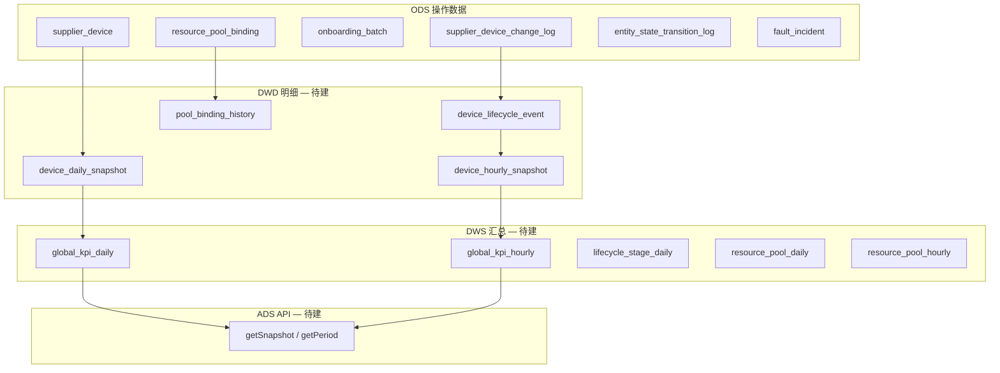

# 全局接入监控大盘 — 时间段分析设计与实现方案

**页面**：`/dashboard/global`（`apps/web/src/app/[locale]/(protected)/dashboard/global/page.tsx`）  
**业务定位**：闲时弹性调度平台的 **设备与资源监控大盘**，面向 IDC/GPU 从供应商接入到资源池运营的全生命周期。  
**关联文档**：

- [global-dashboard-implementation-plan.md](./global-dashboard-implementation-plan.md)（Snapshot 口径与 `/supplier/overview` 对齐）
- [supplier-device-management-ops-panorama.md](./supplier-device-management-ops-panorama.md)（运营流程与变更表驱动进度）

**文档性质**：产品设计 + 数据架构 + **前端已实现方案** + 后端待办  
**版本**：v2.2（2026-05-27）

---

## 1. 背景与目标

### 1.1 问题陈述

运营经理需要两类互补视图：

| 视图 | 问题 | 典型场景 |
|------|------|----------|
| **Snapshot（实时截面）** | 此刻有多少设备、在哪个池、什么生命周期？ | 值班大屏、实时指挥 |
| **Period（区间分析）** | 某段时间内接入了多少、池规模如何变化、各阶段耗时如何？ | 日复盘、周/月 KPI |

v1.0 设计仅描述 Snapshot + Period 双模式的数据模型；**v2.0 在前端落地三档视图**（实时 / 按日 / 按小时），用 URL 驱动全页卡片联动，数据仍为 Mock，后端 API 与 DWS 待接。

### 1.2 当前实现状态（2026-05-27）

| 层级 | 状态 | 说明 |
|------|------|------|
| **前端查询态** | ✅ 已实现 | `view=snapshot \| daily \| hourly`，URL 同步 |
| **页头与时间控件** | ✅ 已实现 | 三档切换、日期/ datetime 范围、对比开关（UI） |
| **KPI / 生命周期 / 资源池** | ✅ Mock 联动 | 随 `view` 与区间变化展示不同文案与趋势 |
| **集群 / 差异 / 告警 / 待办** | ⏳ 静态 Mock | 尚未接入 `useGlobalDashboardQuery` |
| **后端 API** | ❌ 未实现 | `dashboard.globalOps` tRPC 待建 |
| **DWS 日/小时表** | ❌ 未实现 | `device_daily_snapshot` 等待建 |

### 1.3 非目标

- 不替代供应商明细页（`/supplier/*`）CRUD。
- 不做计费/财务月结（见 `/finance`）。
- 不实现秒级调度用量监控（真实台时/卡时需接调度平台，见 §3.4.4）。

---

## 2. 分析模式定义

### 2.1 三档视图（前端已实现）

原 v1.0 的 `mode=snapshot | period` 在前端细化为 **`view` 三档**；后端 API 可映射为 `mode + granularity`：

| 前端 `view` | 后端等价 | 粒度 | 默认区间 |
|-------------|----------|------|----------|
| `snapshot` | `mode=snapshot` | 当前时刻 | `as_of = now()` |
| `daily` | `mode=period`, `granularity=day` | 自然日 | 近 7 天（至今日末） |
| `hourly` | `mode=period`, `granularity=hour` | 整点小时 | 近 24 小时（至当前整点） |

### 2.2 URL 查询参数（已实现）

页面与页内 Header **共用** `useGlobalDashboardQuery()`，状态写入 URL（`router.replace`，无 scroll）：

```
/dashboard/global                                    # 默认 snapshot
/dashboard/global?view=daily&start=2026-05-21&end=2026-05-27
/dashboard/global?view=hourly&start=2026-05-27T08&end=2026-05-27T14
/dashboard/global?view=daily&start=...&end=...&compare=1
```

| 参数 | 适用 | 说明 |
|------|------|------|
| `view` | 全部 | `snapshot`（默认）\| `daily` \| `hourly` |
| `start` | daily / hourly | daily：`YYYY-MM-DD`；hourly：`YYYY-MM-DDTHH` |
| `end` | daily / hourly | 同上；daily 解析为当日 `23:59:59` |
| `compare` | daily / hourly | `1` = 开启「对比上周期」（**UI 已展示，数据未接**） |

**时区**：前端工具函数按 `Asia/Shanghai`（UTC+8）格式化/解析日界与整点。

**实现文件**：`dashboard/global/_lib/global-dashboard-query.ts`

```typescript
export type GlobalDashboardView = "snapshot" | "daily" | "hourly"

export type GlobalDashboardQuery = {
  view: GlobalDashboardView
  periodStart: Date
  periodEnd: Date
  comparePrevious: boolean
}
```

### 2.3 时间段语义约定

| 概念 | Snapshot | Daily / Hourly Period |
|------|----------|------------------------|
| **主值** | 当前截面存量 | **期末存量**（`period_end` 时刻/日末） |
| **Delta** | 环比（较上一周期 %） | **净增**（绝对值 + 单位） |
| **Sparkline** | 近 8 个点（Mock 为近 8 天） | 区间内按日/按小时序列，点数随区间长度变化 |
| **期初/期末** | — | 期初 = `period_start` 日/小时初；期末 = `period_end` |
| **净增（目标）** | — | `stock(end) − stock(start)`，**与 start 有关、与 end 固定为 now 时 end 侧主值应稳定** |

**重要约束（目标语义，Mock 尚未完全遵守，见 §10.1）**：

- 当 `period_end` 固定为「当前」时，修改 `period_start` **应**影响：趋势点数、净增、区间吞吐；**不应**改变期末主值与 Snapshot 对齐。
- Daily 默认 `end` = 今日 `23:59:59`，非精确「此刻」；Hourly 默认 `end` = 当前整点。

### 2.4 与供应商域模型关系

大盘 Period 统计应以 **设备级事实 + 日/小时快照** 为权威，与 [`supplier-device-management-ops-panorama.md`](./supplier-device-management-ops-panorama.md) 对齐：

| 数据来源 | 用途 |
|----------|------|
| `supplier_device_change_log` | 设备态变更 + **批次边界**（开始/结束工单）；见 §2.5 |
| `supplier_device` | Snapshot 截面、池归属（`resolveDevicePoolMemberships`） |
| `onboarding_batch` + `device_link` | 批次进度、差异/待办 |
| `pool_binding_history`（待建） | 池划入/划出、台时/卡时 |

生命周期漏斗 **UI 已对齐 CRM 五段**（非 v1.0 九段 IDC）：`待接入 → 接入中 → 在线 → 维护中 → 下线中`。

### 2.5 变更动作分类与 ETL 边界（方案 A，已定）

供应商域采用 **方案 A**：**工单开始/结束只驱动 `batch_status`**；设备 `lifecycle_status` 仍由 **运维变更动作 + ops** 按 [`supplier-onboarding-plan-changelog-tracking-design.md`](./supplier-onboarding-plan-changelog-tracking-design.md) §3.4.3 推导。详见 [`supplier-device-management-ops-panorama.md`](./supplier-device-management-ops-panorama.md) §7.3。

#### 2.5.1 两类 change_log 语义

| 类型 | 典型 `change_action` | 影响 batch | 影响 device lifecycle | 影响 KPI / 卡时 |
|------|----------------------|------------|----------------------|-----------------|
| **设备态变更** | `设备接收`、`加入集群`、上架类、`设备退订`… | 刷新进度缓存 | ✅ 按 §3.4.3.1 重算 | ✅ |
| **批次边界** | `开始执行工单`、`工单执行结束` | ✅ `batch_status` 流转 | ❌ **不直接改** lifecycle | ❌ 不产生在线时长 |

**原则**：OPS 仍以变更表为准；批次在创建时约定 **目标 ops**（上架终态 / 下架终态），运维动作沿 ladder 推进，**工单结束 = 批次闭环**，不等于每台设备自动达标（可 `needs_review`）。

#### 2.5.2 写入 `device_lifecycle_event` 的规则

| `event_kind` | 来源 | 计入 `stage_throughput` | 计入 `avg_dwell_time` |
|--------------|------|-------------------------|------------------------|
| `state_transition` | 设备态 `change_action` | ✅ | ✅ |
| `batch_boundary` | 开始/结束工单 | ❌ | ❌ |

实现：`device_lifecycle_event.event_kind`（`dashboard-schema.ts`）；G1 ETL 对 `开始执行工单` / `工单执行结束` 写 `batch_boundary` 或跳过 lifecycle 聚合。

#### 2.5.3 对大盘各模块的影响（摘要）

| 模块 | 方案 A 下行为 |
|------|----------------|
| KPI / 资源池 Snapshot | 不变：读 `supplier_device` 截面 |
| Period 台时/卡时（§3.4） | 不变：仅 `online(d,t)` 累计 |
| 生命周期漏斗 Period | 仅 `state_transition` 驱动吞吐/停留 |
| 差异/待办/批次卡片（P2b） | **增强**：目标 ops vs 实际 ops + 工单起止时间 |

---

## 3. 数据架构（后端目标态）

### 3.1 分层总览



### 3.2 核心表（摘要）

#### `device_daily_snapshot` / `device_hourly_snapshot`

| 字段 | 说明 |
|------|------|
| `snapshot_date` / `snapshot_hour` | 时间键 |
| `device_id` | 设备 |
| `lifecycle_status` | CRM 生命周期 |
| `pool_codes[]` | 资源池归属 |
| `gpu_count`, `card_type`, `data_center_id` | 维度 |

Daily 跑批 T+1；Hourly 跑批每小时 :05；Snapshot 读当前态或最近 hour 快照。

#### `pool_binding_history`（SCD Type 2）

`device_id`, `pool_code`, `effective_from`, `effective_to` — 支撑池净增、台时/卡时。

#### `resource_pool_daily` / `resource_pool_hourly`

粒度：`time × pool_code × card_type` → `device_count`, `machine_hours`, `card_hours`。

### 3.3 资源池展示映射

| 大盘展示 | 池 key（Mock/UI） | 目标 `pool_code` |
|----------|-------------------|------------------|
| 弹性服务 | `platform` | `elastic_service` |
| 裸金属 | `dedicated` | `bare_metal` |
| 待上架 | `inference` | 待接入/待上架聚合 |
| 线下交付 | `training` | 线下交付 ops |
| 内部占用 | `standby` | 内部测试/占用 |
| 维护中 | `maintenance` | 维护中 |

### 3.4 资源池分布：展示口径与计量定义（权威）

`ResourcePoolChartCard` 在 **Snapshot** 与 **Period（daily / hourly）** 下使用 **不同的主计量单位**；饼图扇区、中心总计、外围卡片主值 **必须同一口径**。

### 3.4.1 展示口径对照

| 视图 | 饼图扇区 | 中心「总计」 | 外围卡片主值 | 外围卡型明细 |
|------|----------|--------------|--------------|--------------|
| **Snapshot** | 期末 **在线 GPU 卡数** | 各池在线 GPU 卡数之和 | `{N} 卡` | **卡型 × 期末在线 GPU 卡数**（不展示台时/卡时） |
| **Daily / Hourly** | 区间内 **卡时** 合计 | 各池卡时之和 | `{N} 卡时` | **卡型 - 台时 - 卡时**（区间累计） |

**Snapshot 期末**：`as_of` 时刻（默认 `now()`）。**Period 区间**：闭区间 `[period_start, period_end]`（时区 `Asia/Shanghai`）。

**与财务域区别**：本大盘 **卡时** 指 **供应侧资源池可用 GPU·小时**（设备在线 × 卡数 × 时长），**不是** 租户账单消费卡时（见 `/finance` `balance_card_hours`）。

### 3.4.2 前置定义

| 符号 | 含义 |
|------|------|
| `as_of` | Snapshot 截面时刻 |
| `[T₀, T₁]` | Period 区间（daily 日界 / hourly 整点） |
| `pool p` | 资源池，池归属与 `/supplier/overview` 一致（`resolveDevicePoolMemberships`） |
| `card type g` | `gpu_card_type_id` / `gpu_card_type.code` |
| `device d` | `supplier_device` 一行（一台物理机） |
| `online(d, t)` | `t` 时刻 `d` 满足 **在线判定**（见 §3.4.5） |
| `in_pool(d, p, t)` | `t` 时刻 `d` 归属池 `p` |
| `gpu_count(d)` | `supplier_device.gpu_count` |

### 3.4.3 Snapshot：期末在线 GPU 卡数

**池级在线 GPU 卡数**（饼图 `value`、外围主值）：

```
online_gpu_cards(p, as_of)
  = Σ_{d : online(d, as_of) ∧ in_pool(d, p, as_of)} gpu_count(d)
```

**卡型 breakdown**（外围明细，单位：卡）：

```
online_gpu_cards(p, g, as_of)
  = Σ_{d : online(d, as_of) ∧ in_pool(d, p, as_of) ∧ card_type(d)=g} gpu_count(d)
```

**中心总计**：

```
total_online_gpu_cards(as_of) = Σ_p online_gpu_cards(p, as_of)
```

**约束**：双池设备按 overview 规则 **可重叠计入多个池**；与 KPI「弹性资源池 / 裸金属池」卡数口径一致。

### 3.4.4 Period：台时与卡时计算方法

#### 基本时间片

将区间 `[T₀, T₁]` 划分为时间片 `τ`：

- **Daily**：`τ` = 每个自然日（本地 0:00–24:00 与区间交集）
- **Hourly**：`τ` = 每个整点小时 `[h:00, h+1:00)` 与区间交集

设备 `d` 在池 `p`、时间片 `τ` 内的 **在线时长（小时）**：

```
duration_hours(d, p, τ)
  = |{ t ∈ τ : online(d, t) ∧ in_pool(d, p, t) }|   -- 连续时间长度，单位：小时
```

实现上由 **小时/日快照** 或 **变更表状态区间** 回放得到（见 §3.2 `device_*_snapshot`、`pool_binding_history`）。

#### 台时（machine_hours）

**按台累计**：每台设备贡献的在线小时数，**不乘卡数**。

```
machine_hours(p, g, τ)
  = Σ_{d : card_type(d)=g} duration_hours(d, p, τ)

machine_hours(p, g, [T₀,T₁])
  = Σ_{τ ⊆ [T₀,T₁]} machine_hours(p, g, τ)
```

**池级台时**（无卡型维度时）：

```
machine_hours(p, [T₀,T₁]) = Σ_g machine_hours(p, g, [T₀,T₁])
```

#### 卡时（card_hours）

**按 GPU·小时累计**：每台设备在线时长 × 该机 GPU 卡数。

```
card_hours(p, g, τ)
  = Σ_{d : card_type(d)=g} duration_hours(d, p, τ) × gpu_count(d)

card_hours(p, g, [T₀,T₁])
  = Σ_{τ ⊆ [T₀,T₁]} card_hours(p, g, τ)
```

**恒等关系**（单设备）：

```
card_hours(d, p, τ) = duration_hours(d, p, τ) × gpu_count(d)
```

**池级卡时**（Period 饼图扇区 `value`、外围主值）：

```
card_hours(p, [T₀,T₁]) = Σ_g card_hours(p, g, [T₀,T₁])
```

**中心总计**：

```
total_card_hours([T₀,T₁]) = Σ_p card_hours(p, [T₀,T₁])
```

#### 净增（Period 副指标，单位：卡时）

```
card_hours_net_change(p) = card_hours(p, [T₀,T₁]) − card_hours(p, [T₀−Δ, T₀))
```

其中 `Δ` 为与本期等长的上一周期（`compare=1` 时使用）；或简化为相对期初桶：

```
card_hours_end(p) − card_hours_start(p)   -- 以 period_end / period_start 单桶卡时近似，精确实现用 DWS
```

（产品展示优先 **区间累计卡时** 作主值；净增为辅助文案。）

### 3.4.5 在线判定与例外

| 规则 | 说明 |
|------|------|
| **在线** | `lifecycle_status = '在线'`，且 ops 状态不排除在线（与 overview `R-OV2` 一致） |
| **维护中池** | Snapshot：计入该池内 `维护中` / `in_maintenance` 设备的 GPU 卡数（若业务归属该池）；Period：**台时/卡时展示 `—`**，不计入供应卡时 |
| **待上架等池** | 仅统计归属该池且满足池语义的状态；具体映射见 [global-dashboard-implementation-plan.md](./global-dashboard-implementation-plan.md) §3.4.5 |
| **双池** | 同一设备在同一时刻可计入多个池的 duration / 卡数（与 overview 重叠一致） |

### 3.4.6 UI 字段映射

**Snapshot — `ResourcePoolSlice`**

```typescript
interface ResourcePoolSliceSnapshot {
  pool_code: string
  pool_name: string
  online_gpu_cards_end: number   // 饼图 value、外围「N 卡」
  breakdown: {
    card_type: string
    online_gpu_cards_end: number // 仅卡数，无台时/卡时
  }[]
}
```

**Period — `ResourcePoolSlice`**

```typescript
interface ResourcePoolSlicePeriod {
  pool_code: string
  pool_name: string
  card_hours_total: number       // 饼图 value、外围「N 卡时」
  card_hours_net_change?: number
  breakdown: {
    card_type: string
    machine_hours: number        // 台时
    card_hours: number           // 卡时
  }[]
}
```

外围展示格式：

- Snapshot：`{card_type} · {online_gpu_cards_end} 卡`
- Period：`{card_type} - {machine_hours}台时 - {card_hours}卡时`

### 3.4.7 计算示例

**Snapshot**（`as_of = 2026-05-27 15:00`）

| 池 | 设备 | 卡型 | gpu_count | 在线? | 贡献卡数 |
|----|------|------|-----------|-------|----------|
| 弹性服务 | SN-01 | A100 | 8 | 是 | 8 |
| 弹性服务 | SN-02 | H100 | 8 | 是 | 8 |

→ `online_gpu_cards(弹性服务) = 16`；A100 breakdown = 8，H100 breakdown = 8。

**Period**（某日 1 小时时间片，弹性服务池）

| 设备 | 卡型 | gpu_count | 在线 1h? | 台时 | 卡时 |
|------|------|-----------|----------|------|------|
| SN-01 | A100 | 8 | 是 | 1 | 8 |
| SN-02 | H100 | 8 | 是 | 1 | 8 |

→ 该小时 `machine_hours = 2`，`card_hours = 16`。若全天 24h 均在线，则日 `machine_hours = 48`，`card_hours = 384`。

## 4. 实现分期

| 阶段 | 内容 | 状态 |
|------|------|------|
| **P0** | 主数据 + `change_log` → `entity_state_transition_log` | 部分已有 |
| **P1** | `device_daily_snapshot` 日批 + 事件清洗 | 未开始 |
| **P2a** | 前端三档视图 + URL + Mock 联动（KPI/生命周期/资源池） | ✅ **已完成** |
| **P2b** | 集群/差异/告警/待办接入 query；`compare` 数据 | 未开始 |
| **P3** | `dashboard.globalOps.getSnapshot` / `getPeriod` + DWS | 未开始 |
| **P4** | 导出、下钻、与 overview 一致性测试 | 未开始 |

---

## 5. 前端实现方案（P2a，已实现）

### 5.1 页面结构

**路由**：`apps/web/src/app/[locale]/(protected)/dashboard/global/page.tsx`

```
Suspense
└── GlobalOpsDashboardContent
    ├── GlobalDashboardScopeBar      # 模式说明条（Snapshot/Daily/Hourly Badge）
    ├── GlobalDashboardHeader        # 标题、视图切换、时间范围、卡型筛选(Mock)
    ├── GlobalKpiSection             # ✅ 联动 query
    ├── 栅格 Row1
    │   ├── LifecycleFlowCard        # ✅ 联动 query
    │   ├── ResourcePoolChartCard    # ✅ 联动 query
    │   └── ClusterStatusCard        # ⏳ 静态 Mock
    └── 栅格 Row2
        ├── DiscrepancyTableCard     # ⏳ 静态 Mock
        ├── AlertsTimelineCard       # ⏳ 静态 Mock
        └── GlobalTodosCard          # ⏳ 静态 Mock
```

**Header 位置**：大盘专用 Header 渲染在 **页面内容区顶部**（`site-header.tsx` 中 Global 分支仅保留 Sidebar + Theme，不重复 Header）。

### 5.2 共享模块

| 文件 | 职责 |
|------|------|
| `_lib/global-dashboard-query.ts` | URL ↔ `GlobalDashboardQuery` 解析/写入；`useGlobalDashboardQuery()` |
| `_lib/global-dashboard-mock-data.ts` | `getMockKpiItems`、`getMockLifecycleStages`、`getMockPoolData`、`getCardCopy` |

**数据流**：

```
URL searchParams
  → parseGlobalDashboardQuery()
  → useGlobalDashboardQuery()  { query, setQuery, setView }
  → getMock* (query)           → 各 Card 渲染
```

### 5.3 Header 与 ScopeBar

**`global-dashboard-header.tsx`**

| 控件 | 行为 |
|------|------|
| 视图 Toggle | `实时` / `按日` / `按小时` → `setView()`，切换时重置默认区间 |
| 按日预设 | 「近 7 天」「本月」+ `type=date` 起止 |
| 按小时预设 | 「近 24 小时」+ `type=datetime-local` 起止（整点） |
| 对比上周期 | 切换 `compare=1`（Badge 提示；**对比数据未实现**） |
| 卡型下拉 | Mock 选项，**未写入 URL** |
| Scope 副标题 | Snapshot 下每秒刷新时钟 |

**`GlobalDashboardScopeBar`**：展示当前模式 Badge + 一句模式说明。

### 5.4 KPI 区（`global-kpi-section.tsx`）

**8 项指标**（与 [global-dashboard-implementation-plan.md](./global-dashboard-implementation-plan.md) §3.1 对齐）：

GPU 总卡数、在线设备、弹性资源池、裸金属池、内部占用、异常设备、待接入设备、待接入机房。

| 视图 | 主值 | Delta 标签 | Sparkline |
|------|------|--------------|-----------|
| snapshot | 当前 Mock 存量 | 环比（% 或绝对值） | 8 点，label 为近 8 天日期，末点「（当前）」 |
| daily | 期末 Mock 存量 | 净增（+N 单位） | 点数 = 区间天数（2~31），按日 label |
| hourly | 期末 Mock 存量 | 净增 | 点数 = 区间小时（2~24），按小时 label |

**Sparkline Tooltip**（每点可悬停）：

```
2026-05-27 14:00        ← 时间（第一行）
数值    4,280 卡         ← 数值 + 单位
```

实现：自定义 Recharts `Tooltip` content，读取 `payload.label` 与 `payload.v`。

### 5.5 生命周期（`lifecycle-flow-card.tsx`）

**五段 CRM 漏斗**（已替换 v1.0 九段 IDC Mock）：

| 阶段 | Snapshot 副指标 | Daily/Hourly 副指标 |
|------|-----------------|---------------------|
| 待接入 / 接入中 / 在线 / 维护中 / 下线中 | Snapshot：待接入段含计划缺口；Period：本期吞吐 **仅实体** + 「期末」标记 |

标题/副标题由 `getCardCopy(query)` 驱动。

### 5.6 资源池（`resource-pool-chart-card.tsx`）

**目标口径**：见 §3.4。当前 Mock **未完全实现**（饼图仍用台数 Mock，见 §10.1）。

| 元素 | Snapshot（目标） | Daily / Hourly（目标） |
|------|------------------|------------------------|
| 饼图扇区 | 各池 **期末在线 GPU 卡数** | 各池 **区间卡时** |
| 中心主文案 | `总计 {N} 卡` | `总计 {N} 卡时` |
| 中心副文案 | — | `净增 ±M 卡时`（可选） |
| 外围主值 | `{N} 卡` | `{N} 卡时` |
| 外围明细 | 卡型 · **在线 GPU 卡数** | **卡型 - 台时 - 卡时** |
| 维护中池 | 卡数或 `—`（见 §3.4.5） | 台时/卡时均为 `—` |

**当前 Mock 偏差**：扇区与外围主值仍用 **台数** + 固定常数缩放台时/卡时；接 API 时按 §3.4 重写 `getMockPoolData`。

### 5.7 未联动卡片（P2b）

以下组件仍为文件内常量 Mock，**不随 URL 变化**：

- `cluster-status-card.tsx` — `CLUSTERS`
- `discrepancy-table-card.tsx` — `DISCREPANCY_ROWS`
- `alerts-timeline-card.tsx` — `ALERTS`
- `global-todos-card.tsx` — `TODOS`

P2b 待办：接入 `query`，按 `occurred_at` / 期末截面过滤；`compare=1` 时并排或 delta 展示。

---

## 6. 分模块统计指标（目标口径）

以下为目标 API 口径；§5 描述当前 Mock 表现。

### 6.1 KPI 区

| key | Snapshot | Period（daily/hourly） |
|-----|----------|------------------------|
| `gpu_total` | `as_of` GPU 总和 | 期末存量 + 净增 |
| `device_online` | 在线台数 | 期末在线 / 可选日均 |
| `pool_elastic` / `pool_bare_metal` | 池 GPU | 期末 + 划入/划出 |
| `device_abnormal` | 当前异常 | 期内暴露数 |
| `device_pending_access` | 待接入 | Period：**仅**期末实体积压 + 本期进入（**不含**批次计划缺口；见 `supplier-overview-scenarios-from-zero.md` §2.1.5） |

`trend[]`：`{ time: string; value: number; label: string }[]`，与前端 sparkline 对齐。

### 6.2 生命周期

| 指标 | Period 计算 |
|------|-------------|
| `stage_throughput` | 区间内 **首次进入该阶段** 的设备数（**不含** `batch_boundary` 事件，§2.5.2） |
| `stage_wip_end` | 期末仍停在该阶段的数量 |
| `avg_dwell_time` | 离开该阶段的 `(leave − enter)` 均值 |

### 6.3 资源池（`ResourcePoolChartCard`）

| 视图 | 饼图 / 外围主值 | breakdown |
|------|-----------------|-----------|
| **Snapshot** | `online_gpu_cards(p, as_of)`，单位 **卡** | `{ card_type, online_gpu_cards_end }` |
| **Period** | `card_hours(p, [T₀,T₁])`，单位 **卡时** | `{ card_type, machine_hours, card_hours }` |

完整公式见 **§3.4**。API 字段：

| 字段 | Snapshot | Period |
|------|----------|--------|
| `slice.value` | `online_gpu_cards_end` | `card_hours_total` |
| `center_total` | `Σ online_gpu_cards_end` | `Σ card_hours_total` |
| `breakdown.machine_hours` | — | §3.4.4 |
| `breakdown.card_hours` | — | §3.4.4 |
| `net_change` | — | 卡时净增（可选） |

### 6.4 其余卡片

见 v1.0 §5.4~§5.7（集群、差异、告警、待办），P2b/P3 实现。

---

## 7. API 契约（目标，待实现）

### 7.1 tRPC 建议

```
dashboard.globalOps.getSnapshot({ as_of?, filters? })
dashboard.globalOps.getPeriod({
  granularity: 'day' | 'hour',
  period_start,
  period_end,
  compare_previous?,
  filters?,
})
```

**前端映射**：`view=snapshot` → `getSnapshot`；`view=daily|hourly` → `getPeriod` + 对应 `granularity`。

### 7.2 Response 骨架

```typescript
interface GlobalDashboardResponse {
  meta: {
    view: 'snapshot' | 'daily' | 'hourly'
    period_start?: string
    period_end?: string
    timezone: 'Asia/Shanghai'
    filters?: { card_type_ids?: string[] }
  }
  kpi: GlobalKpiPayload
  lifecycle: LifecycleFlowPayload
  resource_pools: ResourcePoolPayload
  clusters: ClusterStatusPayload[]
  discrepancies: DiscrepancyPayload[]
  alerts: AlertPayload[]
  todos: TodoPayload[]
  compare?: GlobalDashboardResponse
}
```

```typescript
interface ResourcePoolPayload {
  display_unit: 'gpu_cards' | 'card_hours'  // snapshot | period
  slices: ResourcePoolSliceSnapshot[] | ResourcePoolSlicePeriod[]  // §3.4.6
  center_total: number
  center_secondary?: string
}
```

**缓存**：Snapshot TTL 30s；历史 Period TTL 1h。

### 7.3 替换 Mock 路径（前端接 API）

| 步骤 | 文件 | 改动 |
|------|------|------|
| 1 | `_lib/global-dashboard-mock-data.ts` | `getMockPoolData(query)` 按 §3.4 分 Snapshot / Period 生成 `display_unit` 与 slices |
| 2 | `_components/resource-pool-chart-card.tsx` | 读取 `display_unit`：Snapshot 格式化「N 卡」；Period 格式化「N 卡时」与 breakdown「台时 - 卡时」 |
| 3 | `page.tsx` 或 data hook | `view=snapshot` → `getSnapshot`；`view=daily\|hourly` → `getPeriod`；保留 Suspense + query 不变 |
| 4 | 类型 | 与 §3.4.6 `ResourcePoolSliceSnapshot` / `ResourcePoolSlicePeriod` 对齐 |

Mock 阶段可先只改 `getMockPoolData`，使饼图/外围主值与 breakdown 口径与 §3.4 一致，再接 tRPC。

---

## 8. 示例

### 8.1 URL（当前前端）

```
/dashboard/global?view=daily&start=2026-05-01&end=2026-05-27
/dashboard/global?view=hourly&start=2026-05-27T08&end=2026-05-27T20&compare=1
```

### 8.2 API（目标）

```
GET /api/v1/dashboard/global?granularity=day&period_start=2026-05-01&period_end=2026-05-27&compare_previous=true
```

### 8.3 语义样例

| 模块 | 视图 | 指标 | 值 | 含义 |
|------|------|------|-----|------|
| KPI | Period | `gpu_total` | 4,280 期末 / +120 净增 | 5 月净增 120 卡 |
| 生命周期 | Period | 待接入.throughput | 34 | 5 月新进入待接入 34 台 |
| 资源池 | **Snapshot** | `platform.online_gpu_cards_end` | 4,960 卡 | 弹性服务池期末在线 GPU 卡数（饼图扇区 = 外围主值） |
| 资源池 | **Snapshot** | `platform.breakdown` | A100 · 3,200 卡；H100 · 1,760 卡 | 仅卡型 × 卡数，无台时/卡时 |
| 资源池 | **Period** | `platform.card_hours_total` | 118,400 卡时 | 5 月弹性池累计供应卡时（饼图扇区 = 外围主值） |
| 资源池 | **Period** | `platform.breakdown` | A100 - 1.82万台时 - 14.6万卡时 | 卡型维度台时/卡时（§3.4.4） |

**Snapshot 与 Period 对照**：Snapshot 展示 **存量卡数**；Period 展示 **区间累计卡时**，二者主值 **不可直接数值对比**。若 `period_end = now` 且 Period 仅取末桶截面，期末 **卡数** KPI 应与 Snapshot 一致；Mock 当前不满足（§10.1）。

---

## 9. 数据质量与边界

| 场景 | 处理 |
|------|------|
| `开始执行工单` / `工单执行结束` | 写 `change_log` + 更新 `batch_status`；ETL 标 `batch_boundary`，不计 lifecycle 吞吐（§2.5） |
| 变更表 batch 导入、同 `occurred_at` | Hourly 落库用 commit 时间兜底 |
| `period_end` 固定为 now，仅改 start | 期末不变、净增与趋势点数变（§2.3） |
| 区间 > 31 天（daily） | 前端 Mock  cap 31 点；API 应分页或强制 rollup |
| 区间 > 24 小时（hourly） | 前端 Mock cap 24 点；API 应限 `max_range_hours` |
| 时区 | `Asia/Shanghai`，日界 0 点 |

---

## 10. Mock 已知局限与后端待办

### 10.1 Mock 语义缺陷（接 API 前需修正）

| 问题 | 现状 | 目标 |
|------|------|------|
| 资源池饼图/外围主值 | Mock 用 **台数**（`BASE_POOL`） | Snapshot：**期末在线 GPU 卡数**；Period：**区间卡时**（§3.4） |
| 资源池 breakdown | 固定常数 × factor，隐含 卡时≈台时×8 | Snapshot：仅卡型×卡数；Period：`machine_hours` / `card_hours` 按 §3.4.4 |
| 期末主值随 start 变化 | `seedFromQuery` 使用 `start_end` 拼接 | 期末仅依赖 `period_end` / Snapshot |
| 净增 | 随机 `pick()` | `stock(end) − stock(start)` 或卡时净增 |
| 对比上周期 | UI only | 嵌套 `compare` 响应或二次请求 |
| 卡型筛选 | 未入 URL | `card_type_ids[]` 过滤 |
| end 非精确 now | daily 为日末、hourly 为整点 | 可选「至今」锁定 end |

### 10.2 后端优先级

1. **G0** — 抽取 `overview-aggregation.ts`，`getSnapshot` 接 DB  
2. **G1** — `pool_binding_history` + `change_log` → 事件流（**区分 `state_transition` / `batch_boundary`**，§2.5）
3. **G2** — `device_daily_snapshot` + `getPeriod(granularity=day)`  
4. **G2+** — `device_hourly_snapshot` + `getPeriod(granularity=hour)`  
5. **G3** — 全卡片接 API + `compare` + P2b 静态卡片  

### 10.3 台时/卡时

**权威定义见 §3.4.4**，摘要：

| 计量 | 公式 | 单位 | 用于 |
|------|------|------|------|
| **台时** | `Σ duration_hours(d, p, τ)`，按 **台** 累计，不乘 `gpu_count` | 台·小时 | Period 外围 breakdown |
| **卡时** | `Σ duration_hours(d, p, τ) × gpu_count(d)` | GPU·小时 | Period 饼图/外围主值 |

Mock 当前为规模比例缩放，非回放计算。真实值由 `device_*_snapshot` + `pool_binding_history` 聚合写入 `resource_pool_daily/hourly`（§3.2）；调度平台用量为 G4 增强，非 MVP 阻塞项。

---

## 11. 附录：文件与组件对照

| 路径 | 职责 | 数据来源 | 联动 query |
|------|------|----------|------------|
| `page.tsx` | 页面布局、Suspense | — | — |
| `_lib/global-dashboard-query.ts` | URL 查询态 | — | — |
| `_lib/global-dashboard-mock-data.ts` | Mock 生成 | seed(query) | 输入 query |
| `_components/global-dashboard-header.tsx` | Header + ScopeBar | — | ✅ |
| `_components/global-kpi-section.tsx` | KPI + sparkline tooltip | `getMockKpiItems` | ✅ |
| `_components/lifecycle-flow-card.tsx` | 五段漏斗 | `getMockLifecycleStages` | ✅ |
| `_components/resource-pool-chart-card.tsx` | 饼图 + 外围卡 | `getMockPoolData` | ✅ |
| `_components/cluster-status-card.tsx` | 机房集群 | `CLUSTERS` 常量 | ❌ |
| `_components/discrepancy-table-card.tsx` | 差异校验 | 常量 | ❌ |
| `_components/alerts-timeline-card.tsx` | 告警 | 常量 | ❌ |
| `_components/global-todos-card.tsx` | 待办 | 常量 | ❌ |

**主数据写入路径**：运维导入变更表 → `supplier_device_change_log` →（目标）`entity_state_transition_log` → 快照/Period 聚合。见 [supplier-device-management-ops-panorama.md](./supplier-device-management-ops-panorama.md) §7。

---

## 12. 修订记录

| 版本 | 日期 | 说明 |
|------|------|------|
| v1.0 | 2026-05-18 | 初稿：Snapshot vs Period、DWS 数据模型、分模块指标 |
| v2.0 | 2026-05-27 | 合并前端 P2a 实现：三档 view、URL 契约、Mock 联动、KPI tooltip、资源池卡型×台时×卡时、CRM 五段生命周期；补充 Mock 局限与后端分期 |
| v2.1 | 2026-05-27 | **§3.4 权威口径**：Snapshot 饼图/外围按期末在线 GPU 卡数；Period 按区间卡时；明确台时/卡时公式、UI 映射与示例；同步 §5.6、§6.3、§7.3、§8.3、§10 |
| v2.2 | 2026-05-27 | **§2.5 方案 A**：工单起止仅驱动 batch_status；lifecycle 仍由运维变更推导；ETL 边界事件分类；同步 §6.2、§9、§10.2 |
| v2.3 | 2026-05-27 | **计划管道**：Snapshot 待接入 KPI/漏斗叠加批次计划缺口；`planned_gpu_count`；`new_idc` 待接入机房；Period **暂不**叠加（§2.1.5 场景文档） |
