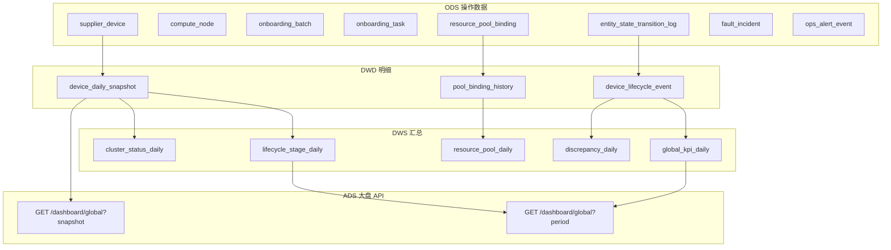

# 全局接入监控大盘 — 时间段分析设计方案

**页面**：`/dashboard/global`（`apps/web/src/app/[locale]/(protected)/dashboard/global/page.tsx`）  
**业务定位**：闲时算力调度平台的 **资源接入监控大盘**，面向 IDC/GPU 资源从供应商交付到可售运营的全生命周期。  
**文档性质**：产品与数据设计（不涉及代码改动）  
**版本**：v1.0（2026-05-18）

---

## 1. 背景与目标

### 1.1 现状（Snapshot 模式）

当前大盘各卡片数据均为 **某一时刻的截面**（Mock 硬编码），语义上等价于：

```
as_of = now()   -- 或用户未显式选择时的「当前时刻」
```

典型表现：


| 模块     | 当前语义                                     | 示例                  |
| ------ | ---------------------------------------- | ------------------- |
| KPI 区  | 截止 `as_of` 的存量 + 环比 sparkline（Mock 为假数据） | GPU 总卡数 4,280       |
| 生命周期流转 | 截止 `as_of` 各阶段 **在册设备数** + 当前平均停留        | 待上架 19 台，平均停留 12.4h |
| 资源池饼图  | 截止 `as_of` 各池 **占用规模**                   | 弹性服务部署 620 台        |
| 机房集群   | 截止 `as_of` 各集群 **实时状态**                  | 上架率 92%             |
| 差异校验   | 截止 `as_of` 交付/部署/上架/可售 **四级计数**          | 部署缺口 5              |
| 告警时间线  | 当日/近期事件列表（无全局日期范围）                       | 16:38:02 网络中断       |
| 待办     | 当前未完成工单                                  | 待上架工单复核             |


**局限**：无法回答「2026-01-01 ~ 2026-01-31 这个月接入了多少卡、各阶段耗时如何、上架成功率是否下降」等 **过程型** 问题。

### 1.2 目标（Period 模式）

在保留 Snapshot 能力的前提下，支持用户选择 **时间段** `[period_start, period_end]`（含边界，默认闭区间 `[start 00:00:00, end 23:59:59]`，时区统一为业务时区，建议 `Asia/Shanghai`），大盘展示该区间内的 **资源接入与运营过程指标**。

核心用户问题：

1. 本周期 **新接入** 了多少 GPU/设备/节点？
2. 生命周期各阶段 **吞吐、积压、平均/ P95 停留时长** 如何？
3. 各资源池 **净增、利用率变化、型号结构变化** 如何？
4. 各机房/集群 **上架完成量、上架率趋势、异常暴露** 如何？
5. 交付→部署→上架→可售 **差异产生与闭环** 情况如何？
6. 本周期 **告警与待办** 的处理效率如何？

### 1.3 非目标（本期设计边界）

- 不替代供应商明细页（`/supplier/`*）的单据 CRUD。
- 不做计费/财务月结（见 `/finance`）。
- 不实现秒级实时监控（Period 模式以 **事件 + 日快照** 为主，最短粒度建议 **1 小时** 或 **1 天**）。

---

## 2. 分析模式定义

### 2.1 双模式并存


| 模式     | 英文标识       | 含义                                       | 典型用途            |
| ------ | ---------- | ---------------------------------------- | --------------- |
| **截面** | `snapshot` | 在 `as_of` 时刻的资源状态与存量                     | 值班大屏、实时指挥       |
| **区间** | `period`   | 在 `[period_start, period_end]` 内发生的过程与变化 | 月报、复盘、接入 KPI 考核 |


请求参数建议：

```typescript
type DashboardQueryMode = 'snapshot' | 'period'

interface GlobalDashboardQuery {
  mode: DashboardQueryMode
  as_of?: string              // ISO8601，mode=snapshot 时必填，默认 now
  period_start?: string       // ISO8601 date 或 datetime，mode=period 时必填
  period_end?: string
  card_type?: string[]        // 卡型筛选，对应 header「全部卡型」
  idc_codes?: string[]       // 机房/集群筛选（可选）
  supplier_ids?: string[]    // 供应商筛选（可选）
  compare_previous?: boolean // 是否附带「上一等长周期」对比（环比）
}
```

### 2.2 时间段语义约定


| 概念          | 定义                                                                         |
| ----------- | -------------------------------------------------------------------------- |
| **区间事件**    | `occurred_at`（或 `opened_at`）落在 `[period_start, period_end]` 内              |
| **区间内存量**   | 实体在区间内 **至少一度** 满足某状态（状态持续区间与 period 相交）                                   |
| **期初/期末存量** | 以 **日末快照** 为准：`stock_at(period_start - 1d)` 为期初，`stock_at(period_end)` 为期末 |
| **净增**      | `stock_end - stock_start`；可与「区间内新进入该状态次数」区分                                |
| **首达**      | 实体 **第一次** 进入某状态的 `occurred_at` 落在区间内（用于「新上架」「新交付」）                        |
| **在制**      | 期末仍停留在非终态（非「运营中/已下线」）的实体数                                                  |


**示例**（2026-01-01 ~ 2026-01-31）：

- 「本月新交付 GPU 卡数」= 首次进入 `delivered` 且 `first_delivered_at` 在 1 月的卡数之和。
- 「月末待上架积压」= 2026-01-31 日末快照中 `lifecycle_stage = pending_shelving` 的设备数。
- 「本月平均上架周期」= 1 月内完成 `pending_shelving → operating` 的实体，其 `(shelved_at - delivered_at)` 的平均值。

### 2.3 与现有域模型的关系

代码中已存在两套相关模型，落库时应 **收敛为统一资源主数据**：


| 来源         | 路径                                       | 粒度              | 说明                                                                   |
| ---------- | ---------------------------------------- | --------------- | -------------------------------------------------------------------- |
| **供应商接入域** | `lib/types/supplier-domain.ts`           | 设备/节点/批次/状态迁移日志 | 含 `entity_state_transition_log`、`onboarding_batch`、`supplier_device` |
| **机房设备聚合** | `lib/data/types.ts` → `DataCenterDevice` | 机房×卡型聚合         | `quantity` / `onlineQuantity`，偏存量汇总                                  |


大盘 Period 统计应以 **设备/节点级事实表 + 日快照** 为权威；`DataCenterDevice` 聚合仅作展示层加速或历史兼容。

---

## 3. 数据架构

### 3.1 分层总览




### 3.2 核心事实与维度

#### 维度表（Dim）


| 表名                    | 说明       | 关键字段                                                      |
| --------------------- | -------- | --------------------------------------------------------- |
| `dim_date`            | 日期       | `date_key`, `year`, `month`, `week`                       |
| `dim_idc`             | 机房/集群    | `idc_code`, `idc_name`, `region`, `cluster_id`            |
| `dim_card_type`       | GPU 卡型   | `card_type`, `manufacturer`, `memory_gb`                  |
| `dim_supplier`        | 供应商      | `supplier_id`, `supplier_code`                            |
| `dim_lifecycle_stage` | 生命周期阶段字典 | `stage_code`, `display_name`, `sort_order`, `is_terminal` |
| `dim_resource_pool`   | 资源池      | `pool_code`, `workload_profile`, `display_name`           |


**生命周期阶段**（与大盘 `LifecycleFlowCard` 对齐，需在 `lifecycle_state_definition` 扩展或映射）：


| `stage_code`         | 展示名 | 是否终态  | 备注              |
| -------------------- | --- | ----- | --------------- |
| `delivered`          | 已交付 | 否     | 供应商物理交付         |
| `pending_acceptance` | 待验收 | 否     |                 |
| `pending_deploy`     | 待部署 | 否     |                 |
| `deploying`          | 部署中 | 否     |                 |
| `pending_shelving`   | 待上架 | 否     | 超 SLA 告警        |
| `operating`          | 运营中 | 是（可售） |                 |
| `abnormal`           | 异常  | 否     | 可与其他阶段并存，见 §3.4 |
| `pending_recovery`   | 待恢复 | 否     |                 |
| `re_onboarding`      | 再纳管 | 否     |                 |
| `retired`            | 已下线 | 是     | 可选，用于净增计算       |


#### 设备生命周期事件（`device_lifecycle_event`）

由 `entity_state_transition_log` 清洗而来，一行一次状态变更。


| 列名                    | 类型          | 说明         |
| --------------------- | ----------- | ---------- |
| `event_id`            | text        | PK         |
| `device_id`           | text        | FK         |
| `node_id`             | text        | 可空         |
| `from_stage`          | varchar     |            |
| `to_stage`            | varchar     |            |
| `occurred_at`         | timestamptz |            |
| `operator_id`         | text        |            |
| `reason_code`         | varchar     |            |
| `onboarding_batch_id` | text        | 可空         |
| `supplier_id`         | text        |            |
| `idc_code`            | text        |            |
| `card_type`           | varchar     |            |
| `gpu_count`           | int         | 该设备 GPU 卡数 |


#### 设备日快照（`device_daily_snapshot`）

每日 00:05 跑批（或流式 upsert），支撑存量、在制、期末截面。


| 列名                   | 类型      | 说明                 |
| -------------------- | ------- | ------------------ |
| `snapshot_date`      | date    | PK 之一              |
| `device_id`          | text    | PK 之一              |
| `lifecycle_stage`    | varchar | 主阶段                |
| `is_abnormal`        | boolean | 并行异常标记             |
| `resource_pool_code` | varchar | 可空                 |
| `idc_code`           | text    |                    |
| `card_type`          | varchar |                    |
| `gpu_count`          | int     |                    |
| `is_salable`         | boolean | 是否可售               |
| `is_internal_test`   | boolean |                    |
| `delivered_count`    | int     | 累计交付口径（设备维度常为 0/1） |
| `deployed_count`     | int     |                    |
| `shelved_count`      | int     |                    |
| `salable_count`      | int     |                    |


> **四级计数**（交付/部署/上架/可售）建议按 **GPU 卡数** 汇总到集群/机房日表 `cluster_discrepancy_daily`，与 `DiscrepancyTableCard` 一致。

#### 资源池绑定历史（`pool_binding_history`）


| 列名               | 类型          | 说明                                                                  |
| ---------------- | ----------- | ------------------------------------------------------------------- |
| `id`             | text        | PK                                                                  |
| `device_id`      | text        |                                                                     |
| `pool_code`      | varchar     | platform / dedicated / inference / training / standby / maintenance |
| `effective_from` | timestamptz |                                                                     |
| `effective_to`   | timestamptz | NULL=当前有效                                                           |


`pool_code` 与 `ResourcePoolChartCard` 映射：


| 大盘展示   | `pool_code`   | `workload_profile`（supplier-domain） |
| ------ | ------------- | ----------------------------------- |
| 弹性服务部署 | `platform`    | Serverless / 弹性                     |
| 裸金属短租  | `dedicated`   | bare_metal                          |
| Job 任务 | `inference`   | JOB                                 |
| 云主机    | `training`    | cloud_vm                            |
| 内部测试   | `standby`     | internal_test                       |
| 维保中    | `maintenance` | —                                   |


### 3.3 汇总表（DWS）


| 表名                             | 粒度                               | 用途           |
| ------------------------------ | -------------------------------- | ------------ |
| `global_kpi_daily`             | date × card_type × idc（可 rollup） | KPI 区趋势、期初期末 |
| `lifecycle_stage_daily`        | date × stage                     | 生命周期漏斗日趋势    |
| `lifecycle_stage_period_stats` | period（物化查询或离线表）                 | 区间吞吐、停留时长    |
| `resource_pool_daily`          | date × pool_code                 | 资源池饼图、利用率    |
| `cluster_status_daily`         | date × idc_code                  | 机房卡片         |
| `cluster_discrepancy_daily`    | date × idc_code                  | 差异校验         |
| `ops_alert_event`              | 事件级                              | 告警时间线        |
| `ops_todo_item`                | 工单级                              | 待办区          |


### 3.4 并行状态：异常

「异常」在业务上常与主阶段 **并存**（如运营中但网络异常）。建议：

- **主阶段** `lifecycle_stage`：漏斗主路径唯一。
- **并行标记** `is_abnormal`、`abnormal_reason`：供 KPI「异常设备」与告警。
- Period 指标区分：
  - `abnormal_exposure_count`：区间内曾 `is_abnormal=true` 的设备数（去重）。
  - `abnormal_at_period_end`：期末快照异常数（与 Snapshot 一致）。

---

## 4. 实现方案

### 4.1 分阶段交付


| 阶段     | 内容                                                            | 产出           |
| ------ | ------------------------------------------------------------- | ------------ |
| **P0** | 统一主数据与 `entity_state_transition_log` 落库；补全阶段字典                | 可追溯状态机       |
| **P1** | `device_daily_snapshot` 日批 + `device_lifecycle_event` 清洗      | 存量/区间基础      |
| **P2** | `GET /api/dashboard/global` 支持 `mode=period`；Header 增加日期范围选择器 | 前端可切换（后续迭代）  |
| **P3** | DWS 日表 + 物化视图；大盘各卡片接真实 API                                    | 性能 < 2s（月区间） |
| **P4** | 同比/环比、导出 CSV、下钻到供应商/设备列表                                      | 运营复盘         |


### 4.2 前端改造要点（设计层）

`**GlobalDashboardHeader`** 建议增加：

- 模式切换：`实时截面` | `时间段分析`
- 日期范围：`DateRangePicker`（预设：今日 / 近 7 天 / 本月 / 上月 / 自定义）
- 对比开关：`对比上一周期`（等长前移）
- 保留卡型筛选；时间范围与筛选 **全局生效** 于所有卡片

**各卡片 Period 展示约定**：


| 卡片   | Snapshot 标题 | Period 标题    | 副标题变化            |
| ---- | ----------- | ------------ | ---------------- |
| KPI  | 当前值         | 本期汇总 / 期末值   | delta 改为「较上周期」   |
| 生命周期 | 阶段人数与平均停留   | 阶段吞吐与停留      | 「当前在制」→「期末在制」    |
| 资源池  | 分布与利用率      | 净增与均利用率      | 饼图中心：期末总计 + 本期净增 |
| 机房集群 | 实时状态        | 本期上架与异常      | 上架率：期末或期内均值      |
| 差异校验 | 一致性截面       | 本期新增差异 / 闭环率 |                  |
| 告警   | 按时间倒序       | 区间内事件        | 时间显示完整日期         |
| 待办   | 当前待办        | 本期新建/完成/超期   |                  |


### 4.3 API 契约（建议）

```
GET /api/v1/dashboard/global
```

**Query**：见 §2.1 `GlobalDashboardQuery`

**Response 骨架**：

```typescript
interface GlobalDashboardResponse {
  meta: {
    mode: 'snapshot' | 'period'
    as_of?: string
    period_start?: string
    period_end?: string
    timezone: string
    filters: { card_types?: string[]; idc_codes?: string[] }
  }
  kpi: GlobalKpiPayload
  lifecycle: LifecycleFlowPayload
  resource_pools: ResourcePoolPayload
  clusters: ClusterStatusPayload[]
  discrepancies: DiscrepancyPayload[]
  alerts: AlertPayload[]
  todos: TodoPayload[]
  compare?: GlobalDashboardResponse  // compare_previous=true 时嵌套上一周期
}
```

**缓存**：Snapshot TTL 30s；Period 历史月数据 TTL 1h（`period_end < today`）。

### 4.4 计算任务


| 任务                          | 调度       | 说明                              |
| --------------------------- | -------- | ------------------------------- |
| `job_device_daily_snapshot` | 每日 00:10 | 从当前主数据 + 日志回放生成昨日快照             |
| `job_global_dws_rollup`     | 每日 00:30 | 写入 `*_daily` 表                  |
| `job_lifecycle_sla_check`   | 每小时      | 待上架超 SLA → 写入 `ops_alert_event` |
| `job_discrepancy_detect`    | 每日 01:00 | 四级计数不一致 → 差异表                   |


---

## 5. 分模块统计指标

以下指标均支持维度切片：`card_type`、`idc_code`、`supplier_id`、`pool_code`。

### 5.1 KPI 区（`GlobalKpiSection`）


| 指标 key                    | 展示名     | Snapshot 口径                                  | Period 口径                                                           | 单位  |
| ------------------------- | ------- | -------------------------------------------- | ------------------------------------------------------------------- | --- |
| `gpu_total`               | GPU 总卡数 | `as_of` 在册可统计 GPU 之和                         | **期末存量** `gpu_total_end`；辅：**净增** `gpu_total_end - gpu_total_start` | 卡   |
| `device_online`           | 在线设备    | `lifecycle_stage=operating` 且非 abnormal 的设备数 | **平均在线设备数**（日快照均值）或 **期末在线**                                        | 台   |
| `pool_elastic`            | 弹性资源池   | `pool_code=platform` 的 GPU 卡数                | 期末存量 + **本期新划入** `pool_inflow`                                      | 卡   |
| `pool_bare_metal`         | 裸金属池    | `pool_code=dedicated`                        | 同上                                                                  | 卡   |
| `internal_test`           | 内部测试占用  | `is_internal_test=true`                      | 本期 **测试占用设备·天** 或 期末占用台数                                            | 台   |
| `device_abnormal`         | 异常设备    | `is_abnormal=true` 的存量                       | **暴露数**：期内曾异常的去重设备数                                                 | 台   |
| `device_pending_shelving` | 待上架设备   | `lifecycle_stage=pending_shelving`           | **期末积压** + **本期新进入待上架** `entered_pending_shelving`                  | 台   |
| `idc_pending_shelving`    | 待上架机房   | 存在待上架设备的 `idc_code` 去重数                      | 期内出现过待上架的机房数（期末积压机房数）                                               | 个   |


**Sparkline / delta（Period）**：

- Sparkline：`period` 内按日的 `gpu_total` 或 `device_online` 序列。
- Delta：与 **上一等长周期** 对比，`(本期值 - 上期值) / 上期值`；异常类指标越低越好。

### 5.2 资源生命周期流转（`LifecycleFlowCard`）


| 指标 key             | 说明     | Period 计算                                                |
| ------------------ | ------ | -------------------------------------------------------- |
| `stage_throughput` | 阶段吞吐   | 区间内 **首次进入** 该 `to_stage` 的设备数（可按 GPU 卡加权）               |
| `stage_wip_end`    | 期末在制   | `snapshot_date=period_end` 且 `lifecycle_stage=stage` 的数量 |
| `avg_dwell_time`   | 平均停留   | 对在期内 **离开** 该阶段的实体，`leave_at - enter_at` 均值              |
| `p95_dwell_time`   | P95 停留 | 同上 P95                                                   |
| `sla_breach_count` | SLA 违规 | `pending_shelving` 停留 > SLA 阈值（如 8h）的次数                  |


阶段顺序与大盘 UI 一致（见 §3.2 `dim_lifecycle_stage`）。

**示例解读**（2026-01-01 ~ 2026-01-31）：

- `待上架.stage_throughput = 86`：1 月内新进入待上架 86 台。
- `待上架.avg_dwell_time = 8.6h`：1 月内完成离开待上架阶段的平均耗时。
- `运营中.stage_wip_end = 3180`：1 月 31 日仍在运营中的设备数（非「本月新增运营中」）。

### 5.3 资源池分布与利用率（`ResourcePoolChartCard`）


| 指标 key                  | 说明     | Period 计算                                                   |
| ----------------------- | ------ | ----------------------------------------------------------- |
| `pool_device_count_end` | 期末规模   | `period_end` 日快照按 `pool_code` 汇总台数                          |
| `pool_gpu_count_end`    | 期末 GPU | 同上 × `gpu_count`                                            |
| `pool_net_change`       | 净增     | `count_end - count_start`                                   |
| `pool_inflow`           | 划入     | `pool_binding_history` 在期内 `effective_from` 且 `pool_code=X` |
| `pool_outflow`          | 划出     | 在期内 `effective_to` 且原池为 X                                   |
| `utilization_avg`       | 均利用率   | 若有监控：期内 GPU 使用时长 / 可用时长；无则保留期末利用率                           |
| `gpu_mix`               | 型号结构   | 按 `card_type` 占比（期末或期内加权）                                   |
| `finance_hint`          | 财务概览   | 对接计费域：期内收入环比、成本（可选 P4）                                      |


饼图 **中心文案（Period）**：

- 主：`总计 {pool_gpu_count_end_sum}`  
- 副：`本期净增 +{pool_net_change_sum}` · 均利用率 {utilization_avg}%

### 5.4 机房集群状态（`ClusterStatusCard`）


| 字段              | Snapshot                    | Period                                |
| --------------- | --------------------------- | ------------------------------------- |
| `total`         | 期末 GPU/台                    | 期末总量；辅：本期 `delivered` 增量              |
| `online`        | 期末在线                        | 期末在线 或 日均在线                           |
| `abnormal`      | 期末异常                        | 期内异常 **暴露台数**                         |
| `pending`       | 期末待上架                       | 期末待上架；辅：`entered_pending_shelving`    |
| `shelving_rate` | 上架率 = shelved/delivered（截面） | **本期上架率** = 期内新上架 / 期内新交付；或 **期末上架率** |
| `net_ok`        | 当前网络探测                      | 期内网络告警次数=0 为 OK，或期末探测                 |
| `owner`         | 运维负责人                       | 维度属性，不随 period 变                      |


### 5.5 资源差异校验中心（`DiscrepancyTableCard`）

四级计数（建议统一为 **GPU 卡数**，与 KPI 一致）：


| 级别  | 字段          | 含义                |
| --- | ----------- | ----------------- |
| 交付  | `delivered` | 供应商已交付可部署的 GPU 卡  |
| 部署  | `deployed`  | 已完成系统部署的 GPU 卡    |
| 上架  | `shelved`   | 已完成机房上架/纳管的 GPU 卡 |
| 可售  | `salable`   | 平台可对外售卖的 GPU 卡    |


| 指标 key             | Snapshot               | Period                  |
| ------------------ | ---------------------- | ----------------------- |
| 四级计数               | `as_of` 截面             | **期末截面** `*_end`        |
| `gap_deploy`       | `delivered - deployed` | 期末缺口；**新增缺口** = 期末 - 期初 |
| `gap_shelve`       | `deployed - shelved`   | 同上                      |
| `gap_salable`      | `shelved - salable`    | 同上                      |
| `result`           | 差异描述文案                 | 同上，附「本期已闭环 X 项」         |
| `status`           | 正常/待核对/异常              | 按规则引擎；期内若曾异常则标记         |
| `closed_in_period` | —                      | 差异工单在期内关闭数              |
| `closure_rate`     | —                      | `closed / opened`（期内）   |


### 5.6 异常告警时间线（`AlertsTimelineCard`）


| 字段            | 类型          | 说明                                                |
| ------------- | ----------- | ------------------------------------------------- |
| `alert_id`    | text        | PK                                                |
| `occurred_at` | timestamptz | 告警发生时间，**Period 筛选主键**                            |
| `level`       | enum        | `critical` / `warning` / `info` → 严重/警告/提示        |
| `type`        | enum        | `network` / `shelving` / `pool`                   |
| `title`       | string      |                                                   |
| `detail`      | string      | 影响范围、持续时长                                         |
| `state`       | enum        | `open` / `handling` / `acknowledged` / `resolved` |
| `resolved_at` | timestamptz | 可空                                                |
| `idc_code`    | string      |                                                   |
| `device_ids`  | text[]      | 可空                                                |


**Period 聚合指标**（卡片顶部可选摘要）：

- `alert_count_by_level`
- `mttr_avg`：已恢复告警的平均 `(resolved_at - occurred_at)`
- `unresolved_end`：期末未恢复数

### 5.7 待办任务区（`GlobalTodosCard`）


| 字段             | 说明                                      |
| -------------- | --------------------------------------- |
| `todo_id`      | PK                                      |
| `title`        |                                         |
| `priority`     | P1/P2/P3                                |
| `assignee_id`  |                                         |
| `due_at`       |                                         |
| `created_at`   |                                         |
| `completed_at` |                                         |
| `status`       | open / done / cancelled                 |
| `source`       | shelving / fault / discrepancy / manual |


**Period 指标**：

- `opened_in_period`：新建待办
- `completed_in_period`：完成数
- `overdue_count`：期末仍超期
- `overdue_rate`：超期完成 / 应完成

---

## 6. API 响应字段说明（与 UI 映射）

### 6.1 `GlobalKpiPayload`

```typescript
interface GlobalKpiItem {
  key: string                    // 见 §5.1
  title: string                  // 中文展示名
  value: number                  // 主值
  unit: '卡' | '台' | '个'
  delta?: number | null          // 环比变化率，0.032 表示 +3.2%
  delta_label?: string           // 如 "+3.2%" 或 "较上月"
  trend?: { date: string; value: number }[]  // sparkline
  value_semantic: 'stock_end' | 'net_change' | 'exposure' | 'avg'
}
```

### 6.2 `LifecycleFlowPayload`

```typescript
interface LifecycleStageRow {
  stage_code: string
  stage_name: string
  throughput: number             // 本期进入
  wip_end: number                // 期末在制
  avg_dwell_hours: number | null
  p95_dwell_hours: number | null
  sla_breach_count: number
  warn: boolean                  // SLA 或积压阈值
}
```

### 6.3 `ResourcePoolPayload`

```typescript
interface ResourcePoolSlice {
  pool_code: string
  pool_name: string
  device_count_end: number
  gpu_count_end: number
  net_change: number
  utilization_avg: number | null  // 0~1
  gpu_mix: { card_type: string; ratio: number }[]
  finance_hint?: string
}
```

### 6.4 `ClusterStatusPayload`

```typescript
interface ClusterStatusPayload {
  idc_code: string
  name: string
  card_type: string
  total: number
  online: number
  abnormal: number
  pending: number
  shelving_rate: number
  owner_name: string
  net_ok: boolean
  delivered_in_period?: number
  shelved_in_period?: number
}
```

### 6.5 `DiscrepancyPayload`

```typescript
interface DiscrepancyPayload {
  idc_code: string
  cluster_name: string
  delivered_end: number
  deployed_end: number
  shelved_end: number
  salable_end: number
  result: string
  status: 'ok' | 'pending' | 'abnormal'
  opened_in_period: number
  closed_in_period: number
}
```

### 6.6 `AlertPayload` / `TodoPayload`

与 §5.6、§5.7 字段一致；`time` 在 Period 模式返回 ISO 日期时间，前端格式化为 `MM-DD HH:mm:ss`。

---

## 7. 示例：2026-01-01 ~ 2026-01-31

### 7.1 请求

```
GET /api/v1/dashboard/global?mode=period&period_start=2026-01-01&period_end=2026-01-31&compare_previous=true
```

### 7.2 解读样例（虚构数字，仅说明口径）


| 模块   | 指标                                 | 值                    | 含义                        |
| ---- | ---------------------------------- | -------------------- | ------------------------- |
| KPI  | `gpu_total`                        | 4,280（期末） / +120（净增） | 1 月末在册 GPU 较 12 月末多 120 卡 |
| KPI  | `device_pending_shelving`          | 9（期末） / 34（新进入）      | 月末积压 9 台，但 1 月曾 34 台进入待上架 |
| 生命周期 | `pending_shelving.throughput`      | 34                   | 1 月新进入待上架 34 次            |
| 生命周期 | `pending_shelving.avg_dwell_hours` | 11.2                 | 离开待上架阶段平均 11.2 小时         |
| 资源池  | `platform.net_change`              | +45                  | 弹性池净增 45 台                |
| 集群   | `中卫集群2.shelving_rate`              | 82%（本期）              | 1 月新交付中 82% 完成上架，低于阈值触发告警 |
| 差异   | `中卫集群2.gap_deploy`                 | 5（期末）                | 仍有 5 卡交付未部署               |
| 告警   | `count(critical)`                  | 3                    | 1 月 3 次严重告警               |
| 待办   | `completed_in_period`              | 28                   | 1 月完成 28 单                |


### 7.3 与 Snapshot 对照

同一请求若改为 `mode=snapshot&as_of=2026-01-31T23:59:59+08:00`，KPI 与生命周期 **在制** 应与 Period 的 **期末** 字段一致；但 Period 独有 **吞吐、净增、暴露、闭环率** 等过程指标。

---

## 8. 数据质量与边界情况


| 场景                      | 处理                                   |
| ----------------------- | ------------------------------------ |
| 状态回退（如 运营中→待恢复）         | 事件如实记录；吞吐按 `to_stage` 计数；停留时长按实际区间   |
| 跨月批次 `onboarding_batch` | 以 `device_lifecycle_event` 为准，批次仅作维度 |
| 设备合并/拆分                 | 生成新 `device_id`，旧设备 `retired`        |
| 日志缺失                    | 日快照回退到最近已知状态；标记 `confidence=low`     |
| 长区间（> 93 天）             | 强制日粒度聚合，禁用小时明细                       |
| 时区                      | 统一 `Asia/Shanghai`，日界按本地 0 点         |


---

## 9. 附录：与代码组件对照


| 组件文件                           | 当前数据来源                      | Period 改造后数据来源            |
| ------------------------------ | --------------------------- | ------------------------- |
| `global-dashboard-header.tsx`  | 本地时钟 + 卡型 Mock              | 增加 `mode`、日期范围、查询参数同步 URL |
| `global-kpi-section.tsx`       | `KPI_ITEMS` 常量              | `GET .../global` → `kpi`  |
| `lifecycle-flow-card.tsx`      | `LIFECYCLE_STAGES`          | `lifecycle.stages`        |
| `resource-pool-chart-card.tsx` | `POOL_PIE` / `POOL_DETAILS` | `resource_pools.slices`   |
| `cluster-status-card.tsx`      | `CLUSTERS`                  | `clusters[]`              |
| `discrepancy-table-card.tsx`   | `DISCREPANCY_ROWS`          | `discrepancies[]`         |
| `alerts-timeline-card.tsx`     | `ALERTS`                    | `alerts[]` + period 筛选    |
| `global-todos-card.tsx`        | `TODOS`                     | `todos[]`                 |


**主数据写入路径**（运营操作）：供应商设备、上架任务、故障、状态变更 → 应写入 `entity_state_transition_log` 并驱动事件表；与 `lib/types/supplier-domain.ts` 中 `SupplierDevice`、`EntityStateTransitionLog` 类型对齐。

---

## 10. 修订记录


| 版本   | 日期         | 说明                                    |
| ---- | ---------- | ------------------------------------- |
| v1.0 | 2026-05-18 | 初稿：Snapshot vs Period、数据模型、分模块指标与字段说明 |


