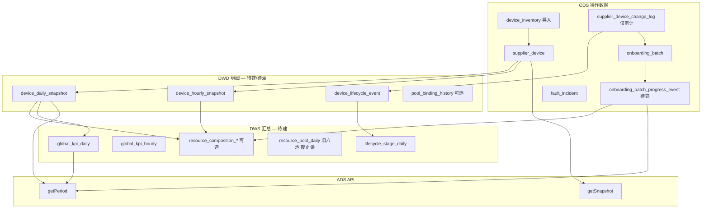

# 全局接入监控大盘 — 时间段分析设计与实现方案

**页面**：`/dashboard/global`（`apps/web/src/app/[locale]/(protected)/dashboard/global/page.tsx`）  
**业务定位**：闲时弹性调度平台的 **设备与资源监控大盘**，面向 IDC/GPU 从供应商接入到资源池运营的全生命周期。  
**关联文档**：

- [global-dashboard-implementation-plan.md](./global-dashboard-implementation-plan.md)（Snapshot 口径与 `/supplier/overview` 对齐）
- [supplier-device-management-ops-panorama.md](./supplier-device-management-ops-panorama.md)（运营流程与变更表驱动进度）
- [supplier-device-ops-pool-masterdata-design.md](./supplier-device-ops-pool-masterdata-design.md)（**D1/D2** 主数据真源与变更表边界）

**文档性质**：**大盘 Period 模式总纲**（三档视图、URL、生命周期/KPI Period、DWS 总览、前端 P2a、API 骨架）+ 后端待办  
**版本**：v2.4（2026-05-29）  
**状态**：**活跃（总纲，非废止）** — 资源构成 / Period 卡时子域已迁移至专篇，见下。

### 权威口径分层（2026-05-29）

| 主题 | 权威文档 | 本文角色 |
|------|----------|----------|
| **资源构成**（互斥扇区、Snapshot 卡数、计划虚拟量） | [global-dashboard-resource-composition-chart-design.md](./global-dashboard-resource-composition-chart-design.md) | §3.4 仅索引 |
| **Period 资源构成卡时/台时**（数据源、ETL、与 Snapshot 解耦，**已确认**） | [global-dashboard-period-composition-card-hours-design.md](./global-dashboard-period-composition-card-hours-design.md) | §3.4 仅索引 |
| **8 项 KPI**（Snapshot / Period KPI） | [global-dashboard-kpi-caliber-spec.md](./global-dashboard-kpi-caliber-spec.md) | §6.1 摘要 |
| **三档 view、URL、前端 Mock、生命周期 Period** | **本文** | 主文 |
| **§3.4.2–§3.4.7 旧「六池重叠 + change_log 回放卡时」** | — | **已废止**（v2.4 起，勿再引用） |

> **不废止本文的原因**：整页 Period 仍需要总入口（视图语义、生命周期漏斗、KPI 趋势、P2b 卡片、DWS 分期）。废止的是 **与专篇冲突的子节**，不是整份文件。

---

## 1. 背景与目标

### 1.1 问题陈述

运营经理需要两类互补视图：

| 视图 | 问题 | 典型场景 |
|------|------|----------|
| **Snapshot（实时截面）** | 此刻有多少设备、在哪个池、什么生命周期？ | 值班大屏、实时指挥 |
| **Period（区间分析）** | 某段时间内接入了多少、池规模如何变化、各阶段耗时如何？ | 日复盘、周/月 KPI |

v1.0 设计仅描述 Snapshot + Period 双模式的数据模型；**v2.0 在前端落地三档视图**（实时 / 按日 / 按小时），用 URL 驱动全页卡片联动，数据仍为 Mock，后端 API 与 DWS 待接。

### 1.2 当前实现状态（2026-05-27）

| 层级 | 状态 | 说明 |
|------|------|------|
| **前端查询态** | ✅ 已实现 | `view=snapshot \| daily \| hourly`，URL 同步 |
| **页头与时间控件** | ✅ 已实现 | 三档切换、日期/ datetime 范围、对比开关（UI） |
| **KPI / 生命周期 / 资源池** | ✅ Mock 联动 | 随 `view` 与区间变化展示不同文案与趋势 |
| **集群 / 差异 / 告警 / 待办** | ⏳ 静态 Mock | 尚未接入 `useGlobalDashboardQuery` |
| **后端 API** | ⚠️ 部分已有 | `getSnapshot` / `getPeriod` 已接 DB；Period 构成仍为过渡态（§3.4.2） |
| **DWS 日/小时表** | ❌ 未灌数 | `device_*_snapshot` 表已定义，主数据 ETL 待建（专篇 M2） |

### 1.3 非目标

- 不替代供应商明细页（`/supplier/*`）CRUD。
- 不做计费/财务月结（见 `/finance`）。
- 不实现秒级调度用量监控（真实台时/卡时需接调度平台；供应侧卡时定义见 Period 卡时专篇 §7）。

---

## 2. 分析模式定义

### 2.1 三档视图（前端已实现）

原 v1.0 的 `mode=snapshot | period` 在前端细化为 **`view` 三档**；后端 API 可映射为 `mode + granularity`：

| 前端 `view` | 后端等价 | 粒度 | 默认区间 |
|-------------|----------|------|----------|
| `snapshot` | `mode=snapshot` | 当前时刻 | `as_of = now()` |
| `daily` | `mode=period`, `granularity=day` | 自然日 | 近 7 天（至今日末） |
| `hourly` | `mode=period`, `granularity=hour` | 整点小时 | 近 24 小时（至当前整点） |

### 2.2 URL 查询参数（已实现）

页面与页内 Header **共用** `useGlobalDashboardQuery()`，状态写入 URL（`router.replace`，无 scroll）：

```
/dashboard/global                                    # 默认 snapshot
/dashboard/global?view=daily&start=2026-05-21&end=2026-05-27
/dashboard/global?view=hourly&start=2026-05-27T08&end=2026-05-27T14
/dashboard/global?view=daily&start=...&end=...&compare=1
```

| 参数 | 适用 | 说明 |
|------|------|------|
| `view` | 全部 | `snapshot`（默认）\| `daily` \| `hourly` |
| `start` | daily / hourly | daily：`YYYY-MM-DD`；hourly：`YYYY-MM-DDTHH` |
| `end` | daily / hourly | 同上；daily 解析为当日 `23:59:59` |
| `compare` | daily / hourly | `1` = 开启「对比上周期」（**UI 已展示，数据未接**） |

**时区**：前端工具函数按 `Asia/Shanghai`（UTC+8）格式化/解析日界与整点。

**实现文件**：`dashboard/global/_lib/global-dashboard-query.ts`

```typescript
export type GlobalDashboardView = "snapshot" | "daily" | "hourly"

export type GlobalDashboardQuery = {
  view: GlobalDashboardView
  periodStart: Date
  periodEnd: Date
  comparePrevious: boolean
}
```

### 2.3 时间段语义约定

| 概念 | Snapshot | Daily / Hourly Period |
|------|----------|------------------------|
| **主值** | 当前截面存量 | **期末存量**（`period_end` 时刻/日末） |
| **Delta** | 环比（较上一周期 %） | **净增**（绝对值 + 单位） |
| **Sparkline** | 近 8 个点（Mock 为近 8 天） | 区间内按日/按小时序列，点数随区间长度变化 |
| **期初/期末** | — | 期初 = `period_start` 日/小时初；期末 = `period_end` |
| **净增（目标）** | — | `stock(end) − stock(start)`，**与 start 有关、与 end 固定为 now 时 end 侧主值应稳定** |

**重要约束（目标语义，Mock 尚未完全遵守，见 §10.1）**：

- 当 `period_end` 固定为「当前」时，修改 `period_start` **应**影响：趋势点数、净增、区间吞吐；**不应**改变期末主值与 Snapshot 对齐。
- Daily 默认 `end` = 今日 `23:59:59`，非精确「此刻」；Hourly 默认 `end` = 当前整点。

### 2.4 与供应商域模型关系

大盘 Period **按模块分轨**（与 [supplier-device-ops-pool-masterdata-design.md](./supplier-device-ops-pool-masterdata-design.md) D1/D2 一致）：

| 数据来源 | 用途 | **不用于** |
|----------|------|------------|
| `supplier_device` | Snapshot 截面；**资源构成**互斥分桶（`ops_status` 推导池） | — |
| `device_daily_snapshot` / `device_hourly_snapshot` | **资源构成 Period 卡时**（主数据 ETL 投影） | Snapshot 饼图主值（Snapshot 直读当前态） |
| `supplier_device_change_log` | **仅** 运维变更审计 + 批次挂接 + `refreshBatchProgress`；生命周期 ETL（§2.5） | **禁止** 更新 `supplier_device`；**禁止** 资源构成实体 Period 回放 |
| `onboarding_batch` + `device_link` | 批次进度、差异/待办、计划缺口 | 不为计划缺口伪造设备行 |
| `onboarding_batch_progress_event`（待建） | 计划管道 Period 卡时阶梯积分 | — |
| ~~`pool_binding_history`~~（**已删除** migration `0058`） | 旧六池 DWS | 互斥 `resourceComposition` 分桶 |

生命周期漏斗 **UI 已对齐 CRM 五段**（非 v1.0 九段 IDC）：`待接入 → 接入中 → 在线 → 维护中 → 下线中`。

### 2.5 变更动作分类与 ETL 边界（方案 A，已定）

供应商域采用 **方案 A**：**工单开始/结束只驱动 `batch_status`**；设备 `lifecycle_status` 仍由 **运维变更动作 + ops** 按 [`supplier-onboarding-plan-changelog-tracking-design.md`](./supplier-onboarding-plan-changelog-tracking-design.md) §3.4.3 推导。详见 [`supplier-device-management-ops-panorama.md`](./supplier-device-management-ops-panorama.md) §7.3。

#### 2.5.1 两类 change_log 语义

| 类型 | 典型 `change_action` | 影响 batch | 影响 device lifecycle（ETL） | 影响资源构成 Period 卡时 |
|------|----------------------|------------|---------------------------|---------------------------|
| **设备态变更** | `设备接收`、`加入集群`、上架类、`设备退订`… | 刷新进度缓存 | ✅ → `device_lifecycle_event` | ❌ **不** 回放实体（见专篇 §4） |
| **批次边界** | `开始执行工单`、`工单执行结束` | ✅ `batch_status` 流转 | ❌ `batch_boundary` | ❌ 仅经 `progress_event` 影响计划管道 |

**原则**：`supplier_device_change_log` **仅保存运维设备变更记录**（审计 + 批次触达）；设备截面真源为 **主数据导入/扫描**（D1）。工单结束 = 批次闭环，不等于每台设备自动达标（可 `needs_review`）。

#### 2.5.2 写入 `device_lifecycle_event` 的规则

| `event_kind` | 来源 | 计入 `stage_throughput` | 计入 `avg_dwell_time` |
|--------------|------|-------------------------|------------------------|
| `state_transition` | 设备态 `change_action` | ✅ | ✅ |
| `batch_boundary` | 开始/结束工单 | ❌ | ❌ |

实现：`device_lifecycle_event.event_kind`（`dashboard-schema.ts`）；G1 ETL 对 `开始执行工单` / `工单执行结束` 写 `batch_boundary` 或跳过 lifecycle 聚合。

#### 2.5.3 对大盘各模块的影响（摘要）

| 模块 | 行为（v2.4） |
|------|----------------|
| KPI Snapshot | 读 `supplier_device` / overview（见 KPI 口径 spec） |
| **资源构成 Snapshot** | 读 `supplier_device` + 当前 pipeline 缺口；`displayUnit=gpu_cards`（资源构成设计 §8.1） |
| **资源构成 Period 卡时** | 读 `device_*_snapshot` + `progress_event`；`displayUnit=card_hours`（[Period 卡时专篇](./global-dashboard-period-composition-card-hours-design.md)） |
| 旧 `resourcePools` Period | **废止** 两池重叠 + change_log 实体回放；可保留 API 别名，UI 不读 |
| 生命周期漏斗 Period | 仅 `state_transition` 驱动吞吐/停留（仍可由 change_log 清洗事件） |
| 差异/待办/批次卡片（P2b） | 目标 ops vs 实际 ops + 工单起止时间 |

---

## 3. 数据架构（后端目标态）

### 3.1 分层总览

> v2.4：**设备快照** 由 **主数据 ETL** 写入（非 change_log 清洗）。change_log 仅 → 生命周期事件 + 批次进度。详见 [Period 卡时专篇 §3](./global-dashboard-period-composition-card-hours-design.md)。



**读路径摘要**：

| API | 资源构成 | 生命周期 / KPI |
|-----|----------|----------------|
| `getSnapshot` | `supplier_device` 当前态 | overview / 截面 |
| `getPeriod` | `device_*_snapshot` + `progress_event`（**不** 调 `getSnapshot` 拼构成，专篇 §6） | `device_lifecycle_event` 或 change_log ETL |

### 3.2 核心表（摘要）

#### `device_daily_snapshot` / `device_hourly_snapshot`

| 字段 | 说明 |
|------|------|
| `snapshot_date` / `snapshot_hour` | 时间键 |
| `device_id` | 设备 |
| `lifecycle_status` | CRM 生命周期 |
| `pool_codes[]` | 资源池归属 |
| `gpu_count`, `card_type`, `data_center_id` | 维度 |

Daily / Hourly 由 **主数据 ETL** 灌数（`device_inventory` 导入 + 定时扫描 → `supplier_device` → 快照）；Snapshot **资源构成** 仍直读 `supplier_device` 当前态。详见 Period 卡时专篇 §8.3。

#### `pool_binding_history`（SCD Type 2，可选）

`device_id`, `pool_code`, `effective_from`, `effective_to` — 旧 **六池** `resourcePools` / 池净增 KPI；**互斥 `resourceComposition` 不依赖**。

#### ~~`resource_pool_daily` / `resource_pool_hourly`~~（**已删除** migration `0058`）

历史：六池重叠 × 在线卡时 DWS。表与 API `resourcePools` 已从代码库移除。

### 3.3 ~~旧六池 Mock 映射~~（**已删除**）

> v2.5：`_lib/global-dashboard-mock-data.ts` 与 `getMockPoolData` 从未落地或已移除；`ResourcePoolChartCard` 经 `trpc.dashboard.globalOps` 读 `resourceComposition`。

### 3.4 资源构成 / 资源池分布（索引 — 权威在外部专篇）

> **v2.4**：本节 **不再** 定义公式。§3.4.2–§3.4.7（v2.2 六池重叠 + change_log 回放卡时）**已废止**；实施与评审以专篇为准。

#### 3.4.1 文档分工

| 文档 | 内容 |
|------|------|
| [global-dashboard-resource-composition-chart-design.md](./global-dashboard-resource-composition-chart-design.md) | 互斥分桶、`classifyDeviceExclusiveBucket`、Snapshot `displayUnit=gpu_cards`、计划虚拟扇区、`onboarding_batch_progress_event` |
| [global-dashboard-period-composition-card-hours-design.md](./global-dashboard-period-composition-card-hours-design.md) | Period `displayUnit=card_hours`、主数据快照 ETL、`change_log` 仅审计、Schema 清单、**Period 与 Snapshot 代码解耦** |

#### 3.4.2 展示口径对照（`resourceComposition`）

| 视图 | 饼图扇区 | 中心主值 | 外围主值 | 数据源 |
|------|----------|----------|----------|--------|
| **Snapshot** | 互斥构成（实体 + 计划虚拟） | 分母卡数 | `{N} 卡` | `supplier_device` + 当前 pipeline 缺口 |
| **Period（目标）** | 同上 key | 区间合计 **卡时** | 卡时 + 台时 breakdown | `device_*_snapshot` + `progress_event` 积分 |
| **Period（现网 v1.0）** | 同上 key | 期末 **卡数**（过渡） | 净增卡数 | change_log 回放实体 + 桶末 pipeline（待 M5 切换） |

**供应侧卡时**：非租户账单消费卡时（与 `/finance` 区分）。**时间区间**：`[period_start, period_end]`，`Asia/Shanghai`。

**代码**：`getPeriod` **不得** 通过 `getSnapshot()` 组装 `resourceComposition`（专篇 §6）；可复用 `buildResourceCompositionPayload` 等 **纯函数**。

#### 3.4.3 UI 字段（目标）

以 `GlobalResourceCompositionPayload` 为准（`displayUnit`: `gpu_cards` | `card_hours`）；扇区 `key` / `cardHours` / `machineHours` / `gpuCount` 见 Period 卡时专篇 §7.3。旧 `ResourcePoolSlice` / 六池 `pool_code` 仅服务于废止的 `resourcePools` 字段。

#### 3.4.4 已废止章节（勿引用）

| 原章节 | 废止原因 |
|--------|----------|
| §3.4.2 符号 `pool p` / `in_pool` 重叠 | 改为互斥 `bucket_key` |
| §3.4.3 Snapshot 按六池在线卡数 | 改为互斥构成 + 非退订分母 |
| §3.4.4 Period 按池 `online(d,t)` 积分 | 改为主数据状态时序 + 状态停留时长（默认含维护/待接入占位） |
| §3.4.5 维护中 Period 不计卡时 | 与专篇 Q1 默认（**含**维护占位）冲突 |
| §3.4.6–§3.4.7 六池 UI 示例 | 改读 `resourceComposition` slices |

历史全文见 git `v2.2` 修订前版本。

## 4. 实现分期

| 阶段 | 内容 | 状态 |
|------|------|------|
| **P0** | 主数据 D1 + `change_log` 仅审计（D2）→ 生命周期 `device_lifecycle_event` | 部分已有 |
| **P1** | 主数据 ETL → `device_*_snapshot`（**非** change_log 洗快照） | 未开始 |
| **P2a** | 前端三档视图 + URL + Mock 联动（KPI/生命周期/资源池） | ✅ **已完成** |
| **P2b** | 集群/差异/告警/待办接入 query；`compare` 数据 | 未开始 |
| **P3** | `getSnapshot` / `getPeriod` + `resourceComposition`；Period 卡时 M1–M6（专篇 §14） | 部分已有（Snapshot 构成 + Period 过渡） |
| **P4** | 导出、下钻、与 overview 一致性测试 | 未开始 |

---

## 5. 前端实现方案（P2a，已实现）

### 5.1 页面结构

**路由**：`apps/web/src/app/[locale]/(protected)/dashboard/global/page.tsx`

```
Suspense
└── GlobalOpsDashboardContent
    ├── GlobalDashboardScopeBar      # 模式说明条（Snapshot/Daily/Hourly Badge）
    ├── GlobalDashboardHeader        # 标题、视图切换、时间范围、卡型筛选(Mock)
    ├── GlobalKpiSection             # ✅ 联动 query
    ├── 栅格 Row1
    │   ├── LifecycleFlowCard        # ✅ 联动 query
    │   ├── ResourcePoolChartCard    # ✅ 联动 query
    │   └── ClusterStatusCard        # ⏳ 静态 Mock
    └── 栅格 Row2
        ├── DiscrepancyTableCard     # ⏳ 静态 Mock
        ├── AlertsTimelineCard       # ⏳ 静态 Mock
        └── GlobalTodosCard          # ⏳ 静态 Mock
```

**Header 位置**：大盘专用 Header 渲染在 **页面内容区顶部**（`site-header.tsx` 中 Global 分支仅保留 Sidebar + Theme，不重复 Header）。

### 5.2 共享模块

| 文件 | 职责 |
|------|------|
| `_lib/global-dashboard-query.ts` | URL ↔ `GlobalDashboardQuery` 解析/写入；`useGlobalDashboardQuery()` |
| `_lib/global-dashboard-context.tsx` | `trpc.dashboard.globalOps.getSnapshot` / `getPeriod` → 各 Card |

**数据流**：

```
URL searchParams
  → parseGlobalDashboardQuery()
  → useGlobalDashboardQuery()  { query, setQuery, setView }
  → GlobalDashboardProvider (tRPC)  → 各 Card 渲染
```

### 5.3 Header 与 ScopeBar

**`global-dashboard-header.tsx`**

| 控件 | 行为 |
|------|------|
| 视图 Toggle | `实时` / `按日` / `按小时` → `setView()`，切换时重置默认区间 |
| 按日预设 | 「近 7 天」「本月」+ `type=date` 起止 |
| 按小时预设 | 「近 24 小时」+ `type=datetime-local` 起止（整点） |
| 对比上周期 | 切换 `compare=1`（Badge 提示；**对比数据未实现**） |
| 卡型下拉 | Mock 选项，**未写入 URL** |
| Scope 副标题 | Snapshot 下每秒刷新时钟 |

**`GlobalDashboardScopeBar`**：展示当前模式 Badge + 一句模式说明。

### 5.4 KPI 区（`global-kpi-section.tsx`）

**8 项指标**（与 [global-dashboard-implementation-plan.md](./global-dashboard-implementation-plan.md) §3.1 对齐）：

GPU 总卡数、在线设备、弹性资源池、裸金属池、内部占用、异常设备、待接入设备、待接入机房。

| 视图 | 主值 | Delta 标签 | Sparkline |
|------|------|--------------|-----------|
| snapshot | 当前 Mock 存量 | 环比（% 或绝对值） | 8 点，label 为近 8 天日期，末点「（当前）」 |
| daily | 期末 Mock 存量 | 净增（+N 单位） | 点数 = 区间天数（2~31），按日 label |
| hourly | 期末 Mock 存量 | 净增 | 点数 = 区间小时（2~24），按小时 label |

**Sparkline Tooltip**（每点可悬停）：

```
2026-05-27 14:00        ← 时间（第一行）
数值    4,280 卡         ← 数值 + 单位
```

实现：自定义 Recharts `Tooltip` content，读取 `payload.label` 与 `payload.v`。

### 5.5 生命周期（`lifecycle-flow-card.tsx`）

**五段 CRM 漏斗**（已替换 v1.0 九段 IDC Mock）：

| 阶段 | Snapshot 副指标 | Daily/Hourly 副指标 |
|------|-----------------|---------------------|
| 待接入 / 接入中 / 在线 / 维护中 / 下线中 | Snapshot：待接入段含计划缺口；Period：本期吞吐 **仅实体** + 「期末」标记 |

标题/副标题由 `getCardCopy(query)` 驱动。

### 5.6 资源构成（`resource-pool-chart-card.tsx`）

**目标口径**：§3.4 索引 → [资源构成设计](./global-dashboard-resource-composition-chart-design.md) + [Period 卡时专篇](./global-dashboard-period-composition-card-hours-design.md)。当前 Mock **未完全实现**（见 §10.1）。

| 元素 | Snapshot（目标） | Daily / Hourly Period（目标） |
|------|------------------|-------------------------------|
| 饼图扇区 | 互斥扇区 `gpuCount` / 卡数 | 互斥扇区 **`cardHours`** |
| 中心主文案 | `合计 {N} 卡` | `合计 {N} 卡时` |
| 中心副文案 | 计划缺口提示 | 卡时净增（可选） |
| 外围主值 | `{N} 卡` | `{N} 卡时` |
| 外围明细 | 卡型 · 卡数 | 卡型 · 台时 · 卡时 |
| 计划虚拟扇区 | 虚线 + 「计划」角标 | 同上 |

**现网**：已接 `resourceComposition`（互斥扇区）；Period 仍为 **期末卡数** 过渡态，卡时见专篇 M5–M6。

**禁止**：Period 模式下调 `getSnapshot()` 取构成数据（专篇 §6.4）。

### 5.7 未联动卡片（P2b）

以下组件仍为文件内常量 Mock，**不随 URL 变化**：

- `cluster-status-card.tsx` — `CLUSTERS`
- `discrepancy-table-card.tsx` — `DISCREPANCY_ROWS`
- `alerts-timeline-card.tsx` — `ALERTS`
- `global-todos-card.tsx` — `TODOS`

P2b 待办：接入 `query`，按 `occurred_at` / 期末截面过滤；`compare=1` 时并排或 delta 展示。

---

## 6. 分模块统计指标（目标口径）

以下为目标 API 口径；§5 描述当前 Mock 表现。

### 6.1 KPI 区

| key | Snapshot | Period（daily/hourly） |
|-----|----------|------------------------|
| `gpu_total` | `as_of` GPU 总和 | 期末存量 + 净增 |
| `device_online` | 在线台数 | 期末在线 / 可选日均 |
| `pool_elastic` / `pool_bare_metal` | 池 GPU | 期末 + 划入/划出 |
| `device_abnormal` | 当前异常 | 期内暴露数 |
| `device_pending_access` | 待接入 | Period：**仅**期末实体积压 + 本期进入（**不含**批次计划缺口；见 `supplier-overview-scenarios-from-zero.md` §2.1.5） |

`trend[]`：`{ time: string; value: number; label: string }[]`，与前端 sparkline 对齐。

### 6.2 生命周期

| 指标 | Period 计算 |
|------|-------------|
| `stage_throughput` | 区间内 **首次进入该阶段** 的设备数（**不含** `batch_boundary` 事件，§2.5.2） |
| `stage_wip_end` | 期末仍停在该阶段的数量 |
| `avg_dwell_time` | 离开该阶段的 `(leave − enter)` 均值 |

### 6.3 资源构成（`ResourcePoolChartCard`）

| 视图 | 饼图 value | breakdown | 权威文档 |
|------|------------|-----------|----------|
| **Snapshot** | `slice.gpuCount`（`displayUnit=gpu_cards`） | 卡型 × 卡数 | 资源构成设计 §8.1 |
| **Period（目标）** | `slice.cardHours`（`displayUnit=card_hours`） | 卡型 × 台时 × 卡时 | Period 卡时专篇 §7、§12 |

API 字段：`resourceComposition`（`GlobalResourceCompositionPayload`）。已移除：`resourcePools`、六池 DWS 表。

### 6.4 其余卡片

见 v1.0 §5.4~§5.7（集群、差异、告警、待办），P2b/P3 实现。

---

## 7. API 契约（目标，待实现）

### 7.1 tRPC 建议

```
dashboard.globalOps.getSnapshot({ as_of?, filters? })
dashboard.globalOps.getPeriod({
  granularity: 'day' | 'hour',
  period_start,
  period_end,
  compare_previous?,
  filters?,
})
```

**前端映射**：`view=snapshot` → `getSnapshot`；`view=daily|hourly` → `getPeriod` + 对应 `granularity`。

### 7.2 Response 骨架

```typescript
interface GlobalDashboardResponse {
  meta: {
    view: 'snapshot' | 'daily' | 'hourly'
    period_start?: string
    period_end?: string
    timezone: 'Asia/Shanghai'
    filters?: { card_type_ids?: string[] }
  }
  kpi: GlobalKpiPayload
  lifecycle: LifecycleFlowPayload
  resource_composition: GlobalResourceCompositionPayload  // 主读
  resource_pools?: ResourcePoolPayload                    // 兼容别名，UI 不读
  clusters: ClusterStatusPayload[]
  discrepancies: DiscrepancyPayload[]
  alerts: AlertPayload[]
  todos: TodoPayload[]
  compare?: GlobalDashboardResponse
}
```

```typescript
// 见 global-dashboard-api.ts — GlobalResourceCompositionPayload
interface GlobalResourceCompositionPayload {
  displayUnit: 'gpu_cards' | 'card_hours'
  denominator: { gpuCount?: number; cardHours?: number; deviceCount?: number; machineHours?: number }
  slices: Array<{ key: string; label: string; kind: 'entity' | 'pipeline_virtual'; gpuCount: number; cardHours?: number; machineHours?: number; ... }>
  centerPrimary: string
  centerSecondary?: string
  footnote: string
}
```

**缓存**：Snapshot TTL 30s；历史 Period TTL 1h。

**解耦**：`getPeriod` 内 `computePeriodResourceComposition()` **独立实现**；禁止从 `getSnapshot().resourceComposition` 拷贝（专篇 §6）。

### 7.3 替换 Mock 路径（前端接 API）

| 步骤 | 文件 | 改动 |
|------|------|------|
| 1 | `_lib/global-dashboard-mock-data.ts` | Mock `resourceComposition`：Snapshot 卡数 / Period 卡时（专篇 §7.3） |
| 2 | `_components/resource-pool-chart-card.tsx` | 按 `displayUnit` 渲染；仅消费 `resourceComposition` |
| 3 | `page.tsx` 或 data hook | `view=snapshot` → `getSnapshot`；`view=daily\|hourly` → `getPeriod` |
| 4 | `global-period.ts` | M5：移除 change_log 实体回放；不调用 `getSnapshot` 拼构成 |

---

## 8. 示例

### 8.1 URL（当前前端）

```
/dashboard/global?view=daily&start=2026-05-01&end=2026-05-27
/dashboard/global?view=hourly&start=2026-05-27T08&end=2026-05-27T20&compare=1
```

### 8.2 API（目标）

```
GET /api/v1/dashboard/global?granularity=day&period_start=2026-05-01&period_end=2026-05-27&compare_previous=true
```

### 8.3 语义样例

| 模块 | 视图 | 指标 | 值 | 含义 |
|------|------|------|-----|------|
| KPI | Period | `gpu_total` | 4,280 期末 / +120 净增 | 5 月净增 120 卡 |
| 生命周期 | Period | 待接入.throughput | 34 | 5 月新进入待接入 34 台 |
| 资源构成 | **Snapshot** | `pool_elastic_only.gpuCount` | 3,200 卡 | 互斥扇区「仅弹性」期末卡数 |
| 资源构成 | **Snapshot** | `pending_access_pipeline.gpuCount` | 48 卡 | 计划缺口（虚拟扇区） |
| 资源构成 | **Period** | `pool_dual.cardHours` | 12,480 卡时 | 双池扇区区间积分（目标态） |
| 资源构成 | **Period** | `pending_access_pipeline.cardHours` | 960 卡时 | 计划缺口 × 时长（`progress_event`） |

**Snapshot 与 Period 对照**：Snapshot 主值 = **截面卡数**；Period 目标主值 = **区间卡时**（不可直接比大小）。Period 各扇区 **期末 `gpuCount`** 应与 Snapshot 同 key 对齐（专篇 PC-T7）。现网 Period 过渡态为期末卡数 + change_log（§3.4.2）。

---

## 9. 数据质量与边界

| 场景 | 处理 |
|------|------|
| `开始执行工单` / `工单执行结束` | 写 `change_log` + 更新 `batch_status`；ETL 标 `batch_boundary`，不计 lifecycle 吞吐（§2.5） |
| 变更表 batch 导入、同 `occurred_at` | Hourly 落库用 commit 时间兜底 |
| `period_end` 固定为 now，仅改 start | 期末不变、净增与趋势点数变（§2.3） |
| 区间 > 31 天（daily） | 前端 Mock  cap 31 点；API 应分页或强制 rollup |
| 区间 > 24 小时（hourly） | 前端 Mock cap 24 点；API 应限 `max_range_hours` |
| 时区 | `Asia/Shanghai`，日界 0 点 |

---

## 10. Mock 已知局限与后端待办

### 10.1 Mock 语义缺陷（接 API 前需修正）

| 问题 | 现状 | 目标 |
|------|------|------|
| 资源构成饼图/外围主值 | Mock 用 **台数**（`BASE_POOL`） | Snapshot：互斥扇区 **卡数**；Period：**卡时**（§3.4 → 专篇） |
| 资源构成 breakdown | 固定常数 × factor | Snapshot：卡型×卡数；Period：卡型×台时×卡时 |
| 期末主值随 start 变化 | `seedFromQuery` 使用 `start_end` 拼接 | 期末仅依赖 `period_end` / Snapshot |
| 净增 | 随机 `pick()` | `stock(end) − stock(start)` 或卡时净增 |
| 对比上周期 | UI only | 嵌套 `compare` 响应或二次请求 |
| 卡型筛选 | 未入 URL | `card_type_ids[]` 过滤 |
| end 非精确 now | daily 为日末、hourly 为整点 | 可选「至今」锁定 end |

### 10.2 后端优先级

1. **G0** — `getSnapshot` 接 DB；`resourceComposition` Snapshot 路径（资源构成 Phase 1，**部分已有**）  
2. **G1** — `change_log` → `device_lifecycle_event`（**仅生命周期**，§2.5）；`appendBatchProgressEvent`（M1）  
3. **G2** — 主数据 ETL → `device_daily_snapshot`（**非** change_log 洗快照）  
4. **G2+** — `device_hourly_snapshot` + Period 卡时聚合（专篇 M3–M5）  
5. **G3** — `getPeriod` 与 Snapshot **解耦**；全卡片 + `compare` + P2b  
6. **G4**（可选）— `pipeline_gap_*` / `resource_composition_*` DWS 加速（专篇 M7）  

### 10.3 台时/卡时

**权威定义**：[global-dashboard-period-composition-card-hours-design.md](./global-dashboard-period-composition-card-hours-design.md) §7。

| 计量 | 摘要 | 用于 |
|------|------|------|
| **台时** | 互斥扇区/计划缺口 × 状态停留时长，按 **台** 计 | Period breakdown |
| **卡时** | 上式 × `gpu_count`（计划缺口按缺口 GPU） | Period 饼图主值 |

实体时序来自 **主数据快照**；计划时序来自 **`progress_event`**。废止：六池 `online(d,p,t)` + `resource_pool_daily` + change_log 实体回放。

---

## 11. 附录：文件与组件对照

| 路径 | 职责 | 数据来源 | 联动 query |
|------|------|----------|------------|
| `page.tsx` | 页面布局、Suspense | — | — |
| `_lib/global-dashboard-query.ts` | URL 查询态 | — | — |
| `_lib/global-dashboard-context.tsx` | tRPC 数据 | `globalOps` | 输入 query |
| `_components/global-dashboard-header.tsx` | Header + ScopeBar | — | ✅ |
| `_components/global-kpi-section.tsx` | KPI + sparkline tooltip | `data.kpis` | ✅ |
| `_components/lifecycle-flow-card.tsx` | 五段漏斗 | `data.lifecycleFunnel` | ✅ |
| `_components/resource-pool-chart-card.tsx` | 饼图 + 外围卡 | `data.resourceComposition` | ✅ |
| `_components/cluster-status-card.tsx` | 机房集群 | `CLUSTERS` 常量 | ❌ |
| `_components/discrepancy-table-card.tsx` | 差异校验 | 常量 | ❌ |
| `_components/alerts-timeline-card.tsx` | 告警 | 常量 | ❌ |
| `_components/global-todos-card.tsx` | 待办 | 常量 | ❌ |

**写入路径（v2.4）**：

- **设备截面 / 资源构成 Snapshot**：`device_inventory` 导入 / 扫描 → `supplier_device`（D1）  
- **资源构成 Period 卡时**：同上 → ETL → `device_*_snapshot`（**非** change_log）  
- **运维变更**：`device_changelog` → `supplier_device_change_log`（**仅审计**）→ `refreshBatchProgress` / `progress_event`  
- **生命周期 Period**：change_log → `device_lifecycle_event`（与资源构成 Period **分轨**）  

见 [supplier-device-ops-pool-masterdata-design.md](./supplier-device-ops-pool-masterdata-design.md)、[supplier-device-management-ops-panorama.md](./supplier-device-management-ops-panorama.md) §7。

---

## 12. 修订记录

| 版本 | 日期 | 说明 |
|------|------|------|
| v1.0 | 2026-05-18 | 初稿：Snapshot vs Period、DWS 数据模型、分模块指标 |
| v2.0 | 2026-05-27 | 合并前端 P2a 实现：三档 view、URL 契约、Mock 联动、KPI tooltip、资源池卡型×台时×卡时、CRM 五段生命周期；补充 Mock 局限与后端分期 |
| v2.1 | 2026-05-27 | **§3.4 权威口径**：Snapshot 饼图/外围按期末在线 GPU 卡数；Period 按区间卡时；明确台时/卡时公式、UI 映射与示例；同步 §5.6、§6.3、§7.3、§8.3、§10 |
| v2.2 | 2026-05-27 | **§2.5 方案 A**：工单起止仅驱动 batch_status；lifecycle 仍由运维变更推导；ETL 边界事件分类；同步 §6.2、§9、§10.2 |
| v2.3 | 2026-05-27 | **计划管道**：Snapshot 待接入 KPI/漏斗叠加批次计划缺口；`planned_gpu_count`；`new_idc` 待接入机房；Period **暂不**叠加（§2.1.5 场景文档） |
| v2.4 | 2026-05-29 | **部分废止 §3.4.2–§3.4.7**；资源构成/Period 卡时迁移至专篇（专篇 v1.3 已确认）；修正 §3.1 DWD、§2.4/§2.5 change_log 边界、§6/§7/§10 与代码解耦；保留总纲（view/URL/生命周期/KPI） |
