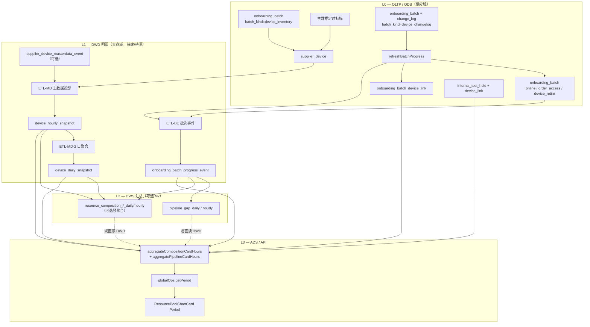
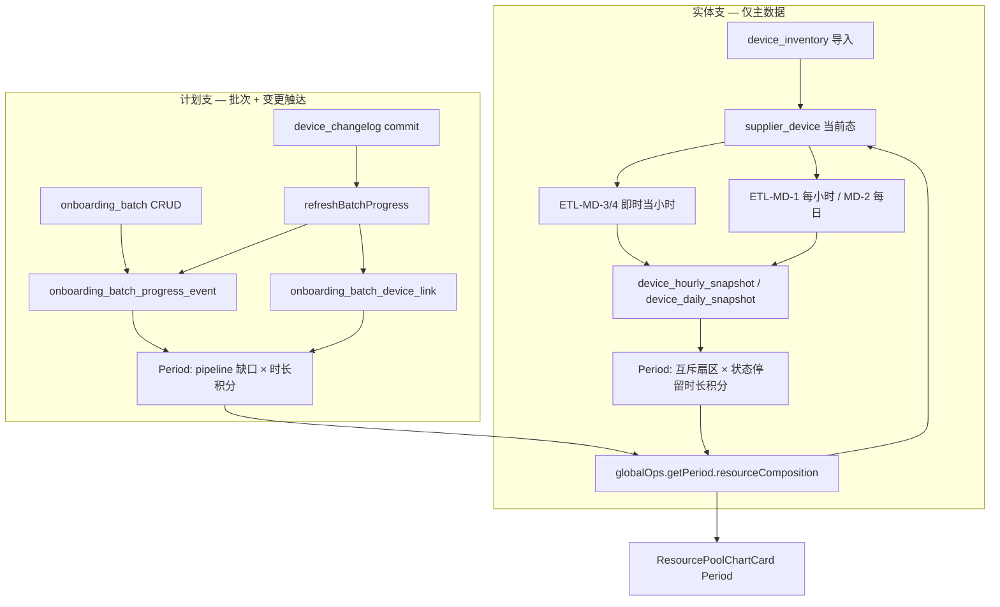

# 全局大盘 — Period 资源构成卡时/台时实现方案

**页面**：`/dashboard/global` — `ResourcePoolChartCard`（Period：`view=daily` | `hourly`）  
**文档性质**：Period 专篇实现方案（数据源、ETL、聚合、API、UI）；**已确认口径**，关联设计文档 v2.4+ 与之对齐。  
**版本**：v1.6（2026-05-29）  
**状态**：**已确认**（M1–M6 落地；**M7 本期不实施**；M2 = **MD-1/2 Cron + MD-3 导入即时小时桶 + MD-4 API 即时小时桶**；见 [M2](./global-dashboard-period-composition-m2-masterdata-etl.md) §0）

**前置口径**（已实施 v1.0，本文不重复定义互斥分桶规则）：

- [global-dashboard-resource-composition-chart-design.md](./global-dashboard-resource-composition-chart-design.md) — 扇区定义、`classifyDeviceExclusiveBucket`、Snapshot、分母闭合
- [supplier-device-ops-pool-masterdata-design.md](./supplier-device-ops-pool-masterdata-design.md) — **D1** 设备主数据真源、**D2** 变更表仅批次/审计

**本文取代**（确认后）：

- 资源构成设计文档 §8.2 中「用 `supplier_device_change_log` 回放实体」的 Period 路径
- 现网 `global-period.ts` 对 `change_log` 的实体回放及旧 `resourcePools` 卡时累加

---

## 1. 决策摘要（已定方向）


| #   | 决策                                       | 说明                                                                                      |
| --- | ---------------------------------------- | --------------------------------------------------------------------------------------- |
| P1  | **实体卡时/台时** 只来自 **设备主数据状态时序**            | `device_inventory`（**MD-3**）与第三方 **主数据状态 API**（**MD-4**，[专文](./supplier-device-masterdata-integration-api-design.md)）后 **立刻写当小时桶**；**MD-1 每小时** + **MD-2 每日** Cron 铺网格；变更记录 API **不写** 实体快照 |
| P2  | **计划虚拟卡时/台时** 只来自 **计划批次进度时序**           | `onboarding_batch` + `onboarding_batch_progress_event`（+ `device_link.linked_at` 校验）    |
| P3  | `**device_changelog` 不参与实体 Period**      | 变更表 commit **不** 作为 `ops_status` / `lifecycle` 回放源                                      |
| P4  | **变更表只影响「待接入/下架」计划管道**                   | 仅通过 `refreshBatchProgress` → `touched` / `progress_synced` 事件 → 缩小 `planned−touched` 缺口 |
| P5  | Period 饼图 `**displayUnit = card_hours`** | 扇区 `value = cardHours`；台时用于外围明细与可选 breakdown                                            |
| P6  | **供应侧卡时**                                | 非租户账单消费卡时（与 `/finance` 区分）                                                              |
| P7  | `**supplier_device_change_log` 仅运维变更记录** | 审计与批次挂接；**不**更新 `supplier_device`、**不**驱动实体 Period/Snapshot 截面（D2）                      |
| P8  | **Period 与 Snapshot 代码解耦**               | 独立读路径与聚合入口；仅共享 **无 I/O 的纯函数**（分桶、payload 组装）                                            |


---

## 2. 目标与非目标

### 2.1 目标


| 目标  | 验收                                                                          |
| --- | --------------------------------------------------------------------------- |
| G1  | 区间 `[periodStart, periodEnd]` 内，每个 **实体互斥扇区** 可算 `cardHours`、`machineHours` |
| G2  | `pending_access_pipeline`、`retiring_pipeline` 可算区间 **计划占位** 卡时/台时           |
| G3  | **期末截面** `gpuCount` 与卡时主值可同时提供                                              |
| G4  | 与 Snapshot 互斥构成 **同一套扇区 key**                                               |
| G5  | 主数据与变更表职责 **不交叉**                                                           |


### 2.2 非目标

- 不用 `supplier_device_change_log` 推导实体池归属或 lifecycle（含 `device_lifecycle_event` 清洗链）。
- 不为计划缺口伪造 `supplier_device` 行。
- 不在本期实现 IDC 9 段 / 6 池 workload 卡时。
- 不在本期实现库存级 `internal_test_hold` 的独立时间轴（见 §10.3）。

---

## 3. 数据架构分层总览

本节给出 **Period 资源构成卡时/台时** 专篇的完整数据分层：各表职责、写入来源、读取消费，以及与大盘其他模块的边界。

### 3.1 四层模型


| 层      | 英文名        | 定位                        | 本专篇范围                           |
| ------ | ---------- | ------------------------- | ------------------------------- |
| **L0** | OLTP / ODS | 业务操作真源（主数据 D1、批次、变更审计 D2） | 只 **读**；写入由供应域作业触发              |
| **L1** | DWD 明细     | 设备状态时序、批次进度时序（可回放）        | **实体 + 计划** 两条时序的权威载体           |
| **L2** | DWS 汇总     | 按日/小时预聚合（读加速）              | **M7 本期不实施**；Period 永久 L3 在线聚合 |
| **L3** | ADS / API  | 对前端的读模型                   | `getPeriod.resourceComposition` |





**分层原则（与 P1–P4 对齐）**：


| 原则                         | 说明                                                                                                                           |
| -------------------------- | ---------------------------------------------------------------------------------------------------------------------------- |
| **实体与计划分轨**                | 左支（主数据 → 设备快照）与右支（批次 → 进度事件）在 L1 分表存储，L3 合并为同一 `resourceComposition` payload                                                 |
| **变更表不进实体 L1**             | `device_changelog` / `supplier_device_change_log` **不** 写入 `device_*_snapshot`；仅经 `refreshBatchProgress` 影响 `progress_event` |
| **D2 不更新 supplier_device** | 工单动作只落 change_log + 批次进度；设备 `ops_status` / `lifecycle` 仅由 **inventory 导入 / 扫描** 更新（D1）                                       |
| **DWS 可跳过**                | M3–M6 允许从 L1 在线积分；L2 仅为性能与历史回填加速                                                                                             |


### 3.2 全表职责矩阵

下表按 **是否参与本专篇 Period 卡时** 标注。Schema 定义见 `packages/db/src/supply-schema.ts`、`packages/db/src/dashboard-schema.ts`。

#### 3.2.1 L0 — OLTP / ODS


| 表 / 对象                                                                         | 职责                                                                                  | 数据来源（谁写）                                             | 本专篇消费方式                                                                          |
| ------------------------------------------------------------------------------ | ----------------------------------------------------------------------------------- | ---------------------------------------------------- | -------------------------------------------------------------------------------- |
| `**supplier_device`**                                                          | 设备主数据 **当前态**（D1 真源） | `device_inventory` 导入 commit；**主数据 Web API**（MD-4）；**非** changelog | 供 ETL-MD 投影；`approximate` 回填；Snapshot 对照                   |
| `**onboarding_batch`**（`batch_kind=device_inventory`）                          | 主数据 Excel 导入批次元数据                                                                   | 供应域导入作业                                              | 触发 ETL-MD-3：导入完成时刻写对应 **小时/日快照**                                                 |
| `**onboarding_batch`**（`batch_kind=online` | `order_access` | `device_retire`） | 商务 **业务批次** 当前计划/状态/触达缓存                                                            | 批次 CRUD、工单状态变更                                       | 读当前行 + **投影** 为 `progress_event`；**不** 单独做区间回放                                   |
| `**onboarding_batch`**（`batch_kind=device_changelog`）                          | 变更表 Excel 导入批次                                                                      | 运维导入 commit                                          | commit → `refreshBatchProgress` → **仅** 右支事件；**不写** 实体快照                         |
| `**supplier_device_change_log`**                                               | **仅** 运维设备变更记录（§4）；审计 + 批次挂接                                                        | `device_changelog` 导入                                | **不参与** 实体 Period；间接 `progress_synced`                                           |
| `**onboarding_batch_device_link`**                                             | 业务批次 ↔ 设备挂接；`linked_at` 为触达时刻                                                       | 变更表 commit / 手工挂接                                    | 回放 `touched_*` 的 **交叉校验**（优先于事件表缓存）；**不** 替代 `progress_event` 的 `planned_*`      |
| `**onboarding_batch_plan_line`**                                               | 计划明细行（卡型×数量）                                                                        | 批次创建/修订                                              | 修订时触发 `plan_revised` 事件；聚合不直读                                                    |
| `**internal_test_hold**` + `**internal_test_hold_device_link**`                | 设备级内部测试占用                                                                           | 供应域 hold 作业                                          | τ 末态 **active hold** 集合 → `classifyDeviceExclusiveBucket` → `internal_occupancy` |
| `**supplier_gpu_inventory`**                                                   | 库存 GPU 总量                                                                           | 库存同步                                                 | **不参与** 本卡片；仅供 KPI `gpu_total`                                                   |
| `**resource_pool_binding`**                                                    | 池绑定配置（若启用）                                                                          | 供应域配置                                                | 本专篇 **互斥分桶用 `ops_status` 推导池**，不依赖绑定表做 Period                                    |
| `**fault_incident`**                                                           | 故障工单                                                                                | 运维录入                                                 | **不参与**                                                                          |
| `**supplier` / `data_center` / `gpu_card_type`**                               | 维度主数据                                                                               | 主数据                                                  | API `filters`、breakdown 维度                                                       |


#### 3.2.2 L1 — DWD 明细


| 表                                                     | 职责                                      | 数据来源                                                           | 消费方                                                   |
| ----------------------------------------------------- | --------------------------------------- | -------------------------------------------------------------- | ----------------------------------------------------- |
| `**device_hourly_snapshot**`                          | 设备 × **整点小时** 状态截面 + `onlineHours`（0~1） | ETL-MD-1 Cron；ETL-MD-3 导入 / **MD-4 API** 即时写当小时；可选 `masterdata_event` | Period `view=hourly` 实体阶梯积分（§8.4）              |
| `**device_daily_snapshot`**                           | 设备 × **自然日** 末态 + 日 `onlineHours`（0~24） | ETL-MD-2 由当日小时快照聚合；MD-3/4 更新日桶末态                                      | Period `view=daily`；hourly 的日 rollup 源    |
| `**onboarding_batch_progress_event`**（**待建**，§5.4、M1） | 批次计划/触达/终态的 **不可变事件日志**                 | `appendBatchProgressEvent`：批次 CRUD、`refreshBatchProgress`、状态变更 | Period **计划虚拟扇区** 阶梯积分（§9.3）；Snapshot pipeline 缺口时点回放 |
| `**supplier_device_masterdata_event`**（**可选**）        | 主数据每次导入/扫描的设备级状态变更                      | ETL-MD 旁路 append                                               | 提高分段积分精度；再投影到 `device_*_snapshot`                     |


**L1 行粒度约定**：


| 表                                 | 唯一键                                          | 核心度量字段                                                                                          |
| --------------------------------- | -------------------------------------------- | ----------------------------------------------------------------------------------------------- |
| `device_hourly_snapshot`          | `(snapshot_hour, supplier_device_id)`        | `lifecycle_status`, `ops_status`, `in_maintenance`, `gpu_count`, `online_hours`, `pool_codes[]` |
| `device_daily_snapshot`           | `(snapshot_date, supplier_device_id)`        | 同上（日末末态 + 日累计 `online_hours`）                                                                   |
| `onboarding_batch_progress_event` | `id`（时序按 `onboarding_batch_id, occurred_at`） | `planned_*`, `touched_*`, `batch_status`, `event_type`                                          |


#### 3.2.3 L2 — DWS 汇总（M7 本期不实施）


| 表                                                                  | 职责                                                                   | 数据来源                                     | 消费方                        |
| ------------------------------------------------------------------ | -------------------------------------------------------------------- | ---------------------------------------- | -------------------------- |
| `**pipeline_gap_daily` / `pipeline_gap_hourly`**（**本期不建**） | 日/小时末 `**pending_access` / `retiring**` 缺口台数/GPU                     | 远景：M7 ETL；**现网** 在线 `computePipelineGapsAt`     | 不改变口径，仅加速            |
| `**resource_composition_daily` / `hourly**`（**本期不建**）                 | 按 **互斥 `bucket_key` × card_type** 预聚合 `card_hours` / `machine_hours` | 远景：M7 ETL；**现网** L3 在线聚合 | **权威读路径** |


> **旧 DWS 表**（`resource_pool_daily/hourly`、`device_pool_*_snapshot`）：按 **六池重叠 + 在线卡时** 建模，服务于废止的 `resourcePools`。**本专篇不消费**；Period UI 只读 `resourceComposition`。

#### 3.2.4 L3 — ADS / 应用读模型


| 出口                                                                 | 职责                                   | 输入                                                                                    | 消费方                                     |
| ------------------------------------------------------------------ | ------------------------------------ | ------------------------------------------------------------------------------------- | --------------------------------------- |
| `**globalOps.getPeriod({ granularity, periodStart, periodEnd })`** | 组装 Period 大盘 payload                 | L1（±L2）+ `classifyDeviceExclusiveBucket` + 过滤器                                        | `ResourcePoolChartCard`、`global-kpi` 脚注 |
| `**resourceComposition**` 字段                                       | 互斥扇区 slices；`displayUnit=card_hours` | `aggregateCompositionCardHoursFromSnapshots` + `aggregatePipelineCardHoursFromEvents` | 饼图 `value`、外围 breakdown                 |
| `**resourcePools**`（兼容别名）                                          | 旧两池重叠卡时                              | 可映射自 composition 或独立遗留逻辑                                                              | **UI 不读**（P5 建议）                        |


**Snapshot 对照（非 Period，但共用分桶）**：


| 出口                                | 数据源                                       | 说明                                             |
| --------------------------------- | ----------------------------------------- | ---------------------------------------------- |
| `getSnapshot.resourceComposition` | **直读** `supplier_device` + 当前 pipeline 缺口 | `displayUnit=gpu_cards`；与 Period 共用扇区 key，单位不同 |


### 3.3 双支数据流（写入路径）




| 支路     | 允许改变的内容                                                                  | 禁止                                             |
| ------ | ------------------------------------------------------------------------ | ---------------------------------------------- |
| **实体** | `supplier_device` 状态 → `device_*_snapshot` → 实体扇区 `cardHours`            | `change_log` 写入快照；用 change_log 回放 `ops_status` |
| **计划** | `progress_event` 阶梯 → `pending_access_pipeline` / `retiring_pipeline` 卡时 | 为缺口创建 `supplier_device`；change_log 改实体池归属      |


### 3.4 显式不参与本专篇的表

以下对象存在于大盘域或供应域，但 **不进入 Period 资源构成卡时** 聚合链（避免与 period-analytics 旧路径混淆）：


| 表 / 路径                                        | 原因                          | 归属模块                                     |
| --------------------------------------------- | --------------------------- | ---------------------------------------- |
| `supplier_device_change_log` → 实体回放           | 违反 P3/D2；与 Snapshot 双轨      | 现网 `global-period.ts`（待移除）               |
| `device_lifecycle_event`                      | 服务 **生命周期漏斗** Period，非资源构成  | `LifecycleFlowCard`                      |
| `pool_binding_history`                        | 旧池归属 SCD；互斥分桶用 `ops_status` | 池净增 KPI（若另做）                             |
| `device_pool_*_snapshot`、`resource_pool_`*    | 六池重叠 + 在线卡时                 | 旧 `resourcePools`                        |
| `global_kpi_*`、`lifecycle_stage_*`            | 8 KPI、五段漏斗                  | `GlobalKpiSection`、`LifecycleFlowCard`   |
| `fault_incident`、进行中 `onboarding_batch`（差异规则） | 待办/差异表规则                    | `GlobalTodosCard`、`DiscrepancyTableCard` |


### 3.5 与现网 / Schema 注释的差异


| 项                                 | `dashboard-schema.ts` 现状       | 本专篇目标                                                           |
| --------------------------------- | ------------------------------ | --------------------------------------------------------------- |
| DWD 注释「由 change_log 清洗快照」         | 历史 period-analytics 口径         | **改为** 主数据 ETL → `device_*_snapshot`                            |
| `device_*_snapshot.pool_codes[]`  | 存日末池列表                         | Period 分桶 **优先** `ops_status` + `classifyDeviceExclusiveBucket` |
| `onboarding_batch_progress_event` | Schema **未落库**                 | M1 新增（OLTP 追加日志）                                                |
| Period `resourceComposition` 实现   | change_log 回放 + 期末 `gpu_cards` | L1 积分 + `card_hours`（§16）                                       |


---

## 4. `supplier_device_change_log` 职责约定

与 [supplier-device-ops-pool-masterdata-design.md](./supplier-device-ops-pool-masterdata-design.md) **D2** 一致；本专篇 **强制** 如下边界。

### 4.1 表定位（仅此用途）

`supplier_device_change_log`（由 `device_changelog` 导入批次写入）**仅用于保存运维的设备变更记录**，包括：


| 用途         | 说明                                                                                                              |
| ---------- | --------------------------------------------------------------------------------------------------------------- |
| **审计追溯**   | 谁在何时、对哪台设备、执行了何种 `change_action`（工单动作）                                                                          |
| **导入对账**   | 与 `onboarding_batch`（`batch_kind=device_changelog`）、`import_row_no` 对齐                                          |
| **批次挂接**   | `ticket_no` → `business_onboarding_batch_id`；写入 `onboarding_batch_device_link`                                  |
| **进度刷新触发** | commit 后调用 `refreshBatchProgress` → 更新 `onboarding_batch.touched_`* → 落 `onboarding_batch_progress_event`（M1 后） |


### 4.2 明确禁止的用途


| 禁止                                                                              | 原因                                           |
| ------------------------------------------------------------------------------- | -------------------------------------------- |
| **更新** `supplier_device` 的 `ops_status` / `lifecycle_status` / `in_maintenance` | 设备截面真源为 **D1 主数据**（`device_inventory` / 扫描）  |
| **写入** `device_daily_snapshot` / `device_hourly_snapshot`                       | 实体 Period 时序来自主数据 ETL，非工单回放                  |
| **回放** 资源构成实体扇区（Snapshot / Period）                                              | 避免与主数据截面 **双轨**                              |
| **推导** 池归属、维护中、下架中等互斥分桶的「真值」                                                    | 分桶读 `supplier_device` 或主数据快照，不读 change_log 行 |
| **清洗** `device_lifecycle_event` 作为本卡片实体源                                        | 生命周期漏斗另文档约定；**不等于** 资源构成实体源                  |


### 4.3 与 `device_changelog` 导入的关系

```
device_changelog Excel commit
  → INSERT supplier_device_change_log（逐行审计）
  → INSERT/UPDATE onboarding_batch_device_link（挂接）
  → refreshBatchProgress(businessBatchId)
  →（M1 后）appendBatchProgressEvent(progress_synced)
  → 计划管道缺口下降（pending_access_pipeline / retiring_pipeline）

  ✗ 不 UPSERT supplier_device 状态字段
  ✗ 不触发 ETL-MD 写 device_*_snapshot
```

### 4.4 现有字段（**不修改 Schema**，只读约定）

`packages/db/src/supply-schema.ts` — `supplier_device_change_log`：


| 字段                                                   | 职责                                            |
| ---------------------------------------------------- | --------------------------------------------- |
| `id`                                                 | 主键                                            |
| `supplier_device_id`                                 | 设备                                            |
| `onboarding_batch_id`                                | changelog 导入批次 FK                             |
| `business_onboarding_batch_id`                       | 解析出的业务批次（上架/订单接入）                             |
| `occurred_at`                                        | 变更发生时刻（导入行时间）                                 |
| `change_action`                                      | 运维动作枚举                                        |
| `change_content` / `description`                     | 原始描述                                          |
| `ticket_no`                                          | 飞书工单号                                         |
| `import_row_no`                                      | 导入行号                                          |
| `previous_ops_status` / `new_ops_status`             | 导入行声明的前后 ops（**审计用**，不以之覆盖 `supplier_device`） |
| `previous_lifecycle_status` / `new_lifecycle_status` | 同上（审计用）                                       |
| `internal_ip`                                        | 对账辅助                                          |


**消费方（允许）**：批次详情页、变更历史查询、合规导出、`refreshBatchProgress` / `progress_event` 写入链。

**消费方（禁止，确认后删除）**：`global-period.ts` 中 `loadChangeLogs` + `applyLogsUntil` 用于 **实体** 资源构成/池回放。

---

## 5. Schema 变更清单（新增 / 修改表与字段）

> Schema 文件：`packages/db/src/supply-schema.ts`（OLTP）、`packages/db/src/dashboard-schema.ts`（DWD/DWS）。  
> **MVP（M1–M6 + M2：MD-1/2/3/4）** 必须项标 ★；**M7 本期不实施** 标 ○（归档）。

### 5.1 汇总


| 动作           | 表名                                                                    | 层级            | 阶段          |
| ------------ | --------------------------------------------------------------------- | ------------- | ----------- |
| **不修改**      | `supplier_device_change_log`                                          | L0            | —（§4 仅约定用途） |
| **不修改**      | `supplier_device`、`onboarding_batch`、`onboarding_batch_device_link` 等 | L0            | —           |
| **已定义，灌数** ★ | `device_hourly_snapshot`                                              | L1            | M2          |
| **已定义，灌数** ★ | `device_daily_snapshot`                                               | L1            | M2          |
| **新增** ★     | `onboarding_batch_progress_event`                                     | L1（OLTP 追加日志） | M1          |
| **新增** ○     | `supplier_device_masterdata_event`                                    | L1            | 可选精度        |
| **新增** ○     | `pipeline_gap_daily` / `pipeline_gap_hourly`                          | L2            | M7          |
| **新增** ○     | `resource_composition_daily` / `resource_composition_hourly`          | L2            | M7          |


### 5.2 不修改的表（本专篇）

以下表 **结构不变**；Period 卡时仅改变 **读哪张表、如何聚合**，不要求 DDL：

- `supplier_device_change_log`（§4）
- `onboarding_batch`、`onboarding_batch_plan_line`、`onboarding_batch_device_link`
- `internal_test_hold`、`internal_test_hold_device_link`
- `resource_pool_daily` / `resource_pool_hourly`、`device_pool_*_snapshot`（旧两池模型，本专篇不读）

### 5.3 已存在表 — 字段清单（无 DDL 变更，待 ETL）

`device_hourly_snapshot` / `device_daily_snapshot`（`dashboard-schema.ts` 已定义）：


| 字段                                             | 类型                 | 写入方    | Period 消费                       |
| ---------------------------------------------- | ------------------ | ------ | ------------------------------- |
| `id`                                           | text PK            | ETL-MD | —                               |
| `snapshot_hour` / `snapshot_date`              | timestamptz / date | ETL-MD | 时间桶键                            |
| `supplier_device_id`                           | text FK            | ETL-MD | 设备键                             |
| `supplier_id`                                  | text FK            | ETL-MD | 过滤                              |
| `data_center_id`                               | text FK            | ETL-MD | 过滤                              |
| `gpu_card_type_id`                             | text FK            | ETL-MD | breakdown                       |
| `gpu_count`                                    | integer            | 投影自主数据 | `cardHours` 乘数                  |
| `lifecycle_status`                             | varchar(32)        | 投影自主数据 | `classifyDeviceExclusiveBucket` |
| `ops_status`                                   | varchar(64)        | 投影自主数据 | 同上（池拓扑）                         |
| `in_maintenance`                               | boolean            | 投影自主数据 | 同上（维护优先级）                       |
| `is_online_at_end`                             | boolean            | ETL 计算 | 可选；默认实体卡时用状态停留时长，非必须            |
| `online_hours`                                 | numeric(15,4)      | ETL 阶梯 | 0~~1（小时）/ 0~~24（日）；仅「在线子集」权重时用  |
| `pool_codes`                                   | jsonb string[]     | 投影     | **非** Period 分桶主依据（以 ops 映射为准）  |
| `idc_code` / `idc_region` / `cooperation_type` | varchar            | 投影     | 过滤 / breakdown                  |
| `etl_batch_id`                                 | text               | ETL 作业 | 对账                              |
| `created_at` / `updated_at`                    | timestamptz        | ORM    | —                               |


### 5.4 新增表 ★ — `onboarding_batch_progress_event`

**落库**：`packages/db/src/supply-schema.ts`（与 `onboarding_batch` 同域，追加日志）。


| 字段                     | 类型          | 必填  | 说明                                                                                                              |
| ---------------------- | ----------- | --- | --------------------------------------------------------------------------------------------------------------- |
| `id`                   | text        | PK  |                                                                                                                 |
| `onboarding_batch_id`  | text FK     | ✓   | → `onboarding_batch.id`                                                                                         |
| `occurred_at`          | timestamptz | ✓   | 业务生效时刻                                                                                                          |
| `event_type`           | varchar(32) | ✓   | `batch_created` | `plan_revised` | `progress_synced` | `status_changed` | `batch_completed` | `batch_cancelled` |
| `batch_kind`           | varchar(32) | ✓   | 冗余：`online` / `order_access` / `device_retire`                                                                  |
| `batch_status`         | varchar(32) | ✓   | 事件后批次状态                                                                                                         |
| `planned_device_count` | integer     | ✓   | 事件后计划台数                                                                                                         |
| `planned_gpu_count`    | integer     | ✓   | 事件后计划 GPU                                                                                                       |
| `touched_device_count` | integer     | ✓   | 事件后触达台数（refresh 快照）                                                                                             |
| `touched_pipeline_gpu` | integer     | ✓   | 事件后触达 GPU 累加（`SUM(link.device.gpu_count)`）                                                                      |
| `supplier_id`          | text        | ✓   | 过滤冗余                                                                                                            |
| `data_center_id`       | text        |     | 过滤冗余                                                                                                            |
| `idc_region`           | varchar(64) |     | 过滤冗余                                                                                                            |
| `payload`              | jsonb       |     | 修订 diff、操作人、`source=changelog|ui` 等                                                                             |


**索引**：`(onboarding_batch_id, occurred_at)`；`(occurred_at)`；`(batch_kind, occurred_at)`；`(supplier_id, data_center_id, occurred_at)`。

**写入**：`appendBatchProgressEvent`（`batch-progress-events.ts`）；**不** 由 change_log 直接 INSERT，仅由 `refreshBatchProgress` / 批次 CRUD 触发。

### 5.5 新增表 ○ — `supplier_device_masterdata_event`（可选）

提高同一桶内多次主数据变更的分段积分精度；**无此表时** 可由小时快照子段或「桶末态」近似。


| 字段                    | 类型          | 说明                                    |
| --------------------- | ----------- | ------------------------------------- |
| `id`                  | text PK     |                                       |
| `supplier_device_id`  | text FK     |                                       |
| `occurred_at`         | timestamptz | 导入/扫描生效时刻                             |
| `source`              | varchar(32) | `inventory_import` | `scheduled_scan` |
| `lifecycle_status`    | varchar(32) | 变更后                                   |
| `ops_status`          | varchar(64) | 变更后                                   |
| `in_maintenance`      | boolean     | 变更后                                   |
| `gpu_count`           | integer     | 变更后                                   |
| `onboarding_batch_id` | text        | 可选，inventory 批次                       |
| `payload`             | jsonb       | 变更 diff                               |


### 5.6 新增表 ○ — DWS 预聚合（M7）

`**pipeline_gap_daily` / `pipeline_gap_hourly`**


| 字段                                                    | 说明                            |
| ----------------------------------------------------- | ----------------------------- |
| `snapshot_date` / `snapshot_hour`                     | 时间键                           |
| `gap_kind`                                            | `pending_access` | `retiring` |
| `device_count` / `gpu_count`                          | 缺口截面                          |
| `machine_hours` / `card_hours`                        | 桶内缺口积分（ETL 预计算）               |
| `supplier_id` / `data_center_id` / `gpu_card_type_id` | 可选维度                          |
| `filters_hash`                                        | jsonb，全局过滤                    |


`**resource_composition_daily` / `resource_composition_hourly**`


| 字段                                | 说明                                             |
| --------------------------------- | ---------------------------------------------- |
| `snapshot_date` / `snapshot_hour` | 时间键                                            |
| `bucket_key`                      | 互斥扇区 key（与 `classifyDeviceExclusiveBucket` 一致） |
| `kind`                            | `entity` | `pipeline_virtual`                  |
| `gpu_card_type_id`                | 可选 breakdown                                   |
| `device_count` / `gpu_count`      | 期末截面（辅助）                                       |
| `machine_hours` / `card_hours`    | 桶内积分                                           |
| `etl_batch_id`                    | 对账                                             |


### 5.7 应用层类型（非 DB，M5–M6 修改）

`GlobalDashboardPeriod.resourceComposition`（`global-dashboard-api.ts`）：


| 字段                                    | Period 目标         |
| ------------------------------------- | ----------------- |
| `displayUnit`                         | 固定 `'card_hours'` |
| `slices[].cardHours` / `machineHours` | 饼图主值              |
| `slices[].gpuCount`                   | 期末辅助（非主值）         |
| `denominator.cardHours`               | 闭合分母              |


---

## 6. Period 与 Snapshot 代码解耦

### 6.1 原则


| #   | 规则                                                                                                                     |
| --- | ---------------------------------------------------------------------------------------------------------------------- |
| C1  | **Snapshot** 与 **Period** 为两条 **独立** DataAccess 读路径，禁止 Period 通过 `getSnapshot()` **拼装** `resourceComposition`          |
| C2  | **允许共享** 仅 **纯函数 / 类型**（无 DB、无 `getSnapshot` 调用）                                                                       |
| C3  | Period **实体** 只读 `device_*_snapshot`（或期初 `approximate` 回填）；Snapshot **实体** 只读 `supplier_device` 当前态（经 `overview` 聚合）   |
| C4  | Period **计划** 只读 `progress_event`（+ `device_link` 校验）；Snapshot **计划** 读当前 batch 截面（`computePipelineGapsAt` / overview） |
| C5  | 复用卡片 UI 组件时，通过 `displayUnit` 区分渲染，**不** 在组件内调用另一条 API                                                                  |


### 6.2 目标模块划分


| 模块         | Snapshot                                                                | Period（确认后）                                             |
| ---------- | ----------------------------------------------------------------------- | ------------------------------------------------------- |
| 入口         | `global-ops.ts` → `getSnapshot`                                         | `global-ops.ts` → `getPeriod`                           |
| 实体聚合       | `overview-aggregation.ts` → `aggregateResourceComposition`              | `aggregateCompositionCardHoursFromSnapshots.ts`（**新建**） |
| 计划缺口       | `overview-aggregation` / `computePipelineGapsAt`                        | `aggregatePipelineCardHoursFromEvents.ts`（**新建**）       |
| 分桶         | `resource-composition-aggregation.ts` → `classifyDeviceExclusiveBucket` | **同文件，纯函数**                                             |
| Payload 组装 | `buildResourceCompositionPayload`                                       | **同函数**；入参 `displayUnit` 不同                             |
| 时间桶        | —                                                                       | `buildPeriodBuckets.ts`（**仅 Period**）                   |


### 6.3 允许共享（白名单）

```text
lib/server/aggregation/resource-composition-aggregation.ts
  - classifyDeviceExclusiveBucket
  - aggregateEntityCompositionBuckets
  - buildResourceCompositionPayload
  - compositionGpuDeltas / formatNetChange（展示）

lib/types/global-dashboard-api.ts
  - GlobalResourceCompositionPayload 及 slice 类型
```

### 6.4 禁止耦合（黑名单 · 确认后整改）


| 现网反模式                                                                                                       | 位置                                                                                  | 目标                                     |
| ----------------------------------------------------------------------------------------------------------- | ----------------------------------------------------------------------------------- | -------------------------------------- |
| Period 内 `await getSnapshot()` 再取 `resourceComposition` 字段拼装                                                | 应避免；`getSnapshot` 仅可取 **与构成无关** 的 `alerts` / `todos` / `clusters` / `discrepancies` | 资源构成 **不得** 来自 Snapshot 响应             |
| Period 实体态 `change_log` 回放 `applyLogsUntil`                                                                 | `global-period.ts`                                                                  | **删除**；改读 `device_*_snapshot`          |
| Period 与 Snapshot 共用 `overview.getStats` **整包** 作为构成源                                                       | 现网部分 KPI/构成混用                                                                       | Period 构成 **不** 调 `getStats`；KPI 趋势另路径 |
| `buildResourceCompositionPayload({ entityBuckets: endOnly, displayUnit: 'gpu_cards' })` 且数据来自 change_log 末态 | `global-period.ts`                                                                  | 改为快照积分 + `displayUnit: 'card_hours'`   |
| UI 在 Period 模式 fallback 调 Snapshot API                                                                      | `ResourcePoolChartCard`                                                             | 仅 `getPeriod`；loading/error 独立         |


**允许保留的「弱耦合」**（非构成数据）：

```typescript
// global-period.ts — 仅辅助模块，不构成 resourceComposition 数据源
const snapshot = await globalOpsDataAccess.getSnapshot(filters)
return {
  resourceComposition: await computePeriodResourceComposition(...), // 独立函数
  alerts: snapshot.alerts,
  todos: snapshot.todos,
  clusters: snapshot.clusters,
  discrepancies: snapshot.discrepancies,
}
```

### 6.5 验收（代码评审）


| ID   | 检查项                                                                             |
| ---- | ------------------------------------------------------------------------------- |
| DC-1 | `grep getSnapshot` 在 `global-period.ts` 内 **不** 出现于 `resourceComposition` 赋值链   |
| DC-2 | `grep change_log` / `loadChangeLogs` 在 Period 构成路径为 **0**                       |
| DC-3 | Snapshot 单测 / Period 单测 **分开**；共用仅 pure 函数单测                                    |
| DC-4 | `displayUnit=card_hours` 时 slices 主值为 `cardHours`，不依赖 Snapshot 的 `gpuCount` 作主值 |


---

## 7. 时间桶与基本公式

### 7.1 时间桶

与现网 `buildPeriodBuckets` 一致（`Asia/Shanghai`）：

| `granularity` | 桶 `τ` | 桶长 `|τ|`（小时） |
|---------------|--------|------------------|
| `day` | 自然日与 `[T₀,T₁]` 交集 | `0 < |τ| ≤ 24` |
| `hour` | 整点 `[h:00,h+1:00)` 与区间交集 | `0 < |τ| ≤ 1` |

### 7.2 卡时 / 台时（通用）

对任意维度 `X`（互斥扇区或计划虚拟扇区）：

```
cardHours_X([T₀,T₁]) = Σ_{τ ⊆ [T₀,T₁]} Σ_{单位 u ∈ X} gpu(u) × |τ|_u

machineHours_X([T₀,T₁]) = Σ_{τ ⊆ [T₀,T₁]} Σ_{单位 u ∈ X} 1 × |τ|_u
```

- **实体**：单位 `u` = 一台 `supplier_device`（在 τ 内状态恒定且归属扇区 `X`）。
- **计划虚拟**：单位 `u` = 一个「缺口台位」（无 `device_id`），在 τ 内缺口台数恒定。

单设备恒等式：

```
cardHours(d, τ) = metricGpuCount(d) × |τ|   （d 在 τ 内归属同一实体扇区）
machineHours(d, τ) = |τ|
```

### 7.3 Period 资源构成 Payload（卡时模式）

```typescript
type ResourceCompositionDisplayUnit = 'card_hours'  // Period 固定

type ResourceCompositionSlicePeriod = {
  key: string
  label: string
  kind: 'entity' | 'pipeline_virtual'
  /** 饼图 value */
  cardHours: number
  machineHours: number
  /** 期末截面（辅助） */
  gpuCount: number
  deviceCount: number
  netChangeLabel?: string      // 卡时净增
  breakdownByCardType?: Array<{
    cardType: string
    cardHours: number
    machineHours: number
  }>
}

type ResourceCompositionPayload = {
  displayUnit: 'card_hours'
  denominator: { cardHours: number; machineHours: number }
  slices: ResourceCompositionSlicePeriod[]
  centerPrimary: string        // e.g. "12,480 卡时"
  centerSecondary?: string     // e.g. "净增 +1,200 卡时"
  footnote: string
}
```

---

## 8. 实体扇区：主数据状态时序

### 8.1 与 `supplier_device_change_log` 的关系

完整职责见 **§4**。实体 Period **禁止** 读取 change_log；现网 `global-period.ts` 中 `loadChangeLogs` + `applyLogsUntil` 用于实体部分应在 M5 **删除**（KPI 趋势若仍用 change_log，见 §17 Q4，与资源构成无关）。

### 8.2 状态时序载体（推荐：DWS 快照表）

`packages/db/src/dashboard-schema.ts` 已定义：


| 表                        | 粒度   | 用途                   |
| ------------------------ | ---- | -------------------- |
| `device_daily_snapshot`  | 自然日  | Period `view=daily`  |
| `device_hourly_snapshot` | 整点小时 | Period `view=hourly` |


每行核心字段（与互斥分桶相关）：

- `snapshotDate` / `snapshotHour`
- `supplierDeviceId`, `gpuCount`, `lifecycleStatus`, `opsStatus`, `inMaintenance`
- `onlineHours` — 该桶内 **在线时长**（日：0~~24，小时：0~~1）
- `poolCodes` — 日末池 code 列表（**Period 实体分桶改用 `ops_status` → `classifyDeviceExclusiveBucket`，可不依赖 poolCodes**）

**推荐**：卡时积分以 `**ops_status` + `lifecycle` + `in_maintenance`** 做互斥分桶；`onlineHours` 仅用于需要「在线」子集时的时长权重（见 §8.4）。

### 8.3 写入时机（ETL / 同步任务）


| 触发源                                       | 行为                                                         | `occurred_at` / 桶 |
| ----------------------------------------- | ---------------------------------------------------------- | ----------------- |
| **设备主数据导入**（`device_inventory` commit）    | **立刻**写 **当前小时桶**；更新日桶末态；`online_hours` 由 MD-2 聚合                   | 导入完成时刻         |
| **主数据状态 REST API**（MD-4）                 | 同导入：**立刻**写当前小时桶 + 日桶末态；**禁止** 改 `gpu_count`（[专文](./supplier-device-masterdata-integration-api-design.md)） | `occurred_at` 可传 |
| **变更记录 REST API**                         | 仅 `change_log` + 批次进度；**不** 写实体快照                                  | Excel §4.2 对齐     |
| **ETL-MD-1**（每小时 Cron）                    | 读 `supplier_device` 写各整点小时桶（填满网格）                              | 整点              |
| **ETL-MD-2**（每日 Cron）                      | 由当日小时快照聚合日 `online_hours` 与末态                                   | 00:15 上海         |
| **可选** `supplier_device_masterdata_event` | 每次导入/扫描 append 一条事件（设备级状态变更），ETL 再投影到日/小时快照                | 精确到秒              |


**禁止**：`device_changelog` commit **不写** 实体快照（仅触发 §9 批次事件）。

#### 8.3.1 日快照 `onlineHours` 计算（阶梯法）

对设备 `d`、自然日 `D`：

1. 收集 `[D 00:00, D 24:00)` 内所有 **主数据事件**（或小时快照）按 `occurred_at` 排序。
2. 切段 `τ₁…τₙ`，每段内 `ops_status` / `lifecycle` / `in_maintenance` 恒定。
3. `onlineHours(D) = Σ_{段 ⊆ D} |段| × I(online(d, 段))`，上限 24。

其中 `online(d,t)` 与资源构成设计一致：

```
online(d,t) ⇔ lifecycle = '在线' ∧ ¬in_maintenance(d,t)
```

1. 日末截面字段 `lifecycleStatus` / `opsStatus` / `inMaintenance` 取 **当日最后一段** 末态。

#### 8.3.2 小时快照

桶 `[h:00,h+1:00)` 内若仅一次主数据末态，则：

- `onlineHours ∈ {0, 1}`（该小时内是否整小时在线）
- 若段内发生多次导入，按 **子段长度** 累加（0~1）。

### 8.4 实体扇区卡时/台时聚合（读路径）

对每个 Period 桶 `τ`、每台设备 `d`：

1. 读取覆盖 `τ` 的 **小时或日快照**（优先与 `granularity` 一致；日视图可读日表，小时视图读小时表）。
2. 构造 `CompositionDeviceInput`（与 Snapshot 相同字段）。
3. `bucketKey = classifyDeviceExclusiveBucket(device, internalHoldDeviceIdsAtτ)`
  - `internalHoldDeviceIds`：τ 末态 active hold（无 hold 时间轴时用 τ 末态全量 hold，见 §10.3）。
4. 有效时长 `h_eff`：
  - **默认（推荐）**：`h_eff = |τ|`（桶内状态取末态或分段积分后的 **该扇区停留时长**）。
  - **仅当扇区需要「在线」子集**（若产品后续对池扇区要求在线）：`h_eff = onlineHours(τ)`。

**v1.0 约定**：凡 **实体互斥扇区** 均按 **状态停留时长** 计卡时，不额外要求 `online()`（维护中、待接入、预留闲置等按主数据状态计占位时长）。

```
cardHours[bucketKey] += metricGpuCount(d) × h_eff
machineHours[bucketKey] += h_eff
```

1. 排除 `lifecycle=退订` / `ops=已退订` 的设备（与 Snapshot 分母一致）。

#### 8.4.1 分段积分（提高精度）

若同一 τ 内主数据多次变更，应按子段 `τ'` 分别 `classify` 再累加，避免「整桶只按末态」误差。

```
cardHours_X = Σ_{τ' ⊆ τ} Σ_{d: bucket(d,τ')=X} gpu(d) × |τ'|
```

### 8.5 实体扇区期末截面（辅助指标）

```
gpuCount_X(T₁) = Σ_{d: bucket(d,T₁)=X} metricGpuCount(d)
deviceCount_X(T₁) = |{ d: bucket(d,T₁)=X }|
```

用于 `netChangeLabel`（卡时版）与 KPI 对照；**饼图主值仍为 `cardHours_X`**。

---

## 9. 计划虚拟扇区：批次进度时序

### 9.1 数据源


| 数据                                    | 作用                                          |
| ------------------------------------- | ------------------------------------------- |
| `onboarding_batch`                    | 当前计划与状态                                     |
| `**onboarding_batch_progress_event**` | 计划修订、`touched` 跃迁、完成/取消的 **权威时间轴**          |
| `onboarding_batch_device_link`        | `linked_at ≤ T` 的触达台数/GPU **校验**（与事件快照交叉验证） |


`**device_changelog` 的角色**：

```
device_changelog commit
  → refreshBatchProgress(businessBatchId)
  →（可选）INSERT progress_synced 事件
  → 更新 onboarding_batch.touched_*
  → 仅使 pending_access_pipeline / retiring_pipeline 缺口下降
```

**不** 写入实体快照，**不** 改变实体扇区卡时。

### 9.2 缺口时点回放

对时刻 `T`、批次 `B`：

```
gap_devices(B,T) = max(0, planned_device(B,T) − touched_devices(B,T))
gap_gpu(B,T)     = max(0, planned_gpu(B,T) − touched_gpu(B,T))
```

- `planned_*`：来自 `progress_event` 最后一条 `occurred_at ≤ T` 的快照。
- `touched_*`：优先 `device_link.linked_at ≤ T` 去重计数/GPU 累加；与事件 `touched_*` 不一致时 **以 link 为准** 并打 `data_quality_flag`。

批次集合：


| 扇区                        | `batch_kind`             | `isActive(B,T)`                |
| ------------------------- | ------------------------ | ------------------------------ |
| `pending_access_pipeline` | `online`, `order_access` | 已创建且 T 时刻未 completed/cancelled |
| `retiring_pipeline`       | `device_retire`          | 同上                             |


汇总：

```
gap_devices_pending(T) = Σ_B gap_devices(B,T)
gap_gpu_pending(T)     = Σ_B gap_gpu(B,T)
```

### 9.3 计划虚拟扇区卡时/台时（阶梯积分）

对每个 Period 桶 `τ`，在 `τ` 内收集所有 **进度事件**（及批次创建点），形成阶梯：

```
cardHours_pending_pipeline(τ) = gap_gpu_pending(t_τ_start) × |τ|
machineHours_pending_pipeline(τ) = gap_devices_pending(t_τ_start) × |τ|
```

全区间：

```
cardHours_pending_pipeline([T₀,T₁]) = Σ_τ cardHours_pending_pipeline(τ)
```

**语义**：表示 **计划尚未挂接的 GPU·小时 / 台·小时 占位**，无 SN。

`retiring_pipeline` 同理。

### 9.4 与「待接入 · 已入库」实体扇区的关系


| 扇区                        | 数据源                    | 变更表影响             |
| ------------------------- | ---------------------- | ----------------- |
| `pending_access_entity`   | 主数据 `lifecycle=待接入` 时序 | 否                 |
| `pending_access_pipeline` | 批次缺口时序                 | **是**（仅 touched↑） |


防双计：设备一旦入库且 `lifecycle=待接入`，计 **实体**；同一台不再计入 `planned−touched`（`touched` 已含 link 设备）。

---

## 10. 边界与未决

### 10.1 主数据变更与快照精度（本期已定）

**写入组合**（见 [M2](./global-dashboard-period-composition-m2-masterdata-etl.md) §0）：**MD-1/2 Cron** + **导入/API 即时当小时桶**。

| 变更方式 | 实体时序精度 |
| -------- | ------------ |
| 导入 / API 当刻 | 变更所在 **整点小时** 立即有快照 |
| 两次变更之间 | **MD-1** 每小时用当前末态铺桶 → 小时视图连续 |
| 自然日 `online_hours` | **MD-2** 由 24 条小时快照阶梯聚合（非日表手填累加） |

**产品约定**：`device_changelog` 仍不驱动实体快照；计划扇区不变。

### 10.2 计划修订无事件的历史

M1 前：用 `batch_created` + 当前 `planned` + `link` 回填；`plan_revised` 缺失时段视为 planned 恒定 → 标 `approximate=true`。

### 10.3 内部占用 hold 时间轴

- 设备级 hold：`internal_test_hold` + `internal_test_hold_device_link`，active 集合可按 τ 末态取。
- 库存级 hold（无 device_id）：**不计入** 实体分桶卡时；与资源构成设计 §7.3 一致。

### 10.4 infra 设备

`metricGpuCount=0`：可计 `machineHours`，`cardHours=0`。

---

## 11. ETL 与任务清单

### 11.1 写入任务


| 任务 ID    | 输入                             | 输出                                     | 本期       |
| -------- | ------------------------------ | -------------------------------------- | -------- |
| ETL-MD-1 | `supplier_device` 当前态          | `device_hourly_snapshot`               | **Cron 每小时** |
| ETL-MD-2 | 当日小时快照                       | `device_daily_snapshot`                | **Cron 每日 00:15** |
| ETL-MD-3 | `device_inventory` commit      | **当前小时桶** + 日桶末态                     | **实时** |
| ETL-MD-4 | 主数据状态 REST API 成功            | 同 MD-3；不含 `gpu_count`                   | **实时** |
| ETL-BE-1 | 批次 CRUD / refresh              | `onboarding_batch_progress_event`      | 实时       |
| ETL-BE-2 | 历史批次 + link                    | 回填 `batch_created` / `progress_synced` | 一次性      |


### 11.2 读路径（`computeGlobalPeriod`）


| 步骤  | 说明                                                                                 |
| --- | ---------------------------------------------------------------------------------- |
| 1   | `buckets = buildPeriodBuckets(granularity, periodStart, periodEnd)`                |
| 2   | **实体**：按桶从 `device_*_snapshot` 分段积分 → `cardHours` / `machineHours` per `bucketKey` |
| 3   | **计划**：按桶对 `progress_event` 阶梯积分 → pipeline 扇区卡时/台时                                |
| 4   | 合并 slices，`denominator.cardHours = Σ slices.cardHours`                             |
| 5   | `centerPrimary = total cardHours`；`centerSecondary = 净增 cardHours vs 上期或期初`        |
| 6   | 可选：并行算期末 `gpuCount` 供 tooltip                                                      |


**删除**：实体扇区对 `supplier_device_change_log` 的依赖。

---

## 12. API 与 UI

### 12.1 `globalOps.getPeriod`

- 返回 `resourceComposition`，`displayUnit: 'card_hours'`。
- 保留 `resourcePools` 兼容字段时可映射为旧两池卡时，但 **UI 只读 `resourceComposition`**。

### 12.2 `ResourcePoolChartCard`（Period）


| 项          | 约定                                               |
| ---------- | ------------------------------------------------ |
| 饼图 `value` | `slice.cardHours`                                |
| Tooltip    | `{label}：{cardHours} 卡时（{machineHours} 台时）`      |
| 外围卡片       | 主值卡时；副值 `netChangeLabel`（卡时净增）；可选展示期末 `gpuCount` |
| 计划虚拟扇区     | 虚线描边 + 「计划」角标                                    |
| 副标题        | `区间供应卡时（主数据状态时序 + 计划批次进度；变更表仅更新批次缺口）`            |
| 脚注         | 见 §13                                            |


### 12.3 与待办任务区 / 差异表


| 模块    | 是否用本文 ETL | 说明                                                            |
| ----- | --------- | ------------------------------------------------------------- |
| 待办任务区 | 否         | 仍由 `batchSummaries` + `fault_incident` + `discrepancies` 规则生成 |
| 差异校验表 | 否         | 仍由进行中 `onboarding_batch` 当前截面                                 |


---

## 13. 脚注（Period 卡时）

```
实体卡时/台时：由主数据导入、Web API 与 ETL 定时快照写入的时序积分；互斥分桶规则与 Snapshot 一致。
计划缺口卡时/台时：由进行中批次的 planned−touched 对时间积分；设备变更表仅刷新批次进度，不驱动池/维护/下架等实体扇区。
供应侧卡时非租户账单消费卡时。库存级 internal_test hold 可能未计入设备扇区。
历史批次缺口在进度事件回填完成前，计划卡时可能标记为近似值。
```

---

## 14. 实施阶段


| 阶段     | 内容                                                                      | 依赖      |
| ------ | ----------------------------------------------------------------------- | ------- |
| **M0** | 确认本文                                                                    | —       |
| **M1** | `onboarding_batch_progress_event` 表 + `appendBatchProgressEvent` + hook | —       |
| **M2** | 主数据 ETL → `device_*_snapshot`（MD-1/2 Cron + MD-3 导入 + **MD-4 API**） | 见 M2 文档 |
| **M3** | `aggregateCompositionCardHoursFromSnapshots` 纯函数 + 单测                   | M2      |
| **M4** | `aggregatePipelineCardHoursFromEvents` + 单测                             | M1      |
| **M5** | `global-period.ts` 切换读路径；移除实体 change_log 回放；落实 **§6** 解耦                | M3,M4   |
| **M6** | `resource-pool-chart-card.tsx` Period 卡时展示                              | M5      |
| **M7** | `pipeline_gap_*` / `resource_composition_*` DWS + H5                           | **本期不实施** |


**建议顺序（当前）**：M1 → M2（MD-1/2/3/4）→ M3 → M4 → M5 → M6；~~M7~~ **关闭**。

### 14.1 分阶段实施步骤（独立文档）

| 阶段 | 文档 |
|------|------|
| **M1** | [global-dashboard-period-composition-m1-progress-event.md](./global-dashboard-period-composition-m1-progress-event.md) |
| **M2** | [global-dashboard-period-composition-m2-masterdata-etl.md](./global-dashboard-period-composition-m2-masterdata-etl.md) |
| **集成 API** | [supplier-device-masterdata-integration-api-design.md](./supplier-device-masterdata-integration-api-design.md) |
| **M7** | [global-dashboard-period-composition-m7-dws-acceleration.md](./global-dashboard-period-composition-m7-dws-acceleration.md)（**本期不实施**，归档） |

> M3–M6 已并入主文档 §6–§12 与现网代码；M4 步骤见 M1 文档「步骤 5」与 resource-composition 设计 §14.7。M2 触发策略见 M2 文档 §0。

---

## 15. 验收用例


| ID    | 场景                         | 期望                                                 |
| ----- | -------------------------- | -------------------------------------------------- |
| PC-T1 | 主数据导入：设备 `在集群中` 8 卡，持续 24h | `pool_elastic_only` 卡时 += 192，台时 += 24             |
| PC-T2 | 同日改为 `维护中`（仅主数据）           | 维护扇区卡时增加；**不**因变更表而变                               |
| PC-T3 | 变更表挂接批次，touched+1，缺口−1     | **仅** `pending_access_pipeline` 卡时下降；实体池不变         |
| PC-T4 | 仅创建批次 planned=32，无设备       | `pending_access_pipeline` 卡时 = 32×                 |
| PC-T5 | 双池 ops 全程不变 1 天            | `pool_dual` 卡时 = 8×24；不计入仅弹性/仅裸金属                  |
| PC-T6 | Period daily vs hourly     | 同一区间日积分之和 ≈ 小时积分之和（误差 < 1% 或文档约定插值规则）              |
| PC-T7 | Snapshot 与 Period 期末       | 各扇区 `gpuCount` 与 Snapshot `resourceComposition` 一致 |


---

## 16. 与现网差异对照


| 项                            | 现网（v1.0 已实施）                            | 确认后目标                   |
| ---------------------------- | --------------------------------------- | ----------------------- |
| 实体 Period 数据源                | `supplier_device_change_log` 回放         | 主数据快照/时序                |
| 计划 Period 缺口                 | `pipeline-period-replay`（batch+link 近似） | `progress_event` 阶梯     |
| Period `resourceComposition` | `displayUnit=gpu_cards` 期末截面            | `card_hours` 区间积分       |
| 变更表                          | 用于 change_log 回放（实体）                    | **仅** refresh 批次 → 计划管道 |


---

## 17. 确认项（评审用）


| #   | 问题                               | 建议默认                                         |
| --- | -------------------------------- | -------------------------------------------- |
| Q1  | 实体扇区卡时是否含非在线状态（维护/待接入）？          | **含**（状态占位时长）                                |
| Q2  | 小时视图最低主数据频率？                     | **MD-1 每小时** + 导入/API **即时**写当小时桶 |
| Q3  | 历史期初无快照时？                        | 用 `supplier_device` 当前态回填期初桶 + `approximate` |
| Q4  | KPI 趋势是否仍用 change_log？           | 另议；资源构成 Period **不用**                        |
| Q5  | 是否保留旧 `resourcePools` Period 卡时？ | 一期保留别名，UI 不读                                 |


---

## 18. 变更记录


| 版本   | 日期         | 说明                                                                                                           |
| ---- | ---------- | ------------------------------------------------------------------------------------------------------------ |
| v1.0 | 2026-05-29 | 初稿：主数据时序实体卡时 + 批次事件计划卡时；变更表仅影响计划管道                                                                           |
| v1.1 | 2026-05-29 | 新增 §3 数据架构分层总览：L0–L3、全表职责矩阵、双支数据流、显式排除表                                                                      |
| v1.2 | 2026-05-29 | 新增 §4 change_log 职责、§5 Schema 清单、§6 Period/Snapshot 代码解耦；章节顺延                                                |
| v1.3 | 2026-05-29 | 状态改为已确认；同步修订 period-analytics / resource-composition / kpi-caliber / implementation-plan / supplier-overview |
| v1.4 | 2026-05-29 | 新增 §14.1：M1/M2/M7 分阶段实施步骤独立文档索引 |
| v1.5 | 2026-05-29 | **M7 本期不实施**；M2 定为仅导入触发（ETL-MD-3），取消主数据定时扫描 Cron |
| v1.6 | 2026-05-29 | M2 确认：**恢复 MD-1/2 Cron** + 导入/API **即时小时桶** + **MD-4 主数据 Web API** |
| v1.7 | 2026-05-29 | MD-1 **维持 1 小时**；第三方 API 专文；禁止 API 改 `gpu_count`；变更 API 与 Excel 变更表对齐 |


