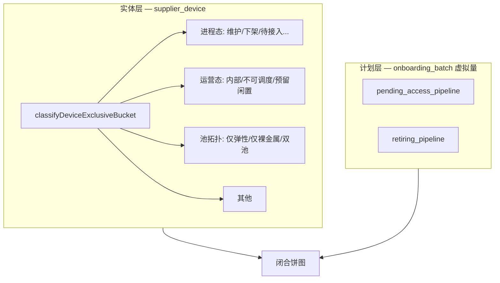
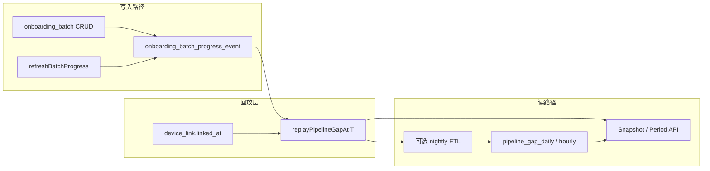

# 全局大盘 — 资源构成饼图（互斥分桶 + 计划虚拟量）设计

**页面**：`/dashboard/global` — `ResourcePoolChartCard`（拟更名为「资源构成」或保留标题 + 副标题区分）  
**文档性质**：产品设计 + 聚合口径 + API 契约；**确认后**再改代码，本文优先于 `resourcePools` 重叠口径的旧描述。  
**版本**：v1.2（2026-05-29）  
**状态**：**已确认 · Snapshot v1.0 已实施**；Period 卡时目标态见 [Period 卡时专篇](./global-dashboard-period-composition-card-hours-design.md)（M1–M7）

**关联文档**：

- [supplier-device-ops-pool-masterdata-design.md](./supplier-device-ops-pool-masterdata-design.md) — `ops_status` 字典、池归属、维修中、内部占用
- [supplier-overview-scenarios-from-zero.md](./supplier-overview-scenarios-from-zero.md) — §2.1 计划管道叠加（上架）
- [supplier-device-retire-design.md](./supplier-device-retire-design.md) / [datacenter-device-retire-design.md](./datacenter-device-retire-design.md) — 下架批次
- [global-dashboard-kpi-caliber-spec.md](./global-dashboard-kpi-caliber-spec.md) — KPI 与旧 `resourcePools` 口径
- [global-dashboard-period-analytics.md](./global-dashboard-period-analytics.md) — Period 模式总纲（view/URL/生命周期/KPI）
- [global-dashboard-period-composition-card-hours-design.md](./global-dashboard-period-composition-card-hours-design.md) — **Period 资源构成卡时/台时权威**

**关联实现**（v1.0 实施中）：

- `apps/web/src/lib/server/aggregation/overview-aggregation.ts`
- `apps/web/src/lib/server/dataaccess/supplier/overview.ts`
- `apps/web/src/lib/server/dataaccess/dashboard/global-ops.ts`
- `apps/web/src/lib/server/dataaccess/dashboard/global-period.ts`
- `apps/web/src/lib/types/global-dashboard-api.ts`
- `apps/web/src/app/[locale]/(protected)/dashboard/global/_components/resource-pool-chart-card.tsx`

---

## 1. 背景与问题

### 1.1 现状

`ResourcePoolChartCard` 当前展示 **弹性用量池** 与 **裸金属池** 两扇区：

- 池归属由 `resolveDevicePoolMemberships(ops_status)` 决定；
- **双池设备**在弹性、裸金属两列 **重复计数**；
- 中心总计 = 两池 GPU 之和，副文案为「双池重叠 X 卡」。

该口径适合回答「两池各占用多少 GPU（允许重叠）」，**不适合**作为闭合饼图的 100% 构成。

### 1.2 新需求

在互斥前提下，将资源大盘可见的多个维度纳入 **同一饼图**（或同一卡片内的单一闭合饼图），包括但不限于：


| 扇区 key（建议）                | 中文标签        |
| ------------------------- | ----------- |
| `pending_access_entity`   | 待接入 · 已入库   |
| `pending_access_pipeline` | 待接入 · 计划缺口  |
| `reserved_idle`           | 预留闲置        |
| `pool_elastic_only`       | 仅弹性池        |
| `pool_bare_metal_only`    | 仅裸金属池       |
| `pool_dual`               | 双池          |
| `internal_occupancy`      | 内部占用        |
| `non_schedulable`         | 不可调度        |
| `maintenance`             | 维护中         |
| `retiring_entity`         | 下架中 · 已挂接   |
| `retiring_pipeline`       | 下架中 · 计划未挂接 |
| `other`                   | 其他          |


### 1.3 核心矛盾

1. **设备级分桶**依赖 `supplier_device`；而 **仅填计划、未导主数据/未挂接变更** 时，往往 **没有** 对应设备行或 lifecycle 尚未进入目标态。
2. **维护中 / 下架中（实体）** 与 **池归属（ops）** 正交；若池按 ops 全量计数、再单独加维护扇区，会 **重复计量**。
3. **内部占用** 部分来自 L1 库存 / hold，与设备池维度 **可能交叉**，须设备级优先级消解。

**结论**：采用 **双层读模型** —— **实体互斥分桶** + **批次计划虚拟量**，不为计划伪造 `supplier_device` 行。

---

## 2. 目标与非目标

### 2.1 目标


| #   | 目标                                                |
| --- | ------------------------------------------------- |
| G1  | 饼图扇区 **互斥**，设备实体侧每台最多落入一个桶                        |
| G2  | 扇区之和 = 明确定义的 **分母**（可闭合为 100%）                    |
| G3  | **待接入 / 下架** 在「仅计划」阶段可展示，依托 `onboarding_batch` 缺口 |
| G4  | 与 `/supplier/overview` KPI 口径 **可对照、可解释**         |
| G5  | Snapshot 与 Period **分层支持**（见 §8）                  |


### 2.2 非目标

- 不替代批次详情页、下架任务列表的进度管理 UI。
- 不为计划台数 **INSERT** 占位 `supplier_device`。
- 不在 v1.0 解决 **库存级 hold**（无 `device_id`）在设备饼图中的精确归属（见 §7.3）。
- 不改造财务域卡时 / 租户消费卡时。

---

## 3. 双层读模型




### 3.1 实体层

- **数据源**：`supplier_device`（过滤后）+ 设备级 `internal_test_hold`（`supplier_device_id` 非空）+ `ops_status` / `lifecycle_status` / `in_maintenance`。
- **输出**：每台设备 **恰好一个** `bucket_key`；按台数与 `metricGpuCount` 分别累加。

### 3.2 计划层（虚拟量）

- **不上库为设备**；在聚合读模型中作为 **独立扇区** 叠加。
- **待接入计划缺口**（已有函数，待贯通 KPI）：

```
pending_access_pipeline_devices = Σ max(0, planned_device_count − touched_device_count)
pending_access_pipeline_gpu     = Σ max(0, planned_gpu_count − touched_pipeline_gpu)
```

- 批次范围：`batch_kind ∈ { online, order_access }` 且 `batch_status ∉ { 已完成, 已取消, cancelled }`。
- 与 [supplier-overview-scenarios-from-zero.md §2.1](./supplier-overview-scenarios-from-zero.md) 一致。
- **下架计划缺口**（**新增**，对称上架）：

```
retiring_pipeline_devices = Σ max(0, planned_device_count − touched_device_count)
retiring_pipeline_gpu     = Σ max(0, planned_gpu_count − touched_pipeline_gpu)
```

- 批次范围：`batch_kind = device_retire` 且批次未终态。
- `touched_device_count` / `touched_pipeline_gpu` 与变更表挂接进度一致（与 `refreshBatchProgress` 缓存字段对齐）。
- **防双计**：已 `lifecycle = 下线中` 且已挂接批次的设备计入 **实体** `retiring_entity`，不再计入 `retiring_pipeline`。

### 3.3 禁止行为

- ❌ 为 `pipeline_gap` 写入假 `supplier_device`。
- ❌ 用 `pool_elastic − maintenance_gpu` 等 KPI 差值「抠」池规模（会扣错对象）。
- ❌ 将 `elastic + bare_metal + dual` 三扇区直接相加作为闭合分母。

---

## 4. 分母定义

### 4.1 默认分母（v1.0 推荐）

```
分母_台数 = COUNT(非退订实体设备)
          + pending_access_pipeline_devices
          + retiring_pipeline_devices

分母_卡数 = Σ metricGpuCount(非退订实体)
          + pending_access_pipeline_gpu
          + retiring_pipeline_gpu
```

**非退订实体**：

```
lifecycle_status ≠ '退订' AND ops_status ≠ '已退订'
```

> 与 `gpu-inventory-sync` 排除退订规则一致。分母 **包含** 待接入 / 维护中 / 下线中实体，不限于「在线 + 接入中」。

### 4.2 闭合恒等式

```
Σ entity_bucket[deviceCount] + pending_access_pipeline_devices + retiring_pipeline_devices
  = 分母_台数

Σ entity_bucket[gpuCount] + pending_access_pipeline_gpu + retiring_pipeline_gpu
  = 分母_卡数
```

每台实体设备有且仅有一个 `entity_bucket`；计划虚拟量 **无** `device_id`。

### 4.3 与「在线 + 接入中」分母的关系

若产品坚持 narrower 分母（仅 `lifecycle ∈ {在线, 接入中}`）：

- **维护中 / 待接入（实体）/ 下架中（实体）** 须 **整体移出** 饼图或单独做第二张图；
- **计划虚拟量** 与 narrow 分母 **不闭合**，不推荐。

**v1.0 采用 §4.1 全量非退订分母**，与生命周期漏斗、进程 KPI 对齐。

---

## 5. 实体互斥分桶（设备级）

### 5.1 优先级（命中即停）


| 顺序  | 条件                                                             | bucket_key              |
| --- | -------------------------------------------------------------- | ----------------------- |
| 0   | `lifecycle = 退订` 或 `ops = 已退订`                                 | **排除**（不进分母）            |
| 1   | `lifecycle = 维护中` **或** `in_maintenance = true`                | `maintenance`           |
| 2   | `lifecycle = 下线中` 且 `ops ≠ 已退订`                                | `retiring_entity`       |
| 3   | `lifecycle = 待接入`                                              | `pending_access_entity` |
| 4   | `ops = 预留闲置中`                                                  | `reserved_idle`         |
| 5   | `ops = 其他部门使用中` **或** 存在指向该设备的 **active** `internal_test_hold` | `internal_occupancy`    |
| 6   | `ops = 不可调度节点运行中`                                              | `non_schedulable`       |
| 7   | `pool_memberships ⊇ {elastic, bare_metal}`                     | `pool_dual`             |
| 8   | `pool_memberships = {elastic_service}`                         | `pool_elastic_only`     |
| 9   | `pool_memberships = {bare_metal}`                              | `pool_bare_metal_only`  |
| 10  | 其余                                                             | `other`                 |


**池归属**：`OPS_POOL_MEMBERSHIPS[ops_status]`（见 [supplier-device-ops-pool-masterdata-design.md §3.1](./supplier-device-ops-pool-masterdata-design.md)）。

### 5.2 与现网 KPI 的差异说明


| 现 KPI                     | 新桶                                                  | 差异                     |
| ------------------------- | --------------------------------------------------- | ---------------------- |
| `elasticServiceGpu`（含双池）  | `pool_elastic_only` + `pool_dual` 互斥拆分              | 且 **排除** 维护/下架实体等更高优先级 |
| `dualPoolGpu`             | `pool_dual`                                         | 互斥桶，不再与仅弹性/仅裸金属相加      |
| `maintenance`             | `maintenance`                                       | 维护中 **不再** 出现在池桶       |
| `retiring`                | `retiring_entity` + `retiring_pipeline`             | 后者为计划虚拟量               |
| `pendingAccess`（当前仅实体）    | `pending_access_entity` + `pending_access_pipeline` | 后者贯通 `mergeKpiMetric`  |
| `internal_test`（含库存 hold） | `internal_occupancy`（设备级）                           | 纯库存 hold 见 §7.3        |


### 5.3 「其他」桶可能包含

在 **ops 字典合规** 前提下应极少；兜底场景：


| 场景                                  | 说明          |
| ----------------------------------- | ----------- |
| `lifecycle = 接入中` 且 `ops` 非 `预留闲置中` | 主数据不一致      |
| 未知 / 空 `ops_status`                 | 导入异常        |
| `lifecycle` 与 `ops` 推导冲突            | 需数据治理       |
| infra/CPU 设备（0 卡）                   | 可计入台数、卡数为 0 |


---

## 6. 计划虚拟扇区

### 6.1 待接入 · 计划缺口


| 字段   | 含义                                                               |
| ---- | ---------------------------------------------------------------- |
| 业务   | 商务已创建上架/订单接入批次，计划台数尚未通过变更表挂接                                     |
| 典型阶段 | 仅 `onboarding_batch`，`supplier_device` 为 0 或 `touched < planned` |
| 展示   | 饼图独立扇区；Tooltip 注明「计划台数，设备未入库或未挂接」                                |
| 样式建议 | 虚线描边 / 浅色填充，与实体扇区区分                                              |


### 6.2 下架中 · 计划未挂接


| 字段   | 含义                                            |
| ---- | --------------------------------------------- |
| 业务   | 已创建 `device_retire` 批次，计划退订台数尚未挂接变更           |
| 典型阶段 | R1：设备仍 `lifecycle = 在线`、仍占池，但业务上已计划下架         |
| 与池关系 | **不知具体哪几台**；**不得**从池实体桶按设备扣减；以 **虚拟扇区扩分母** 表达 |
| 挂接后  | 设备 → `retiring_entity`，对应 pipeline 缺口下降       |


### 6.3 下架与上架的差异


| 维度     | 待接入计划缺口  | 下架计划缺口                                |
| ------ | -------- | ------------------------------------- |
| 设备是否在库 | 常 **不在** | **在**（仍在线）                            |
| 是否知 SN | 否        | 挂接前否                                  |
| 与池重叠   | 无（无实体）   | 挂接前 **逻辑重叠**（实体仍在池）；用虚拟段 + 脚注，不做按设备扣池 |


---

## 7. 边界与未决项

### 7.1 内部占用：设备 hold vs 库存 hold

- **设备级**：`internal_test_hold.supplier_device_id` → 优先级 5，整台归入 `internal_occupancy`。
- **仅库存级** hold（无 device_id）：**不**参与设备分桶；卡数差异在脚注说明与 KPI `internal_test` 可能不一致。

**v1.0**：饼图以 **设备台数 / 设备 GPU** 为主；库存级缺口可仅在 KPI 区展示，或 Phase 2 增加「内部占用 · 库存计划」虚拟段（需单独评审）。

### 7.2 故障 GPU

本设计 **不** 单独设「故障」扇区（避免与池/在线多重交叉）。异常仍由 `device_abnormal` KPI 与告警时间线承担。若后续要纳入，须定义为互斥优先级 **高于池** 的实体桶。

### 7.3 双池展示

互斥模型下 **双池为独立扇区**，不再使用「中心副值：双池重叠 X 卡」。中心总计改为 **分母卡数/台数** 或 **实体+计划合计**。

---

## 8. Snapshot 与 Period

### 8.1 Snapshot（完整支持）


| 组成                        | 计量单位  | 计算                                             |
| ------------------------- | ----- | ---------------------------------------------- |
| 实体各桶                      | 台 + 卡 | `classifyDeviceExclusiveBucket` @ `as_of`      |
| `pending_access_pipeline` | 台 + 卡 | 当前进行中上架批次 `aggregatePipelinePending`           |
| `retiring_pipeline`       | 台 + 卡 | 当前进行中下架批次 `aggregateRetirePipelinePending`（新增） |


饼图 `displayUnit = device_count` 或 `gpu_cards`（二选一或切换）；**建议默认 GPU 卡数**，与大盘 KPI 一致。

### 8.2 Period（权威见 Period 卡时专篇）

> **v1.2 起**：Period 资源构成的 **数据源、ETL、卡时公式、代码解耦** 以 [global-dashboard-period-composition-card-hours-design.md](./global-dashboard-period-composition-card-hours-design.md) 为准。  
> 本节仅保留与 Snapshot **共用** 的扇区 key 与分层摘要。

Period 须区分 **实体（主数据时序）** 与 **计划（批次进度时序）** 两条读路径，**禁止** 使用 `supplier_device_change_log` 回放实体扇区（D2）。

#### 8.2.1 实体扇区

| 项 | 口径 |
|----|------|
| 数据源 | `device_daily_snapshot` / `device_hourly_snapshot`（主数据 ETL，**非** change_log） |
| 分桶 | `classifyDeviceExclusiveBucket`（与 Snapshot 相同） |
| **目标主值** | `displayUnit=card_hours`：状态停留时长 × `metricGpuCount`（含维护/待接入等占位，见专篇 Q1） |
| **现网过渡** | `displayUnit=gpu_cards` 期末截面 + change_log 回放（`global-period.ts`，待 M5 移除） |

#### 8.2.2 计划虚拟扇区

| 扇区 | 数据源 | 目标主值 |
|------|--------|----------|
| `pending_access_pipeline` / `retiring_pipeline` | `onboarding_batch_progress_event` + `device_link` 校验 | 缺口 × 区间时长 → `cardHours` / `machineHours` |

**依据**：[supplier-overview-scenarios-from-zero.md §2.1.5](./supplier-overview-scenarios-from-zero.md) — KPI `device_pending_access` Period **仍不**叠加计划管道吞吐；**资源构成卡片**走专篇（与 KPI 分轨）。

#### 8.2.3 Period UI 约定

| 模式 | 饼图主值 | 中心文案 |
|------|----------|----------|
| Snapshot | 互斥扇区 `gpuCount` | `合计 N 卡` |
| Period（**目标**） | 互斥扇区 `cardHours` | `合计 N 卡时` |
| Period（**现网过渡**） | 互斥扇区期末 `gpuCount` | `期末 N 卡` + 净增 |

**代码**：`getPeriod` 与 `getSnapshot` **解耦**（专篇 §6）；仅共享 `buildResourceCompositionPayload` 等纯函数。

### 8.3 Period 支持结论（摘要）

| 能力 | Snapshot | Period 目标（专篇） | 现网过渡 |
|------|----------|-------------------|----------|
| 互斥扇区 | ✅ | ✅ 同 key | ✅ |
| 计划虚拟扇区 | ✅ 当前缺口 | ✅ 事件阶梯卡时 | ✅ 期末缺口 |
| 实体区间卡时 | — | ✅ 主数据快照 | ❌ change_log 回放 |
| `resourcePools` 六池重叠 | 废止 UI | 废止 | 可选 API 别名 |


---

## 9. API 契约（草案）

### 9.1 替换/扩展 `resourcePools`

```typescript
type ResourceCompositionDisplayUnit = 'gpu_cards' | 'device_count' | 'card_hours' // Period P-B

type ResourceCompositionSliceKind = 'entity' | 'pipeline_virtual'

type ResourceCompositionSlice = {
  key: string
  label: string
  kind: ResourceCompositionSliceKind
  gpuCount: number
  deviceCount: number
  /** Period P-B */
  cardHours?: number
  machineHours?: number
  netChangeLabel?: string
  breakdownByCardType?: Array<{ cardType: string; gpuCount: number; deviceCount: number }>
}

type ResourceCompositionPayload = {
  displayUnit: ResourceCompositionDisplayUnit
  denominator: { gpuCount: number; deviceCount: number }
  slices: ResourceCompositionSlice[]
  centerPrimary: string
  centerSecondary?: string
  footnote: string
}
```

- `globalOps.getSnapshot` / `getPeriod` 返回 `resourceComposition`（可保留 `resourcePools` 别名一期兼容）。
- 纯函数：`classifyDeviceExclusiveBucket(device, holds)` 置于 `overview-aggregation.ts`。

### 9.2 与 overview 对齐

- `overview.getStats` 增加 `resourceComposition` 或 `exclusiveBuckets` + `pipelineGaps`，供 Global 与供应商总览共用。

---

## 10. UI 规范

### 10.1 卡片


| 项    | Snapshot                                          | Period（目标：卡时专篇） |
| ---- | ------------------------------------------------- | ------------------ |
| 标题   | 资源构成                                              | 资源构成               |
| 副标题  | 互斥分桶 · 含计划缺口                                      | 期末互斥构成 · 计划缺口为期末截面 |
| 饼图   | 12 色内使用 `chart-1…chart-N`；`pipeline_virtual` 降饱和度 | 同左                 |
| 外围网格 | 按 `slices` 渲染；虚拟段标注「计划」                           | 同左                 |
| 空态   | 分母为 0                                             | 同左                 |


### 10.2 脚注（建议）

```
实体分桶互斥，优先级：维护中 > 下架中 > 待接入 > … > 池拓扑。
双池为独立扇区，不与仅弹性/仅裸金属重复计数。
待接入/下架中「计划缺口」来自进行中批次 planned−touched，无 device_id。
库存级内部测试 hold 可能未计入设备扇区，详见内部占用 KPI。
```

---

## 11. 实施阶段（代码待启动）


| 阶段          | 内容                                                                                |
| ----------- | --------------------------------------------------------------------------------- |
| **Phase 0** | 确认本文；更新 `global-dashboard-kpi-caliber-spec.md` §5.2 交叉引用                          |
| **Phase 1** | `classifyDeviceExclusiveBucket` + Snapshot `resourceComposition` + 卡片 UI          |
| **Phase 2** | `mergeKpiMetric` 贯通 `pendingAccess`；`aggregateRetirePipelinePending`；**§14 批次历史** |
| **Phase 3** | Period **过渡**：期末截面（现网）；与专篇 M5 对齐后切换卡时主值                              |
| **Phase 4** | Period 卡时全量：**专篇 M1–M7**（实体快照 ETL + `progress_event` + 解耦 `global-period.ts`） |


---

## 12. 验收用例


| #   | 场景                        | 期望                                                                   |
| --- | ------------------------- | -------------------------------------------------------------------- |
| T1  | 仅创建上架批次，无 device          | `pending_access_pipeline > 0`，池桶 = 0，分母闭合                            |
| T2  | 代理裸金属双池，非维护               | 仅 `pool_dual`，不计入仅弹性/仅裸金属                                            |
| T3  | `在集群中` + `in_maintenance` | 仅 `maintenance`，池桶为 0                                                |
| T4  | 下架 R1，未挂接                 | `retiring_pipeline > 0`，实体仍在 `pool_*`，虚拟段扩分母                         |
| T5  | 下架 R3a，已挂接                | `retiring_entity`，`retiring_pipeline` 下降                             |
| T6  | 互斥拆分                      | `pool_elastic_only + pool_bare_metal_only + pool_dual` = 旧「至少占一池」去重数 |


---

## 13. 决策待确认


| #   | 问题                         | 建议默认          |
| --- | -------------------------- | ------------- |
| Q1  | 饼图默认单位：台 vs 卡              | **卡**         |
| Q2  | 是否保留旧重叠 `resourcePools` 一版 | 保留 1 个版本别名后废弃 |
| Q3  | Period 资源构成主值       | **区间卡时**（专篇）；期末 `gpuCount` 仅辅助 |
| Q4  | 库存级 hold 是否单独虚拟段           | Phase 2 再议    |


---

---

## 14. Phase 2 — 批次历史能力实现方案

> 本节描述：在 **同一次** 资源构成饼图交付中，补齐 Period 下「计划虚拟扇区」的 **时序回放** 与 **区间卡时** 能力。

### 14.1 目标与边界


| 目标     | 说明                                                                   |
| ------ | -------------------------------------------------------------------- |
| G-P2-1 | 任意 `periodStart ≤ T ≤ periodEnd`，可计算 `pending_access_pipeline_* (T)` |
| G-P2-2 | 任意 `T`，可计算 `retiring_pipeline_* (T)`                                 |
| G-P2-3 | Period 饼图 / 趋势：计划虚拟扇区支持 **桶末截面** 与 **区间卡时**                          |
| G-P2-4 | 与 Snapshot `aggregatePipelinePending` **期末一致**（`T = now`）            |


| 非目标     | 说明                                                 |
| ------- | -------------------------------------------------- |
| NG-P2-1 | 不为计划缺口分配虚拟 `device_id`                             |
| NG-P2-2 | 不通过反推 `onboarding_batch.updated_at` 单独承担全量历史（精度不足） |


### 14.2 现状与缺口


| 数据                 | 当前存储                   | Period 回放                          |
| ------------------ | ---------------------- | ---------------------------------- |
| `planned_`*        | `onboarding_batch` 当前值 | ❌ 修订历史未留痕                          |
| `touched_*`        | 批次缓存 + `device_link`   | ⚠️ 可用 `device_link.linked_at` 部分回放 |
| `batch_status` 终态  | 当前值 + `updated_at`     | ❌ 何时完成/取消无事件                       |
| 下架 `device_retire` | 同表                     | ❌ 未纳入 pipeline 聚合                  |


**结论**：需要 **批次进度事件表（权威）** + **可选 DWS 日/小时桶（读优化）**。

### 14.3 架构总览




### 14.4 新增表：`onboarding_batch_progress_event`

**表名**：`onboarding_batch_progress_event`（OLTP 追加日志，不可变）


| 列                      | 类型          | 说明                                             |
| ---------------------- | ----------- | ---------------------------------------------- |
| `id`                   | text PK     |                                                |
| `onboarding_batch_id`  | text FK     | → `onboarding_batch.id`                        |
| `occurred_at`          | timestamptz | 业务生效时刻（默认 `now()`）                             |
| `event_type`           | varchar(32) | 见 §14.4.1                                      |
| `batch_kind`           | varchar(32) | 冗余：`online` / `order_access` / `device_retire` |
| `batch_status`         | varchar(32) | 事件后状态                                          |
| `planned_device_count` | integer     | 事件后计划台数                                        |
| `planned_gpu_count`    | integer     | 事件后计划 GPU                                      |
| `touched_device_count` | integer     | 事件后触达台数（`refresh` 时快照）                         |
| `touched_pipeline_gpu` | integer     | 事件后触达 GPU 累加                                   |
| `supplier_id`          | text        | 过滤冗余                                           |
| `data_center_id`       | text        | 过滤冗余                                           |
| `idc_region`           | varchar     | 过滤冗余                                           |
| `payload`              | jsonb       | 修订 diff、操作人、来源等                                |


**索引**：

- `(onboarding_batch_id, occurred_at)`
- `(occurred_at)`
- `(batch_kind, occurred_at)`
- `(supplier_id, data_center_id, occurred_at)`

#### 14.4.1 `event_type` 枚举


| event_type        | 触发点                                                                    |
| ----------------- | ---------------------------------------------------------------------- |
| `batch_created`   | `INSERT onboarding_batch`（上架/订单/下架）                                    |
| `plan_revised`    | 修订 `planned_lines_json` / `planned_device_count` / `planned_gpu_count` |
| `progress_synced` | `refreshBatchProgress` 成功且 `touched` 或 `touched_pipeline_gpu` 变化       |
| `status_changed`  | `batch_status` 变更（含工单开始/结束、下架 `待开始→下架中`）                               |
| `batch_completed` | 终态 `已完成`                                                               |
| `batch_cancelled` | `cancelled` / `已取消`                                                    |


> **去重**：`progress_synced` 在 touched 未变时可跳过写入（降低噪音）。

### 14.5 写入路径改造（Hook 点）


| 文件                                                 | 改造                                                                        |
| -------------------------------------------------- | ------------------------------------------------------------------------- |
| `onboarding-batch.ts`                              | 创建 / 修订计划 / 状态变更 → `appendBatchProgressEvent`                             |
| `datacenter-device-retire.ts` / `device-retire.ts` | 下架批次创建 → `batch_created`                                                  |
| `batch-progress.ts`                                | `refreshBatchProgress` 末尾 → 计算 `touched_pipeline_gpu` 并 `progress_synced` |
| `device-import.ts`                                 | 若 commit 触发 `refreshBatchProgress`，随 batch-progress 统一落事件                 |


**统一函数**（建议 `lib/server/aggregation/batch-progress-events.ts`）：

```typescript
async function appendBatchProgressEvent(input: {
  batchId: string
  eventType: BatchProgressEventType
  occurredAt?: Date
  tx?: DbTx
}): Promise<void>
```

实现步骤：

1. 读取批次当前行 + `SUM(device_link.gpu)` → 得到快照字段；
2. `INSERT` 事件行；
3. 在同一事务内与业务更新提交。

### 14.6 时点回放算法 `replayPipelineGapAt(T, filters)`

#### 14.6.1 单批次在 `T` 的有效快照

取 `occurred_at ≤ T` 的 **最后一条** `onboarding_batch_progress_event`：

```
snap(B, T) = LAST_EVENT(B, T)
           ?? { planned: batch.planned_*, touched: 0, status: batch.batch_status, created_at }
```

若无事件且 `batch.created_at > T` → 批次 **不参与**。

#### 14.6.2 批次在 `T` 是否「进行中」

```
isActive(B, T) =
  snap.created_or_first_event_at ≤ T
  AND snap.batch_status ∉ TERMINAL_STATUSES at T
```

终态判定 **以事件为准**；若 `batch_completed` / `batch_cancelled` 的 `occurred_at ≤ T`，则 `isActive = false`。

**兜底（仅历史回填期）**：无事件且当前终态 → 用 `batch.updated_at` 作为终态时刻（标注 `approximate=true`）。

#### 14.6.3 `touched` 交叉校验（推荐）

事件表为主；校验链路：

```
touched_devices_replay(B, T) =
  COUNT(DISTINCT link.supplier_device_id
        WHERE link.business_batch_id = B AND link.linked_at ≤ T)

touched_gpu_replay(B, T) = Σ metricGpuCount(device) for same links
```

若与 `snap.touched_*` 不一致，以 **link 回放** 为准并打 `data_quality_flag`（运维挂接时间可信）。

#### 14.6.4 聚合

```typescript
function pipelineGapAt<T extends 'onboard' | 'retire'>(
  kind: T,
  at: Date,
  filters: GlobalDashboardFilters,
): { deviceCount: number; gpuCount: number }

// onboard: batch_kind ∈ {online, order_access}, isActive(B,at)
// retire:  batch_kind = device_retire, isActive(B,at)

gap_devices = Σ max(0, planned_device(T) - touched_devices(T))
gap_gpu     = Σ max(0, planned_gpu(T) - touched_gpu(T))
```

与 Snapshot `aggregatePipelinePending` / 新增 `aggregateRetirePipelinePending` **在 `T=now` 时必须相等**。

### 14.7 Period 集成（`global-period.ts`）

#### 14.7.1 Period 集成（与 Period 卡时专篇对齐）

**实体扇区**（废止 change_log 回放）：

```
entity_card_hours = aggregateCompositionCardHoursFromSnapshots(device_*_snapshot, buckets)
// 分桶：classifyDeviceExclusiveBucket；详见 global-dashboard-period-composition-card-hours-design.md §8
```

**计划虚拟扇区**（桶末截面 + 区间阶梯）：

```
pipeline_slices(τ) = pipelineGapAt('onboard'|'retire', τ, filters)   // progress_event + link
card_hours_pipeline += gap_gpu(τ) × |τ|
```

**现网过渡**：`entity_slices` 仍可能来自 change_log 末态回放，M5 后删除。

饼图扇区 = 合并实体 + pipeline slices；`displayUnit=card_hours`（目标）。

#### 14.7.2 区间卡时（计划虚拟扇区）

**阶梯法（推荐）**：

1. 取 `[bucket.start, bucket.end]` 内所有 `progress_event` 与 `device_link` 事件，切分为子区间；
2. 每个子区间 `Δt` 内 gap 恒定，累计
  `card_hours += gap_gpu * Δt_hours`；
3. 无事件时退化为 **桶末 gap × bucket_hours**（与现池卡时逻辑一致）。

```
machine_hours_pipeline = gap_devices * bucket_hours   // 虚拟台时
card_hours_pipeline    = gap_gpu * bucket_hours
```

**注意**：计划缺口无实体 SN，**台时 / 卡时** 均按 **缺口数量 × 时长** 计，表示「计划资源占位时长」。

#### 14.7.3 净增

```
net_change_pipeline = gap_gpu(end) - gap_gpu(start)
```

### 14.8 DWS 读优化（可选，建议同期建设）

新增表（`packages/db/src/dashboard-schema.ts`）：

`**pipeline_gap_daily**`


| 列                            | 说明                                                           |
| ---------------------------- | ------------------------------------------------------------ |
| `snapshot_date`              | 日界 Asia/Shanghai                                             |
| `gap_kind`                   | `pending_access` | `retiring`                                |
| `gpu_count` / `device_count` | 日末缺口                                                         |
| `card_hours`                 | 当日缺口积分（ETL 算好）                                               |
| 过滤维度                         | `region` / `supplier_id` / `card_type` 或 JSON `filters_hash` |


`**pipeline_gap_hourly**`：结构类似，供 `view=hourly`。

**ETL 任务**（cron / worker）：

- 每日 00:15：对昨日跑 `replayPipelineGapAt` + 阶梯积分，写入 DWS；
- `global-period.ts` 优先读 DWS（与 `tryDailyKpiTrend` 同模式），缺失则 **在线回放**。

### 14.9 历史回填


| 阶段            | 做法                                                                                                                                               |
| ------------- | ------------------------------------------------------------------------------------------------------------------------------------------------ |
| **H1 最小回填**   | 对每个现存 `onboarding_batch` 写一条 `batch_created`（`occurred_at = created_at`）+ 一条 `progress_synced`（`occurred_at = progress_synced_at ?? updated_at`） |
| **H2 触达修正**   | 用 `device_link.linked_at` 生成合成 `progress_synced` 事件序列（按日聚合 touched 跃迁）                                                                           |
| **H3 计划修订**   | 若 `supplier_activity` / 审计有修订记录可解析则补 `plan_revised`；否则仅当前 planned                                                                                |
| **H4 DWS 回灌** | 从 H2 完成日起向前 N 天跑日 ETL                                                                                                                            |


回填脚本：`scripts/backfill-batch-progress-events.ts`（一次性，可重复执行幂等）。

### 14.10 API 契约扩展

```typescript
type ResourceCompositionSlice = {
  // ... Phase 1 字段
  /** Period：区间卡时（pipeline_virtual 专用） */
  cardHours?: number
  machineHours?: number
  /** Period：期末缺口 */
  periodEndGpuCount?: number
  /** 数据质量 */
  approximate?: boolean  // 兜底回填
}

type ResourceCompositionPeriodMeta = {
  pipelineReplaySource: 'events' | 'dws' | 'mixed'
  pipelineApproximate: boolean
}
```

### 14.11 实施排期（与 Phase 1 并行建议）


| 里程碑    | 交付物                                                      | 依赖           |
| ------ | -------------------------------------------------------- | ------------ |
| **M1** | migration + `appendBatchProgressEvent` + 创建/refresh hook | —            |
| **M2** | `replayPipelineGapAt` + 单测（T1–T5 加时间维度）                  | M1           |
| **M3** | `aggregateRetirePipelinePending` + retire hook           | M1           |
| **M4** | Phase 1 `resourceComposition` Snapshot 接入 replay         | Phase 1 分类器  |
| **M5** | `global-period`：专篇 M3–M5（快照实体卡时 + 事件计划卡时 + 解耦）     | M2 + 专篇 M2–M4 |
| **M6** | 回填脚本 + H1/H2                                             | M1           |
| **M7** | `pipeline_gap_daily/hourly` + ETL                        | M2（可延后 1 周）  |


**建议顺序**：M1 → M2 → M4（Snapshot 闭环）→ M3 → M5 → M6 → M7。

### 14.12 测试用例（Period 专属）


| #    | 场景                                            | 断言                                  |
| ---- | --------------------------------------------- | ----------------------------------- |
| P-T1 | 批次在 `T0` 创建 planned=32,touched=0；`T1` 仍无 link | `gap(T0)=gap(T1)=32`                |
| P-T2 | `T2` 挂接 8 台                                   | `gap(T2)=24`；`progress_synced` 事件存在 |
| P-T3 | `T3` 修订计划 →40                                 | `gap(T3)=32`（40−8）                  |
| P-T4 | `T4` 批次完成                                     | `isActive(T4)=false`；`gap=0`        |
| P-T5 | 下架 R1→R3a                                     | `retiring_pipeline` 在 R1>0，挂接后下降    |
| P-T6 | 日桶跨批次创建                                       | 阶梯卡时 = 段内 gap 积分，≠ 仅桶末 ×24h         |


### 14.13 风险与缓解


| 风险                        | 缓解                                          |
| ------------------------- | ------------------------------------------- |
| 历史无事件，回放不准                | H1/H2 回填 + `approximate` 标记                 |
| `planned` 修订无审计           | 从 M1 起强制 `plan_revised`；旧数据接受近似             |
| 与 KPI `pendingAccess` 不一致 | Snapshot 统一走 `replayPipelineGapAt(now)`     |
| ETL 与在线回放漂移               | 单测对齐；DWS 仅作缓存                               |
| 下架 `planned_gpu_count` 未写 | M3 前补齐 retire 创建路径（见 kpi-caliber-spec §8.1） |


---

**变更记录**


| 版本   | 日期         | 说明                                   |
| ---- | ---------- | ------------------------------------ |
| v1.0 | 2026-05-29 | 初稿：互斥分桶 + 计划虚拟量 + Snapshot/Period 分层 |
| v1.1 | 2026-05-29 | 新增 §14 Phase 2 批次历史实现方案              |
| v1.2 | 2026-05-29 | §8.2/§8.3/§14.7 对齐 Period 卡时专篇；废止 change_log 实体回放叙述 |


