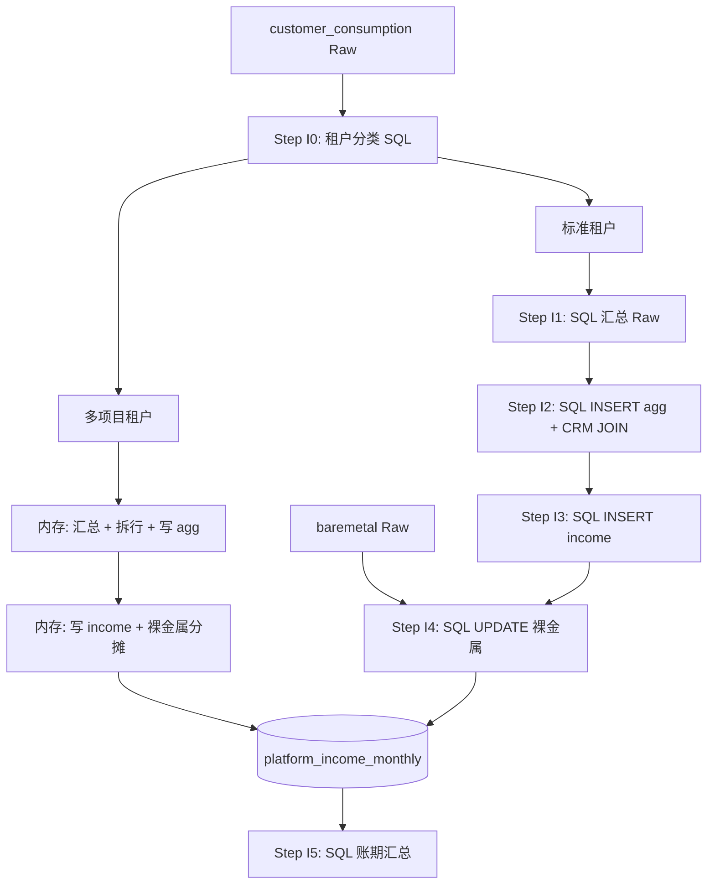

# 收入 SQL 分步计算方案

> 版本：v1.3（草案）  
> 日期：2026-05-24  
> 变更：v1.3 — `platform_income_monthly` 冗余存储项目名称、客户全称；页面/导出只读 income 表，禁止联表  
> 状态：**待评审**  
> 关联：`billing-period-import-design.md` v1.5.4、`packages/db/src/finance-schema.ts`、`compute.ts`  
> 目的：以 **简单 SQL + 少量内存分支** 实现收入计算，兼顾排错与可维护性。

---

## 1. 背景与目标

### 1.1 设计原则（v1.2）

| 原则 | 说明 |
|------|------|
| **主路径 SQL 从简** | 绝大多数租户为 **1 tenant → 1 project → 1 customer**，用 3～4 条直白 `INSERT` / `UPDATE` 完成，避免 `LATERAL`、多层 CTE、拆行比例嵌套 |
| **小概率走内存** | **1 tenant → N projects（N > 1）** 为小概率；拆行与分成在 TypeScript 中处理，逻辑复用现有 `listTenantProjectBindings` / `billing_tenant_cost_allocation` |
| **分步可排错** | 标准路径仍分 Step I1～I4，每步可 `SELECT` 中间表验证；多项目路径单独打日志 |
| **读模型冗余** | 展示用文本（项目名称、客户全称、租户名等）在 **计算时写入** `platform_income_monthly`；列表、详情、Excel 导出 **只查 income 表**，不对 `project` / `customer` 联表 |
| **字段不过度落库** | 仅保留 **计算与展示必需** 的字段；无业务消费的字段不进入 agg / income |

### 1.2 现状与本次变更

**现状**（`compute.ts`）：内存聚合 + 余额取自 tenant_bill + 多项目时 project_name 拼接。

**本次变更**：

| 项 | 变更 |
|----|------|
| 收入余额来源 | 客户消费 Raw 汇总（`balance_consumption`） |
| 主路径实现 | 简单 SQL（标准租户） |
| 多项目租户 | 内存拆行写入 agg / income |
| 收入粒度 | 标准：**每租户一行**；多项目：**每租户×项目多行** |

### 1.3 与 v1.5.4 的关系

本方案 supersede `billing-period-import-design.md` §5.3～§5.4 中：

- 收入 `balance_consumption` 来源（tenant_bill → customer_consumption）；
- 「每租户一行」为主、多项目例外拆行（与 v1.1「全部项目级拆行」不同）。

**不变**：`supplementary` 初始 0、成本 pipeline 仍用 tenant_bill、派生层 DELETE + INSERT。

---

## 2. 租户分类与总体流程

### 2.1 租户分类（Step I0，一条简单 SQL）

计算开始前，按 `project_tenant` 关联数将本账期涉及租户分为两类：

```sql
SELECT
  t.platform_tenant_id,
  COUNT(pt.project_id)::int AS project_count
FROM tenant t
JOIN (
  SELECT DISTINCT r.tenant_platform_id
  FROM billing_period_raw_customer_consumption r
  JOIN billing_period_import_batch b ON b.id = r.batch_id
  WHERE b.billing_period_id = :period_id
) raw_t ON raw_t.tenant_platform_id = t.platform_tenant_id
LEFT JOIN project_tenant pt ON pt.tenant_id = t.id
GROUP BY t.platform_tenant_id;
```

| 分类 | 条件 | 处理方式 |
|------|------|----------|
| **标准租户** | `project_count = 1` | §4 简单 SQL 三步 |
| **多项目租户** | `project_count > 1` | §5 内存拆行 |
| **无项目租户** | `project_count = 0` | 归入标准 SQL 分支：`project_id = NULL`，单行 |

> 说明：一 tenant 对应一 customer 由 CRM 模型保证（`tenant.customer_id`）；标准路径 JOIN `tenant → customer → project_tenant → project` 即可，无需额外拆分 customer。

### 2.2 数据流



**执行顺序**：I0 →（标准 I1～I4 ∥ 多项目 M1～M2）→ I5；同一事务内完成。

---

## 3. 字段必要性：`customer_type` 与 `tenant_type`

### 3.1 `customer_type`（有必要，保留）

| 维度 | 说明 |
|------|------|
| **含义** | 租户类型：标记 B 端 / C 端（Excel「客户类型」） |
| **约束** | 一个 `tenant_platform_id` **只能有一种** `customer_type`；混用 → 导入阻断 |
| **为何需要** | ① 收入表分轨展示（B 端 / C 端报表）；② 成本 pipeline **仅处理 B 端**；③ B 端未知租户校验（`validateCrossFileImports`）；④ `platform_income_monthly.customer_type` 为现有列 |
| **计算中如何处理** | **不做额外变换**：导入时 normalize 为 `B`/`C` → Raw 存原值 → 汇总时 `MIN(customer_type)` 带出（校验保证唯一）→ 写入 agg / income。**无需独立处理步骤** |
| **是否写入 agg** | **是**（原表已有，保留） |
| **是否写入 income** | **是**（原表已有，保留） |

### 3.2 `tenant_type`（收入 pipeline 中不必要，不落 agg/income）

| 维度 | 说明 |
|------|------|
| **含义** | Raw「租户类型」，区分内部 / 外部租户等 |
| **当前使用** | 仅写入 `billing_period_raw_customer_consumption`；**不参与** 收入金额计算、成本计算、UI 展示 |
| **结论** | **收入计算方案中不处理、不扩展落库**；保留在 Raw + `source_raw_ids` 追溯即可 |
| **若将来需要** | 可在报表层从 Raw 关联读取，无需进入 agg / income |

### 3.3 小结

| 字段 | Raw | agg | income | 收入计算是否处理 |
|------|-----|-----|--------|------------------|
| `customer_type` | ✓ | ✓ | ✓ | 校验 + 透传 |
| `tenant_type` | ✓ | ✗ | ✗ | **不处理** |

---

## 4. 标准路径：简单 SQL（1 tenant = 1 project）

以下 SQL 为逻辑伪代码；`:period_id` 为账期 ID；`:standard_tenant_ids` 为 Step I0 中 `project_count IN (0, 1)` 的 `platform_tenant_id` 列表。

### 4.1 Step I1 — 按租户汇总客户消费

**一条 GROUP BY，无子查询嵌套：**

```sql
-- 写入 agg 前先 DELETE 本账期 agg（或由 Step I2 统一 DELETE）
INSERT INTO billing_period_agg_customer_consumption (
  id, billing_period_id, tenant_platform_id, customer_type,
  total_consumption, voucher_consumption, balance_consumption,
  source_raw_ids, row_count_by_type,
  created_at
)
SELECT
  gen_random_uuid()::text,
  :period_id,
  r.tenant_platform_id,
  MIN(r.customer_type),
  SUM(r.total_consumption::numeric),
  SUM(r.voucher_consumption::numeric),
  SUM(r.balance_consumption::numeric),
  jsonb_agg(r.id),
  COUNT(*)::int,
  NOW()
FROM billing_period_raw_customer_consumption r
JOIN billing_period_import_batch b ON b.id = r.batch_id
WHERE b.billing_period_id = :period_id
  AND b.file_type = 'customer_consumption'
GROUP BY r.tenant_platform_id;
```

**导入期校验**（非 SQL 复杂逻辑，沿用现有 import / validate）：

- 同租户多种 `customer_type` → 阻断；
- B 端租户须在 CRM 存在。

### 4.2 Step I2 — 补全 CRM 字段（仅标准租户）

**单条 UPDATE…FROM，1:1 JOIN，无拆行：**

```sql
UPDATE billing_period_agg_customer_consumption a
SET
  tenant_id          = t.id,
  customer_id        = c.id,
  customer_full_name = c.name,
  project_id         = p.id,
  project_name       = p.name,
  allocation_percent = 100
FROM tenant t
JOIN customer c ON c.id = t.customer_id
LEFT JOIN project_tenant pt ON pt.tenant_id = t.id
LEFT JOIN project p ON p.id = pt.project_id
WHERE a.billing_period_id = :period_id
  AND a.tenant_platform_id = t.platform_tenant_id
  AND a.tenant_platform_id = ANY(:standard_tenant_ids);
```

- `project_count = 1`：`project_id` / `project_name` 有值；
- `project_count = 0`：`project_id` / `project_name` 为 NULL。

**不处理** `tenant_type`；**不写入** `product_breakdown`（排错需时可从 Raw 按 `source_raw_ids` 查，避免 agg 膨胀；若强需求可二期加可选列）。

### 4.3 Step I3 — INSERT 收入（余额来自 agg）

```sql
DELETE FROM platform_income_monthly WHERE billing_period_id = :period_id;

INSERT INTO platform_income_monthly (
  id, billing_period_id, customer_type,
  tenant_id, tenant_platform_id, tenant_name,
  customer_id, customer_full_name,
  project_id, project_name,
  supplementary_consumption,
  balance_consumption,
  bare_metal_consumption, total_consumption,
  created_at
)
SELECT
  gen_random_uuid()::text,
  a.billing_period_id,
  a.customer_type,
  a.tenant_id,
  a.tenant_platform_id,
  t.name,                    -- tenant_name（展示）
  a.customer_id,
  a.customer_full_name,      -- 冗余：导出/页面直读
  a.project_id,
  a.project_name,            -- 冗余：导出/页面直读
  0,
  a.balance_consumption,
  0,
  a.balance_consumption,
  NOW()
FROM billing_period_agg_customer_consumption a
JOIN tenant t ON t.id = a.tenant_id
WHERE a.billing_period_id = :period_id
  AND a.tenant_platform_id = ANY(:standard_tenant_ids);
```

多项目租户的 income 行在 §5 内存写入，**不在此 INSERT 中**。

### 4.4 Step I4 — UPDATE 裸金属（标准租户，整笔归属）

标准租户仅一行 income，裸金属 **整笔 UPDATE**，无需比例分摊：

```sql
UPDATE platform_income_monthly i
SET
  bare_metal_consumption = b.m_bare,
  total_consumption = COALESCE(i.supplementary_consumption, 0)
                    + COALESCE(i.balance_consumption, 0)
                    + b.m_bare
FROM (
  SELECT bo.tenant_platform_id, SUM(bo.final_amount::numeric) AS m_bare
  FROM billing_period_raw_baremetal_order bo
  JOIN billing_period_import_batch batch ON batch.id = bo.batch_id
  WHERE batch.billing_period_id = :period_id
  GROUP BY bo.tenant_platform_id
) b
WHERE i.billing_period_id = :period_id
  AND i.tenant_platform_id = b.tenant_platform_id
  AND i.tenant_platform_id = ANY(:standard_tenant_ids);
```

### 4.5 Step I5 — 账期汇总

```sql
UPDATE billing_period bp
SET
  total_income     = sub.total,
  balance_income   = sub.balance,
  baremetal_income = sub.bare,
  supplementary    = sub.supplementary,
  last_computed_at = NOW(),
  status           = 'computed'
FROM (
  SELECT
    SUM(total_consumption::numeric)      AS total,
    SUM(balance_consumption::numeric)    AS balance,
    SUM(bare_metal_consumption::numeric) AS bare,
    SUM(supplementary_consumption::numeric) AS supplementary
  FROM platform_income_monthly
  WHERE billing_period_id = :period_id
) sub
WHERE bp.id = :period_id;
```

---

## 5. 多项目路径：内存处理（小概率）

### 5.1 触发条件

Step I0 判定 `project_count > 1` 的租户进入本路径。

### 5.2 处理步骤（TypeScript）

对每个多项目租户 `t`：

1. **读取租户汇总金额** — 从 Step I1 已写入的 agg 行读取（或按 `tenant_platform_id` 单独 SUM Raw）；
2. **解析项目列表** — `listTenantProjectBindings(periodId)` 或等价查询 `project_tenant`（**含 archived**）；
3. **解析分成比例** — `billing_tenant_cost_allocation`；无配置则均分，末项目吸收尾差；
4. **DELETE** 该租户在 agg 中的单行（I1 插入的未 enriched 行）；
5. **INSERT N 行 agg** — Drizzle `insert().values([...])`，每行带 `project_id`、`allocation_percent`、拆分后金额；
6. **INSERT N 行 income** — 同上；每行须含 **`project_name`、`customer_full_name`、`tenant_name`**（从 bindings / CRM 带出），`supplementary = 0`，`bare = 0` 初值；
7. **分摊裸金属** — 按 `allocation_percent` 计算每行 `bare_metal_consumption`，`update` 或内存算好后 batch insert。

### 5.3 为何用内存而非 SQL

| 原因 | 说明 |
|------|------|
| 发生频率低 | 绝大多数租户走标准 SQL，维护成本更低 |
| 逻辑已存在 | 分成、均分、尾差与成本侧、`enrichment.ts` 同源，避免 SQL 重复 |
| 易排错 | 可对单个租户打 `financeLog`，逐步 inspect 拆行结果 |
| SQL 更简单 | 主路径无 `LATERAL`、无按租户动态拆行 |

### 5.4 伪代码

```typescript
for (const platformId of multiProjectTenantIds) {
  const base = await loadTenantAggRow(periodId, platformId)
  const bindings = await listProjectsWithAllocation(periodId, platformId)
  await deleteAggRow(periodId, platformId)

  const rows = splitAmounts(base, bindings) // balance / voucher / total
  await db.insert(billingPeriodAggCustomerConsumption).values(rows)
  await db.insert(platformIncomeMonthly).values(toIncomeRows(rows))

  const bareTotal = await sumBaremetal(periodId, platformId)
  await applyBaremetalSplit(periodId, platformId, bareTotal, bindings)
}
```

---

## 6. 表结构变更

### 6.1 `billing_period_agg_customer_consumption`

**新增字段**（较 v1.1 **移除 `tenant_type`**）：

| 列名 | 类型 | 说明 |
|------|------|------|
| `tenant_id` | FK → tenant | CRM 租户 |
| `customer_id` | FK → customer | CRM 客户 |
| `customer_full_name` | varchar | 展示 |
| `project_id` | FK → project, nullable | 标准：1 项目；多项目：拆行 |
| `project_name` | varchar, nullable | 展示 |
| `allocation_percent` | numeric(7,4) | 标准：100；多项目：分成 |

**保留**：`customer_type`（§3.1）

**唯一约束**：

```sql
-- 标准租户（每 tenant 一行）
-- 多项目租户（每 tenant × project 一行）
UNIQUE (billing_period_id, tenant_platform_id, project_id)
```

### 6.2 `platform_income_monthly`（读模型：展示字段冗余落库）

收入结果表同时承担 **计算结果** 与 **页面/导出读模型** 职责。展示用文本在 Step I3 / §5 写入后 **不再变更**（除非重算或人工调账更新相关列）。

#### 6.2.1 展示字段（已有列，计算时必须写入）

| 列名 | 来源（计算时） | 用途 |
|------|----------------|------|
| `project_name` | agg.`project_name` ← CRM `project.name` | 页面「项目名称」列；Excel「项目名称」 |
| `customer_full_name` | agg.`customer_full_name` ← CRM `customer.name` | 页面「客户全称」列；Excel「客户全称」 |
| `tenant_name` | CRM `tenant.name` | 租户展示名（已有列） |
| `tenant_platform_id` | Raw / agg | Excel「租户Id」列（已有列） |

> `project_id`、`customer_id` 为 **可选 FK**，便于报表二次分析；**页面与导出不依赖 FK 联表**，只读上表文本列。

#### 6.2.2 与 Excel 导出列对齐

与 `income-detail-export.ts` 字段一一对应，**全部来自 `platform_income_monthly` 单行**：

| Excel 列 | income 表字段 |
|----------|---------------|
| 项目名称 | `project_name` |
| 客户全称 | `customer_full_name`（空时可 fallback `tenant_name`，与现逻辑一致） |
| 租户Id | `tenant_platform_id` |
| 补充消费 | `supplementary_consumption` |
| 余额消费 | `balance_consumption` |
| 线上裸金属消费 | `bare_metal_consumption` |
| 总消费 / 总收入 | `total_consumption` |

#### 6.2.3 新增字段（FK，非展示必需）

| 列名 | 说明 |
|------|------|
| `customer_id` | CRM 客户 ID；可选，供报表 JOIN |
| `project_id` | CRM 项目 ID；与 agg 一致 |

**不新增** `voucher_consumption`（除非 UI 明确需要；默认可从 agg 查）

#### 6.2.4 唯一约束

```sql
UNIQUE (billing_period_id, tenant_id, project_id)
```

`customer_type` 保留列，用于 B/C 筛选；UK 不含（`tenant_id` 与类型一一对应）。

#### 6.2.5 API / 前端约定

- `getBundle`：**仅** `SELECT * FROM platform_income_monthly WHERE billing_period_id = ?`，**禁止** JOIN `project` / `customer` / `tenant` 补全名称；
- 收入列表页、导出：直接使用 bundle 中的 `project_name`、`customer_full_name`；
- 若 CRM 改名，须 **重新计算账期** 后 income 行才会更新（快照语义，与派生层重建原则一致）。

---

## 7. 边界情况

| # | 场景 | 处理 |
|---|------|------|
| E1 | 标准：1 tenant → 1 project | SQL §4 |
| E2 | 多项目 tenant | 内存 §5 |
| E3 | 无 project_tenant | 标准 SQL；`project_id = NULL` |
| E4 | 同租户 B/C 混用 | 导入阻断 |
| E5 | 裸金属有、客户消费无 | 不进收入表；报告 |
| E6 | 多项目无分成 | 均分 + WARN |
| E7 | 重算 | supplementary 重置 0 |

---

## 8. 应用层结构

```
apps/web/src/lib/server/dataaccess/finance/
  compute-income-sql.ts      # I0～I5 标准 SQL
  compute-income-multi.ts    # 多项目内存分支
  compute.ts                 # 编排：标准 SQL + multi + 成本 TS
```

**读路径**（列表 / 详情 / 导出）：

- `billing-periods.getBundle` → 单表查 `platform_income_monthly`，映射 snake_case 返回；
- 前端 `IncomeDetailTable`、`downloadIncomeDetailExcel` 使用 bundle 字段，**不**再请求 CRM 补全项目名/客户名。

---

## 9. 可行性评估（v1.2）

| 维度 | 结论 |
|------|------|
| SQL 复杂度 | **低** — 主路径 4 条直白语句 |
| 可维护性 | **高** — 异常路径隔离在 TS |
| 性能 | **优** — 聚合在 DB；多项目数量少，内存可忽略 |
| 排错 | **高** — 标准/多项目分开验证 |
| 字段精简 | **是** — 去掉 `tenant_type`、可选 `product_breakdown` |

---

## 10. 待评审问题

1. 无 `project_tenant` 时是否 fallback `project.primary_tenant_id`？
2. 多项目路径是否与成本共用同一套 `billing_tenant_cost_allocation`？（本文默认是）
3. agg 是否需要可选 `product_breakdown` JSONB 便于排错？

---

## 11. 修订记录

| 版本 | 日期 | 说明 |
|------|------|------|
| v1.0 | 2026-05-24 | 初稿：SQL 四步、项目拆行、口径调整 |
| v1.1 | 2026-05-24 | `customer_type` 为租户 B/C；按 tenant 汇总 |
| v1.2 | 2026-05-24 | 主路径简单 SQL；多项目改内存；`tenant_type` 不落 agg/income；字段必要性分析 |
| v1.3 | 2026-05-24 | 明确 income 表冗余 `project_name` / `customer_full_name`；页面与导出禁止联表 |
