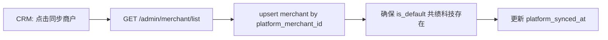
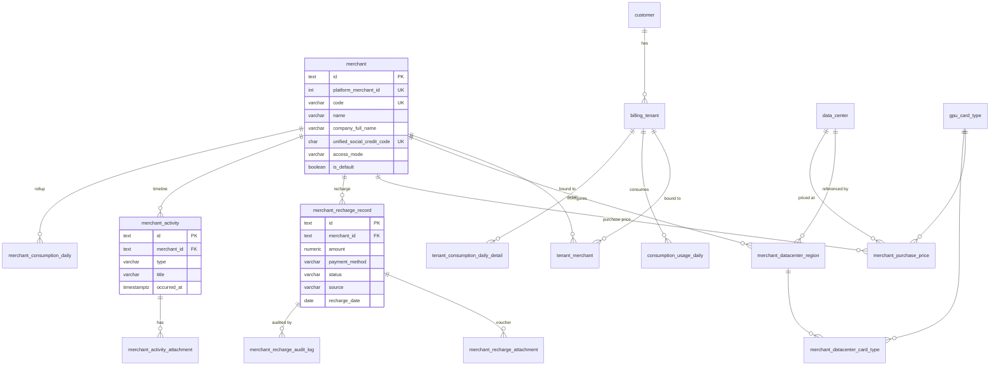

# 商户管理功能设计方案

> **版本**：v1.3.1（设计稿）  
> **日期**：2026-06-10  
> **状态**：**待确认项已闭合 — UI 原型完成，可启动 tRPC / 数据库接入**  
> **关联**：`crm-database.md`（§1.1 Customer/Tenant 规则）、`platform-pricing-design.md`（L1 平台刊例价）、`supplier-database.md`（`data_center` / 机房区域）、`platform-tenant-import-design.md`（平台 `merchant_id`）、`project-tenant-daily-consumption-design.md`（消费明细粒度）、`role-menu-data-access-design.md`（菜单权限）

**文档性质**：商户域逻辑设计（PostgreSQL 风格）；描述实体模型、定价分层、区域配额、充值与活动、消耗追踪与上下游集成。**§8 已与当前前端 Mock 实现对齐**；§9 为 tRPC 接入草案，确认后实施。

---

## 1. 目标与原则

### 1.1 业务目标

| # | 目标 | 说明 |
|---|------|------|
| G1 | **租户关联商户** | 同一计费租户 **可同时关联多个商户**（多对多）；CRM 通过 `tenant_merchant` 维护绑定；至少一条有效绑定 |
| G2 | **默认商户** | 系统内置默认商户 **共绩科技**；历史租户与平台直客均归入该商户 |
| G3 | **机房即区域** | 商户可配置多个 **机房区域**（映射平台 `data_center`），向其下属租户展示为可选算力区域 |
| G4 | **区域差异化定价** | 同一商户在不同机房的 **卡型 × 产品线** 进货价可不同；未配置时 **默认继承平台刊例价** |
| G5 | **区域可用卡量** | 可为商户在各开放区域配置 **可用 GPU 卡数上限**（配额），用于资源开放与风控 |
| G6 | **进货价管理** | 商户从平台 **进货**（平台刊例价为默认基准）；CRM 维护商户侧 **进货价** 主数据 |
| G7 | **消耗可区分** | 商户下属租户消耗 **可追踪、可汇总**；与共绩科技直客消耗 **报表/财务口径分离** |
| G8 | **接入模式** | 商户主体维护 **接入模式**（OEM / API / IFrame），标识与平台集成方式 |
| G9 | **商户充值记录** | CRM 维护 **商户维度** 充值记录（手工录入 + 平台同步）；支持充值凭证附件；操作可审计 |
| G10 | **活动时间线** | 商户详情展示运营活动时间线（系统事件 + 手工评论/附件），交互对齐供应商域 |

### 1.2 非目标（本期）

- **不**在 CRM 实现商户对终端客户的 **二次定价 / 零售价** 管理（终端扣费仍以平台计费引擎为准；本期只管理 **平台→商户** 的进货价）
- **不**替代供应商域 `supplier_unit_cost`（平台→供应商 **成本价**）；商户进货价是 **销售链上一层**，与供应商成本 **无自动联动**
- **不**实现商户自助门户（仅 CRM 管理端 + 平台 OpenAPI 同步）
- **不**改造 Customer / Project 三层经营模型（商户是 **计费域** 维度，Customer 仍为客户主体）
- **不**在一期实现商户间资源转让、跨商户租户迁移
- **不**实现 **`commercial` / 附加商户绑定**（`tenant_merchant.binding_role=commercial` 仅 schema 预留；租户 Tab **只读**展示主绑定，不提供添加/解除附加绑定 UI 与 tRPC）

### 1.3 设计原则

1. **平台 ID 对齐**：`merchant.platform_merchant_id` 与 OpenAPI `merchant_id` 全局 UK；每个 `tenant` 至多一条 **主绑定**（`tenant_merchant.is_primary = true`）与平台租户 `merchant_id` 对齐。
2. **默认共绩**：迁移后所有无绑定记录的历史 `tenant` 插入 `tenant_merchant` → 默认商户「共绩科技」（`is_primary = true`）。
3. **定价继承**：商户进货价 **显式覆盖优先**；无覆盖行时 **只读引用** L1 `platform_card_list_price.sell_price`（语义为平台刊例 = 默认进货价）。
4. **区域引用不复制**：商户区域配置 **FK 引用** `data_center`，不复制机房主数据；展示名可冗余 `data_center.name` / `container_instance_region`。
5. **消耗带商户维度**：计费事实表写入 **`merchant_id`**（取平台账单行 `merchant_id`；**缺省视为 `0`** → 共绩科技）；**禁止**因多对多绑定而对同一笔消耗重复入账。
6. **读写分离**：列表读本地库；商户主数据经 **平台同步** 写入；`tenant_merchant` 经平台同步（主绑定）或管理端维护（附加绑定）。
7. **主体信息完整**：商户须维护 **统一社会信用代码** 与 **公司全称**，用于合同、开票与主体识别。
8. **操作可审计**：商户充值记录的创建/修改写入审计日志；主数据变更、充值等系统事件自动写入活动时间线。
9. **UI 先行、后端对齐**：前端以 Mock 数据验证交互（`merchant-mock.ts`）；tRPC 接入时 **字段名与页面行为以本稿 + 现有组件为准**。

---

## 2. 领域模型

### 2.1 实体关系总览

```text
┌─────────────────────────────────────────────────────────────────────────┐
│  Platform（算算力平台）                                                  │
│  · L1 刊例价 platform_card_list_price                                    │
│  · 物理机房 data_center（供应商域）                                       │
│  · OpenAPI merchant / tenant                                             │
└─────────────────────────────────────────────────────────────────────────┘
         │ 进货（默认=刊例价，可按机房覆盖）                │ 计费 / 消耗
         ▼                                                    ▼
┌──────────────────────┐         * ── *              ┌──────────────────────┐
│  Merchant（商户）     │ ◄──── tenant_merchant ────► │  Tenant（计费租户）   │
│  默认：共绩科技       │      （多对多绑定）          │  归属 1 Customer     │
└──────────────────────┘                              └──────────────────────┘
         │ 1                    │ 1
         │ *                    │ *
         ▼                      ▼
┌──────────────────────────┐  ┌──────────────────────────────────────────────┐
│ MerchantDatacenterRegion │  │ MerchantRechargeRecord（商户充值）              │
│ · 区域 / 配额 / 卡型      │  │ · 金额 / 支付方式 / 凭证附件 / 审计日志         │
│ · 嵌套进货价              │  └──────────────────────────────────────────────┘
└──────────────────────────┘              │ 1
         │                                │ *
         │                                ▼
         │                    ┌──────────────────────────────────────────────┐
         │                    │ MerchantActivity（活动时间线）                  │
         │                    │ · 系统事件 + 评论/附件；对齐 supplier_activity  │
         └────────────────────┴──────────────────────────────────────────────┘
```

### 2.2 与现有 CRM 三层模型的关系

| 实体 | 层级 | 与商户关系 |
|------|------|------------|
| **Customer** | 经营客户主体 | 无直接 FK；经下属 `tenant` → `tenant_merchant` 间接关联商户 |
| **Project** | 经营项目 | 无变化；商户维度报表通过关联租户的 `tenant_merchant` 解析 |
| **Tenant** | 平台计费租户 | **不**在 `tenant` 表存 `merchant_id`；经 **`tenant_merchant`** 多对多关联 |
| **Merchant** | 计费域新增 | 平台分销/转售主体；共绩科技 = 平台自营 |

**不变量（新增 R7）**：

| 规则 | 说明 |
|------|------|
| **R7.1 租户至少一商户** | 每个 `tenant` 至少一条 **有效** `tenant_merchant`（`effective_to IS NULL`）；新建/导入时若无指定则默认绑定共绩科技 |
| **R7.2 主绑定唯一** | 每个 `tenant` **至多一条** `is_primary = true` 且有效的绑定；与平台 OpenAPI 租户 `merchant_id` 对齐的必须是 **主绑定** |
| **R7.3 平台 merchant 一致** | 平台 `merchant_id` 变更时 **更新/新建主绑定**；与本地主绑定 `merchant.platform_merchant_id` 不一致 → 写入 `merchant_sync_issue`，不静默改附加绑定 |
| **R7.4 多绑不重复计费** | 同一笔平台账单 / 消费明细 **只归属一个** `merchant_id`（来自平台账单行；见 §6.3 **已确认** 规则） |
| **R7.5 计费事实带商户** | `consumption_usage_daily`、`tenant_consumption_daily_detail`、`tenant_bill` 等 **必须** 冗余 `merchant_id`（写入规则见 §6.3） |
| **R7.6 共绩消耗分离** | 报表默认维度 `merchant_id`；`platform_merchant_id = 0` / `merchant.code = 'gongji'` = 平台直客（共绩科技）；其它 = 分销口径 |
| **R7.7 平台 ID 缺省** | 平台任意 API / 账单行 **未带** `merchant_id` 时，CRM **视为 `0`**，映射默认商户共绩科技（**不**再 fallback 到租户主绑定） |

### 2.3 默认商户「共绩科技」

| 项 | 值 |
|----|-----|
| 逻辑标识 | `merchant.code = 'gongji'`（UK） |
| 展示名 `name` | `共绩科技`（简称，列表/侧栏用） |
| 公司全称 `company_full_name` | 工商注册全称（如「共绩（上海）科技有限公司」，seed 时填写） |
| 统一社会信用代码 `unified_social_credit_code` | 18 位 USCC（seed 时填写；UK，见 §5.1） |
| `platform_merchant_id` | **`0`（固定）** — 平台侧默认/主商户 ID；seed 与迁移 **必须** 写入此值 |
| `is_default` | `true`（全局至多一条） |
| `type` | `platform_direct`（平台直营） |
| `access_mode` | `oem` |
| 历史数据 | 所有现有 `tenant` 在 migration 中 `INSERT tenant_merchant (tenant_id, merchant_id=<共绩.id>, is_primary=true)` |

---

## 3. 定价分层（商户进货价）

在 `platform-pricing-design.md` L1/L2 之上，新增 **L3 商户进货价**：

```text
┌─────────────────────────────────────────────────────────────────────────┐
│  L1 平台刊例价（Platform Catalog Price）— 已有                            │
│  粒度：gpu_card_type × product_line × billing_unit                        │
│  语义：面向客户的平台标准价；**同时作为商户默认进货价**                      │
└─────────────────────────────────────────────────────────────────────────┘
                                    │
                                    │ 默认继承；可按机房覆盖
                                    ▼
┌─────────────────────────────────────────────────────────────────────────┐
│  L3 商户机房进货价（Merchant Purchase Price）— 本期新增                   │
│  粒度：merchant × data_center × gpu_card_type × product_line             │
│         [× billing_unit]                                                  │
│  语义：**平台向商户结算的进货单价**（元/卡/单位）                           │
│  管理者：平台运营 / 商务（CRM 管理端）                                     │
└─────────────────────────────────────────────────────────────────────────┘

（L2 供应商机房销售/成本价 — 已有，与 L3 独立，见 platform-pricing-design.md）
```

| 层级 | 价格类型 | 用途 | 默认来源 |
|------|----------|------|----------|
| L1 | 平台刊例（销售） | 客户标准价、**商户默认进货价** | 人工维护 |
| L2 | 机房销售/成本 | 供应商结算、平台扣费基准 | 供应商商务 |
| **L3** | **商户进货价** | 平台→商户结算、商户毛利核算 | **L1 刊例价** |

**产品线 / 租期单位**：与 `platform-pricing-design.md` §2 完全一致（`elastic_service`、`cloud_vm`、`bare_metal`、`job`、`spot`；裸金属 `hour/day/week/month`）。

**解析规则（读路径）**：

```text
effective_purchase_price(merchant, dc, card, pl, unit) =
  merchant_purchase_price 显式 active 行
  ?? platform_card_list_price 当前 active 行（L1 刊例）
  ?? NULL（未配置，UI 标红，同步阻塞可选）
```

---

## 4. 商户机房区域与可用卡量

### 4.1 概念

- **机房区域**：对商户租户可见的算力区域 = 平台 `data_center` 经商户配置后的 **子集**。
- **展示名**：优先 `data_center.container_instance_region`（容器区域码），辅以 `data_center.name`、`region_tags`。
- **开放区域**：仅 `status = open` 的区域对商户租户可选；`closed` / `maintenance` 在 CRM 可配但不对租户开放。

### 4.2 可用卡数量（配额）

| 字段 | 说明 |
|------|------|
| `available_gpu_quota` | 商户在该区域 **可售/可用 GPU 卡数上限**（整数） |
| `used_gpu_count` | **读模型**：平台 `gpu_usage` 或 CRM 设备台账按商户+区域汇总（可选缓存表） |
| `remaining_gpu_count` | 见下方 **配额语义（已确认）** |

**配额语义（已确认 Q4）**：

| `available_gpu_quota` 值 | 含义 | UI 展示 |
|--------------------------|------|---------|
| **`0`** | **不可用** — 该区域对该商户关闭售卖（即使 `status=open` 也应在平台侧拦截） | 配额 0 / 不可用 |
| **`> 0`** | 有限上限 | `used / quota`、进度条 |
| **`-1`** | **不限制** | 展示「不限」、隐藏进度条上限 |

```text
remaining_gpu_count =
  quota = -1  → NULL（语义：不限）
  quota ≥ 0   → max(0, available_gpu_quota - used_gpu_count)
```

> **与 UI Mock 差异**：Mock 层暂用 `null` 表示「不限」；接入 tRPC / DB 时统一为 **`-1`**。

**口径建议**：

- **配额来源**：商务合同或平台运营手工配置；**不**自动等于机房物理 GPU 总量。
- **已用量**：首期从平台 OpenAPI 按 `merchant_id` + `region` 拉取；二期可与 CRM `supplier_device` 交叉校验（参考 `supplier-overview` 区域统计）。
- **超限策略**（平台侧实现，CRM 仅展示）：租户下单时平台校验；CRM 可展示 **配额使用率** 告警。

### 4.3 启用卡型

每个商户区域可配置 **启用卡型白名单**（`merchant_datacenter_card_type`）：

- 未配置：默认继承该平台机房已上架的全部 active 卡型（与 L2 销售价 `config_status = active` 交集）。
- 已配置：仅白名单内卡型对该商户租户可见；进货价按 L3 解析。

---

## 5. 数据模型

### 5.1 `merchant`（商户主数据）

| 列名 | 类型 | 约束 | 说明 |
|------|------|------|------|
| `id` | text | PK | |
| `platform_merchant_id` | integer | UK, NOT NULL | OpenAPI `merchant_id` |
| `code` | varchar(64) | UK, NOT NULL | 稳定业务码，如 `gongji` |
| `name` | varchar(255) | NOT NULL | **展示简称**（列表、侧栏；可与公司全称不同） |
| `company_full_name` | varchar(512) | NOT NULL | **商户公司全称**（工商注册名称；合同/开票主体） |
| `unified_social_credit_code` | char(18) | UK, NOT NULL | **统一社会信用代码**（18 位；入库前校验格式与校验位） |
| `merchant_mark` | varchar(128) | 可空 | 平台 `merchant_mark` |
| `access_mode` | varchar(16) | NOT NULL | **接入模式**：`oem` / `api` / `iframe` |
| `type` | varchar(32) | NOT NULL | `platform_direct` / `partner` |
| `is_default` | boolean | NOT NULL DEFAULT false | 默认商户标记 |
| `status` | varchar(32) | NOT NULL | `active` / `inactive` / `suspended` |
| `contact_user` | varchar(128) | 可空 | |
| `contact_phone` | varchar(32) | 可空 | |
| `remark` | text | 可空 | |
| `platform_synced_at` | timestamptz | 可空 | 最近一次主数据同步 |
| `created_at` / `updated_at` | timestamptz | NOT NULL | |

**部分唯一索引**：`UNIQUE (is_default) WHERE is_default = true`（至多一个默认商户）。

**索引**：`(status)`、`(name)`、`(company_full_name)`。

**字段说明**：

| 字段 | 规则 |
|------|------|
| `company_full_name` | 创建/编辑商户时 **必填**；平台同步若仅有简称，写入 `name`，`company_full_name` 需人工补全或从平台扩展字段映射（联调确认） |
| `unified_social_credit_code` | 创建时 **必填**；格式 `^[0-9A-Z]{18}$`（国标 GB 32100）；同一 USCC 全局不可重复 |
| `name` vs `company_full_name` | `name` 用于 UI 短名；报表导出、合同附件使用 `company_full_name` |
| `access_mode` | CRM **可编辑**；平台同步 **不覆盖**（商务维护）；枚举见 §8.2 |

**接入模式枚举**：

| 值 | 展示 | 说明 |
|----|------|------|
| `oem` | OEM | 白标 / OEM 嵌入集成 |
| `api` | API | OpenAPI 对接 |
| `iframe` | IFrame | iframe 嵌入平台控制台 |

**CRM 可编辑 vs 平台同步字段**（概览页编辑弹窗）：

| 可编辑 | 只读（平台同步） |
|--------|------------------|
| `name`、`company_full_name`、`unified_social_credit_code`、`merchant_mark`、`access_mode`、`type`、`status`、`contact_user`、`contact_phone`、`remark` | `code`、`platform_merchant_id`、`platform_synced_at`、`is_default` |

编辑成功后写入 `merchant_activity`（`type=info_updated`）。

### 5.2 `tenant_merchant`（租户 ↔ 商户 多对多绑定）

对应 CRM 中 `project_tenant` 的绑定模式；**不在 `tenant` 表存 `merchant_id`**。

| 列名 | 类型 | 约束 | 说明 |
|------|------|------|------|
| `id` | text | PK | |
| `tenant_id` | text | FK→tenant, NOT NULL | |
| `merchant_id` | text | FK→merchant, NOT NULL | |
| `is_primary` | boolean | NOT NULL DEFAULT false | **主绑定**；与平台 `merchant_id` 对齐 |
| `binding_role` | varchar(32) | NOT NULL | `platform_primary` / `commercial` / `historical` |
| `effective_from` | date | NOT NULL | 绑定生效日 |
| `effective_to` | date | 可空 | NULL = 当前有效 |
| `remark` | text | 可空 | |
| `created_by_staff_id` | text | FK→user_staff | |
| `created_at` / `updated_at` | timestamptz | NOT NULL | |

**唯一约束**：

```sql
UNIQUE (tenant_id, merchant_id) WHERE effective_to IS NULL
UNIQUE (tenant_id) WHERE is_primary = true AND effective_to IS NULL
```

**索引**：`(merchant_id)`、`(tenant_id)`、`(tenant_id, is_primary)`。

**绑定语义**：

| `binding_role` | 说明 |
|----------------|------|
| `platform_primary` | 与算算力平台租户 `merchant_id` 一致的主绑定；平台同步 **仅维护此条** |
| `commercial` | CRM 手工添加的 **附加** 商户关联（**非**平台 `merchant_id` 对齐；不参与账单 `merchant_id` 解析；仅 CRM 经营/报表视图，见 §13 Q3 说明） |
| `historical` | 已失效或迁移保留的历史绑定（通常配合 `effective_to`） |

**读路径约定**：

- 租户详情「关联商户」：查 `tenant_merchant WHERE tenant_id = ? AND effective_to IS NULL`
- 商户详情「关联租户」：查 `tenant_merchant WHERE merchant_id = ? AND effective_to IS NULL`
- 平台同步对齐：upsert `platform_primary` + `is_primary = true`

### 5.3 `merchant_datacenter_region`（商户机房区域）

| 列名 | 类型 | 约束 | 说明 |
|------|------|------|------|
| `id` | text | PK | |
| `merchant_id` | text | FK→merchant, NOT NULL | |
| `data_center_id` | text | FK→data_center, NOT NULL | 引用供应链机房 |
| `display_name` | varchar(255) | 可空 | 覆盖展示名；空则用机房名 |
| `region_code` | varchar(128) | NOT NULL | 冗余 `container_instance_region` 或 `code`，供平台 API 对齐 |
| `status` | varchar(32) | NOT NULL | `open` / `closed` / `maintenance` |
| `available_gpu_quota` | integer | NOT NULL DEFAULT 0 | 可用卡数上限；**`0`=不可用，`−1`=不限制**，正整数=有限配额 |
| `sort_order` | integer | NOT NULL DEFAULT 0 | 租户控制台排序 |
| `effective_from` | date | NOT NULL | |
| `effective_to` | date | 可空 | NULL = 当前有效 |
| `updated_by_staff_id` | text | FK→user_staff | |
| `created_at` / `updated_at` | timestamptz | NOT NULL | |

**唯一约束**：`UNIQUE (merchant_id, data_center_id) WHERE effective_to IS NULL`。

**索引**：`(merchant_id, status)`、`(data_center_id)`。

### 5.4 `merchant_datacenter_card_type`（区域启用卡型）

| 列名 | 类型 | 约束 | 说明 |
|------|------|------|------|
| `id` | text | PK | |
| `merchant_datacenter_region_id` | text | FK→merchant_datacenter_region, NOT NULL | |
| `gpu_card_type_id` | text | FK→gpu_card_type, NOT NULL | |
| `status` | varchar(32) | NOT NULL | `enabled` / `disabled` |
| `created_at` / `updated_at` | timestamptz | NOT NULL | |

**唯一约束**：`UNIQUE (merchant_datacenter_region_id, gpu_card_type_id)`。

### 5.5 `merchant_purchase_price`（商户进货价 — 版本化）

| 列名 | 类型 | 约束 | 说明 |
|------|------|------|------|
| `id` | text | PK | |
| `merchant_id` | text | FK→merchant, NOT NULL | |
| `data_center_id` | text | FK→data_center, NOT NULL | |
| `gpu_card_type_id` | text | FK→gpu_card_type, NOT NULL | |
| `product_line` | varchar(32) | NOT NULL | §3 枚举 |
| `billing_unit` | varchar(16) | NOT NULL DEFAULT `hour` | |
| `purchase_price` | numeric(15,4) | NOT NULL | **进货单价** |
| `currency` | varchar(8) | NOT NULL DEFAULT `CNY` | |
| `source` | varchar(32) | NOT NULL | `manual` / `inherit_l1` / `platform_sync` |
| `platform_list_price_id` | text | FK→platform_card_list_price, 可空 | 继承溯源 |
| `effective_from` | date | NOT NULL | |
| `effective_to` | date | 可空 | |
| `status` | varchar(32) | NOT NULL | `draft` / `active` / `archived` |
| `remark` | text | 可空 | |
| `updated_by_staff_id` | text | FK→user_staff | |
| `created_at` / `updated_at` | timestamptz | NOT NULL | |

**部分唯一**：

```sql
UNIQUE (merchant_id, data_center_id, gpu_card_type_id, product_line, billing_unit)
  WHERE effective_to IS NULL AND status = 'active'
```

### 5.6 `merchant_purchase_price_record`（当前进货价读模型）

结构与 `platform_card_price_record` 对称，UK：`(merchant_id, data_center_id, gpu_card_type_id, product_line, billing_unit)`；便于列表页 JOIN。

### 5.7 `merchant_recharge_record`（商户充值记录）

> **与租户级 `recharge` 区分**：`recharge` 表记录 **计费租户** 在算算力平台的充值流水；本表记录 **商户主体** 在 CRM 维度的预充值/打款记录。**不关联** `tenant_id`（已确认 Q8）。

| 列名 | 类型 | 约束 | 说明 |
|------|------|------|------|
| `id` | text | PK | |
| `merchant_id` | text | FK→merchant, NOT NULL | |
| `amount` | numeric(15,4) | NOT NULL | 充值金额（元） |
| `payment_method` | varchar(32) | NOT NULL | 银行转账 / 支付宝 / 微信 / 发票 等 |
| `status` | varchar(32) | NOT NULL | `pending` / `completed` / `cancelled` |
| `transaction_id` | varchar(128) | 可空 | 交易流水号 |
| `recharge_date` | date | NOT NULL | 充值日期（业务日） |
| `remark` | text | 可空 | |
| `source` | varchar(32) | NOT NULL | `manual`（CRM 手工录入，**当前唯一来源**）/ `platform_sync`（**平台 API 预留**，见 §7.4） |
| `completed_at` | timestamptz | 可空 | 完成时间 |
| `created_by_staff_id` | text | FK→user_staff | 手工录入操作人 |
| `updated_by_staff_id` | text | FK→user_staff | 最后修改人 |
| `created_at` / `updated_at` | timestamptz | NOT NULL | |

**索引**：`(merchant_id, recharge_date DESC)`、`(merchant_id, status)`。

**业务规则**（与 UI 原型一致）：

| 规则 | 说明 |
|------|------|
| R-R1 手工必填凭证 | `source=manual` **创建**时至少 1 个凭证附件 |
| R-R2 手工保留凭证 | `source=manual` **编辑**后仍须至少 1 个凭证 |
| R-R3 平台同步 | `source=platform_sync` 由 OpenAPI 写入；凭证可选；CRM 可改备注/状态 |
| R-R4 审计 | 每次 create / update 写入 `merchant_recharge_audit_log` |

### 5.8 `merchant_recharge_attachment`（充值凭证）

| 列名 | 类型 | 约束 | 说明 |
|------|------|------|------|
| `id` | text | PK | |
| `recharge_id` | text | FK→merchant_recharge_record, NOT NULL | ON DELETE CASCADE |
| `file_name` | varchar(255) | NOT NULL | 原始文件名 |
| `mime_type` | varchar(128) | NOT NULL | |
| `file_size` | bigint | NOT NULL | 字节 |
| `storage_uri` | varchar(1024) | NOT NULL | 对象存储 URI（**与 `supplier_activity_attachment` 同桶、同 SDK**，已确认 Q9） |
| `uploaded_by_staff_id` | text | FK→user_staff | |
| `created_at` | timestamptz | NOT NULL | |

**上传约束**（UI 已实现）：

- 格式：**图片**（JPEG / PNG / GIF / WebP）+ **PDF**
- 数量：每条充值记录 **最多 5 个** 附件
- 单文件：**最大 20MB**

**索引**：`(recharge_id)`。

### 5.9 `merchant_recharge_audit_log`（充值操作审计）

| 列名 | 类型 | 约束 | 说明 |
|------|------|------|------|
| `id` | text | PK | |
| `recharge_id` | text | FK→merchant_recharge_record, NOT NULL | |
| `merchant_id` | text | FK→merchant, NOT NULL | 冗余，便于按商户查最近审计 |
| `action` | varchar(16) | NOT NULL | `create` / `update` |
| `operator_staff_id` | text | FK→user_staff | |
| `operator_name` | varchar(128) | NOT NULL | 冗余展示名 |
| `occurred_at` | timestamptz | NOT NULL | |
| `changes` | jsonb | 可空 | 字段级 diff：`{ field: { from, to } }` |
| `remark` | text | 可空 | |

**索引**：`(recharge_id, occurred_at DESC)`、`(merchant_id, occurred_at DESC)`。

### 5.10 `merchant_activity`（活动时间线）

对齐供应商域 `supplier_activity`（见 `supply-schema.ts`）；记录 **系统事件** 与 **运营评论**。

| 列名 | 类型 | 约束 | 说明 |
|------|------|------|------|
| `id` | text | PK | |
| `merchant_id` | text | FK→merchant, NOT NULL | ON DELETE CASCADE |
| `type` | varchar(64) | NOT NULL | 见下表 |
| `title` | varchar(255) | NOT NULL | |
| `description` | text | 可空 | |
| `author_staff_id` | text | FK→user_staff | 系统事件可空 |
| `author_name` | varchar(128) | NOT NULL | |
| `author_role` | varchar(32) | NOT NULL | `staff` / `system` |
| `ref_domain` | varchar(64) | 可空 | 关联域，如 `recharge` / `region` |
| `ref_id` | text | 可空 | 关联实体 ID |
| `metadata` | jsonb | 可空 | 扩展 payload |
| `occurred_at` | timestamptz | NOT NULL | |
| `created_at` | timestamptz | NOT NULL | |

**`type` 枚举**（与前端 `MerchantActivityType` 一致）：

| type | 触发场景 |
|------|----------|
| `info_updated` | 概览页编辑商户基本信息 |
| `recharge_created` | 新增充值记录 |
| `recharge_updated` | 修改充值记录 |
| `region_added` | 添加机房区域（二期接入写库时触发） |
| `platform_sync` | 平台主数据同步 |
| `status_changed` | 状态变更（可选，与 info_updated 合并亦可） |
| `comment` | 运营手工评论（含评论+附件） |
| `file` | 仅上传附件、无评论正文 |

**索引**：`(merchant_id, occurred_at DESC)`、`(ref_domain, ref_id)`。

### 5.11 `merchant_activity_attachment`（活动附件）

| 列名 | 类型 | 约束 | 说明 |
|------|------|------|------|
| `id` | text | PK | |
| `activity_id` | text | FK→merchant_activity, NOT NULL | ON DELETE CASCADE |
| `file_name` | varchar(255) | NOT NULL | |
| `file_size` | bigint | 可空 | |
| `mime_type` | varchar(128) | 可空 | |
| `storage_uri` | varchar(1024) | NOT NULL | 与 `supplier_activity_attachment` 同桶（Q9） |

**上传约束**：与供应商活动面板一致 — 最多 **5** 个文件，单文件 **20MB**（`supplier-activity-panel.tsx`）。

### 5.12 现有表扩展

#### `tenant` — **无新增 merchant 列**

商户关联 **仅** 通过 `tenant_merchant` 维护，保持 `tenant` 表与 `crm-database.md` R1/R3 不变。

#### 计费事实表扩展（冗余 `merchant_id`）

| 表 | `merchant_id` 写入规则 |
|----|------------------------|
| `consumption_usage_daily` | 平台日账单行 `merchant_id`（缺省 **0**）→ 映射本地 `merchant.id` |
| `tenant_consumption_daily_detail` | 同上 |
| `tenant_bill` / `tenant_bill_detail` | 月账单同步；同上 |
| `recharge` | 租户充值同步；同上（租户级表，与 `merchant_recharge_record` 独立） |
| `consumption_record` | 明细写入；同上 |

**索引建议**：各表 `(merchant_id, usage_date)` 或 `(merchant_id, bill_month)`；保留 `(tenant_id, …)` 索引不变。

#### `merchant_gpu_usage_snapshot`（可选读模型，二期）

| 列名 | 说明 |
|------|------|
| `merchant_id` | |
| `region_code` | |
| `snapshot_at` | |
| `used_gpu_count` | 平台已用量 |
| `available_gpu_quota` | 冗余配额 |

---

## 6. 消耗追踪与共绩分离

### 6.1 追踪维度

| 维度 | 字段 | 用途 |
|------|------|------|
| 商户 | `merchant_id` | **与共绩分离的主维度** |
| 租户 | `tenant_id` | 下钻到具体计费账户 |
| 客户 | `customer_id` | CRM 经营视图 |
| 机房×卡型 | `data_center_*` / `gpu_card_type_*` | 明细级（已有 `tenant_consumption_daily_detail`） |
| 产品线 | `product_line` | 日/月汇总 |

### 6.2 报表口径

| 报表 | 过滤 | 说明 |
|------|------|------|
| **平台总消耗** | 全部商户 | Admin 全局看板 |
| **共绩直客消耗** | `platform_merchant_id = 0` 或 `merchant.is_default = true` 或 `merchant.code = 'gongji'` | 平台自营 |
| **分销商户消耗** | 其它 `platform_merchant_id` | 合作伙伴；**不进入财务月结（二期再议，已确认 Q7）** |
| **单商户消耗** | `merchant_id = ?` | 商户详情页 |
| **商户毛利（二期）** | 租户实付 − 商户进货成本 | 需 L3 价 × 卡时 |

### 6.3 同步与幂等

平台 OpenAPI 已具备：

| API | 用途 |
|-----|------|
| `GET /admin/merchant/list` | 商户主数据同步 |
| `GET /admin/merchant/list_id_merchant_mark` | ID / mark 映射 |
| `GET /admin/merchant/billing_pod_record_list` | 商户维度账单（可与租户账单交叉） |
| 租户 API `merchant_id` 字段 | 租户归属校验 |

**同步规则（已确认 Q1 / Q2）**：

1. **平台 `merchant_id` 解析**：
   - 账单 / 消费明细 **通常带** `merchant_id` → 按 `merchant.platform_merchant_id` 映射本地 `merchant.id` 写入事实表。
   - **未带** `merchant_id` → **视为 `0`** → 映射默认商户「共绩科技」（`platform_merchant_id = 0`）。
   - **不再** 使用租户 `tenant_merchant.is_primary` 作为账单归属 fallback（与旧稿不同）。
2. 平台租户 `merchant_id` 变更 → **仅 upsert 主绑定**（`platform_primary`）；`commercial` 附加绑定 **不自动删除**。
3. 主绑定与平台 `merchant_id` 不一致（且平台值 ≠ 0 映射结果）→ 写入 `merchant_sync_issue`；附加绑定冲突 **不阻塞** 同步。
4. 商户维度汇总：按事实表 **`merchant_id`** GROUP BY 写入 `merchant_consumption_daily`（不对多绑做 JOIN 展开）。
5. **分销商户消耗**：CRM 商户消耗报表 **先行**；**不** 进入 `billing-period-import` 财务月结流水线（**二期**，Q7）。

### 6.4 逻辑表：`merchant_consumption_daily`（商户日汇总）

| 列名 | 类型 | 说明 |
|------|------|------|
| `id` | text | PK |
| `merchant_id` | text | FK |
| `usage_date` | date | |
| `usage_month` | varchar(7) | |
| `product_line` | varchar(64) | |
| `tenant_count` | integer | 当日有消耗租户数 |
| `amount` | numeric(15,4) | 总消费 |
| `voucher_amount` | numeric(15,4) | 券消费 |
| `balance_amount` | numeric(15,4) | 实付 |
| `total_card_hours` | numeric(15,4) | |
| `source` | varchar(32) | `rollup_from_tenant` |

**UK**：`(merchant_id, usage_date, product_line)`。

---

## 7. 平台集成

### 7.1 商户主数据同步



| 平台字段 | 本地列 | 说明（已确认 Q5） |
|----------|--------|-------------------|
| `id` | `platform_merchant_id` | 共绩科技固定 **`0`**（Q1） |
| `merchant_mark` | `merchant_mark` | 若有则映射 |
| 名称类字段 | `name` | 平台 **仅返回简称类字段**；**不返回** USCC / 公司全称 |
| — | `company_full_name`、`unified_social_credit_code` | **CRM 手工必填**（创建/编辑） |
| — | `access_mode` | **CRM 专属**，不同步 |

### 7.2 租户导入扩展（相对 platform-tenant-import-design.md）

| 变更 | 说明 |
|------|------|
| **入库 `tenant_merchant`** | 平台 `merchant_id`（缺省 **按 0 处理**）→ 查 `merchant.platform_merchant_id` → upsert **主绑定**（`is_primary=true`, `binding_role=platform_primary`） |
| 附加绑定 | 预览/详情页可展示 CRM 已有 `commercial` 绑定；导入 **不覆盖** 附加绑定 |
| 缺失映射 | 若 `merchant_id ≠ 0` 且本地不存在 → preview 告警；commit **拒绝**。**`0` 必须** 存在（共绩 seed） |
| 多商户场景 | 同一 `platform_tenant_id` 可在 CRM 关联多个商户；仅 **一条** `is_primary` 与平台 `merchant_id`（含 0）对齐 |

### 7.4 商户充值同步（预留 — 已确认 Q10）

| 项 | 结论 |
|----|------|
| 当前 | 平台 **暂未提供** 商户充值 OpenAPI；CRM **仅** `source = manual` 手工录入 |
| 后续 | 平台提供接口后 → `source = platform_sync` 写入；与手工记录 **并存**，以 `transaction_id` 幂等 |
| 凭证 | 平台若返回凭证 URL → 落 `merchant_recharge_attachment`；否则 CRM 可补传 |

---

### 7.5 区域配额与平台

CRM 维护 `available_gpu_quota`（`0` / `-1` / 正整数，见 §4.2）后，**需平台侧 API 下发** 方能在租户控制台生效。本期 CRM 为 **配置源 + 对账**；若平台暂无写 API，则 CRM 仅文档化手工配置流程。

## 8. 功能与页面

### 8.0 实现状态（2026-06-10）

| 层级 | 状态 | 说明 |
|------|------|------|
| **UI 原型** | ✅ 已完成 | `apps/web/src/app/[locale]/(protected)/merchant/**` + `_components/*` |
| **Mock 数据** | ✅ 已完成 | `apps/web/src/lib/data/merchant-mock.ts`、`lib/types/merchant.ts` |
| **tRPC / DB** | ⏳ 可启动 | §13 已确认；按 §9 实施 |

**Mock 层约定**：页面内 CRUD 直接 mutate 内存数组；刷新页面重置。接入 tRPC 后组件 props / 回调改为 mutation + invalidate。

### 8.1 路由规划

| 路由 | 页面 | 权限 | 主要能力 | Mock 组件 |
|------|------|------|----------|-----------|
| `/merchant` | 商户列表 | admin | 搜索、统计卡片、同步平台（占位）、跳转详情 | `merchant-list-content.tsx` |
| `/merchant/[id]` | 商户概览 | admin | 基本信息（含接入模式）、编辑弹窗、消耗概览、快捷入口、**活动时间线** | `merchant-detail-content.tsx`、`merchant-activity-panel.tsx` |
| `/merchant/[id]/tenants` | 关联租户 | admin | 多对多绑定列表、主绑定标记 | `merchant-tenants-content.tsx` |
| `/merchant/[id]/regions` | 机房区域 | admin | 左侧区域列表 + 右侧详情；添加区域；配置进货价入口 | `merchant-regions-content.tsx` |
| `/merchant/[id]/pricing` | 进货价 | admin | 按商户列出 active 进货价条目 | `merchant-pricing-content.tsx` |
| `/merchant/[id]/recharge` | **充值记录** | admin | 充值列表、新增/编辑、凭证上传、审计日志 | `merchant-recharge-content.tsx` |
| `/merchant/[id]/consumption` | 消耗 | admin | 日消耗明细与汇总 | `merchant-consumption-content.tsx` |

**详情 Tab 导航**（`merchant-detail-nav.tsx`）：概览 → 关联租户 → 机房区域 → 进货价 → **充值记录** → 消耗。

**菜单**：侧栏 **商户管理**（admin only，与财务管理同级）。

### 8.2 商户列表

| 列 | 说明 |
|----|------|
| 简称 / code | `name`、`code`；默认商户 Badge |
| 公司全称 | `company_full_name` |
| 统一社会信用代码 | `unified_social_credit_code` |
| 平台 ID | `platform_merchant_id` |
| 类型 | 平台直营 / 合作伙伴 |
| **接入模式** | OEM / API / IFrame |
| 关联租户数 | COUNT `tenant_merchant` WHERE effective_to IS NULL |
| 开放区域数 | COUNT region WHERE status=open |
| 本月消耗 | SUM merchant_consumption_daily |
| 状态 | active / inactive / suspended |
| 操作 | 详情 |

**顶栏操作**：同步平台（Mock toast）、新建商户（占位 toast）。

**创建/编辑**：

- **概览页**：「编辑」按钮 → `MerchantEditDialog`（已实现）
- **列表页新建**：待 tRPC 接入后实现完整表单
- **必填**（编辑弹窗）：`name`、`company_full_name`、`unified_social_credit_code`（18 位格式校验）

### 8.3 商户概览

| 区块 | 内容 |
|------|------|
| 基本信息卡片 | 展示简称、公司全称、USCC、Code、平台 ID、Merchant Mark、**接入模式**、类型、状态、联系人、电话、最近同步、备注；右上角 **编辑** |
| 本月消耗概览 | 总消费 / 算力券 / 实付 / 关联租户数；跳转消耗页 |
| 快捷卡片 | 关联租户、机房区域、进货价条目计数 |
| **活动时间线** | 见 §8.8 |

### 8.4 机房区域配置 UI

**布局**：左侧商户已开放区域列表；右侧区域详情（`merchant-regions-content.tsx`）。

| 区块 | 字段 / 行为 |
|------|-------------|
| 添加 | `MerchantAddRegionDialog` — 仅可从 **平台已有机房**（`data_center`）中选择；配额 **`0`/`-1`/正整数**（§4.2） |
| 基础 | 展示名、状态、区域码、生效开始时间 |
| 配额 | `available_gpu_quota`（**0=不可用，-1=不限**，正整数=上限）、已用量、进度条 |
| 卡型 | 启用卡型 Badge 列表 |
| 进货价 | `MerchantRegionPricingDialog` — 配置该区域进货价（Mock） |

### 8.5 进货价管理 UI

当前 Mock：`merchant-pricing-content.tsx` 表格列出该商户全部 active 进货价（机房 × 卡型 × 产品线）。

**目标态**（tRPC 接入后对齐 `platform-pricing` 矩阵）：

- Tab 按卡型 / 按机房矩阵编辑
- 支持「一键继承 L1 刊例」
- 变更写 `merchant_purchase_price` + 刷新读模型

### 8.6 租户 ↔ 商户绑定 UI（本期范围）

**本期仅只读** — **不实现** `commercial` 附加绑定的添加/解除（见 §1.2、§13 Q3）。

**入口**：

- 商户详情 `/merchant/[id]/tenants`：**只读**列表（主绑定标记、`platform_primary`）
- CRM 租户详情（计费 Tab）：**待接入**，同样只读

| 操作 | 本期 |
|------|------|
| 查看关联租户 | ✅ 只读列表 |
| 添加 commercial 绑定 | ❌ 不实现 |
| 设为主绑定 / 解除绑定 | ❌ 不实现（二期） |

### 8.7 充值记录 UI

**页面**：`/merchant/[id]/recharge`（`merchant-recharge-content.tsx`）。

| 区块 | 说明 |
|------|------|
| 统计卡片 | 记录总数、已完成充值金额、待支付笔数 |
| 充值表格 | 日期、金额、支付方式、状态、来源、**凭证数量**、流水号、操作人 |
| 新增/编辑 | `MerchantRechargeDialog` + `MerchantRechargeVoucherUpload` |
| 凭证预览 | 弹窗：图片 inline 预览；PDF 提供下载 |
| 审计 | 行内「审计」按钮 → 该条充值的全量 audit log；页底「最近操作审计」摘要 |

**表单字段**：金额、支付方式、状态、充值日期、流水号（可选）、备注、**充值凭证**（§5.8 约束）。

**写入副作用**：create / update → `merchant_recharge_audit_log` + `merchant_activity`（`recharge_created` / `recharge_updated`）。

### 8.8 活动时间线 UI

**位置**：商户概览页底部（`merchant-activity-panel.tsx`）。

**交互对齐** `supplier-activity-panel.tsx`：

| 能力 | 说明 |
|------|------|
| 添加备注 | Textarea + 头像；支持评论 |
| 上传文件 | 最多 5 个、单文件 20MB；与评论一并发送 |
| 活动列表 | 图标（评论/附件 vs 系统事件）、标题、类型 Badge、系统 Badge、描述、作者·时间 |
| 历史附件 | 列表 + 下载按钮 |

**系统事件自动写入**（Mock 已实现）：`info_updated`、`recharge_created`、`recharge_updated`、`platform_sync` 等；区域添加等待 tRPC 写库后补齐 `region_added`。

### 8.9 消耗看板

| 视图 | 内容 |
|------|------|
| 概览卡片 | 本月总消耗、券/实付拆分、活跃租户数 |
| 明细表 | 日消耗行（Mock 生成 6 月数据） |
| 对比 | 与共绩科技同口径对比（可选） |
| 下钻 | 租户排行 → 租户详情（待接入） |

---

## 9. API 设计（tRPC 草案 — 确认后实施）

> 命名空间建议：`merchant.*`，挂载于 CRM router；鉴权：**adminProcedure**（与财务管理一致）。  
> 文件上传：充值凭证 / 活动附件走 **presigned URL 或 base64 中转**（与 `supplier.createSupplierActivity` 对齐），落库 `storage_uri`。

| Procedure | 类型 | 说明 | 对应 UI |
|-----------|------|------|---------|
| `merchant.list` | query | 分页；支持 `name` / `company_full_name` / `uscc` / `access_mode` 筛选 | 列表页 |
| `merchant.getById` | query | 详情 + 统计（租户数、区域数、本月消耗） | 概览 / 各 Tab |
| `merchant.create` | mutation | 创建（含 USCC、公司全称、`access_mode` 校验） | 列表「新建」 |
| `merchant.update` | mutation | 更新 §5.1 可编辑字段；写 `merchant_activity(info_updated)` | 编辑弹窗 |
| `merchant.syncFromPlatform` | mutation | 拉 OpenAPI upsert；写 `platform_sync` 活动 | 列表「同步平台」 |
| `merchant.tenant.list` | query | 某商户关联租户（**只读**） | tenants Tab |
| ~~`merchant.tenant.bind`~~ | — | **本期不实现**（commercial 绑定） | — |
| ~~`merchant.tenant.unbind`~~ | — | **本期不实现** | — |
| ~~`merchant.tenant.setPrimary`~~ | — | **本期不实现** | — |
| `merchant.region.list` | query | 某商户区域列表 | regions Tab |
| `merchant.region.create` | mutation | 从 `data_center` 添加区域；写 `region_added` 活动 | 添加区域弹窗 |
| `merchant.region.update` | mutation | 更新配额 / 状态 / 展示名 | 区域详情 |
| `merchant.region.setCardTypes` | mutation | 卡型白名单 | 区域详情 |
| `merchant.pricing.list` | query | 进货价读模型（含 L1 fallback） | pricing Tab |
| `merchant.pricing.batchUpsert` | mutation | 批量改进货价 | 区域定价弹窗 |
| `merchant.pricing.inheritFromL1` | mutation | 选中范围从刊例价生成 | pricing Tab |
| `merchant.recharge.list` | query | 某商户充值记录（含 attachments 元数据） | recharge Tab |
| `merchant.recharge.create` | mutation | 手工创建 + 凭证上传；写 audit + activity | 新增充值 |
| `merchant.recharge.update` | mutation | 更新 + 凭证增删；写 audit + activity | 编辑充值 |
| `merchant.recharge.auditList` | query | 按 `recharge_id` 或 `merchant_id` 查审计 | 审计弹窗 |
| `merchant.activity.list` | query | 活动时间线（limit / cursor） | 活动面板 |
| `merchant.activity.createComment` | mutation | 评论 + 附件（对齐 supplier） | 活动面板发送 |
| `merchant.consumption.daily` | query | 日汇总 | consumption Tab |
| `merchant.consumption.summary` | query | 当月概览（概览卡片） | 概览页 |
| `merchant.consumption.compareGongji` | query | 共绩 vs 当前商户 | consumption Tab |

**输入校验要点**：

```typescript
// merchant.update — 与 MerchantEditDialog 对齐
accessMode: z.enum(['oem', 'api', 'iframe'])
unifiedSocialCreditCode: z.string().regex(/^[0-9A-Z]{18}$/)

// merchant.recharge.create — 与 MerchantRechargeDialog 对齐
attachments: z.array(...).min(1) // source=manual 时
// 单文件 ≤ 20MB，最多 5 个；mime: image/* | application/pdf
```

---

## 10. ER 图



---

## 11. 迁移与初始化

### 11.1 迁移步骤（建议顺序）

| 步骤 | 动作 |
|------|------|
| M1 | CREATE `merchant` + seed 共绩科技（**`platform_merchant_id = 0`** 固定） |
| M2 | CREATE `tenant_merchant`、商户区域 / 进货价 / 读模型表 |
| M3 | CREATE `merchant_recharge_*`、`merchant_activity_*` 表 |
| M4 | BACKFILL `tenant_merchant`：每个现有 `tenant` 插入共绩主绑定（`is_primary=true`） |
| M5 | 平台租户导入改为 upsert 主绑定；保留已有 commercial 绑定 |
| M6 | ALTER 计费表 ADD `merchant_id` + BACKFILL（账单 `merchant_id`，缺省 **0**） |
| M7 | CREATE `merchant_consumption_daily` + 首次 rollup Job |

### 11.2 共绩科技区域初始化

默认商户 **不强制** 预填全部机房；可选「一键开放全部 online 机房」脚本。配额默认 **`0`（不可用）** 或按商务合同填写；「不限」填 **`-1`**。

---

## 12. 实施分期

| 阶段 | 范围 | 交付 | 状态 |
|------|------|------|------|
| **P0 UI 原型** | Mock 数据 + 全页面交互（含接入模式、编辑、充值凭证、活动时间线） | §8 全部 Tab 可演示 | ✅ 已完成 |
| **P1 基础归属** | `merchant`、`tenant_merchant`、默认共绩（`platform_merchant_id=0`）、租户导入、列表/概览 tRPC | 持久化 + 编辑弹窗接 API | ⏳ 待实施 |
| **P2 区域与配额** | `merchant_datacenter_region`、卡型白名单、区域 UI 写库 | 添加区域持久化 + `region_added` 活动 | ⏳ 部分 Mock |
| **P3 进货价** | L3 定价表、继承 L1、矩阵 UI | 商户机房差异化进货价 | ⏳ 部分 Mock |
| **P4 充值与活动** | `merchant_recharge_*`、`merchant_activity_*`、对象存储 | 充值 CRUD + 凭证 + 审计 + 评论 | ⏳ UI 已完成 |
| **P5 消耗分离** | 计费表冗余、rollup、`merchant_consumption_daily`、消耗看板 | 与共绩消耗分离报表 | ⏳ 部分 Mock |
| **P6 平台闭环** | 配额下发 API 联调、**商户充值 platform_sync**、商户毛利（可选） | 充值 OpenAPI 就绪后接入（Q10） | 未开始 |

---

## 13. 已确认决策（2026-06-10）

原「待确认项」已全部闭合，结论如下。接入 tRPC / DB 时 **以本节为准**。

| # | 问题 | **确认结论** |
|---|------|-------------|
| **Q1** | 共绩科技 `platform_merchant_id` | **固定为 `0`**。seed / 迁移必须保证存在且唯一映射共绩科技。 |
| **Q2** | 平台账单是否带 `merchant_id` | **带**；若 **未带** 则 **视为 `0`** → 共绩科技。事实表写入 **不再** fallback 租户主绑定（见 R7.7、§6.3）。 |
| **Q3** | 附加 `commercial` 绑定场景 | 见下方 **Q3 说明**；**本期不实现** commercial 绑定的 UI 与 tRPC（§1.2）；schema 预留 `binding_role`，租户 Tab **只读**展示主绑定。 |
| **Q4** | `available_gpu_quota` 语义 | **`0` = 不可用**；**`-1` = 不限制**；正整数 = 有限配额。 |
| **Q5** | 平台是否返回 USCC / 公司全称 / 接入模式 | **均不返回**。`company_full_name`、`unified_social_credit_code`、`access_mode` **CRM 手工维护**。 |
| **Q6** | 租户终端售价是否在 CRM 管理 | **否**；本期 **仅进货价**（L3）。 |
| **Q7** | 分销商户消耗是否进入财务月结 | **否（本期）**；CRM 商户消耗报表先行；与 `billing-period-import` 联调放 **二期**。 |
| **Q8** | 商户充值是否关联 `tenant_id` | **不需要**；`merchant_recharge_record` 纯商户主体维度。 |
| **Q9** | 凭证对象存储 | **是** — 与 `supplier_activity_attachment.storage_uri` **同桶、同 SDK**。 |
| **Q10** | 平台商户充值 OpenAPI | **暂未提供**；后续提供后写 `source=platform_sync`。当前 CRM **仅 `manual`**。 |

### Q3 说明：什么是「附加 commercial 绑定」？

**背景**：一个平台计费租户（`tenant`）在算算力平台上 **只有一个** 平台侧 `merchant_id`（主归属，通常为 `0` 或某分销商户 ID）。但在 CRM 经营视角，商务有时希望 **额外** 把同一租户关联到 **第二个商户主体**，用于内部统计或合同主体标记——这条 **额外** 关系 **不** 改变平台计费归属。

**举例**（帮助理解，**非本期必做功能**）：

| 场景 | 平台 `merchant_id` | CRM 主绑定 | CRM 附加 `commercial` 绑定 |
|------|-------------------|------------|---------------------------|
| 普通直客 | `0`（共绩） | 共绩科技 | — |
| 分销商租户 | `10086`（华东伙伴） | 华东算力伙伴 | — |
| 集团多主体共用一个平台账号 | `0` | 共绩科技（与平台一致） | 可选：再绑「集团 A 子公司商户」仅供 CRM 报表 |

**已确认做法**：

- 账单 / 消耗的 `merchant_id` **只认平台字段**（缺省 0），**不看** `commercial` 附加绑定。
- **`commercial` 绑定本期不实现**：不提供添加/解除 UI，不提供 `merchant.tenant.bind` 等 tRPC；`tenant_merchant` 表保留枚举供后续扩展。
- 租户 Tab **只读**列出有效绑定（含主绑定）；平台同步 **仅维护** `platform_primary` 主绑定。

---

## 14. 参考代码与文档

| 资源 | 路径 |
|------|------|
| **商户 UI（Mock）** | `apps/web/src/app/[locale]/(protected)/merchant/` |
| **Mock 数据层** | `apps/web/src/lib/data/merchant-mock.ts`（区域/进货价/消耗仍用 Mock） |
| **tRPC Router** | `apps/web/src/lib/server/routers/merchant/` |
| **Data Access** | `apps/web/src/lib/server/dataaccess/merchant/` |
| **DB Schema** | `packages/db/src/merchant-schema.ts`；迁移 `packages/db/drizzle/0005_merchant_module.sql` |
| **附件下载 API** | `apps/web/src/app/api/merchant/attachments/[id]/route.ts` |
| **类型定义** | `apps/web/src/lib/types/merchant.ts` |
| **活动面板（参考实现）** | `apps/web/src/components/dashboard/supplier-activity-panel.tsx` |
| **供应商活动表结构** | `packages/db/src/supply-schema.ts` → `supplier_activity` |
| CRM Tenant 模型 | `packages/db/src/crm-schema.ts` → `billingTenant`、`recharge` |
| 平台刊例价 | `packages/db/src/platform-pricing-schema.ts` |
| 机房主数据 | `packages/db/src/supply-schema.ts` → `dataCenter` |
| 平台商户 API | `apps/web/src/lib/server/integrations/api.ts` → `getMerchantListAPI` 等 |
| 租户 API merchant 字段 | `apps/web/src/lib/types/platform-tenant-import.ts` |
| 消费明细设计 | `apps/web/content/design/project-tenant-daily-consumption-design.md` |
| 平台定价分层 | `apps/web/content/design/platform-pricing-design.md` |

---

**变更记录**

| 版本 | 日期 | 说明 |
|------|------|------|
| v1.3.1 | 2026-06-10 | 前端接入 tRPC：列表/详情/编辑、充值（含凭证+审计）、活动时间线、租户 Tab 只读；区域/进货价/消耗仍 Mock |
| v1.3 | 2026-06-10 | §13 待确认项全部闭合；**commercial 绑定本期不实现**；可启动 tRPC |
| v1.2 | 2026-06-10 | 对齐 UI Mock 实现：接入模式、概览编辑、商户充值（凭证+审计）、活动时间线；新增 §5.7–§5.11 表结构；§9 tRPC 补全；P0 原型标记完成 |
| v1.1 | 2026-06-10 | Tenant↔Merchant 改为多对多（`tenant_merchant`）；商户增加 USCC、公司全称；消耗归属规则更新 |
| v1.0 | 2026-06-10 | 初稿：商户归属、机房区域、L3 进货价、消耗分离、表结构与分期 |
