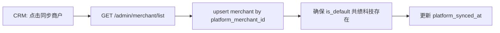
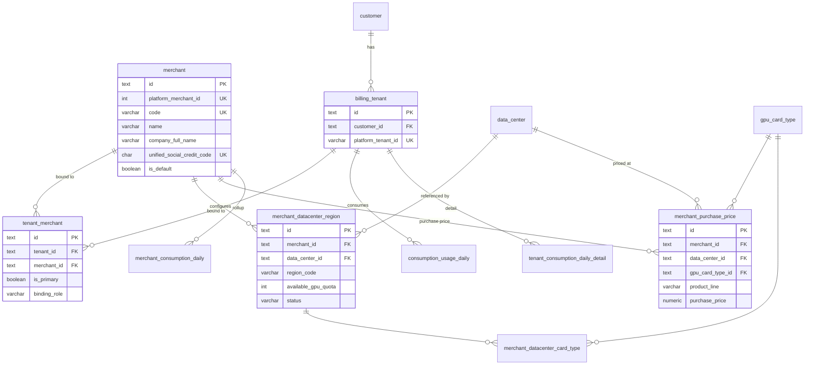

# 商户管理功能设计方案

> **版本**：v1.1（设计稿）  
> **日期**：2026-06-10  
> **状态**：**设计稿 — 确认后再实施代码**  
> **关联**：`crm-database.md`（§1.1 Customer/Tenant 规则）、`platform-pricing-design.md`（L1 平台刊例价）、`supplier-database.md`（`data_center` / 机房区域）、`platform-tenant-import-design.md`（平台 `merchant_id`）、`project-tenant-daily-consumption-design.md`（消费明细粒度）、`role-menu-data-access-design.md`（菜单权限）

**文档性质**：商户域逻辑设计（PostgreSQL 风格）；描述实体模型、定价分层、区域配额、消耗追踪与上下游集成。**不涉及代码修改**。

---

## 1. 目标与原则

### 1.1 业务目标

| # | 目标 | 说明 |
|---|------|------|
| G1 | **租户关联商户** | 同一计费租户 **可同时关联多个商户**（多对多）；CRM 通过 `tenant_merchant` 维护绑定；至少一条有效绑定 |
| G2 | **默认商户** | 系统内置默认商户 **共绩科技**；历史租户与平台直客均归入该商户 |
| G3 | **机房即区域** | 商户可配置多个 **机房区域**（映射平台 `data_center`），向其下属租户展示为可选算力区域 |
| G4 | **区域差异化定价** | 同一商户在不同机房的 **卡型 × 产品线** 进货价可不同；未配置时 **默认继承平台刊例价** |
| G5 | **区域可用卡量** | 可为商户在各开放区域配置 **可用 GPU 卡数上限**（配额），用于资源开放与风控 |
| G6 | **进货价管理** | 商户从平台 **进货**（平台刊例价为默认基准）；CRM 维护商户侧 **进货价** 主数据 |
| G7 | **消耗可区分** | 商户下属租户消耗 **可追踪、可汇总**；与共绩科技直客消耗 **报表/财务口径分离** |

### 1.2 非目标（本期）

- **不**在 CRM 实现商户对终端客户的 **二次定价 / 零售价** 管理（终端扣费仍以平台计费引擎为准；本期只管理 **平台→商户** 的进货价）
- **不**替代供应商域 `supplier_unit_cost`（平台→供应商 **成本价**）；商户进货价是 **销售链上一层**，与供应商成本 **无自动联动**
- **不**实现商户自助门户（仅 CRM 管理端 + 平台 OpenAPI 同步）
- **不**改造 Customer / Project 三层经营模型（商户是 **计费域** 维度，Customer 仍为客户主体）
- **不**在一期实现商户间资源转让、跨商户租户迁移

### 1.3 设计原则

1. **平台 ID 对齐**：`merchant.platform_merchant_id` 与 OpenAPI `merchant_id` 全局 UK；每个 `tenant` 至多一条 **主绑定**（`tenant_merchant.is_primary = true`）与平台租户 `merchant_id` 对齐。
2. **默认共绩**：迁移后所有无绑定记录的历史 `tenant` 插入 `tenant_merchant` → 默认商户「共绩科技」（`is_primary = true`）。
3. **定价继承**：商户进货价 **显式覆盖优先**；无覆盖行时 **只读引用** L1 `platform_card_list_price.sell_price`（语义为平台刊例 = 默认进货价）。
4. **区域引用不复制**：商户区域配置 **FK 引用** `data_center`，不复制机房主数据；展示名可冗余 `data_center.name` / `container_instance_region`。
5. **消耗带商户维度**：计费事实表写入 **`merchant_id`**（优先取平台账单行上的商户；缺失时用租户 **主绑定** 商户），便于与共绩直客分离统计；**禁止**因多对多绑定而对同一笔消耗重复入账。
6. **读写分离**：列表读本地库；商户主数据经 **平台同步** 写入；`tenant_merchant` 经平台同步（主绑定）或管理端维护（附加绑定）。
7. **主体信息完整**：商户须维护 **统一社会信用代码** 与 **公司全称**，用于合同、开票与主体识别。

---

## 2. 领域模型

### 2.1 实体关系总览

```text
┌─────────────────────────────────────────────────────────────────────────┐
│  Platform（算算力平台）                                                  │
│  · L1 刊例价 platform_card_list_price                                    │
│  · 物理机房 data_center（供应商域）                                       │
│  · OpenAPI merchant / tenant                                             │
└─────────────────────────────────────────────────────────────────────────┘
         │ 进货（默认=刊例价，可按机房覆盖）                │ 计费 / 消耗
         ▼                                                    ▼
┌──────────────────────┐         * ── *              ┌──────────────────────┐
│  Merchant（商户）     │ ◄──── tenant_merchant ────► │  Tenant（计费租户）   │
│  默认：共绩科技       │      （多对多绑定）          │  归属 1 Customer     │
└──────────────────────┘                              └──────────────────────┘
         │ 1
         │ *
         ▼
┌──────────────────────────────────────────────────────────────────────────┐
│  MerchantDatacenterRegion（商户机房区域）                                  │
│  · 映射 data_center                                                       │
│  · 开放状态、可用卡数配额、启用卡型                                         │
│  · 嵌套 MerchantPurchasePrice（机房×卡型×产品线 进货价）                   │
└──────────────────────────────────────────────────────────────────────────┘
```

### 2.2 与现有 CRM 三层模型的关系

| 实体 | 层级 | 与商户关系 |
|------|------|------------|
| **Customer** | 经营客户主体 | 无直接 FK；经下属 `tenant` → `tenant_merchant` 间接关联商户 |
| **Project** | 经营项目 | 无变化；商户维度报表通过关联租户的 `tenant_merchant` 解析 |
| **Tenant** | 平台计费租户 | **不**在 `tenant` 表存 `merchant_id`；经 **`tenant_merchant`** 多对多关联 |
| **Merchant** | 计费域新增 | 平台分销/转售主体；共绩科技 = 平台自营 |

**不变量（新增 R7）**：

| 规则 | 说明 |
|------|------|
| **R7.1 租户至少一商户** | 每个 `tenant` 至少一条 **有效** `tenant_merchant`（`effective_to IS NULL`）；新建/导入时若无指定则默认绑定共绩科技 |
| **R7.2 主绑定唯一** | 每个 `tenant` **至多一条** `is_primary = true` 且有效的绑定；与平台 OpenAPI 租户 `merchant_id` 对齐的必须是 **主绑定** |
| **R7.3 平台 merchant 一致** | 平台 `merchant_id` 变更时 **更新/新建主绑定**；与本地主绑定 `merchant.platform_merchant_id` 不一致 → 写入 `merchant_sync_issue`，不静默改附加绑定 |
| **R7.4 多绑不重复计费** | 同一笔平台账单 / 消费明细 **只归属一个** `merchant_id`（来自平台账单行或主绑定）；不因 `tenant_merchant` 多行而复制金额 |
| **R7.5 计费事实带商户** | `consumption_usage_daily`、`tenant_consumption_daily_detail`、`tenant_bill` 等 **必须** 冗余 `merchant_id`（写入规则见 §6.3） |
| **R7.6 共绩消耗分离** | 报表默认维度 `merchant_id`；「共绩科技」= 平台直客口径；其它商户 = 分销口径 |

### 2.3 默认商户「共绩科技」

| 项 | 值 |
|----|-----|
| 逻辑标识 | `merchant.code = 'gongji'`（UK） |
| 展示名 `name` | `共绩科技`（简称，列表/侧栏用） |
| 公司全称 `company_full_name` | 工商注册全称（如「共绩（上海）科技有限公司」，seed 时填写） |
| 统一社会信用代码 `unified_social_credit_code` | 18 位 USCC（seed 时填写；UK，见 §5.1） |
| `platform_merchant_id` | 与平台主商户 ID 对齐（迁移脚本从 OpenAPI `GET /admin/merchant/list` 或环境变量 `DEFAULT_PLATFORM_MERCHANT_ID` 写入） |
| `is_default` | `true`（全局至多一条） |
| `type` | `platform_direct`（平台直营） |
| 历史数据 | 所有现有 `tenant` 在 migration 中 `INSERT tenant_merchant (tenant_id, merchant_id=<共绩.id>, is_primary=true)` |

---

## 3. 定价分层（商户进货价）

在 `platform-pricing-design.md` L1/L2 之上，新增 **L3 商户进货价**：

```text
┌─────────────────────────────────────────────────────────────────────────┐
│  L1 平台刊例价（Platform Catalog Price）— 已有                            │
│  粒度：gpu_card_type × product_line × billing_unit                        │
│  语义：面向客户的平台标准价；**同时作为商户默认进货价**                      │
└─────────────────────────────────────────────────────────────────────────┘
                                    │
                                    │ 默认继承；可按机房覆盖
                                    ▼
┌─────────────────────────────────────────────────────────────────────────┐
│  L3 商户机房进货价（Merchant Purchase Price）— 本期新增                   │
│  粒度：merchant × data_center × gpu_card_type × product_line             │
│         [× billing_unit]                                                  │
│  语义：**平台向商户结算的进货单价**（元/卡/单位）                           │
│  管理者：平台运营 / 商务（CRM 管理端）                                     │
└─────────────────────────────────────────────────────────────────────────┘

（L2 供应商机房销售/成本价 — 已有，与 L3 独立，见 platform-pricing-design.md）
```

| 层级 | 价格类型 | 用途 | 默认来源 |
|------|----------|------|----------|
| L1 | 平台刊例（销售） | 客户标准价、**商户默认进货价** | 人工维护 |
| L2 | 机房销售/成本 | 供应商结算、平台扣费基准 | 供应商商务 |
| **L3** | **商户进货价** | 平台→商户结算、商户毛利核算 | **L1 刊例价** |

**产品线 / 租期单位**：与 `platform-pricing-design.md` §2 完全一致（`elastic_service`、`cloud_vm`、`bare_metal`、`job`、`spot`；裸金属 `hour/day/week/month`）。

**解析规则（读路径）**：

```text
effective_purchase_price(merchant, dc, card, pl, unit) =
  merchant_purchase_price 显式 active 行
  ?? platform_card_list_price 当前 active 行（L1 刊例）
  ?? NULL（未配置，UI 标红，同步阻塞可选）
```

---

## 4. 商户机房区域与可用卡量

### 4.1 概念

- **机房区域**：对商户租户可见的算力区域 = 平台 `data_center` 经商户配置后的 **子集**。
- **展示名**：优先 `data_center.container_instance_region`（容器区域码），辅以 `data_center.name`、`region_tags`。
- **开放区域**：仅 `status = open` 的区域对商户租户可选；`closed` / `maintenance` 在 CRM 可配但不对租户开放。

### 4.2 可用卡数量（配额）

| 字段 | 说明 |
|------|------|
| `available_gpu_quota` | 商户在该区域 **可售/可用 GPU 卡数上限**（整数 ≥ 0） |
| `used_gpu_count` | **读模型**：平台 `gpu_usage` 或 CRM 设备台账按商户+区域汇总（可选缓存表） |
| `remaining_gpu_count` | `max(0, available_gpu_quota - used_gpu_count)` |

**口径建议**：

- **配额来源**：商务合同或平台运营手工配置；**不**自动等于机房物理 GPU 总量。
- **已用量**：首期从平台 OpenAPI 按 `merchant_id` + `region` 拉取；二期可与 CRM `supplier_device` 交叉校验（参考 `supplier-overview` 区域统计）。
- **超限策略**（平台侧实现，CRM 仅展示）：租户下单时平台校验；CRM 可展示 **配额使用率** 告警。

### 4.3 启用卡型

每个商户区域可配置 **启用卡型白名单**（`merchant_datacenter_card_type`）：

- 未配置：默认继承该平台机房已上架的全部 active 卡型（与 L2 销售价 `config_status = active` 交集）。
- 已配置：仅白名单内卡型对该商户租户可见；进货价按 L3 解析。

---

## 5. 数据模型

### 5.1 `merchant`（商户主数据）

| 列名 | 类型 | 约束 | 说明 |
|------|------|------|------|
| `id` | text | PK | |
| `platform_merchant_id` | integer | UK, NOT NULL | OpenAPI `merchant_id` |
| `code` | varchar(64) | UK, NOT NULL | 稳定业务码，如 `gongji` |
| `name` | varchar(255) | NOT NULL | **展示简称**（列表、侧栏；可与公司全称不同） |
| `company_full_name` | varchar(512) | NOT NULL | **商户公司全称**（工商注册名称；合同/开票主体） |
| `unified_social_credit_code` | char(18) | UK, NOT NULL | **统一社会信用代码**（18 位；入库前校验格式与校验位） |
| `merchant_mark` | varchar(128) | 可空 | 平台 `merchant_mark` |
| `type` | varchar(32) | NOT NULL | `platform_direct` / `partner` |
| `is_default` | boolean | NOT NULL DEFAULT false | 默认商户标记 |
| `status` | varchar(32) | NOT NULL | `active` / `inactive` / `suspended` |
| `contact_user` | varchar(128) | 可空 | |
| `contact_phone` | varchar(32) | 可空 | |
| `remark` | text | 可空 | |
| `platform_synced_at` | timestamptz | 可空 | 最近一次主数据同步 |
| `created_at` / `updated_at` | timestamptz | NOT NULL | |

**部分唯一索引**：`UNIQUE (is_default) WHERE is_default = true`（至多一个默认商户）。

**索引**：`(status)`、`(name)`、`(company_full_name)`。

**字段说明**：

| 字段 | 规则 |
|------|------|
| `company_full_name` | 创建/编辑商户时 **必填**；平台同步若仅有简称，写入 `name`，`company_full_name` 需人工补全或从平台扩展字段映射（联调确认） |
| `unified_social_credit_code` | 创建时 **必填**；格式 `^[0-9A-Z]{18}$`（国标 GB 32100）；同一 USCC 全局不可重复 |
| `name` vs `company_full_name` | `name` 用于 UI 短名；报表导出、合同附件使用 `company_full_name` |

### 5.2 `tenant_merchant`（租户 ↔ 商户 多对多绑定）

对应 CRM 中 `project_tenant` 的绑定模式；**不在 `tenant` 表存 `merchant_id`**。

| 列名 | 类型 | 约束 | 说明 |
|------|------|------|------|
| `id` | text | PK | |
| `tenant_id` | text | FK→tenant, NOT NULL | |
| `merchant_id` | text | FK→merchant, NOT NULL | |
| `is_primary` | boolean | NOT NULL DEFAULT false | **主绑定**；与平台 `merchant_id` 对齐 |
| `binding_role` | varchar(32) | NOT NULL | `platform_primary` / `commercial` / `historical` |
| `effective_from` | date | NOT NULL | 绑定生效日 |
| `effective_to` | date | 可空 | NULL = 当前有效 |
| `remark` | text | 可空 | |
| `created_by_staff_id` | text | FK→user_staff | |
| `created_at` / `updated_at` | timestamptz | NOT NULL | |

**唯一约束**：

```sql
UNIQUE (tenant_id, merchant_id) WHERE effective_to IS NULL
UNIQUE (tenant_id) WHERE is_primary = true AND effective_to IS NULL
```

**索引**：`(merchant_id)`、`(tenant_id)`、`(tenant_id, is_primary)`。

**绑定语义**：

| `binding_role` | 说明 |
|----------------|------|
| `platform_primary` | 与算算力平台租户 `merchant_id` 一致的主绑定；平台同步 **仅维护此条** |
| `commercial` | CRM 手工添加的附加商户关联（如集团内多主体共用一个平台租户） |
| `historical` | 已失效或迁移保留的历史绑定（通常配合 `effective_to`） |

**读路径约定**：

- 租户详情「关联商户」：查 `tenant_merchant WHERE tenant_id = ? AND effective_to IS NULL`
- 商户详情「关联租户」：查 `tenant_merchant WHERE merchant_id = ? AND effective_to IS NULL`
- 平台同步对齐：upsert `platform_primary` + `is_primary = true`

### 5.3 `merchant_datacenter_region`（商户机房区域）

| 列名 | 类型 | 约束 | 说明 |
|------|------|------|------|
| `id` | text | PK | |
| `merchant_id` | text | FK→merchant, NOT NULL | |
| `data_center_id` | text | FK→data_center, NOT NULL | 引用供应链机房 |
| `display_name` | varchar(255) | 可空 | 覆盖展示名；空则用机房名 |
| `region_code` | varchar(128) | NOT NULL | 冗余 `container_instance_region` 或 `code`，供平台 API 对齐 |
| `status` | varchar(32) | NOT NULL | `open` / `closed` / `maintenance` |
| `available_gpu_quota` | integer | NOT NULL DEFAULT 0 | 可用卡数上限 |
| `sort_order` | integer | NOT NULL DEFAULT 0 | 租户控制台排序 |
| `effective_from` | date | NOT NULL | |
| `effective_to` | date | 可空 | NULL = 当前有效 |
| `updated_by_staff_id` | text | FK→user_staff | |
| `created_at` / `updated_at` | timestamptz | NOT NULL | |

**唯一约束**：`UNIQUE (merchant_id, data_center_id) WHERE effective_to IS NULL`。

**索引**：`(merchant_id, status)`、`(data_center_id)`。

### 5.4 `merchant_datacenter_card_type`（区域启用卡型）

| 列名 | 类型 | 约束 | 说明 |
|------|------|------|------|
| `id` | text | PK | |
| `merchant_datacenter_region_id` | text | FK→merchant_datacenter_region, NOT NULL | |
| `gpu_card_type_id` | text | FK→gpu_card_type, NOT NULL | |
| `status` | varchar(32) | NOT NULL | `enabled` / `disabled` |
| `created_at` / `updated_at` | timestamptz | NOT NULL | |

**唯一约束**：`UNIQUE (merchant_datacenter_region_id, gpu_card_type_id)`。

### 5.5 `merchant_purchase_price`（商户进货价 — 版本化）

| 列名 | 类型 | 约束 | 说明 |
|------|------|------|------|
| `id` | text | PK | |
| `merchant_id` | text | FK→merchant, NOT NULL | |
| `data_center_id` | text | FK→data_center, NOT NULL | |
| `gpu_card_type_id` | text | FK→gpu_card_type, NOT NULL | |
| `product_line` | varchar(32) | NOT NULL | §3 枚举 |
| `billing_unit` | varchar(16) | NOT NULL DEFAULT `hour` | |
| `purchase_price` | numeric(15,4) | NOT NULL | **进货单价** |
| `currency` | varchar(8) | NOT NULL DEFAULT `CNY` | |
| `source` | varchar(32) | NOT NULL | `manual` / `inherit_l1` / `platform_sync` |
| `platform_list_price_id` | text | FK→platform_card_list_price, 可空 | 继承溯源 |
| `effective_from` | date | NOT NULL | |
| `effective_to` | date | 可空 | |
| `status` | varchar(32) | NOT NULL | `draft` / `active` / `archived` |
| `remark` | text | 可空 | |
| `updated_by_staff_id` | text | FK→user_staff | |
| `created_at` / `updated_at` | timestamptz | NOT NULL | |

**部分唯一**：

```sql
UNIQUE (merchant_id, data_center_id, gpu_card_type_id, product_line, billing_unit)
  WHERE effective_to IS NULL AND status = 'active'
```

### 5.6 `merchant_purchase_price_record`（当前进货价读模型）

结构与 `platform_card_price_record` 对称，UK：`(merchant_id, data_center_id, gpu_card_type_id, product_line, billing_unit)`；便于列表页 JOIN。

### 5.7 现有表扩展

#### `tenant` — **无新增 merchant 列**

商户关联 **仅** 通过 `tenant_merchant` 维护，保持 `tenant` 表与 `crm-database.md` R1/R3 不变。

#### 计费事实表扩展（冗余 `merchant_id`）

| 表 | `merchant_id` 写入规则 |
|----|------------------------|
| `consumption_usage_daily` | 平台日账单行带 `merchant_id` → 映射本地 merchant；**否则** → 租户 **主绑定** `tenant_merchant.is_primary` |
| `tenant_consumption_daily_detail` | 同上（明细级优先平台字段） |
| `tenant_bill` / `tenant_bill_detail` | 月账单同步；同上 |
| `recharge` | 充值同步；同上 |
| `consumption_record` | 明细写入；同上 |

**索引建议**：各表 `(merchant_id, usage_date)` 或 `(merchant_id, bill_month)`；保留 `(tenant_id, …)` 索引不变。

#### `merchant_gpu_usage_snapshot`（可选读模型，二期）

| 列名 | 说明 |
|------|------|
| `merchant_id` | |
| `region_code` | |
| `snapshot_at` | |
| `used_gpu_count` | 平台已用量 |
| `available_gpu_quota` | 冗余配额 |

---

## 6. 消耗追踪与共绩分离

### 6.1 追踪维度

| 维度 | 字段 | 用途 |
|------|------|------|
| 商户 | `merchant_id` | **与共绩分离的主维度** |
| 租户 | `tenant_id` | 下钻到具体计费账户 |
| 客户 | `customer_id` | CRM 经营视图 |
| 机房×卡型 | `data_center_*` / `gpu_card_type_*` | 明细级（已有 `tenant_consumption_daily_detail`） |
| 产品线 | `product_line` | 日/月汇总 |

### 6.2 报表口径

| 报表 | 过滤 | 说明 |
|------|------|------|
| **平台总消耗** | 全部商户 | Admin 全局看板 |
| **共绩直客消耗** | `merchant.is_default = true` 或 `merchant.code = 'gongji'` | 平台自营 |
| **分销商户消耗** | `merchant.is_default = false` | 合作伙伴租户 |
| **单商户消耗** | `merchant_id = ?` | 商户详情页 |
| **商户毛利（二期）** | 租户实付 − 商户进货成本 | 需 L3 价 × 卡时 |

### 6.3 同步与幂等

平台 OpenAPI 已具备：

| API | 用途 |
|-----|------|
| `GET /admin/merchant/list` | 商户主数据同步 |
| `GET /admin/merchant/list_id_merchant_mark` | ID / mark 映射 |
| `GET /admin/merchant/billing_pod_record_list` | 商户维度账单（可与租户账单交叉） |
| 租户 API `merchant_id` 字段 | 租户归属校验 |

**同步规则**：

1. 租户日消费同步写入时：若平台账单行含 `merchant_id` → 解析为本地 `merchant_id` 写入事实表；**若无** → 取该租户 `tenant_merchant.is_primary = true` 的商户。
2. 平台租户 `merchant_id` 变更 → **仅 upsert 主绑定**（`platform_primary`）；附加绑定（`commercial`）**不自动删除**。
3. 主绑定与平台 `merchant_id` 不一致 → 写入 `merchant_sync_issue`；附加绑定冲突 **不阻塞** 同步。
4. 商户维度汇总：按事实表 **`merchant_id`** GROUP BY 写入 `merchant_consumption_daily`（**不**对多绑关系做 JOIN 展开，避免重复计数）。

### 6.4 逻辑表：`merchant_consumption_daily`（商户日汇总）

| 列名 | 类型 | 说明 |
|------|------|------|
| `id` | text | PK |
| `merchant_id` | text | FK |
| `usage_date` | date | |
| `usage_month` | varchar(7) | |
| `product_line` | varchar(64) | |
| `tenant_count` | integer | 当日有消耗租户数 |
| `amount` | numeric(15,4) | 总消费 |
| `voucher_amount` | numeric(15,4) | 券消费 |
| `balance_amount` | numeric(15,4) | 实付 |
| `total_card_hours` | numeric(15,4) | |
| `source` | varchar(32) | `rollup_from_tenant` |

**UK**：`(merchant_id, usage_date, product_line)`。

---

## 7. 平台集成

### 7.1 商户主数据同步



| 平台字段 | 本地列 |
|----------|--------|
| `id` | `platform_merchant_id` |
| `merchant_mark` | `merchant_mark` |
| 名称类字段 | `name`（简称）；`company_full_name` / `unified_social_credit_code` 平台若有则映射，**否则 CRM 手工维护** |

### 7.2 租户导入扩展（相对 platform-tenant-import-design.md）

| 变更 | 说明 |
|------|------|
| **入库 `tenant_merchant`** | 平台 `merchant_id` → 查 `merchant.platform_merchant_id` → upsert **主绑定**（`is_primary=true`, `binding_role=platform_primary`） |
| 附加绑定 | 预览/详情页可展示 CRM 已有 `commercial` 绑定；导入 **不覆盖** 附加绑定 |
| 缺失映射 | 若平台 `merchant_id` 本地不存在 → preview 告警；commit **拒绝** 并提示先同步商户 |
| 多商户场景 | 同一 `platform_tenant_id` 可在 CRM 关联多个商户；仅 **一条** `is_primary` 与平台对齐 |

### 7.3 区域配额与平台

CRM 维护 `available_gpu_quota` 后，**需平台侧 API 下发** 方能在租户控制台生效（本期 CRM 为 **配置源 + 对账**；若平台暂无写 API，则 CRM 仅文档化手工配置流程）。

---

## 8. 功能与页面

### 8.1 路由规划

| 路由 | 页面 | 权限 | 主要能力 |
|------|------|------|----------|
| `/merchant` | 商户列表 | admin | 列表、同步平台、跳转详情 |
| `/merchant/[id]` | 商户详情 | admin | 基本信息（含 USCC、公司全称）、关联租户、区域、进货价、消耗 |
| `/merchant/[id]/tenants` | 关联租户 | admin | 多对多绑定管理、主绑定标记 |
| `/merchant/[id]/regions` | 机房区域 | admin | 开放区域、配额、启用卡型 |
| `/merchant/[id]/pricing` | 进货价 | admin | 按机房×卡型×产品线矩阵编辑 |
| `/merchant/[id]/consumption` | 消耗 | admin | 日/月汇总、与共绩对比 |

**菜单**：新增侧栏分组 **商户管理**（admin only，与财务管理同级）。

### 8.2 商户列表

| 列 | 说明 |
|----|------|
| 简称 / code | `name`、`code` |
| 公司全称 | `company_full_name` |
| 统一社会信用代码 | `unified_social_credit_code` |
| 平台 ID | `platform_merchant_id` |
| 类型 | 直营 / 合作伙伴 |
| 关联租户数 | COUNT `tenant_merchant` WHERE effective_to IS NULL |
| 开放区域数 | COUNT region WHERE status=open |
| 本月消耗 | SUM merchant_consumption_daily |
| 状态 | |
| 操作 | 详情、同步 |

**创建/编辑表单必填**：`name`、`company_full_name`、`unified_social_credit_code`、`code`（新建）；`platform_merchant_id`（可与平台同步后回填）。

### 8.3 机房区域配置 UI

**布局**：左侧商户已开放区域列表；右侧区域详情。

| 区块 | 字段 |
|------|------|
| 基础 | 关联机房（Autocomplete `data_center`）、展示名、状态、生效日 |
| 配额 | `available_gpu_quota`、已用量（只读）、剩余（只读）、使用率进度条 |
| 卡型 | 多选 `gpu_card_type`；快捷「继承机房全部 active 卡型」 |
| 进货价入口 | 跳转定价页并带 `data_center_id` 筛选 |

### 8.4 进货价管理 UI

复用 `platform-pricing` 矩阵交互模式（参考 `/supplier/platform-pricing`）：

- **Tab 1 按卡型**：行=卡型，列=产品线，单元格=进货价；支持「一键继承 L1 刊例」。
- **Tab 2 按机房**：行=机房区域，展开产品线×租期子表。
- 变更写 `merchant_purchase_price` + 刷新 `merchant_purchase_price_record` + 历史表（可选 `merchant_purchase_price_history`）。

### 8.6 租户 ↔ 商户绑定 UI

**入口**：

- 商户详情 `/merchant/[id]/tenants`：已关联租户列表、添加/解除 **commercial** 绑定
- CRM 租户详情（计费 Tab）：展示关联商户列表、主绑定标记

| 操作 | 规则 |
|------|------|
| 添加绑定 | 选择 `tenant` + `binding_role=commercial`；**不可**重复添加同一对 |
| 设为主绑定 | 仅 admin；切换时原主绑定改为非主或结束 `effective_to`；须与平台 `merchant_id` 一致方可标 `platform_primary` |
| 解除绑定 | 结束 `effective_to`；**禁止**解除租户的最后一条有效绑定 |
| 解除主绑定 | **禁止**；须先切换主绑定至其它商户 |

---

### 8.7 消耗看板

| 视图 | 内容 |
|------|------|
| 概览卡片 | 本月总消耗、券/实付拆分、活跃租户数 |
| 趋势 | 近 30 日折线（可按产品线分 series） |
| 对比 | 与共绩科技同口径对比（可选） |
| 下钻 | 租户排行 → 租户详情 `/crm/customers/...` |

---

## 9. API 设计（tRPC 草案）

| Procedure | 类型 | 说明 |
|-----------|------|------|
| `merchant.list` | query | 分页；支持按 `name` / `company_full_name` / `unified_social_credit_code` 筛选 |
| `merchant.getById` | query | 详情 + 统计 |
| `merchant.create` | mutation | 创建（含 USCC、公司全称校验） |
| `merchant.update` | mutation | 更新主数据 |
| `merchant.syncFromPlatform` | mutation | 拉 OpenAPI upsert |
| `merchant.tenant.list` | query | 某商户关联租户（`tenant_merchant`） |
| `merchant.tenant.bind` | mutation | 添加 commercial 绑定 |
| `merchant.tenant.unbind` | mutation | 结束绑定（`effective_to`） |
| `merchant.tenant.setPrimary` | mutation | 切换主绑定 |
| `merchant.region.list` | query | 某商户区域列表 |
| `merchant.region.upsert` | mutation | 创建/更新区域与配额 |
| `merchant.region.setCardTypes` | mutation | 白名单 |
| `merchant.pricing.list` | query | 矩阵读模型（含 L1 fallback 展示） |
| `merchant.pricing.batchUpsert` | mutation | 批量改进货价 |
| `merchant.pricing.inheritFromL1` | mutation | 选中范围从刊例价生成 |
| `merchant.consumption.daily` | query | 日汇总 |
| `merchant.consumption.monthly` | query | 月汇总 |
| `merchant.consumption.compareGongji` | query | 共绩 vs 当前商户 |

**鉴权**：全部 `adminProcedure`（与财务管理一致）。

---

## 10. ER 图



---

## 11. 迁移与初始化

### 11.1 迁移步骤（建议顺序）

| 步骤 | 动作 |
|------|------|
| M1 | CREATE `merchant`（含 `company_full_name`、`unified_social_credit_code`）+ 插入默认「共绩科技」 |
| M2 | CREATE `tenant_merchant`、商户区域 / 进货价 / 读模型表 |
| M3 | BACKFILL `tenant_merchant`：每个现有 `tenant` 插入共绩主绑定（`is_primary=true`） |
| M4 | 平台租户导入改为 upsert 主绑定；保留已有 commercial 绑定 |
| M5 | ALTER 计费表 ADD `merchant_id` + BACKFILL（主绑定或平台账单 merchant） |
| M6 | CREATE `merchant_consumption_daily` + 首次 rollup Job |

### 11.2 共绩科技区域初始化

默认商户 **不强制** 预填全部机房；可选「一键开放全部 online 机房」脚本，配额默认 0（无限额语义）或按平台合同导入。

---

## 12. 实施分期

| 阶段 | 范围 | 交付 |
|------|------|------|
| **P1 基础归属** | `merchant`（含 USCC、公司全称）、`tenant_merchant`、默认共绩、租户导入主绑定、列表页 | 租户可多商户关联；报表按事实表 `merchant_id` 过滤 |
| **P2 区域与配额** | `merchant_datacenter_region`、卡型白名单、区域 UI | 可配置开放区域与可用卡数 |
| **P3 进货价** | L3 定价表、继承 L1、定价 UI | 商户机房差异化进货价 |
| **P4 消耗分离** | 计费表冗余、rollup、`merchant_consumption_daily`、消耗看板 | 与共绩消耗分离的可追踪报表 |
| **P5 平台闭环** | 配额下发 API 联调、商户毛利（可选） | 配置可在租户侧生效 |

---

## 13. 待确认项

| # | 问题 | 建议 |
|---|------|------|
| Q1 | 平台主商户「共绩科技」的 `platform_merchant_id` 固定值 | 联调确认后写入 seed |
| Q2 | 同一租户多商户时，平台账单是否带 `merchant_id` | 若带 → 事实表以账单为准；若不带 → 仅用主绑定 |
| Q3 | 附加 commercial 绑定的业务场景清单 | 商务确认后写入 `binding_role` 枚举说明 |
| Q4 | `available_gpu_quota = 0` 语义 | 0 = 不可用 vs 0 = 不限制；建议 **0 = 不可用**，NULL = 不限制（列改为 nullable） |
| Q5 | 平台是否返回 USCC / 公司全称 | 若无，CRM 创建商户时 **必填** 手工录入 |
| Q6 | 租户终端售价是否在 CRM 管理 | 本期 **否**；仅进货价 |
| Q7 | 分销商户消耗是否进入财务月结 | 二期与 `billing-period-import-design.md` 联调；本期 CRM 报表先行 |

---

## 14. 参考代码与文档

| 资源 | 路径 |
|------|------|
| CRM Tenant 模型 | `packages/db/src/crm-schema.ts` → `billingTenant` |
| 平台刊例价 | `packages/db/src/platform-pricing-schema.ts` |
| 机房主数据 | `packages/db/src/supply-schema.ts` → `dataCenter` |
| 平台商户 API | `apps/web/src/lib/server/integrations/api.ts` → `getMerchantListAPI` 等 |
| 租户 API merchant 字段 | `apps/web/src/lib/types/platform-tenant-import.ts` |
| 消费明细设计 | `apps/web/content/design/project-tenant-daily-consumption-design.md` |
| 平台定价分层 | `apps/web/content/design/platform-pricing-design.md` |

---

**变更记录**

| 版本 | 日期 | 说明 |
|------|------|------|
| v1.1 | 2026-06-10 | Tenant↔Merchant 改为多对多（`tenant_merchant`）；商户增加 USCC、公司全称；消耗归属规则更新 |
| v1.0 | 2026-06-10 | 初稿：商户归属、机房区域、L3 进货价、消耗分离、表结构与分期 |
