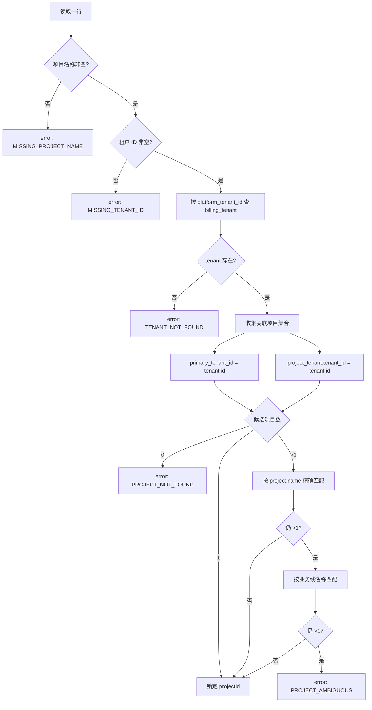
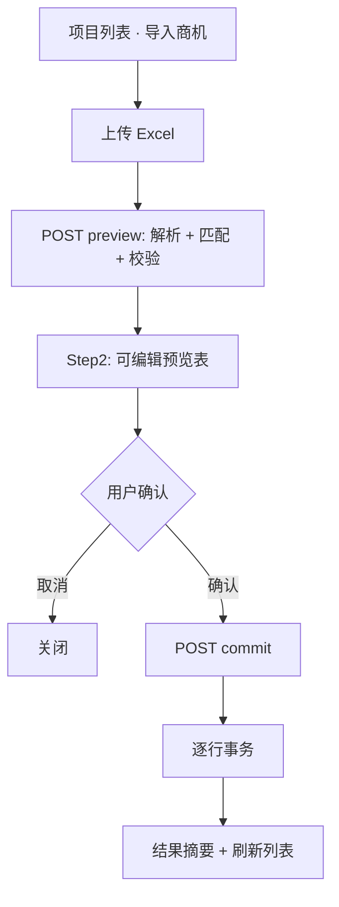

# 商机信息 Excel 批量导入设计方案

> 版本：v1.1（设计稿）  
> 日期：2026-06-10  
> 状态：**设计稿 — 确认后再实施代码**  
> 关联：`projects-content.tsx`、`project-import-design.md`、`project-account-manager.ts`、`project-opportunity-source.ts`、`tenant-project-import.ts`、`packages/db/src/crm-schema.ts`

---

## 1. 目标与原则

### 1.1 业务目标

| # | 目标 | 说明 |
| --- | --- | --- |
| G1 | 批量补录商机经营字段 | 用户上传精简 Excel，对 **已存在项目** 批量更新商机来源与四人组（销售/交付/项目经理/售前） |
| G2 | 租户 ID 精确定位项目 | 以 Excel「租户 ID」列匹配本地 `billing_tenant.platform_tenant_id`，再结合项目名称消解歧义 |
| G3 | 当前主责写入 | 人员类字段写入 `project_staff_assignment`，遵循与「设置客户经理」一致的 **当前生效** 规则（`effective_to IS NULL`） |
| G4 | 商机来源历史可追溯 | 商机来源写入 `project_opportunity_source_assignment` 并同步 `project.opportunity_source` 冗余列 |
| G5 | 可预览、可改、可部分成功 | 两步流：解析预览（可编辑）→ 用户确认 → 逐行事务入库；单行失败不影响其它行 |

### 1.2 非目标（本期）

- **不创建** 客户、租户、项目（无匹配项目时标记错误，引导走「导入项目」或「导入租户项目」）
- **不修改** 业务线、阶段、标签、转正设置、收入归属部门等项目主数据
- **不写入** 客户级 `account_manager_assignment`（本流程仅更新 **项目级** `project_staff_assignment` 中的 `account_manager`）
- **不调用** 算算力 OpenAPI（租户 ID 仅用于本地 `platform_tenant_id` lookup，与 `project-import-design.md` §1.2 一致）
- **不替代** 全量「导入项目」Excel（`project-import-design.md`）；本入口面向 **商机补录** 场景

### 1.3 设计原则

1. **只更新、不新建项目**：与全量项目导入解耦；程序仅处理 §2.1 白名单 8 列，其余列一律忽略。
2. **白名单列解析**：用户可上传飞书/多维表格等 **宽表**（列数多于 8 列）；解析器按表头名匹配有效列，**不要求**删减多余列，也不读取未列入白名单的列。
3. **租户 ID → 平台租户 ID → 本地 tenant → 项目**：lookup 链路与 `tenant-project-import.ts` 中 `loadLocalTenantsByPlatformIds` 一致。
4. **姓名匹配员工**：按 `user_staff.display_name` 解析；与项目导入共用 `ensureStaffByDisplayName` 策略（可选自动创建占位员工）。
5. **空单元格 = 不更新**：某列为空时保留库内当前值，不主动清空主责。
6. **预览可编辑**：解析后在表格内可改商机来源、四人组人选，再提交 commit。

---

## 2. 源表结构

### 2.1 有效列白名单（8 列）

> **宽表兼容**：实际 Excel 可包含任意额外列（如标签、阶段、描述、消费金额等，与「导入项目」导出表同构）。程序 **只读取** 下表及 §3.1 别名匹配成功的列；其余列 **不参与解析、不入库、不报错**，用户无需事先删减列。

| 列序 | 表头 | 示例值 | 本期用途 |
| --- | --- | --- | --- |
| 1 | 项目名称 | 几何 Docker 项目 | 项目匹配（与租户 ID 联合） |
| 2 | 租户 ID | 16462 | 匹配 `billing_tenant.platform_tenant_id` |
| 3 | 业务线 | 弹性算力 | 歧义消解（见 §4.2）；**不入库** |
| 4 | 商机来源 | 市场 | 更新商机来源 |
| 5 | 销售 | 李楠 | 更新项目客户经理（`account_manager`） |
| 6 | 交付 | 王五 | 更新交付经理（`delivery_manager`） |
| 7 | 项目经理 | 高彭 | 更新项目经理（`project_manager`） |
| 8 | 售前 | 张三 | 更新售前（`pre_sales`） |

> 「销售」列在业务语义上对应列表页「客户经理」列及 `role_type = account_manager`。

### 2.2 文件要求

| 项 | 规则 |
| --- | --- |
| 格式 | `.xlsx` / `.xls` |
| 大小 | ≤ 10MB（与现有 CRM 导入一致） |
| 表头 | 第一行为表头行；**须包含** §2.1 白名单中的「项目名称」「租户 ID」（允许前后空格；别名见 §3.1）；**允许** 同时存在任意数量的其他列 |
| 列数 | 无上限；列数 **大于 8** 为正常场景（直接复用项目信息宽表即可） |
| 数据行 | 从第二行起；**项目名称** 与 **租户 ID** 均不能为空 |
| 单次上限 | 建议 **500** 行，超出提示拆分 |

### 2.3 列过滤策略

解析第一行表头，建立 **列索引 → 标准字段** 映射，仅对白名单字段读单元格：

```ts
// 伪代码 — 与 project-import-utils 按表头 pick 单元格的模式一致
const COLUMN_WHITELIST = [
  '项目名称', '租户ID', '业务线', '商机来源', '销售', '交付', '项目经理', '售前',
] // + §3.1 全部别名

function buildColumnMap(headerRow: string[]): ColumnMap {
  const map: ColumnMap = {}
  for (let col = 0; col < headerRow.length; col++) {
    const canonical = resolveCanonicalField(headerRow[col]?.trim()) // 别名 → 标准名
    if (canonical && WHITELIST_FIELDS.has(canonical)) {
      map[canonical] = col // 同标准名多列时取首次匹配，后续记入 ignoredDuplicateColumns
    } else {
      ignoredColumns.push(headerRow[col] ?? `列${col + 1}`)
    }
  }
  return map
}
```

| 规则 | 说明 |
| --- | --- |
| 非白名单列 | **静默忽略**；不触发 warn/error，不展示在预览表 |
| 白名单列缺失 | 「项目名称」「租户 ID」缺失 → 文件级 `error: MISSING_REQUIRED_COLUMNS`；其余白名单列缺失 → 该字段视为「本文件无此列」，等价于每行该字段为空（不更新） |
| 重复表头 | 同一标准字段匹配到多列（如两个「销售」列）→ `warn: DUPLICATE_COLUMN`，**仅使用第一次** 出现的列 |
| `ignoredColumns` | 预览响应附带 `ignoredColumnNames[]` 与 `ignoredColumnCount`；UI 可选展示「已忽略 N 个无关列」（折叠提示），**默认不打扰用户** |
| 行数据读取 | 每行仅 `pickCell(row, columnMap['项目名称'])` 等白名单字段；绝不 `row` 全列扫描入库 |

**典型场景**：用户从飞书导出 **33 列** 项目信息表，直接上传本入口 → 程序识别其中 8 列有效字段，其余 25 列忽略，行为与上传仅含 8 列的精简表 **完全一致**。

---

## 3. 字段映射

### 3.1 表头别名（解析容错）

解析时对表头 `trim()` 后匹配：

| 标准表头 | 可接受别名 |
| --- | --- |
| 项目名称 | 项目名、Project Name |
| 租户 ID | 租户ID、平台租户 ID、tenant_id、tenant_tid |
| 业务线 | 产品线、Business Line |
| 商机来源 | 来源、opportunity_source |
| 销售 | 客户经理、AM、account_manager |
| 交付 | 交付经理、delivery |
| 项目经理 | PM、客成、客成/项目经理、project_manager |
| 售前 | 售前经理、pre_sales |

**列级过滤**（见 §2.3）：

- 表头无法映射到白名单标准字段的列 → 记入 `ignoredColumnNames`，**不读、不写、不校验**。
- 表头能映射但不在本期白名单内的列（若未来扩展别名冲突）→ 同样忽略。
- 白名单内列：按别名解析单元格；单元格为空则该行该字段不更新。

### 3.2 商机来源 → `opportunity_source`

Excel 单元格映射到枚举 `OpportunitySource`（`commission-constants.ts`）：

| Excel 值（示例） | 枚举值 | 系统展示文案 |
| --- | --- | --- |
| 市场 | `marketing_sales` | 市场 + 销售 |
| 销售 | `sales_self` | 销售自拓 |
| 高管 | `exec_sales` | 高管 + 销售 |

**扩展别名**（与 `project-import-utils.ts` 中 `OPPORTUNITY_SOURCE_ALIASES` 对齐，预览阶段一并支持）：

| 别名 | 枚举值 |
| --- | --- |
| 市场+销售、市场销售、`marketing_sales` | `marketing_sales` |
| 销售自拓、`sales_self` | `sales_self` |
| 高管+销售、高管销售、`exec_sales` | `exec_sales` |

- 单元格 **为空**：该行 **不更新** 商机来源。
- 无法识别：预览行 `errors` += `UNKNOWN_OPPORTUNITY_SOURCE`，`selectable = true`。

写入目标：

| 目标 | 规则 |
| --- | --- |
| `project_opportunity_source_assignment` | 调用 `projectOpportunitySourceDataAccess.change`（与 `ProjectOpportunitySourceDialog` 一致） |
| `project.opportunity_source` | 由上述 `change` 内事务同步更新 |

默认 `effectiveFrom`：导入日（上海时区，`todayShanghaiDateString()`），预览可改。

### 3.3 四人组 → `project_staff_assignment`

| Excel 列 | `role_type` | 空值行为 |
| --- | --- | --- |
| 销售 | `account_manager` | 不更新该角色 |
| 交付 | `delivery_manager` | 不更新该角色 |
| 项目经理 | `project_manager` | 不更新该角色 |
| 售前 | `pre_sales` | 不更新该角色 |

员工解析：

1. `trim()` 姓名 → 查 `user_staff` where `display_name`（同名多条 → `warn` + 预览默认第一条，用户可在预览改选）。
2. 未命中且 `allowCreateStaff = true` → 占位创建（与 `project-import.ts` `ensureStaffByDisplayName` 一致）。
3. 未命中且不允许创建 → 行级 `error`，该角色标记不可提交。

**当前主责更新规则**（「更新为当前有效」）：

| 角色 | 推荐实现 |
| --- | --- |
| `account_manager` | 复用 `projectAccountManagerDataAccess.change`：关闭旧主责（设 `effective_to`）、插入新主责（`effective_to IS NULL`），支持同日换人 / 跨日分段 |
| `pre_sales` / `delivery_manager` / `project_manager` | 本期新增通用 `projectStaffAssignmentDataAccess.change(roleType, …)`，逻辑与 `project-account-manager.ts` 对齐（时间戳字段用 `effective_from` timestamp + `effective_to` timestamp） |

> 与 `project-import.ts` 中 `upsertPartialStaffAssignments`（`effectiveTo = new Date()` 立即截断）相比，本流程 **必须** 采用与手工「设置客户经理」一致的生效日语义，避免提成回溯口径不一致。

默认 `effectiveFrom`：导入日；预览每行可单独修改（见 §8.3）。

### 3.4 业务线列（仅匹配，不入库）

| 场景 | 规则 |
| --- | --- |
| 租户 ID 唯一定位到 1 个项目 | 忽略业务线列 |
| 同租户下多个项目 | 用 **项目名称** 精确匹配 `project.name`；仍多条时再用 **业务线名称** 匹配 `business_line.name` |
| 业务线为空且仍歧义 | `error: PROJECT_AMBIGUOUS` |
| 业务线填了但无匹配 | `warn: BUSINESS_LINE_NO_MATCH`，回退仅按项目名匹配 |

**不更新** `project.business_line_id`。

---

## 4. 项目定位（核心规则）

### 4.1 判定流程



### 4.2 Lookup 实现要点

与现有代码对齐：

```ts
// 租户：tenant-project-import.ts — loadLocalTenantsByPlatformIds
billingTenant.platformTenantId === excelTenantId.trim()

// 项目候选（合并去重）
crmProject.primaryTenantId === tenant.id
// OR
projectTenant.projectId + projectTenant.tenantId === tenant.id
```

展示字段（预览用）：

- `resolvedPlatformTenantId`：库内 `platform_tenant_id`（与 Excel 租户 ID 对照）
- `resolvedTenantName`：`billing_tenant.name`
- `resolvedProjectName`：库内 `project.name`
- `currentValues`：当前商机来源 + 四人组姓名（只读对比列）

### 4.3 权限与数据范围

- Commit 前 `assertProjectInScope(crmScope, projectId)`（与 `changeAccountManager` / `changeOpportunitySource` 一致）。
- 无权限项目：预览 `error: PROJECT_OUT_OF_SCOPE`，不可勾选导入。

---

## 5. 幂等与重复导入

| 字段 | 重复导入同一 Excel 行 | 与库内当前值相同 |
| --- | --- | --- |
| 商机来源 | 再次 `change`；若来源 + 生效日相同则 no-op（`projectOpportunitySourceDataAccess.change` 内短路） | 预览标记 `action: skip` 或 `no_change` |
| 四人组 | 再次 `change`；同人同生效日 no-op | 同上 |
| 空列 | 始终 skip 该字段 | — |

同一 **租户 ID + 项目名称** 在单次 Excel 中出现多次：预览 `warn: DUPLICATE_ROW_KEY`，默认保留最后一行（或禁止提交，由产品确认；**推荐禁止** 并提示去重）。

---

## 6. 端到端流程



### 6.1 Preview 校验码

| 代码 | 级别 | 说明 |
| --- | --- | --- |
| `MISSING_REQUIRED_COLUMNS` | error | 表头缺少「项目名称」或「租户 ID」列；整文件不可解析 |
| `DUPLICATE_COLUMN` | warn | 白名单字段在表头出现多次，仅取首列 |
| `MISSING_PROJECT_NAME` | error | 跳过该行 |
| `MISSING_TENANT_ID` | error | 跳过该行 |
| `TENANT_NOT_FOUND` | error | 本地无此 `platform_tenant_id` |
| `PROJECT_NOT_FOUND` | error | 租户下无关联项目 |
| `PROJECT_AMBIGUOUS` | error | 多项目且无法消解 |
| `PROJECT_OUT_OF_SCOPE` | error | 无 CRM 数据权限 |
| `UNKNOWN_OPPORTUNITY_SOURCE` | error | 商机来源无法映射 |
| `STAFF_NOT_FOUND` | error | 员工不存在且未允许创建 |
| `STAFF_NAME_AMBIGUOUS` | warn | 同名员工，默认第一条 |
| `DUPLICATE_ROW_KEY` | warn / error | 重复键（租户+项目名） |
| `BUSINESS_LINE_NO_MATCH` | warn | 业务线无法参与消解 |
| `NO_FIELDS_TO_UPDATE` | warn | 商机来源与四人组均为空 |

### 6.2 Commit 顺序（单行事务内）

对 `selectable === true` 的行，按字段 **独立** 调用（仅非空且解析成功字段）：

1. `projectOpportunitySourceDataAccess.change`（若有商机来源）
2. `projectAccountManagerDataAccess.change`（若有销售）
3. `projectStaffAssignmentDataAccess.change` × 3（交付 / 项目经理 / 售前，若有值）

任一步失败：该行 `failed`，记录 `message`；其它行继续。

---

## 7. 界面与线框

### 7.1 入口

在 `ProjectsContent` 工具栏「导入项目」旁增加 **「导入商机」** 按钮：

- 组件：`CrmOpportunityImportDialog`（新建）
- 图标：与导入类按钮一致（`IconUpload` 或 `Handshake`）
- 权限：`crmWriteProcedure` 角色（与「导入项目」一致，非只读 `user`）

位置参考（`projects-content.tsx` 工具栏）：

```
… 导入租户项目 | 导入项目 | 导入商机 | 新建项目
```

### 7.2 Step 1 — 上传

```
┌─────────────────────────────────────────────────────────────┐
│  导入商机                                            [ × ]  │
├─────────────────────────────────────────────────────────────┤
│  上传商机补录表（.xlsx），用于更新已存在项目的商机来源与四人组 │
│  [ 选择文件 ]  opportunity-batch.xlsx                       │
│  ⓘ 仅需包含列：项目名称、租户ID、业务线、商机来源、销售、     │
│     交付、项目经理、售前（可有更多列，程序自动忽略无关列）。  │
│     租户ID 对应平台租户ID；商机来源：市场/销售/高管。         │
│     空列表示不更新该字段。可直接上传飞书项目信息宽表。        │
├─────────────────────────────────────────────────────────────┤
│                              [ 取消 ]  [ 解析并预览 → ]      │
└─────────────────────────────────────────────────────────────┘
```

### 7.3 Step 2 — 可编辑预览

```
┌──────────────────────────────────────────────────────────────────────────────────┐
│  确认导入（共 50 行，可导入 47，错误 3）                              [ × ]     │
├──────────────────────────────────────────────────────────────────────────────────┤
│ ☑ │行│项目名│租户ID│匹配项目      │商机来源▼│销售▼│交付▼│PM▼│售前▼│生效日│告警    │
│───┼──┼──────┼──────┼─────────────┼─────────┼─────┼─────┼───┼─────┼──────┼────────│
│ ☑ │2 │几何… │16462 │几何Docker…  │市场+销售 │李楠  │王五  │高彭│张三  │06-10 │        │
│ ☑ │3 │XX   │16462 │XX正式项目    │销售自拓  │—     │—   │—  │—    │06-10 │仅更新来源│
│ ☐ │4 │YY   │99999 │✗ 租户不存在  │—        │—     │—   │—  │—    │—     │不可导入│
├──────────────────────────────────────────────────────────────────────────────────┤
│  ☑ 允许自动创建不存在的员工（占位手机号）                                          │
│  默认生效日：[ 2026-06-10 ]（可应用于勾选行）                                      │
│                          [ ← 上一步 ]  [ 取消 ]  [ 确认导入 47 行 ]              │
└──────────────────────────────────────────────────────────────────────────────────┘
```

**可编辑控件**：

| 列 | 控件 | 说明 |
| --- | --- | --- |
| 商机来源 | `Select`（三枚举 + 空=不更新） | 改选后更新 `opportunitySource` 字段 |
| 销售 / 交付 / PM / 售前 | `StaffSelect` | 与 `CrmTenantProjectImportDialog` 一致 |
| 生效日 | 行级 `Input[type=date]` 或批量默认值 | 商机来源与四人组共用同一行生效日（简化） |
| 勾选 | 仅 `selectable` 行可勾选；错误行禁用 |

**只读列**：Excel 原始租户 ID、解析后平台租户 ID、匹配到的项目名称、当前库内值（折叠「变更前」提示）。

### 7.4 Step 3 — 结果

```
更新商机来源 32 · 更新销售 28 · 更新交付 15 · 更新项目经理 20 · 更新售前 12 · 跳过 5 · 失败 3
（失败明细可展开：行号 + 原因）
```

---

## 8. 后端 API 设计

### 8.1 路由

| 方式 | Procedure | 说明 |
| --- | --- | --- |
| tRPC | `crm.projects.previewOpportunityImport` | `multipart` 或 base64 file（与现有 import 路由风格统一） |
| tRPC | `crm.projects.commitOpportunityImport` | JSON `{ previewToken, rows, options }` |

> 大文件解析在服务端；`previewToken` 缓存 15 分钟（与 `tenant-project-import.ts` 相同 Map + TTL 模式）。

### 8.2 Preview 响应 DTO

```ts
type OpportunityImportStaffPreview = {
  name: string
  staffId?: string
  willCreate?: boolean
}

type OpportunityImportPreviewRow = {
  rowIndex: number
  projectName: string
  excelTenantId: string
  resolvedPlatformTenantId?: string
  resolvedTenantName?: string
  projectId?: string
  resolvedProjectName?: string
  businessLineName?: string // Excel 原值，只读

  opportunitySource?: OpportunitySource | null // null = 不更新
  opportunitySourceLabel?: string

  staff: {
    account_manager?: OpportunityImportStaffPreview
    delivery_manager?: OpportunityImportStaffPreview
    project_manager?: OpportunityImportStaffPreview
    pre_sales?: OpportunityImportStaffPreview
  }

  effectiveFrom: string // YYYY-MM-DD，可编辑

  current?: {
    opportunitySource?: OpportunitySource | null
    accountManager?: string
    deliveryManager?: string
    projectManager?: string
    preSales?: string
  }

  warnings: string[]
  errors: string[]
  selectable: boolean
  action: 'update' | 'skip' | 'error'
}

type OpportunityImportPreviewResult = {
  previewToken: string
  rows: OpportunityImportPreviewRow[]
  summary: { total: number; ok: number; error: number; warn: number }
  /** 宽表中未纳入白名单的列名（供调试；UI 默认折叠展示） */
  ignoredColumnNames: string[]
  ignoredColumnCount: number
  /** 白名单字段在表头中的匹配结果（标准名 → 实际表头文案） */
  matchedColumns: Partial<Record<OpportunityImportField, string>>
}
```

### 8.3 Commit 请求 / 响应

```ts
type OpportunityImportCommitOptions = {
  allowCreateStaff: boolean
}

type OpportunityImportCommitRow = {
  rowIndex: number
  projectId: string
  opportunitySource?: OpportunitySource | null
  staffIds: {
    account_manager?: string
    delivery_manager?: string
    project_manager?: string
    pre_sales?: string
  }
  effectiveFrom: string
}

type OpportunityImportCommitResult = {
  updatedOpportunitySource: number
  updatedAccountManager: number
  updatedDeliveryManager: number
  updatedProjectManager: number
  updatedPreSales: number
  skipped: number
  failed: Array<{ rowIndex: number; message: string }>
}
```

### 8.4 新增模块建议

| 文件 | 职责 |
| --- | --- |
| `lib/types/opportunity-import.ts` | DTO 类型 |
| `lib/crm/opportunity-import-utils.ts` | 表头别名、商机来源映射、Excel 解析 |
| `lib/server/dataaccess/crm/opportunity-import.ts` | `preview` / `commit` |
| `components/dashboard/crm-opportunity-import-dialog.tsx` | 弹窗 UI |

复用：

- `loadLocalTenantsByPlatformIds`（可从 `tenant-project-import.ts` 抽出共享）
- `mapOpportunitySourceLabel`（`project-import-utils.ts`）
- `projectAccountManagerDataAccess` / `projectOpportunitySourceDataAccess`

---

## 9. 与现有功能的关系

| 功能 | 关系 |
| --- | --- |
| 导入项目（`CrmProjectImportDialog`） | 全量建项 + 可选更新；本功能 **仅更新** 商机字段，表头更短 |
| 导入租户项目 | 按平台租户 ID **创建** 项目；本功能假设项目已存在 |
| 设置商机来源（行内菜单） | 单行手工；本功能为批量等价操作 |
| 设置客户经理（行内菜单） | 单行手工；本功能批量更新 `account_manager` |
| 编辑项目（四人组） | 创建/编辑时四人组必填；导入允许 **按列部分更新** |

---

## 10. 测试要点

| # | 场景 | 期望 |
| --- | --- | --- |
| T1 | 租户 ID 匹配唯一项目，仅填商机来源「市场」 | 写入 `marketing_sales`，四人组不变 |
| T2 | 四人组全填，商机来源空 | 仅更新四个 `project_staff_assignment` |
| T3 | 租户 ID 不存在 | 行 error，commit 跳过 |
| T4 | 同租户多项目，项目名 + 业务线可消解 | 锁定正确 `projectId` |
| T5 | 销售列填已存在员工姓名 | `account_manager` 当前主责更新，历史段保留 |
| T6 | 同名员工两人 | warn，预览可改选 StaffSelect |
| T7 | 重复导入相同数据 | no-op 或 skip 计数增加，无重复历史段 |
| T8 | 无写权限项目 | `PROJECT_OUT_OF_SCOPE` |
| T9 | 商机来源「高管」 | 映射 `exec_sales` |
| T10 | 预览改选商机来源为「销售」后 commit | 以预览值入库 `sales_self` |
| T11 | 上传含 30+ 列的项目信息宽表 | 仅处理白名单 8 列，其余列忽略，行为与 8 列精简表一致 |
| T12 | 宽表缺少「商机来源」列 | 不报错；各行商机来源字段视为空，仅更新有值的其他列 |

---

## 11. 开放问题（实施前确认）

| # | 问题 | 建议默认 |
| --- | --- | --- |
| Q1 | 同文件重复「租户 ID + 项目名称」 | **禁止提交**，提示用户去重 |
| Q2 | 四人组与商机来源是否共用一行生效日 | **是**（简化预览）；若需分列生效日，二期扩展 |
| Q3 | 是否同步更新客户级 `account_manager_assignment` | **否**（本期非目标） |
| Q4 | `project_tenant` 关联但 `primary_tenant_id` 不同的项目是否纳入候选 | **是**（与 `getBillingTenantIdsForProject` 对称） |

---

## 12. 变更记录

| 版本 | 日期 | 说明 |
| --- | --- | --- |
| v1.0 | 2026-06-10 | 初稿：导入商机 Excel、租户 ID 定位、商机来源与四人组更新、可编辑预览 |
| v1.1 | 2026-06-10 | 明确宽表兼容：仅处理白名单 8 列，忽略其余列；补充 §2.3 列过滤策略 |
