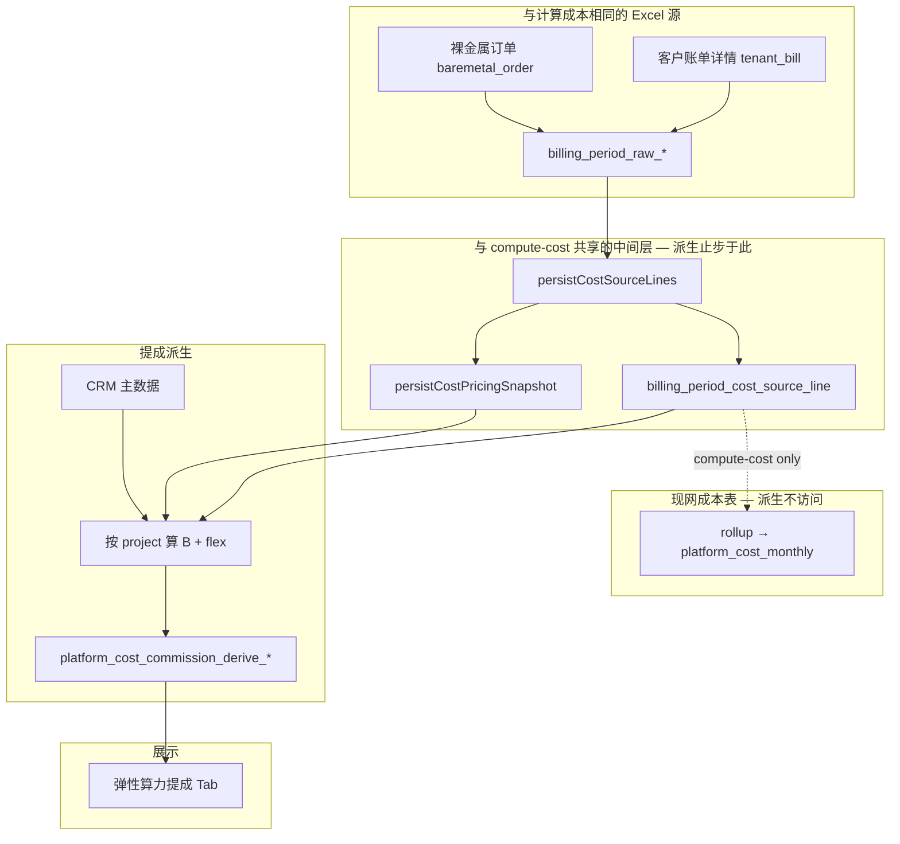

# 弹性算力提成周期派生 — 实现设计（独立模块）

> 版本：v2.1  
> 日期：2026-06-04  
> 状态：**设计稿 — 不涉及现网代码修改**  
> 政策执行期：**2026-05-01 ～ 2026-12-31**  
> 关联（实现参考，**非**运行时依赖）：  
> - `cost-compute-v3-redesign-with-examples.md`（`source_line`、定价快照语义）  
> - `billing-period-import-design.md`（§3.2 裸金属、§3.3 客户账单详情）  
> - `apps/web/src/lib/server/dataaccess/finance/compute-cost-source-line.ts`（Excel → `source_line`）  
> - `apps/web/src/lib/crm/commission-phase.ts`、`commission-constants.ts`  
> - `packages/db/src/finance-schema.ts`（`billing_period_raw_*`、`billing_period_cost_source_line`）  
> - `packages/db/src/crm-schema.ts`（项目、四人组、商机来源）

**本文档为自包含设计**；不引用、不依赖 `elastic-compute-commission-design.md`，亦 **不读取** `platform_cost_monthly`。

---

## 1. 背景与目标

### 1.1 政策摘要

**通用类业务（按毛利）— 弹性算力类业务及衍生业务**

| 维度 | 内容 |
| ---- | ---- |
| 基数 | **项目月度毛利基数** `B(project, 结算月)`：该经营项目在结算自然月内的毛利合计；教学式 ≈ 该项目弹性算力消费 × 毛利率 |
| 提成 | 提成金额 = `B` × 提点（按项目计算后汇总到人/部门） |
| 分段 | 成交后 **1～6 月** 与 **第 7 月～2026-12** 两套提点；满 6 月自动切换 |
| 发放 | 仅核心执行人员；**一级部门经理**（`position = 经理`）不参与销售个人提成；市场/中台为 **部门池**（本期不做池内到人） |
| 销售个人 | 政策「销售个人」= **项目客户经理**（`account_manager`，结算月有效） |
| 中台 | 项目关联 tenant 均视为业务上平台，`P = 100%` |

**商机来源编码**（`opportunity_source`）

| 编码 | 含义 |
| ---- | ---- |
| `marketing_sales` | 市场 + 销售 |
| `sales_self` | 销售自拓 |
| `exec_sales` | 高管管理层 + 销售 |

**提点矩阵**（占 `B` 的比例；实现落 `COMMISSION_POLICY_RATES`，见 §11）

| 商机来源 | 受益方 | `months_1_6` | `months_7_to_2026_12` |
| -------- | ------ | ------------ | --------------------- |
| 市场+销售 | 销售个人 | 10% | 7% |
| 市场+销售 | 市场部门 | 3% | 3% |
| 市场+销售 | 中台 | 3% | 6% |
| 销售自拓 | 销售个人 | 15% | 15% |
| 销售自拓 | 市场部门 | 0% | 0% |
| 销售自拓 | 中台 | 3% | 6% |
| 高管+销售 | 销售个人 | 12% | 9% |
| 高管+销售 | 市场部门 | 0% | 0% |
| 高管+销售 | 中台 | 3% | 6% |

**教学样例**（单项目、单结算月：`C=100,000`，`R=25%`，`B=25,000`，阶段 1～6 月）

| 场景 | 商机来源 | 销售个人 | 市场 | 中台 |
| ---- | -------- | -------- | ---- | ---- |
| 1 | 市场+销售 | 2,500 | 750 | 750 |
| 2 | 销售自拓 | 3,750 | 0 | 750 |
| 3 | 高管+销售 | 3,000 | 0 | 750 |

### 1.2 功能目标（G1～G4）

| # | 目标 | 说明 |
| - | ---- | ---- |
| G1 | **独立派生** | 新 pipeline + 新表；**不读、不写** `platform_cost_monthly` |
| G2 | **客户经理分段** | 按 `month_phase` 汇总：分段毛利 + 销售个人提成 |
| G3 | **部门分段汇总** | 市场、中台按 `month_phase` 汇总 `B` 与部门池提成 |
| G4 | **项目钻取** | 账期 × 项目展示 `B`、月序、商机来源、各方提成 |

### 1.3 非目标

- 不修改 `compute-cost` / `compute-cost-rollup` / `platform_cost_monthly`。  
- 不与 `platform_cost_monthly` 对账、联动、JOIN。  
- 不实现部门池内二次分配到人。  
- 不实现工资发放导出（仅经营分析 / 提成试算快照）。

### 1.4 术语

| 术语 | 含义 |
| ---- | ---- |
| **项目月度毛利基数 `B`** | 具体项目在某一结算月的毛利合计；汇总为 **Σ B(项目)** |
| **客户经理 / AM** | `account_manager_staff_id`，销售个人提成与分段毛利 **同人** |
| **`month_phase`** | `months_1_6` / `months_7_to_2026_12`；锚点 `deal_closed_month`（§4.3） |

---

## 2. 与 `platform_cost_monthly` 的边界（必读）

二者 **业务无关、数据无关**：

| 维度 | `platform_cost_monthly` | 本派生模块 |
| ---- | ----------------------- | ---------- |
| 用途 | 财务成本 Tab：AM×机房×卡型月结 | 弹性算力提成周期：项目×月序×角色 |
| 存储 | 现网表 `type=record/sum` | `platform_cost_commission_derive_*` |
| 本模块是否访问 | — | **禁止** SELECT / JOIN / 对账该表 |
| 公式 | `computeGrossProfit(收入,售出,赠送)` | **相同纯函数** |
| Excel 源 | 客户账单 + 裸金属 两个 Excel | **同一套** Raw → `source_line` 链路（§3.1） |

**唯一共性**：单行毛利公式与 `apps/web/src/lib/finance/cost-row-utils.ts` 中 `computeGrossProfit` 一致：

```
gross_profit_line = confirmed_revenue_excl_tax
                  − sold_duration_cost_excl_tax
                  − gifted_duration_cost_excl_tax
```

**本模块合法输入**（与 `computeBillingPeriodCost` **同源**，止于 `source_line`，**不**读 PCM）：

```
billing_period（不要求 published，§3.2）
  → Excel① 客户账单详情 tenant_bill  → billing_period_raw_tenant_bill
  → Excel② 裸金属订单 baremetal_order → billing_period_raw_baremetal_order
  → persistCostSourceLines（与 compute-cost 复用）
  → persistCostPricingSnapshots（与 compute-cost 复用）
  → billing_period_cost_source_line（含 project_id）
  → CRM 主数据（项目、商机来源、成交月、客户经理、职位）
```

**禁止**：`platform_cost_monthly`、`rollupSourceLinesToPlatformMonthly`、任何读取 PCM 的逻辑。  
**不依赖**：`platform_income_monthly`、企业收入三类 Excel、`billing_period.status = published`。

---

## 3. 数据源与触发

### 3.1 Excel 源数据（与 `platform_cost_monthly` 计算同源）

与现网 **「计算成本」**（`computeBillingPeriodCost`）使用 **相同两份 Excel**，解析后写入 Raw 表，再生成 `source_line`：


| 槽位 | `file_type` | Raw 表 | 说明 |
| ---- | ----------- | ------ | ---- |
| Excel ① | `tenant_bill` | `billing_period_raw_tenant_bill` | 客户账单详情（按账期 `tenant_bill` 时间窗，整月通常为 **1 个** 窗 × 1 文件） |
| Excel ② | `baremetal_order` | `billing_period_raw_baremetal_order` | 裸金属消费订单（格式与成本 Tab 一致） |

**不要求**上传「客户消费汇总」等企业收入 Excel；提成派生的消费与毛利 **均来自** 上述 Raw → `source_line` 链路。

派生批处理与成本计算的 **分界**：

```
persistCostSourceLines + persistCostPricingSnapshots   ← 派生复用（与 compute-cost 相同）
rollupSourceLinesToPlatformMonthly                     ← 仅 compute-cost；派生禁止调用
platform_cost_commission_derive_*                      ← 仅派生
```

### 3.2 账期状态与前置条件

**不要求** `billing_period.status = published`（亦 **不** 以发布作为业务门闩）。

`assertDerivePreconditions(billingPeriodId)` 与 `assertCostComputePreconditions` **对齐** 的部分：


| 检查项 | 规则 |
| ------ | ---- |
| 账期存在 | 非 `void` |
| Excel | 各 `tenant_bill` 窗 + `baremetal_order` 均已上传且 `parseStatus = ok`（文案同：「须已解析的客户账单与裸金属订单」） |
| 定价 | 区域×卡型成本配置齐全（否则 `pending_pricing`，与成本计算一致） |
| 多项目分成 | 无待处理 `pending_allocation`（与成本计算一致） |
| 禁止状态 | `import_error` 阻断 |

**与 compute-cost 的差异**：


| 项 | `compute-cost` | 本派生 |
| -- | -------------- | ------ |
| `published` / `adjusted` | 禁止重算成本 | **允许** 跑派生（见下） |
| 中间层刷新 | 会 purge 并重建 `source_line` | 见 §3.3 |

**已发布账期**（`published` / `adjusted`）：现网禁止再次 `compute-cost`，故派生 **只读** 账期内 **已有** `billing_period_cost_source_line` / 定价快照，**不** 调用 `persistCostSourceLines` 覆盖（避免与「已发布不可重算」冲突）。若尚无 `source_line`（历史脏数据），返回明确错误：「须先具备成本源行或撤回发布后重算成本」。

**未发布账期**（`draft` / `imported` / `computed` / …）：派生前 **先** 调用 `persistCostSourceLines` + `persistCostPricingSnapshots` 刷新中间层（与点击「计算成本」前半段一致），再算 `B`；**仍不** 调用 rollup、**不** 写 PCM。

### 3.3 架构



**触发**：财务账期页独立按钮 / `finance.commissionDerive.run`；**不** 要求先发布账期，**不** 要求先点「计算成本」写 PCM（但未发布时若无 `source_line` 会自动跑 §3.2 前半段生成）。

---

## 4. 计算口径

### 4.1 项目月度毛利基数 `B`

```
B(project, settlement_month)
  = Σ gross_profit_line(sl)
    OVER billing_period_cost_source_line sl
    WHERE sl.billing_period_id = 账期
      AND sl.project_id = project_id
      AND sl.kind IN ('flex', 'baremetal')
```

每行 `sl`：

1. 取 `data_center_id`、`gpu_card_type_id`、`balance_consumption`、卡时等；  
2. `loadResolvedPricingMap` + `computeLineFinancials`（与成本 pipeline **同工具库**，**不**读 PCM）；  
3. `gross_profit_line = computeGrossProfit(confirmed, sold, gifted)`。

**多项目共租户**：若账期存在租户→项目分成配置，在 **source_line 级** 按分成比例拆消费/毛利后再按 `project_id` 汇总；无配置时 100% 归唯一项目（与账期导入 G6 一致）。

### 4.2 弹性算力消费 `flex_consumption`（与成本源一致）

从 **同一账期** 的 `billing_period_cost_source_line` 按项目汇总（与 §3.1 Excel 源一致，**不** 读 `platform_income_monthly`）：

```
flex_consumption(project, 账期)
  = Σ parseMoney(sl.balance_consumption)
    OVER source_line sl
    WHERE sl.project_id = project
      AND sl.kind IN ('flex', 'baremetal')
```

- `flex` 行：余额消费来自客户账单 Excel；`baremetal` 行：裸金属订单 Excel 进入的成本源行。  
- **不使用** `sl.total_consumption` 代替余额口径（与成本 pipeline 一致）。  
- 用途：展示、`gross_profit_rate_display = B / flex`（分母为 0 则不除）；首消月判定（§4.3）用 `flex > 0`。

### 4.3 成交月 `deal_closed_month` 与月序 `month_phase`

| 规则 | 说明 |
| ---- | ---- |
| 写入时机 | 批处理首次发现某项目在某自然月 `flex_consumption > 0` 时，若 `project.deal_closed_month` 为空则写入该月 `YYYY-MM` |
| 与转正日关系 | `project_conversion_setting.conversion_date` **仅经营展示**，**不**写入 `deal_closed_month` |
| 月序计算 | 复用 `computeCommissionMonthPhase(dealClosedMonth, settlementMonth, project.commission_month_phase)` |
| 锁定 | 进入 `months_7_to_2026_12` 后可写 `project.commission_month_phase` 锁定（现有 `project-commission-phase.ts`） |
| 政策期外 | `settlement_month > 2026-12` → `month_phase = null`，项目跳过提成行 |

```
months_since_deal = monthDiff(settlement_month, deal_closed_month) + 1
month_phase = months_1_6           if months_since_deal <= 6
            = months_7_to_2026_12  if months_since_deal >= 7 AND settlement_month <= 2026-12
```

同一项目在同一结算月只有一个 `month_phase`；`B` **整笔**归属该段。

### 4.4 商机来源解析

1. 读 `project_opportunity_source_assignment`：`effective_from <= 月末` 且 (`effective_to` 为空或 `>= 月初`)。  
2. 若无有效 assignment，用 `project.opportunity_source` 当前值。  
3. 为空 → `derive_issue` 记录 `missing_opportunity_source`，该项目 **跳过** 提成行（仍可有 `B` 展示行，见 §5.2）。

### 4.5 项目范围

纳入 `derive_project` 的项目须同时满足：

| 条件 | 说明 |
| ---- | ---- |
| 账期内有成本源 | 存在 `source_line.project_id = 该项目` 且 `kind ∈ (flex, baremetal)` |
| 业务线 | `project.business_line_id` 属于配置的「弹性算力类」业务线 ID 列表（`DERIVE_ELASTIC_BUSINESS_LINE_IDS`，环境配置或字典表） |
| 政策窗 | `settlement_month` 在 2026-05 ～ 2026-12 |

### 4.6 客户经理与职位过滤

```
amId = resolveEffectiveAccountManager(projectId, settlementMonth)
  -- project_staff_assignment.role_type = 'account_manager'
  -- effective_from / effective_to 覆盖 settlement_month
```

| 情况 | 处理 |
| ---- | ---- |
| `amId` 为空 | `derive_issue`: `missing_account_manager`；不生成 `sales_individual` / `account_manager_gross` |
| `user_staff.position = '经理'` | 不生成 `sales_individual`；`account_manager_gross` **可保留**（毛利展示） |
| `position` 为空 | 视同 `员工`（可发销售个人行） |

### 4.7 提点与中台比例

```
lookupPolicyRates(opportunity_source, month_phase) → { sales, marketing, middle }

commission_sales     = B × sales_rate
commission_marketing = B × marketing_rate   -- 0 则不写 marketing 行
commission_middle    = B × 1 × middle_rate
```

`rate` 写入 `derive_line.rate` 快照；政策版本 `policy_code = elastic_gross_2026h2`。

### 4.8 毛利率（派生域，可选录入）

表 `platform_cost_commission_derive_gross_profit_rate`：

| 字段 | 说明 |
| ---- | ---- |
| `billing_period_id` | 账期 |
| `project_id` | NULL = 账期默认；非 NULL = 项目覆盖 |
| `rate` | 0～1 |
| `updated_at` / `updated_by` | 审计 |

- 未录入时：`rate_display = B / flex_consumption`（仅展示）。  
- **计算提成始终以 `B` 为准**，不以 `C × R` 反推替代 `B`。

---

## 5. 数据模型

### 5.1 `platform_cost_commission_derive_run`

| 字段 | 说明 |
| ---- | ---- |
| `id` | PK |
| `billing_period_id` | FK |
| `policy_code` | `elastic_gross_2026h2` |
| `status` | `running` / `calculated` / `failed` |
| `started_at` / `finished_at` | |
| `error_summary` | |

唯一建议：`billing_period_id` + `policy_code`（重跑时递增 `run_version` 或软删旧 run）。

### 5.2 `platform_cost_commission_derive_project`

| 字段 | 说明 |
| ---- | ---- |
| `run_id`, `project_id` | UK |
| `settlement_month` | `period_code` |
| `flex_consumption`, `gross_profit_base` | `B` |
| `gross_profit_rate_display` | 可选 |
| `opportunity_source`, `deal_closed_month`, `month_phase`, `months_since_deal` | 快照 |
| `account_manager_staff_id` | 客户经理 |
| `revenue_department` | 展示 |
| `skipped_commission` | bool：缺商机来源等导致未出提成行 |

### 5.3 `platform_cost_commission_derive_line`

| 字段 | 说明 |
| ---- | ---- |
| `run_id`, `project_id`, `recipient_role` | UK |
| `recipient_staff_id` | 客户经理（销售/毛利行） |
| `recipient_dept` | `市场` / `中台` |
| `month_phase`, `rate`, `platform_ratio` | |
| `gross_profit_base`, `commission_amount` | |

`recipient_role` 枚举：`sales_individual` | `account_manager_gross` | `marketing_dept_pool` | `middle_office_dept_pool`。

### 5.4 `platform_cost_commission_derive_am_phase`（rollup）

| 字段 | 说明 |
| ---- | ---- |
| `run_id`, `account_manager_staff_id`, `month_phase` | UK |
| `project_count` | |
| `gross_profit_base_sum` | Σ B（毛利展示桶） |
| `sales_commission_sum` | Σ 销售个人提成 |
| `flex_consumption_sum` | 可选 |

### 5.5 `platform_cost_commission_derive_dept_phase`（rollup）

| 字段 | 说明 |
| ---- | ---- |
| `run_id`, `recipient_dept`, `month_phase` | UK |
| `gross_profit_base_sum`, `commission_pool_sum`, `project_count` | |

### 5.6 `platform_cost_commission_derive_issue`（异常清单）

| 字段 | 说明 |
| ---- | ---- |
| `run_id`, `project_id`, `code` | UK |
| `message` | |
| `code` 枚举 | `missing_excel_imports` / `missing_source_lines` / `pending_pricing` / `pending_allocation` / `missing_account_manager` / `missing_opportunity_source` / `missing_month_phase` / `manager_excluded_sales` / `outside_policy_window` |

---

## 6. 核心算法

### 6.1 批处理 `derivePlatformCostCommissionPhase`

```
async function derivePlatformCostCommissionPhase(billingPeriodId):

  period = loadBillingPeriod(billingPeriodId)
  await assertDerivePreconditions(billingPeriodId)  // §3.2：双 Excel 等；不要求 published

  run = createDeriveRun(billingPeriodId)
  deleteDeriveChildren(run.id)  // 重跑幂等；仅删 derive 表，不 purge PCM

  if period.status in ('published', 'adjusted'):
    assertExistingCostSourceLines(billingPeriodId)  // 只读已有 source_line
  else:
    await persistCostSourceLines({ ... })           // 与 compute-cost 复用
    await persistCostPricingSnapshots({ ... })

  projectIds = listProjectsWithCostLines(billingPeriodId) ∩ elasticBusinessLines

  for projectId in projectIds:
    if !inPolicyWindow(period.periodCode): recordIssue(...); continue

    B = computeProjectGrossProfitBase(projectId, billingPeriodId)      // §4.1
    flex = computeProjectFlexConsumption(projectId, billingPeriodId) // §4.2
    maybeWriteDealClosedMonth(projectId, period.periodCode, flex)

    opp = resolveOpportunitySource(projectId, period.periodCode)     // §4.4
    phase = await resolveCommissionPhase(projectId, period.periodCode)
    amId = resolveEffectiveAccountManager(projectId, period.periodCode)
    position = amId ? loadStaffPosition(amId) : null

    upsertDeriveProject(run, { B, flex, opp, phase, amId, ... })

    if !phase.monthPhase:
      recordIssue(run, projectId, 'missing_month_phase')
      continue

    if !opp:
      markSkippedCommission(run, projectId)
      continue

    rates = lookupPolicyRates(opp, phase.monthPhase)

    if amId && position != '经理':
      insertLine(..., sales_individual, amId, B, rates.sales)
    else if amId && position == '经理':
      recordIssue(run, projectId, 'manager_excluded_sales')

    if amId:
      insertLine(..., account_manager_gross, amId, B, rate=0, commission=0)

    if rates.marketing > 0:
      insertLine(..., marketing_dept_pool, dept='市场', B, rates.marketing)
    if rates.middle > 0:
      insertLine(..., middle_office_dept_pool, dept='中台', B, rates.middle)

  materializeAmPhaseRollup(run)
  materializeDeptPhaseRollup(run)
  run.status = 'calculated'
```

### 6.2 内部一致性校验（仅派生域）

```
assert Σ derive_project.gross_profit_base
     ≈ Σ derive_line.gross_profit_base WHERE role IN (sales, marketing, middle)
     -- 按项目唯一 B 核对，不含 account_manager_gross 双计
```

**不做** 与 `platform_cost_monthly` 的总额比对。

### 6.3 模块与文件（建议）

| 文件 | 职责 |
| ---- | ---- |
| `derive-platform-cost-commission-phase.ts` | 批处理入口 §6.1、`assertDerivePreconditions` |
| `derive-project-gross-profit.ts` | §4.1 按项目汇总 `B`（读 `source_line`） |
| `derive-project-flex-consumption.ts` | §4.2（读 `source_line`） |
| `derive-commission-policy-rates.ts` | §4.7 矩阵 |
| `derive-commission-rollup.ts` | §5.4、§5.5 物化 |
| `derive-commission-issues.ts` | §5.6 |

**允许 import**：`cost-row-utils`、`cost-pricing-utils`、`compute-cost-pricing-snapshot`（读快照）、`commission-phase.ts`。  
**禁止 import**：`compute-cost-rollup.ts` 的 `rollupSourceLinesToPlatformMonthly`；任何查询 `platformCostMonthly` 的 DAO。

---

## 7. API 与 UI

### 7.1 tRPC（`finance.commissionDerive.*` 新命名空间）

| 过程 | 说明 |
| ---- | ---- |
| `run` | `{ billingPeriodId }` → 触发 §6.1 |
| `getByPeriod` | 返回 run + `derive_project` + rollup + issues |
| `getAmPhaseSummary` | `{ billingPeriodId, staffId? }` → §5.4 |
| `getDeptPhaseSummary` | `{ billingPeriodId, dept: 市场\|中台 }` → §5.5 |
| `listProjectLines` | 项目钻取 + line 明细 |

权限：与账期成本计算同级（`admin` / 财务角色）。

### 7.2 财务 UI

路径：`/finance/[id]/cost` 增加 Tab **「弹性算力提成」**（与现网成本表格 **并列**，数据 **仅** 来自 derive API）。

| 列 / 区块 | 内容 |
| --------- | ---- |
| 客户经理 | 姓名；`months_1_6` 毛利 / 提成；`months_7_to_2026_12` 毛利 / 提成；合计 |
| 市场 / 中台 | 两段：`B` 合计、池提成合计、项目数 |
| 项目表 | 项目名、`B`、`flex`、`month_phase`、商机来源、销售/市场/中台提成 |
| 异常 | `derive_issue` 列表，可导出 |

### 7.3 CRM（可选）

`ProjectCommissionInfoCard`：`getByPeriod` 过滤 `project_id`，展示当月 `B`、`month_phase`、提成明细（只读）。

---

## 8. 分期实施

| 阶段 | 交付 | 依赖 |
| ---- | ---- | ---- |
| **P0** | Drizzle 迁移 §5.1～5.6；`COMMISSION_POLICY_RATES` 常量 | — |
| **P1** | §3.1～3.2 前置 + §4.1～4.2 + §6.1（无 UI） | 账期已上传双 Excel 且解析成功 |
| **P2** | CRM 规则 §4.3～4.6 + issues | P1 |
| **P3** | rollup §5.4～5.5 + tRPC | P2 |
| **P4** | 财务 Tab + 项目卡 | P3 |
| **P5** | `derive_gross_profit_rate` 维护 UI（可选） | P4 |

---

## 9. 验收用例

| # | 条件 | 期望 |
| - | ---- | ---- |
| T1 | `B=25000`, `marketing_sales`, `months_1_6` | 销售 2500、市场 750、中台 750；分段毛利 25000 |
| T2 | `sales_self`, `months_1_6` | 销售 3750、市场 0、中台 750 |
| T3 | `exec_sales`, `months_1_6` | 销售 3000、市场 0、中台 750 |
| T4 | `R` 30% 且 `B` 同比 ×1.2 | 各提成同比 ×1.2 |
| T5 | 成交 2026-05、结算 2026-11 | `months_7_to_2026_12`；场景 1 销售 1750 |
| T6 | 代码审查 | **无** `platform_cost_monthly` 的 import/查询 |
| T9 | 账期 `computed`、未 `published`，双 Excel 已上传 | 可跑派生；`B` 与 flex 来自 `source_line` |
| T10 | 账期 `published` | 可跑派生；**不** 调用 `persistCostSourceLines`；读已有 `source_line` |
| T7 | 客户经理 `position=经理` | 无 `sales_individual`；可有 `account_manager_gross` |
| T8 | 缺商机来源 | `derive_issue`；`skipped_commission=true` |

---

## 10. 附录

### 10.1 速查公式

```
B(project, 结算月) = Σ gross_profit_line(source_line | project, 账期)

commission_sales     = B × rate_sales(opp, phase)     → account_manager
commission_marketing = B × rate_mkt(opp, phase)       → 市场池
commission_middle    = B × rate_mid(opp, phase)       → 中台池，P=1

客户经理分段毛利 = Σ B  WHERE account_manager & month_phase
客户经理分段提成 = Σ commission_sales  WHERE 同上
```

### 10.2 政策费率常量（TypeScript 示意）

```typescript
export const COMMISSION_POLICY_RATES = {
  marketing_sales: {
    months_1_6: { sales: 0.1, marketing: 0.03, middle: 0.03 },
    months_7_to_2026_12: { sales: 0.07, marketing: 0.03, middle: 0.06 },
  },
  sales_self: {
    months_1_6: { sales: 0.15, marketing: 0, middle: 0.03 },
    months_7_to_2026_12: { sales: 0.15, marketing: 0, middle: 0.06 },
  },
  exec_sales: {
    months_1_6: { sales: 0.12, marketing: 0, middle: 0.03 },
    months_7_to_2026_12: { sales: 0.09, marketing: 0, middle: 0.06 },
  },
} as const
```

### 10.3 第 7 月切换数值（`B=25000`，市场+销售）

| 指标 | 1～6 月 | 7～12 月 |
| ---- | ------- | -------- |
| 销售个人 | 2,500 | 1,750 |
| 市场 | 750 | 750 |
| 中台 | 750 | 1,500 |
| 三方合计 | 4,000 | 4,000 |

---

## 11. 变更记录

| 版本 | 日期 | 说明 |
| ---- | ---- | ---- |
| v1.0～v1.2 | 2026-06-04 | 初稿迭代（口径、客户经理归属） |
| v2.0 | 2026-06-04 | **自包含**：移除对 `elastic-compute-commission-design` 的依赖；**明确禁止读取 `platform_cost_monthly`**；补全 §4 主数据、§5 issue 表、§6 模块划分、§7 API、§10 费率常量 |
| v2.1 | 2026-06-04 | **不要求 published**；数据源与成本计算一致（**客户账单 + 裸金属** 两 Excel → `source_line`）；`flex` 改从 `source_line` 汇总，不依赖 `platform_income_monthly` |
