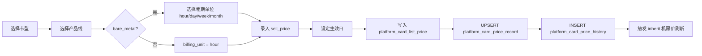
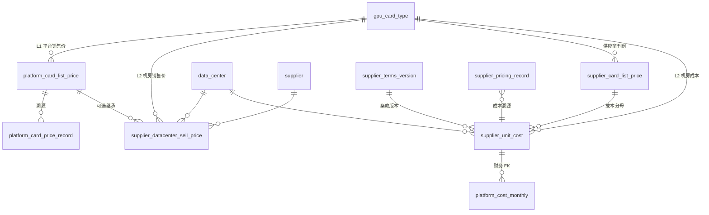

# 平台定价体系与定价管理设计

**依据**：

- 业务口径：平台级销售价格（按产品线 × 卡型）、供应商机房级销售价格与成本价格（按卡型 × 合作方式）
- 现有表结构：`apps/web/content/design/supplier-database.md`（v1.2）、`packages/db/src/supply-schema.ts`
- 财务衔接：`apps/web/content/design/billing-period-import-design.md`、`platform_cost_monthly.supplier_unit_cost_id`
- 前端入口：`/supplier/unit-costs`（`UnitCostsContent`）、`CreateCardPricingDialog`

**文档性质**：定价域逻辑设计（PostgreSQL 风格）；描述分层定价模型、表结构扩展建议、管理功能与上下游集成。**不涉及代码修改**。

**版本**：v1.0（2026-05-20）

---

## 1. 定价分层总览

算力平台的定价分为 **两个层级、三种价格类型**：

```
┌─────────────────────────────────────────────────────────────────────────┐
│  L1 平台级定价（Platform Catalog Price）                                 │
│  粒度：gpu_card_type × product_line [× billing_unit]                      │
│  性质：销售价格 — 面向客户的平台标准价 / 刊例价                             │
│  管理者：平台运营 / 产品定价                                               │
└─────────────────────────────────────────────────────────────────────────┘
                                    │
                                    │ 可覆盖 / 继承
                                    ▼
┌─────────────────────────────────────────────────────────────────────────┐
│  L2 供应商机房级定价（Supplier Datacenter Price）                         │
│  粒度：supplier × data_center × gpu_card_type × product_line             │
│         [× billing_unit] × cooperation_mode（成本侧）                      │
│  性质：                                                                   │
│    · 销售价格 — 该机房该卡型对外售卖单价（可不同于平台标准价）              │
│    · 成本价格 — 平台向供应商采购/结算单价（财务毛利核算基准）               │
│  管理者：商务 / 运营经理                                                   │
└─────────────────────────────────────────────────────────────────────────┘
```

| 层级 | 价格类型 | 用途 | 主要消费方 |
|------|----------|------|------------|
| L1 平台 | **销售价格** | 平台标准刊例；新机房默认定价参考；CRM/订单展示 | 客户、销售、计费引擎 |
| L2 机房 | **销售价格** | 区域/供应商差异化售卖价；资源池绑定后实际扣费基准 | 计费引擎、租户账单 |
| L2 机房 | **成本价格** | 供应商结算、月结成本行、毛利计算 | 财务、`platform_cost_monthly` |

**核心原则**：

1. **产品线维度不可省略**：同一卡型在「弹性服务部署」「云主机」「裸金属」「Job」「Spot」下的销售价格相互独立。
2. **裸金属按租期分开定价**：小时 / 天 / 周 / 月 为四个独立计价单元（`billing_unit`）。
3. **成本价与合作方式绑定**：卡时固定价（`card_time`）与分成（`revenue_share`）及各自阶梯变体，决定成本侧取值方式；销售价与合作方式 **无强制绑定**。
4. **销售价变更不自动联动成本价**；成本价变更不自动联动销售价（与现有 `supplier-database.md` R-S2.7 刊例/成交分离原则一致）。

---

## 2. 产品线与计价维度

### 2.1 产品线枚举（`product_line`）

与 CRM 消费记录、财务 Raw 导入、资源池大盘口径对齐：

| 代码 | 中文名（Excel/展示） | 说明 | 计价基准 |
|------|---------------------|------|----------|
| `elastic_service` | 弹性服务部署 | Serverless / 弹性算力池（`pool_code=platform`） | 元/卡时 |
| `cloud_vm` | 云主机 | 虚拟机实例（`pool_code=training`） | 元/卡时 |
| `bare_metal` | 裸金属 | 短租裸机（`pool_code=dedicated`） | 元/卡/租期单位 |
| `job` | Job | 批处理任务（`pool_code=inference`） | 元/卡时 |
| `spot` | Spot | 竞价/闲时算力 | 元/卡时（可带折扣系数） |

> **命名映射**：CRM 域历史代码 `serverless` 与 `elastic_service` 语义等价；落库建议统一为 `elastic_service`，应用层保留别名映射。

### 2.2 租期单位（`billing_unit`）

| 代码 | 适用产品线 | 说明 |
|------|-----------|------|
| `hour` | 除裸金属外全部；裸金属亦适用 | 默认，按卡时计费 |
| `day` | 仅 `bare_metal` | 按天时长包 |
| `week` | 仅 `bare_metal` | 按周时长包 |
| `month` | 仅 `bare_metal` | 按月时长包 |

非裸金属产品线固定 `billing_unit = hour`；裸金属必须显式指定租期单位，**同一卡型可并存四条价格行**。

### 2.3 合作方式（`cooperation_mode`）— 成本侧

沿用 `supplier-database.md` §3.2 定义，**仅作用于成本价格**：

| 代码 | 含义 | 成本取值 |
|------|------|----------|
| `card_time` | 固定卡时价 | `deal_unit_price_per_hour`（元/卡时） |
| `revenue_share` | 固定分成 | `revenue_share_percent`（供应商分成 %） |
| `tiered_card_time` | 阶梯卡时价 | `tier_json` / `supplier_pricing_tier` |
| `tiered_revenue_share` | 阶梯分成 | 同上，分成 % 按档 |

---

## 3. L1 平台级销售价格

### 3.1 业务说明

平台对 **每种 GPU 卡型** 维护一套 **平台刊例价（List Price）**，并按 **产品线**（及裸金属租期）分别定价。该价格是：

- 客户侧「标准价」与 CRM 报价参考；
- 新建供应商机房销售价时的 **默认值来源**（可一键继承后微调）；
- **不是** 供应商采购成本（成本在 L2）。

### 3.2 逻辑表：`platform_card_list_price`

| 列名 | 类型 | 约束 | 说明 |
|------|------|------|------|
| `id` | text | PK | |
| `gpu_card_type_id` | text | FK→`gpu_card_type`, NOT NULL | 卡型 |
| `product_line` | varchar(32) | NOT NULL | §2.1 枚举 |
| `billing_unit` | varchar(16) | NOT NULL DEFAULT `hour` | §2.2；裸金属必填 day/week/month |
| `sell_price` | numeric(15,4) | NOT NULL | **销售单价**（元/卡/单位） |
| `currency` | varchar(8) | NOT NULL DEFAULT `CNY` | |
| `effective_from` | date | NOT NULL | 生效日 |
| `effective_to` | date | 可空 | NULL = 当前有效 |
| `status` | varchar(32) | NOT NULL | `draft` / `active` / `archived` |
| `remark` | text | 可空 | |
| `updated_by_staff_id` | text | FK→`user_staff` | |
| `created_at` / `updated_at` | timestamptz | NOT NULL | |

**唯一约束**（部分唯一）：

```sql
UNIQUE (gpu_card_type_id, product_line, billing_unit)
  WHERE effective_to IS NULL AND status = 'active'
```

**索引**：`(gpu_card_type_id)`、`(product_line)`、`(effective_from DESC)`。

### 3.3 读模型：`platform_card_price_record`

平台侧「当前生效价」快照，结构类似 `supplier_pricing_record`：

| 列名 | 说明 |
|------|------|
| `gpu_card_type_id` | |
| `product_line` | |
| `billing_unit` | |
| `sell_price` | 当前销售单价 |
| `platform_card_list_price_id` | FK 溯源 |
| `effective_from` | |
| `updated_by_staff_id` | |

UK：`(gpu_card_type_id, product_line, billing_unit)`。

### 3.4 变更历史：`platform_card_price_history`

| 列名 | 说明 |
|------|------|
| `price_record_id` | FK→`platform_card_price_record` |
| `previous_sell_price` / `new_sell_price` | |
| `changed_at` | |
| `changed_by_staff_id` | |
| `reason` | 调价原因 |

### 3.5 平台定价示例

卡型 **NVIDIA RTX 4090** 的平台销售价格：

| product_line | billing_unit | sell_price（元） |
|--------------|--------------|------------------|
| elastic_service | hour | 12.0000 |
| cloud_vm | hour | 10.0000 |
| bare_metal | hour | 15.0000 |
| bare_metal | day | 280.0000 |
| bare_metal | week | 1800.0000 |
| bare_metal | month | 6500.0000 |
| job | hour | 8.0000 |
| spot | hour | 5.0000 |

---

## 4. L2 供应商机房级定价

### 4.1 业务说明

每个 **供应商 × 机房** 根据 **已接入 / 可售的卡型** 配置定价：

1. **销售价格**：该机房该卡型在指定产品线上的对外售卖单价；仅对已接入卡型维护（与 `supplier_gpu_inventory` / `supplier_device` 联动校验）。
2. **成本价格**：平台向该供应商采购的结算基准，由 **合作方式**（卡时 / 分成 / 阶梯）决定字段形态；财务月结 `platform_cost_monthly` 通过 `supplier_unit_cost_id` 追溯。

**与现有表的关系**：

| 概念 | 现有表 | 本设计定位 |
|------|--------|------------|
| 供应商刊例价 | `supplier_card_list_price.list_price_per_hour` | **保留**；语义调整为「供应商侧挂牌参考价」，可与机房销售价相同或仅用于商务洽谈展示 |
| 机房销售价 | *（缺失）* | **新增** `supplier_datacenter_sell_price` |
| 机房成本价 | `supplier_unit_cost` | **保留并明确**为成本侧唯一财务基准 |
| UI 当前价 | `supplier_pricing_record` | **扩展**为销售 + 成本双轨读模型，或拆为 sell/cost 两条 record |

### 4.2 逻辑表：`supplier_datacenter_sell_price`

| 列名 | 类型 | 约束 | 说明 |
|------|------|------|------|
| `id` | text | PK | |
| `supplier_id` | text | FK→`supplier`, NOT NULL | |
| `data_center_id` | text | FK→`data_center`, NOT NULL | |
| `gpu_card_type_id` | text | FK→`gpu_card_type`, NOT NULL | |
| `product_line` | varchar(32) | NOT NULL | |
| `billing_unit` | varchar(16) | NOT NULL DEFAULT `hour` | |
| `sell_price` | numeric(15,4) | NOT NULL | **机房销售单价** |
| `platform_card_list_price_id` | text | FK, 可空 | 继承自平台价时溯源 |
| `inherit_platform_price` | boolean | DEFAULT false | 是否自动跟随平台调价 |
| `currency` | varchar(8) | NOT NULL DEFAULT `CNY` | |
| `effective_from` | date | NOT NULL | |
| `effective_to` | date | 可空 | |
| `source` | varchar(64) | 可空 | `contract` / `manual` / `platform_inherit` |
| `remark` | text | 可空 | |
| `created_at` / `updated_at` | timestamptz | | |

**唯一约束**：

```sql
UNIQUE (supplier_id, data_center_id, gpu_card_type_id, product_line, billing_unit)
  WHERE effective_to IS NULL
```

**业务规则 R-P4.1**：仅允许对 `supplier_gpu_inventory` 中存在 `quantity > 0` 或历史曾接入的 `(data_center_id, gpu_card_type_id)` 维护销售价；新建接入批次 commit 后可提示「待定价卡型」。

**业务规则 R-P4.2**：`inherit_platform_price = true` 时，平台价变更触发异步刷新 `sell_price`（保留机房差价 `delta` 或比例 `multiplier` 的策略由应用层配置，默认 **等比跟随**）。

### 4.3 成本价格 — 沿用并扩展现有表

成本侧 **不新建表**，沿用 `supplier-database.md` §3.2 体系，并补充 **产品线** 维度说明：

#### `supplier_card_list_price`（供应商刊例价）

- 粒度：`supplier × data_center × gpu_card_type`（**不含产品线**）
- 字段：`list_price_per_hour` — 供应商商务挂牌价，作为成本洽谈「分母」
- 与销售价格关系：可与 `supplier_datacenter_sell_price`（某产品线）数值接近，但 **语义独立**

#### `supplier_unit_cost`（机房×卡型成本 — 财务基准）

| 字段 | 成本侧含义 |
|------|------------|
| `deal_unit_price_per_hour` | 卡时 / 阶梯卡时模式下的 **成交采购单价** |
| `revenue_share_percent` | 分成 / 阶梯分成模式下的 **供应商分成比例** |
| `deal_to_list_ratio` | 成交/刊例比例（阶梯划档依据） |
| `tier_json` | 机房×卡型级阶梯快照 |
| `pricing_mode`（经 record 冗余） | 合作计价方式 |

**扩展建议**（可选列，便于按产品线核算成本）：

| 列名 | 说明 |
|------|------|
| `product_line` | varchar(32), 可空 | 若合同按产品线差异化采购价则填写；空表示 **全产品线统一成本**（当前默认） |
| `billing_unit` | varchar(16), 可空 | 裸金属成本若按租期结算则区分；默认可空 = hour |

> **Phase 1 建议**：成本侧暂 **不拆产品线**，保持 `(supplier_terms_version, data_center, gpu_card_type)` 唯一；销售侧按产品线拆分。财务月结仍按现有 Raw（区域 × GPU 型号 × 卡时）匹配成本。后续若供应商合同按产品线差异化，再启用 `product_line` 列。

#### `supplier_pricing_record` 读模型扩展

当前表结构（`supply-schema.ts`）以 **成本展示** 为主（`unit_price_per_hour` = 成交卡时价）。扩展方案：

**方案 A（推荐）— 单 record 双价字段**：

| 新增列 | 说明 |
|--------|------|
| `sell_price_per_hour` | 默认产品线销售价（或 JSON 存多产品线） |
| `sell_prices_json` | jsonb，结构见下 |
| `price_kind` | `cost` / `sell` / `both`（默认 `both`） |

`sell_prices_json` 示例：

```json
{
  "elastic_service": { "billing_unit": "hour", "sell_price": "11.5000" },
  "cloud_vm": { "billing_unit": "hour", "sell_price": "9.8000" },
  "bare_metal": {
    "hour": "14.0000",
    "day": "260.0000",
    "week": "1700.0000",
    "month": "6200.0000"
  },
  "job": { "billing_unit": "hour", "sell_price": "7.5000" },
  "spot": { "billing_unit": "hour", "sell_price": "4.5000" }
}
```

**方案 B — 销售价独立表 + record 仅成本**：销售价全部进入 `supplier_datacenter_sell_price`（§4.2），`supplier_pricing_record` 保持成本只读。`/supplier/unit-costs` 页拆 Tab：**销售定价** / **成本定价**。

### 4.4 成本价与合作方式矩阵

同一 `(supplier, data_center, gpu_card_type)` 在 **一种生效条款版本** 下仅一条 `supplier_unit_cost`，但其 **计价方式** 由合同 `pricing_mode` 决定：

| pricing_mode | 成本字段 | 财务月结计算 |
|--------------|----------|--------------|
| `card_time` | `deal_unit_price_per_hour` | 售出卡时 × 单价 ÷ 1.06 |
| `revenue_share` | `revenue_share_percent` | 客户消费 × 分成 % ÷ 1.06 |
| `tiered_card_time` | `tier_json.tiers[]` | 按成交/刊例比例选档（§6.3） |
| `tiered_revenue_share` | `tier_json` + 分成 % | 同上 |

**分成模式**下不存在单一「元/卡时」成本，但可计算 **隐含成本** = `confirmed_revenue × revenue_share_percent` 供展示。

---

## 5. 定价解析优先级（运行时）

计费引擎 / 账单生成按以下顺序解析 **销售单价**：

```
1. 租户/项目级协议价（CRM 合同，若有）— 不在本文范围
2. supplier_datacenter_sell_price（精确匹配 product_line + billing_unit + 机房 + 卡型）
3. platform_card_list_price（平台标准价）
4. 拒绝计费 / 告警「缺失定价」
```

**成本单价**解析（财务月结 / 账期导入，对齐 `billing-period-import-design.md` §4.6.1）：

```
1. platform_cost_monthly.supplier_unit_cost_id → supplier_unit_cost（已计算行 FK 优先）
2. 卡型：gpu_card_type.code 与账单 gpu_model 精确匹配（trim + lower）
3. 机房：data_center.container_instance_region 与账单 region_code 精确匹配
4. supplier_pricing_record：as_of = period_end 有效窗口 + config_status = active + 字段完整
5. 若无账期窗口命中 → supplier_pricing_history 还原 period_end 时点快照（§4.6.2）
6. 仍失败 → supplier_unit_cost 历史条款（effective 覆盖 period_end）
7. supplier_gpu_inventory.card_time_cost_per_hour（展示缓存，不可作财务真值）
8. NULL → pending_pricing；按 card_type_not_found / region_not_found / pricing_pair_not_found 分级提示
```

---

## 6. 定价管理功能

### 6.1 路由与页面规划

| 路由 | 状态 | 定位 | 主要表 |
|------|------|------|--------|
| `/supplier/unit-costs` | ✅ 已有 | **成本定价**管理（卡型成本 Tab） | `supplier_pricing_record`、`supplier_unit_cost`、`supplier_pricing_history` |
| `/supplier/sell-prices` | 建议新增 | **机房销售定价**（按供应商/机房/卡型/产品线） | `supplier_datacenter_sell_price` |
| `/platform/pricing` 或 `/settings/platform-pricing` | 建议新增 | **平台标准价**维护 | `platform_card_list_price`、`platform_card_price_record` |
| `/supplier/suppliers/[id]` 详情 | ✅ 已有 | 嵌入卡型成本 Panel | 同上 |

**现有 `/supplier/unit-costs` 页面**（`UnitCostsContent`）定位调整建议：

- Tab **单价配置** → 重命名为 **成本定价**（明确 `unitPricePerHour` = 采购成本）
- Tab **变更历史** → 保留，展示 `supplier_pricing_history`
- Tab **卡型字典** → 保留 `gpu_card_type` 维护
- 新增 Tab **销售定价** → 维护 `supplier_datacenter_sell_price` 或 `sell_prices_json`
- 弹窗 `CreateCardPricingDialog` → 拆分为 **ConfigureCostPricingDialog** / **ConfigureSellPricingDialog**，或同一弹窗内 **价格类型** 切换

### 6.2 平台定价管理流程



**权限**：平台运营 / 管理员；变更须填写 `reason`。

### 6.3 供应商机房销售定价流程

1. 选择 **供应商 → 机房 → 卡型**（下拉仅展示已接入卡型）
2. 选择 **产品线**；裸金属追加 **租期单位**
3. 可选 **从平台价继承**（一键填充 + 可调差价）
4. 录入 **sell_price** → 写入 `supplier_datacenter_sell_price`
5. UPSERT 读模型；写 `supplier_pricing_history`（扩展 `price_type = sell`）+ `supplier_activity(pricing_change)`

### 6.4 供应商机房成本定价流程

与 `supplier-database.md` §7.2 一致：

1. 合同生效 → `supplier_contract.status = active`
2. INSERT `supplier_card_list_price`（供应商刊例价）
3. INSERT `supplier_terms_version` + `supplier_pricing_tier`（若阶梯）
4. INSERT `supplier_unit_cost`（成交采购价 / 分成比例）
5. UPSERT `supplier_pricing_record`（成本侧）
6. INSERT `supplier_pricing_history` + `supplier_activity`

`CreateCardPricingDialog` 当前 Mock 仍用 **累计卡时阶梯**（`thresholdFromHours`），与 v1.2 设计 **成交/刊例比例** 不符；落库以 `supplier-database.md` §3.2.1 为准。

### 6.5 列表页关键列

**平台定价列表**：

| 列 | 说明 |
|----|------|
| 卡型 | `gpu_card_type.name` |
| 产品线 | 中文名 |
| 租期单位 | hour/day/week/month |
| 销售单价 | sell_price |
| 生效日 | effective_from |
| 状态 | draft/active |

**机房销售定价列表**（`/supplier/sell-prices` 或 unit-costs 新 Tab）：

| 列 | 说明 |
|----|------|
| 供应商 / 机房 | |
| 卡型 | |
| 产品线 / 租期 | |
| 销售单价 | |
| 平台标准价 | JOIN 对比，显示差价 % |
| 是否继承平台价 | inherit_platform_price |

**机房成本定价列表**（现有 unit-costs）：

| 列 | 说明 |
|----|------|
| 供应商 / 机房 / 卡型 | |
| 合作方式 | pricing_mode |
| 刊例价 | list_price_per_hour |
| 成交成本价 | deal_unit_price_per_hour |
| 成交/刊例 | deal_to_list_ratio |
| 分成 % | revenue_share_percent |

---

## 7. 与现有数据库表结构对照

### 7.1 已有表 — 无需变更即可支撑成本侧

| 表 | 定价角色 |
|----|----------|
| `gpu_card_type` | 全局卡型字典，L1/L2 定价 FK |
| `supplier` / `data_center` | 机房归属 |
| `supplier_contract` | 合作方式、`pricing_mode` |
| `supplier_card_list_price` | 供应商刊例价（成本洽谈分母） |
| `supplier_pricing_tier` | 阶梯档（成交/刊例比例） |
| `supplier_terms_version` | 条款版本 |
| `supplier_unit_cost` | **成本价财务基准** |
| `supplier_pricing_record` | 成本侧 UI 读模型 |
| `supplier_pricing_history` | 成本变更历史 |
| `supplier_gpu_inventory` | 可售卡型校验；`card_time_cost_per_hour` 为展示缓存 |

### 7.2 建议新增表 — 支撑销售侧

| 表 | 优先级 | 说明 |
|----|--------|------|
| `platform_card_list_price` | P0 | 平台标准销售价 |
| `platform_card_price_record` | P0 | 平台当前价读模型 |
| `platform_card_price_history` | P1 | 平台调价审计 |
| `supplier_datacenter_sell_price` | P0 | 机房级销售价（按产品线） |
| `product_line_definition` | P2 | 产品线字典（可选；亦可 varchar + 应用枚举） |

### 7.3 建议扩展字段

| 表 | 字段 | 优先级 | 说明 |
|----|------|--------|------|
| `supplier_pricing_history` | `price_type` | P1 | `sell` / `cost` / `list` |
| `supplier_pricing_history` | `product_line`, `billing_unit` | P1 | 销售价变更溯源 |
| `supplier_unit_cost` | `product_line` | P2 | 分产品线差异化成本 |
| `platform_cost_monthly` | `product_line` | P2 | 成本行按产品线拆分毛利 |

### 7.4 ER 关系（定价子集）



---

## 8. 与财务、CRM、计费的集成

### 8.1 财务月结（`platform_cost_monthly`）

| 环节 | 说明 |
|------|------|
| 成本行 FK | `supplier_unit_cost_id` → 机房成本价，**与销售价格无关** |
| 匹配 | 机房 `container_instance_region` + 卡型 `gpu_card_type.code` **精确匹配**（§4.6.1） |
| 单价解析 | 按 `pricing_mode` 分支；`card_time` 用 `unit_price_per_hour`；分成用 `revenue_share_percent`；无账期窗口时回退 `supplier_pricing_history`（§4.6.2） |
| 阶梯落档 | 成交价 = `余额消费 / (券卡时 + 余额卡时)`，再 / 刊例价 得 `deal_to_list_ratio`；**禁止**按累计卡时跳档 |
| 毛利 | `gross_profit = confirmed_revenue_excl_tax - sold_duration_cost - gifted_duration_cost` |

**收入侧**来自 Raw 客户消费 / 裸金属订单，其金额已由 **销售定价** 在计费侧产生；财务导入 **不回写** 定价表。

### 8.2 CRM 消费记录

`consumption_record.product_line` 与本文 `product_line` 对齐；展示单价时可 JOIN：

- 平台价：`platform_card_price_record`
- 机房价：`supplier_datacenter_sell_price`（若有 `idc` + `card_type` 上下文）

### 8.3 资源池与产品线映射

与 `global-dashboard-period-analytics.md` §3.2 一致：

| 资源池展示 | pool_code | product_line |
|-----------|-----------|--------------|
| 弹性服务部署 | platform | elastic_service |
| 云主机 | training | cloud_vm |
| 裸金属短租 | dedicated | bare_metal |
| Job 任务 | inference | job |
| Spot | spot（待增） | spot |

设备经 `resource_pool_binding.workload_profile` 入池后，计费时使用对应 `product_line` 的价格行。

---

## 9. 关键业务规则汇总

| 编号 | 规则 |
|------|------|
| **R-P1** | 平台销售价按 `gpu_card_type × product_line [× billing_unit]` 唯一生效 |
| **R-P2** | 裸金属必须支持 hour/day/week/month 四档独立价格 |
| **R-P3** | 机房销售价仅对已接入卡型维护；未定价卡型不可对外售卖（或回退平台价，需配置） |
| **R-P4** | 机房成本价由合同 `pricing_mode` + `cooperation_mode` 决定，通过 `supplier_unit_cost` 落库 |
| **R-P5** | 销售价与成本价独立变更，互不同步 |
| **R-P6** | 平台刊例变更不自动改变机房成本价；机房成本刊例变更不自动改变成交价（沿用 R-S2.7） |
| **R-P7** | `inherit_platform_price=true` 的机房销售价可随平台价自动刷新 |
| **R-P8** | 阶梯划档以 **成交/刊例比例** 为准，不以累计卡时 |
| **R-P9** | 所有调价写 history + `supplier_activity` / 平台侧 activity |
| **R-P10** | Spot 价格不得高于同卡型 `elastic_service` 同机房销售价（可选校验，防配置错误） |

---

## 10. 用户故事

| ID | 角色 | 故事 | 验收 |
|----|------|------|------|
| US-P1 | 平台运营 | 维护各卡型在 5 条产品线上的平台标准价 | `platform_card_price_record` 唯一；裸金属四租期齐全 |
| US-P2 | 商务 | 为新接入机房某卡型配置低于平台价的促销销售价 | `supplier_datacenter_sell_price` 生效；不影响 `supplier_unit_cost` |
| US-P3 | 商务 | 按合同约定录入机房采购成本（卡时/分成） | `supplier_unit_cost` FK 可被财务成本行引用 |
| US-P4 | 运营经理 | 在 unit-costs 页对比销售价与成本价算毛利空间 | 列表展示 sell vs deal 及差价率 |
| US-P5 | 财务 | 月结成本行追溯到 `supplier_unit_cost` | 现有 `platform_cost_monthly` 集成不变 |
| US-P6 | 运营经理 | 查看某卡型调价历史 | `supplier_pricing_history` + `platform_card_price_history` |

---

## 11. 分阶段落地建议

| 阶段 | 内容 | 依赖 |
|------|------|------|
| **Phase 0** | 文档化双轨定价；unit-costs 文案区分「销售/成本」 | 本文档 |
| **Phase 1** | 新增 `platform_card_*` + `supplier_datacenter_sell_price` 表；平台定价页 | Drizzle migration |
| **Phase 2** | 扩展 unit-costs 销售定价 Tab；`CreateCardPricingDialog` 阶梯 UI 迁移为成交/刊例比例 | `supplier-database.md` v1.2 |
| **Phase 3** | 计费引擎对接价格解析 §5；inherit 平台价自动刷新 | 计费服务 |
| **Phase 4** | 成本侧按产品线拆分（可选）；CRM 报价单引用平台价 | 商务需求 |

---

## 12. 附录：名词对照

| 中文 | 英文字段 / 表 | 层级 | 性质 |
|------|--------------|------|------|
| 平台销售价 / 平台刊例价 | `platform_card_list_price.sell_price` | L1 | 销售 |
| 机房销售价 | `supplier_datacenter_sell_price.sell_price` | L2 | 销售 |
| 供应商刊例价 | `supplier_card_list_price.list_price_per_hour` | L2 | 参考 / 成本分母 |
| 成交成本价 / 采购单价 | `supplier_unit_cost.deal_unit_price_per_hour` | L2 | 成本 |
| 分成比例 | `supplier_unit_cost.revenue_share_percent` | L2 | 成本 |
| 当前生效成本 | `supplier_pricing_record.unit_price_per_hour` | L2 | 成本读模型 |

---

**变更记录**

| 版本 | 日期 | 说明 |
|------|------|------|
| v1.0 | 2026-05-20 | 首版：L1 平台销售价 + L2 机房销售/成本双轨；对齐 supplier-database v1.2 与 unit-costs 页面 |
