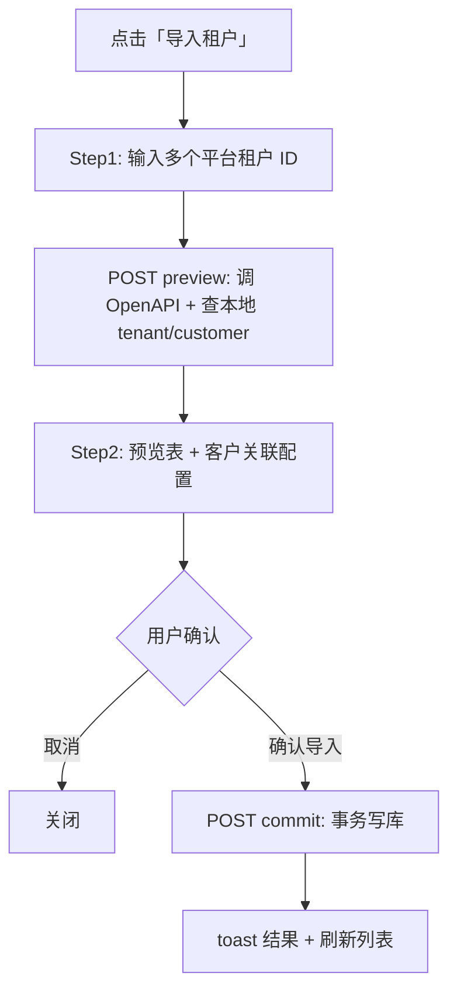

# 平台租户 ID 批量导入设计方案

> 版本：v1.0（设计稿）  
> 日期：2026-05-20  
> 状态：**设计稿 — 确认后再实施代码**  
> 关联：`crm-tenants-list-client.tsx`、`billing-tenants.ts`、`crm-tenant-import-dialog.tsx`（Excel）、`packages/db/src/crm-schema.ts`（`customer` / `tenant`）

---

## 1. 目标与原则

### 1.1 业务目标

| # | 目标 | 说明 |
|---|------|------|
| G1 | 按平台租户 ID 拉取 | 用户在弹窗输入多个平台租户 ID，系统调用算算力 OpenAPI 拉取租户详情 |
| G2 | 写入/更新 `tenant` 表 | 以 `platform_tenant_id` 为幂等键：不存在则插入，已存在则更新 **租户侧** 字段 |
| G3 | 客户关联由用户确认 | 第二步引导用户为每条租户选择「关联已有客户」或「新建客户」；**不修改已有客户的任何字段** |
| G4 | 与 Excel 导入并存 | 「导入租户」（平台 ID）与「导入 Excel」（余额/欠费/授信）为两条独立入口，互不替代 |

### 1.2 非目标（本期）

- 不通过本流程修改已存在 `customer` 的字段（名称、联系人、类型等）
- 不支持将已入库租户 **改绑** 到其他客户（若需改绑，走租户详情/客户管理单独功能）
- 不拉取分页全量列表（仅按用户输入的 ID 批量查询）
- 不同步平台侧项目、合同、消费明细等扩展数据

### 1.3 设计原则

1. **平台请求走服务端**：浏览器不直连 `openapi.suanli.cn`，避免 CORS 与凭证泄露。
2. **两步提交**：先 **预览**（只读拉取 + 本地比对），再 **确认入库**（写库事务）。
3. **客户域与计费域分离**：与 schema 注释一致——`customer` 存经营主体，`tenant` 存计费账户；平台 `coin` 等只落 `tenant`。
4. **幂等**：同一 `platform_tenant_id` 重复导入时更新 tenant，不重复创建 tenant 行。

---

## 2. 外部 API

### 2.1 请求

| 项 | 值 |
|----|-----|
| 方法 | `GET` |
| Base | `https://openapi.suanli.cn` |
| Path | `/api/admin/tenant/list` |
| 关键 Query | `tenant_tids={id1,id2,id3}`（**半角逗号**分隔，无空格） |
| 其它 Query | `tenant_type=`、`tenant_name=`、`remark=`、`start_time=`、`end_time=`、`page=1`、`page_size=20` |

示例：

```
GET https://openapi.suanli.cn/api/admin/tenant/list?tenant_type=&tenant_name=&remark=&tenant_tids=16462,16463&start_time=&end_time=&page=1&page_size=20
```

> **参数名说明**：接口文档与示例使用 `tenant_tids`（非 `tenant_ids`）。实现时以 `tenant_tids` 为准。  
> **分页**：`page_size` 需 ≥ 本次请求的 ID 数量；实现时取 `max(20, ids.length)` 或固定上限（如 100）并在超出时拆批请求。

### 2.2 响应（节选）

```json
{
  "code": "0000",
  "message": "success",
  "data": {
    "results": [ { "id": 16462, "tenant_name": "...", ... } ],
    "count": 1
  }
}
```

| 场景 | 处理 |
|------|------|
| `code !== "0000"` | 整批失败，展示 `message` |
| 某 ID 不在 `results` | 预览表标记「平台未返回」，不可勾选入库 |
| `results` 数量 < 输入 ID 数 | 列出缺失 ID，允许用户对命中项继续 |

### 2.3 鉴权（待确认）

OpenAPI 通常需要 Admin Token / Cookie / API Key。建议：

| 配置项 | 说明 |
|--------|------|
| `SUANLI_OPENAPI_BASE_URL` | 默认 `https://openapi.suanli.cn` |
| `SUANLI_OPENAPI_TOKEN` 或 `SUANLI_OPENAPI_COOKIE` | 服务端请求头，**不暴露给前端** |

> **需产品/运维确认**：正式环境的认证方式与 Header 名称（如 `Authorization: Bearer …`）。

---

## 3. 字段映射

### 3.1 平台 → `tenant`（写入/更新）

| 平台字段 | DB 列 | 规则 |
|----------|--------|------|
| `id` | `platform_tenant_id` | 字符串化，唯一键 |
| `tenant_name` | `name` | 优先；空则用 `admin_phone` 或 `租户-{id}` |
| `admin_phone` | `phone` | 可空 |
| `coin` | `balance` | 数值；平台单位为「分」或「元」**需确认**（见 §9） |
| `limit_coin` | `credit_limit` | 可空；单位同 `coin` |
| `insufficient_balance` | `overdue_at` | 若为非空时间戳/日期则写入；若为布尔仅表示欠费则 **不写入** 或写入 `now()`（需确认） |
| — | `status` | 新建默认 `active`；已存在 **保留原 status** |
| — | `is_default` | 新建且客户下无 tenant 时 `true`，否则 `false`；已存在 **不改** |
| — | `customer_id` | 第二步用户选定；已存在 tenant **保留原 customer_id**（本期不改绑） |

**已存在 tenant 的更新范围（建议）**：

- 更新：`name`、`phone`、`balance`、`credit_limit`、`overdue_at`（与 Excel 导入「仅更新余额/欠费/授信」不同，本平台导入以平台为准同步展示字段）
- 不更新：`customer_id`、`is_default`、`status`

> 若希望与 Excel 导入一致（已存在仅更新 balance/overdue/credit），请在评审时二选一；**默认采用「同步 name/phone + 余额类」**。

### 3.2 平台 → `customer`（仅「新建客户」时）

| 平台字段 | DB 列 | 规则 |
|----------|--------|------|
| `company_name` | `name`、`account_name` | 优先公司名 |
| `tenant_name` / `admin_phone` | `name` 回退 | 无公司名时用手机号或租户名 |
| `contact_user` | `contact_person` | 可空字符串 |
| `contact_phone` | `contact_phone` | 可空；空则用 `admin_phone` |
| — | `type` | 默认 `C`；用户可在预览步改为 `B` |
| — | `status` | 默认 `active` |
| — | 其它 | `contact_email`、`industry`、`address` 等默认空，与 Excel 导入一致 |

**关联已有客户**：只写 `tenant.customer_id`，**不对 `customer` 表执行 UPDATE**。

### 3.3 平台字段（本期忽略）

`tenant_type`、`merchant_id`、`billing_type`、`strategy_type`、`harbor_config`、`deployment_limit`、`invitation_config`、`metal_strategy_type` 等——不入库，仅在预览表只读展示。

---

## 4. 端到端流程



### 4.1 输入解析规则

- 支持：半角逗号、中文逗号、换行、空格分隔
- 去重、去空；仅保留纯数字 ID（`/^\d+$/`）
- 单次上限建议 **50** 个（可配置），超出提示拆分

### 4.2 本地比对（preview）

对每条平台 `id`：

| `localTenant` | 展示 | 客户关联 UI |
|---------------|------|-------------|
| 不存在 | 新租户 | 必选：新建 / 关联已有 |
| 已存在 | 将更新 tenant | **锁定** 当前 `customer_id`，只读展示客户名；不展示「改绑」 |

### 4.3 提交（commit）

单事务或「每租户一小事务」；推荐 **单请求批量**，服务端循环：

1. 解析/校验用户提交的 `assignments[]`
2. 对「新建客户」：`INSERT customer` → 得到 `customerId`
3. 对「关联已有」：校验 `customerId` 存在
4. `INSERT` 或 `UPDATE tenant`（§3.1）
5. 返回 `{ createdTenants, updatedTenants, createdCustomers, errors[] }`

**硬规则**：

- 禁止对已有 `customer` 执行 `UPDATE`
- 已有 `tenant` 禁止修改 `customer_id`
- 新建 tenant 必须已有有效 `customer_id`

---

## 5. 界面与线框

### 5.1 列表页按钮拆分

当前「导入租户」与「导入 Excel」均打开 `CrmTenantImportDialog`，实施时需拆分：

| 按钮 | 组件 |
|------|------|
| 导入租户 | `CrmPlatformTenantImportDialog`（新建） |
| 导入 Excel | `CrmTenantImportDialog`（现有） |

### 5.2 Step 1 — 输入平台租户 ID

```
┌─────────────────────────────────────────────────────────────┐
│  从平台导入租户                                      [ × ]  │
├─────────────────────────────────────────────────────────────┤
│  输入平台租户 ID，多个可用逗号或换行分隔（最多 50 个）       │
│  ┌─────────────────────────────────────────────────────┐   │
│  │ 16462                                               │   │
│  │ 16463, 16464                                        │   │
│  │                                                     │   │
│  └─────────────────────────────────────────────────────┘   │
│  示例：16462 或 16462,16463                                 │
├─────────────────────────────────────────────────────────────┤
│                              [ 取消 ]  [ 拉取并预览 → ]      │
└─────────────────────────────────────────────────────────────┘
```

- 主按钮文案：**拉取并预览**
- Loading：按钮禁用 +「正在从平台拉取…」

### 5.3 Step 2 — 预览与客户关联

```
┌──────────────────────────────────────────────────────────────────────────┐
│  确认导入（共 3 条，平台返回 2 条，本地已有 1 条）              [ × ]   │
├──────────────────────────────────────────────────────────────────────────┤
│  ⚠ 未在平台找到：99999                                                    │
├──────────────────────────────────────────────────────────────────────────┤
│ 平台ID │ 租户名      │ 手机          │ 余额   │ 本地 │ 客户关联              │
│────────┼─────────────┼───────────────┼────────┼──────┼──────────────────────│
│ 16462  │ gjaL23k...  │ +86199***4603 │ 0.00   │ 新建 │ ○ 新建客户  ○ 关联已有 │
│        │             │               │        │      │   [ 搜索客户 ▼     ] │
│        │             │               │        │      │   （选「新建」时展开） │
│        │             │               │        │      │   客户名: [公司名…]  │
│        │             │               │        │      │   类型:   [ C ▼ ]    │
│        │             │               │        │      │   联系人: […] 电话:[…]│
│────────┼─────────────┼───────────────┼────────┼──────┼──────────────────────│
│ 16463  │ tenant-B    │ …             │ 100.00 │ 更新 │ 已关联：某某科技       │
│        │             │               │        │      │ （不可改客户）        │
├──────────────────────────────────────────────────────────────────────────┤
│  ☑ 我已确认：不会修改已有客户的资料                                       │
│                          [ ← 上一步 ]  [ 取消 ]  [ 确认导入 ]            │
└──────────────────────────────────────────────────────────────────────────┘
```

**交互要点**：

| 元素 | 行为 |
|------|------|
| 关联已有 | `Combobox`：按客户名/编码搜索，`trpc.crm.customers.list` 或专用 `search` |
| 新建客户 | 行内折叠表单，默认值来自 §3.2，用户可改 **名称、类型、联系人**（仅影响新建） |
| 本地=更新 | 客户列只读；checkbox 确认项可省略 |
| 平台未返回行 | 灰色禁用，不参与提交 |
| 校验 | 未选客户关联的新租户 → 禁用「确认导入」并提示 |

### 5.4 Step 3 — 结果摘要

```
┌─────────────────────────────────────────┐
│  导入完成                        [ × ]  │
├─────────────────────────────────────────┤
│  新增租户 2   更新租户 1   新建客户 2    │
│  失败 0                                  │
│  （若有失败：表格列出租户ID + 原因）      │
├─────────────────────────────────────────┤
│              [ 关闭并刷新列表 ]          │
└─────────────────────────────────────────┘
```

---

## 6. 后端 API 设计

### 6.1 路由（推荐 tRPC，与 CRM 一致）

在 `crm.tenants` 下新增（均需 `adminProcedure` 或 `role !== 'user'`）：

| 过程 | Input | Output |
|------|-------|--------|
| `previewPlatformImport` | `{ platformTenantIds: string[] }` | 见 §6.2 |
| `commitPlatformImport` | `{ items: PlatformImportCommitItem[] }` | 见 §6.3 |

亦可采用 `POST /api/crm/tenants/platform-import/preview` + `commit` 两个 REST，与 Excel 对称；**优先 tRPC** 便于类型共享。

### 6.2 Preview 响应 DTO

```ts
type PlatformTenantPreviewItem = {
  platformTenantId: string
  platform: {
    tenantName: string
    adminPhone?: string
    coin: number
    limitCoin?: number
    companyName?: string
    contactUser?: string
    contactPhone?: string
    createTime?: string
    // ...其它只读展示字段
  }
  local?: {
    tenantId: string
    customerId: string
    customerName: string
  }
  missingOnPlatform?: boolean
}

type PlatformImportPreviewResult = {
  items: PlatformTenantPreviewItem[]
  missingPlatformIds: string[]
}
```

### 6.3 Commit 请求 DTO

```ts
type PlatformImportCommitItem = {
  platformTenantId: string
  customer: 
    | { mode: 'existing'; customerId: string }
    | { mode: 'create'; name: string; type: 'B' | 'C'; contactPerson?: string; contactPhone?: string }
}

type PlatformImportCommitResult = {
  createdTenants: number
  updatedTenants: number
  createdCustomers: number
  errors: { platformTenantId: string; message: string }[]
}
```

服务端在 commit 时 **再次调用 OpenAPI**（或以 preview 缓存短 TTL 快照校验），防止预览后平台数据变更导致不一致。

---

## 7. 文件与模块划分（实施清单）

| 路径 | 职责 |
|------|------|
| `apps/web/src/lib/server/integrations/suanli-tenant-api.ts` | OpenAPI HTTP 客户端、`tenant_tids` 拼参、响应 Zod 校验 |
| `apps/web/src/lib/server/dataaccess/crm/platform-tenant-import.ts` | preview / commit 业务逻辑 |
| `apps/web/src/lib/types/billing-tenant.ts` | 扩展 Preview/Commit 类型 |
| `apps/web/src/lib/server/routers/crm/index.ts` | 注册 tRPC procedures |
| `apps/web/.../crm-platform-tenant-import-dialog.tsx` | 三步弹窗 UI |
| `crm-tenants-list-client.tsx` | 「导入租户」绑定新 Dialog；Excel 保持原 Dialog |

---

## 8. 权限、错误与可观测性

| 项 | 说明 |
|----|------|
| 权限 | 与 Excel 导入一致：需登录且非 `user` 角色 |
| OpenAPI 超时 | 15s；失败可重试 |
| 部分失败 | commit 按条记录错误，已成功的不回滚（或全事务——**建议逐条事务** 提高部分成功率） |
| 日志 | 记录请求 ID 列表、返回 count，不记 Token |

---

## 9. 待确认问题（评审勾选）

- [ ] **A. `coin` / `limit_coin` 单位**：元还是分？（影响 `balance` / `credit_limit` 换算）
- [ ] **B. `insufficient_balance` 语义**：是否映射 `overdue_at`？映射规则？
- [ ] **C. OpenAPI 鉴权方式**：Token Header 名称与环境变量名
- [ ] **D. 已存在 tenant 的更新字段范围**：仅余额类 vs 含 name/phone（§3.1）
- [ ] **E. 单次 ID 上限**：50 是否合适
- [ ] **F. 新建 tenant 的 `is_default`**：是否始终为该客户下第一个 tenant 时设为 true
- [ ] **G. 平台 ID 输入上限与拆批**：超过 `page_size` 时是否自动分批请求 OpenAPI

---

## 10. 测试计划（实施后）

1. 输入单个 ID `16462` → 预览 → 新建客户 + 新建 tenant → 列表可见
2. 重复导入同一 ID → 仅 `updatedTenants++`，customer 行数不变
3. 关联已有客户 → customer 表字段不变（SQL 或快照断言）
4. 输入不存在的平台 ID → `missingPlatformIds` 展示且不可提交
5. 已存在 tenant 行 → 客户关联只读，commit 不改 `customer_id`
6. OpenAPI 鉴权失败 → 明确错误提示，不写库
7. 「导入 Excel」按钮仍打开原 Excel Dialog，互不影响

---

## 11. 版本记录

| 版本 | 日期 | 说明 |
|------|------|------|
| v1.0 | 2026-05-20 | 初稿：平台 ID 导入、客户关联两步流、线框与 API 设计 |
