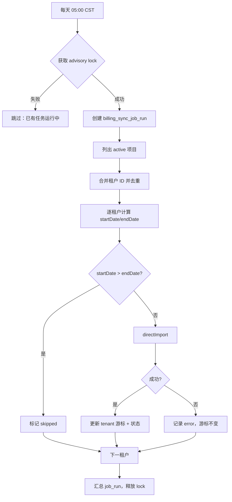

# 项目租户账单定时同步设计方案

> 版本：v1.1  
> 日期：2026-05-26  
> 状态：**已实施**  
> 变更：v1.1 — 按 §13 确认项完成编码（cron + 游标 + admin UI）  
> 关联：[tenant-billing-import-design.md](./tenant-billing-import-design.md)、`tenant-billing-import.ts`、`project-billing-sync-dialog.tsx`

---

## 1. 目标与原则

### 1.1 业务目标

| # | 目标 | 说明 |
|---|------|------|
| G1 | 每日自动同步 | 每天 **东八区 05:00** 自动拉取各经营项目关联租户的 CRM 平台账单 |
| G2 | 增量时间窗 | 每次同步的数据范围为 **「上次成功同步的数据结束日」→「当前日 − 安全窗口」**，避免重复全量 |
| G3 | 安全窗口 | 不同步最近 N 天（默认 2 天）的平台数据，避免未结算/回写中的账单被过早入库 |
| G4 | 复用现有链路 | 调用已有 `directImport` / OpenAPI 封装，与手动「项目同步账单」行为一致 |
| G5 | 可观测 | 记录每次任务与每个项目/租户的执行结果，便于排查与 UI 展示 |

### 1.2 非目标（本期）

- **不**替代财务域 `billing_period` Excel 导入（见 `billing-period-import-design.md`）
- **不**在定时任务中做 preview 两步确认；直接 `directImport` 写库
- **不**新建独立 `apps/workers` 镜像（当前 Docker 仅部署 web；优先在 web 进程内调度）
- **不**改造 finance 模块的 `billing_period_tenant_bill_window`（刊例价子窗口，与 CRM 平台同步无关）

### 1.3 设计原则

1. **与手动同步同逻辑**：定时任务与 `crm.projects.syncBilling` 共用 data access，避免两套行为。
2. **游标持久化**：同步窗口边界写入 DB，进程重启不丢进度。
3. **幂等可重跑**：租户级 upsert / 先删后插策略已由 `tenant-billing-import.ts` 保证；允许同一天重叠拉取。
4. **单实例互斥**：多副本部署时用 DB advisory lock，保证同一时刻只有一个 job 在跑。
5. **部分失败可继续**：单租户失败不阻断同批次其它租户；项目级汇总失败数。

---

## 2. 现状梳理

### 2.1 已有能力

| 组件 | 路径 | 说明 |
|------|------|------|
| 项目级同步 | `tenant-billing-import.ts` → `syncBillingForProject` | 遍历项目关联租户，逐个 `directImport` |
| 租户级导入 | `directImport` | `fetchPreview` + `commitImport`，跳过 UI 确认 |
| 手动入口 | `project-billing-sync-dialog.tsx` | 默认日期：当月 1 日 ~ 今天 |
| tRPC | `crm.projects.syncBilling` | `adminProcedure`，需登录管理员 |
| API 限流 | `suanli-billing-api-throttle.ts` | 全局限流 + 段间 delay（env 可配） |
| 依赖 | `node-cron@4.2.1` | 已在 `apps/web/package.json`，**尚未使用** |

### 2.2 缺口

- 无定时调度入口（无 cron route / instrumentation / workers）
- 无「上次同步结束时间 / 数据窗口结束日」持久化
- 无 job 运行日志表
- Docker `svc-workers` 指向不存在的 `apps/workers`（遗留占位，本期不启用）

### 2.3 租户归属规则（与手动同步一致）

`getBillingTenantIdsForProject` 解析顺序：

1. `project.primary_tenant_id`
2. `project_tenant` 关联表
3. 若仍为空：客户下 `is_default = true` 的租户

仅 `platform_tenant_id` 非空的租户可实际调用 OpenAPI。

---

## 3. 同步范围与时间窗

### 3.1 调度范围

**默认**：所有 `project.status = 'active'` 的项目。

| 项 | 规则 |
|----|------|
| 项目过滤 | `status = 'active'`；`paused` / `completed` 不同步（可 env 扩展） |
| 租户去重 | 同一 job 内按 `tenantId` 去重；一个租户只同步一次（即使挂多个项目） |
| 项目维度日志 | 仍按项目记录「本 job 内该项目下租户结果」，便于项目详情页展示 |

> **去重说明**：现有 `syncBillingForProject` 按项目循环，若租户 A 同时属于项目 P1、P2，手动各同步一次会重复调 API。定时任务建议在 job 层 **全局去重**，以租户为同步单元，项目仅作审计维度。

### 3.2 安全窗口（Safety Window）

平台侧日账单/用量可能存在 T+1 甚至 T+2 才稳定的情况。定义：

```
safetyDays = env BILLING_SYNC_SAFETY_DAYS（默认 2）
syncEndDate = 东八区「今天」− safetyDays  （YYYY-MM-DD，含该日）
```

示例（今天 2026-05-26，safetyDays=2）：

- `syncEndDate = 2026-05-24`
- 不同步 2026-05-25、2026-05-26 的数据

### 3.3 增量起始日（游标）

在 **`billing_tenant`**（或独立游标表，见 §4）上维护：

| 字段 | 含义 |
|------|------|
| `billing_sync_cursor_end_date` | 上次 **成功** 同步所覆盖的数据结束日（`YYYY-MM-DD`，东八区自然日） |

本次 job 对每个租户计算：

```typescript
function computeSyncDateRange(cursorEndDate: string | null, syncEndDate: string) {
  // 首次同步（无游标）
  const startDate = cursorEndDate
    ?? env.BILLING_SYNC_INITIAL_START_DATE  // 可选；未配置则用「当月 1 日」
  return { startDate, endDate: syncEndDate }
}
```

**边界规则**：

| 场景 | 处理 |
|------|------|
| `startDate > endDate` | 跳过该租户（窗口为空，例如连续两天跑 job 且 safety 未变） |
| `startDate === endDate` | 仍执行（单日增量，幂等） |
| 首次同步 | `startDate = max(当月1日, tenant.platform_registered_at 的日期)`（可选收紧） |
| 游标更新时机 | 仅当该租户 **整段 directImport 成功** 后，将 `cursor_end_date` 更新为本次 `endDate` |
| 失败租户 | **不**推进游标；下次 job 从旧游标重试，自然覆盖失败区间 |

**关于「上次同步结束的时间」**：

- **数据窗口**：以上游标 `cursor_end_date` 作为下次 `startDate`（与「上次同步的数据结束日」对齐）。
- **任务时刻**：`billing_sync_last_finished_at` 记录 job 完成时间，供运维/ UI 展示，**不**直接作为 OpenAPI 查询参数。

### 3.4 时区与 Cron 表达式

| 项 | 值 |
|----|-----|
| 时区 | `Asia/Shanghai`（东八区） |
| 表达式 | `0 5 * * *`（每天 05:00） |
| 可配置 | `BILLING_SYNC_CRON`（默认 `0 5 * * *`）、`BILLING_SYNC_TIMEZONE`（默认 `Asia/Shanghai`） |

---

## 4. 数据模型

### 4.1 租户游标（`billing_tenant` 扩展）

在 `packages/db/src/crm-schema.ts` 的 `billing_tenant` 表增加：

| 列 | 类型 | 说明 |
|----|------|------|
| `billing_sync_cursor_end_date` | `date` nullable | 上次成功同步的数据结束日 |
| `billing_sync_last_started_at` | `timestamptz` nullable | 最近一次同步开始时间 |
| `billing_sync_last_finished_at` | `timestamptz` nullable | 最近一次同步结束时间 |
| `billing_sync_last_status` | `varchar(32)` nullable | `success` / `failed` / `skipped` |
| `billing_sync_last_error` | `text` nullable | 最近一次失败摘要 |

> 参考 supplier 域 `supplier_gpu_inventory.last_synced_at` 模式，字段挂在业务实体上，查询简单。

### 4.2 任务运行日志（新表 `billing_sync_job_run`）

| 列 | 类型 | 说明 |
|----|------|------|
| `id` | `text` PK | UUID |
| `trigger` | `varchar(32)` | `scheduled` / `manual` |
| `started_at` | `timestamptz` | |
| `finished_at` | `timestamptz` nullable | |
| `status` | `varchar(32)` | `running` / `success` / `partial` / `failed` |
| `sync_end_date` | `date` | 本次 job 计算的 global endDate |
| `safety_days` | `integer` | |
| `project_count` | `integer` | 扫描项目数 |
| `tenant_count` | `integer` | 去重后租户数 |
| `success_count` | `integer` | |
| `failed_count` | `integer` | |
| `skipped_count` | `integer` | 窗口为空等 |
| `error_summary` | `text` nullable | |

### 4.3 租户级明细日志（新表 `billing_sync_job_item`）

| 列 | 类型 | 说明 |
|----|------|------|
| `id` | `text` PK | |
| `job_run_id` | FK → `billing_sync_job_run` | |
| `tenant_id` | FK → `billing_tenant` | |
| `project_id` | FK → `project` nullable | 审计用；去重同步时记录「代表项目」 |
| `start_date` | `date` | |
| `end_date` | `date` | |
| `status` | `varchar(32)` | `success` / `failed` / `skipped` |
| `summary` | `text` nullable | `directImport` 返回的 summary |
| `error` | `text` nullable | |

索引：`job_run_id`、`tenant_id`、`started_at`（job 表）。

---

## 5. 执行流程

### 5.1 总览



### 5.2 核心函数（data access 层）

新增 `apps/web/src/lib/server/dataaccess/crm/billing-scheduled-sync.ts`：

```typescript
// 伪代码
export async function runScheduledBillingSync(options?: {
  trigger: 'scheduled' | 'manual'
  projectIds?: string[]  // manual 可指定 subset
}): Promise<BillingSyncJobRunResult>

export function computeBillingSyncWindow(params: {
  cursorEndDate: string | null
  safetyDays: number
  now?: Date
}): { startDate: string; endDate: string; skipped: boolean }
```

内部复用：

- `tenantBillingImportDataAccess.directImport({ tenantId, startDate, endDate })`
- `projectsDataAccess.getBillingTenantIdsForProject`
- `validateBillingDateRange`

**不**直接调用 `syncBillingForProject`（避免项目间重复同步同一租户）；改为 job 层去重后按租户循环。

### 5.3 互斥锁

```typescript
// PostgreSQL advisory lock，key 固定，例如 hash('billing_sync_job')
await db.execute(sql`SELECT pg_try_advisory_lock(${LOCK_KEY})`)
// finally: pg_advisory_unlock
```

多 web 副本时仅一个实例执行；未拿到锁则打日志并退出（不报错）。

### 5.4 超时与体量

| 风险 | 缓解 |
|------|------|
| 租户多、API 慢 | 已有 throttle；job 串行处理租户（与现 manual 一致） |
| 单 job 过长 | env `BILLING_SYNC_MAX_TENANTS_PER_RUN` 可选上限；超出留待次日（记录 warning） |
| 进程重启 | 游标仅在成功时推进；`running` 状态的 job_run 可标记 `failed` 或启动时 cleanup |

---

## 6. 调度层方案

### 6.1 推荐：Next.js Instrumentation + node-cron

| 项 | 说明 |
|----|------|
| 文件 | `apps/web/instrumentation.ts` |
| 条件 | `process.env.BILLING_SYNC_ENABLED === 'true'` 且 `NEXT_RUNTIME === 'nodejs'` |
| 注册 | `cron.schedule(BILLING_SYNC_CRON, handler, { timezone })` |
| 优点 | 与现有 Docker 单 web 容器一致；无需新服务 |
| 注意 | **开发环境默认关闭**，避免 dev 热重载重复注册 |

### 6.2 备选：HTTP Cron Route（多副本 / 外部调度）

| 项 | 说明 |
|----|------|
| 路径 | `POST /api/internal/cron/billing-sync` |
| 鉴权 | Header `Authorization: Bearer ${CRON_SECRET}` |
| 用途 | K8s CronJob / 云调度器触发；内部仍走 advisory lock |

两种入口 **共用** `runScheduledBillingSync`。

### 6.3 不推荐（本期）

- 新建 `apps/workers`：Docker compose 未部署，增加运维成本
- 纯 Redis 队列：当前无 BullMQ 等基础设施

---

## 7. 配置项（环境变量）

| 变量 | 默认 | 说明 |
|------|------|------|
| `BILLING_SYNC_ENABLED` | `false` | 是否启用定时任务 |
| `BILLING_SYNC_CRON` | `0 5 * * *` | Cron 表达式 |
| `BILLING_SYNC_TIMEZONE` | `Asia/Shanghai` | 时区 |
| `BILLING_SYNC_SAFETY_DAYS` | `2` | 安全窗口天数 |
| `BILLING_SYNC_INITIAL_START_DATE` | _(空)_ | 首次同步起始日；空则当月 1 日 |
| `BILLING_SYNC_PROJECT_STATUSES` | `active` | 逗号分隔的项目 status 过滤 |
| `CRON_SECRET` | _(空)_ | HTTP 触发鉴权（启用 route 时必填） |

已有 OpenAPI 限流 env 继续生效（`SUANLI_BILLING_API_*`）。

---

## 8. 管理入口（可选，建议本期一并做）

| 入口 | 说明 |
|------|------|
| tRPC `crm.billingSync.runNow` | `adminProcedure`，手动触发一次 job（`trigger=manual`） |
| tRPC `crm.billingSync.listRuns` | 分页查询 `billing_sync_job_run` + items |
| 项目详情 | 展示关联租户 `billing_sync_last_finished_at` / 状态 |
| 系统设置页 | 只读展示 cron 配置与安全窗口（值来自 env） |

手动触发与定时任务 **完全同代码路径**。

---

## 9. 与手动「项目同步账单」的差异

| 维度 | 手动（现有 UI） | 定时任务 |
|------|----------------|----------|
| 日期范围 | 用户填写，默认当月 1 日 ~ 今天 | 游标 ~ 今天 − safetyDays |
| 确认步骤 | 项目弹窗确认 | 无 UI，直接写库 |
| 租户范围 | 当前项目下全部计费租户 | 全部 active 项目，**租户去重** |
| 结束日 | 可含「今天」 | **不含** safetyDays 内最近几天 |
| 权限 | admin 登录 | 系统进程 / CRON_SECRET |

手动同步 **不更新** 定时游标（避免用户临时拉「到今天」导致定时窗口错乱）。  
若需统一，可在后续版本增加选项「同时更新自动同步游标」（本期不做）。

---

## 10. 错误处理

| 场景 | 处理 |
|------|------|
| 租户无 `platformTenantId` | `skipped`，记 item 日志 |
| OpenAPI 失败 | 租户 `failed`，游标不推进 |
| 窗口为空 | `skipped` |
| 拿不到 advisory lock | 整 job 跳过，不建 run 或建 `skipped` run |
| 部分租户失败 | job_run.status = `partial` |
| 全部失败 | `failed` |

---

## 11. 模块与文件规划

| 层级 | 路径 | 职责 |
|------|------|------|
| Migration | `packages/db/drizzle/xxxx_billing_sync.sql` | 新表 + tenant 扩展列 |
| Schema | `packages/db/src/crm-schema.ts` | Drizzle 定义 |
| 工具 | `lib/crm/tenant-billing-import-utils.ts` | 新增 `computeBillingSyncWindow` |
| Data access | `lib/server/dataaccess/crm/billing-scheduled-sync.ts` | job 主逻辑 |
| Data access | `lib/server/dataaccess/crm/tenant-billing-import.ts` | 保持 `directImport` 不变 |
| 调度 | `apps/web/instrumentation.ts` | node-cron 注册 |
| Route（可选） | `app/api/internal/cron/billing-sync/route.ts` | HTTP 触发 |
| tRPC | `lib/server/routers/crm/index.ts` | `billingSync.*` |
| 类型 | `lib/types/billing-scheduled-sync.ts` | Job run DTO |

---

## 12. 测试计划

| # | 用例 | 预期 |
|---|------|------|
| T1 | `computeBillingSyncWindow` 无游标 | startDate = 当月 1 日，endDate = today − safetyDays |
| T2 | 有游标 cursor=2026-05-20，safety=2，today=2026-05-26 | start=2026-05-20，end=2026-05-24 |
| T3 | cursor > endDate | skipped，不调 API |
| T4 | directImport 成功 | 游标更新为 endDate |
| T5 | directImport 失败 | 游标不变 |
| T6 | 两项目共享同一租户 | job 内只调一次 API |
| T7 | 并发两个 job | 第二个拿不到 lock |
| T8 | `BILLING_SYNC_ENABLED=false` | cron 不注册 |
| T9 | manual runNow | 与 scheduled 同结果，trigger=manual |

---

## 13. 待确认事项

| # | 问题 | 建议 | 状态 |
|---|------|------|------|
| Q1 | 安全窗口默认几天？ | **2 天**（`BILLING_SYNC_SAFETY_DAYS=2`） | **已确认** |
| Q2 | 首次同步起始日？ | **当月 1 日**（与手动 UI 一致） | **已确认** |
| Q3 | 同步哪些项目？ | 仅 **`status=active`** | **已确认** |
| Q4 | 租户跨项目重复？ | job 内 **按 tenantId 去重** | **已确认** |
| Q5 | 调度方式？ | **Instrumentation + node-cron**（prod 开 env）；另留 HTTP cron 备选 | **已确认** |
| Q6 | 手动项目同步是否更新游标？ | **否**（本期） | **已确认** |
| Q7 | 是否需要 UI 查看同步历史？ | admin 列表页 `/crm/billing-sync` + 项目同步弹窗展示 last sync | **已确认** |

---

## 14. 实施步骤（确认后）

1. Migration：tenant 游标字段 + `billing_sync_job_run` / `billing_sync_job_item`
2. 实现 `computeBillingSyncWindow` + 单元测试
3. 实现 `billing-scheduled-sync.ts`（含 advisory lock）
4. 注册 `instrumentation.ts` +（可选）cron route
5. tRPC：`runNow` / `listRuns`
6. （可选）项目详情或设置页展示最后同步时间
7. 生产 env：`BILLING_SYNC_ENABLED=true`，配置 `CRON_SECRET`（若用 HTTP）
8. 联调：手动 `runNow` 验证后再开启 cron

---

**请确认 §13 待确认事项（尤其 Q1–Q5）后，再开始编码。**
