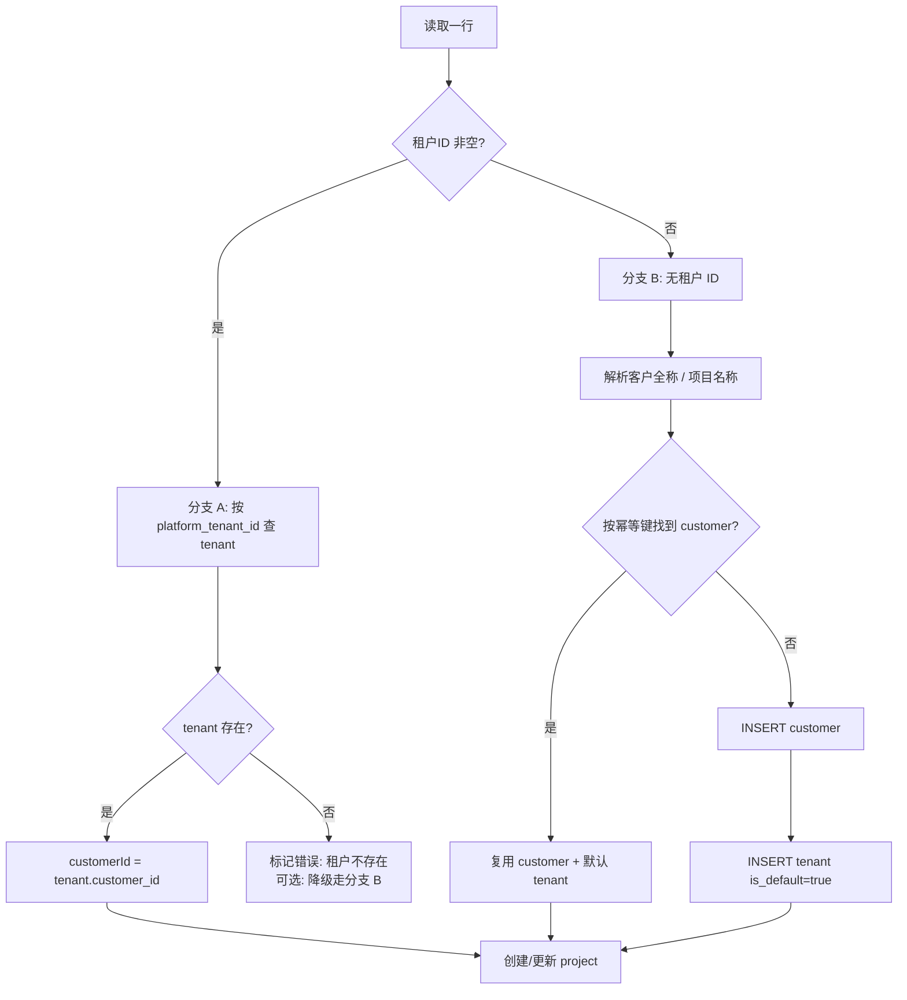
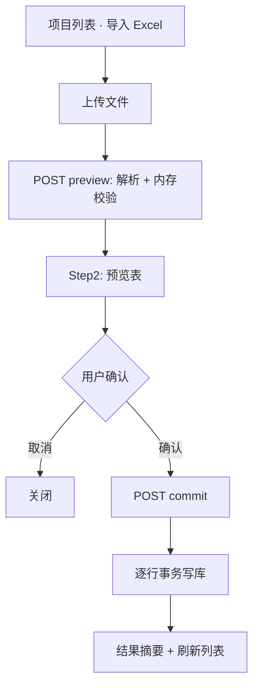

# 项目信息 Excel 批量导入设计方案

> 版本：v1.0（设计稿）  
> 日期：2026-05-20  
> 状态：**设计稿 — 确认后再实施代码**  
> 关联：`projects-content.tsx`、`projects.ts`、`staff.ts`、`billing-tenants.ts`（Excel 导入参考）、`platform-tenant-import-design.md`、`packages/db/src/crm-schema.ts`

---

## 1. 目标与原则

### 1.1 业务目标


| #   | 目标        | 说明                                                                                |
| --- | --------- | --------------------------------------------------------------------------------- |
| G1  | 批量导入经营项目  | 用户上传与飞书/多维表格导出的 **项目信息表** Excel，一次性写入 CRM                                         |
| G2  | 自动解析客户与租户 | **有租户 ID** → 关联已有 `tenant` 及其 `customer`；**无租户 ID** → 新建 `customer` + 默认 `tenant` |
| G3  | 自动解析项目人员  | 按 **姓名** 匹配 `user_staff`；不存在则 **自动创建** 占位员工并写入 `project_staff_assignment`         |
| G4  | 可预览、可部分成功 | 两步流：解析预览 → 用户确认 → 事务入库；单行失败不影响其它行（逐条小事务）                                          |
| G5  | 幂等可重导     | 同一来源行重复导入时 **更新项目**，不重复创建 customer / tenant / project                             |


### 1.2 非目标（本期）

- 不通过本流程写入 **财务真值**（总消费、余额消费、券消费、补充消费、裸金属消费等）——由 [billing-period-import-design.md](./billing-period-import-design.md) 负责
- 不修改 **已存在 customer** 的字段（名称、联系人等），除非该行触发了「新建客户」分支
- 不支持 **父记录** 层级关系建模（表头存在但库表暂无 `parent_project_id`，见 §9）
- 不支持 **关注人** 多对多关系（库表暂无 `project_watcher`，见 §9）
- 不同步平台 OpenAPI 实时数据（租户 ID 仅用于 **本地** `tenant.platform_tenant_id`  lookup）

### 1.3 设计原则

1. **Customer → Project → Tenant 三层分离**：与 `crm-database.md` §1.1 一致；项目必属客户，主计费租户可空。
2. **平台请求不走本流程**：租户 ID 列对应 `tenant.platform_tenant_id`，仅查本地库。
3. **姓名不落库到 project 表**：四人组写入 `project_staff_assignment`，与手工建项一致。
4. **预览先于写入**：展示「将新建 / 将更新 / 将跳过」及解析告警，避免误导入。
5. **与现有导入并存**：租户 Excel 导入、平台租户 ID 导入、账期财务导入互不替代。

---

## 2. 源表结构（用户提供样例）

### 2.1 表头（33 列）


| 列序  | 表头       | 示例值                  |
| --- | -------- | -------------------- |
| 1   | 项目名称     | 几何Docker项目           |
| 2   | 标签       | 公海池-无人跟踪             |
| 3   | 租户ID     | （空）                  |
| 4   | 业务线      | （空）                  |
| 5   | 描述       | 山海几何_Docker需求&测试调研表… |
| 6   | 客户经理     | 李楠                   |
| 7   | 交付       | （空）                  |
| 8   | 客成/项目经理  | 高彭                   |
| 9   | 售前       | （空）                  |
| 10  | 关注人      | （空）                  |
| 11  | 所属渠道/生态  | （空）                  |
| 12  | 算力规模     | 10卡                  |
| 13  | 阶段       | 生产运营                 |
| 14  | 健康状态     | pending              |
| 15  | 进展更新     | 0409：客户硬件更新…         |
| 16  | 下一步计划    | （空）                  |
| 17  | 客群分布     | （空）                  |
| 18  | 开始测试日期   | （空）                  |
| 19  | 试用完成日期   | （空）                  |
| 20  | 转正式日期    | （空）                  |
| 21  | 余额+裸金属消费 | ¥0.00                |
| 22  | 总消费      | ¥0.00                |
| 23  | 余额消费     | 0                    |
| 24  | 券消费      | 0                    |
| 25  | 补充消费     | （空）                  |
| 26  | 创建时间     | 2025/03/14           |
| 27  | 最后更新时间   | 2026/05/05           |
| 28  | 父记录      | （空）                  |
| 29  | 创建人      | 高彭                   |
| 30  | 客户全称     | （空）                  |
| 31  | 项目问题与需求  | （空）                  |
| 32  | 线上裸金属消费  | 0                    |


> 注：样例行 **无租户 ID**，走 §4.2 **分支 B**；**客户全称** 为空时，客户简称取 **项目名称**。

### 2.2 文件要求


| 项    | 规则                          |
| ---- | --------------------------- |
| 格式   | `.xlsx` / `.xls`            |
| 大小   | ≤ 10MB（与租户 Excel 导入一致）      |
| 表头   | 第一行必须为上述列名（允许前后空格；别名见 §3.1） |
| 数据行  | 从第二行起；**项目名称** 为空的行跳过       |
| 单次上限 | 建议 **500** 行（可配置），超出提示拆分    |


---

## 3. 字段映射

### 3.1 表头别名（解析容错）

解析时对表头 `trim()` 后匹配；支持常见变体：


| 标准表头    | 可接受别名                  |
| ------- | ---------------------- |
| 项目名称    | 项目名、Project Name       |
| 租户ID    | 租户 ID、平台租户ID、tenant_id |
| 客成/项目经理 | 项目经理、PM、客成             |
| 客户全称    | 客户名称、公司全称              |
| 开始测试日期  | 测试开始日期                 |
| 试用完成日期  | 测试完成日期                 |
| 转正式日期   | 转正日期、conversion_date   |


未识别列 **忽略** 并在预览中计入 `ignoredColumns`（仅 debug 日志）。

### 3.2 核心实体映射

#### A. 客户 / 租户（§4 详述）


| Excel 列 | 目标                                 | 规则                      |
| ------- | ---------------------------------- | ----------------------- |
| 租户ID    | `tenant.platform_tenant_id` lookup | 有值 → 分支 A；无值 → 分支 B     |
| 客户全称    | `customer.name`                    | 分支 B：优先作法定名称；空则用项目名称    |
| 项目名称    | `customer.account_name`（分支 B）      | **客户简称 = 项目名称**（用户明确要求） |
| 项目名称    | `project.name`                     | 始终写入项目名                 |


#### B. `project` 表


| Excel 列    | DB 列                | 规则                                                                 |
| ---------- | ------------------- | ------------------------------------------------------------------ |
| 项目名称       | `name`              | 必填                                                                 |
| 描述         | `description`       | 原样；HTML `<br>` 转为换行                                                |
| 阶段         | `stage`             | 枚举映射见 §3.3                                                         |
| 健康状态       | `status`            | 枚举映射见 §3.3；无法识别默认 `active`                                         |
| 业务线        | `business_line_id`  | 按 **名称** 匹配 `business_line.name`；空则默认 `delivery_project`（交付型项目）    |
| 开始测试日期     | `start_date`        | 可空；解析 `YYYY/MM/DD`、`YYYY-MM-DD`                                    |
| 试用完成日期     | `end_date`          | 可空；**仅当阶段为 testing 或未转正时** 作为项目结束预估日                               |
| 转正式日期      | 见 §3.4              | 写入 `customer.conversion_date`（分支 B 新建客户时）或仅作 `project_activity` 记录 |
| 创建时间       | `created_at`        | 可解析则写入；否则 `now()`                                                  |
| 最后更新时间     | `updated_at`        | 可解析则写入                                                             |
| 租户ID（分支 A） | `primary_tenant_id` | 指向 lookup 到的 `tenant.id`                                           |


**消费相关列（21–25、32）**：预览只读展示，**不入库**；列表页消费指标仍由 `consumption_record` / 账期导入聚合。

#### C. `project_staff_assignment`（四人组）


| Excel 列 | `role_type`        | 规则                |
| ------- | ------------------ | ----------------- |
| 售前      | `pre_sales`        | 姓名为空则 **不写入** 该角色 |
| 客户经理    | `account_manager`  | 同上                |
| 交付      | `delivery_manager` | 同上                |
| 客成/项目经理 | `project_manager`  | 同上                |


> 与表单 `projectStaffSchema`（四项必填）不同，导入允许 **部分角色为空**。

#### D. `project_tag` / `project_tag_assignment`


| Excel 列 | 规则                                                                                     |
| ------- | -------------------------------------------------------------------------------------- |
| 标签      | 按 **中文逗号 / 英文逗号 / 顿号** 拆分多个标签名；`project_tag` 不存在则 `INSERT`；再写 `project_tag_assignment` |


#### E. `customer` 扩展字段（分支 B 或更新策略见 §4.4）


| Excel 列 | DB 列                                        | 规则                                                                                                                |
| ------- | ------------------------------------------- | ----------------------------------------------------------------------------------------------------------------- |
| 算力规模    | `expected_scale` 或 `observed_scale_summary` | 解析「10卡」→ `{ cards: [{ cardTypeId: 'unknown', cardCount: 10 }] }`；无法解析则写入 `observed_scale_summary: { raw: "10卡" }` |
| 开始测试日期  | `test_started_on`                           | 分支 B 新建客户时写入                                                                                                      |
| 试用完成日期  | `test_completed_on`                         | 同上                                                                                                                |
| 转正式日期   | `conversion_date`                           | 同上                                                                                                                |
| 客群分布    | `observed_scale_summary.segment`            | JSON 片段                                                                                                           |


#### F. `project_activity`（进展类文本）


| Excel 列 | `type`                | 规则                                                   |
| ------- | --------------------- | ---------------------------------------------------- |
| 进展更新    | `progress_update`     | 有内容则插入一条 activity；`title='进展更新'`，`description=单元格全文` |
| 下一步计划   | `next_plan`           | 同上                                                   |
| 项目问题与需求 | `issues_requirements` | 同上                                                   |


`authorName` 取 **创建人** 列；若创建人能匹配 `user_staff` 则填 `author_staff_id`。

#### G. 本期忽略或仅预览


| Excel 列            | 处理                                           |
| ------------------ | -------------------------------------------- |
| 关注人                | 预览列展示；**不入库**（待 `project_watcher` 表，§9）      |
| 所属渠道/生态            | 写入 `project_activity.metadata.channel` 或待扩展列 |
| 父记录                | 预览告警「暂不支持层级」                                 |
| 创建人                | 仅用于 activity 作者；**不**自动赋予项目角色                |
| 余额+裸金属消费 / 总消费 / … | 只读；引导走财务导入                                   |


### 3.3 阶段与健康状态枚举映射

#### 阶段 → `project.stage`


| 源值（示例）                    | `stage`     | 备注                    |
| ------------------------- | ----------- | --------------------- |
| 线索、商机、公海                  | `lead`      |                       |
| 测试、试用、POC、开始测试            | `testing`   |                       |
| 生产运营、已转正、正式、converted、运营中 | `converted` | 样例「生产运营」→ `converted` |
| 空                         | `lead`      | 默认                    |


#### 健康状态 → `project.status`


| 源值（示例）                | `status`    |
| --------------------- | ----------- |
| pending、正常、active、进行中 | `active`    |
| 暂停、paused、挂起          | `paused`    |
| 完成、结项、completed       | `completed` |
| 空                     | `active`    |


> 「公海池-无人跟踪」属于 **标签**，不单独映射 `status`；可通过标签筛选。

### 3.4 日期与金额解析

```ts
// 日期：2025/03/14、2025-03-14、Excel 序列号
parseDate(cell) → 'YYYY-MM-DD' | null

// 金额：¥0.00、0、1,234.56
parseMoney(cell) → number  // 仅预览
```

---

## 4. 客户与租户解析（核心规则）

### 4.1 判定流程




### 4.2 分支 A — 存在租户 ID

1. `SELECT * FROM tenant WHERE platform_tenant_id = :tid`（字符串化、trim）
2. 命中：
  - `project.customer_id` **必须** = `tenant.customer_id`（R1.3）
  - `project.primary_tenant_id` = `tenant.id`
  - **不** 修改 `customer` 任何字段
3. 未命中：
  - **默认**：该行 `errors[]`，不可提交
  - **可配置降级**（评审选项）：视为分支 B，并用 `platform_tenant_id` 写入新建 tenant（便于后续平台同步）

### 4.3 分支 B — 无租户 ID（样例行）

用户要求：**项目名称为客户简称**。


| 步骤  | 动作                                                                                                                                                  |
| --- | --------------------------------------------------------------------------------------------------------------------------------------------------- |
| 1   | `shortName = 项目名称.trim()`                                                                                                                           |
| 2   | `legalName = 客户全称.trim()` 或 `shortName`                                                                                                             |
| 3   | 幂等键 `importKey = normalize(shortName)`（见 §5）                                                                                                        |
| 4   | 若不存在 customer：`INSERT customer { name: legalName, account_name: shortName, type: 'C', status: 'active', contactPerson: '', contactPhone: '', ... }` |
| 5   | 若 customer 下无 tenant：`INSERT tenant { customer_id, name: shortName, is_default: true, status: 'active', platform_tenant_id: null }`                 |
| 6   | 若已有 default tenant：复用，`primary_tenant_id` 指向该 tenant                                                                                                |
| 7   | `INSERT/UPDATE project` 绑定 `customer_id` + `primary_tenant_id`                                                                                      |


**样例「几何Docker项目」预期结果**：


| 实体            | 字段              | 值                      |
| ------------- | --------------- | ---------------------- |
| customer      | `account_name`  | 几何Docker项目             |
| customer      | `name`          | 几何Docker项目（因客户全称为空）    |
| tenant        | `name`          | 几何Docker项目             |
| tenant        | `is_default`    | true                   |
| project       | `name`          | 几何Docker项目             |
| project_staff | account_manager | 李楠（user_staff）         |
| project_staff | project_manager | 高彭（user_staff）         |
| project_tag   |                 | 公海池-无人跟踪               |
| project       | `stage`         | converted（生产运营）        |
| project       | `status`        | active（pending→active） |


### 4.4 已存在 customer 时的更新策略


| 场景                   | customer     | tenant                 | project |
| -------------------- | ------------ | ---------------------- | ------- |
| 分支 A，tenant 已存在      | **不 UPDATE** | **不 UPDATE**（除非配置同步余额） | UPSERT  |
| 分支 B，幂等命中已有 customer | **不 UPDATE** | 确保有 default tenant     | UPSERT  |
| 分支 B，新建 customer     | INSERT       | INSERT default         | INSERT  |


---

## 5. 员工解析（核心规则）

### 5.1 解析范围

从以下列收集 **去重后的姓名**：

- 售前、客户经理、交付、客成/项目经理、创建人（仅 author，不强制建项角色）

### 5.2 匹配顺序

```ts
async function resolveStaffByName(name: string): Promise<string /* userStaffId */> {
  const trimmed = name.trim()
  // 1. 精确匹配 display_name（区分大小写不敏感可选）
  // 2. 若无：INSERT user_staff
}
```


| 步骤     | 规则                                                                                                         |
| ------ | ---------------------------------------------------------------------------------------------------------- |
| Lookup | `SELECT id FROM user_staff WHERE display_name = :name LIMIT 1`                                             |
| 多名同姓   | 预览标记 **歧义**，要求用户在下拉中选择；commit 时须带 `staffId`                                                                |
| Create | `display_name = name`；`mobile = 生成占位号`（如 `1990000{hash4}`，保证 UNIQUE）；`status = active`；`department = null` |
| 禁止     | 不覆盖已存在员工的 mobile / email                                                                                   |


占位手机号策略与 `seed.ts` 类似，但须检测冲突并重试。

### 5.3 写入项目角色

对每个非空角色列：

1. `resolveStaffByName` 得 `userStaffId`
2. 若该项目该 `role_type` 已有 `effective_to IS NULL` 的 assignment：
  - **导入更新模式**：`UPDATE effective_to = now()` 旧记录 + `INSERT` 新记录
  - **导入跳过模式**（可配置）：保留旧记录，预览告警
3. 默认采用 **更新模式**（以 Excel 为准）

### 5.4 与 `staffDataAccess.create` 复用

封装 `ensureStaffByDisplayName(name): Promise<{ id, created: boolean }>`，内部调用 `staffDataAccess.create` 或 bulk cache，避免同行重复 INSERT。

---

## 6. 幂等与 UPSERT 键

### 6.1 推荐：来源行稳定键

Migration 新增（可选但强烈建议）：

```sql
ALTER TABLE project ADD COLUMN import_source_key varchar(128);
CREATE UNIQUE INDEX project_import_source_key_uk ON project (import_source_key)
  WHERE import_source_key IS NOT NULL;
```

生成规则：

```ts
importSourceKey = sha256(
  [normalize(项目名称), normalize(租户ID || ''), normalize(客户全称 || 项目名称)].join('|')
).slice(0, 32)
```

### 6.2 无 migration 时的降级键

`UNIQUE (customer_id, name)` — **未建唯一索引**，应用层：

1. `SELECT id FROM project WHERE customer_id = ? AND name = ?`
2. 存在 → UPDATE；否则 INSERT

### 6.3 重复导入行为


| 实体                       | 行为                      |
| ------------------------ | ----------------------- |
| customer（分支 B 命中）        | 不重复创建                   |
| tenant                   | 不重复创建 default           |
| user_staff               | 按姓名复用                   |
| project                  | UPDATE 描述、阶段、状态、日期、业务线等 |
| project_staff_assignment | 按 §5.3 更新当前主责           |
| project_tag              | 追加缺失标签，不删除已有标签（**默认**）  |


---

## 7. 端到端流程




### 7.1 Preview 校验


| 代码                      | 级别    | 说明                |
| ----------------------- | ----- | ----------------- |
| `MISSING_PROJECT_NAME`  | error | 跳过该行              |
| `TENANT_NOT_FOUND`      | error | 分支 A 且 tenant 不存在 |
| `STAFF_NAME_AMBIGUOUS`  | warn  | 多个同名员工            |
| `UNKNOWN_BUSINESS_LINE` | warn  | 回退默认业务线           |
| `UNSUPPORTED_PARENT`    | warn  | 父记录非空             |
| `DATE_PARSE_FAIL`       | warn  | 日期置空              |


### 7.2 Commit 顺序（单行事务内）

1. `ensureStaffByDisplayName`（批量预解析）
2. 解析 customer / tenant（§4）
3. `UPSERT project`
4. `UPSERT project_staff_assignment`（按角色）
5. `UPSERT project_tag` + assignments
6. `INSERT project_activity`（进展/计划/问题）
7. 更新 `customer` 日期/规模字段（仅分支 B 新建时，或配置允许）

---

## 8. 界面与线框

### 8.1 入口

在 `ProjectsContent` 工具栏增加 **「导入 Excel」**，与「新建项目」并列；权限与租户 Excel 导入一致（非 `user` 角色）。

### 8.2 Step 1 — 上传

```
┌─────────────────────────────────────────────────────────────┐
│  导入项目信息                                        [ × ]  │
├─────────────────────────────────────────────────────────────┤
│  上传项目信息表（.xlsx），表头需包含「项目名称」等列         │
│  [ 选择文件 ]  project-export-20260520.xlsx                 │
│  ⓘ 无租户 ID 时将自动创建客户（简称=项目名称）与默认租户    │
├─────────────────────────────────────────────────────────────┤
│                              [ 取消 ]  [ 解析并预览 → ]      │
└─────────────────────────────────────────────────────────────┘
```

### 8.3 Step 2 — 预览

```
┌──────────────────────────────────────────────────────────────────────────────┐
│  确认导入（共 120 行，有效 118，错误 2）                          [ × ]     │
├──────────────────────────────────────────────────────────────────────────────┤
│ 行 │ 项目名 │ 租户ID │ 客户策略      │ 客户经理 │ 阶段→stage │ 告警          │
│────┼────────┼────────┼───────────────┼──────────┼────────────┼───────────────│
│ 2  │ 几何…  │ —      │ 新建客户+租户 │ 李楠(新建)│ 生产→converted │ 标签:公海池  │
│ 3  │ XX项目 │ 16462  │ 关联租户      │ 王五     │ 测试→testing   │               │
│ 4  │ …      │ 99999  │ ✗ 租户不存在  │ —        │ —          │ 不可导入      │
├──────────────────────────────────────────────────────────────────────────────┤
│  ☑ 允许自动创建不存在的员工（占位手机号）                                    │
│                          [ ← 上一步 ]  [ 取消 ]  [ 确认导入 118 行 ]         │
└──────────────────────────────────────────────────────────────────────────────┘
```

### 8.4 Step 3 — 结果

```
新增项目 80 · 更新项目 38 · 新建客户 52 · 新建租户 52 · 新建员工 15 · 失败 2
（失败明细可展开）
```

---

## 9. 后端 API 设计

### 9.1 路由


| 方式     | Path / Procedure                              | 说明                              |
| ------ | --------------------------------------------- | ------------------------------- |
| REST   | `POST /api/crm/projects/import/preview`       | `multipart/form-data`，字段 `file` |
| REST   | `POST /api/crm/projects/import/commit`        | JSON body `{ items, options }`  |
| 或 tRPC | `crm.projects.previewImport` / `commitImport` | 与 CRM 路由风格一致                    |


> 大文件解析放 **服务端**；预览结果 `previewToken` 缓存 15 分钟（Redis / 内存 Map），commit 时校验防篡改。

### 9.2 Preview 响应 DTO

```ts
type ProjectImportPreviewRow = {
  rowIndex: number
  projectName: string
  platformTenantId?: string
  customerStrategy: 'link_tenant' | 'create_customer' | 'existing_customer'
  customerPreview?: { id?: string; name: string; shortName: string }
  tenantPreview?: { id?: string; platformTenantId?: string }
  staffPreview: Partial<Record<'pre_sales' | 'account_manager' | 'delivery_manager' | 'project_manager', {
    name: string
    staffId?: string
    willCreate: boolean
  }>>
  mapped: {
    stage: 'lead' | 'testing' | 'converted'
    status: 'active' | 'paused' | 'completed'
    businessLineName: string
    description?: string
  }
  warnings: string[]
  errors: string[]
  selectable: boolean
}

type ProjectImportPreviewResult = {
  previewToken: string
  rows: ProjectImportPreviewRow[]
  summary: { total: number; ok: number; error: number; warn: number }
}
```

### 9.3 Commit 请求 / 响应

```ts
type ProjectImportCommitOptions = {
  allowCreateStaff: boolean
  updateExistingStaffRoles: boolean
  skipErrors: boolean
}

type ProjectImportCommitResult = {
  createdProjects: number
  updatedProjects: number
  createdCustomers: number
  createdTenants: number
  createdStaff: number
  errors: { rowIndex: number; message: string }[]
}
```

---

## 10. 模块划分（实施清单）


| 路径                                                              | 职责                          |
| --------------------------------------------------------------- | --------------------------- |
| `apps/web/src/lib/server/integrations/project-import-parser.ts` | Excel 读取（`xlsx`）、表头映射、单元格解析 |
| `apps/web/src/lib/server/dataaccess/crm/project-import.ts`      | preview / commit 编排         |
| `apps/web/src/lib/server/dataaccess/crm/staff-resolve.ts`       | `ensureStaffByDisplayName`  |
| `apps/web/src/lib/types/project-import.ts`                      | DTO 与枚举                     |
| `apps/web/src/app/api/crm/projects/import/preview/route.ts`     | REST preview                |
| `apps/web/src/app/api/crm/projects/import/commit/route.ts`      | REST commit                 |
| `apps/web/.../crm-project-import-dialog.tsx`                    | 三步弹窗 UI                     |
| `apps/web/src/components/dashboard/projects-content.tsx`        | 增加入口按钮                      |


复用参考：

- Excel 上传鉴权：`apps/web/src/app/api/crm/tenants/import/route.ts`
- 项目 UPSERT：`apps/web/src/lib/server/dataaccess/crm/projects.ts`
- 员工 CRUD：`apps/web/src/lib/server/dataaccess/crm/staff.ts`
- 标签：`project-tags.ts`

---

## 11. 权限、错误与日志


| 项   | 说明                                    |
| --- | ------------------------------------- |
| 权限  | 登录 + `role !== 'user'`                |
| 文件  | 10MB 上限；仅 xlsx/xls                    |
| 同事务 | 单行一事务；失败记 `errors`                    |
| 日志  | 记录文件名、行数、created/updated 计数；不记录完整 PII |
| 回滚  | 无全批回滚；UI 展示部分成功                       |


---

## 12. 待确认问题（评审勾选）

- **A. 分支 A tenant 不存在**：报错 vs 降级走分支 B 并保留 `platform_tenant_id`
- **B. 业务线为空时的默认值**：`delivery_project` 是否合适
- **C. 标签导入策略**：仅追加 vs 与 Excel 完全一致（删除多余标签）
- **D. 员工同名歧义**：阻断 vs 取第一条 vs 预览必选
- **E. 占位手机号格式**：是否需可后续人工补全提醒
- **F. 是否新增 `project.import_source_key`**：强烈建议，用于幂等
- **G. 关注人 / 父记录 / 渠道**：是否本期加表还是仅 activity.metadata
- **H. 转正式日期**：写 `customer` 还是仅 `project` 时间线
- **I. 重复导入是否更新 customer 的 expected_scale / 测试日期**

---

## 13. 测试计划（实施后）

1. **样例行（无租户 ID）**：导入「几何Docker项目」→ 新建 customer（`account_name=几何Docker项目`）、default tenant、project；李楠/高彭员工存在或新建；标签「公海池-无人跟踪」
2. **有租户 ID 且本地存在**：project 挂到正确 customer；不修改 customer 字段
3. **有租户 ID 但本地不存在**：预览报错；commit 跳过
4. **重复导入同一行**：`updatedProjects++`；customer/tenant 不重复
5. **员工已存在**：按姓名关联，不新建
6. **员工不存在**：勾选允许创建 → `createdStaff++`，mobile 占位唯一
7. **阶段映射**：「生产运营」→ `converted`；「pending」→ `status=active`
8. **HTML 描述**：`<br>` 转为换行存入 `description`
9. **消费列**：不入库；列表消费仍为 0 或账期数据
10. **权限**：`user` 角色 403

---

## 14. 版本记录


| 版本   | 日期         | 说明                                        |
| ---- | ---------- | ----------------------------------------- |
| v1.0 | 2026-05-20 | 初稿：Excel 项目导入、租户/客户分支、员工按名关联、字段映射与 API 设计 |


