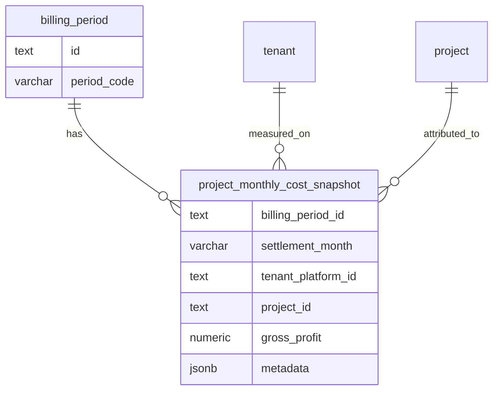
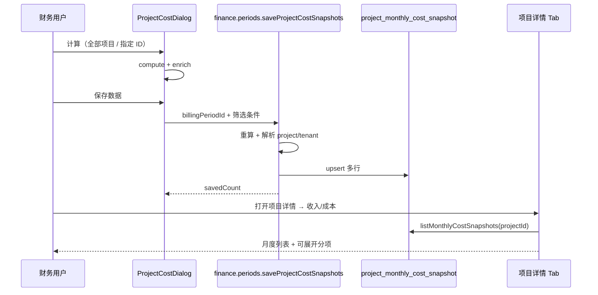

# 项目月度成本快照 — 保存与项目详情展示

> **版本**：v1.0（待确认）  
> **日期**：2026-06-10  
> **状态**：**已确认 — 实施中**  
> **触发场景**：财务「成本中间表 → 项目成本」弹窗目前仅实时计算、不落库；需在确认计算结果后一键保存，并在 CRM 项目详情页按关联租户查看历史月度收入/成本/毛利。  
> **关联**：  
> - `apps/web/src/app/.../project-cost-dialog.tsx`（计算入口）  
> - `apps/web/src/lib/finance/project-cost-from-source-lines.ts`（聚合逻辑）  
> - `apps/web/src/lib/server/dataaccess/finance/list-project-cost-metadata.ts`（CRM 元数据）  
> - `packages/db/src/finance-schema.ts`（财务域表）  
> - `apps/web/src/components/dashboard/project-detail-content.tsx`（项目详情 Tab）  
> - `cost.md` §2.5（与 `platform_cost_monthly` 边界）

---

## 1. 目标与非目标

### 1.1 业务目标

| # | 目标 | 说明 |
|---|------|------|
| G1 | **保存计算结果** | 在「项目成本」弹窗中，用户完成计算后点击「保存数据」，将当前结果写入专用表 |
| G2 | **月度经营指标** | 每条记录保存：确认收入（不含税）、售出/赠送时长成本（不含税）、毛利，及余额消费、卡时等辅助指标 |
| G3 | **机房分项明细** | 机房 × 区域 × 卡型的分项列表写入 `metadata`（jsonb），详情页可展开查看 |
| G4 | **项目详情 Tab** | 项目详情新增 Tab，展示该项目关联租户在**各结算月**已保存的收入/成本列表 |
| G5 | **可重复保存** | 同一账期、同一平台租户 ID 再次保存时覆盖更新（幂等 upsert），不产生重复行 |

### 1.2 非目标（本期不做）

- **不**替代财务域 `platform_cost_monthly`（粒度仍为 AM × 机房 × 卡型，由成本 pipeline 写入）
- **不**改造成本中间表 `billing_period_cost_source_line` 或成本计算 pipeline
- **不**自动在「计算」时隐式保存（必须用户显式点击「保存数据」）
- **不**实现账期 purge 时级联清理快照（首期保留；若账期作废可手动重算覆盖，二期可加 purge 钩子）
- **不**在一租户多项目场景下做成本分成（全额记入解析到的主项目；与 `tenant_project_cost` 预置分成表无关）

---

## 2. 现状与缺口

### 2.1 已有能力

| 组件 | 说明 |
|------|------|
| `ProjectCostDialog` | 基于中间表 `listCostSourceLines` 实时计算；支持指定租户 ID 或「当前全部项目」 |
| `computeProjectCostFromSourceLines` | 按 `tenant_platform_id` 聚合；分项按 `data_center_id × gpu_card_type_id` |
| `listProjectCostMetadata` | 解析客户全称、客户经理、商机来源、提成月序；通过 `billingTenant` + `crmProject` + `projectTenant` 关联项目 |
| `enrichProjectCostGroups` | 将 CRM 元数据合并进计算结果 |
| `getBillingTenantIdsForProject` | 项目详情已有：主租户 + `project_tenant` 关联租户集合 |
| `tenant_project_cost` | **成本分成预置**（`allocation_percent`），与本需求无关，勿复用 |

### 2.2 缺口

| 缺口 | 说明 |
|------|------|
| 无持久化表 | 计算结果关闭弹窗即丢失 |
| 无保存 API | 财务 router 仅有 `listProjectCostMetadata` 查询 |
| 项目详情无财务 Tab | 仅有消费明细、月度账单等 CRM 侧数据，无月结口径的收入/成本/毛利 |

### 2.3 与 `platform_cost_monthly` 的边界

本表是 **人工确认后的项目/租户月度快照**，供 CRM 项目视图与经营回顾使用；**不**参与账期 rollup、提成 derive 或成本 Tab 汇总。

```
gross_profit = confirmed_revenue_excl_tax − sold_duration_cost_excl_tax − gifted_duration_cost_excl_tax
```

公式与 `cost-row-utils.computeGrossProfit`、弹窗展示一致；数值来源于中间表 + 行内定价字段的同一套前端计算（`computeSourceLineFinancials`），保存时由服务端 **复核计算** 后落库，避免仅信任客户端 payload。

---

## 3. 设计决策

| 决策 | 说明 |
|------|------|
| **D1 存储粒度** | 一行 = **账期 × 平台租户 ID**（`billing_period_id` + `tenant_platform_id`）；附带解析出的 `project_id`、`tenant_id` |
| **D2 表归属** | 新增表放在 `packages/db/src/finance-schema.ts`（财务月结域派生快照） |
| **D3 分项入 metadata** | `detail_rows` 数组存机房占用分项；汇总指标存列字段便于列表排序/筛选 |
| **D4 保存范围** | 保存弹窗内**当前已展示的全部 groups**（与「导出 Excel」范围一致） |
| **D5 覆盖策略** | `ON CONFLICT (billing_period_id, tenant_platform_id) DO UPDATE` |
| **D6 项目 Tab 查询** | 按 `project_id = :id` **或** `tenant_id IN (项目关联租户)` 查询，按 `settlement_month` 降序 |
| **D7 权限** | 保存：`adminProcedure`（与财务其他写操作一致）；项目 Tab 读：`crmScopedProcedure`（数据范围与项目详情其他 Tab 一致） |
| **D8 未绑定项目** | 无法解析 `project_id` 的租户仍保存（`project_id` NULL），弹窗 toast 提示条数；项目 Tab 仅展示能关联到该项目的行 |

---

## 4. 数据模型

### 4.1 新增表：`project_monthly_cost_snapshot`

项目（租户）月度成本毛利快照。

| 列名 | 类型 | 约束 | 说明 |
|------|------|------|------|
| `id` | text | PK | `crypto.randomUUID()` |
| `billing_period_id` | text | FK→`billing_period.id` ON DELETE CASCADE | 来源账期 |
| `settlement_month` | varchar(7) | NOT NULL | 冗余 `YYYY-MM`，取自 `billing_period.period_code` |
| `tenant_id` | text | FK→`tenant.id` ON DELETE RESTRICT | CRM 计费租户（由 `tenant_platform_id` 解析） |
| `tenant_platform_id` | varchar(128) | NOT NULL | 平台租户 ID |
| `tenant_name` | varchar(255) | NOT NULL | 保存时快照 |
| `project_id` | text | FK→`project.id` ON DELETE SET NULL | 解析自主租户/关联表；可空 |
| `project_name` | varchar(255) | NULL | 保存时快照 |
| `customer_id` | text | FK→`customer.id` ON DELETE SET NULL | 冗余 |
| `customer_full_name` | varchar(255) | NULL | 保存时快照 |
| `account_manager` | varchar(128) | NULL | 结算月有效客户经理姓名 |
| `opportunity_source` | varchar(64) | NULL | 展示用标签（与弹窗一致） |
| `month_phase_label` | varchar(64) | NULL | 提成月序标签 |
| `balance_consumption` | numeric(15,4) | NOT NULL DEFAULT 0 | 余额消费（含税口径，与弹窗一致） |
| `balance_card_hours` | numeric(15,4) | NOT NULL DEFAULT 0 | 余额卡时 |
| `voucher_card_hours` | numeric(15,4) | NOT NULL DEFAULT 0 | 券卡时 |
| `confirmed_revenue_excl_tax` | numeric(15,4) | NOT NULL DEFAULT 0 | 确认收入（不含税） |
| `sold_duration_cost_excl_tax` | numeric(15,4) | NOT NULL DEFAULT 0 | 售出时长成本（不含税） |
| `gifted_duration_cost_excl_tax` | numeric(15,4) | NOT NULL DEFAULT 0 | 赠送时长成本（不含税） |
| `gross_profit` | numeric(15,4) | NOT NULL DEFAULT 0 | 毛利 |
| `metadata` | jsonb | NOT NULL DEFAULT `{}` | 机房分项及审计信息，见 §4.2 |
| `saved_by` | text | FK→`user_staff.id` ON DELETE SET NULL | 操作人 |
| `saved_at` | timestamptz | NOT NULL | 最近保存时刻 |
| `created_at` / `updated_at` | timestamptz | NOT NULL | 标准时间戳 |

**唯一约束**：

```sql
CREATE UNIQUE INDEX project_monthly_cost_snapshot_period_tenant_uk
  ON project_monthly_cost_snapshot (billing_period_id, tenant_platform_id);
```

**查询索引**：

```sql
CREATE INDEX project_monthly_cost_snapshot_project_month_idx
  ON project_monthly_cost_snapshot (project_id, settlement_month);

CREATE INDEX project_monthly_cost_snapshot_tenant_month_idx
  ON project_monthly_cost_snapshot (tenant_id, settlement_month);
```

### 4.2 `metadata` JSON 结构

```typescript
type ProjectMonthlyCostSnapshotMetadata = {
  /** 机房占用分项（与弹窗 detailRows 一致） */
  detail_rows: Array<{
    data_center_name: string
    region: string
    card_type: string
    balance_consumption: string // numeric string，与 DB money 一致
    balance_card_hours: string
    voucher_card_hours: string
    confirmed_revenue_excl_tax: string
    sold_duration_cost_excl_tax: string
    gifted_duration_cost_excl_tax: string
    gross_profit: string
  }>
  /** 保存上下文 */
  source: 'project_cost_dialog'
  skipped_line_count?: number
  unmatched_tenant_platform_ids?: string[]
  /** 保存时中间表行数（可选，便于审计） */
  source_line_count?: number
}
```

金额写入 metadata 时使用 `toMoneyString` 字符串，避免 JSON 浮点误差。

### 4.3 实体关系



---

## 5. 后端 API

### 5.1 保存：`finance.periods.saveProjectCostSnapshots`

| 项 | 说明 |
|----|------|
| 过程 | `adminProcedure` mutation |
| 输入 | `{ billingPeriodId: string; tenantPlatformIds?: string[]; allProjects?: boolean }` |
| 行为 | 服务端读取中间表 → 复用 `computeProjectCostFromSourceLines` + `listProjectCostMetadata` → upsert 快照 |
| 输出 | `{ savedCount: number; unmappedCount: number; settlementMonth: string }` |

**为何服务端重算**：与弹窗展示逻辑单一数据源；防止客户端篡改金额；保存时无需传输大 payload。

**与弹窗交互**：

1. 用户须先点击「计算」且有 `result`（否则保存按钮 disabled）
2. 保存时传与计算相同的筛选条件（`allProjects` 或 `tenantPlatformIds`）
3. 若中间表/定价自计算后发生变化，保存的是**点击保存时**的最新重算结果（toast 可提示「已按最新中间表保存」）

**项目解析规则**（与 `listProjectCostMetadata` 一致）：

```text
tenant_platform_id
  → billingTenant.platformTenantId
  → crmProject（primary_tenant_id 或 project_tenant 关联，同客户）
  → 取首个匹配 project_id + project.name
```

### 5.2 查询：`crm.projects.listMonthlyCostSnapshots`

| 项 | 说明 |
|----|------|
| 过程 | `crmScopedProcedure` query |
| 输入 | `{ projectId: string }` |
| 行为 | `tenantIds = getBillingTenantIdsForProject(projectId)`；查询 `project_id = projectId OR tenant_id IN tenantIds`；`ORDER BY settlement_month DESC, tenant_name` |
| 输出 | 快照 DTO 列表（含 `metadata.detail_rows` 供前端展开） |

数据范围：复用 `crm-data-scope`，无权限的项目返回空或 NOT_FOUND（与 `getById` 一致）。

### 5.3 文件规划

| 路径 | 职责 |
|------|------|
| `packages/db/src/finance-schema.ts` | 表定义 + relations + 导出类型 |
| `packages/db/drizzle/0004_*.sql` | 迁移（`drizzle-kit generate`） |
| `apps/web/src/lib/server/dataaccess/finance/save-project-cost-snapshots.ts` | 保存逻辑 |
| `apps/web/src/lib/server/dataaccess/finance/list-project-monthly-cost-snapshots.ts` | 按项目查询 |
| `apps/web/src/lib/server/dataaccess/finance/index.ts` | 导出 |
| `apps/web/src/lib/server/routers/finance/index.ts` | `saveProjectCostSnapshots` |
| `apps/web/src/lib/server/routers/crm/index.ts` | `listMonthlyCostSnapshots` |

---

## 6. 前端改动

### 6.1 `project-cost-dialog.tsx`

| 改动 | 说明 |
|------|------|
| 新增按钮 | 「保存数据」，与「导出 Excel」并列，位于 `ProjectCostResults` 工具栏 |
| 启用条件 | `result !== null && result.groups.length > 0 && !computing && !saving` |
| 交互 | 点击 → 调用 `trpc.finance.periods.saveProjectCostSnapshots` → success toast 显示保存条数 / 未映射条数 |
| 文案调整 | `DialogDescription` 补充：「计算后可保存至项目月度成本快照，供项目详情查看」 |

按钮位置示意：

```
[导出 Excel]  [保存数据]
```

Footer 区亦可放次要保存入口（可选）；主入口建议与导出同级。

### 6.2 项目详情 Tab

| 项 | 说明 |
|----|------|
| Tab 名称 | **收入/成本**（`value="finance"`) |
| 组件 | 新建 `project-monthly-cost-panel.tsx` |
| 注册 | `project-detail-content.tsx` 的 `validTabs` + `TabsList` + `TabsContent` |
| URL | 支持 `?tab=finance` 深链 |

**列表列（首期）**：

| 列 | 来源 |
|----|------|
| 结算月 | `settlement_month` |
| 租户 / 平台 ID | `tenant_name` / `tenant_platform_id` |
| 确认收入（不含税） | `confirmed_revenue_excl_tax` |
| 售出时长成本 | `sold_duration_cost_excl_tax` |
| 赠送时长成本 | `gifted_duration_cost_excl_tax` |
| 毛利 | `gross_profit` |
| 客户经理 | `account_manager` |
| 操作 | 展开分项 |

**展开区**：读取 `metadata.detail_rows`，表格列与弹窗分项一致（机房名称、区域、卡型、各金额列）。

**空态**：「暂无已保存的月度收入/成本数据，请在财务账期成本中间表中计算并保存。」

**多租户项目**：同一结算月可能多行（每个关联租户一行），不按项目再聚合。

---

## 7. 流程



---

## 8. 待确认问题

请在确认方案前拍板以下项（默认采用「推荐」列）：

| # | 问题 | 选项 | 推荐 |
|---|------|------|------|
| Q1 | 表名 | `project_monthly_cost_snapshot` / `tenant_monthly_cost_snapshot` | **project_monthly_cost_snapshot**（强调项目视图用途，行内仍含 tenant） |
| Q2 | 保存是否必须已计算 | A. 必须先点计算 B. 保存时自动计算 | **A**（用户明确看到结果再保存） |
| Q3 | 未映射项目的租户 | A. 仍保存 `project_id=NULL` B. 跳过并报错 | **A** + toast 提示未映射条数 |
| Q4 | 项目 Tab 查询范围 | A. 仅 `project_id` 匹配 B. 含关联租户全部快照 | **B**（符合「对应租户的所有列表」） |
| Q5 | 账期 purge 是否删除快照 | A. 不处理 B. purge 时 CASCADE 删除 | **A**（首期）；账期删除时因 FK CASCADE 会自动删 |
| Q6 | Tab 名称 | 「收入/成本」/「月结毛利」/「财务快照」 | **收入/成本** |

---

## 9. 实施步骤（确认后）

1. **DB**：`finance-schema.ts` 新增表 → `pnpm db:generate` → 迁移
2. **DataAccess**：`save-project-cost-snapshots.ts`、`list-project-monthly-cost-snapshots.ts`
3. **tRPC**：finance mutation + crm query
4. **UI**：弹窗保存按钮 + `project-monthly-cost-panel.tsx` + 项目详情 Tab
5. **自测**：单租户保存 → 项目 Tab 展示；重复保存覆盖；多租户项目多行；无项目映射提示

---

## 10. 测试计划

| # | 场景 | 预期 |
|---|------|------|
| T1 | 指定 1 个租户 ID 计算并保存 | DB 1 行；项目详情 Tab 可见 |
| T2 | 「当前全部项目」保存 | 多行 upsert；计数与 groups 一致 |
| T3 | 同账期同租户再次保存 | 行数不变，金额/ metadata / `saved_at` 更新 |
| T4 | 项目关联 2 个租户，各保存一次 | Tab 同月 2 行 |
| T5 | 租户无 CRM 项目绑定 | 保存成功，`project_id` NULL；该项目 Tab 不出现（除非 tenant_id 在关联集合内） |
| T6 | 无权限用户访问项目 Tab | 空列表或 403（与 scope 策略一致） |

---

**请确认 §8 待确认问题及整体方案。确认后将按 §9 实施。**
