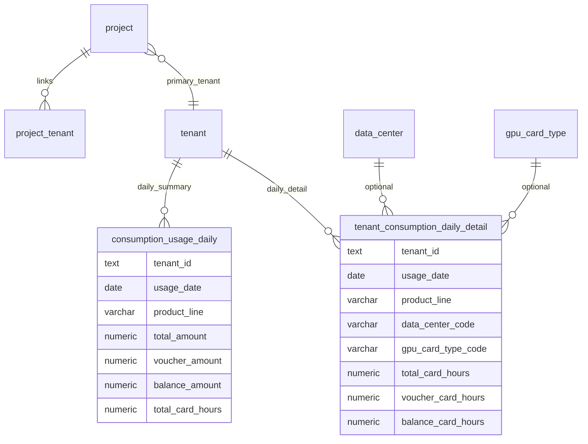

# 项目关联租户 · 产品线每日/月度消费与明细 — 数据库设计

> **版本**：v1.0（已确认）  
> **日期**：2026-05-26  
> **状态**：**已确认 — 实施中**  
> **关联**：`apps/web/content/design/crm-database.md`（§1.1 R3）、`billing-period-import-design.md`（卡时列口径）、`packages/db/src/crm-schema.ts`、`finance-schema.ts`  
> **触发场景**：项目详情页需展示「关联租户 × 产品线」的每日消费汇总（总消费、月消费、算力券消费），以及可下钻的每日明细（机房、卡型、余额/券/总卡时），对齐算算力平台账单日视图（任务 ID、任务名、总账、算力券抵扣、实付）。

---

## 1. 目标与非目标

### 1.1 业务目标

| # | 目标 | 说明 |
|---|------|------|
| G1 | **每日汇总** | 按项目关联的计费租户，按 **自然日 + 产品线** 展示：总消费、算力券消费、余额消费（实付） |
| G2 | **月度汇总** | 同上维度，按 **自然月 + 产品线** 展示月消费及券消费（可下钻到日） |
| G3 | **每日明细** | 选定某日、某产品线后，展示明细行：**机房、卡型、余额卡时、券卡时、总卡时**，以及金额拆分（总账 / 券抵扣 / 实付） |
| G4 | **项目视图** | 项目详情 Tab 通过 `project_tenant` + `primary_tenant_id` 解析租户集合后查询（与现有 `listDailyConsumptions` 一致） |
| G5 | **平台可对账** | 支持从算算力平台同步写入；幂等键防重复；保留 `raw_json` 便于排查 |

### 1.2 非目标（本期表结构不覆盖）

- 不在 `customer` 表存余额/消费聚合（沿用 R3.5）
- 不替代财务域 `billing_period_raw_tenant_bill` / `platform_cost_monthly`（月结账期专用）
- 不在本方案实现 **小时/周** 粒度表（UI 可后续扩展，首期以 **日** 为事实粒度）
- 不实现一租户多项目时的 **成本分成**（与财务 `billing_tenant_cost_allocation` 分立；项目视图仍展示关联租户全额，与现网 `listTasks` / `listRecharges` 行为一致）

---

## 2. 现状与缺口

### 2.1 已有表（CRM 计费域）

| 表 | 粒度 | 已有字段 | 缺口 |
|----|------|----------|------|
| `consumption_usage_daily` | 租户 × 日 × 产品线 | `amount`、`voucher_amount`、`balance_amount`、`gpu_seconds` | 无卡时三分字段；无机房/卡型；无项目维度（靠租户反查）；`gpu_seconds` 与财务「卡时」口径不一致 |
| `consumption_record` | 单笔明细 | `amount`、`duration`、`occurred_at` | 无券拆分、无机房/卡型/卡时；项目详情日汇总目前 **误用** 此表 GROUP BY |
| `tenant_bill` / `tenant_bill_detail` | 月账单 | 产品线金额 + 券/余额 | 非日粒度；明细无机房×卡型卡时 |
| `compute_task` | 任务 | `cost`、`resource_type` | 运行任务，非账单消费明细 |

### 2.2 财务域可参考口径（不直接复用表）

`billing_period_raw_tenant_bill` / `platform_cost_monthly` 已具备：

- `region_code` + `gpu_model`（对应 **机房区域 × 卡型**）
- `total_consumption` / `voucher_consumption` / `balance_consumption`
- `total_card_hours` / `voucher_card_hours` / `balance_card_hours`

卡时关系（与 `billing-period-import-design.md` v1.5.4 一致）：

```text
总卡时 = 券卡时 + 余额卡时
总消费（元）≈ 券消费 + 余额消费（实付）
```

### 2.3 平台同步现状

| API | 写入表 | 粒度 |
|-----|--------|------|
| `billing_pod_record_list`（`range=day`） | `consumption_usage_daily` | 租户 × 日 × `task_type`→产品线，**仅金额汇总** |
| `billing_record_detail_list` | `tenant_bill_detail` | 月账期 × 产品线 key，**无日×机房×卡型** |

平台日视图截图中的 **任务 ID / 任务名 / 按任务拆金额** 在当前 OpenAPI 封装中 **尚未拉取**，需在实施阶段补充接口字段映射（见 §6）。

---

## 3. 设计决策

| 决策 | 说明 |
|------|------|
| **D1 计费事实挂 Tenant** | 遵循 CRM §1.1 R3.1：日汇总与明细表均带 `tenant_id`；**不落库 `project_id`**，项目页按 `getBillingTenantIdsForProject` 过滤 |
| **D2 产品线用 varchar** | 与 `consumption_usage_daily.product_line`、`tenant_bill_detail.product_line` 一致；值域来自 `mapPlatformTaskType` / `mapPlatformProductLine` |
| **D3 两层存储** | **汇总层**（日 × 产品线）+ **明细层**（日 × 产品线 × 机房 × 卡型 [× 可选任务]）；明细 SUM 应可回勾汇总 |
| **D4 机房/卡型双写** | `data_center_id` / `gpu_card_type_id` 可空 FK；**必填快照** `*_code` / `*_name`，避免主数据变更后历史失真 |
| **D5 月消费查询方式** | **首期**：对日汇总表 `GROUP BY usage_month, product_line`；**可选二期**：物化月表 `tenant_product_consumption_monthly` |
| **D6 与旧表关系** | **扩展** `consumption_usage_daily`（补卡时列）；**新增** `tenant_consumption_daily_detail`；保留 `consumption_record` 兼容旧 Tab，逐步迁移读路径 |
| **D7 幂等同步** | 明细层 `platform_idempotency_key` UK；汇总层沿用 `usage-daily-{tenantId}-{date}-{productLine}` 逻辑主键 |

---

## 4. 实体关系（逻辑）



**项目页查询路径**：

```text
project.id
  → tenant_ids = primary_tenant_id ∪ project_tenant.tenant_id
  → consumption_usage_daily WHERE tenant_id IN (tenant_ids)
  → tenant_consumption_daily_detail WHERE tenant_id IN (tenant_ids) AND usage_date = ?
```

---

## 5. 表结构

### 5.1 通用约定

| 项 | 约定 |
|----|------|
| 主键 | `text`，应用层 `crypto.randomUUID()` 或确定性 ID（汇总层） |
| 金额 | `numeric(15,4)` — 与现有 `money()` 一致 |
| 卡时 | `numeric(15,4)` — 与财务 `cardHours()` 一致 |
| 日期 | `usage_date date` — **东八区自然日**（与 `usageDateFromPlatformPeriod` 一致） |
| 月份 | `usage_month varchar(7)` — `YYYY-MM`，由 `usage_date` 派生，冗余便于索引 |
| 枚举 | `varchar` + 应用常量，不用 PG ENUM |

---

### 5.2 扩展：`consumption_usage_daily`（租户 × 日 × 产品线汇总）

在现有表上 **新增列**（不删现有列；`gpu_seconds` 保留兼容，新读路径用卡时列）：

| 列名 | 类型 | 约束 | 说明 |
|------|------|------|------|
| `usage_month` | varchar(7) | NOT NULL | `YYYY-MM`，写入时由 `usage_date` 填充 |
| `total_card_hours` | numeric(15,4) | 可空 | 总卡时；明细汇总回填或平台日汇总接口提供 |
| `balance_card_hours` | numeric(15,4) | 可空 | 余额卡时 |
| `voucher_card_hours` | numeric(15,4) | NOT NULL DEFAULT 0 | 券卡时 |

**既有列语义对齐（不改名，仅文档统一）**：

| 列名 | UI 展示名 |
|------|-----------|
| `amount` | 总消费（元） |
| `voucher_amount` | 算力券消费（元） |
| `balance_amount` | 实付 / 余额消费（元） |

**约束与索引（迁移时补充）**：

```sql
-- 业务唯一：同一租户、同一自然日、同一产品线仅一行
CREATE UNIQUE INDEX consumption_usage_daily_tenant_date_pl_uk
  ON consumption_usage_daily (tenant_id, usage_date, product_line);

CREATE INDEX consumption_usage_daily_tenant_month_pl_idx
  ON consumption_usage_daily (tenant_id, usage_month, product_line);

CREATE INDEX consumption_usage_daily_customer_month_idx
  ON consumption_usage_daily (customer_id, usage_month);
```

**校验（应用层）**：

```text
amount ≈ voucher_amount + balance_amount
total_card_hours ≈ voucher_card_hours + balance_card_hours  （当三者均非空时）
```

**主键策略（保持现有导入逻辑）**：

```text
id = 'usage-daily-{tenant_id}-{usage_date}-{product_line}'
```

---

### 5.3 新增：`tenant_consumption_daily_detail`（每日消费明细）

对应平台日视图下钻表格；粒度：**租户 × 自然日 × 产品线 × 机房 × 卡型**，可选挂任务维度。

| 列名 | 类型 | 约束 | 说明 |
|------|------|------|------|
| `id` | text | PK | |
| `customer_id` | text | FK→`customer.id`，ON DELETE SET NULL | 冗余，便于客户维度报表 |
| `tenant_id` | text | FK→`tenant.id`，NOT NULL | 计费主体 |
| `usage_date` | date | NOT NULL | 东八区自然日 |
| `usage_month` | varchar(7) | NOT NULL | 冗余 `YYYY-MM` |
| `product_line` | varchar(64) | NOT NULL | 产品线，如 `pod_deployment` |
| **机房** | | | |
| `data_center_id` | text | FK→`data_center.id`，可空 | 匹配成功时写入 |
| `data_center_code` | varchar(64) | NOT NULL | 平台区域 code / `region_code` 快照 |
| `data_center_name` | varchar(255) | NOT NULL | 机房名称快照 |
| **卡型** | | | |
| `gpu_card_type_id` | text | FK→`gpu_card_type.id`，可空 | 匹配成功时写入 |
| `gpu_card_type_code` | varchar(64) | NOT NULL | 卡型 code 快照（对齐 `gpu_card_type.code`） |
| `gpu_card_type_name` | varchar(128) | 可空 | 展示名快照 |
| **任务（可选）** | | | |
| `platform_task_id` | varchar(64) | 可空 | 平台任务 ID（截图「任务ID」） |
| `task_name` | varchar(255) | 可空 | 平台任务名 |
| **金额（元）** | | | |
| `total_amount` | numeric(15,4) | NOT NULL | 总账 |
| `voucher_amount` | numeric(15,4) | NOT NULL DEFAULT 0 | 算力券抵扣 |
| `balance_amount` | numeric(15,4) | NOT NULL DEFAULT 0 | 实付金额 |
| **卡时** | | | |
| `total_card_hours` | numeric(15,4) | 可空 | 总卡时 |
| `voucher_card_hours` | numeric(15,4) | NOT NULL DEFAULT 0 | 券卡时 |
| `balance_card_hours` | numeric(15,4) | 可空 | 余额卡时 |
| **同步元数据** | | | |
| `source` | varchar(32) | NOT NULL DEFAULT `platform_sync` | `platform_sync` \| `finance_excel` \| `manual` |
| `platform_idempotency_key` | varchar(256) | NOT NULL | 幂等键，见 §5.5 |
| `raw_json` | jsonb | 可空 | 平台原始行 |
| `created_at` | timestamptz | NOT NULL DEFAULT now() | |
| `updated_at` | timestamptz | NOT NULL DEFAULT now() | |

**索引与唯一约束**：

```sql
CREATE UNIQUE INDEX tenant_consumption_daily_detail_idempotency_uk
  ON tenant_consumption_daily_detail (platform_idempotency_key);

CREATE INDEX tenant_consumption_daily_detail_tenant_date_pl_idx
  ON tenant_consumption_daily_detail (tenant_id, usage_date, product_line);

CREATE INDEX tenant_consumption_daily_detail_tenant_month_pl_idx
  ON tenant_consumption_daily_detail (tenant_id, usage_month, product_line);

CREATE INDEX tenant_consumption_daily_detail_dc_gpu_idx
  ON tenant_consumption_daily_detail (data_center_code, gpu_card_type_code);
```

**明细行唯一性（业务层）**：

```text
若 platform_task_id 非空：
  幂等键 = {tenant_id}|{usage_date}|{product_line}|{platform_task_id}
否则：
  幂等键 = {tenant_id}|{usage_date}|{product_line}|{data_center_code}|{gpu_card_type_code}
```

> PostgreSQL 对 NULL 的 UNIQUE 行为需注意：任务级与机房×卡型级建议 **分 source 写入策略**，或统一用 `platform_idempotency_key` 单列 UK（推荐）。

---

### 5.4 可选二期：`tenant_product_consumption_monthly`（月汇总物化）

仅当项目页「按月 × 产品线」查询变慢时启用；**首期可不建表**，用日汇总聚合：

```sql
SELECT usage_month, product_line,
       SUM(amount), SUM(voucher_amount), SUM(balance_amount),
       SUM(total_card_hours), SUM(voucher_card_hours), SUM(balance_card_hours)
FROM consumption_usage_daily
WHERE tenant_id IN (...)
GROUP BY usage_month, product_line;
```

若启用物化表：

| 列名 | 类型 | 约束 |
|------|------|------|
| `id` | text | PK，`usage-monthly-{tenant_id}-{usage_month}-{product_line}` |
| `customer_id` | text | FK 可空 |
| `tenant_id` | text | NOT NULL |
| `usage_month` | varchar(7) | NOT NULL |
| `product_line` | varchar(64) | NOT NULL |
| `total_amount` / `voucher_amount` / `balance_amount` | numeric(15,4) | |
| `total_card_hours` / `voucher_card_hours` / `balance_card_hours` | numeric(15,4) | |
| `updated_at` | timestamptz | |

```sql
UNIQUE (tenant_id, usage_month, product_line)
```

由日汇总 **UPSERT** 维护，或在租户账单同步事务末尾刷新。

---

### 5.5 汇总层与明细层一致性

| 规则 | 说明 |
|------|------|
| **R-AGG-1** | 同一 `(tenant_id, usage_date, product_line)` 下，明细 `SUM(total_amount)` 应等于汇总 `amount`（允许 ±0.0001 舍入误差） |
| **R-AGG-2** | 明细 `SUM(total_card_hours)` 回填汇总 `total_card_hours`（平台仅提供汇总时，以汇总为准，明细可为空） |
| **R-AGG-3** | 同步任务先写明细，再 **UPSERT** 汇总；或平台只提供汇总时仅写汇总、明细后续补拉 |

---

## 6. 数据来源与同步（已确认）

### 6.1 日汇总：`GET /admin/tenant/billing_pod_record_list`

参数（与现网 `fetchPlatformDailyUsageBills` 一致）：

```text
tenant_tid, range=day, task_type=Deployment|Job|Development,
start_time, end_time（UTC ISO，东八区自然日界）, page, page_size
```

响应 → `consumption_usage_daily`：

| 平台字段 | 落库列 |
|----------|--------|
| `start_time` | `usage_date`（东八区自然日） |
| — | `usage_month`（由 `usage_date` 派生） |
| `task_type` | `product_line`（`mapPlatformTaskType`） |
| `total_billing_value` | `amount` |
| `total_discount_value` | `voucher_amount` |
| 差值 | `balance_amount` |

**不建月汇总表**；仅保留 `usage_month` 列供 `WHERE usage_month = ?` 查询。

### 6.2 日明细（任务）：`GET /admin/tenant/billing_pod_record_task_summary_list`

对每条日汇总记录的 `start_time` / `end_time` / `task_type` 再拉任务明细（`fetchPlatformDailyTaskSummaries`）。

| 平台字段 | 落库列 |
|----------|--------|
| `task_id` | `platform_task_id` |
| `task_name` | `task_name` |
| `task_type` | 映射 `product_line` |
| `billing_value` | `total_amount` |
| `discount_value` | `voucher_amount` |
| 差值 | `balance_amount` |

机房 / 卡型 / 卡时：当前接口 **未返回**，落库用占位 `_na` / `—`，卡时列 **NULL**；后续若平台扩展字段或接入机房×卡型接口再写入。

幂等键：`{tenant_id}|{usage_date}|{product_line}|task|{task_id}`

### 6.3 机房×卡型明细（后续）

与财务 Excel / 其他 OpenAPI 对齐时写入同表，`source` 区分；`platform_idempotency_key` 不含 `task` 段。

---

## 7. 读模型与 API（确认后实现）

| 用途 | 建议 procedure | 查询表 |
|------|----------------|--------|
| 项目 · 每日消费列表 | `crm.projects.listDailyConsumptions`（改造） | `consumption_usage_daily` |
| 项目 · 某日消费明细 | `crm.projects.listDailyConsumptionDetails`（新增） | `tenant_consumption_daily_detail` |
| 租户账单同步 | `crm.tenants.commitBillingImport`（扩展） | 汇总 + 明细 |

**`listDailyConsumptions` 改造要点**：

- 数据源从 `consumption_record` 改为 `consumption_usage_daily`
- 返回字段增加：`voucherAmount`、`balanceAmount`、`totalCardHours`、`voucherCardHours`、`balanceCardHours`
- `tenant_id IN getBillingTenantIdsForProject(projectId)`

---

## 8. 迁移与兼容

| 步骤 | 操作 |
|------|------|
| M1 | Drizzle migration：`consumption_usage_daily` 加列 + 唯一索引 |
| M2 | 新建 `tenant_consumption_daily_detail` |
| M3 | 回填 `usage_month`：`UPDATE ... SET usage_month = to_char(usage_date, 'YYYY-MM')` |
| M4 | 历史汇总行卡时列保持 NULL，待下次平台同步或明细汇总回填 |
| M5 | （可选）从 `consumption_record` 按日聚合生成临时汇总，仅作过渡展示 |

**不删除** `consumption_record`、`gpu_seconds` 列，避免破坏现有导入与报表。

---

## 9. 已确认结论（2026-05-26）

| # | 结论 |
|---|------|
| Q1 | **按租户分行**展示 |
| Q2 | 一租户多项目时，各项目看到 **相同租户全额**（不分成） |
| Q3 | **任务级 + 机房×卡型** 均保留；任务由 `billing_pod_record_task_summary_list` 同步，机房×卡型待后续数据源 |
| Q4 | **不建月汇总表**；仅 `usage_month` 列便于按月筛选 |
| Q5 | 日汇总：`billing_pod_record_list`；日任务明细：`billing_pod_record_task_summary_list` |
| Q6 | 历史 `product_line` 为 NULL **不处理** |

---

## 10. 确认清单

- [x] 扩展 `consumption_usage_daily` + 新增 `tenant_consumption_daily_detail`
- [x] 计费事实仅挂 `tenant_id`
- [x] 平台 API 路径与字段映射（§6）

---

## 附录 A：字段与平台截图对照

| 平台 UI（截图） | 汇总层 `consumption_usage_daily` | 明细层 `tenant_consumption_daily_detail` |
|-----------------|-----------------------------------|------------------------------------------|
| 产品线（弹性部署） | `product_line` | `product_line` |
| 总账（元） | `amount` | `total_amount` |
| 算力券抵扣 | `voucher_amount` | `voucher_amount` |
| 实付金额 | `balance_amount` | `balance_amount` |
| 任务 ID | — | `platform_task_id` |
| 任务名 | — | `task_name` |
| 机房 | — | `data_center_name` / `data_center_code` |
| 卡型 | — | `gpu_card_type_code` / `gpu_card_type_name` |
| 总卡时 / 券卡时 / 余额卡时 | `total_card_hours` 等 | `total_card_hours` 等 |

## 附录 B：与现有 `listDailyConsumptions` 实现差异

当前实现（待改造）从 `consumption_record` 按 `project_id` 聚合，导致：

- 无算力券拆分、无卡时、无机房卡型  
- 仅包含已写 `project_id` 的明细，漏掉租户级同步数据  

确认本设计后，读路径改查 `consumption_usage_daily` + `tenant_consumption_daily_detail`，与租户账单同步数据一致。
