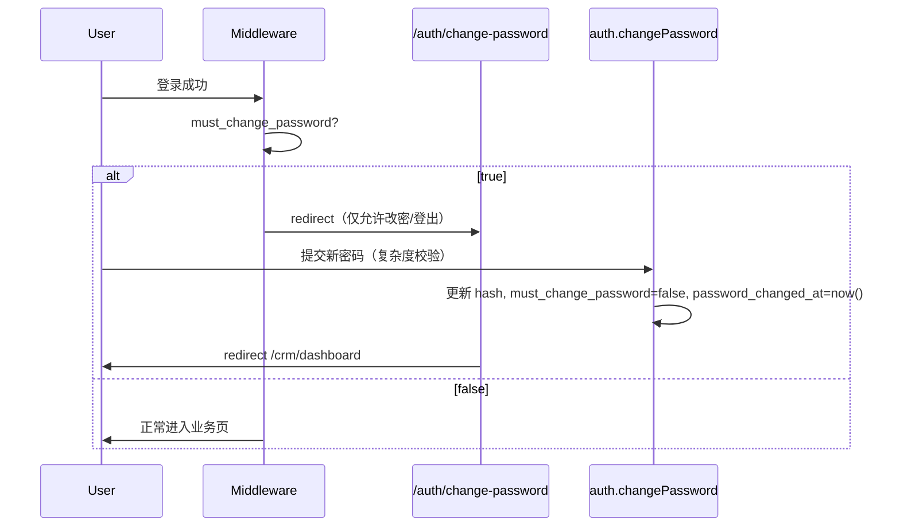

# CRM RBAC 权限设计方案

> 版本：v0.4（待确认）  
> 日期：2026-05-19  
> 状态：**设计稿 — 确认后再实施代码**

---

## 1. 目标与范围

### 1.1 业务目标

| # | 需求 | 说明 |
|---|------|------|
| R1 | 仅管理员创建的用户可登录 | 关闭公开注册；账号由 Admin 创建或邀请；未授权账号拒绝登录 |
| R2 | 首次登录必须修改初始密码 | 管理员下发临时密码后，用户首次成功登录须先改密才能进入业务页 |
| R3 | 密码复杂度校验 | 创建账号、改密、重置密码时统一校验规则（前后端一致） |
| R4 | Admin 可见全部 CRM 数据 | 客户、项目、合同、账单、仪表盘等无行级限制 |
| R5 | User / Member 仅可见 AM 分配的客户与项目 | 以 CRM **客户经理分配** 为准；与员工主数据 1:1 绑定（见 §4） |

### 1.2 本期范围

- **纳入**：认证与用户生命周期、应用级 RBAC、CRM 域行级数据过滤、tRPC/中间件门禁
- **暂不纳入**（可二期）：供应商域、财务域、组织插件多租户权限与 CRM 权限的统一、细粒度按钮级 ACL

### 1.3 非目标

- 不改造 Better Auth 组织插件的 owner/admin/member 为 CRM 主权限模型（组织权限保留；**应用 CRM 角色**以 `users.role` 的 `admin` / `user` / `member` 为准，与组织 `member.role` 同名不同义）
- 不引入独立权限表（如 Casbin）；首期用 **角色 + 数据范围（Data Scope）** 即可满足需求

---

## 2. 现状摘要

### 2.1 已有能力

- **认证**：Better Auth（邮箱密码、手机 OTP），`adminPlugin` 已安装但未用于建号流程
- **用户表** `users`：`role` 默认 `user`，注释含 admin/user/guest；`banned` 可封禁
- **CRM 分配表**：
  - `account_manager_assignment`：客户 ↔ AM（`effective_to IS NULL` 为当前主责）
  - `project_staff_assignment`：项目四人组（含 `role_type = account_manager`）
- **员工主数据** `user_staff`：与 `users` **无外键关联**
- **tRPC**：`protectedProcedure`（仅登录）、`adminProcedure`（现网 `role !== 'user'`，将改为 `role === 'admin'`，见 §8.2）
- **数据层**：CRM list/get **无** 按用户过滤；任意登录用户可读全量

### 2.2 主要缺口

```
公开注册 (/auth/register, /signup)  ──►  需关闭
users ↔ user_staff 未关联          ──►  1:1 + StaffUserService 同步（§4，不合并表）
无 mustChangePassword               ──►  无法强制改密
密码规则不统一                      ──►  需统一 Zod + 服务端
proxy.ts 未挂 middleware            ──►  页面级保护薄弱
firstLogin 为时间启发式              ──►  需改为显式字段
```

---

## 3. 角色与权限模型

### 3.1 应用级角色（唯一 CRM 权限来源）

系统保留三类角色，**不做** `user` → `member` 的合并迁移：

| 角色值 | 显示名 | 登录 | 用户/员工管理 | CRM 数据范围 | CRM 写操作 |
|--------|--------|------|---------------|--------------|------------|
| `admin` | 管理员 | ✓ | 创建/禁用/重置密码；同步维护员工 | **全部** | 全部 |
| `user` | 业务用户 | ✓ | ✗ | **AM 分配范围内**（同 member） | 范围内可写（客户/项目等，见 §6.4） |
| `member` | 成员 | ✓ | ✗ | **AM 分配范围内** | 首期只读 |

**与历史值的关系**：

| 旧 `users.role` | 处理 |
|-----------------|------|
| `admin` | 保持 `admin` |
| `user` | 保持 `user`（业务用户，非「普通游客」） |
| `member` | 保持 `member` |
| `sales` | 一次性映射为 `user` 或 `admin`（按是否需用户管理区分） |
| `guest` / 非法值 | `banned` 或禁止登录 |

> **命名说明**：`users.role = 'member'` 表示 CRM **成员（只读）**；组织表 `member.role` 仍为 Better Auth 组织插件字段，**不参与** CRM 鉴权。文档中「组织成员」改用「组织 membership」以免混淆。

### 3.2 权限矩阵（CRM）

| 资源 | admin | user | member |
|------|-------|------|--------|
| 客户 list/get | 全部 | AM 范围内 | AM 范围内 |
| 项目 list/get | 全部 | AM 范围内（见 §6.2） | AM 范围内 |
| 合同/账单/充值/消费/订单/任务/日历/分析 | 全部 | 继承 customer/project 范围 | 继承 |
| 员工主数据 list | 全部 | 范围内同事 + 自己（展示用） | 仅自己 |
| 客户/项目 CUD | ✓ | ✓（范围内） | ✗ |
| 员工 `user_staff` CUD | ✓ | ✗ | ✗ |
| 系统账号管理 | ✓ | ✗ | ✗ |

### 3.3 数据范围（Data Scope）定义

```ts
type CrmDataScope =
  | { type: 'all' }                           // admin
  | { type: 'am_assigned'; staffId: string }  // user | member
```

**解析流程**（每次 CRM 请求）：

1. 从 session 取 `userId`
2. 查 `users`：`role`, `staffId`, `mustChangePassword`, `banned`, `provisionedBy`
3. `admin` → `{ type: 'all' }`
4. `user` | `member` → 若无 `staffId` → **403**（账号未绑定员工档案）
5. `user` | `member` + `staffId` → `{ type: 'am_assigned', staffId }`

**写操作校验**：`user` 在 mutate 前须校验目标 `customerId` / `projectId` 落在其 `am_assigned` 集合内；`member` 直接 **403**。

---

## 4. 用户与员工（1:1）模型

### 4.1 方案对比与建议

| 方案 | 做法 | 优点 | 缺点 | 结论 |
|------|------|------|------|------|
| **A. 合并为单表** | 删掉 `user_staff`，认证与 CRM 共用 `users` | 模型最简单 | Better Auth 强依赖 `users` 结构；CRM 大量 FK（`account_manager_assignment.user_staff_id` 等）需全库迁移；员工可先存在于 CRM 却无账号 | **不推荐** |
| **B. 双表 1:1 + 同步编排（推荐）** | 保留 `users` + `user_staff`；`users.staff_id` UNIQUE；创建/更新走统一 `StaffUserService` | 兼容 Better Auth 与现有 CRM FK；边界清晰（认证域 / 经营域） | 需维护同步逻辑 | **推荐** |
| **C. 双表 1:1 共主键** | `users.id === user_staff.id`（同一 cuid） | 关联直观，少一列语义 | 建号顺序与 Better Auth 生成 id 需约定；仍要双表 | 可作为 B 的变体 |

**推荐采用方案 B（必要时结合 C）**：

- **不合并表**：`users` 管登录与会话；`user_staff` 管 CRM 主数据与人岗分配（AM、项目四人组等 FK 不变）。
- **默认 1:1**：每个可登录的 `user` / `member` / 需绑定员工的 `admin`（若参与 AM）均对应唯一 `user_staff`。
- **同步创建/修改**：管理端只有一套表单，服务端 **单事务** 写两表，禁止只改其一。

### 4.2 数据约束

```sql
-- users.staff_id 全局唯一（含 NULL：PostgreSQL 中多个 NULL 不冲突）
CREATE UNIQUE INDEX users_staff_id_uk ON users(staff_id) WHERE staff_id IS NOT NULL;

-- 可选：员工侧反查（便于「无账号员工」排查）
-- user_staff 不强制 UNIQUE user_id，因未开通账号的员工可无 users 行
```

| 规则 | 说明 |
|------|------|
| `user`、`member` | **必须** `staff_id NOT NULL` |
| `admin` | `staff_id` 可空（纯管理账号）；若需出现在 AM 分配中则绑定员工 |
| 未开通账号的员工 | 允许仅存在 `user_staff`（如待入职）；**不可登录** |
| 开通账号 | Admin「创建账号」→ 选中已有员工或新建员工 → 同事务创建/关联 `users` |

### 4.3 StaffUserService（同步编排）

统一入口，避免 UI/路由各写一套：

```ts
// packages/auth 或 apps/web/src/lib/server/services/staff-user.ts

type StaffUserInput = {
  displayName: string
  email: string
  mobile: string
  department?: string
  employeeNo?: string
  status: 'active' | 'inactive'
  role?: 'admin' | 'user' | 'member'  // 仅 createWithAccount / provisionAccount 时必填
}

// createWithAccount：INSERT user_staff → INSERT users(staff_id, role, …)
// createStaffOnly：仅 INSERT user_staff
// 更新：按 staff_id 同步 displayName/email/mobile/department；users.name/email/phone 同源更新
// 禁用：user_staff.status=inactive + users.banned=true（或仅禁止 session）
```

**字段映射（单一事实来源）**：

| 业务含义 | `user_staff` | `users` (Better Auth) |
|----------|--------------|------------------------|
| 姓名 | `display_name` | `name` |
| 邮箱 | `email` | `email` |
| 手机 | `mobile` | `phone_number` |
| 状态 | `status` | `banned` / 登录 hook 联动 |
| **应用角色** | —（`user_staff` **不存**角色） | `role`（`admin` \| `user` \| `member`，见 §4.4） |

**可选变体 C**：创建时 `const id = createId()`，两表均用 `id` 作为主键，`users.staff_id = users.id`，减少 join 歧义。

### 4.4 角色存储：仅在 `users` 表

**已确认**：不在 `user_staff` 增加 `app_role`；应用角色 **只** 存在于 `users.role`（有登录账号时）。

| 场景 | 角色 | 说明 |
|------|------|------|
| 仅 `user_staff`、未开通账号 | 无角色字段 | 仅 HR/CRM 主数据；**不可登录**；列表显示「未开通」 |
| 创建/开通 `users` | `users.role` **必填** | `admin` \| `user` \| `member`；鉴权唯一来源 |
| 修改员工且 **无** `users` | 不校验角色 | `staffUpsertSchema` 不含 `role` |
| 修改员工且 **有** `users` | 改账号须带 `role` | 经 `StaffUserService` 更新 `users.role` |
| 为员工 **开通账号** | `role` **必填** | `provisionAccount(staffId, role, password, …)` |

```ts
const appRoleSchema = z.enum(['admin', 'user', 'member'])

// 仅员工档案（现网 staffUpsertSchema 基本不变）
const staffUpsertSchema = z.object({ /* displayName, mobile, … */ })

// 开通账号 / 一体创建账号时
const provisionUserSchema = z.object({
  staffId: z.string().optional(), // 已有员工时
  staff: staffUpsertSchema.optional(), // 新建员工时
  role: appRoleSchema,              // 必填
  password: z.string(),             // 须过 password-policy
})
```

**StaffUserService 规则**：

| 操作 | 要求 |
|------|------|
| `createStaffOnly` | 只写 `user_staff`；**无** `role` |
| `createWithAccount` | 单事务：`user_staff` + `users(role, staff_id, …)`；`role` 必填 |
| `updateStaffOnly` | 只改 `user_staff` 字段 |
| `updateAccount` / `provisionAccount` | 必须带 `role` 写入/更新 `users.role` |
| `updateStaffAndAccount` | 员工字段 + 若存在 `users` 则含 `role` |

**UI**：

- 员工表单（无账号）：姓名/手机/邮箱/部门等；**无**角色下拉。
- 「开通账号」或「创建并开通」：增加角色 + 初始密码。
- 员工列表：`LEFT JOIN users`，展示 `users.role` 或「未开通」。

### 4.5 管理端交互

- **员工列表页**：`user_staff` + `users.role`（可空）+ 是否已开通账号。
- **创建**：可仅建员工；或勾选「同时开通账号」→ 必填角色与密码。
- **编辑**：无账号只改员工；有账号在同一管理流中改 `users.role`。
- **CRM 选人**：仍选 `user_staff.id`（与现网一致）。

---

## 5. 用户生命周期（仅管理员建号）

### 5.1 关闭公开注册

| 项 | 动作 |
|----|------|
| 路由 | 下线或 404：`/auth/register`、`/signup`；登录页移除「注册」入口 |
| API | Better Auth `signUp` 在 `databaseHooks.user.create.before` 中 **拒绝** 非 Admin 调用（或 `disableSignUp: true` 若插件支持） |
| 手机 OTP | `signUpOnVerification` 关闭自动注册，仅允许已存在用户登录 |

### 5.2 管理员创建用户（经 StaffUserService）

使用 **Better Auth Admin Plugin** + `StaffUserService` + 自建管理页：

**创建流程**：

```
Admin 填写：员工信息（姓名/邮箱/手机/部门/工号）+ 角色(admin|user|member) + 初始密码
    → StaffUserService.create（单事务）：
         1. INSERT user_staff
         2. INSERT users（staff_id, role, must_change_password=true,
            provisioned_by, provisioned_at）+ account 密码
    → 可选：邮件/短信下发临时密码
```

**新增/扩展字段（`users` 表）**：

| 字段 | 类型 | 说明 |
|------|------|------|
| `staff_id` | text FK → `user_staff.id` UNIQUE | `user`/`member` 必填；`admin` 可空 |
| `must_change_password` | boolean default true | 首次登录门禁 |
| `password_changed_at` | timestamptz nullable | 最近一次改密时间 |
| `provisioned_by` | text FK → `users.id` nullable | 创建人；NULL 表示历史/系统账号 |
| `provisioned_at` | timestamptz | 创建时间 |

**登录校验（`session.create.before` 或 signIn hook）**：

```text
IF user.banned → 拒绝
IF user.provisioned_by IS NULL AND 非白名单迁移账号 → 拒绝（可选，见 §14）
IF user.role NOT IN ('admin','user','member') → 拒绝
ELSE → 允许建立 session
```

> **「仅管理员创建的用户可登录」** 落地为：`provisioned_by IS NOT NULL`。历史账号迁移时批量设置 `provisioned_by` 为系统用户 ID。

### 5.3 管理功能清单（Admin UI / tRPC `admin.users`）

- 创建账号（`StaffUserService.create`：员工 + 用户同事务）
- 为已有 `user_staff` 开通账号（仅补 `users` 行）
- 列表 / 搜索 / 禁用（同步 `user_staff.status` + `users.banned`）
- 重置密码（`must_change_password=true`）
- 开通/修改账号角色（`users.role`，必填）；编辑员工主数据（`StaffUserService`，无账号时不涉及 role）

---

## 6. 行级数据隔离（CRM）

### 6.1 User / Member 可见客户

当前主责客户经理分配：

```sql
SELECT customer_id
FROM account_manager_assignment
WHERE user_staff_id = :staffId
  AND effective_to IS NULL;
```

`customersDataAccess.list/getById` 在 `scope.type === 'am_assigned'` 时增加：

```sql
WHERE customer.id IN (:visibleCustomerIds)
```

若列表为空，返回 `[]`（非 403）。

### 6.2 User / Member 可见项目

**推荐规则（并集）**：

1. **客户继承**：`project.customer_id IN (可见客户 IDs)`
2. **项目级 AM**：`project_staff_assignment` 中 `role_type = 'account_manager'` AND `user_staff_id = :staffId` AND `effective_to IS NULL`

```sql
visible_projects =
  projects WHERE customer_id IN (:visibleCustomerIds)
  UNION
  projects WHERE id IN (
    SELECT project_id FROM project_staff_assignment
    WHERE user_staff_id = :staffId
      AND role_type = 'account_manager'
      AND effective_to IS NULL
  )
```

> 若业务确认仅客户级 AM、不含项目四人组，可去掉规则 2。

### 6.3 关联资源继承

凡带 `customer_id` 或 `project_id` 的表，查询时 join 或子查询限制在可见 ID 集合内：

| 模块 | 过滤键 |
|------|--------|
| contracts | customer_id / project_id |
| tenant_bill, recharge, consumption, orders, tasks | project_id 或 tenant→customer |
| dashboard / analytics | 聚合前先取可见 customer/project 集合 |
| calendar (account_activity) | customer_id |
| staff.list | admin 全量；user/member 见 §3.2 |

**单条 getById**：`user` / `member` 访问范围外 ID → **404**。

### 6.4 写权限

| 角色 | CRM 写 |
|------|--------|
| `admin` | 全部 |
| `user` | 仅 `am_assigned` 范围内（mutate 前校验目标 ID） |
| `member` | 无（首期只读） |

二期可为 `member` 开放跟进/任务等写能力，仍限 AM 范围。

### 6.5 实现位置（分层）

```
┌─────────────────────────────────────────────────────────┐
│ Middleware / Protected Layout                           │
│  未登录 → login；mustChangePassword → change-password    │
└──────────────────────────┬──────────────────────────────┘
                           ▼
┌─────────────────────────────────────────────────────────┐
│ tRPC: resolveCrmScope() middleware                      │
│  ctx.crmScope = { type, staffId? }                      │
└──────────────────────────┬──────────────────────────────┘
                           ▼
┌─────────────────────────────────────────────────────────┐
│ crmScopedProcedure / crmWriteProcedure / adminProcedure │
└──────────────────────────┬──────────────────────────────┘
                           ▼
┌─────────────────────────────────────────────────────────┐
│ *DataAccess 方法签名增加 scope: CrmDataScope            │
│  buildCustomerFilter(scope) / buildProjectFilter(scope) │
└─────────────────────────────────────────────────────────┘
```

**禁止**仅在前端隐藏菜单；所有 `crm.*` 读接口必须在 data access 层过滤。

---

## 7. 密码策略与强制改密

### 7.1 复杂度规则（统一）

建议放入 `packages/auth/src/password-policy.ts`，前后端共用 Zod：

| 规则 | 要求 |
|------|------|
| 长度 | 8–128 字符 |
| 大写字母 | 至少 1 个 `[A-Z]` |
| 小写字母 | 至少 1 个 `[a-z]` |
| 数字 | 至少 1 个 `[0-9]` |
| 特殊字符 | 至少 1 个 `` !@#$%^&*()_+-=[]{}|;:'",.<>?/`~ `` |
| 禁止 | 与邮箱/local-part 相同；连续相同字符 ≥4（如 `aaaa`） |
| 临时密码 | 创建时也必须满足（不能 `12345678`） |

错误信息对用户友好、可 i18n。

### 7.2 强制改密流程



| 层级 | 行为 |
|------|------|
| Middleware | 除白名单外，所有 `(protected)/*` 重定向到 `/auth/change-password` |
| 白名单 | `/auth/change-password`、`/auth/login`、`/auth/logout`、`/api/auth/*` |
| tRPC | `protectedProcedure` 若 `mustChangePassword` → `PRECONDITION_FAILED`（除 `auth.changePassword`、`auth.getSession`） |
| 改密后 | 清除 `must_change_password`；可选：销毁其他 session 仅保留当前 |

**废弃** `firstLoginRouter` 的时间差启发式，改为读 `users.must_change_password`。

### 7.3 应用点

- Admin 创建用户 / 重置密码
- 用户主动改密（设置页）
- 忘记密码重置（`sendResetPassword` 回调页提交时）

Better Auth 侧：在 `emailAndPassword` 相关 hook 或包装 API 中调用同一 `validatePassword()`。

---

## 8. tRPC 过程类型（重构）

### 8.1 过程一览（已确认）

| 过程 | 条件 | 用途 |
|------|------|------|
| `publicProcedure` | 无 | 健康检查等 |
| `protectedProcedure` | 已登录 + 未 banned + 非 mustChangePassword（改密 API 除外） | 通用 |
| `crmScopedProcedure` | protected + 解析 `ctx.crmScope` | CRM 读（admin / user / member） |
| `crmWriteProcedure` | **新增**；`role IN ('admin','user')`；user 写前校验 scope | CRM 业务写（客户/项目等） |
| `adminProcedure` | **保留名称**；实现改为 `role === 'admin'` | 员工 CRUD、账号管理、`StaffUserService`、全局配置 |

> **不新增** `crmAdminProcedure`：`adminProcedure` 语义与原先设计的 `crmAdminProcedure` 一致，即 **仅管理员**。

### 8.2 `adminProcedure` 调整说明

**现网**（`role !== 'user'`）与目标不一致：会误放行 `member`，且阻止 `user` 在范围内写客户/项目。

**已确认做法**：

1. **`adminProcedure`**：仅改实现为 `ctx.user.role === 'admin'`，继续用于员工/账号类路由。
2. **`crmWriteProcedure`**：新增，承接原挂在 `adminProcedure` 上的 **客户/项目** 等 mutate；`user` 在 scope 内可写。
3. **不废弃、不重命名** `adminProcedure`。

```ts
// trpc.ts（目标实现示意）
export const adminProcedure = t.procedure.use(({ ctx, next }) => {
  if (!ctx.user?.id) throw new TRPCError({ code: 'UNAUTHORIZED' })
  if (ctx.user.role !== 'admin') {
    throw new TRPCError({ code: 'FORBIDDEN', message: '需要管理员权限' })
  }
  return next({ ctx: { user: ctx.user, session: ctx.session } })
})

export const crmWriteProcedure = t.procedure.use(/* admin | user + assertInScope */)
```

**路由映射**：

| 路由 | procedure |
|------|-----------|
| `crm.customers.create/update` | `crmWriteProcedure` |
| `crm.projects.create/update` | `crmWriteProcedure` |
| `crm.staff.create/update/delete` | `adminProcedure` |
| `admin.users.*` | `adminProcedure` |

### 8.3 Context 扩展

```ts
type AppRole = 'admin' | 'user' | 'member'

interface TRPCContext {
  user: UserWithRole & {
    role: AppRole
    staffId?: string | null
    mustChangePassword?: boolean
  }
  crmScope?: CrmDataScope
}
```

`createContextFromRequest` / `createServerCaller` 需从 DB 加载完整 user 字段（不只 role）。

---

## 9. 路由与中间件

### 9.1 启用 Next.js Middleware

将 `apps/web/src/proxy.ts` 挂为 `middleware.ts`（或 re-export），并扩展：

| 检查 | 动作 |
|------|------|
| 无 session cookie | 非公开路由 → `/auth/login` |
| 有 session + mustChangePassword | 非白名单 → `/auth/change-password` |
| 已登录访问 login/register | → `/crm/dashboard` 或改密页 |

公开路由补充：`/auth/signin`、`/auth/login`、`/auth/change-password`、`/auth/forgot-password`、`/auth/reset-password`。

### 9.2 Protected Layout 加固

`(protected)/layout.tsx` 服务端 `getSession()`，无 session 则 `redirect(login)`（与 middleware 双保险）。

---

## 10. 数据库变更

### 10.1 Migration（`packages/db`）

```sql
ALTER TABLE users
  ADD COLUMN staff_id text REFERENCES user_staff(id) ON DELETE SET NULL,
  ADD COLUMN must_change_password boolean NOT NULL DEFAULT false,
  ADD COLUMN password_changed_at timestamptz,
  ADD COLUMN provisioned_by text REFERENCES users(id) ON DELETE SET NULL,
  ADD COLUMN provisioned_at timestamptz;

CREATE UNIQUE INDEX users_staff_id_uk ON users(staff_id) WHERE staff_id IS NOT NULL;
CREATE INDEX users_provisioned_by_idx ON users(provisioned_by);

-- user_staff 不增加角色列；角色仅在 users.role

-- 角色：保留 admin / user / member，不合并
-- 历史 sales → user（示例，可按业务调整）
UPDATE users SET role = 'user' WHERE role = 'sales';
UPDATE users SET role = 'member' WHERE role IN ('guest') OR role IS NULL;
```

### 10.2 Better Auth additionalFields

在 `auth.ts` 的 `user.additionalFields` 注册：`staffId`, `mustChangePassword`, `provisionedBy` 等，保证 session 可携带（或每次从 DB 补全）。

---

## 11. API 与页面变更清单

### 11.1 新增

| 类型 | 路径/路由 |
|------|-----------|
| 页面 | `/[locale]/auth/change-password` |
| 页面 | `/[locale]/(protected)/admin/users`（用户管理） |
| tRPC | `admin.users.create | list | ban | resetPassword | update` |
| tRPC | `auth.changePassword`（包装 Better Auth + 清 flag） |
| 共享 | `packages/auth/src/password-policy.ts` |
| 服务 | `StaffUserService`（create / update / provision / ban） |

### 11.2 修改

| 文件/模块 | 变更 |
|-----------|------|
| `crm/index.ts` 及各 data access | 注入 `scope` 过滤；写接口用 `crmWriteProcedure` |
| `trpc.ts` | 新增 `crmWriteProcedure`；`adminProcedure` 改为 `role === 'admin'` |
| `crm/index.ts` | 客户/项目 mutate 改用 `crmWriteProcedure` |
| `crm/schemas.ts` | 新增 `provisionUserSchema`（含必填 `role`）；`staffUpsertSchema` 不含 role |
| CRM 员工/账号 | `adminProcedure` + `StaffUserService` |
| `trpc/server.ts` | 加载完整 user |
| `auth.ts` | hooks：禁止自助注册、登录校验 provisioned |
| 登录/注册组件 | 移除注册入口 |
| `app-sidebar.tsx` | admin 显示「用户管理」 |

### 11.3 删除/废弃

- `firstLoginRouter` 启发式逻辑（或保留只读兼容一周后删除）
- 公开 `RegisterForm` 路由

---

## 12. 实施阶段建议

| 阶段 | 内容 | 预估 |
|------|------|------|
| **P0** | DB 迁移 + 密码策略 + 关闭注册 + provisioned 登录校验 | 1–2d |
| **P1** | `StaffUserService` + Admin 用户/员工一体创建与同步更新 | 1–2d |
| **P2** | 强制改密页 + middleware + auth.changePassword | 1d |
| **P3** | `crmScope` + customers/projects 过滤（user/member） | 2–3d |
| **P4** | 关联模块继承过滤 + `crmWriteProcedure` 范围校验 | 2d |
| **P5** | 历史账号迁移（provisioned + staff 绑定）+ E2E | 1d |

---

## 13. 测试要点

| 场景 | 期望 |
|------|------|
| 未 provisioned 用户登录 | 401/403 |
| user/member 无 staff_id | 403 |
| 开通账号未填 role | 400（Zod） |
| 仅建 user_staff 要求 role | 不应校验 role |
| 改邮箱仅更新 users、未同步 staff | **不应出现**（单测 StaffUserService） |
| user 登录后 mustChangePassword | 只能进改密页 |
| member 改客户 | 403 |
| user 改范围外客户 | 404/403 |
| user 改范围内客户 | 成功 |
| user/member 列表客户 | 仅 AM 分配 |
| admin 列表 | 全量 |
| 同一 staff 绑定两个 users | DB 唯一约束失败 |
| 自助 register | 拒绝 |

---

## 14. 待确认问题

1. **User 与 Member 差异**：除写权限外，数据范围是否完全一致？（本文默认一致）
2. **项目可见范围**：仅客户级 AM，还是含项目四人组 AM？（默认 **并集**）
3. **共主键变体 C**：是否采用 `users.id = user_staff.id`？
4. **历史 `sales`**：映射为 `user` 还是 `admin`？
5. **历史账号**：是否批量 provisioned + 强制改密？
6. **手机 OTP**：是否关闭自动注册？

---

## 15. 确认方式

请在本设计稿上反馈：

- [ ] 同意按本文实施  
- [ ] 需调整（请注明章节号与修改意见）

确认后，将按 **P0 → P5** 顺序提交代码与 migration。
