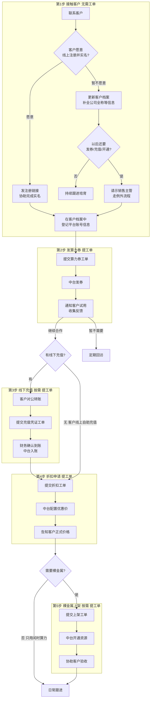
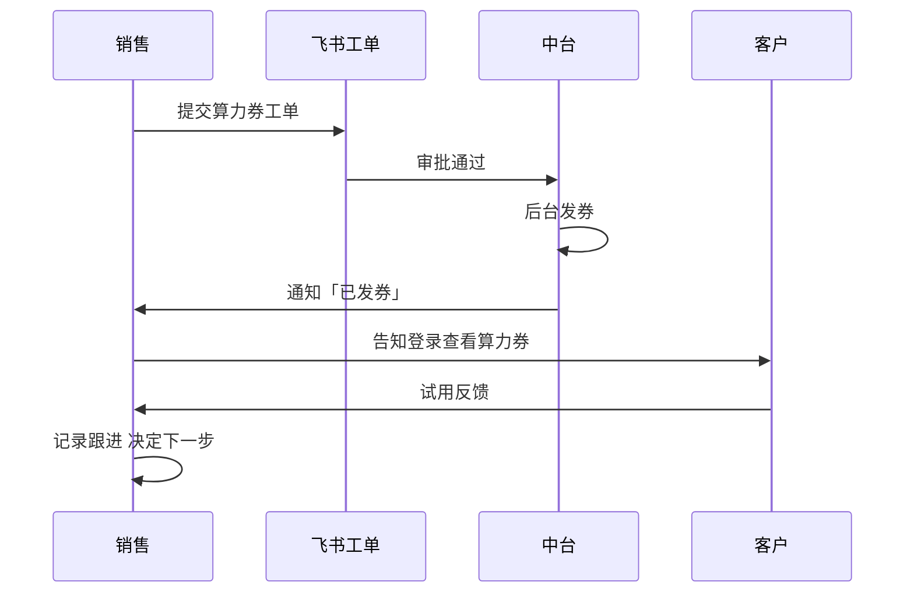
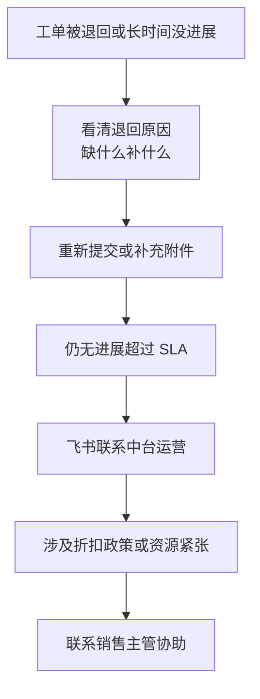

# 闲时算力平台 — 销售跟进与客户交付配合 SOP

> **版本**：v1.1  
> **日期**：2026-06-10  
> **适用对象**：**销售人员**（无需技术背景）  
> **文档性质**：部门间协作标准流程，与系统开发无关  
> **用途**：帮助销售清楚 **每一步该做什么、找谁办、客户需要配合什么**，顺利推进从接触到交付的全过程

---

## 写在前面：销售只需记住三件事

1. **先建档、再办事** — 客户信息不全，后面的工单会被退回，耽误交付。
2. **第 2～5 步都要提飞书工单** — 算力券、线下充值、折扣、裸金属上架，均由中台运营在后台处理；销售负责 **提单 + 催进度 + 帮客户验收**。
3. **顺序不能乱** — 试用发券 →（如有）线下充值到账 → 申请折扣 →（如需）裸金属开通。充值没到账，不要提前申请折扣。

---

## 1. 整体流程（一张图看懂）

### 五步对照表（销售速查）

| 步骤 | 做什么 | 要不要提工单 | 销售主要工作 | 中台主要工作 |
|:-----:|--------|:------------:|--------------|--------------|
| **1** | 接触客户、注册实名、完善档案 | 否 | 联系客户、发链接、补全信息 | — |
| **2** | 发放算力券（试用） | **是** | 填工单、通知客户查券、跟进试用 | 审核并发券 |
| **3** | 线下充值入账 | **是**（有线下付款时） | 收凭证、填工单、跟进到账 | 配合财务确认并入账 |
| **4** | 申请折扣/协议价 | **是** | 填工单、等审批、告知客户价格 | 配置优惠价 |
| **5** | 裸金属资源开通 | **是**（需要裸金属时） | 确认需求、填工单、帮客户验收 | 后台开通资源 |

> **说明**：客户如果 **只用闲时算力、不用裸金属**，可以不做第 5 步。第 3 步只有 **对公转账等线下付款** 时才需要。

---

## 2. 涉及的角色（找谁帮忙）

| 角色 | 销售什么时候找 TA |
|------|-------------------|
| **你自己（销售）** | 联系客户、维护客户档案、提交工单、跟进进度、帮客户验收 |
| **中台运营** | 工单审批通过后，在平台后台发券、入账、配折扣、开通资源 |
| **销售主管** | 折扣超出你的权限、客户坚持不注册但又要发券/充值时 |
| **财务** | 线下充值金额较大或首次对公转账，需核对银行流水时（由中台协调，销售配合提供凭证） |

**协作原则**：销售 **只提工单、不自己改后台**；中台 **只按工单办事、信息不全会退回**；退回时按意见补材料重新提交即可。

---

## 3. 第 1 步：接触客户（无需工单）

### 3.1 你要完成的目标

- 客户愿意合作，且档案信息完整；
- 若走线上：客户已在算算力平台 **注册并完成实名**；
- 若暂不走线上：至少把 **公司全称、联系人、电话** 等记全。

### 3.2 推荐路径 — 客户愿意注册（优先）

| 顺序 | 你做什么 | 客户做什么 | 怎么算完成 |
|:----:|----------|------------|------------|
| 1 | 发送平台注册链接，口头说明：**注册后必须完成实名，否则无法发券和充值** | 注册账号 | 客户反馈「已注册」 |
| 2 | 引导客户完成 **企业或个人实名认证** | 按页面提示上传资料 | 客户截图「实名已通过」 |
| 3 | 在 **客户档案** 中新建或更新该客户，填写公司全称、联系人、电话 | — | 档案可查、信息齐全 |
| 4 | 把客户的 **平台登录账号或注册手机号** 记在档案备注里，方便后续工单填写 | — | 备注已保存 |

**可发给客户的话术参考**：

> 您好，使用闲时算力需要先在我们平台完成注册和实名认证。我这边把注册链接发您，实名通过后我帮您申请试用算力券。整个过程大约 10～20 分钟，有问题随时找我。

### 3.3 备选路径 — 客户暂时不愿注册

| 顺序 | 你做什么 | 说明 |
| :---: | :--- | :--- |
| 1 | 在客户档案中 **务必填写公司全称**（与营业执照或合同主体一致） | 后续合同、开票、充值都要用 |
| 2 | 补充联系人、手机、邮箱、客户意向 | 便于持续跟进 |
| 3 | 判断：以后是否还需要 **发券、充值、开通资源**？ | |
| 3a | 若 **不需要** | 正常跟进即可，暂不进入第 2～5 步 |
| 3b | 若 **需要** 但客户仍不注册 | **先请示销售主管**，按主管意见走例外流程；未批准前 **不要提交充值和上架类工单** |

### 3.4 提交下一步工单前，请自检

- [ ] 客户公司全称已填写  
- [ ] 联系人姓名和手机号已填写  
- [ ] 客户已完成注册和实名（或主管已批准例外）  
- [ ] 平台账号/手机号已记在客户档案里  

**以上任一项缺失，工单很可能被退回。**

---

## 4. 第 2 步：发放算力券（提工单）

### 4.1 什么时候做

- 客户已完成第 1 步；
- 需要用 **算力券** 让客户 **免费或优惠试用** 闲时算力。

### 4.2 你要收集并填进工单的信息

| 填写项 | 说明 | 从哪里获取 |
|--------|------|------------|
| 客户名称 | 与档案一致 | 客户档案 |
| 平台账号/手机号 | 客户登录平台的账号 | 客户本人或档案备注 |
| 算力券类型 | 体验券 / 满减券等 | 按公司试用政策 |
| 面额或优惠力度 | 例如「500 元代金券」 | 按公司试用政策 |
| 有效期 | 起止日期 | 与主管确认 |
| 发放原因 | 新客试用 / 活动赠送等 | 如实填写 |

### 4.3 提交工单后你要做什么

| 顺序 | 你做什么 | 建议时间 |
| :---: | :--- | :--- |
| 1 | 提交工单，保存 **工单编号** 到客户跟进记录 | 当天 |
| 2 | 工单通过后， **电话或微信通知客户** 登录平台查看算力券 | 收到通知当天 |
| 3 | **第 3 天、第 7 天** 主动问客户试用感受 | 试用期内 |
| 4 | 客户满意 → 进入第 3 或第 4 步；暂不需要 → 标记跟进计划 | — |

**通知客户的话术参考**：

> 张总您好，试用算力券已经发到您平台账户里了。您登录后在「账户中心」或「优惠券」里能看到。建议您这两天先跑一个小任务试试，有任何问题我随时帮您协调。

### 4.4 怎么确认「办成了」

- 客户能在平台里 **看到算力券且能使用**；
- 中台已通知你「发券完成」；
- 你把工单号和结果记进客户跟进记录。

---

## 5. 第 3 步：线下充值（按需，提工单）

### 5.1 什么时候做

客户通过对公账户 **转账到公司收款账户**，需要把这笔钱 **充进客户在平台的余额**。

> 如果客户自己在平台 **线上扫码/网银支付**，一般 **不用** 走这一步，充值会自动到账。

### 5.2 前提条件

- 客户 **必须已注册并完成实名**（这一步强制要求）；
- 你已和客户确认：**充值金额、付款方名称、用途**。

### 5.3 你要向客户要什么材料

| 材料 | 要求 |
|------|------|
| 银行转账回单或截图 | 能看清 **金额、付款方、收款方、转账日期、流水号** |
| 付款方名称 | 最好与客户公司名一致；若不一致，需写清 **代付原因** 并请主管知晓 |

### 5.4 工单里要填什么

- 客户名称、平台账号  
- 充值金额（精确到元）  
- 转账日期  
- 银行流水号  
- **上传转账凭证附件**（必传）  
- 关联合同编号（如有）

### 5.5 提交后流程与你的跟进

| 顺序 | 谁处理 | 你做什么 |
|:----:|--------|----------|
| 1 | 你 | 提交工单 + 凭证 |
| 2 | 财务（大额时） | 核对银行是否到账 — 你只需配合补材料 |
| 3 | 中台 | 把金额充入客户平台账户 |
| 4 | 中台 | 通知你「已入账」 |
| 5 | 你 | 让客户登录确认 **余额已增加**，再进入第 4 步 |

**预计时间**：凭证齐全后，一般 **1～2 个工作日** 完成入账。

### 5.6 常见问题

| 情况 | 你怎么处理 |
|------|------------|
| 付款方名字和客户公司不一致 | 写明代付说明，请示销售主管 |
| 凭证看不清 | 请客户重新发清晰版 |
| 同一笔转账提交了两次 | 告诉中台工单号，避免重复入账 |

---

## 6. 第 4 步：折扣申请（提工单）

### 6.1 什么时候做

- 客户试用满意，准备 **正式合作**；
- 需要比 **平台标价（刊例价）** 更低的 **协议价或折扣**。

### 6.2 顺序提醒

- 若有 **线下充值**：必须等第 3 步 **入账完成** 后再提折扣工单；
- 若客户 **线上自助充值**：确认余额充足后再提。

### 6.3 工单里要填什么

| 填写项 | 说明 |
|--------|------|
| 客户名称、平台账号 | 同前 |
| 申请的产品 | 闲时算力（Spot） |
| 机房地区、显卡型号 | 若客户指定了区域和卡型，务必写清楚 |
| 平台标价 | 截图或写清原价 |
| 申请的优惠价或折扣 | 例如「8 折」「X 元/卡时」 |
| 优惠有效期 | 起止日期 |
| 预估月消费金额 | 便于审批 |
| 关联的充值工单号 | 若有线下充值，填第 3 步工单号 |

**权限提示**：折扣幅度若超出你的授权，工单会自动流转给 **销售主管** 审批，你无需额外操作，但可主动跟进进度。

### 6.4 你要做的事

| 顺序 | 动作 |
|:----:|------|
| 1 | 提交折扣工单 |
| 2 | 审批通过后，中台会配置优惠价并通知你 |
| 3 | **口头或书面告知客户正式价格及有效期** |
| 4 | 若客户还需要裸金属，进入第 5 步 |

**算力券和折扣的区别（避免客户混淆）**：

- **算力券**：试用阶段用，有面额、有有效期，像「代金券」；
- **折扣/协议价**：正式合作后的 **长期结算价**，一般 **不与试用券叠加**（提工单时按政策如实说明即可）。

---

## 7. 第 5 步：裸金属资源开通（按需，提工单）

### 7.1 什么时候做

客户除了闲时算力，还需要使用 **裸金属服务器（整台 GPU 机器租用）**，且需公司在平台 **为其开通可见、可下单的资源**。

> 客户 **只用闲时算力、不用裸金属** → **跳过本步**。

### 7.2 前提条件

- 第 1 步已完成（注册、实名、档案齐全）；
- 第 4 步折扣已批（或客户接受按标价购买）；
- 客户账户 **有余额**（充值或线上支付已完成）。

### 7.3 提工单前，向客户确认这些信息

| 信息 | 举例 | 为什么重要 |
|------|------|------------|
| 机房/地区 | 华东、华北某机房 | 决定资源从哪里出 |
| 显卡型号 | A800、H800 等 | 不同型号价格、库存不同 |
| 需要几卡 | 8 卡、16 卡 | 中台按数量预留 |
| 租用方式 | 按小时 / 按天 / 按月 | 影响报价和开通方式 |
| 希望什么时候能用 | 具体日期 | 便于协调库存 |
| 客户侧对接人 | 姓名、电话 | 开通后技术问题可联系 |

**你不需要懂技术细节**，把客户原话和需求 **如实写进工单** 即可；不清楚的地方可以写「待与客户确认」，并在工单备注里 @ 中台协助。

### 7.4 提交工单后

| 顺序 | 谁 | 做什么 |
|:----:|-----|--------|
| 1 | 你 | 提交上架工单 |
| 2 | 中台 | 后台开通资源（库存不足会告知预计等待时间） |
| 3 | 中台 | 通知你「已开通」及客户操作入口 |
| 4 | 你 | **协助客户验收**（见下方清单） |
| 5 | 你 | 客户确认无误 → 交付完成；有问题 → 把问题反馈给中台 |

**预计时间**：资源充足时约 **3～5 个工作日**；紧张时中台会单独说明。

### 7.5 协助客户验收（销售必做）

请客户登录平台，逐项确认：

- [ ] 能看到申请的 **机房和地区**  
- [ ] 能看到申请的 **显卡型号**  
- [ ] 能正常 **下单或创建任务**  
- [ ] 显示的价格与谈好的 **折扣价或标价** 一致  
- [ ] 账户 **余额充足**，能扣费  

验收通过后，让客户回复「已确认可用」，你把结果和工单号记入跟进记录，本次交付闭环。

**通知客户的话术参考**：

> 李总，您需要的裸金属资源已经开通好了。请您登录平台，在 XX 机房看一下是否能看到 XX 型号的机器。您方便时试下一单，价格和咱们之前谈的一致。有任何显示不对的地方马上告诉我，我帮您协调处理。

---

## 8. 常见业务场景 — 我该走哪几步？

| 场景 | 走哪些步骤 |
|------|------------|
| 新客户，先试用 | 1 → 2 |
| 试用满意，对公转账签约 | 1 → 2 → 3 → 4 |
| 试用满意，客户自己在平台线上充值 | 1 → 2 → 4（跳过 3） |
| 只要闲时算力，不要裸金属 | 1 → 2 →（3）→ 4，**不做 5** |
| 既要闲时算力，也要裸金属 | 1 → 2 →（3）→ 4 → 5 |
| 客户暂时不注册 | 只做 1 里的档案维护；**暂不提交 2～5 工单**，除非主管批准例外 |
| 老客户增购裸金属 | 核对档案 → 4（若价格要变）→ 5 |

---

## 9. 工单被退回或超时了怎么办？

| 环节 | 正常多久有结果 | 超时了你做什么 |
|------|----------------|----------------|
| 工单信息不全被退回 | 4 小时内会有反馈 | 按意见补全后重新提交 |
| 算力券发放 | 审批通过后 1 个工作日 | 联系中台运营询问进度 |
| 线下充值入账 | 财务确认后 1～2 个工作日 | 确认凭证是否清晰、是否已到账 |
| 折扣配置 | 审批通过后 1 个工作日 | 联系中台；涉及权限则联系主管 |
| 裸金属开通 | 约 3～5 个工作日 | 联系中台了解库存情况，并 **提前告知客户预期** |

**重要**：无论哪一步延迟，都要 **主动告诉客户当前进展和预计时间**，避免客户以为没人跟进。

---

## 10. 销售跟进记录建议（不用记技术细节）

每完成一步，在客户档案或跟进记录里简要记一行即可：

| 步骤 | 建议记录内容 |
|------|--------------|
| 发算力券 | 工单号、面额、有效期、客户是否已查收 |
| 线下充值 | 工单号、金额、到账日、客户是否确认余额 |
| 折扣 | 工单号、批准的价格、有效期、是否已告知客户 |
| 裸金属 | 工单号、机房/卡型/数量、开通日、客户是否验收通过 |

**格式示例**：`[算力券] 飞书工单 20240610001，500 元体验券，客户 6/12 已确认收到`

---

## 11. 修订记录

| 版本 | 日期 | 说明 |
|------|------|------|
| v1.0 | 2026-06-10 | 首版 |
| v1.1 | 2026-06-10 | 改为面向销售的部门协作 SOP；去除系统开发与 CRM 技术细节；增加话术、验收清单与场景速查 |
