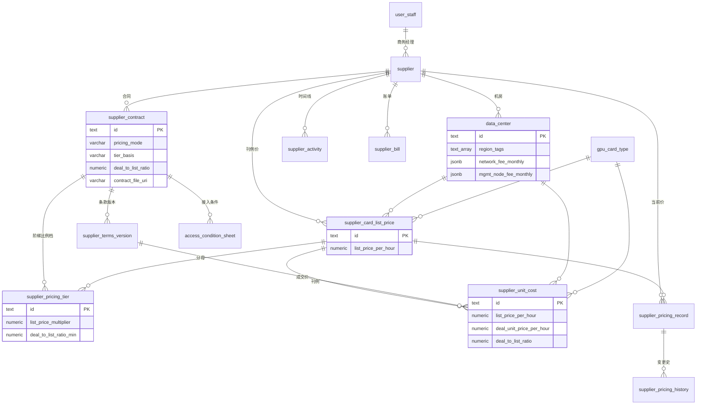
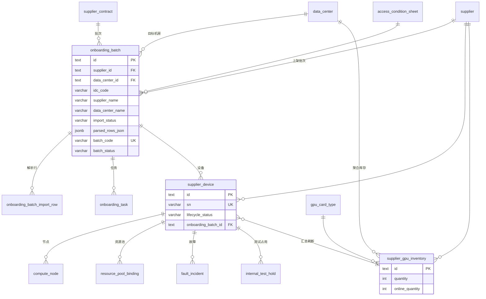
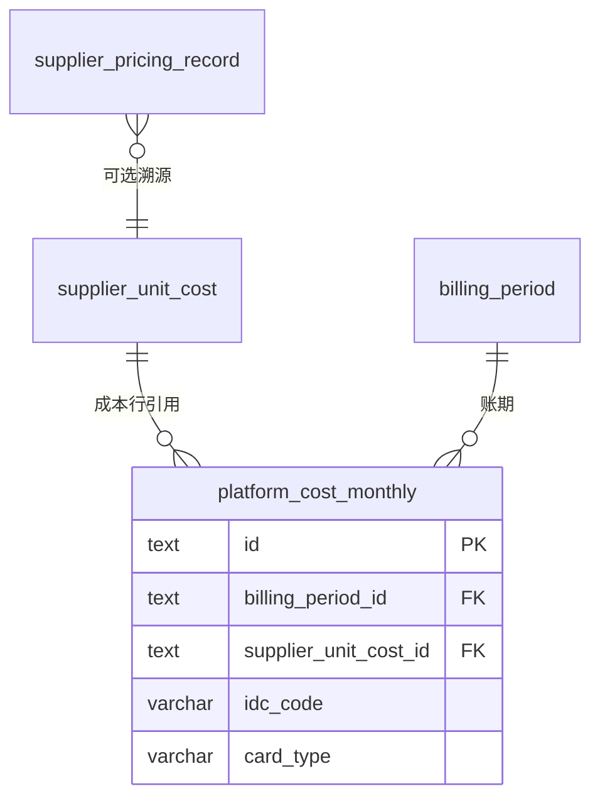

# 供应商与算力资源域数据库设计

**依据**：`apps/web/src/app/[locale]/(protected)/supplier` 路由及子组件、`components/dashboard/supplier-*` 业务面板、`lib/data/types.ts`（列表/详情 Mock）、`lib/types/supplier-domain.ts`（接入生命周期 Mock）、`lib/types/supplier-ops-batch.ts`（批量导入 Mock）、`lib/finance/cost-row-utils.ts`（财务成本单价解析）。

**文档性质**：供应商域逻辑表结构（PostgreSQL 风格类型）；物理实现可独立 schema（如 `supplier`），外键语义与唯一约束应保持一致。与 CRM 域通过 `user_staff`、财务域通过 `supplier_unit_cost` / `platform_cost_monthly` 衔接。

**版本**：v1.3（2026-05-21）

**核心目标**：

1. **资源监控大盘**：可沿「供应商 → 机房 → 卡型 → 物理机/节点」下钻，统计总量、在线量、接入中、维护中、内部测试占用，支撑全局算力资源视图。
2. **成本价格基准**：合同条款 → 机房×卡型单价/分成 → 财务月结 `platform_cost_monthly` 可 FK 追溯，支撑毛利核算。
3. **接入可追溯**：接入批次、施工任务、状态机审计、**供应商活动时间线** 形成完整链路。

---

## 0. 前端 Mock 数据源（当前已落地）

| 数据源 | 路径 | 使用页面/组件 | 说明 |
|--------|------|---------------|------|
| **经营列表 Mock** | `lib/data/mock-data.ts` + `lib/data/types.ts` | `/supplier/suppliers`、`contracts`、`devices`、`unit-costs`；`SuppliersContent`、`ContractsContent`、`DevicesContent`、`UnitCostsContent`；详情各 Panel | `Supplier`、`SupplierContract`、`DataCenter`、`DataCenterDevice`（**机房×卡型聚合**）、`GPUCardType`、`SupplierPricingRecord`、`SupplierPricingHistory`、`SupplierBill` |
| **接入域 Mock** | `lib/data/supplier-domain-mock.ts` + `lib/types/supplier-domain.ts` + `supplier-domain-mock-store` | 侧边栏规划路由 `online-tasks` / `order-access` / `fault-incidents` / `test-holds`（页面待建） | 物理机 `SupplierDevice`、`ComputeNode`、接入批次/任务、故障、测试占用、资源池绑定、状态审计 |
| **批量导入 Mock** | `lib/data/supplier-ops-batch-seed.ts` + `lib/types/supplier-ops-batch.ts` | 同上 ops 路由 | CSV 解析批次 `SupplierOpsUploadBatch` |
| **财务衔接** | `lib/types/finance.ts` + `cost-row-utils.ts` | `/finance/*` 成本表 | `platform_cost_monthly.supplier_unit_cost_id` → `supplier_unit_cost` |

**模型分层（落库时必须同时支持）**：

| 层级 | UI 表现 | 逻辑实体 | 用途 |
|------|---------|----------|------|
| **L1 聚合库存** | `DataCenterDevice`：机房 + 卡型 + 数量/在线量 | `supplier_gpu_inventory` | 列表页、大盘汇总、快速筛选 |
| **L2 物理设备** | 接入域单台 SN/资产号 | `supplier_device` + `compute_node` | 接入流水线、故障定位、资源池绑定 |
| **L3 平台投影** | 未来与调度/监控对齐 | `platform_resource_id`（可空 FK/外部 ID） | 与真实集群、池代码同步 |

聚合层 **可由 L2 定时刷新或触发器维护**，禁止仅手工维护聚合而与物理机台账长期不一致（见 §1.1 R-S4）。

---

## 1. 设计决策

| 决策 | 说明 |
|------|------|
| **供应商主数据** | `supplier` 为算力采购与合作主体；商务经理 FK `user_staff`，不在表内存姓名字符串。 |
| **机房从属供应商** | `data_center.supplier_id` NOT NULL；`code` 在供应商内 UK（对接 `idc_code`）；`region_tags` 供区域筛选与批次冗余。 |
| **机房配套费** | `network_fee_monthly`、`mgmt_node_fee_monthly` 为 **jsonb** 结构化配置（计费模式、档位、节点类型等）；列表/概览展示 `summary.estimated_monthly_total`，月结账单仍落 **numeric 汇总**（见 §3.7）。 |
| **合同 PDF** | `supplier_contract` 支持上传 PDF 至 OSS；元数据字段对齐 `onboarding_batch.import_file_*` 约定（`contract_file_uri` 存对象 URI，非公网直链）。 |
| **卡型主数据** | `gpu_card_type` 全局字典；设备/库存/单价均 FK 卡型。 |
| **合同与计价** | `supplier_contract` 存商务合同；计价细节拆为 `supplier_terms_version` + `supplier_card_list_price`（刊例价）+ `supplier_unit_cost`（成交价/财务基准）+ `supplier_pricing_tier`（**按成交/刊例比例**划档）；UI 当前价用 `supplier_pricing_record`（生效中快照）。 |
| **刊例价与阶梯** | **刊例价**为供应商×机房×卡型的基准挂牌单价；**成交卡时价**为实际采购结算价；**阶梯档**由 `deal_to_list_ratio`（成交/刊例）区间或各档 `list_price_multiplier` 表达，**不以累计用量（卡时）划档**（见 §3.2.1）。 |
| **两类设备表** | **物理机** `supplier_device`（SN 级）与 **聚合库存** `supplier_gpu_inventory`（机房×卡型）并存；大盘读聚合，接入详情读物理机。 |
| **接入编排** | 选定 **供应商 + 机房** → 上传 Excel → `onboarding_batch`（含解析行）→ `supplier_device` / `onboarding_task`；合同与 `access_condition_sheet` 仍关联；状态变更写 `entity_state_transition_log` 并 **投影** `supplier_activity`。 |
| **活动时间线** | `supplier_activity`：供应商 Hub 时间线（类比 CRM `project_activity`）；机器可读审计用 `entity_state_transition_log`，二者通过 `metadata.ref_log_id` 关联。 |
| **内部测试** | 聚合层 `is_internal_test` 与物理层 `internal_test_hold` 对齐；开启/关闭须写时间线 `internal_test_hold`。 |
| **财务单价** | 财务月结行 `platform_cost_monthly.supplier_unit_cost_id` FK → `supplier_unit_cost`；解析失败时回退 `supplier_pricing_record`（应用层，见 `cost-row-utils.ts`）。 |
| **聚合字段不入库** | `data_center_count`、`total_device_count`、`monthly_settlement` 等为读模型/缓存，由查询或物化视图提供。 |

### 1.1 领域模型与强制规则

#### 规则 1：供应商与人员

| 规则 | 说明 |
|------|------|
| **R-S1.1** | `supplier.business_manager_staff_id` → `user_staff.id`；列表/详情展示 `display_name` 为 JOIN 读模型。 |
| **R-S1.2** | `supplier.code` 全局 UK（供应商编码，如 `HB-GPU-01`）；`supplier.status` ∈ `negotiating` \| `cooperating` \| `suspended` \| `terminated`。 |
| **R-S1.3** | 供应商级默认合作模式 `default_cooperation_mode` 仅作新建合同默认值；**生效计价以合同/条款版本为准**。 |
| **R-S1.4** | `data_center.region_tags` 为非空标签数组（如 `华东`、`华南-广州`）；大盘/列表按标签筛选；写入 `onboarding_batch.idc_region` 时取 **首个标签** 或 `location`（应用层约定，须文档化）。 |
| **R-S1.5** | `network_fee_monthly`、`mgmt_node_fee_monthly` 须含 `schema_version`、`billing_mode`、`summary.estimated_monthly_total`；未配置时用 `{ "schema_version": 1, "billing_mode": "fixed", "fixed": { "amount": "0" }, "summary": { "estimated_monthly_total": "0" } }` 默认值。 |

#### 规则 2：合同与单价

| 规则 | 说明 |
|------|------|
| **R-S2.1** | `supplier_contract.supplier_id` NOT NULL；`contract_no` 全局 UK；合同扫描件 PDF 须 `contract_file_mime_type = application/pdf`，`contract_file_uri` 为 OSS 对象 URI（如 `oss://{bucket}/supplier/contracts/{contract_id}/{filename}` 或等价内部 URI）。 |
| **R-S2.2** | `pricing_mode` ∈ `card_time` \| `revenue_share` \| `tiered_card_time` \| `tiered_revenue_share`（与 `lib/data/types.ContractPricingMode` 一致）。 |
| **R-S2.3** | **刊例价**存 `supplier_card_list_price`（供应商×机房×卡型×生效期）；结算与成本基准的 **成交卡时价** 存 `supplier_unit_cost.deal_unit_price_per_hour`（或固定模式下的 `unit_cost`）。 |
| **R-S2.4** | **阶梯划档**以 **成交/刊例比例** 为准：`deal_to_list_ratio = deal_unit_price_per_hour / list_price_per_hour`（保留 6 位小数）；档位定义用 `supplier_pricing_tier.deal_to_list_ratio_min` / `deal_to_list_ratio_max` 或等价字段 `list_price_multiplier`（= 该档相对刊例的结算倍数）。**禁止**以累计卡时 `threshold_*_hours` 作为阶梯主键（与业务口径一致；前端 Mock 待迁移）。 |
| **R-S2.5** | 阶梯模式下，第 *i* 档结算单价推荐：`tier_unit_price = list_price_per_hour × list_price_multiplier`；若合同直接约定该档成交价，可冗余 `tier_deal_unit_price_per_hour`，但须满足 `tier_deal / list` 落在该档比例区间内。 |
| **R-S2.6** | 阶梯档位存 `supplier_pricing_tier`（合同级，须 FK 或逻辑关联 `supplier_card_list_price`）或 `supplier_unit_cost.tier_json`（机房×卡型级，结构见 §3.2.1）；**同一 `supplier_terms_version` 下** `(supplier_id, data_center_id, gpu_card_type_id)` 至多一条当前有效的 `supplier_unit_cost`。 |
| **R-S2.7** | `supplier_pricing_record` 表示「当前生效」价；须冗余 `list_price_per_hour` 与 `deal_to_list_ratio` 便于大盘/合同页展示；变更时 INSERT `supplier_pricing_history` 并 UPDATE record。 |
| **R-S2.8** | 财务成本行引用 `supplier_unit_cost.id`，不得仅引用合同 ID；月结解析成交价时优先 `deal_unit_price_per_hour`，阶梯合同按账期实际比例或合同约定默认档取值（应用层策略须文档化）。 |

#### 规则 3：设备与接入

| 规则 | 说明 |
|------|------|
| **R-S3.1** | `supplier_device.sn` 全局 UK；`asset_no` 建议 UK。 |
| **R-S3.2** | 物理机必须归属 `supplier_id`；`data_center_id` 可空（接入中尚未落机房时），但 `idc_code` 文本必填便于批次筛选。 |
| **R-S3.3** | `onboarding_batch` 必须 FK `supplier_contract` + `access_condition_sheet`（当前版本 `is_current = true` 的那份）。 |
| **R-S3.3a** | **上架归属**：`onboarding_batch.supplier_id`、`data_center_id` NOT NULL；须满足 `data_center.supplier_id = onboarding_batch.supplier_id`，且 `supplier_contract.supplier_id` 与批次供应商一致。 |
| **R-S3.3b** | **冗余快照**：写入批次时同步冗余 `supplier_code`、`supplier_name`、`idc_code`、`data_center_name`（及可选 `idc_region`），便于列表/导出不 JOIN；主数据变更 **不回写** 历史批次。 |
| **R-S3.3c** | **Excel 导入**：上架/订单接入类批次须上传清单文件（`.xlsx` / `.csv`）；解析结果落 `parsed_rows_json`（及可选明细表）；`import_status = parsed` 后才允许「确认入库」生成 `supplier_device`。 |
| **R-S3.4** | 聚合库存 `supplier_gpu_inventory` 的 `quantity` / `online_quantity` 须与同期 `supplier_device` 汇总一致（允许异步刷新，延迟 ≤ 业务约定 SLA）。 |
| **R-S3.5** | 设备生命周期状态变更必须写 `entity_state_transition_log`；若为用户可见事件，同步写 `supplier_activity`（`type` 见 §3.8）。 |

#### 规则 4：资源监控与可售

| 规则 | 说明 |
|------|------|
| **R-S4.1** | **可售卡时** = 在线物理 GPU 数 − 内部测试占用 − 故障不可用（策略在应用层，大盘须暴露 `sellable_quantity` 读模型）。 |
| **R-S4.2** | `resource_pool_binding` 连接平台资源池；`pool_code` / `resource_pool_id` 与调度系统对齐，供大盘「按池」视图。 |
| **R-S4.3** | `compute_node` 归属 `supplier_device`；节点状态与设备状态允许短暂不一致，以节点为准做调度，以设备为准做商务结算粒度。 |

#### 规则 5：活动与审计

| 规则 | 说明 |
|------|------|
| **R-S5.1** | `supplier_activity.supplier_id` NOT NULL；可选 `ref_domain` + `ref_id` 指向合同/设备/批次等。 |
| **R-S5.2** | 系统投影事件（状态机、账单确认）`author_role = system`，`author_staff_id` 可空。 |
| **R-S5.3** | `entity_state_transition_log` **不可 UPDATE**；更正通过补写新日志 + 活动说明。 |

---

## 2. 页面与表映射

侧边栏：`app-sidebar.tsx` → 供应商子菜单。

### 2.1 一级路由

| 路由 | 页面入口 | 主要组件 | 涉及表 |
|------|----------|----------|--------|
| `/supplier` | `supplier/page.tsx` | 重定向至 `/supplier/suppliers` | — |
| `/supplier/suppliers` | `supplier/suppliers/page.tsx` | `SuppliersContent` | `supplier`（+ 聚合读模型） |
| `/supplier/suppliers/[id]` | `supplier/suppliers/[id]/page.tsx` | `SupplierDetailContent` | `supplier`；Tab 见 §2.2 |
| `/supplier/contracts` | `supplier/contracts/page.tsx` | `ContractsContent` | `supplier_contract`、`supplier_pricing_tier` |
| `/supplier/devices` | `supplier/devices/page.tsx` | `DevicesContent` | `supplier_gpu_inventory`、`internal_test_hold`；详情可下钻 `supplier_device` |
| `/supplier/unit-costs` | `supplier/unit-costs/page.tsx` | `UnitCostsContent` | `gpu_card_type`、`supplier_pricing_record`、`supplier_pricing_history` |
| `/supplier/online-tasks` | （规划） | ops UI | `onboarding_batch`（含 Excel 解析 + 供应商/机房）、`onboarding_batch_import_row`、`onboarding_task` |
| `/supplier/order-access` | （规划） | ops UI | 同上（`batch_kind = order_access`） |
| `/supplier/fault-incidents` | （规划） | ops UI | `fault_incident`、`supplier_ops_upload_batch` |
| `/supplier/test-holds` | （规划） | — | `internal_test_hold` |

### 2.2 供应商详情 Tab（`SupplierDetailContent`）

| Tab | 组件 | 表名 | 说明 |
|-----|------|------|------|
| 概览 | 内联卡片 + 近期账单表 | `supplier`、`data_center`、`supplier_gpu_inventory`、`supplier_bill` | 统计为聚合查询 |
| 机房管理 | `SupplierDatacentersPanel` | `data_center` | 区域标签 `region_tags`；配套费 jsonb `network_fee_monthly`、`mgmt_node_fee_monthly` |
| 设备资源 | `SupplierDevicesPanel` | `supplier_gpu_inventory` | 按供应商过滤；卡时/分成成本来自定价读模型 |
| 合同管理 | `SupplierContractsPanel` | `supplier_contract` | |
| 卡型成本 | `SupplierUnitCostsPanel` | `supplier_pricing_record`、`supplier_pricing_history` | 嵌入 `UnitCostsContent`（`embedded` + `supplierId`） |
| 账单结算 | `SupplierBillsPanel` | `supplier_bill`、`supplier_bill_detail` | |
| **活动时间线**（待 UI） | 建议 `SupplierTimelinePanel` | `supplier_activity`、`supplier_activity_attachment` | 与 CRM `ProjectTimelinePanel` 对称 |

### 2.3 合同页（`ContractsContent`）

| UI 能力 | 落库 |
|---------|------|
| 列表筛选（供应商/状态/计价模式/类型） | 查询 `supplier_contract` |
| 详情：阶梯档、刊例价、成交/刊例比例、PDF 附件 | `supplier_card_list_price`、`supplier_pricing_tier`、`contract_file_*`、`signed_at` |
| 上传合同 PDF | 预签名 PUT → OSS → UPDATE `contract_file_uri` / `contract_file_name` / `contract_file_size_bytes` / `contract_file_uploaded_at`；可选写 `supplier_activity`（`file`） |
| 新建合同 | INSERT `supplier_contract` + 刊例价 + 阶梯档（比例/multipier）；写 `supplier_activity`（`contract_created`） |

### 2.4 设备页（`DevicesContent`）

| UI 字段 | 落库 |
|---------|------|
| 供应商/机房/卡型/数量/在线/状态 | `supplier_gpu_inventory` + JOIN |
| 内部测试开关、占用范围、计划结束 | `internal_test_hold`（物理机关联时 FK `supplier_device_id`；仅聚合维护时写 `supplier_gpu_inventory` 标志并记活动） |
| 修改运行状态 | UPDATE `supplier_gpu_inventory.status`；若存在物理机关联则批量更新 `supplier_device.lifecycle_status` + 审计日志 |

### 2.5 卡型成本页（`UnitCostsContent`）

| Tab | 表 |
|-----|-----|
| 单价配置 | `supplier_pricing_record`、`supplier_unit_cost`、`supplier_card_list_price`、`supplier_terms_version` |
| 变更历史 | `supplier_pricing_history`（含 `list_price`、`deal_price`、`deal_to_list_ratio` 变更） |
| 卡型字典 | `gpu_card_type` |

弹窗 `CreateCardPricingDialog`：创建/更新 `(supplier, data_center, card_type)` 定价 → 先确保刊例价 → 录入成交价或比例 → `supplier_pricing_record` + `supplier_pricing_history` + `supplier_activity`（`pricing_change`）。

---

## 3. 表结构

**通用约定**（与 CRM 域对齐）：

- 主键 `text`；金额/单价 `numeric(15,4)`；扩展 `jsonb`
- 时间戳 `created_at` / `updated_at`（timestamptz）
- 枚举类字段用 `varchar` + 应用层校验（便于迁移）

### 3.1 主数据

#### `supplier`（供应商）

对应 `lib/data/types.Supplier` + `lib/types/supplier-domain.Supplier`（code/short_name）。

| 列名 | 类型 | 约束 | 前端字段 |
|------|------|------|----------|
| `id` | text | PK | `id` |
| `code` | varchar(64) | UK, NOT NULL | `code` |
| `name` | varchar(255) | NOT NULL | `name` |
| `short_name` | varchar(64) | NOT NULL | `shortName` / `short_name` |
| `status` | varchar(32) | NOT NULL | `negotiating` / `cooperating` / `suspended` / `terminated` |
| `default_cooperation_mode` | varchar(32) | | `cooperationMode`（默认） |
| `default_revenue_share_percent` | numeric(7,4) | 可空 | `revenueShareRatio` |
| `business_manager_staff_id` | text | FK→`user_staff` | 表单选人 |
| `contact_person` | varchar(128) | | |
| `contact_phone` | varchar(32) | | |
| `contact_email` | varchar(255) | | |
| `address` | text | | |
| `bank_name` | varchar(255) | 可空 | |
| `bank_account` | varchar(64) | 可空 | |
| `created_at` | timestamptz | NOT NULL | `createdAt` |
| `updated_at` | timestamptz | NOT NULL | |

索引：`(status)`、`(business_manager_staff_id)`。

---

#### `gpu_card_type`（GPU 卡型字典）

对应 `lib/data/types.GPUCardType`。

| 列名 | 类型 | 约束 | 前端字段 |
|------|------|------|----------|
| `id` | text | PK | |
| `name` | varchar(128) | UK, NOT NULL | `name`（如 NVIDIA A100 80GB） |
| `manufacturer` | varchar(32) | NOT NULL | `NVIDIA` / `AMD` / `Intel` / `Huawei` / `Other` |
| `memory_gb` | integer | | |
| `tdp_watts` | integer | 可空 | |
| `compute_capability` | varchar(64) | 可空 | |
| `status` | varchar(32) | NOT NULL | `active` / `disabled` |
| `created_at` | timestamptz | NOT NULL | |
| `updated_at` | timestamptz | NOT NULL | |

---

#### `data_center`（机房 / IDC）

对应 `lib/data/types.DataCenter`。

| 列名 | 类型 | 约束 | 前端字段 |
|------|------|------|----------|
| `id` | text | PK | |
| `supplier_id` | text | FK→`supplier`, NOT NULL | |
| `code` | varchar(64) | NOT NULL | `code`（即 `idc_code`） |
| `name` | varchar(255) | NOT NULL | `name` |
| `location` | varchar(128) | | 城市/物理位置（展示用） |
| `region_tags` | text[] | NOT NULL DEFAULT '{}' | `regionTags`；区域标签，如 `{华东,上海}`，供筛选与批次冗余 |
| `address` | text | | |
| `status` | varchar(32) | NOT NULL | `online` / `offline` / `maintenance` |
| `network_fee_monthly` | jsonb | NOT NULL | `networkFee`；网络配套费配置（结构 §3.1.1） |
| `mgmt_node_fee_monthly` | jsonb | NOT NULL | `managementNodeFee`；管控节点配套费配置（结构 §3.1.1） |
| `created_at` | timestamptz | NOT NULL | |
| `updated_at` | timestamptz | NOT NULL | |

UK：`(supplier_id, code)`。索引：`(supplier_id)`、`(status)`、`GIN (region_tags)`。

**列表/概览读模型**：`networkFee` / `managementNodeFee` 展示值取各自 jsonb 的 `summary.estimated_monthly_total`（numeric 解析）；复杂明细在机房编辑表单中按 `billing_mode` 渲染。

---

#### 3.1.1 机房配套费 JSON 结构（`network_fee_monthly` / `mgmt_node_fee_monthly`）

两类配套费均为 **结构化 jsonb**，支持多种计费模式；金额字段统一用 **字符串 numeric**（与 `tier_json` 一致，避免浮点误差）。

**公共字段**（两类 jsonb 均须包含）：

| 字段 | 类型 | 说明 |
|------|------|------|
| `schema_version` | integer | 当前为 `1`；结构升级时递增 |
| `currency` | string | 默认 `CNY` |
| `billing_cycle` | string | 固定 `monthly` |
| `billing_mode` | string | 见下表 |
| `summary` | object | `{ "estimated_monthly_total": "15000.0000", "display_label": "固定 1.5 万/月" }` |
| `remark` | string | 可空；商务备注 |

**`network_fee_monthly.billing_mode`**：

| 模式 | 含义 | 主要 payload |
|------|------|----------------|
| `fixed` | 固定月费 | `fixed.amount`；可选 `fixed.includes_bandwidth_gbps` |
| `bandwidth_tier` | 按带宽档位 | `bandwidth_tiers[]`：`tier_order`、`min_gbps`、`max_gbps`（NULL=无上限）、`monthly_fee` |
| `per_machine` | 按机器数 | `per_machine.fee_per_machine`、`included_machine_count`、可选 `cap_monthly` |
| `hybrid` | 基础费 + 超额 | `hybrid.base_fee`、`extra_per_gbps` 或 `extra_per_machine` |

**`network_fee_monthly` 示例**（带宽档位 + 固定保底）：

```json
{
  "schema_version": 1,
  "currency": "CNY",
  "billing_cycle": "monthly",
  "billing_mode": "bandwidth_tier",
  "summary": {
    "estimated_monthly_total": "15000.0000",
    "display_label": "10G 基础包 + 超额按档"
  },
  "bandwidth_tiers": [
    {
      "tier_order": 1,
      "min_gbps": 0,
      "max_gbps": 10,
      "monthly_fee": "12000.0000",
      "remark": "基础带宽包"
    },
    {
      "tier_order": 2,
      "min_gbps": 10,
      "max_gbps": null,
      "monthly_fee": "800.0000",
      "remark": "每超出 1G 单价（按月折算）"
    }
  ],
  "remark": "内网互联含在基础包；公网 egress 另计"
}
```

**`mgmt_node_fee_monthly.billing_mode`**：

| 模式 | 含义 | 主要 payload |
|------|------|----------------|
| `fixed` | 固定月费 | `fixed.amount` |
| `per_node` | 按节点类型×数量 | `per_node.node_types[]`：`node_type`、`label`、`count`、`unit_fee_monthly`；可选 `included_node_count` |
| `tiered` | 按节点总数分档 | `tiered.tiers[]`：`tier_order`、`min_nodes`、`max_nodes`、`unit_fee_monthly` 或 `flat_fee_monthly` |

**`mgmt_node_fee_monthly` 示例**（多类型管控节点）：

```json
{
  "schema_version": 1,
  "currency": "CNY",
  "billing_cycle": "monthly",
  "billing_mode": "per_node",
  "summary": {
    "estimated_monthly_total": "8000.0000",
    "display_label": "3×Master + 2×Monitor"
  },
  "per_node": {
    "included_node_count": 0,
    "node_types": [
      {
        "node_type": "k8s_master",
        "label": "K8s Master",
        "count": 3,
        "unit_fee_monthly": "2000.0000"
      },
      {
        "node_type": "monitor",
        "label": "监控采集",
        "count": 2,
        "unit_fee_monthly": "1000.0000"
      }
    ]
  },
  "remark": "含 Prometheus / 日志采集节点"
}
```

**月结与 Mock 兼容**：`supplier_bill.network_fee` / `management_fee` 仍为 **numeric 汇总**（按账期实际用量或 `summary.estimated_monthly_total` 计算后写入）；前端 Mock 当前 `networkFee: number` 对应读模型 `estimated_monthly_total`，落库后 API 层做 jsonb → number 投影。

---

### 3.2 商务合同与条款

#### 3.2.1 刊例价、成交价与阶梯计价模型

**业务口径**（与采购商务约定一致）：

| 概念 | 符号/字段 | 说明 |
|------|-----------|------|
| **刊例价** | `list_price_per_hour` | 供应商针对某机房×卡型的挂牌基准单价（元/卡时），未折扣前的参考价 |
| **成交卡时价** | `deal_unit_price_per_hour` | 合同/条款版本下实际结算采用的卡时单价（元/卡时） |
| **成交/刊例比例** | `deal_to_list_ratio` | `deal_unit_price_per_hour / list_price_per_hour`，如 `0.95` 表示相当于刊例 95 折 |

**固定价模式**（`card_time` / `revenue_share`）：仅需一条刊例价（可选，用于展示折扣深度）+ 一条成交价（或分成比例）。

**阶梯价模式**（`tiered_card_time` / `tiered_revenue_share`）：各档由 **相对刊例的比例** 确定，而非按累计用量划档：

```
tier_deal_price_i = list_price_per_hour × list_price_multiplier_i
deal_to_list_ratio_i = list_price_multiplier_i   （当分母为刊例时）
```

**划档方式（二选一，合同级配置 `tier_basis`）**：

| `tier_basis` | 含义 | 档位字段 |
|--------------|------|----------|
| `multiplier`（默认） | 每档直接约定相对刊例的结算倍数 | `list_price_multiplier`（如 0.98、0.95、0.90） |
| `ratio_band` | 按洽谈达成的成交/刊例比例落入区间选档 | `deal_to_list_ratio_min` / `deal_to_list_ratio_max` |

**`tier_json` 结构**（`supplier_unit_cost` 机房×卡型级阶梯快照）：

```json
{
  "tier_basis": "multiplier",
  "list_price_per_hour": "50.0000",
  "tiers": [
    {
      "tier_order": 1,
      "list_price_multiplier": "0.980000",
      "deal_unit_price_per_hour": "49.0000",
      "revenue_share_percent": null
    },
    {
      "tier_order": 2,
      "list_price_multiplier": "0.950000",
      "deal_unit_price_per_hour": "47.5000"
    }
  ]
}
```

**与前端 Mock 的差异**：`lib/data/types.ContractPricingTier` 当前使用 `thresholdFromHours` / `thresholdToHours`（按累计卡时划档），**与真实商务口径不符**；落库与 API 以本设计为准，UI 类型待迁移为比例字段。

---

#### `supplier_card_list_price`（刊例价）

供应商×机房×卡型的挂牌基准价；阶梯与折扣展示的 **分母**。

| 列名 | 类型 | 约束 | 说明 |
|------|------|------|------|
| `id` | text | PK | |
| `supplier_id` | text | FK→`supplier`, NOT NULL | |
| `data_center_id` | text | FK→`data_center`, NOT NULL | |
| `gpu_card_type_id` | text | FK→`gpu_card_type`, NOT NULL | |
| `list_price_per_hour` | numeric(15,4) | NOT NULL | 刊例价（元/卡时） |
| `currency` | varchar(8) | NOT NULL DEFAULT 'CNY' | |
| `effective_from` | date | NOT NULL | |
| `effective_to` | date | 可空 | NULL=当前有效 |
| `source` | varchar(64) | 可空 | 来源：合同附件/供应商报价单/人工维护 |
| `remark` | text | 可空 | |
| `created_at` | timestamptz | NOT NULL | |
| `updated_at` | timestamptz | NOT NULL | |

UK（部分唯一）：`(supplier_id, data_center_id, gpu_card_type_id)` WHERE `effective_to IS NULL`。

索引：`(supplier_id)`、`(data_center_id, gpu_card_type_id)`。

---

#### `supplier_contract`（供应商商务合同）

对应 `lib/data/types.SupplierContract`。

| 列名 | 类型 | 约束 | 前端字段 |
|------|------|------|----------|
| `id` | text | PK | |
| `supplier_id` | text | FK→`supplier`, NOT NULL | |
| `contract_no` | varchar(64) | UK, NOT NULL | `contractNo` |
| `type` | varchar(32) | NOT NULL | `cooperation` / `supplement` / `renewal` |
| `status` | varchar(32) | NOT NULL | `draft` / `pending` / `active` / `expired` / `terminated` |
| `pricing_mode` | varchar(32) | NOT NULL | `pricingMode` |
| `tier_basis` | varchar(32) | 可空 | 阶梯模式：`multiplier` \| `ratio_band`；非阶梯可空 |
| `cooperation_mode` | varchar(32) | NOT NULL | 兼容字段：`card_time` \| `revenue_share` |
| `unit_price_per_hour` | numeric(15,4) | 可空 | 固定卡时成交价（= deal） |
| `revenue_share_percent` | numeric(7,4) | 可空 | 固定分成 % |
| `list_price_per_hour` | numeric(15,4) | 可空 | 合同级默认刊例（无机房拆分时）；有机房刊例时以 `supplier_card_list_price` 为准 |
| `deal_to_list_ratio` | numeric(9,6) | 可空 | 固定模式成交/刊例比例（冗余，便于筛选） |
| `min_commit_hours` | numeric(15,4) | 可空 | |
| `settlement_cycle` | varchar(32) | 可空 | `monthly` / `quarterly` |
| `start_date` | date | NOT NULL | |
| `end_date` | date | NOT NULL | |
| `terms` | text | | |
| `signed_at` | timestamptz | 可空 | |
| `signer_name` | varchar(128) | 可空 | |
| **合同 PDF（OSS）** | | | |
| `contract_file_name` | varchar(255) | 可空 | 原始文件名，如 `HB-GPU-框架合同-2026.pdf` |
| `contract_file_uri` | varchar(1024) | 可空 | OSS 对象 URI（**非**浏览器直链）；如 `oss://{bucket}/supplier/contracts/{contract_id}/{uuid}.pdf` |
| `contract_file_mime_type` | varchar(128) | 可空 | 须为 `application/pdf` |
| `contract_file_size_bytes` | bigint | 可空 | |
| `contract_file_sha256` | varchar(64) | 可空 | 完整性校验（可选） |
| `contract_file_uploaded_at` | timestamptz | 可空 | |
| `contract_file_uploaded_by_staff_id` | text | FK→`user_staff`, 可空 | 上传人 |
| `created_at` | timestamptz | NOT NULL | |
| `updated_at` | timestamptz | NOT NULL | |

**PDF 上传流程**（与 `onboarding_batch` Excel 上传对齐）：

1. 客户端请求 **预签名上传 URL**（或 STS 临时凭证），`Content-Type: application/pdf`
2. 直传 OSS → 服务端校验 `mime_type`、大小上限（建议 ≤ 50MB）
3. UPDATE 上述 `contract_file_*` 字段；下载时由服务端 **签名 GET** 或内网代理，**禁止**将 bucket 公网 ACL 设为 public-read
4. 可选 INSERT `supplier_activity`（`type = file`，`ref_domain = contract`）

索引：`(supplier_id)`、`(status)`、`(pricing_mode)`。

---

#### `supplier_pricing_tier`（合同阶梯档 — 按成交/刊例比例）

对应合同详情阶梯表；**档位由刊例价比例确定**，不采用累计卡时阈值。

| 列名 | 类型 | 约束 | 说明 |
|------|------|------|------|
| `id` | text | PK | |
| `contract_id` | text | FK→`supplier_contract`, NOT NULL | |
| `supplier_card_list_price_id` | text | FK→`supplier_card_list_price`, 可空 | 绑定具体机房×卡型刊例；空表示合同级统一阶梯 |
| `tier_order` | integer | NOT NULL | 档位序号，从小到大 |
| `list_price_multiplier` | numeric(9,6) | 可空 | `tier_basis=multiplier` 时必填；相对刊例倍数，如 0.95 |
| `deal_to_list_ratio_min` | numeric(9,6) | 可空 | `tier_basis=ratio_band` 时区间下限（含） |
| `deal_to_list_ratio_max` | numeric(9,6) | 可空 | 区间上限（不含）；NULL=无上限 |
| `deal_unit_price_per_hour` | numeric(15,4) | 可空 | 该档成交卡时价；可与 `list × multiplier` 二选一录入 |
| `revenue_share_percent` | numeric(7,4) | 可空 | `tiered_revenue_share` 时该档分成 % |
| `remark` | varchar(255) | 可空 | 如「浅折扣档」「深度折扣档」 |

UK：`(contract_id, tier_order, supplier_card_list_price_id)` — `supplier_card_list_price_id` 空值在 PG 中视为 distinct，合同仅一套阶梯时可统一 NULL。

CHECK（应用层或 DB）：

- `tier_basis = multiplier` → `list_price_multiplier` NOT NULL
- `tier_basis = ratio_band` → `deal_to_list_ratio_min` NOT NULL
- 若同时填 `deal_unit_price_per_hour` 与刊例，须 `deal / list` 落在该档比例区间内

**展示读模型**（合同详情 UI）：

| 展示列 | 计算 |
|--------|------|
| 刊例价 | JOIN `supplier_card_list_price.list_price_per_hour` |
| 成交/刊例 | `deal_unit_price_per_hour / list_price_per_hour` 或 `list_price_multiplier` |
| 档位说明 | multiplier：`刊例 × 95%`；ratio_band：`成交/刊例 ∈ [0.90, 0.95)` |

---

#### `supplier_terms_version`（合作条款版本）

对应 `lib/types/supplier-domain.SupplierTermsVersion`；承载结构化条款 JSON。

| 列名 | 类型 | 约束 | 说明 |
|------|------|------|------|
| `id` | text | PK | |
| `supplier_id` | text | FK→`supplier`, 可空 | 供应商级通用条款 |
| `contract_id` | text | FK→`supplier_contract`, 可空 | 合同级条款 |
| `deal_mode` | varchar(64) | NOT NULL | 如「卡时计价」「阶梯分成」 |
| `terms_json` | jsonb | NOT NULL | 币种、最低承诺、`tier_basis`、阶梯比例数组等 |
| `effective_from` | timestamptz | NOT NULL | |
| `effective_to` | timestamptz | 可空 | NULL=当前有效 |
| `created_at` | timestamptz | NOT NULL | |

CHECK：`supplier_id` 与 `contract_id` 至少其一非空。

---

#### `supplier_unit_cost`（机房×卡型采购单价 — 财务基准）

对应 `lib/types/supplier-domain.SupplierUnitCost`；**`platform_cost_monthly.supplier_unit_cost_id` 指向此表**。

| 列名 | 类型 | 约束 | 说明 |
|------|------|------|------|
| `id` | text | PK | 如 `suc-v1` |
| `supplier_terms_version_id` | text | FK→`supplier_terms_version`, NOT NULL | |
| `supplier_id` | text | FK→`supplier`, NOT NULL | 冗余加速 |
| `data_center_id` | text | FK→`data_center`, NOT NULL | |
| `gpu_card_type_id` | text | FK→`gpu_card_type`, NOT NULL | |
| `supplier_card_list_price_id` | text | FK→`supplier_card_list_price`, NOT NULL | 刊例价来源 |
| `list_price_per_hour` | numeric(15,4) | NOT NULL | 冗余刊例，与 FK 指向一致 |
| `deal_unit_price_per_hour` | numeric(15,4) | 可空 | **成交卡时价**（财务结算主值） |
| `deal_to_list_ratio` | numeric(9,6) | 可空 | 成交/刊例；可生成列或写入时计算 |
| `unit_cost` | numeric(15,4) | 可空 | **兼容字段** = `deal_unit_price_per_hour`（卡时模式） |
| `revenue_share_percent` | numeric(7,4) | 可空 | 分成 % |
| `tier_json` | jsonb | 可空 | 机房×卡型级阶梯（结构 §3.2.1） |
| `effective_from` | date | NOT NULL | |
| `effective_to` | date | 可空 | |
| `created_at` | timestamptz | NOT NULL | |
| `updated_at` | timestamptz | NOT NULL | |

UK（部分唯一）：`(supplier_terms_version_id, data_center_id, gpu_card_type_id)` WHERE `effective_to IS NULL`。

---

#### `supplier_pricing_record`（当前生效定价 — UI 读模型）

对应 `lib/data/types.SupplierPricingRecord`。

| 列名 | 类型 | 约束 | 前端字段 |
|------|------|------|----------|
| `id` | text | PK | |
| `supplier_id` | text | FK→`supplier`, NOT NULL | |
| `data_center_id` | text | FK→`data_center`, NOT NULL | |
| `gpu_card_type_id` | text | FK→`gpu_card_type`, NOT NULL | |
| `supplier_unit_cost_id` | text | FK→`supplier_unit_cost`, 可空 | 溯源财务基准 |
| `supplier_card_list_price_id` | text | FK→`supplier_card_list_price`, 可空 | 刊例溯源 |
| `pricing_mode` | varchar(32) | NOT NULL | |
| `list_price_per_hour` | numeric(15,4) | 可空 | 刊例价（展示） |
| `unit_price_per_hour` | numeric(15,4) | 可空 | 成交卡时价（= deal） |
| `deal_to_list_ratio` | numeric(9,6) | 可空 | 成交/刊例 |
| `revenue_share_percent` | numeric(7,4) | 可空 | |
| `pricing_tiers` | jsonb | 可空 | 阶梯快照（§3.2.1 `tier_json` 结构） |
| `effective_from` | date | NOT NULL | |
| `updated_by_staff_id` | text | FK→`user_staff`, 可空 | |
| `updated_at` | timestamptz | NOT NULL | |

UK：`(supplier_id, data_center_id, gpu_card_type_id)` — 每个组合仅一条当前价。

---

#### `supplier_pricing_history`（单价变更历史）

对应 `lib/data/types.SupplierPricingHistory`。

| 列名 | 类型 | 约束 | 前端字段 |
|------|------|------|----------|
| `id` | text | PK | |
| `pricing_record_id` | text | FK→`supplier_pricing_record`, NOT NULL | |
| `supplier_id` | text | FK→`supplier`, NOT NULL | 冗余 |
| `data_center_id` | text | FK→`data_center`, NOT NULL | |
| `gpu_card_type_id` | text | FK→`gpu_card_type`, NOT NULL | |
| `pricing_mode` | varchar(32) | NOT NULL | |
| `previous_list_price_per_hour` | numeric(15,4) | 可空 | |
| `new_list_price_per_hour` | numeric(15,4) | 可空 | |
| `previous_unit_price_per_hour` | numeric(15,4) | 可空 | 成交卡时价（旧） |
| `new_unit_price_per_hour` | numeric(15,4) | 可空 | 成交卡时价（新） |
| `previous_deal_to_list_ratio` | numeric(9,6) | 可空 | |
| `new_deal_to_list_ratio` | numeric(9,6) | 可空 | |
| `previous_revenue_share_percent` | numeric(7,4) | 可空 | |
| `new_revenue_share_percent` | numeric(7,4) | 可空 | |
| `changed_at` | timestamptz | NOT NULL | |
| `changed_by_staff_id` | text | FK→`user_staff`, NOT NULL | |
| `reason` | text | 可空 | |

索引：`(pricing_record_id, changed_at DESC)`。

---

### 3.3 接入条件与批次

#### `access_condition_sheet`（接入条件单）

对应 `lib/types/supplier-domain.AccessConditionSheet`。

| 列名 | 类型 | 约束 | 说明 |
|------|------|------|------|
| `id` | text | PK | |
| `contract_id` | text | FK→`supplier_contract`, NOT NULL | |
| `version_no` | integer | NOT NULL | |
| `is_current` | boolean | NOT NULL DEFAULT false | 每合同至多一条 true |
| `gpu_network_cpu_terms` | jsonb | NOT NULL | GPU/网络/CPU 规格 |
| `created_at` | timestamptz | NOT NULL | |

UK：`(contract_id, version_no)`；部分唯一索引：`(contract_id) WHERE is_current = true`。

---

#### `onboarding_batch`（接入批次）

对应 `lib/types/supplier-domain.OnboardingBatch`，并合并 `lib/types/supplier-ops-batch` 中 **上架/订单接入** 的 Excel 上传与解析字段（`online-tasks`、`order-access` 页面）。

**业务含义**：一次「在 **某供应商 · 某机房** 上架一批机器」的工单；创建批次时 **必选供应商与机房**，上传 Excel/CSV 解析设备清单，确认后生成 `supplier_device`。

| 列名 | 类型 | 约束 | 说明 |
|------|------|------|------|
| `id` | text | PK | |
| `batch_kind` | varchar(32) | NOT NULL | `online`（设备上架）\| `order_access`（订单接入） |
| **归属（FK + 冗余快照）** | | | |
| `supplier_id` | text | FK→`supplier`, NOT NULL | 本批次上架供应商 |
| `supplier_code` | varchar(64) | NOT NULL | 冗余：`supplier.code` |
| `supplier_name` | varchar(255) | NOT NULL | 冗余：供应商全称 |
| `supplier_short_name` | varchar(64) | 可空 | 冗余：简称 |
| `data_center_id` | text | FK→`data_center`, NOT NULL | 本批次上架机房 |
| `idc_code` | varchar(64) | NOT NULL | 冗余：`data_center.code` |
| `data_center_name` | varchar(255) | NOT NULL | 冗余：机房名称 |
| `idc_region` | varchar(64) | 可空 | 冗余：区域标签；默认取 `data_center.region_tags[1]` 或 `location` |
| **合同与接入条件** | | | |
| `contract_id` | text | FK→`supplier_contract`, NOT NULL | |
| `access_condition_sheet_id` | text | FK→`access_condition_sheet`, NOT NULL | |
| `batch_code` | varchar(64) | UK, NOT NULL | 如 `ONB-2026-Q1-HB` |
| `batch_status` | varchar(32) | NOT NULL | 待开始/接入中/已完成/已取消 |
| `planned_ready_at` | timestamptz | 可空 | 计划就绪时间 |
| **Excel / CSV 导入** | | | |
| `access_method` | varchar(32) | NOT NULL | 接入方式：`ssh_jump` / `ipmi` / `out_of_band` / `on_site`（见 `supplier-ops/ui-meta.ts`） |
| `import_file_name` | varchar(255) | NOT NULL | 原始文件名 |
| `import_file_uri` | varchar(1024) | NOT NULL | 对象存储 URI（上传后的 Excel/CSV） |
| `import_file_mime_type` | varchar(128) | 可空 | 如 `application/vnd.openxmlformats-officedocument.spreadsheetml.sheet`、`text/csv` |
| `import_file_size_bytes` | bigint | 可空 | |
| `import_status` | varchar(32) | NOT NULL | 见下表 |
| `parse_error` | text | 可空 | 解析失败原因 |
| `parsed_row_count` | integer | NOT NULL DEFAULT 0 | 解析行数（含表头后数据行） |
| `parsed_success_count` | integer | NOT NULL DEFAULT 0 | 校验通过行数 |
| `parsed_rows_json` | jsonb | 可空 | 解析结果数组（结构 §3.3.2）；大文件可仅用明细表 |
| `parsed_at` | timestamptz | 可空 | 解析完成时间 |
| `committed_device_count` | integer | NOT NULL DEFAULT 0 | 已入库 `supplier_device` 台数 |
| `committed_at` | timestamptz | 可空 | 确认入库时间 |
| **审计** | | | |
| `created_by_staff_id` | text | FK→`user_staff`, 可空 | 创建人 |
| `created_at` | timestamptz | NOT NULL | |
| `updated_at` | timestamptz | NOT NULL | |

**`import_status` 状态机**

| 状态 | 含义 |
|------|------|
| `draft` | 已选供应商/机房，未上传文件 |
| `uploaded` | 文件已上传，待解析 |
| `parsing` | 解析中 |
| `parsed` | 解析成功，待人工确认入库 |
| `parse_failed` | 解析失败（见 `parse_error`） |
| `committing` | 正在写入 `supplier_device` |
| `committed` | 已入库，可进入接入施工 |
| `cancelled` | 已作废 |

索引：`(supplier_id)`、`(data_center_id)`、`(idc_code)`、`(contract_id)`、`(batch_status)`、`(import_status)`、`(supplier_id, data_center_id, created_at DESC)`。

CHECK（应用层或 DB）：`data_center_id` 所属 `supplier_id` 与批次 `supplier_id` 一致。

---

#### 3.3.2 Excel 解析行结构（`parsed_rows_json` / 明细表）

与 `lib/supplier-ops/parse-inventory-csv.ts` 对齐；Excel 首行为表头，支持中英文列名。`.xlsx` 在服务端转为行列后走同一套校验逻辑。

**`parsed_rows_json` 单元素示例**：

```json
{
  "row_no": 2,
  "public_ip": "203.0.113.10",
  "private_ip": "10.20.30.40",
  "root_account": "root",
  "root_password": "***",
  "sn": "8F2A91C2",
  "asset_no": "AST-HB-00091",
  "gpu_count": 8,
  "card_type_code": "A100-80G",
  "parse_status": "ok",
  "parse_message": null
}
```

| 字段 | 必填 | 说明 |
|------|------|------|
| `row_no` | 是 | 源文件行号（便于报错定位） |
| `public_ip` / `private_ip` | 是 | 公网/内网 IP |
| `root_account` / `root_password` | 是 | 带外/跳板登录信息（入库 `supplier_device` 或加密凭据表时脱敏） |
| `sn` / `asset_no` | 否 | 有则用于建 `supplier_device` UK |
| `gpu_count` / `card_type_code` | 否 | 无则继承批次默认值或合同默认卡型 |

**可选明细表** `onboarding_batch_import_row`（行数 > 500 时推荐，避免超大 jsonb）：

| 列名 | 类型 | 约束 | 说明 |
|------|------|------|------|
| `id` | text | PK | |
| `onboarding_batch_id` | text | FK→`onboarding_batch`, NOT NULL | |
| `row_no` | integer | NOT NULL | |
| `public_ip` | varchar(45) | NOT NULL | |
| `private_ip` | varchar(45) | NOT NULL | |
| `root_account` | varchar(128) | NOT NULL | |
| `root_password_enc` | text | NOT NULL | 加密存储 |
| `sn` | varchar(64) | 可空 | |
| `asset_no` | varchar(64) | 可空 | |
| `gpu_count` | integer | 可空 | |
| `gpu_card_type_id` | text | FK, 可空 | |
| `parse_status` | varchar(32) | NOT NULL | `ok` / `warning` / `error` |
| `parse_message` | text | 可空 | |
| `supplier_device_id` | text | FK, 可空 | 入库后回填 |

UK：`(onboarding_batch_id, row_no)`。索引：`(onboarding_batch_id)`、`(parse_status)`。

**UI 流程（`online-tasks` / `order-access`）**：选择 **供应商 + 机房** → 选合同/接入方式 → 上传 Excel → 解析预览 → 确认入库 → 生成 `supplier_device`（`onboarding_batch_id`、`supplier_id`、`data_center_id`、`idc_code` 与批次一致）。

---

#### `onboarding_task`（接入施工任务）

对应 `lib/types/supplier-domain.OnboardingTask`。

| 列名 | 类型 | 约束 | 说明 |
|------|------|------|------|
| `id` | text | PK | |
| `onboarding_batch_id` | text | FK→`onboarding_batch`, NOT NULL | |
| `supplier_device_id` | text | FK→`supplier_device`, 可空 | 批次级任务可空 |
| `task_type` | varchar(64) | NOT NULL | 上架验收/批次联调/… |
| `assignee_staff_id` | text | FK→`user_staff`, NOT NULL | |
| `task_status` | varchar(32) | NOT NULL | 待开始/进行中/已完成 |
| `started_at` | timestamptz | 可空 | |
| `finished_at` | timestamptz | 可空 | |
| `created_at` | timestamptz | NOT NULL | |

---

### 3.4 物理设备与节点

#### `supplier_device`（物理算力设备）

对应 `lib/types/supplier-domain.SupplierDevice`；**接入追踪的核心实体**。

| 列名 | 类型 | 约束 | 说明 |
|------|------|------|------|
| `id` | text | PK | |
| `supplier_id` | text | FK→`supplier`, NOT NULL | |
| `contract_id` | text | FK→`supplier_contract`, 可空 | |
| `onboarding_batch_id` | text | FK→`onboarding_batch`, 可空 | |
| `data_center_id` | text | FK→`data_center`, 可空 | 落机房前可空 |
| `gpu_card_type_id` | text | FK→`gpu_card_type`, NOT NULL | |
| `asset_no` | varchar(64) | UK | |
| `sn` | varchar(64) | UK, NOT NULL | |
| `idc_code` | varchar(64) | NOT NULL | 冗余，对接导入 CSV |
| `idc_region` | varchar(64) | 可空 | |
| `gpu_count` | integer | NOT NULL | 单机 GPU 数 |
| `external_ip` | varchar(45) | 可空 | |
| `internal_ip` | varchar(45) | 可空 | |
| `lifecycle_status` | varchar(32) | NOT NULL | 待接入/接入中/在线/离线/维护/退役 |
| `onboarding_substage` | varchar(64) | 可空 | 上架布线/联调/… |
| `platform_resource_id` | varchar(128) | 可空 | 与监控/调度系统对齐 |
| `created_at` | timestamptz | NOT NULL | |
| `updated_at` | timestamptz | NOT NULL | |

索引：`(supplier_id)`、`(onboarding_batch_id)`、`(data_center_id)`、`(lifecycle_status)`、`(idc_code)`。

---

#### `compute_node`（计算节点）

对应 `lib/types/supplier-domain.ComputeNode`。

| 列名 | 类型 | 约束 | 说明 |
|------|------|------|------|
| `id` | text | PK | |
| `supplier_device_id` | text | FK→`supplier_device`, NOT NULL | |
| `node_role` | varchar(32) | NOT NULL | Worker / ControlPlane / … |
| `mgmt_ip` | varchar(45) | 可空 | |
| `cluster_id` | varchar(64) | 可空 | |
| `lifecycle_status` | varchar(32) | NOT NULL | |
| `created_at` | timestamptz | NOT NULL | |
| `updated_at` | timestamptz | NOT NULL | |

索引：`(supplier_device_id)`、`(cluster_id)`。

---

#### `supplier_gpu_inventory`（机房×卡型聚合库存 — 大盘与列表）

对应 `lib/data/types.DataCenterDevice`（**非单机**）。

| 列名 | 类型 | 约束 | 前端字段 |
|------|------|------|----------|
| `id` | text | PK | |
| `supplier_id` | text | FK→`supplier`, NOT NULL | |
| `data_center_id` | text | FK→`data_center`, NOT NULL | |
| `gpu_card_type_id` | text | FK→`gpu_card_type`, NOT NULL | |
| `quantity` | integer | NOT NULL DEFAULT 0 | `quantity` |
| `online_quantity` | integer | NOT NULL DEFAULT 0 | `onlineQuantity` |
| `status` | varchar(32) | NOT NULL | `online` / `offline` / `maintenance` |
| `is_internal_test` | boolean | NOT NULL DEFAULT false | |
| `internal_test_scope` | varchar(255) | 可空 | |
| `internal_test_until` | timestamptz | 可空 | |
| `card_time_cost_per_hour` | numeric(15,4) | 可空 | 展示用，真值以 `supplier_pricing_record` 为准 |
| `revenue_share_cost_per_hour` | numeric(15,4) | 可空 | 分成场景参考成本 |
| `last_synced_at` | timestamptz | 可空 | 与物理机汇总同步时间 |
| `updated_at` | timestamptz | NOT NULL | |

UK：`(supplier_id, data_center_id, gpu_card_type_id)`。

**同步规则**：自 `supplier_device` 按 `(data_center_id, gpu_card_type_id, lifecycle_status)` 汇总刷新 `quantity` / `online_quantity`；`status` 取组内最差状态或维护中优先策略（应用层定义）。

---

### 3.5 运维：故障、测试、资源池

#### `fault_incident`（故障事件）

对应 `lib/types/supplier-domain.FaultIncident`。

| 列名 | 类型 | 约束 | 说明 |
|------|------|------|------|
| `id` | text | PK | |
| `supplier_device_id` | text | FK, 可空 | |
| `compute_node_id` | text | FK, 可空 | |
| `severity` | varchar(8) | NOT NULL | P1–P4 |
| `incident_status` | varchar(32) | NOT NULL | 处理中/已关闭 |
| `resolution_outcome` | text | 可空 | |
| `opened_at` | timestamptz | NOT NULL | |
| `closed_at` | timestamptz | 可空 | |

CHECK：设备与节点至少其一非空。

---

#### `internal_test_hold`（内部测试占用）

对应 `lib/types/supplier-domain.InternalTestHold` + 设备页内部测试 UI。

| 列名 | 类型 | 约束 | 说明 |
|------|------|------|------|
| `id` | text | PK | |
| `supplier_device_id` | text | FK, 可空 | |
| `supplier_gpu_inventory_id` | text | FK, 可空 | 仅聚合层占用 |
| `scope` | varchar(255) | NOT NULL | 如 GPU0-GPU3 |
| `hold_from` | timestamptz | NOT NULL | |
| `hold_until` | timestamptz | 可空 | |
| `created_at` | timestamptz | NOT NULL | |

---

#### `resource_pool_binding`（资源池绑定）

对应 `lib/types/supplier-domain.ResourcePoolBinding`。

| 列名 | 类型 | 约束 | 说明 |
|------|------|------|------|
| `id` | text | PK | |
| `supplier_device_id` | text | FK→`supplier_device`, NOT NULL | |
| `resource_pool_id` | varchar(128) | 可空 | 平台池 ID |
| `pool_code` | varchar(64) | 可空 | |
| `workload_profile` | varchar(32) | NOT NULL | JOB / BARE_METAL / … |
| `is_exclusive_pool` | boolean | NOT NULL DEFAULT false | |
| `bound_at` | timestamptz | NOT NULL | |

---

#### `supplier_ops_upload_batch`（轻量导入 — 仅故障清单等）

对应 `lib/types/supplier-ops-batch.SupplierOpsUploadBatch`。**设备上架 / 订单接入** 的 Excel、供应商、机房、解析结果 **以 `onboarding_batch` 为准**（§3.3）；本表保留给 **`fault-incidents`** 等不创建接入批次的场景，或与 `onboarding_batch` 1:1 的过渡兼容（`onboarding_batch_id` FK）。

| 列名 | 类型 | 约束 | 说明 |
|------|------|------|------|
| `id` | text | PK | |
| `kind` | varchar(32) | NOT NULL | 主要为 `fault-incidents`；上架类请用 `onboarding_batch` |
| `supplier_id` | text | FK→`supplier`, NOT NULL | |
| `idc_code` | varchar(64) | NOT NULL | |
| `access_method` | varchar(32) | 可空 | |
| `file_name` | varchar(255) | NOT NULL | |
| `rows_json` | jsonb | NOT NULL | |
| `status` | varchar(32) | NOT NULL | parsed / parse_failed |
| `parse_error` | text | 可空 | |
| `onboarding_batch_id` | text | FK→`onboarding_batch`, 可空 | 若与接入批次合并创建则互指 |
| `created_at` | timestamptz | NOT NULL | |

---

### 3.6 生命周期字典与审计

#### `lifecycle_state_definition`（生命周期状态字典）

对应 `lib/types/supplier-domain.LifecycleStateDefinition`。

| 列名 | 类型 | 约束 | 说明 |
|------|------|------|------|
| `id` | text | PK | |
| `domain` | varchar(32) | NOT NULL | `device` / `compute_node` / `batch` |
| `state_code` | varchar(64) | NOT NULL | |
| `display_name` | varchar(128) | NOT NULL | |
| `sort_order` | integer | NOT NULL | |

UK：`(domain, state_code)`。

---

#### `entity_state_transition_log`（状态变更审计 — 不可变）

对应 `lib/types/supplier-domain.EntityStateTransitionLog`。

| 列名 | 类型 | 约束 | 说明 |
|------|------|------|------|
| `id` | text | PK | |
| `entity_type` | varchar(32) | NOT NULL | device / compute_node / batch |
| `entity_id` | text | NOT NULL | |
| `from_state` | varchar(64) | NOT NULL | |
| `to_state` | varchar(64) | NOT NULL | |
| `operator_staff_id` | text | FK→`user_staff`, 可空 | |
| `reason_code` | varchar(64) | 可空 | ONBOARDING_DONE / AGENT_REGISTERED / … |
| `occurred_at` | timestamptz | NOT NULL | |
| `payload` | jsonb | 可空 | |

索引：`(entity_type, entity_id, occurred_at DESC)`。

---

### 3.7 供应商结算账单

#### `supplier_bill`（供应商月度账单）

对应 `lib/data/types.SupplierBill`。

| 列名 | 类型 | 约束 | 前端字段 |
|------|------|------|----------|
| `id` | text | PK | |
| `supplier_id` | text | FK→`supplier`, NOT NULL | |
| `bill_month` | varchar(7) | NOT NULL | `month` YYYY-MM |
| `cooperation_mode` | varchar(32) | NOT NULL | |
| `status` | varchar(32) | NOT NULL | pending / confirmed / paid |
| `total_usage_hours` | numeric(15,4) | NOT NULL | |
| `total_amount` | numeric(15,4) | NOT NULL | |
| `network_fee` | numeric(15,4) | NOT NULL | 账期汇总；由机房 `network_fee_monthly` jsonb 按账期规则计算 |
| `management_fee` | numeric(15,4) | NOT NULL | 账期汇总；由机房 `mgmt_node_fee_monthly` jsonb 按账期规则计算 |
| `final_amount` | numeric(15,4) | NOT NULL | |
| `due_date` | date | NOT NULL | |
| `paid_at` | timestamptz | 可空 | |
| `created_at` | timestamptz | NOT NULL | |

UK：`(supplier_id, bill_month)`。

---

#### `supplier_bill_detail`（账单明细）

对应 `lib/data/types.SupplierBillDetail`。

| 列名 | 类型 | 约束 | 前端字段 |
|------|------|------|----------|
| `id` | text | PK | |
| `bill_id` | text | FK→`supplier_bill`, NOT NULL | |
| `data_center_id` | text | FK→`data_center`, NOT NULL | |
| `gpu_card_type_id` | text | FK→`gpu_card_type`, NOT NULL | |
| `usage_hours` | numeric(15,4) | NOT NULL | |
| `unit_cost` | numeric(15,4) | NOT NULL | |
| `amount` | numeric(15,4) | NOT NULL | |
| `tenant_consumption` | numeric(15,4) | 可空 | 分成模式：客户侧消费 |

---

### 3.8 供应商活动时间线（新增）

类比 CRM `project_activity`（§3.5 `crm-database.md`），供供应商详情 Hub、全局运营动态使用。

#### `supplier_activity_type_definition`（活动类型字典，可选）

| 列名 | 类型 | 约束 | 说明 |
|------|------|------|------|
| `id` | text | PK | |
| `type_code` | varchar(64) | UK | |
| `display_name` | varchar(255) | NOT NULL | |
| `category` | varchar(32) | | COMMERCIAL / OPERATIONS / FINANCE / SYSTEM |
| `sort_order` | integer | | |

**建议 `type_code` 枚举**（与 UI / 状态机对齐）：

| type_code | 说明 | 典型触发 |
|-----------|------|----------|
| `comment` | 人工备注 | 商务/运维留言 |
| `meeting` | 会议记录 | |
| `file` | 附件上传 | 合同扫描件 |
| `contract_created` | 新建合同 | 合同页 |
| `contract_signed` | 合同签署 | status→active |
| `contract_status_change` | 合同状态变更 | |
| `pricing_change` | 单价/分成调整 | `supplier_pricing_history` 写入时 |
| `datacenter_added` | 新增机房 | |
| `batch_started` | 接入批次启动 | `onboarding_batch` |
| `device_onboarding` | 单台设备接入进度 | 子阶段变更 |
| `device_online` | 设备上线 | lifecycle→在线 |
| `device_status_change` | 运行状态变更 | 维护/离线 |
| `internal_test_hold` | 内部测试占用 | |
| `fault_opened` / `fault_closed` | 故障开/关 | |
| `pool_bound` | 资源池绑定 | |
| `bill_confirmed` / `bill_paid` | 账单确认/付款 | |
| `ops_import` | Excel/CSV 清单导入 | `onboarding_batch`（`import_status`→`parsed`） |
| `inventory_sync` | 库存汇总同步 | 系统 |

---

#### `supplier_activity`（供应商活动时间线）

| 列名 | 类型 | 约束 | 说明 |
|------|------|------|------|
| `id` | text | PK | |
| `supplier_id` | text | FK→`supplier`, NOT NULL | |
| `type` | varchar(64) | NOT NULL | 见上表或 FK→type_definition |
| `title` | varchar(255) | NOT NULL | |
| `description` | text | 可空 | |
| `author_staff_id` | text | FK→`user_staff`, 可空 | |
| `author_name` | varchar(128) | 可空 | 过渡展示 |
| `author_role` | varchar(32) | 可空 | business / ops / system |
| `ref_domain` | varchar(64) | 可空 | contract / device / batch / bill / pricing / … |
| `ref_id` | text | 可空 | |
| `metadata` | jsonb | 可空 | 如 `{ "from_state", "to_state", "ref_log_id", "idc_code" }` |
| `occurred_at` | timestamptz | NOT NULL | 默认 `created_at`；可早于写入时间 |
| `created_at` | timestamptz | NOT NULL | |

索引：`(supplier_id, occurred_at DESC)`、`(ref_domain, ref_id)`。

**与审计日志关系**：状态机写入 `entity_state_transition_log` 后，由应用服务 **幂等** 投影一条 `supplier_activity`（`metadata.ref_log_id`），避免运营人员只看时间线时遗漏机器变更。

---

#### `supplier_activity_attachment`（时间线附件）

| 列名 | 类型 | 约束 | 说明 |
|------|------|------|------|
| `id` | text | PK | |
| `activity_id` | text | FK→`supplier_activity`, NOT NULL | |
| `file_name` | varchar(255) | NOT NULL | |
| `file_size` | bigint | 可空 | |
| `mime_type` | varchar(128) | 可空 | |
| `storage_uri` | varchar(1024) | NOT NULL | |

---

## 4. ER 图

### 4.1 供应商主数据与计价



### 4.2 接入流水线与物理设备



### 4.3 财务域衔接



---

## 5. 全局资源监控大盘（读模型）

以下可由 **物化视图** `mv_supplier_resource_dashboard` 或 API 聚合实现，不强制单独落表。

### 5.1 维度与指标

| 维度 | 来源 |
|------|------|
| 供应商 | `supplier` |
| 区域/机房 | `data_center.region_tags`, `data_center.location`, `data_center.code` |
| 卡型 | `gpu_card_type` |
| 资源池 | `resource_pool_binding.pool_code` |
| 接入批次 | `onboarding_batch.batch_code` |

| 指标 | 计算 |
|------|------|
| `total_gpu` | SUM(`supplier_gpu_inventory.quantity` × 单机卡数) 或 SUM(`supplier_device.gpu_count`) |
| `online_gpu` | 同上，`lifecycle_status = online` |
| `onboarding_gpu` | 接入中设备 GPU 数 |
| `maintenance_gpu` | 维护中 |
| `internal_test_gpu` | `internal_test_hold` 范围解析或标志位 |
| `sellable_gpu` | online − internal_test − fault_down（§1.1 R-S4.1） |
| `weighted_cost_per_hour` | 按 `supplier_pricing_record` 加权 |

### 5.2 示例 SQL（逻辑）

```sql
-- 机房×卡型大盘行
SELECT
  s.id AS supplier_id,
  s.short_name,
  dc.code AS idc_code,
  gct.name AS card_type,
  inv.quantity,
  inv.online_quantity,
  inv.status,
  pr.unit_price_per_hour,
  pr.revenue_share_percent
FROM supplier_gpu_inventory inv
JOIN supplier s ON s.id = inv.supplier_id
JOIN data_center dc ON dc.id = inv.data_center_id
JOIN gpu_card_type gct ON gct.id = inv.gpu_card_type_id
LEFT JOIN supplier_pricing_record pr
  ON pr.supplier_id = inv.supplier_id
 AND pr.data_center_id = inv.data_center_id
 AND pr.gpu_card_type_id = inv.gpu_card_type_id
WHERE s.status = 'cooperating';
```

```sql
-- 接入漏斗：批次 → 设备状态分布
SELECT
  b.batch_code,
  b.batch_status,
  d.lifecycle_status,
  COUNT(*) AS device_count,
  SUM(d.gpu_count) AS gpu_count
FROM onboarding_batch b
JOIN supplier_device d ON d.onboarding_batch_id = b.id
GROUP BY 1, 2, 3;
```

---

## 6. 与财务月结集成

| 环节 | 说明 |
|------|------|
| **成本行引用** | `platform_cost_monthly.supplier_unit_cost_id` → `supplier_unit_cost.id`（`billing-period-import-design.md` G5/G6） |
| **单价解析** | 优先 FK 取 `deal_unit_price_per_hour`（或 `unit_cost`）；否则按 `idc_code` + `card_type` 匹配 `supplier_pricing_record.unit_price_per_hour` |
| **阶梯合同** | 月结取价须明确策略：① 全月统一用默认档 `list_price_multiplier`；② 按账期加权平均 `deal_to_list_ratio` 选档；③ 合同约定单一成交价。**不得**按累计卡时跳档。 |
| **刊例价变更** | 刊例上调/下调不自动改变成交价；若需同步，须显式变更 `deal_unit_price_per_hour` 并记录 `supplier_pricing_history`（含新旧比例）。 |
| **分成模式** | `supplier_unit_cost.revenue_share_percent` 或阶梯档 `revenue_share_percent`；客户消费来自账期 Raw |
| **活动追溯** | 调价/刊例变更写 `supplier_pricing_history` + `supplier_activity(pricing_change)` |

---

## 7. 关键业务流（落库事务）

### 7.1 新建供应商

1. INSERT `supplier`
2. INSERT `supplier_activity`（`comment` 或 `contract_created` 可选）
3. 聚合字段由查询计算，不写库

### 7.2 合同生效 + 条款落价

1. UPDATE `supplier_contract.status` → `active`
2. （可选）上传合同 PDF → OSS → UPDATE `contract_file_*`
3. INSERT/确认 `supplier_card_list_price`（按机房×卡型录入 **刊例价**）
4. INSERT `supplier_terms_version` + `supplier_pricing_tier`（阶梯：填 `list_price_multiplier` 或 `deal_to_list_ratio_*`）
5. INSERT `supplier_unit_cost`：写入 `list_price_per_hour`、`deal_unit_price_per_hour`、`deal_to_list_ratio`（= deal/list）
6. UPSERT `supplier_pricing_record`（冗余刊例、成交价、比例）；INSERT `supplier_pricing_history`（若替换旧价）
7. INSERT `supplier_activity`（`contract_signed` / `pricing_change`）

### 7.3 接入批次（Excel / CSV）

1. 用户选择 **`supplier_id` + `data_center_id`**（校验机房归属供应商），可选合同
2. INSERT `onboarding_batch`（`import_status = draft`，写入供应商/机房 **冗余快照**）
3. 上传 Excel → 更新 `import_file_*`、`import_status = uploaded` → 异步解析 → `parsed` 或 `parse_failed`
4. 解析成功：填充 `parsed_rows_json` 和/或 `onboarding_batch_import_row`；`parsed_row_count` / `parsed_success_count`
5. 用户确认入库：`import_status = committing` → 按行 INSERT `supplier_device`（`supplier_id`、`data_center_id`、`idc_code` 与批次一致；`lifecycle_status = 接入中`）→ `committed`
6. INSERT `onboarding_task`；`supplier_activity`（`batch_started` / `ops_import`）
7. 异步刷新 `supplier_gpu_inventory`（对应机房×卡型）

### 7.4 设备上线

1. UPDATE `supplier_device.lifecycle_status` → `online`
2. INSERT `entity_state_transition_log`
3. INSERT `supplier_activity`（`device_online`，`metadata.ref_log_id`）
4. 刷新 `supplier_gpu_inventory.online_quantity`

---

## 8. 表清单速查

| 表 | 用途 | 主要页面 |
|----|------|----------|
| `supplier` | 供应商主数据 | 供应商列表/详情 |
| `gpu_card_type` | 卡型字典 | 卡型成本 |
| `data_center` | 机房 | 详情·机房、设备 |
| `supplier_contract` | 商务合同 | 合同、详情·合同 |
| `supplier_card_list_price` | 刊例价 | 合同、卡型成本 |
| `supplier_pricing_tier` | 合同阶梯（成交/刊例比例） | 合同详情 |
| `supplier_terms_version` | 条款版本 | 财务溯源 |
| `supplier_unit_cost` | 成交采购价（财务基准） | 财务成本、卡型成本 |
| `supplier_pricing_record` | 当前生效价 | 卡型成本、设备成本列 |
| `supplier_pricing_history` | 调价历史 | 卡型成本 |
| `access_condition_sheet` | 接入条件 | 接入批次 |
| `onboarding_batch` | 接入批次（含 Excel、供应商/机房冗余） | 上架/订单接入 |
| `onboarding_batch_import_row` | 解析行明细（可选） | 上架预览/入库 |
| `onboarding_task` | 施工任务 | 上架 |
| `supplier_device` | 物理机 | 接入追踪、下钻 |
| `compute_node` | 计算节点 | 集群视图 |
| `supplier_gpu_inventory` | 聚合库存 | 设备列表、大盘 |
| `fault_incident` | 故障 | 故障事件 |
| `internal_test_hold` | 内部测试 | 设备页 |
| `resource_pool_binding` | 资源池 | 大盘按池 |
| `supplier_ops_upload_batch` | CSV 导入 | ops 路由 |
| `lifecycle_state_definition` | 状态字典 | 配置 |
| `entity_state_transition_log` | 状态审计 | 排障 |
| **`supplier_activity`** | **活动时间线** | **详情·时间线（待 UI）** |
| `supplier_activity_attachment` | 时间线附件 | 同上 |
| `supplier_bill` / `supplier_bill_detail` | 供应商结算 | 详情·账单 |

---

## 9. 用户故事（验收摘要）

| ID | 角色 | 故事 | 验收 |
|----|------|------|------|
| US-S1 | 商务 | 维护供应商与合同，并按机房×卡型配置采购价 | `supplier_pricing_record` 唯一；历史可查 |
| US-S2 | 运维 | 创建接入批次时指定 **供应商+机房**，上传 Excel 解析并入库 | 批次冗余字段与 FK 一致；`import_status` 状态机完整 |
| US-S2b | 运维 | 通过接入批次登记物理机，直至上线 | 批次下设备状态可追溯；时间线可见 `device_onboarding` → `device_online` |
| US-S3 | 运营 | 在资源大盘查看各供应商在线 GPU 与可售量 | `supplier_gpu_inventory` 与物理机汇总一致 |
| US-S4 | 财务 | 月结成本行能追溯到 `supplier_unit_cost` | `platform_cost_monthly.supplier_unit_cost_id` FK 有效 |
| US-S5 | 商务 | 在供应商详情查看活动时间线 | `supplier_activity` 按 `occurred_at` 倒序；附件可下载 |

---

## 10. 实施备注

1. **Mock 合并**：`mock-data` 聚合模型与 `supplier-domain-mock` 物理模型并存属预期；落库后通过 `supplier_device` → `supplier_gpu_inventory` 同步统一。
2. **CRM 共用**：`user_staff` 建议继续复用 CRM 域表，不重复建员工表。
3. **Schema 拆分**：可实现为 `packages/db/src/supplier-schema.ts`，与 `crm-schema.ts` 并列；跨域 FK 在 migration 中声明。
4. **待建页面**：`online-tasks`、`order-access`、`fault-incidents`、`test-holds` 侧边栏已预留，表结构已覆盖，UI 落地时直接对接 §3.3–§3.5。

---

**变更记录**

| 版本 | 日期 | 说明 |
|------|------|------|
| v1.0 | 2026-05-19 | 首版：基于 supplier 四路由 + 详情子组件 + supplier-domain/ops mock；新增 `supplier_activity` 时间线 |
| v1.1 | 2026-05-19 | 阶梯计价改为成交/刊例比例；新增 `supplier_card_list_price` |
| v1.2 | 2026-05-19 | `onboarding_batch` 增加 Excel 导入、解析状态及供应商/机房冗余字段；可选 `onboarding_batch_import_row` |
| v1.3 | 2026-05-21 | `data_center`：`network_fee_monthly` / `mgmt_node_fee_monthly` 改为 jsonb 配套费配置；新增 `region_tags`；`supplier_contract` 增加 OSS PDF 上传元数据字段 |
