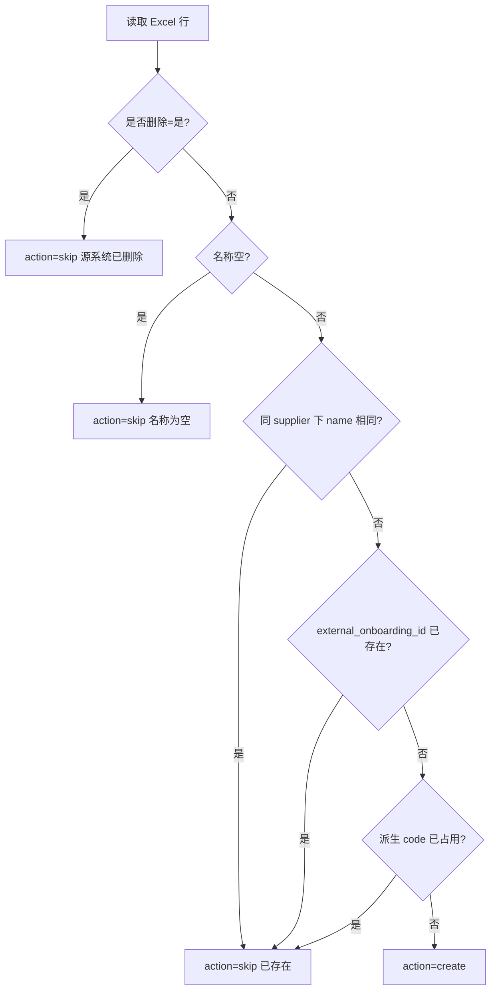
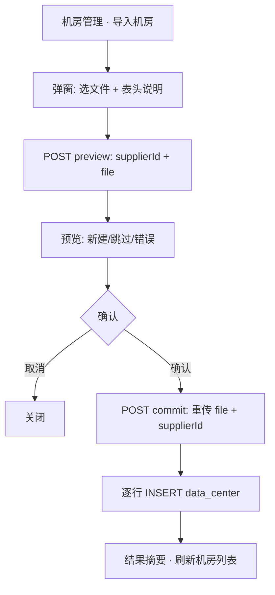

# 供应商机房 Excel 批量导入设计方案

> 版本：v1.1（设计稿）  
> 日期：2026-05-21  
> 状态：**阶段一 Mock 已实施**  
> 关联：`supplier-datacenters-panel.tsx`（入口按钮）、[supplier-import-design.md](./supplier-import-design.md)（两步流参考）、[supplier-database.md](./supplier-database.md)（`data_center` 表）

---

## 1. 目标与原则

### 1.1 业务目标

| # | 目标 | 说明 |
|---|------|------|
| G1 | 批量导入机房 | 在供应商详情「机房管理」Tab 点击 **导入机房**，上传 Excel，写入当前供应商下的 `data_center` 表 |
| G2 | **仅新增、不更新** | 与供应商导入不同：本地 **已存在** 的机房 **整行跳过**，不修改任何字段 |
| G3 | 供应商上下文固定 | 导入弹窗在 `SupplierDatacentersPanel` 内打开，`supplier_id` 由页面传入，Excel 无需也不信任「租户ID」列做归属切换 |
| G4 | 可预览、可部分成功 | **解析预览 → 用户确认 → 入库**；单行失败不阻断其它行 |
| G5 | 幂等可重导 | 重复导入同一 Excel：已入库行全部 `skip`，仅补全新建行 |
| G6 | 与设备导入解耦 | 本功能 **不** 写入 `supplier_device`、`onboarding_batch`；设备仍走 [supplier-device-import-schema.md](./supplier-device-import-schema.md) |

### 1.2 非目标（本期）

- **不更新** 已有机房任何字段（含审核状态、区域、描述、配套费等）
- **不创建导入批次记录**（无 `onboarding_batch`、无 OSS 归档）
- **不软删除** 本地机房（Excel「是否删除=是」仅跳过导入，不联动删除 CRM 内记录）
- **不自动写入** 配套费 jsonb（`network_fee_monthly` / `mgmt_node_fee_monthly`）；新建机房使用默认空配置
- **不同步** 算算力 OpenAPI 实时机房详情

### 1.3 设计原则

1. **供应商内作用域**：匹配与 UK 均在 `(supplier_id, …)` 范围内；禁止跨供应商写入。
2. **预览先于写入**：与 [supplier-import-design.md](./supplier-import-design.md)、[project-import-design.md](./project-import-design.md) 一致。
3. **只 INSERT、不 UPDATE**：preview 行动作为 `create` \| `skip` \| `error`，**无 `update`**。
4. **幂等键分层**：**名称**（同供应商内）→ **派生 code** 冲突检测；源系统 **ID**（`external_onboarding_id`）仅作 **可选** 辅助匹配，**缺失或重复均不报错**。
5. **无服务端预览状态**：preview 结果保存在客户端；commit 时 **重新上传文件** 并携带 `supplierId`，服务端再次解析后入库。

---

## 2. 源表结构

### 2.1 表头（14 列）

| 列序 | 表头 | 示例 / 说明 |
|------|------|-------------|
| 1 | ID | 入驻/平台系统机房主键，如 `20001` |
| 2 | 租户ID | 平台租户 ID；应与当前供应商 `supplier.platform_tenant_id` 一致，用于校验 |
| 3 | 名称 | 机房展示名，如 `北京亦庄数据中心` |
| 4 | 容器实例区域 | 容器/Serverless 可用区，如 `华北-北京` |
| 5 | 裸金属区域 | 裸金属可用区，如 `华北-北京-亦庄` |
| 6 | 描述 | 自由文本 |
| 7 | 规模 | 如 `大型` / `200 台` / 数值文本 |
| 8 | 公网IP数量 | 整数 |
| 9 | 内网网段 | 如 `10.0.0.0/16` |
| 10 | 审核状态 | 如 `已通过` / `待审核` |
| 11 | 审核备注 | |
| 12 | 是否删除 | `是`/`否`/`true`/`false`/`1`/`0` |
| 13 | 创建时间 | |
| 14 | 最后更新时间 | |

### 2.2 文件要求

| 项 | 规则 |
|----|------|
| 格式 | `.xlsx` / `.xls` |
| 大小 | ≤ 10MB |
| 表头 | 第一行必须为 §2.1 列名（别名见 §3.1） |
| 数据行 | **名称** 为空则跳过（`skip` + warning） |
| 单次上限 | ≤ **500** 行 |

---

## 3. 字段映射（Excel → `data_center`）

### 3.1 表头别名

| 标准表头 | 可接受别名 |
|----------|------------|
| ID | id、编号、机房ID |
| 租户ID | 租户 ID、平台租户ID、tenant_id |
| 名称 | 机房名称、数据中心名称 |
| 容器实例区域 | 容器区域、Serverless区域、serverless_region |
| 裸金属区域 | 裸金属区、bare_metal_region |
| 描述 | 备注、说明 |
| 规模 | 机房规模、capacity |
| 公网IP数量 | 公网 IP 数量、public_ip_count |
| 内网网段 | 内网段、private_network、cidr |
| 审核状态 | 审批状态 |
| 审核备注 | 审批备注 |
| 是否删除 | 已删除、deleted |
| 创建时间 | 创建日期 |
| 最后更新时间 | 更新时间、修改时间 |

### 3.2 `data_center` 列映射总表

#### 现有列（[supplier-database.md §3.1](./supplier-database.md)）

| Excel 列 | DB 列 | 新建 | 已存在 |
|----------|--------|------|--------|
| 名称 | `name` | ✓ | **不更新** |
| （派生） | `code` | ✓ | **不更新** |
| （派生） | `location` | ✓ | **不更新** |
| （派生） | `region_tags` | ✓ | **不更新** |
| （派生） | `status` | ✓ | **不更新** |
| （固定默认） | `network_fee_monthly` | ✓ 默认 jsonb | **不更新** |
| （固定默认） | `mgmt_node_fee_monthly` | ✓ 默认 jsonb | **不更新** |
| 创建时间 | `created_at` | ✓（可解析） | **不更新** |
| 最后更新时间 | `updated_at` | ✓ | **不更新** |
| （上下文） | `supplier_id` | ✓ 页面传入 | — |

#### 增量扩展列（`ALTER data_center`）

| Excel 列 | DB 列（新增） | 类型 | 新建 | 已存在 |
|----------|---------------|------|------|--------|
| ID | `external_onboarding_id` | varchar(64) | ✓（**可空，无校验错误**） | **不更新** |
| 租户ID | `platform_tenant_id` | varchar(32) | ✓（校验用，可冗余） | **不更新** |
| 容器实例区域 | `container_instance_region` | varchar(128) | ✓ | **不更新** |
| 裸金属区域 | `bare_metal_region` | varchar(128) | ✓ | **不更新** |
| 描述 | `description` | text | ✓ | **不更新** |
| 规模 | `scale` | varchar(64) | ✓ | **不更新** |
| 公网IP数量 | `public_ip_count` | integer | ✓ | **不更新** |
| 内网网段 | `internal_network_cidr` | varchar(64) | ✓ | **不更新** |
| 审核状态 | `audit_status` | varchar(32) | ✓ | **不更新** |
| 审核备注 | `audit_remark` | text | ✓ | **不更新** |
| 是否删除 | `source_deleted` | boolean | ✓ | **不更新** |

> **说明**：`address` 本期 Excel 无对应列，新建时留空；后续若源表补充地址列再扩展映射。

### 3.3 派生规则（仅 `action = create` 时计算）

| 目标字段 | 规则 |
|----------|------|
| `code` | 优先 `DC-{external_onboarding_id}`；若无 ID 则 `DC-{名称拼音首字母或 slug}`；在 `(supplier_id, code)` UK 冲突时追加 `-2`、`-3` |
| `location` | 优先 `bare_metal_region`；空则 `container_instance_region`；再空则取 `name` 中城市关键词或留空 |
| `region_tags` | 非空去重数组：`[container_instance_region, bare_metal_region]` 过滤空值；供大盘筛选与批次冗余（R-S1.4） |
| `status` | 由 §3.5 审核状态映射；默认 `online` |
| `network_fee_monthly` | 默认 jsonb（§3.4） |
| `mgmt_node_fee_monthly` | 默认 jsonb（§3.4） |

### 3.4 配套费默认值（新建机房）

Excel 不含配套费字段；新建时使用 **零值固定月费** 占位，后续在「编辑机房 / 调整费用」中维护：

```json
{
  "schema_version": 1,
  "currency": "CNY",
  "billing_cycle": "monthly",
  "billing_mode": "fixed",
  "summary": {
    "estimated_monthly_total": "0.0000",
    "display_label": "待配置"
  },
  "fixed": { "amount": "0.0000" },
  "remark": "导入默认占位，请在机房管理中配置"
}
```

`network_fee_monthly` 与 `mgmt_node_fee_monthly` 各写一份（结构相同）。

### 3.5 审核状态 → `status` / `audit_status`

| Excel「审核状态」 | `audit_status` | `status`（经营状态） |
|-------------------|----------------|----------------------|
| 已通过、审核通过 | `approved` | `online` |
| 待审核、审核中 | `pending` | `offline` |
| 已驳回 | `rejected` | `offline` |
| 已暂停 | `suspended` | `maintenance` |
| 已终止 | `terminated` | `offline` |
| 无法识别 | 原文写入 `audit_status` | `offline` + warning |

### 3.6 租户 ID 校验

| 场景 | 处理 |
|------|------|
| Excel 租户ID 与当前 `supplier.platform_tenant_id` 一致 | 正常 |
| Excel 有值但与供应商租户不一致 | **warning**（仍允许 create，写入 `data_center.platform_tenant_id` 为 Excel 值并记日志） |
| Excel 空 | 继承 `supplier.platform_tenant_id`（可空） |
| 供应商本身无 `platform_tenant_id` 且 Excel 有值 | 正常写入机房列 |

> 租户 ID **不参与** 机房归属判定；归属仅由页面 `supplierId` 决定。

### 3.7 「是否删除」处理

| Excel「是否删除」 | preview 动作 | commit |
|-------------------|--------------|--------|
| 是 / true / 1 | `skip`，原因「源系统已删除」 | 不 INSERT |
| 否 / false / 0 / 空 | 按匹配规则 `create` 或 `skip` | 仅 `create` 行 INSERT |

**不** 因源系统删除标记而 UPDATE 或 DELETE 本地已有机房。

---

## 4. 幂等与匹配策略（重点：仅新增）

### 4.1 匹配流程

匹配范围：**当前 `supplier_id` 下** 已有 `data_center` 记录。



### 4.2 匹配键优先级

| 优先级 | 匹配条件 | 命中后 |
|--------|----------|--------|
| 1 | `data_center.name` 与 Excel.名称 **规范化相等**（trim、全半角、大小写不敏感） | `skip` |
| 2 | Excel.ID 非空且 `data_center.external_onboarding_id = Excel.ID`（同 `supplier_id`） | `skip` |
| 3 | 派生 `code` 与已有 `(supplier_id, code)` 冲突 | `skip`（预览提示「编码冲突，视为已存在」） |

**`external_onboarding_id` 宽松规则**（均 **不报错**）：

| 场景 | 处理 |
|------|------|
| Excel ID 为空 | 正常参与匹配；`code` 改由名称/行号派生 |
| 同文件多行 ID 相同 | **不 error**；按行独立判定 create/skip |
| 多行 ID 相同且均为新建 | 允许写入多条（**不设 UK**）；`code` 派生时自动加后缀消歧 |
| ID 与库内已有记录相同 | `skip`（info，非 error） |

### 4.3 与供应商导入的差异

| 维度 | 供应商导入 | 机房导入 |
|------|------------|----------|
| 已存在行 | `update`（白名单字段） | **`skip`（零字段更新）** |
| preview 动作 | create / update / skip | **create / skip / error** |
| 商务经理弹窗 | 必填 | **无**（机房无此字段） |
| 作用域 | 全局 supplier | **单 supplier 内** |

---

## 5. 业务规则

| 编号 | 规则 |
|------|------|
| **R-DCI1** | 不创建任何导入批次记录；commit 为无状态「重解析 + 逐行 INSERT」 |
| **R-DCI2** | `external_onboarding_id` **可空、非 UK**；仅 `(supplier_id)` 范围普通 INDEX 辅助查询；**不因 ID 缺失/重复产生 error** |
| **R-DCI3** | `(supplier_id, code)` 已有 UK；仅新建时生成 `code` |
| **R-DCI4** | `public_ip_count` 须为非负整数；无法解析 → `error` |
| **R-DCI5** | `internal_network_cidr` 建议校验 CIDR 格式；非法 → `warning`，仍允许 create |
| **R-DCI6** | 单行失败不影响其它行 |
| **R-DCI7** | 具备 `supplier:datacenter:import` 权限的用户可导入（RBAC 待落地；阶段一 Mock 不校验） |
| **R-DCI8** | 单次 ≤ 500 行 |
| **R-DCI9** | **禁止 UPDATE**：服务端 commit 若检测到匹配已有记录，必须跳过并计入 `skipped`，不得写入 |
| **R-DCI10** | commit 时再次校验 `supplier_id` 存在且当前用户有该供应商访问权 |

---

## 6. 端到端流程



### 6.1 Preview 校验码

| 代码 | 级别 | 说明 |
|------|------|------|
| `MISSING_NAME` | warning | 名称为空，跳过 |
| `SOURCE_DELETED` | info | 源系统已删除，跳过 |
| `ALREADY_EXISTS` | info | 本地已存在，跳过（**不更新**） |
| `DUPLICATE_NAME_IN_FILE` | error | 同文件名称重复 |
| `INVALID_PUBLIC_IP_COUNT` | error | 公网 IP 数量非非负整数 |
| `INVALID_CIDR` | warning | 内网网段格式可疑 |
| `TENANT_MISMATCH` | warning | 租户 ID 与供应商不一致 |
| `INVALID_AUDIT_STATUS` | warning | 审核状态无法识别 |
| `CODE_COLLISION` | info | 派生 code 冲突，视为已存在 skip |

### 6.2 Commit

1. 校验 session + 权限 + `supplierId` 有效
2. 重新解析 Excel（与 preview 相同逻辑）
3. 对每行：若 `action = create` → `INSERT data_center`；若 `skip` / `error` → 跳过
4. 返回 `{ created, skipped, failed, errors[] }`

无 batch、无 `supplier_activity` 批次事件（可选：每条 create 写 `supplier_activity` type=`datacenter_import`，非必须）。

---

## 7. 界面设计

### 7.1 入口

`supplier-datacenters-panel.tsx` 第 38–41 行 **导入机房** 按钮：

```tsx
<Button className="gap-2" onClick={() => setImportOpen(true)}>
  <Upload className="w-4 h-4 mr-2" />
  导入机房
</Button>
```

→ 打开 `SupplierDatacenterImportDialog`，传入 `supplierId`、`supplierName`、现有 `dataCenters`（Mock）或服务端列表。

### 7.2 步骤

| Step | 内容 |
|------|------|
| **upload** | 文件选择；表头说明（14 列）；提示「**已有机房不会修改，仅导入新增**」 |
| **preview** | 摘要 + 表格（行号、名称、动作、匹配说明、校验） |
| **done** | 新建 / 跳过 / 失败计数；「完成」关闭并刷新列表 |

### 7.3 预览表列

| 列 | 说明 |
|----|------|
| 行号 | Excel 行号 |
| 名称 | |
| 源 ID | Excel ID |
| 动作 | **新建** / **跳过（已存在）** / **跳过（源已删）** / 错误 |
| 将写入 code | 仅 `create` 行展示派生编码 |
| 校验 | ok / warning / error + 消息 |

### 7.4 线框

```
┌─────────────────────────────────────────────────────────────┐
│  导入机房信息                                        [ × ]  │
│  供应商：云智算力（sup1）                                    │
├─────────────────────────────────────────────────────────────┤
│  ⓘ 已存在的机房不会修改；仅导入新增数据；可重复导入补全      │
│                                                             │
│  [ 选择文件 ]  datacenter-export.xlsx                        │
│  表头：ID、租户ID、名称、容器实例区域、裸金属区域…           │
├─────────────────────────────────────────────────────────────┤
│                              [ 取消 ]  [ 解析并预览 → ]      │
└─────────────────────────────────────────────────────────────┘

┌─────────────────────────────────────────────────────────────┐
│  预览                                              [ ← ]    │
│  新建 3 · 跳过 12 · 错误 1                                   │
├─────────────────────────────────────────────────────────────┤
│  行 │ 名称           │ 动作     │ code        │ 校验        │
│  2  │ 北京亦庄…      │ 跳过已存在│ —           │ 已存在      │
│  3  │ 怀来二期       │ 新建     │ DC-20003    │ 通过        │
├─────────────────────────────────────────────────────────────┤
│                    [ 取消 ]  [ 确认导入 3 条 ]               │
└─────────────────────────────────────────────────────────────┘
```

---

## 8. API 与模块

### 8.1 路由

| 方法 | 路径 | Body | 响应 |
|------|------|------|------|
| POST | `/api/supplier/[supplierId]/datacenter/import/preview` | `FormData`: `file` | `DatacenterImportPreviewResult` |
| POST | `/api/supplier/[supplierId]/datacenter/import/commit` | `FormData`: `file` | `DatacenterImportCommitResult` |

> 无 `batchId`；commit 与 preview 使用相同 `supplierId` + `file`，服务端重新解析。

### 8.2 类型（Preview 行）

```typescript
type DatacenterImportPreviewRow = {
  row_no: number
  name?: string
  external_onboarding_id?: string
  action: 'create' | 'skip' | 'error'
  skip_reason?: 'already_exists' | 'source_deleted' | 'empty_name' | 'code_collision'
  matched_data_center_id?: string
  derived_code?: string
  parse_status: 'ok' | 'warning' | 'error'
  parse_message?: string
  parse_codes?: string[]
}

type DatacenterImportPreviewResult = {
  supplier_id: string
  summary: { create: number; skip: number; error: number }
  rows: DatacenterImportPreviewRow[]
}

type DatacenterImportCommitResult = {
  created: number
  skipped: number
  failed: number
  errors: Array<{ row_no: number; message: string }>
  created_ids?: string[]
}
```

### 8.3 文件清单

| 路径 | 职责 |
|------|------|
| `components/dashboard/supplier-datacenter-import-dialog.tsx` | 弹窗 UI |
| `components/dashboard/supplier-datacenters-panel.tsx` | 入口按钮 + `importOpen` 状态 |
| `lib/supplier/parse-datacenter-import-xlsx.ts` | Excel 解析 |
| `lib/supplier/datacenter-import-utils.ts` | 匹配、派生、INSERT 组装（Mock + 服务端共用逻辑） |
| `lib/supplier/datacenter-import-error-export.ts` | 错误行导出 |
| `lib/types/datacenter-import.ts` | 类型 |
| `lib/server/dataaccess/supplier/datacenter-import.ts` | 阶段二：preview/commit |
| `app/api/supplier/[supplierId]/datacenter/import/preview/route.ts` | |
| `app/api/supplier/[supplierId]/datacenter/import/commit/route.ts` | |

---

## 9. 数据库变更

扩展 `data_center` 表（`packages/db/src/supply-schema.ts`，与 [supplier-database.md](./supplier-database.md) 对齐）：

| 列名 | 类型 | 约束 |
|------|------|------|
| `external_onboarding_id` | varchar(64) | **可空、非 UK**；INDEX `(supplier_id, external_onboarding_id)` WHERE NOT NULL（仅查询，不强制唯一） |
| `platform_tenant_id` | varchar(32) | 可空 |
| `container_instance_region` | varchar(128) | 可空 |
| `bare_metal_region` | varchar(128) | 可空 |
| `description` | text | 可空 |
| `scale` | varchar(64) | 可空 |
| `public_ip_count` | integer | 可空 |
| `internal_network_cidr` | varchar(64) | 可空 |
| `audit_status` | varchar(32) | 可空 |
| `audit_remark` | text | 可空 |
| `source_deleted` | boolean | NOT NULL DEFAULT false |

**同步项**（若 `supply-schema.ts` 尚未与 v1.3 设计稿一致）：

| 列名 | 说明 |
|------|------|
| `region_tags` | `text[] NOT NULL DEFAULT '{}'` |
| `network_fee_monthly` | jsonb（替换当前 numeric 占位） |
| `mgmt_node_fee_monthly` | jsonb（替换当前 numeric 占位） |

**ER**：无新增表；`data_center` 为唯一写入目标。

---

## 10. 分阶段实施

### 阶段一 — Mock（与当前 `SupplierDatacentersPanel` 一致）

- `SupplierDatacenterImportDialog` + 客户端 `xlsx` 解析（`sheetjs` / 与供应商导入相同依赖）
- `previewDatacenterImportFromFile(supplierId, existingDataCenters, file)`
- `commitDatacenterImportMock`：`setDataCenters` 合并 **仅 append** 新行
- 面板 `useState` 改为可更新列表，导入成功后刷新卡片

### 阶段二 — 服务端

- `ALTER data_center` 增加 §9 列 + jsonb / region_tags 对齐
- preview / commit API
- `SupplierDatacentersPanel` 改 SWR/React Query 拉取 DB 列表

---

## 11. 测试要点

| 场景 | 预期 |
|------|------|
| 导入含已有机房名称的行 | `skip`，库内字段 **不变** |
| 导入含已有机房 Excel ID 的行 | `skip` |
| 全新机房行 | `create`；`code` 派生正确 |
| 源系统「是否删除=是」 | `skip`，不 INSERT |
| 同文件两个相同 ID | **不报错**；按名称/code 独立判定 |
| 租户 ID 与供应商不一致 | `warning` + 仍可 create |
| 公网 IP 数量为 `-1` | `error` |
| 重复导入同一文件 | 第二次全部 `skip`，`created=0` |
| 500+ 行 | preview 拒绝 |
| 跨供应商误传 supplierId | commit 403 / 供应商不存在 |

---

## 12. 变更记录

| 版本 | 日期 | 说明 |
|------|------|------|
| v1.0 | 2026-05-21 | 首版：机房 Excel 14 列映射；弹窗两步流；**仅新增不更新**；入口 `supplier-datacenters-panel.tsx` |
| v1.1 | 2026-05-21 | `external_onboarding_id` 可空、非 UK、**全程不报错**；匹配优先级改为名称优先 |
