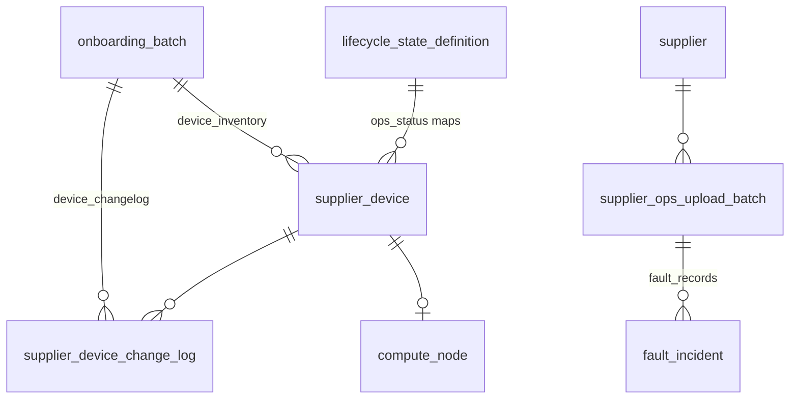

# 供应商设备批量导入 — 数据库表结构补充设计

**依据**：`supplier-database.md`（v1.3）、设备/设备变更/故障记录 Excel 导入需求、运营侧跟踪与分析方案。

**文档性质**：在 **不更名既有表** 的前提下，描述本次增量变更的完整表结构、字段映射与导入批次规则。物理实现见 `packages/db/src/supply-schema.ts`。

**版本**：v1.5（2026-05-24）

**关联主文档**：[supplier-database.md](./supplier-database.md)、[supplier-onboarding-plan-changelog-tracking-design.md](./supplier-onboarding-plan-changelog-tracking-design.md)（v2.2 资源总览 / 字典）

**Drizzle 实现**：`packages/db/src/supply-schema.ts`、`packages/db/src/supply-lifecycle-dictionary.ts`

---

## 1. 变更摘要

| 类别 | 决策 |
|------|------|
| **设备主数据** | `supplier_device` 增加 `in_maintenance`、`bandwidth_group`、`rate_limit`、`ops_status`（Excel 原始状态）、`device_spec`、`received_at`、`remark`、`login_username`、`login_password` 等；**不保存**合作类型 |
| **登录凭据** | Excel「登录用户名/登录密码」写入 `supplier_device`；**阶段一明文**存储（`login_password` text）；阶段二再迁移加密/KMS（见 §3.1.1） |
| **运维状态与生命周期** | Excel「设备状态」原样写入 `ops_status`；经字典映射得到 `lifecycle_status`（CRM 统一状态机） |
| **设备变更审计** | **新增** `supplier_device_change_log`；变更 **必须** 归属一次导入批次（`onboarding_batch`）；**不再** 为导入驱动变更写入 `entity_state_transition_log` |
| **设备表导入** | 扩展 `onboarding_batch.batch_kind = device_inventory`；解析行含登录凭据，commit 时写入 `supplier_device` |
| **设备变更表导入** | `onboarding_batch.batch_kind = device_changelog`；commit 仅写 `supplier_device_change_log` 并按规则刷新设备 `ops_status` / `lifecycle_status` |
| **故障记录表导入** | **使用** `supplier_ops_upload_batch`（`kind = fault_records`）作为导入容器；commit 写入扩展后的 `fault_incident` |
| **表名** | 全部沿用现有表名，仅 **新增** `supplier_device_change_log`、可选 `fault_record_import_row` |

---

## 2. 运维状态字典与生命周期映射

### 2.1 `device_ops_status`（Excel 设备状态 — 字典域）

在 `lifecycle_state_definition` 中增加 `domain = device_ops_status`，`state_code` 为 Excel 原文，`payload` 含 **`overview_bucket`**、**`pool_memberships`**；`lifecycle_status` **仅作参考**（v2.4 设备 lifecycle 以 [§3.4.3](./supplier-onboarding-plan-changelog-tracking-design.md) 进程规则为准）。

**种子数据（11 条，`supply-lifecycle-dictionary.ts`）**：

| `state_code`（Excel 原文） | 参考 lifecycle | `overview_bucket` | `pool_memberships` | 说明 |
|---------------------------|---------------|-------------------|-------------------|------|
| `预留闲置中` | *接入中* | `reserved` | — | KPI「预留闲置」 |
| `在集群中` | `在线` | `in_cluster` | *binding* | 可售候选 |
| `集群组件运行中` | `在线` | `in_cluster` | *binding* | 可售候选 |
| `网关直连裸金属上架中` | **`在线`** | `bare_metal_onboarding` | `["bare_metal"]` | 上架流水线 |
| `网关代理裸金属上架中` | **`在线`** | `bare_metal_onboarding` | `["bare_metal","elastic_service"]` | 双池 |
| `线下裸金属交付中` | **`在线`** | `offline_delivery` | `["bare_metal"]` | 线下交付 |
| `其他部门使用中` | `在线` | `other_dept` | — | 不可售扣减 |
| `不可调度节点运行中` | `在线` | `in_cluster` | *binding* | KPI「不可调度」 |
| `网关节点上架中` | **`在线`** | `gateway_onboarding` | — | 网关接入 |
| `已退订` | `下线中` | `retired` | — | 退订 ops |

**独立字段 `in_maintenance`（维修中）**：

- 来源：Excel 列「维修中」（布尔：是/否、1/0、true/false）。
- 与 `ops_status` **正交**：例如 `ops_status = 在集群中` 且 `in_maintenance = true` 时，`lifecycle_status` **覆盖** 为 `维护中`（§3.4.3.1 优先级最高）。

### 2.2 `lifecycle_status`（CRM 统一状态 — v2.4）

**5 态**：`待接入` | `接入中` | `在线` | `维护中` | `下线中`

| 阶段 | 定义 |
|------|------|
| 待接入 | 已创建 `online`/`order_access` 批次关联，未 `设备接收` |
| 接入中 | 已 `设备接收`（通常 `ops=预留闲置中`） |
| 在线 | `ONLINE_OPS`（集群 + 4 种上架/交付 + 其他部门使用中）且非维修 |
| 维护中 | `in_maintenance = true` |
| 下线中 | 已创建 `device_retire` 下架批次 |

由 [§3.4.3](./supplier-onboarding-plan-changelog-tracking-design.md) 进程规则写入；详见主设计文档。

### 2.3 `device_change_action`（Excel 变更动作 — 字典域）

`lifecycle_state_definition.domain = device_change_action`；`supplier_device_change_log.change_action` 存原文。

**种子数据（20 条）**：`设备接收`、`加入集群`、`配置变更`、`故障维修`、`维护结束`、`状态更新`、`带宽组调整`、`带宽限制调整`、`上架接入平台网关`、`上架单机模式裸金属`、`上架网关代理裸金属`、`上架网关直连裸金属`、`下架裸金属`、`线下裸金属交付`、`集群角色增加`、`集群角色删除`、`设备退订`、`非常规下线`、`交给其他部门使用`。

`payload.default_ops_status` / **`default_pool_bindings`** 用于 `commitChangelog` 在无「设备状态」变更内容时刷新 `supplier_device.ops_status` 并同步 `resource_pool_binding`（映射表见 [supplier-onboarding-plan-changelog-tracking-design.md §3.4.4](./supplier-onboarding-plan-changelog-tracking-design.md)）。

---

## 3. 表结构（增量）

### 3.1 `supplier_device`（物理算力设备 — 变更后全量列）

在 [supplier-database.md §3.4](./supplier-database.md) 基础上 **增量** 如下（**禁止** 合作类型列；**保留** 登录凭据列）。

| 列名 | 类型 | 约束 | 说明 |
|------|------|------|------|
| `id` | text | PK | 系统主键 |
| `supplier_id` | text | FK→`supplier`, NOT NULL | |
| `contract_id` | text | FK→`supplier_contract`, 可空 | |
| `onboarding_batch_id` | text | FK→`onboarding_batch`, 可空 | **仅** 最近一次 `device_inventory` 导入批次（禁止指向业务批次） |
| `data_center_id` | text | FK→`data_center`, 可空 | |
| `gpu_card_type_id` | text | FK→`gpu_card_type`, NOT NULL | 由 Excel「显卡型号」解析 |
| `external_device_id` | varchar(128) | 可空 | Excel「设备ID」；与 `id` 可不同，UK 可选 |
| `asset_no` | varchar(64) | UK, 可空 | Excel「设备标识」或资产号 |
| `sn` | varchar(64) | UK, NOT NULL | 无 SN 时由导入规则生成 |
| `idc_code` | varchar(64) | NOT NULL | |
| `idc_region` | varchar(64) | 可空 | |
| `gpu_count` | integer | NOT NULL | Excel「显卡数量」 |
| `external_ip` | varchar(45) | 可空 | |
| `internal_ip` | varchar(45) | 可空 | Excel「内网IP地址」 |
| **`ops_status`** | varchar(64) | NOT NULL | Excel「设备状态」**原文**；FK 语义对齐 `lifecycle_state_definition`（`domain=device_ops_status`） |
| **`lifecycle_status`** | varchar(32) | NOT NULL | 由 §2 映射计算 |
| **`in_maintenance`** | boolean | NOT NULL DEFAULT false | Excel「维修中」 |
| `onboarding_substage` | varchar(64) | 可空 | 施工子阶段（人工/UI） |
| **`bandwidth_group`** | varchar(64) | 可空 | Excel「带宽组」 |
| **`rate_limit`** | varchar(64) | 可空 | Excel「限速」；如需数值化可另存 `rate_limit_mbps` integer |
| **`device_spec`** | text | 可空 | Excel「设备配置」 |
| **`received_at`** | timestamptz | 可空 | Excel「设备接收时间」 |
| **`remark`** | text | 可空 | Excel「备注」 |
| **`login_username`** | varchar(128) | 可空 | Excel「登录用户名」；解析别名 `root_account` |
| **`login_password`** | text | 可空 | Excel「登录密码」；**阶段一明文**；解析别名 `root_password` |
| `platform_resource_id` | varchar(128) | 可空 | 平台/监控资源 ID |
| `created_at` | timestamptz | NOT NULL | |
| `updated_at` | timestamptz | NOT NULL | |

#### 3.1.1 登录凭据存储策略（阶段一）

| 阶段 | 存储 | API/UI |
|------|------|--------|
| **阶段一（当前）** | `login_password` **明文** 存 `supplier_device`；`onboarding_batch_import_row.login_password` 同步明文 | 列表/导出 **默认脱敏**（仅末位可见）；详情需 `device:credential:read` 权限（RBAC 待落地） |
| **阶段二（规划）** | 迁 KMS/应用层加密列或独立 `supplier_device_credential`；`login_password` 弃用或仅存密文 | 导入 commit 时加密写入；历史明文一次性迁移 |

**明确不落库的 Excel 列**：

| Excel 列 | 处理 |
|----------|------|
| 合作类型 | **不保存**（归属合同/条款域） |
| K8s 集群 / 节点名 / 集群角色 / 预期服务 | 见 `compute_node` §3.2 |

索引（增量）：`(ops_status)`、`(in_maintenance)`、`(external_device_id)` WHERE NOT NULL。

---

### 3.2 `compute_node`（计算节点 — 补充 Excel 集群列）

| 列名 | 类型 | 约束 | 说明 |
|------|------|------|------|
| `id` | text | PK | |
| `supplier_device_id` | text | FK→`supplier_device`, NOT NULL | |
| `node_role` | varchar(32) | NOT NULL | Excel「集群角色」 |
| `mgmt_ip` | varchar(45) | 可空 | |
| **`cluster_name`** | varchar(128) | 可空 | Excel「K8s集群」 |
| **`node_name`** | varchar(128) | 可空 | Excel「集群中节点名称」 |
| **`expected_service`** | varchar(255) | 可空 | Excel「预期集群提供服务」 |
| `cluster_id` | varchar(64) | 可空 | 平台侧集群 ID（与 `cluster_name` 可并存） |
| `lifecycle_status` | varchar(32) | NOT NULL | |
| `created_at` | timestamptz | NOT NULL | |
| `updated_at` | timestamptz | NOT NULL | |

设备导入 commit 时：每台 `supplier_device` 可 **0或1** 条 `compute_node`（有任一集群列非空则创建/更新）。

---

### 3.3 `onboarding_batch`（接入/导入批次 — 扩展 `batch_kind`）

**`batch_kind` 枚举扩展**（varchar(32)）：

| 值 | 含义 | 导入 Excel |
|----|------|------------|
| `online` | 设备上架（既有） | 接入清单（简化列） |
| `order_access` | 订单接入（既有） | 同上 |
| **`device_inventory`** | **设备主数据全量/增量** | **设备表** |
| **`device_changelog`** | **设备变更流水批次** | **设备变更表** |

其余列与 [supplier-database.md §3.3](./supplier-database.md) 一致（含 `import_status` 状态机、`parsed_rows_json`、`committed_device_count` 等）。

**批次业务规则（R-DI1）**：

- 每次上传设备变更 Excel **必须** 新建 `onboarding_batch`，`batch_kind = device_changelog`。
- `supplier_device_change_log.onboarding_batch_id` NOT NULL，保证变更可追溯至导入批次。
- 设备主数据导入：`batch_kind = device_inventory`；`supplier_device.onboarding_batch_id` 更新为 **本次** 批次 ID。

**`device_inventory` commit 后**：刷新 `supplier_device`、`compute_node`，重算 `lifecycle_status`，触发 L1 `supplier_gpu_inventory` 汇总（规则见 §6）。

**`device_changelog` commit 后**：仅追加 `supplier_device_change_log`，并按变更行更新目标设备 `ops_status` / `in_maintenance` / `lifecycle_status`（若变更内容含状态字段）。

---

### 3.4 `onboarding_batch_import_row`（解析明细 — 调整列）

**登录凭据列（阶段一明文）**：

| 列名 | 类型 | 约束 | 说明 |
|------|------|------|------|
| `login_username` | varchar(128) | 可空 | Excel「登录用户名」；兼容解析字段名 `root_account` |
| `login_password` | text | 可空 | Excel「登录密码」；**阶段一明文**（取代原 `root_password_enc` 设计） |

> **迁移说明**：若库表仍为 `root_account` / `root_password_enc`，阶段一迁移可 **重命名** 为 `login_username` / `login_password` 并改为可空 text，或保留旧列名仅更新文档约束为「明文、可空」— 以实现层 Drizzle 为准，语义与本节一致。

**`device_inventory` 行结构**（`parsed_rows_json` 单元素同构）：

| 字段 | 必填 | 说明 |
|------|------|------|
| `row_no` | 是 | 源文件行号 |
| `external_device_id` | 否 | 设备ID |
| `internal_ip` | 否 | 内网IP |
| `asset_no` / `sn` | 否 | 设备标识；至少其一 |
| `gpu_card_type_code` | 否 | Excel「显卡型号」原文；可为空（如 CPU 管控节点） |
| `gpu_card_type_id` | 否 | preview/commit 手工选择的卡型 ID（§4.1.1） |
| `gpu_count` | 否 | |
| `ops_status` | 是 | 设备状态（原文） |
| `in_maintenance` | 否 | 维修中，默认 false |
| `bandwidth_group` | 否 | |
| `rate_limit` | 否 | |
| `device_spec` | 否 | |
| `received_at` | 否 | ISO8601 |
| `remark` | 否 | |
| `login_username` / `login_password` | 否 | 登录凭据；别名 `root_account` / `root_password` |
| `cluster_name` / `node_name` / `node_role` / `expected_service` | 否 | → `compute_node` |
| `parse_status` | 是 | `ok` / `warning` / `error` |
| `parse_message` | 否 | |
| `supplier_device_id` | 否 | commit 后回填 |

**`device_changelog` 行结构**（仅预览，commit 写入 change_log 表）：

| 字段 | 必填 | 说明 |
|------|------|------|
| `row_no` | 是 | |
| `external_device_id` | 否 | 用于解析 `supplier_device_id` |
| `internal_ip` | 否 | 校验用 |
| `occurred_at` | 是 | 操作时间 |
| `change_action` | 是 | 变更动作 |
| `change_content` | 否 | 变更内容 |
| `description` | 否 | 详细说明 |
| `ticket_no` | 否 | 工单 |
| `parse_status` | 是 | |

---

### 3.5 `supplier_device_change_log`（设备变更审计）

**替代**导入场景下的 `entity_state_transition_log`；UI 时间线可投影 `supplier_activity`（`type = device_change_imported`）。

| 列名 | 类型 | 约束 | 说明 |
|------|------|------|------|
| `id` | text | PK | |
| `supplier_device_id` | text | FK→`supplier_device`, NOT NULL | Excel「设备ID」解析 |
| `onboarding_batch_id` | text | FK→`onboarding_batch`, NOT NULL | **`device_changelog` 导入批次** |
| **`business_onboarding_batch_id`** | text | FK→`onboarding_batch`, 可空 | 由 `ticket_no` 匹配业务计划批次 |
| `internal_ip` | varchar(45) | 可空 | Excel「内网IP」冗余校验 |
| `occurred_at` | timestamptz | NOT NULL | Excel「操作时间」 |
| `change_action` | varchar(64) | NOT NULL | Excel「变更动作」→ 字典 `device_change_action` |
| `change_content` | text | 可空 | Excel「变更内容」 |
| `description` | text | 可空 | Excel「详细说明」 |
| `ticket_no` | varchar(64) | 可空 | Excel「工单」（飞书工单号） |
| `import_row_no` | integer | 可空 | 源文件行号 |
| `previous_ops_status` / `new_ops_status` | varchar(64) | 可空 | commit 快照 |
| `previous_lifecycle_status` / `new_lifecycle_status` | varchar(32) | 可空 | |
| `created_at` | timestamptz | NOT NULL | 入库时间 |

索引：`(supplier_device_id, occurred_at DESC)`、`(onboarding_batch_id)`、`(ticket_no)`、`(business_onboarding_batch_id)`、`(business_onboarding_batch_id, supplier_device_id)`。

### 3.5.1 `onboarding_batch_device_link`（业务批次 ↔ 设备）

见 [supplier-onboarding-plan-changelog-tracking-design.md §4.4](./supplier-onboarding-plan-changelog-tracking-design.md)；Drizzle：`onboardingBatchDeviceLink`。

**不保存**：附件（Excel「附件」列忽略）。

**幂等（R-DI2）**：`UNIQUE (onboarding_batch_id, import_row_no)` 或 `(supplier_device_id, occurred_at, change_action, md5(change_content))` 由应用层择一。

---

### 3.6 `supplier_ops_upload_batch`（故障记录导入容器 — 扩展）

**结论**：故障记录表 **对应** `supplier_ops_upload_batch`，`kind = fault_records`；解析结果落 `rows_json`，commit 后写入 `fault_incident`（及可选明细表）。

| 列名 | 类型 | 约束 | 说明 |
|------|------|------|------|
| `id` | text | PK | |
| `kind` | varchar(32) | NOT NULL | **`fault_records`**（故障记录表）；保留 `fault-incidents` 兼容 |
| `supplier_id` | text | FK→`supplier`, NOT NULL | |
| `idc_code` | varchar(64) | NOT NULL | 可按供应商默认机房或 Excel 推导 |
| `file_name` | varchar(255) | NOT NULL | |
| `import_file_uri` | varchar(1024) | 可空 | 建议与 `onboarding_batch` 对齐增加对象存储 URI |
| `rows_json` | jsonb | NOT NULL | 解析预览数组（§3.6.1） |
| **`import_status`** | varchar(32) | NOT NULL DEFAULT `uploaded` | 对齐设备批次：`uploaded`→`parsed`→`committed` / `parse_failed` |
| `status` | varchar(32) | NOT NULL | **保留**；与 `import_status` 并存时以 `import_status` 为准（迁移期 `status` = `import_status`） |
| `parse_error` | text | 可空 | |
| `parsed_row_count` | integer | NOT NULL DEFAULT 0 | |
| `parsed_success_count` | integer | NOT NULL DEFAULT 0 | |
| **`committed_incident_count`** | integer | NOT NULL DEFAULT 0 | 已写入 `fault_incident` 条数 |
| `committed_at` | timestamptz | 可空 | |
| `onboarding_batch_id` | text | FK, 可空 | 一般 **空**；不与接入批次混用 |
| `created_by_staff_id` | text | FK→`user_staff`, 可空 | |
| `created_at` | timestamptz | NOT NULL | |

#### 3.6.1 `rows_json` 单元素（故障记录表）

| 字段 | 必填 | 说明 |
|------|------|------|
| `row_no` | 是 | |
| `opened_at` | 是 | 记录时间 |
| `closed_at` | 否 | 解决时间 |
| `fault_type` | 是 | 故障类型 |
| `impact_minutes` | 否 | 影响时长(分钟)；可与 closed−opened 互校 |
| `impact_scope` | 否 | 影响范围 |
| `affected_device_count` | 否 | 影响台数 |
| `postmortem` | 否 | 故障复盘 |
| `parse_status` | 是 | |

#### 3.6.2 `fault_record_import_row`（可选明细表）

行数 > 500 时推荐，结构同 `rows_json` 列，增加 `supplier_ops_upload_batch_id`、`fault_incident_id`（commit 回填）。

---

### 3.7 `fault_incident`（故障事件 — 扩展）

支持 **事件级** 故障（无单机 FK），并与 `supplier_ops_upload_batch` 关联。

| 列名 | 类型 | 约束 | 说明 |
|------|------|------|------|
| `id` | text | PK | |
| **`supplier_id`** | text | FK→`supplier`, NOT NULL | 事件归属供应商 |
| **`supplier_ops_upload_batch_id`** | text | FK→`supplier_ops_upload_batch`, 可空 | 导入批次溯源 |
| `supplier_device_id` | text | FK, 可空 | 单机故障时填写 |
| `compute_node_id` | text | FK, 可空 | |
| **`fault_type`** | varchar(64) | NOT NULL | Excel「故障类型」 |
| `severity` | varchar(8) | NOT NULL DEFAULT `P3` | 导入可默认 P3，人工上调 |
| `incident_status` | varchar(32) | NOT NULL | `处理中` / `已关闭`（`closed_at` 非空即为已关闭） |
| **`impact_minutes`** | integer | 可空 | Excel「影响时长(分钟)」 |
| **`impact_scope`** | varchar(255) | 可空 | Excel「影响范围」 |
| **`affected_device_count`** | integer | 可空 | Excel「影响台数」 |
| **`postmortem`** | text | 可空 | Excel「故障复盘」；兼作 `resolution_outcome` 长文本 |
| `resolution_outcome` | text | 可空 | 简短关闭说明（UI 用） |
| `opened_at` | timestamptz | NOT NULL | 记录时间 |
| `closed_at` | timestamptz | 可空 | 解决时间 |
| `created_at` | timestamptz | NOT NULL | |

**CHECK（放宽）**：`supplier_device_id` 与 `compute_node_id` **可均为空**（事件级故障）；`supplier_id` 始终非空。

索引：`(supplier_id, opened_at DESC)`、`(supplier_ops_upload_batch_id)`、`(fault_type)`。

---

### 3.8 `entity_state_transition_log`（不变更写入策略）

表结构 **保留**（兼容手工操作、未来其他实体），但 **设备 Excel 导入与变更导入不再 INSERT**。

| 场景 | 审计落点 |
|------|----------|
| 设备主数据/状态来自 Excel | `supplier_device` 字段更新 + `supplier_device_change_log`（仅 changelog 批次） |
| 设备变更 Excel | **仅** `supplier_device_change_log` |
| 运营 UI 手动改生命周期 | 可选继续写 `entity_state_transition_log` + `supplier_activity`（非本文件范围） |

---

## 4. Excel 列 ↔ 数据库映射总表

### 4.1 设备表

| Excel 列 | 目标 |
|----------|------|
| 设备ID | `supplier_device.external_device_id` |
| 内网IP地址 | `supplier_device.internal_ip` |
| 设备标识 | `supplier_device.asset_no` 或 `sn` |
| 显卡型号 | `gpu_card_type` → `gpu_card_type_id`（§4.1.1） |
| 显卡数量 | `supplier_device.gpu_count` |
| 设备状态 | `supplier_device.ops_status` + 映射 → `lifecycle_status` |
| 维修中 | `supplier_device.in_maintenance` |
| K8s集群 | `compute_node.cluster_name` |
| 集群中节点名称 | `compute_node.node_name` |
| 集群角色 | `compute_node.node_role` |
| 预期集群提供服务 | `compute_node.expected_service` |
| 设备配置 | `supplier_device.device_spec` |
| 设备接收时间 | `supplier_device.received_at` |
| 合作类型 | **不落库** |
| 带宽组 | `supplier_device.bandwidth_group` |
| 限速 | `supplier_device.rate_limit` |
| 备注 | `supplier_device.remark` |
| 登录用户名 | `supplier_device.login_username` |
| 登录密码 | `supplier_device.login_password`（阶段一明文） |

#### 4.1.1 显卡型号 → `gpu_card_type_id` 解析规则（R-DI8）

**适用范围**：`batch_kind = device_inventory` 的 preview 与 commit。

**输入**：Excel 列「显卡型号」（解析字段 `gpu_card_type_code`），表头别名：`显卡型号` / `gpu_card_type` / `卡型`。

**卡型字典**：加载 `gpu_card_type` **全表**（**不**过滤 `status`）。

**匹配顺序**（均 **忽略大小写**；优先级从高到低）：

1. **Preview 手工选择**：行上 `gpu_card_type_id`（用户在下拉中指定）。
2. **Excel 自动匹配**：
   - **名称匹配**：`trim(excel值)` 与 `gpu_card_type.name` 相等；
   - **编码匹配**：去掉 Excel 值最前品牌前缀后，与 `gpu_card_type.code` 比较（规范化完全相等或前缀匹配，`80G`≈`80GB`）。
3. **已有设备 IP 匹配**：`supplier_device.internal_ip`（同供应商）已存在且已有 `gpu_card_type_id` 时，按 **内网 IP** 复用该卡型（`matchedBy = existing_ip`）；重复导入无需再次选择。

**失败与手工补全**：

| 情况 | Preview | Commit |
|------|---------|--------|
| 上述三步均未得到卡型 | **失败**（红色）；**匹配卡型**列下拉手工选择 | **阻断**整批导入 |
| 自动匹配或 IP 复用成功 | 只读展示 code + 匹配方式 | 直接使用 |
| 用户手工选择后 | 失败消除，只读展示「手工」 | 使用 `gpu_card_type_id` |
| 存在任一失败行 | 禁用「确认入库」；可下载 **失败明细** Excel | **阻断**整批导入 |

**Preview UI**：展示「显卡型号」「匹配卡型」；已成功解析（名称/编码/已有设备 IP）的行 **只读**；仅失败行显示卡型下拉（`gpu_card_type` 全表，**不**过滤 `status`）。

**实现**：`apps/web/src/lib/supplier/gpu-card-type-import-match.ts`；commit 入口 `device-import.ts#commitInventory`。

**示例**（种子 `gpu_card_type.code`）：

| Excel 显卡型号 | 匹配方式 | 目标 code |
|----------------|----------|-----------|
| `409024GB` | 名称 | `4090-24GB` |
| `Nvidia 4090` | 编码（去品牌） | `4090-24GB` |
| `Nvidia A100 80G` | 编码 | `A100-80GB` |
| `Nvidia H20` | 编码 | `H20-141GB` |
| `huawei 910B3` | 编码（须库中存在对应 code） | `910B3` 等 |

### 4.2 设备变更表

| Excel 列 | 目标 |
|----------|------|
| 设备ID | → `supplier_device_id` |
| 内网IP | `supplier_device_change_log.internal_ip` |
| 操作时间 | `occurred_at` |
| 变更动作 | `change_action` |
| 变更内容 | `change_content` |
| 详细说明 | `description` |
| 工单 | **`ticket_no`** |
| 附件 | **不落库** |
| （批次） | **`onboarding_batch_id`**（`device_changelog` 批次） |

### 4.3 故障记录表

| Excel 列 | 目标 |
|----------|------|
| 记录时间 | `fault_incident.opened_at` |
| 解决时间 | `fault_incident.closed_at` |
| 故障类型 | `fault_incident.fault_type` |
| 影响时长(分钟) | `fault_incident.impact_minutes` |
| 影响范围 | `fault_incident.impact_scope` |
| 影响台数 | `fault_incident.affected_device_count` |
| 故障复盘 | `fault_incident.postmortem` |
| （导入批次） | `fault_incident.supplier_ops_upload_batch_id` ← `supplier_ops_upload_batch` |

---

## 5. 导入流程与批次关系

---

## 6. 读模型与可售量（应用层）

导入 commit 后执行：

1. **L1 汇总**：按 `(supplier_id, data_center_id, gpu_card_type_id)` 从 `supplier_device` 聚合 `quantity` / `online_quantity`（`lifecycle_status = 在线` 且 `in_maintenance = false` 且 `ops_status` 非「不可调度节点运行中」时计在线 — 策略可配置）。
2. **维护中 GPU**：`lifecycle_status = 维护中` **或** `in_maintenance = true` 的 GPU 计入 `maintenance_gpu`。
3. **活动时间线**：`device_changelog` 批次 commit 后批量 INSERT `supplier_activity`（`type = device_change_imported`，`ref_domain = onboarding_batch`，`metadata.ticket_nos` 可选聚合）。

---

## 7. 业务规则（增量）

| 编号 | 规则 |
|------|------|
| **R-DI1** | 设备变更导入 **必须** 创建 `onboarding_batch`（`device_changelog`）；`supplier_device_change_log.onboarding_batch_id` NOT NULL |
| **R-DI2** | 设备主数据导入使用 `device_inventory` 批次；禁止在无批次情况下批量覆盖 `ops_status` |
| **R-DI3** | `ops_status` 必须存在于 `lifecycle_state_definition`（`domain=device_ops_status`）；未知状态 → 解析失败 |
| **R-DI4** | `in_maintenance = true` 时优先将 `lifecycle_status` 置为 `维护中` |
| **R-DI5** | 故障记录导入 **必须** 经 `supplier_ops_upload_batch`（`kind=fault_records`）；`fault_incident.supplier_ops_upload_batch_id` 回填 |
| **R-DI6** | 导入 **不写入** `entity_state_transition_log`；**不保存** 变更附件；登录凭据写入 `supplier_device`（阶段一明文，UI 脱敏展示） |
| **R-DI7** | `supplier_device` **不保存** 合作类型 |
| **R-DI8** | 设备主数据导入：卡型解析顺序为 **手工选择 → Excel 自动匹配 → 同供应商 IP 已有设备**；仍未解析则 **失败** 并阻断入库（可下载失败明细、preview 下拉补选）；已成功行只读展示；字典 **不** 过滤 `status` |

---

## 8. ER 关系（增量部分）

---

## 9. 迁移清单（实现参考）

| 顺序 | 动作 |
|------|------|
| 1 | `lifecycle_state_definition` 种子：`domain=device_ops_status`（§2.1） |
| 2 | `ALTER supplier_device` 增加 §3.1 列（含 `login_username`、`login_password`）；`onboarding_batch_import_row` 增加/调整登录列（阶段一明文） |
| 3 | `ALTER compute_node` 增加 §3.2 列 |
| 4 | `CREATE supplier_device_change_log` |
| 5 | `ALTER supplier_ops_upload_batch` 增加 §3.6 列；`ALTER fault_incident` 增加 §3.7 列 |
| 6 | 应用层：三类导入 preview/commit API；commit 后刷新 `supplier_gpu_inventory` |

---

## 10. 变更记录

| 版本 | 日期 | 说明 |
|------|------|------|
| v1.0 | 2026-05-21 | 首版：设备/变更/故障导入表结构；`ops_status` 与 `lifecycle_status` 映射；`supplier_device_change_log`；故障走 `supplier_ops_upload_batch` |
| v1.1 | 2026-05-21 | `supplier_device` 保留登录凭据；阶段一 `login_password` 明文；解析行与 import_row 同步 |
| v1.2 | 2026-05-23 | 字典 `payload`、`device_change_action` 20 条；`change_log.business_onboarding_batch_id`；`onboarding_batch_device_link`；资源总览 `overview_bucket` |
| v1.3 | 2026-05-23 | `pool_memberships`；`default_pool_bindings` |
| v1.4 | 2026-05-23 | v2.4 生命周期 5 态进程驱动；ops 字典 lifecycle 改为参考列 |
| v1.5 | 2026-05-24 | §4.1.1 卡型：手工→Excel 自动→IP 已有设备；失败阻断+明细 Excel；preview 失败行下拉、成功行只读 |
