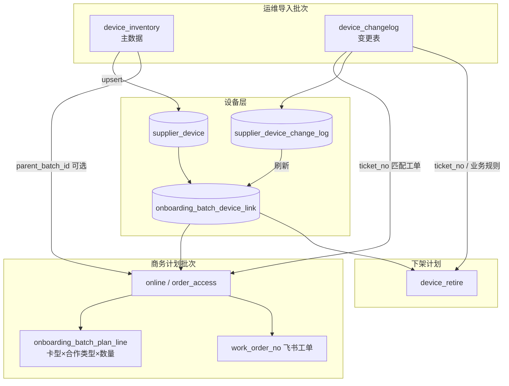
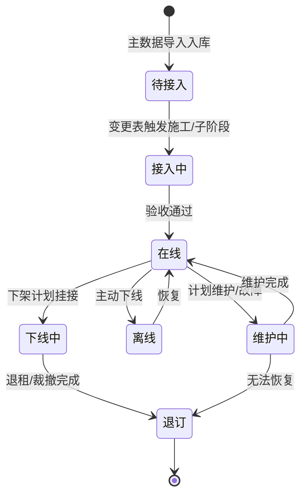
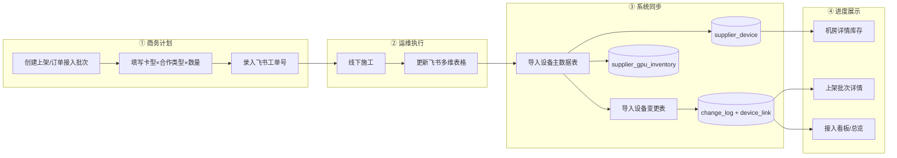
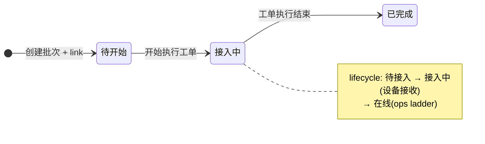
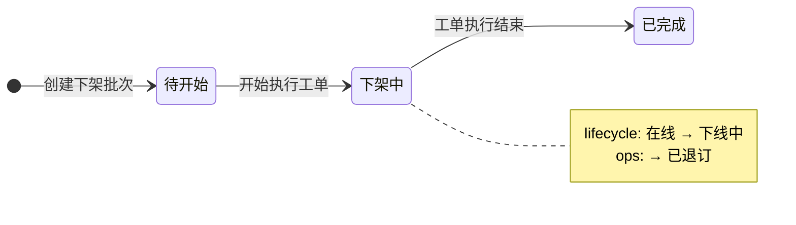

# 供应链运营经理视角 — 完整设备管理全景

**依据**：`packages/db/src/supply-schema.ts`、现有前端页面与组件（机房详情、设备上架、设备下架、物理机台账）、关联设计文档（`supplier-onboarding-plan-changelog-tracking-design.md` v2.2、`supplier-device-import-schema.md`、`supplier-device-retire-design.md`）。

**读者**：供应链运营经理（以下简称「运营经理」）— 负责供应商侧算力资源的接入计划、进度跟踪、库存可见性与下架协同，与商务、运维、财务分工协作。

**文档性质**：产品全景与操作指南；描述「当前已实现能力 + 数据模型目标态」，便于运营经理建立端到端心智模型。

**版本**：v1.2（2026-05-29）

**导航变更（计划）**：侧栏三项（设备上架 / 订单接入 / 设备下架）合并为 **「计划批次」** → `/supplier/online-tasks`（类型筛选 + 列表 Badge，无 Tab）；**内部占用** 仍独立菜单 → `/supplier/test-holds`。详见 [supplier-planned-batches-hub-design.md](./supplier-planned-batches-hub-design.md)。

---

## 1. 一句话定位

运营经理在系统中的核心工作是：**把商务谈好的接入计划（批次）与运维落地的物理机台账（设备）对齐**，通过工单号与变更表驱动进度，在机房维度掌握 GPU 总量、在线率与下架进度，直至设备可售或有序退订。

---

## 2. 运营经理的核心诉求


| 诉求 | 说明 | 系统支撑 |
|------|------|----------|
| **看得见** | 供应商 → 机房 → 卡型 → 单台 SN 逐级下钻 | 机房详情聚合库存、`/supplier/devices` 物理机台账 |
| **计划接得住** | 卡型 × 合作类型 × 数量 + 飞书工单，可创建并跟踪上架/订单接入批次 | `onboarding_batch`（`online` / `order_access`） |
| **落地对得上** | 运维导入主数据与变更表后，进度自动刷新 | `device_inventory` / `device_changelog` + `onboarding_batch_device_link` |
| **退得干净** | 按机房发起下架计划，变更挂接后跟踪退订进度 | `device_retire` 批次 + `/supplier/offline-tasks` |
| **算得清** | 机房×卡型成本与合同口径一致 | `supplier_unit_cost`、`supplier_gpu_inventory` |

---

## 3. 三层资源视图

系统采用 **L1 聚合 → L2 物理机 → L3 平台投影** 的分层模型。运营经理日常以 L1 看大盘、以 L2 追单台、以批次看计划完成度。

```
┌─────────────────────────────────────────────────────────────┐
│  L3 平台投影   platform_resource_id / 资源池绑定             │
│                resource_pool_binding                         │
├─────────────────────────────────────────────────────────────┤
│  L2 物理设备   supplier_device（SN 唯一）                     │
│                compute_node（管控/计算节点）                  │
│                supplier_device_change_log（变更审计）         │
├─────────────────────────────────────────────────────────────┤
│  L1 聚合库存   supplier_gpu_inventory（机房×卡型汇总）        │
│                quantity / online_quantity / 成本字段          │
└─────────────────────────────────────────────────────────────┘
```

**运营经理应牢记**：

- **L1 数字**来自物理机汇总，主数据导入（`device_inventory`）后刷新；变更表（`device_changelog`）更新单台状态后间接影响在线量。
- **L2 是真相源**：商务批次进度、下架挂接、故障关联均以 `supplier_device.id` 为准。
- **同一设备可参与多个业务批次**（上架、内部转用、下架），因此 **不能用** `supplier_device.onboarding_batch_id` 关联商务计划批次；该字段仅表示 **最近一次设备主数据导入批次**。

---

## 4. 批次体系：五种 `batch_kind`

所有接入、导入、下架活动统一落在 `onboarding_batch` 表，通过 `batch_kind` 区分语义。**运营经理只需理解三类「业务批次」+ 两类「运维导入批次」。**

### 4.1 批次类型总览


| `batch_kind` | 中文名 | 谁创建 | 核心字段 | 运营经理关注点 |
|--------------|--------|--------|----------|----------------|
| `online` | 设备上架批次 | 商务/运营 | `planned_lines_json`、上架原因、`work_order_no` | 计划台数 vs 已关联 vs 已上线 |
| `order_access` | 订单接入批次 | 商务/运营 | 同上 + `order_no` | 订单侧机器接入进度 |
| `device_inventory` | 设备主数据导入 | 运维 | Excel 解析行 → `supplier_device` | 台账是否齐全、库存是否更新 |
| `device_changelog` | 设备变更导入 | 运维 | Excel 变更行 → `change_log` + 批次挂接 | **驱动业务批次进度** |
| `device_retire` | 设备下架批次 | 运营经理 | 下架原因、期望完成日、建议清单 | 挂接进度 vs 退订台数 |

### 4.2 批次之间的关联关系



**关键桥接键**：

| 键 | 用途 |
|----|------|
| `work_order_no` | 商务批次录入的飞书审批工单号；变更表 Excel「工单」列 `ticket_no` 与之匹配 |
| `parent_batch_id` | 导入批次（inventory/changelog）可选指向业务批次，便于审计溯源 |
| `onboarding_batch_device_link` | 设备 ↔ 业务批次多对多；进度统计的唯一依据 |

---

## 5. 物理设备全生命周期（运营视角）

### 5.1 生命周期状态机

物理机 `supplier_device.lifecycle_status` 是运营经理跟踪单台设备的主状态（与 L1 聚合层 `status` 允许短暂不一致，**以物理机为准**）。



**并行维度**（同一设备可同时存在）：

| 字段 | 含义 | 典型值 |
|------|------|--------|
| `ops_status` | 运维侧设备状态（Excel 原文） | 预留闲置中、运行中、已退订… |
| `onboarding_substage` | 接入子阶段 | 网络开通、镜像部署、监控注册… |
| `cooperation_type` | 合作类型 | `idle_time` 闲时合作 / `whole_rent` 整租合作 |
| `in_maintenance` | 是否维护中 | boolean |

### 5.2 端到端作业流（目标态 SOP）



| 步骤 | 角色 | 系统动作 | 页面入口 |
|------|------|----------|----------|
| 1 | 运营/商务 | 创建 `online` 或 `order_access` 批次，状态 `接入中` | `/supplier/online-tasks`、`/supplier/order-access` |
| 2 | 运维 | 线下执行（系统外） | — |
| 3a | 运维 | 上传 **设备主数据表** → `commitInventory` | 机房详情「运维数据导入」 |
| 3b | 运维 | 上传 **设备变更表**（含工单号）→ `commitChangelog` → 刷新批次进度 | 同上 |
| 4 | 运营经理 | 查看计划完成度、在线率、异常标记 | 批次详情、机房详情、总览 |

**下架对称流程**：

| 步骤 | 角色 | 系统动作 | 页面入口 |
|------|------|----------|----------|
| 1 | 运营经理 | 在机房详情发起下架计划（原因、期望完成日、建议清单） | 机房详情「设备下架 / 裁撤」 |
| 2 | 运维 | 执行下架，变更表挂接批次 | 导入设备变更表 |
| 3 | 运营经理 | 跟踪 `touchedDeviceCount / plannedDeviceCount`、退订台数 | `/supplier/offline-tasks`、机房详情「下架批次」 |

---

## 6. 页面地图与模块职责

### 6.1 运营经理日常导航

> **目标态（已确认设计）**：侧栏 **「计划批次」** → `/supplier/online-tasks`（**无 Tab**，类型筛选 + 行内 Badge；仅 `online` / `order_access` / `device_retire`）。侧栏 **「内部占用」** 保留 → `/supplier/test-holds`。旧 `order-access` / `offline-tasks` URL 保留、不 redirect。详见 [supplier-planned-batches-hub-design.md](./supplier-planned-batches-hub-design.md)。

| 路由 | 页面 | 核心能力 | 对应数据表 |
|------|------|----------|------------|
| `/supplier/datacenters/[id]` | 机房详情 | 库存大盘、运维导入、下架发起、下架批次列表、成本面板 | `data_center`、`supplier_gpu_inventory`、`onboarding_batch` |
| `/supplier/online-tasks` | **计划批次** | 类型筛选 + 统一表 + Badge；KPI 随筛选（专篇 §5）；新建上架/订单 | `onboarding_batch`（三 kind） |
| `/supplier/online-tasks/[id]` | 上架批次详情 | 计划进度、导入明细、已挂接设备、关联任务、调整/完成/作废 | 同上 + `plan_line`、`device_link`、`progress_event` |
| `/supplier/order-access` | 订单接入（直链保留） | 侧栏不暴露；列表语义并入计划批次「订单接入」筛选 | `onboarding_batch`（`order_access`） |
| `/supplier/order-access/[id]` | 订单接入详情 | 同上架详情结构 | 同上 |
| `/supplier/offline-tasks` | 设备下架（直链保留） | 侧栏不暴露；列表语义并入计划批次「设备下架」筛选 | `onboarding_batch`（`device_retire`） |
| `/supplier/offline-tasks/[id]` | 下架批次详情 | 已执行设备、建议清单、进度标记、调整/完成/作废 | 同上 + `change_log` |
| `/supplier/test-holds` | **内部占用** | 侧栏独立入口；列表/KPI 与现网一致 | `internal_test_hold` |
| `/supplier/test-holds/[id]` | 占用详情 | 挂接设备、结束占用 | 同上 |
| `/supplier/devices` | 物理机台账 | SN 级列表与详情下钻 | `supplier_device` |
| `/supplier/inventory/[id]` | 聚合库存详情 | 机房×卡型 L1 明细 | `supplier_gpu_inventory` |

### 6.2 机房详情页 — 运营经理的「主控台」

机房详情（`DatacenterDetailContent`）是 **单机房设备管理的枢纽**，运营经理应优先从此页掌握全貌：

**顶部指标卡片**

- GPU 总量 / 在线 GPU / 在线率 / 卡型种类 — 来自 `supplier_gpu_inventory` 聚合
- 物理机台数 / 在线台数 / 维护中台数 — 来自 `supplier_device` 统计

**运维数据导入区**（`DeviceImportCards`）

| 导入类型 | 写入目标 | 运营经理期望结果 |
|----------|----------|------------------|
| 设备主数据 | `supplier_device` + 库存汇总 | 新机器入库、台账字段完整 |
| 设备变更 | `supplier_device_change_log` + 批次挂接 | **上架/下架批次进度刷新** |
| 故障记录 | `fault_incident` | 故障台账更新 |

**下架批次表格**

- 本机房发起的 `device_retire` 批次
- 列：批次号、场景、下架原因、飞书工单、期望完成、批次状态、进度（已挂接/计划）、待复核标记
- 点击批次号 → `/supplier/offline-tasks/[id]`

**操作按钮**

- **编辑信息** / **设为在线·离线** — 机房级可用性（`data_center.status`）
- **设备下架 / 裁撤** — 打开 `DatacenterDeviceRetireDialog` 创建下架计划

### 6.3 计划批次列表 — `/supplier/online-tasks`

**设计专篇**：[supplier-planned-batches-hub-design.md](./supplier-planned-batches-hub-design.md)（侧栏、类型筛选、Badge、KPI）。

- **无 Tab**；筛选条 **类型**（全部 / 上架 / 订单 / 下架）
- **统一表格** + **类型 Badge** 列
- **KPI**：随类型筛选切换（上架/订单一套、下架一套、全部一套，见专篇 §5）
- 快捷操作：`importStatus=parsed` 时可「确认入库」（上架/订单行）

**内部占用**：侧栏 `/supplier/test-holds`，不纳入本页。

详情页（`OnboardingBatchDetailContent`）Tab 结构：

| Tab | 内容 |
|-----|------|
| 上架进度 | 按计划行展示：卡型、合作类型、计划/已关联/已上线、进度条 |
| 导入明细 | CSV 清单解析结果（公网 IP、SN、校验状态）— 若批次走了清单上传 |
| 批次概览 | 供应商、机房、接入方式、合同、工单号、上架原因/订单号 |
| 已入库设备 | 挂接到本批次的物理机列表（SN、生命周期、子阶段、IP） |
| 关联任务 | `onboarding_task` 施工/联调任务 |

**进度指标含义**（详情页顶部四卡片）：

| 指标 | 字段来源 | 含义 |
|------|----------|------|
| 计划上架 | `planned_device_count` / `plan_line.planned_quantity` 合计 | 商务承诺台数 |
| 已关联 | `touched_device_count` / `device_link` 计数 | 变更表已挂接到本批次的设备数 |
| 已上线 | `online_device_count` | 已关联且 `lifecycle_status=在线` |
| 计划完成 | `planned_ready_at` | 目标就绪时间 |

### 6.4 设备下架 — 计划批次筛选与详情

计划批次页 **类型 = 设备下架** 时列表/KPI 对齐原 `OfflineTasksContent`（专篇 §5.2）：

- 统计：批次总数、已下架批次、累计下架设备、累计错误行
- 筛选：供应商、导入状态
- 进度列：`touchedDeviceCount / plannedDeviceCount`（退订 N 台）
- 异常：`progressFlags.needs_review` 显示「待复核」

创建入口仍在 **机房详情**「设备下架 / 裁撤」，不在列表强制新建。

详情页（`DeviceRetireBatchDetailContent`）：

| Tab | 内容 |
|-----|------|
| 已执行设备 | 通过变更表挂接的设备；展示原状态 → 当前状态、运维状态 |
| 建议清单 | 运营经理提交 Excel 时的建议下架列表（解析预览） |
| 批次概览 | 下架原因、期望完成日、场景、飞书工单、进度标记 |

**下架进度标记**（`progress_flags_json`）：

| 标记 | 含义 | 运营经理动作 |
|------|------|--------------|
| `needs_review` | 需人工复核 | 核对挂接设备与计划是否一致 |
| `has_action_mismatch` | 变更动作与下架场景不一致 | 与运维确认变更表 |
| `has_over_plan_link` | 挂接数超过计划 | 评估是否扩大计划或纠正挂接 |
| `completion_mode=auto` | 挂接数 ≥ 计划数，批次自动完成 | 归档、通知商务/财务 |

---

## 7. 进度刷新机制（运营经理必读）

系统通过 `refreshBatchProgress` 在变更表 commit 后自动刷新业务批次缓存字段。**运营经理看到的数字是「可重建的读模型」，不是手工录入。**

### 7.1 上架 / 订单接入批次

```
已关联 (touched) = COUNT(DISTINCT device_link.supplier_device_id)
已上线 (online)  = COUNT(DISTINCT device_link WHERE lifecycle_status = '在线')
```

计划行维度（`onboarding_batch_plan_line`）按 **卡型 + 合作类型** 分别统计 `touched_quantity`、`online_quantity`。

### 7.2 下架批次

```
已挂接 (touched) = COUNT(DISTINCT device_link)
已退订 (retired) = COUNT(DISTINCT device_link WHERE lifecycle='下线中' OR ops_status='已退订')
```

**批次状态自动流转**：

- `待开始` + 有挂接 → `下架中`
- 挂接数 ≥ 计划数 → `已完成`（`completion_mode=auto`）

### 7.3 工单驱动批次进程（方案 A，已定）

**决策**：采用 **方案 A** — **开始执行工单 / 工单执行结束** 只更新 **`onboarding_batch.batch_status`** 与审计 `change_log`；**不**直接把设备 `lifecycle_status` 升为接入中/在线/下线中。设备态仍由 **运维变更动作 + ops 原文** 驱动，与 [`supplier-onboarding-plan-changelog-tracking-design.md`](./supplier-onboarding-plan-changelog-tracking-design.md) §3.4.3 一致。

大盘 Period ETL 对边界动作的处理见 [`global-dashboard-period-analytics.md`](./global-dashboard-period-analytics.md) §2.5。

#### 7.3.1 批次态 vs 设备 lifecycle（勿混用）

| 运营说法 | `batch_status` | 设备 `lifecycle_status` | 谁触发 lifecycle |
|----------|----------------|-------------------------|------------------|
| 创建批次（上架） | `待开始` | `待接入`（已 link） | 创建 + link |
| 开始执行工单（上架） | `接入中` | **仍为 `待接入`**，直到 `设备接收` | `设备接收` → `接入中` |
| 工单执行结束（上架） | `已完成` | 按 ops 目标验收：通常 `在线` | `加入集群`/上架类 ops |
| 创建批次（下架） | `待开始` | **`在线`**（推荐，尚未施工） | 创建 + link |
| 开始执行工单（下架） | `下架中` | **`下线中`**（挂接下架批次） | 挂接 + 开始工单 |
| 工单执行结束（下架） | `已完成` | `下线中` + `ops=已退订`（达标时） | `设备退订` 等 |

> **「待下架 / 下架中」** 是 **批次进程** 用语，对应 `batch_status`；CRM lifecycle 下架侧统一用 **`下线中`**，不新增第六段。

#### 7.3.2 批次内目标 OPS（与运维匹配）

创建批次时在计划/metadata 中约定 **目标终态 ops**（可按 `batch_kind` + 合作类型模板化）：

| `batch_kind` | 目标 ops 示例 | 验收 |
|--------------|---------------|------|
| `online` / `order_access` | `在集群中`、`网关代理裸金属上架中`… | 每台 link 设备 `ops_status` 达目标或计划豁免 |
| `device_retire` | `已退订` | 与 `retire_action_type` 一致 |

**进度 = 运维 ladder 推进**；**完工 = 工单执行结束**（批次闭环）。二者可不一致 → `progress_flags.needs_review`。

#### 7.3.3 变更表新增动作（字典扩展）

| `change_action` | 类型 | 系统行为 |
|-----------------|------|----------|
| `开始执行工单` | 批次边界 | `batch_status` → 接入中/下架中；写 `change_log`；**不改** device ops/lifecycle |
| `工单执行结束` | 批次边界 | `batch_status` → 已完成；写 `change_log`；触发目标 ops 达标检查 |

仍通过 `ticket_no` = `work_order_no` 挂接业务批次。

#### 7.3.4 状态机（上架）



#### 7.3.5 状态机（下架）



#### 7.3.6 与 §7.1 / §7.2 计数的关系

`refreshBatchProgress` **保留**：`touched` / `online` / `retired` 仍由 `device_link` + 设备态统计。

工单起止 **叠加** 批次进程语义，**不替代** 计数；列表/详情同时展示：

- 批次态（待开始 / 接入中 / 下架中 / 已完成）
- 数量进度（已关联 / 已上线 / 已退订）
- 目标 ops 达标率（待实现）

---

## 8. 关键数据实体速查

### 8.1 `supplier_device`（物理机）

| 字段组 | 代表字段 | 运营意义 |
|--------|----------|----------|
| 标识 | `sn`（唯一）、`asset_no`、`external_device_id` | 下架清单匹配、工单沟通 |
| 归属 | `supplier_id`、`data_center_id`、`idc_code` | 必须落在正确机房 |
| 规格 | `gpu_card_type_id`、`gpu_count`、`cooperation_type` | 对齐计划行 |
| 状态 | `lifecycle_status`、`ops_status`、`onboarding_substage` | 进度与可售性 |
| 网络 | `external_ip`、`internal_ip` | 运维对接 |
| 溯源 | `onboarding_batch_id` | **仅** 最近主数据导入批次，非商务批次 |

### 8.2 `onboarding_batch`（批次主表）

| 字段 | 说明 |
|------|------|
| `batch_code` | 对外展示的批次号 |
| `batch_status` | 待开始 / 接入中 / 已完成 / 下架中… |
| `import_status` | 清单/Excel 导入状态机：none → parsed → committed |
| `work_order_no` | 飞书工单（供应商内唯一） |
| `planned_lines_json` | 计划明细 JSON（与 `plan_line` 表双写或择一） |
| `touched_device_count` | 缓存：已关联/已挂接 |
| `online_device_count` | 缓存：已上线（上架批次） |
| `retired_device_count` | 缓存：已退订（下架批次） |
| `retire_reason` / `retire_action_type` / `retire_plan_mode` | 下架场景元信息 |
| `target_ops_status`（建议新增） | 批次验收目标 ops；与运维变更匹配（§7.3.2） |

### 8.3 `supplier_gpu_inventory`（L1 聚合）

每个 `(supplier_id, data_center_id, gpu_card_type_id)` 唯一一行：

- `quantity` — GPU 总数
- `online_quantity` — 在线 GPU 数
- `card_time_cost_per_hour` / `revenue_share_cost_per_hour` — 成本展示
- 主数据导入后同步更新

---

## 9. 角色分工矩阵


| 活动 | 商务 | 运营经理 | 运维 | 系统 |
|------|------|----------|------|------|
| 签合同、接入条件 | ● | ○ 协同 | | |
| 创建上架/订单接入批次 | ○ | ● | | `onboarding_batch` |
| 录入飞书工单号 | ● | ● | | |
| 导入设备主数据 | | ○ 催办 | ● | `device_inventory` |
| 导入设备变更表 | | ○ 验收进度 | ● | `device_changelog` |
| 发起下架计划 | | ● | | `device_retire` |
| 机房上/下线 | | ● | ○ | `data_center.status` |
| 故障记录导入 | | ○ 跟踪 | ● | `fault_incident` |
| 卡型成本维护 | ○ | ● | | `supplier_unit_cost` |

图例：● 主责 ○ 协同

---

## 10. 运营经理 KPI 与看板建议


| 指标 | 计算口径 | 查看位置 |
|------|----------|----------|
| 机房 GPU 在线率 | `online_quantity / quantity` | 机房详情、聚合库存表 |
| 上架计划完成率 | `online_device_count / planned_device_count` | 上架批次详情 |
| 计划行完成率（卡型×合作类型） | `online_quantity / planned_quantity` | 批次详情「上架进度」Tab |
| 接入中批次数量 | `batch_status=接入中` COUNT | 上架/订单接入列表 |
| 下架挂接率 | `touched_device_count / planned_device_count` | 下架列表/详情 |
| 待复核下架批次 | `progress_flags.needs_review` | 下架列表 Badge |
| 物理机维护占比 | `in_maintenance` COUNT / total | 机房详情物理机汇总 |

---

## 11. 典型场景走查

### 场景 A：新机房首批 GPU 上架

1. **商务**：合同生效 → 运营经理在 `/supplier/online-tasks` **新建上架批次**
   - 选择供应商、机房、合同
   - 计划行：如 `A100-80G × 闲时合作 × 32 台`
   - 填写飞书工单号、上架原因（如「新机房上架」）、计划就绪时间
2. **运维**：线下施工 → 在机房详情 **导入设备主数据表**（32 台入库）
3. **运维**：施工完成后 **导入设备变更表**，工单列填写与批次相同的飞书工单号
4. **运营经理**：打开批次详情，确认「已关联 32 / 已上线 32」，批次可标记完成
5. **验收**：机房详情在线率上升；`/supplier/devices` 可逐台 SN 核查

### 场景 B：订单驱动的机器接入

与场景 A 相同，入口改为 `/supplier/order-access`，额外填写 **订单编号** `order_no`。进度机制与上架批次一致。

### 场景 C：机房部分设备下架

1. **运营经理**：进入 `/supplier/datacenters/[id]` → **设备下架 / 裁撤**
   - 选择下架原因（如「硬件升级替换」）、期望完成日
   - 上传建议清单 Excel（设备 ID / SN / 内网 IP 至少填一列）
2. **系统**：创建 `device_retire` 批次，生成批次号
3. **运维**：执行下架后导入变更表，挂接对应工单/批次
4. **运营经理**：在 `/supplier/offline-tasks/[id]` 查看「已执行设备」，关注「待复核」「动作不一致」标记
5. **闭环**：`retired_device_count` 达标、批次 `已完成` → 通知商务/财务

### 场景 D：日常进度巡检

1. 打开 `/supplier/online-tasks`，筛选「接入中」批次
2. 对进度偏低的批次：核对运维是否已导入变更表、工单号是否一致
3. 打开机房详情，看聚合库存在线率与下架批次是否有「待复核」
4. 必要时下钻 `/supplier/devices/[id]` 看单台 `lifecycle_status` 与变更历史

---

## 12. 导入状态机（运营经理识别用）

### 12.1 业务批次清单路径（上架批次可选 CSV）


| `import_status` | 展示文案 | 运营经理动作 |
|-----------------|----------|--------------|
| `none` | 未上传清单 | 正常；可仅依赖主数据+变更表路径 |
| `parsed` | 待确认入库 | 核对解析结果 → 点击「确认入库」 |
| `committed` | 已入库 | 清单路径完成；仍需变更表驱动进度 |
| `parse_failed` | 解析失败 | 联系运维修正文件 |

### 12.2 运维 Excel 导入（机房详情）

设备主数据 / 变更 / 故障三类导入各自有 `import_status` 流转：`uploaded → parsed → committed`，变更表 commit 后触发 **批次进度刷新** 与 **库存重算**。

---

## 13. 与设计文档的对齐说明


| 主题 | 设计约定 | 当前实现要点 |
|------|----------|--------------|
| 设备↔业务批次 | 多对多，经 `device_link` + 变更表 | `supplier_device.onboarding_batch_id` 仅 inventory 批次 |
| 进度来源 | 变更表 `ticket_no` ↔ `work_order_no` | `refreshBatchProgress` 已实现 |
| 下架 | 机房详情入口 + 全局列表 | `DatacenterDeviceRetireDialog` + `OfflineTasksContent` |
| 清单 CSV | 上架批次可选次要路径 | `OnboardingBatchesContent` 支持 parsed → commit |
| 飞书 API | 阶段三，本期手动录入工单号 | 商务在创建批次时填写 |

---

## 14. 附录：相关路由与组件索引


| 组件 | 路径 | 用途 |
|------|------|------|
| `DatacenterDetailContent` | `supplier/_components/datacenter-detail-content.tsx` | 机房主控台 |
| `OnboardingBatchesContent` | `supplier/_components/onboarding-batches-content.tsx` | 上架/订单接入列表 |
| `OnboardingBatchDetailContent` | `supplier/_components/onboarding-batch-detail-content.tsx` | 上架/订单接入详情 |
| `OfflineTasksContent` | `supplier/_components/offline-tasks-content.tsx` | 下架列表 |
| `DeviceRetireBatchDetailContent` | `supplier/_components/device-retire-batch-detail-content.tsx` | 下架详情 |
| `DeviceImportCards` | `components/dashboard/device-import/device-import-cards.tsx` | 三类运维导入入口 |
| `DatacenterDeviceRetireDialog` | `supplier/_components/datacenter-device-retire-dialog.tsx` | 机房下架弹窗 |

**数据库 schema**：`packages/db/src/supply-schema.ts` §3.3–§3.4（批次与设备）、§3.5（运维扩展）。

---

## 15. 总结

运营经理的设备管理全景可以概括为 **「一个枢纽、两条流水线、三张网」**：

- **一个枢纽**：机房详情页 — 看库存、导数据、发下架、跟批次
- **两条流水线**：**接入流水线**（计划批次 → 主数据 → 变更表 → 上线进度）、**退出流水线**（下架计划 → 变更挂接 → 退订确认）
- **三张网**：**计划网**（`onboarding_batch` + `plan_line`）、**台账网**（`supplier_device` + `gpu_inventory`）、**审计网**（`change_log` + `device_link`）

掌握 **工单号** 与 **变更表** 是连接商务计划与运维落地的钥匙；掌握 **批次进度字段** 与 **机房聚合指标** 是日常巡检的核心。

---

## 16. 修订记录

| 版本 | 日期 | 说明 |
|------|------|------|
| v1.0 | 2026-05-27 | 初稿：运营全景、批次体系、进度机制 |
| v1.1 | 2026-05-27 | **§7.3 方案 A**：工单起止驱动 batch_status；lifecycle 仍由运维变更推导；目标 ops 验收 |
